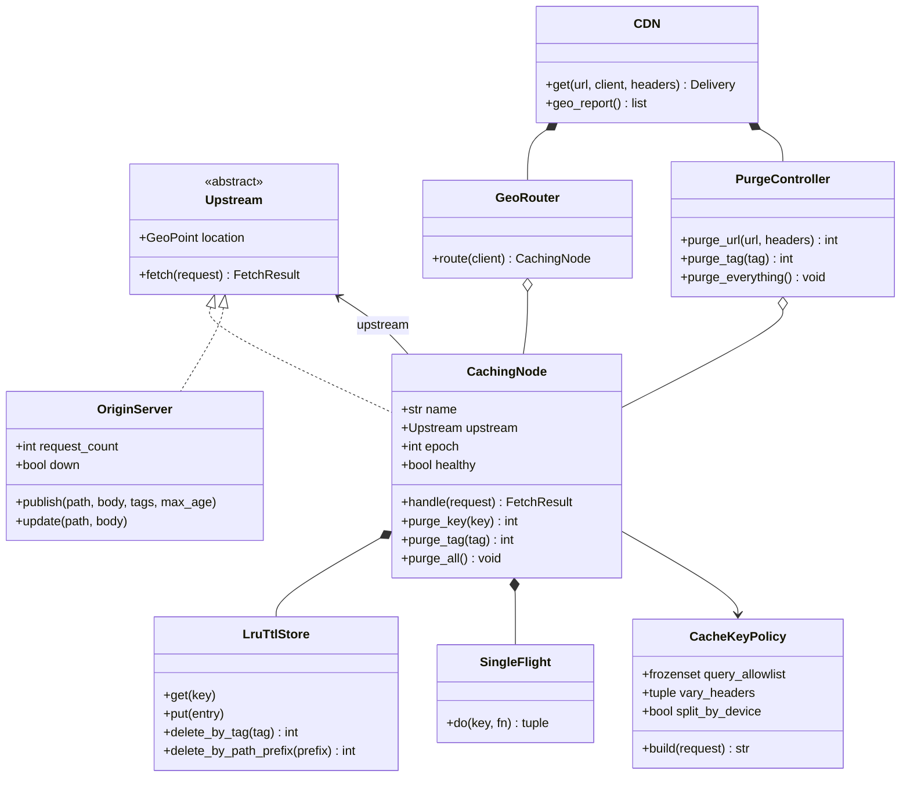
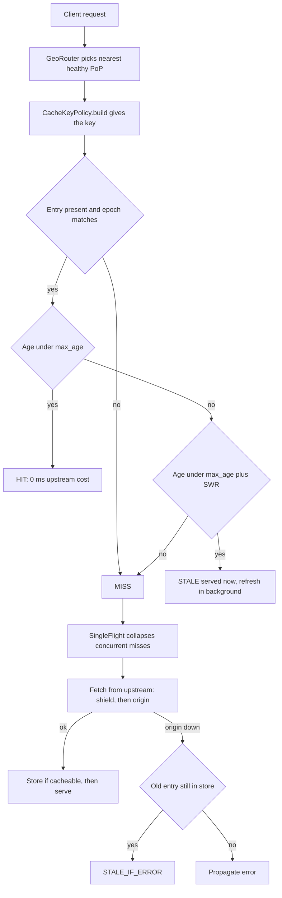

These are all CDN (Content Delivery Network) and web performance concepts. Think of a CDN as a worldwide network of "mini warehouses" that store copies of your website content closer to users.

1. Edge Caching
Simple Definition

Edge caching means storing content (images, videos, CSS, JavaScript, API responses, etc.) on CDN servers located near users.

Instead of every request going to your main server, users get content from a nearby CDN location called an edge server.

Without Edge Caching
User (India)
      |
      v
Origin Server (USA)


Every request travels across the globe.

With Edge Caching
User (India)
      |
      v
CDN Edge Server (Mumbai)
      |
      v
Origin Server (USA)  <-- only if cache miss


The content is delivered much faster.

Real-World Example 1: Netflix

When you watch a movie on Netflix, the video is often served from servers located near your ISP instead of directly from Netflix's central data center.

Result:

Faster streaming
Less buffering
Real-World Example 2: Company Website

You upload a product image:

product.jpg


A customer in India visits your website.

First request:

CDN fetches image from USA server.
Stores it locally.

Next 10,000 Indian users:

Get image from local CDN cache.
No need to hit USA server again.
2. Cache Keys
Simple Definition

A cache key is the unique identifier used by a CDN to decide whether it already has cached content.

Think of it like a filing cabinet label.

Example

Request:

https://shop.com/products/123


The cache key could be:

products/123


The CDN checks:

"Do I already have this cached?"

If yes:

Cache Hit

If no:

Cache Miss
Real-World Example 1: E-commerce Product Page

Requests:

/product/100
/product/101


Different cache keys:

product-100
product-101


Each page is cached separately.

Real-World Example 2: Language-Based Website

Requests:

/home?lang=en
/home?lang=fr


If the cache key includes lang:

home-en
home-fr


Users get the correct language page.

If the cache key ignores lang:

French users may see English content.
Wrong content gets cached.
Everyday Analogy

Amazon package tracking:

Package #12345
Package #67890


Each package has a unique ID.

Similarly:

Page A -> Cache Key A
Page B -> Cache Key B

3. Origin Shielding
Simple Definition

Origin Shielding adds an extra caching layer between CDN edge servers and your actual origin server.

Without shielding, many edge locations may hit your origin.

With shielding, only one designated shield cache talks to the origin.

Without Origin Shield
India Edge ------\
Europe Edge ------> Origin Server
USA Edge --------/


Three edge servers may request the same file.

With Origin Shield
India Edge \
Europe Edge --> Shield Cache --> Origin Server
USA Edge   /


Only the shield talks to the origin.

Real-World Example 1: Viral News Article

A news article suddenly becomes viral.

Millions of requests come from:

India
Europe
America

Without shielding:

Many CDN locations ask origin for the article.
Origin can be overwhelmed.

With shielding:

Shield cache fetches article once.
All edge locations get it from shield.

Origin load dramatically reduces.

Real-World Example 2: Software Download

A company releases:

app.zip (5 GB)


Thousands of users download it worldwide.

Shield cache fetches once from origin.

Edge locations reuse it.

Result:

Lower bandwidth costs
Reduced origin traffic
4. Geo-Performance
Simple Definition

Geo-performance measures how fast users experience your website in different geographic regions.

A site might be fast in New York but slow in India or Australia.

The goal is:

Deliver good performance regardless of user location.

Real-World Example 1: US-Hosted Website

Server:

New York


Users:

New York → 20 ms
London → 80 ms
Mumbai → 250 ms

Mumbai users experience slower performance because data travels farther.

Real-World Example 2: Online Gaming

Game server in California.

Players:

California → low latency
Singapore → high latency

Players farther away experience:

Lag
Delays
Poor gameplay

Companies add regional servers to improve geo-performance.

Everyday Analogy

Ordering food:

Local restaurant:

15 minutes

Restaurant 100 km away:

2 hours

Closer service gives better performance.

5. Cache Purge
Simple Definition

A cache purge removes cached content from CDN servers before it naturally expires.

It tells the CDN:

"Forget the old version and fetch a fresh copy."

Real-World Example 1: Website Logo Update

Old logo:

logo.png


New logo uploaded.

CDN still serves old cached version.

You perform a cache purge.

Next request:

CDN fetches new logo.
Users immediately see updated branding.
Real-World Example 2: Pricing Error

Your website shows:

Laptop: $99


Correct price:

Laptop: $999


CDN cached the incorrect page.

You purge the page cache.

Users now receive the corrected price instantly.

How They All Work Together

Imagine Amazon launches a new product page:

Edge Caching

Product page gets stored on CDN servers worldwide.

Cache Key

CDN identifies the page using a unique key.

Origin Shielding

Only shield cache communicates with Amazon's origin server.

Geo-Performance

Customers in India, Europe, and the US get fast responses.

Cache Purge

When price or inventory changes, Amazon purges the old cached page.
Quick Summary
Concept In One SentenceEdge Caching Store content close to users on CDN edge servers.
Cache Key Unique identifier used to find cached content.
Origin Shielding Extra cache layer that protects the origin server from excessive requests.
Geo-Performance How well a site performs for users in different regions.
Cache Purge Removing old cached content so fresh content is served.
Easy Memory Trick

Think of a library system:

Edge Caching = Local library branch keeps copies of popular books.
Cache Key = Book ISBN number.
Origin Shielding = Regional library hub supplies local branches.
Geo-Performance = How close the library is to you.
Cache Purge = Removing outdated book editions and replacing them with new ones.

---

# Low-Level Design: A Runnable CDN in Python

Everything above is the *what*. This section is the *how* — a single-file, standard-library-only
implementation where each of the five concepts is a real class you can run and instrument.

| Concept above | Class below |
|---|---|
| Edge caching | `CachingNode` + `LruTtlStore` |
| Cache keys | `CacheKeyPolicy` |
| Origin shielding | `CachingNode` again, wired as the single parent of every edge |
| Geo-performance | `GeoRouter` + haversine latency model |
| Cache purge | `PurgeController` (exact key / tag / prefix / epoch) |

The central insight: **an edge server and a shield cache are the same object, wired differently.**
`edge.upstream = shield`, `shield.upstream = origin`. Add a third layer and nothing else changes.

## 1. Class model



## 2. Lookup decision flow



## 3. The code

```python
"""Low-level design of a CDN edge network.

Standard library only.  Run:  python cdn_lld.py
"""

from __future__ import annotations

import math
import threading
import time
from abc import ABC, abstractmethod
from collections import OrderedDict, defaultdict
from dataclasses import dataclass, field
from typing import Callable, Iterable, Union
from urllib.parse import parse_qsl, urlsplit


# ---------------------------------------------------------------------------
# 0. Errors, clock, geography
# ---------------------------------------------------------------------------
class CdnError(Exception):
    pass


class OriginUnavailable(CdnError):
    pass


class NoHealthyPoP(CdnError):
    pass


class Clock:
    def now(self) -> float:
        return time.monotonic()


class ManualClock(Clock):
    """Deterministic clock so TTL / stale-while-revalidate stay testable."""

    def __init__(self, start: float = 0.0) -> None:
        self._t = start

    def now(self) -> float:
        return self._t

    def advance(self, seconds: float) -> None:
        self._t += seconds


@dataclass(frozen=True)
class GeoPoint:
    name: str
    lat: float
    lon: float


EARTH_RADIUS_KM = 6371.0
# Light in fibre covers ~200 km/ms, so a round trip costs distance / 100 ms.
KM_PER_MS_RTT = 100.0
# TLS + TCP + server work that raw distance does not explain.
LINK_OVERHEAD_MS = 4.0


def haversine_km(a: GeoPoint, b: GeoPoint) -> float:
    lat1, lon1, lat2, lon2 = map(math.radians, (a.lat, a.lon, b.lat, b.lon))
    dlat, dlon = lat2 - lat1, lon2 - lon1
    h = math.sin(dlat / 2) ** 2 + math.cos(lat1) * math.cos(lat2) * math.sin(dlon / 2) ** 2
    return 2 * EARTH_RADIUS_KM * math.asin(math.sqrt(h))


def link_rtt_ms(a: GeoPoint, b: GeoPoint) -> float:
    return haversine_km(a, b) / KM_PER_MS_RTT + LINK_OVERHEAD_MS


def percentile(values: list[float], pct: float) -> float:
    if not values:
        return 0.0
    ordered = sorted(values)
    rank = max(1, math.ceil(pct / 100.0 * len(ordered)))
    return ordered[rank - 1]


# ---------------------------------------------------------------------------
# 1. Request / Response
# ---------------------------------------------------------------------------
@dataclass
class Request:
    url: str
    client: GeoPoint
    headers: dict[str, str] = field(default_factory=dict)

    def __post_init__(self) -> None:
        self.headers = {k.lower(): v for k, v in self.headers.items()}

    def header(self, name: str) -> str:
        return self.headers.get(name.lower(), "")


_CACHEABLE_STATUS = frozenset({200, 203, 301, 404, 410})


@dataclass(frozen=True)
class Response:
    status: int
    body: bytes
    etag: str
    max_age: float                       # Cache-Control: s-maxage
    stale_while_revalidate: float        # grace window after max_age
    tags: frozenset[str]                 # Surrogate-Key, the unit of tag purges

    def is_cacheable(self) -> bool:
        return self.status in _CACHEABLE_STATUS and self.max_age > 0


# ---------------------------------------------------------------------------
# 2. Cache keys
# ---------------------------------------------------------------------------
def classify_device(user_agent: str) -> str:
    ua = user_agent.lower()
    return "mobile" if ("mobi" in ua or "android" in ua) else "desktop"


@dataclass(frozen=True)
class CacheKeyPolicy:
    """Turns a request into the string the cache is indexed by.

    Every dimension added multiplies cardinality (lower hit ratio); every
    dimension forgotten risks serving one user's variant to another.
    Allowlist query params rather than denylisting: unknown params such as
    ?utm_source=... must never fragment the cache.
    """

    query_allowlist: frozenset[str] = frozenset()
    vary_headers: tuple[str, ...] = ()
    split_by_device: bool = False

    def build(self, request: Request) -> str:
        parts = urlsplit(request.url)
        path = parts.path or "/"
        if len(path) > 1:
            path = path.rstrip("/")
        query = sorted(
            (k, v)
            for k, v in parse_qsl(parts.query, keep_blank_values=True)
            if k in self.query_allowlist
        )
        segments = [
            parts.scheme or "https",
            parts.netloc.lower(),
            path,
            "&".join(f"{k}={v}" for k, v in query),
        ]
        # Normalise high-cardinality headers into a handful of buckets.
        segments.extend(f"{h}={request.header(h)}" for h in self.vary_headers)
        if self.split_by_device:
            segments.append(f"device={classify_device(request.header('user-agent'))}")
        return "|".join(segments)

    @staticmethod
    def path_of(key: str) -> str:
        return key.split("|")[2]


# ---------------------------------------------------------------------------
# 3. Bounded store: LRU eviction + TTL freshness + tag index
# ---------------------------------------------------------------------------
@dataclass
class CacheEntry:
    key: str
    response: Response
    stored_at: float
    epoch: int

    def age(self, now: float) -> float:
        return now - self.stored_at

    def is_fresh(self, now: float) -> bool:
        return self.age(now) < self.response.max_age

    def is_serveable_stale(self, now: float) -> bool:
        window = self.response.max_age + self.response.stale_while_revalidate
        return self.age(now) < window


class LruTtlStore:
    """Bounded LRU with a tag -> keys reverse index so tag purges stay cheap."""

    def __init__(self, capacity: int) -> None:
        if capacity <= 0:
            raise ValueError("capacity must be positive")
        self._capacity = capacity
        self._entries: OrderedDict[str, CacheEntry] = OrderedDict()
        self._keys_by_tag: dict[str, set[str]] = defaultdict(set)
        self._lock = threading.RLock()
        self.evictions = 0

    def __len__(self) -> int:
        with self._lock:
            return len(self._entries)

    def get(self, key: str) -> CacheEntry | None:
        with self._lock:
            entry = self._entries.get(key)
            if entry is not None:
                self._entries.move_to_end(key)
            return entry

    def put(self, entry: CacheEntry) -> None:
        with self._lock:
            previous = self._entries.pop(entry.key, None)
            if previous is not None:
                self._drop_tags(previous)
            self._entries[entry.key] = entry
            for tag in entry.response.tags:
                self._keys_by_tag[tag].add(entry.key)
            while len(self._entries) > self._capacity:
                _, victim = self._entries.popitem(last=False)
                self._drop_tags(victim)
                self.evictions += 1

    def delete(self, key: str) -> int:
        with self._lock:
            entry = self._entries.pop(key, None)
            if entry is None:
                return 0
            self._drop_tags(entry)
            return 1

    def delete_by_tag(self, tag: str) -> int:
        with self._lock:
            return sum(self.delete(key) for key in list(self._keys_by_tag.get(tag, ())))

    def delete_by_path_prefix(self, prefix: str) -> int:
        # O(n) scan over the whole store: exactly why production CDNs push you
        # towards surrogate-key tags instead of wildcard purges.
        with self._lock:
            doomed = [k for k in self._entries if CacheKeyPolicy.path_of(k).startswith(prefix)]
            return sum(self.delete(key) for key in doomed)

    def _drop_tags(self, entry: CacheEntry) -> None:
        for tag in entry.response.tags:
            keys = self._keys_by_tag.get(tag)
            if keys is None:
                continue
            keys.discard(entry.key)
            if not keys:
                del self._keys_by_tag[tag]


# ---------------------------------------------------------------------------
# 4. Request coalescing (thundering-herd protection)
# ---------------------------------------------------------------------------
class _Call:
    __slots__ = ("event", "value", "error")

    def __init__(self) -> None:
        self.event = threading.Event()
        self.value: object = None
        self.error: BaseException | None = None


class SingleFlight:
    """N concurrent misses on one key produce exactly ONE upstream fetch."""

    def __init__(self) -> None:
        self._lock = threading.Lock()
        self._calls: dict[str, _Call] = {}

    def do(self, key: str, fn: Callable[[], object]) -> tuple[object, bool]:
        """Returns (value, did_fetch). Followers get did_fetch=False."""
        with self._lock:
            call = self._calls.get(key)
            leader = call is None
            if leader:
                call = _Call()
                self._calls[key] = call
        assert call is not None
        if not leader:
            call.event.wait()
            if call.error is not None:
                raise call.error
            return call.value, False
        try:
            call.value = fn()
        except BaseException as exc:  # noqa: BLE001 - propagated to every waiter
            call.error = exc
        finally:
            with self._lock:
                self._calls.pop(key, None)
            call.event.set()
        if call.error is not None:
            raise call.error
        return call.value, True


# ---------------------------------------------------------------------------
# 5. Upstreams: the origin, and anything that can answer a fetch
# ---------------------------------------------------------------------------
@dataclass
class FetchResult:
    response: Response
    outcome: str
    service_ms: float           # network + work spent above this node


class Upstream(ABC):
    location: GeoPoint

    @abstractmethod
    def fetch(self, request: Request) -> FetchResult:
        ...


@dataclass
class OriginObject:
    body: Union[bytes, Callable[[Request], bytes]]
    tags: frozenset[str]
    max_age: float
    stale_while_revalidate: float
    version: int = 1


class OriginServer(Upstream):
    def __init__(self, location: GeoPoint, processing_ms: float = 45.0, io_delay_s: float = 0.0) -> None:
        self.location = location
        self.processing_ms = processing_ms
        self._io_delay_s = io_delay_s           # real sleep, exposes herds
        self._objects: dict[str, OriginObject] = {}
        self._lock = threading.Lock()
        self.request_count = 0
        self.down = False

    def publish(
        self,
        path: str,
        body: Union[bytes, Callable[[Request], bytes]],
        *,
        tags: Iterable[str] = (),
        max_age: float = 60.0,
        stale_while_revalidate: float = 30.0,
    ) -> None:
        self._objects[path] = OriginObject(body, frozenset(tags), max_age, stale_while_revalidate)

    def update(self, path: str, body: Union[bytes, Callable[[Request], bytes]]) -> None:
        obj = self._objects[path]
        obj.body = body
        obj.version += 1

    def fetch(self, request: Request) -> FetchResult:
        with self._lock:
            self.request_count += 1
        if self.down:
            raise OriginUnavailable(f"{self.location.name} is unreachable")
        if self._io_delay_s:
            time.sleep(self._io_delay_s)
        path = urlsplit(request.url).path or "/"
        obj = self._objects.get(path)
        if obj is None:
            missing = Response(404, b"not found", etag="", max_age=5.0,
                               stale_while_revalidate=0.0, tags=frozenset())
            return FetchResult(missing, "ORIGIN(404)", self.processing_ms)
        body = obj.body(request) if callable(obj.body) else obj.body
        response = Response(
            status=200,
            body=body,
            etag=f'W/"{path}-v{obj.version}"',
            max_age=obj.max_age,
            stale_while_revalidate=obj.stale_while_revalidate,
            tags=obj.tags,
        )
        return FetchResult(response, "ORIGIN", self.processing_ms)


# ---------------------------------------------------------------------------
# 6. The caching node -- an edge and a shield are the SAME object, wired
#    differently.  edge.upstream = shield;  shield.upstream = origin.
# ---------------------------------------------------------------------------
@dataclass
class CacheStats:
    hits: int = 0
    misses: int = 0
    stale_hits: int = 0
    collapsed: int = 0
    stale_if_error: int = 0

    @property
    def hit_ratio(self) -> float:
        served = self.hits + self.stale_hits + self.misses
        return 0.0 if served == 0 else (self.hits + self.stale_hits) / served


class CachingNode(Upstream):
    def __init__(
        self,
        name: str,
        location: GeoPoint,
        upstream: Upstream,
        key_policy: CacheKeyPolicy,
        capacity: int = 1000,
        clock: Clock | None = None,
    ) -> None:
        self.name = name
        self.location = location
        self.upstream = upstream
        self.key_policy = key_policy
        self.store = LruTtlStore(capacity)
        self.clock = clock or Clock()
        self.stats = CacheStats()
        self.epoch = 0            # bumped by a soft purge-all
        self.healthy = True
        self._flight = SingleFlight()

    def __repr__(self) -> str:
        return f"<{self.name} @{self.location.name}>"

    @property
    def upstream_rtt_ms(self) -> float:
        return link_rtt_ms(self.location, self.upstream.location)

    def fetch(self, request: Request) -> FetchResult:
        return self.handle(request)

    def handle(self, request: Request) -> FetchResult:
        key = self.key_policy.build(request)
        now = self.clock.now()
        entry = self.store.get(key)

        if entry is not None and entry.epoch == self.epoch:
            if entry.is_fresh(now):
                self.stats.hits += 1
                return FetchResult(entry.response, f"{self.name}:HIT", 0.0)
            if entry.is_serveable_stale(now):
                # Serve instantly, refresh out of band: latency never pays for TTL expiry.
                self.stats.stale_hits += 1
                self._revalidate_async(key, request)
                return FetchResult(entry.response, f"{self.name}:STALE", 0.0)

        self.stats.misses += 1
        try:
            result, did_fetch = self._flight.do(key, lambda: self._fetch_and_store(key, request))
        except OriginUnavailable:
            if entry is None:
                raise
            self.stats.stale_if_error += 1      # stale-if-error beats a 5xx
            return FetchResult(entry.response, f"{self.name}:STALE_IF_ERROR", 0.0)
        assert isinstance(result, FetchResult)
        if not did_fetch:
            self.stats.collapsed += 1
        return FetchResult(result.response, f"{self.name}:MISS -> {result.outcome}", result.service_ms)

    def _fetch_and_store(self, key: str, request: Request) -> FetchResult:
        upstream_result = self.upstream.fetch(request)
        response = upstream_result.response
        if response.is_cacheable():
            self.store.put(CacheEntry(key, response, self.clock.now(), self.epoch))
        return FetchResult(response, upstream_result.outcome,
                           self.upstream_rtt_ms + upstream_result.service_ms)

    def _revalidate_async(self, key: str, request: Request) -> None:
        def run() -> None:
            try:
                self._flight.do(key, lambda: self._fetch_and_store(key, request))
            except CdnError:
                pass          # keep serving stale; a failed refresh must not kill the node

        threading.Thread(target=run, name=f"{self.name}-revalidate", daemon=True).start()

    # -- invalidation -------------------------------------------------------
    def purge_key(self, key: str) -> int:
        return self.store.delete(key)

    def purge_tag(self, tag: str) -> int:
        return self.store.delete_by_tag(tag)

    def purge_path_prefix(self, prefix: str) -> int:
        return self.store.delete_by_path_prefix(prefix)

    def purge_all(self) -> None:
        # O(1) soft purge: every existing entry now fails the epoch check and
        # is reclaimed lazily by LRU. No multi-million-key delete storm.
        self.epoch += 1


# ---------------------------------------------------------------------------
# 7. Geo routing
# ---------------------------------------------------------------------------
class GeoRouter:
    """Anycast/GeoDNS in miniature: nearest healthy PoP wins."""

    def __init__(self, edges: list[CachingNode]) -> None:
        if not edges:
            raise ValueError("at least one edge PoP is required")
        self._edges = list(edges)

    def route(self, client: GeoPoint) -> CachingNode:
        healthy = [e for e in self._edges if e.healthy]
        if not healthy:
            raise NoHealthyPoP("every PoP is drained")
        return min(healthy, key=lambda e: haversine_km(client, e.location))


# ---------------------------------------------------------------------------
# 8. Purge fan-out
# ---------------------------------------------------------------------------
class PurgeController:
    """Fans invalidation out to every cache layer, innermost layer first.

    Order matters: purge the shield before the edges, otherwise an edge that
    refills mid-purge pulls the stale copy straight back out of the shield.
    """

    def __init__(self, nodes: list[CachingNode], key_policy: CacheKeyPolicy) -> None:
        self._nodes = sorted(nodes, key=self._hops_to_origin)
        self._key_policy = key_policy

    @staticmethod
    def _hops_to_origin(node: CachingNode) -> int:
        hops, current = 0, node
        while isinstance(current, CachingNode):
            hops += 1
            current = current.upstream
        return hops

    def purge_url(self, url: str, headers: dict[str, str] | None = None) -> int:
        """Exact-key purge. Only kills the ONE variant you describe -- with
        Vary or device splitting you must repeat this per variant."""
        key = self._key_policy.build(Request(url, ANYWHERE, headers or {}))
        return sum(node.purge_key(key) for node in self._nodes)

    def purge_tag(self, tag: str) -> int:
        """Preferred: one call kills every variant and every URL sharing the tag."""
        return sum(node.purge_tag(tag) for node in self._nodes)

    def purge_path_prefix(self, prefix: str) -> int:
        return sum(node.purge_path_prefix(prefix) for node in self._nodes)

    def purge_everything(self) -> None:
        for node in self._nodes:
            node.purge_all()


# ---------------------------------------------------------------------------
# 9. Facade + latency bookkeeping
# ---------------------------------------------------------------------------
@dataclass
class Delivery:
    body: bytes
    outcome: str
    pop: str
    latency_ms: float


class CDN:
    def __init__(self, router: GeoRouter, purge: PurgeController) -> None:
        self.router = router
        self.purge = purge
        self._latency: dict[str, list[float]] = defaultdict(list)

    def get(self, url: str, client: GeoPoint, headers: dict[str, str] | None = None) -> Delivery:
        request = Request(url, client, headers or {})
        edge = self.router.route(client)
        result = edge.handle(request)
        latency = link_rtt_ms(client, edge.location) + result.service_ms
        self._latency[client.name].append(latency)
        return Delivery(result.response.body, result.outcome, edge.location.name, round(latency, 1))

    def geo_report(self) -> list[tuple[str, int, float, float]]:
        return [
            (region, len(samples), round(percentile(samples, 50), 1), round(percentile(samples, 95), 1))
            for region, samples in sorted(self._latency.items())
        ]


# ---------------------------------------------------------------------------
# 10. Demo topology
# ---------------------------------------------------------------------------
MUMBAI = GeoPoint("Mumbai", 19.076, 72.877)
FRANKFURT = GeoPoint("Frankfurt", 50.110, 8.682)
ASHBURN = GeoPoint("Ashburn", 39.043, -77.487)
LONDON = GeoPoint("London", 51.507, -0.128)
NEW_YORK = GeoPoint("New York", 40.713, -74.006)
SYDNEY = GeoPoint("Sydney", -33.868, 151.209)
ORIGIN_LOC = GeoPoint("origin-us-east", 39.043, -77.487)
ANYWHERE = GeoPoint("anywhere", 0.0, 0.0)

EDGE_LOCATIONS = [MUMBAI, FRANKFURT, ASHBURN]
DESKTOP = {"accept-encoding": "gzip", "user-agent": "Mozilla/5.0 (Windows NT 10.0)"}
PHONE = {"accept-encoding": "gzip", "user-agent": "Mozilla/5.0 (Linux; Android 14) Mobile"}


def build_network(clock: Clock, *, shielded: bool = True, origin_io_delay: float = 0.0):
    origin = OriginServer(ORIGIN_LOC, processing_ms=45.0, io_delay_s=origin_io_delay)
    policy = CacheKeyPolicy(
        query_allowlist=frozenset({"lang"}),
        vary_headers=("accept-encoding",),
        split_by_device=True,
    )
    # The shield lives in the PoP closest to the origin.
    shield = CachingNode("shield-IAD", ASHBURN, origin, policy, capacity=50_000, clock=clock) if shielded else None
    parent: Upstream = shield if shield is not None else origin
    edges = [
        CachingNode(f"edge-{loc.name}", loc, parent, policy, capacity=1_000, clock=clock)
        for loc in EDGE_LOCATIONS
    ]
    nodes = ([shield] if shield is not None else []) + edges
    cdn = CDN(GeoRouter(edges), PurgeController(nodes, policy))

    origin.publish(
        "/product/123",
        lambda req: b"Laptop $99",
        tags=["product-123", "catalog"],
        max_age=30.0,
        stale_while_revalidate=60.0,
    )
    origin.publish("/news/viral", b"Breaking news body", tags=["news"], max_age=30.0)
    origin.publish(
        "/home",
        lambda req: b"Bonjour" if "lang=fr" in req.url else b"Hello",
        tags=["home"],
        max_age=30.0,
    )
    return cdn, origin, shield, edges


def _show(label: str, delivery: Delivery) -> None:
    print(f"  {label:<46} {delivery.outcome:<46} {delivery.latency_ms:>7.1f} ms")


def demo() -> None:
    clock = ManualClock()
    cdn, origin, shield, edges = build_network(clock)
    policy = edges[0].key_policy

    print("\n1. EDGE CACHING + CACHE KEYS ------------------------------------")
    _show("Mumbai, cold", cdn.get("https://shop.com/product/123?lang=en", MUMBAI, DESKTOP))
    _show("Mumbai, warm", cdn.get("https://shop.com/product/123?lang=en", MUMBAI, DESKTOP))
    _show("same page + utm tracking junk",
          cdn.get("https://shop.com/product/123?lang=en&utm_source=mail", MUMBAI, DESKTOP))
    _show("?lang=fr -> different key", cdn.get("https://shop.com/home?lang=fr", MUMBAI, DESKTOP))
    _show("phone -> different device bucket", cdn.get("https://shop.com/home?lang=fr", MUMBAI, PHONE))
    print("  key(en, desktop) =", policy.build(Request("https://shop.com/home?lang=en", MUMBAI, DESKTOP)))
    print("  key(fr, mobile)  =", policy.build(Request("https://shop.com/home?lang=fr", MUMBAI, PHONE)))

    print("\n2. ORIGIN SHIELDING ---------------------------------------------")
    for shielded in (False, True):
        c, o, _, _ = build_network(ManualClock(), shielded=shielded)
        for client in (MUMBAI, LONDON, NEW_YORK, SYDNEY):
            c.get("https://shop.com/news/viral", client)
        print(f"  shielded={str(shielded):<5} -> origin requests for 4 cold clients "
              f"across 3 PoPs = {o.request_count}")

    print("\n3. THUNDERING HERD ON A COLD KEY --------------------------------")
    herd_cdn, herd_origin, _, _ = build_network(ManualClock(), origin_io_delay=0.05)
    threads = [
        threading.Thread(target=lambda: herd_cdn.get("https://shop.com/news/viral", MUMBAI))
        for _ in range(50)
    ]
    for t in threads:
        t.start()
    for t in threads:
        t.join()
    bom = herd_cdn.router.route(MUMBAI)
    print(f"  50 concurrent misses -> origin requests = {herd_origin.request_count}, "
          f"collapsed at edge = {bom.stats.collapsed}")

    print("\n4. GEO-PERFORMANCE ----------------------------------------------")
    for client in (MUMBAI, LONDON, NEW_YORK, SYDNEY):
        d = cdn.get("https://shop.com/news/viral", client)
        print(f"  {client.name:<12} -> PoP {d.pop:<12} {d.outcome:<46} {d.latency_ms:>7.1f} ms")
    print("  ! Mumbai PoP drained")
    edges[0].healthy = False
    d = cdn.get("https://shop.com/news/viral", MUMBAI)
    print(f"  {'Mumbai':<12} -> PoP {d.pop:<12} {d.outcome:<46} {d.latency_ms:>7.1f} ms")
    edges[0].healthy = True
    print("  region        n     p50      p95")
    for region, n, p50, p95 in cdn.geo_report():
        print(f"  {region:<12} {n:>3} {p50:>7} {p95:>8}")

    print("\n5. CACHE PURGE ---------------------------------------------------")
    _show("cached price", cdn.get("https://shop.com/product/123?lang=en", MUMBAI, DESKTOP))
    origin.update("/product/123", lambda req: b"Laptop $999")
    d = cdn.get("https://shop.com/product/123?lang=en", MUMBAI, DESKTOP)
    print(f"  after origin fix, no purge -> body={d.body!r}  (stale, {d.outcome})")
    killed = cdn.purge.purge_tag("product-123")
    d = cdn.get("https://shop.com/product/123?lang=en", MUMBAI, DESKTOP)
    print(f"  purge_tag('product-123') dropped {killed} entries -> body={d.body!r}")
    print(f"  purge_url dropped {cdn.purge.purge_url('https://shop.com/home?lang=fr', DESKTOP)} "
          f"entries = 1 variant x 2 layers; the mobile fr variant survives")
    cdn.purge.purge_everything()
    print(f"  purge_everything() -> edge epoch now {edges[0].epoch}, "
          f"{len(edges[0].store)} entries still resident but unreadable")

    print("\n6. TTL, STALE-WHILE-REVALIDATE, STALE-IF-ERROR -------------------")
    clock2 = ManualClock()
    cdn2, origin2, shield2, edges2 = build_network(clock2)
    _show("t=0 cold", cdn2.get("https://shop.com/product/123", MUMBAI, DESKTOP))
    clock2.advance(10)
    _show("t=10 within max_age(30)", cdn2.get("https://shop.com/product/123", MUMBAI, DESKTOP))
    origin2.update("/product/123", lambda req: b"Laptop $999")
    clock2.advance(40)
    _show("t=50 stale, served instantly", cdn2.get("https://shop.com/product/123", MUMBAI, DESKTOP))
    time.sleep(0.1)                      # let the background revalidation land
    print("  refresh cascades one layer per cycle: shield pulled $999, edge has not yet")
    clock2.advance(35)
    _show("t=85 stale again", cdn2.get("https://shop.com/product/123", MUMBAI, DESKTOP))
    time.sleep(0.1)
    d = cdn2.get("https://shop.com/product/123", MUMBAI, DESKTOP)
    print(f"  converged -> body={d.body!r} ({d.outcome})")
    origin2.down = True
    shield2.epoch += 1                   # force the shield to miss too
    clock2.advance(500)
    d = cdn2.get("https://shop.com/product/123", MUMBAI, DESKTOP)
    print(f"  origin down, past every window -> {d.outcome}, body={d.body!r}")

    print("\n7. STATS ---------------------------------------------------------")
    for node in [shield] + edges:
        s = node.stats
        print(f"  {node.name:<16} hits={s.hits:<3} stale={s.stale_hits:<3} miss={s.misses:<3} "
              f"collapsed={s.collapsed:<3} evictions={node.store.evictions:<3} "
              f"hit_ratio={s.hit_ratio:.0%}")
    print(f"  origin requests total = {origin.request_count}")


if __name__ == "__main__":
    demo()
```

## 4. Actual output

```text
1. EDGE CACHING + CACHE KEYS ------------------------------------
  Mumbai, cold                                   edge-Mumbai:MISS -> shield-IAD:MISS -> ORIGIN    185.5 ms
  Mumbai, warm                                   edge-Mumbai:HIT                                    4.0 ms
  same page + utm tracking junk                  edge-Mumbai:HIT                                    4.0 ms
  ?lang=fr -> different key                      edge-Mumbai:MISS -> shield-IAD:MISS -> ORIGIN    185.5 ms
  phone -> different device bucket               edge-Mumbai:MISS -> shield-IAD:MISS -> ORIGIN    185.5 ms
  key(en, desktop) = https|shop.com|/home|lang=en|accept-encoding=gzip|device=desktop
  key(fr, mobile)  = https|shop.com|/home|lang=fr|accept-encoding=gzip|device=mobile

2. ORIGIN SHIELDING ---------------------------------------------
  shielded=False -> origin requests for 4 cold clients across 3 PoPs = 3
  shielded=True  -> origin requests for 4 cold clients across 3 PoPs = 1

3. THUNDERING HERD ON A COLD KEY --------------------------------
  50 concurrent misses -> origin requests = 1, collapsed at edge = 49

4. GEO-PERFORMANCE ----------------------------------------------
  Mumbai       -> PoP Mumbai       edge-Mumbai:MISS -> shield-IAD:MISS -> ORIGIN    185.5 ms
  London       -> PoP Frankfurt    edge-Frankfurt:MISS -> shield-IAD:HIT             79.9 ms
  New York     -> PoP Ashburn      edge-Ashburn:MISS -> shield-IAD:HIT               11.5 ms
  Sydney       -> PoP Mumbai       edge-Mumbai:HIT                                  105.6 ms
  ! Mumbai PoP drained
  Mumbai       -> PoP Frankfurt    edge-Frankfurt:HIT                                69.6 ms
  region        n     p50      p95
  London         1    79.9     79.9
  Mumbai         7   185.5    185.5
  New York       1    11.5     11.5
  Sydney         1   105.6    105.6

5. CACHE PURGE ---------------------------------------------------
  cached price                                   edge-Mumbai:HIT                                    4.0 ms
  after origin fix, no purge -> body=b'Laptop $99'  (stale, edge-Mumbai:HIT)
  purge_tag('product-123') dropped 2 entries -> body=b'Laptop $999'
  purge_url dropped 2 entries = 1 variant x 2 layers; the mobile fr variant survives
  purge_everything() -> edge epoch now 1, 3 entries still resident but unreadable

6. TTL, STALE-WHILE-REVALIDATE, STALE-IF-ERROR -------------------
  t=0 cold                                       edge-Mumbai:MISS -> shield-IAD:MISS -> ORIGIN    185.5 ms
  t=10 within max_age(30)                        edge-Mumbai:HIT                                    4.0 ms
  t=50 stale, served instantly                   edge-Mumbai:STALE                                  4.0 ms
  refresh cascades one layer per cycle: shield pulled $999, edge has not yet
  t=85 stale again                               edge-Mumbai:STALE                                  4.0 ms
  converged -> body=b'Laptop $999' (edge-Mumbai:HIT)
  origin down, past every window -> edge-Mumbai:MISS -> shield-IAD:STALE_IF_ERROR, body=b'Laptop $999'

7. STATS ---------------------------------------------------------
  shield-IAD       hits=2   stale=0   miss=5   collapsed=0   evictions=0   hit_ratio=29%
  edge-Mumbai      hits=5   stale=0   miss=5   collapsed=0   evictions=0   hit_ratio=50%
  edge-Frankfurt   hits=1   stale=0   miss=1   collapsed=0   evictions=0   hit_ratio=50%
  edge-Ashburn     hits=0   stale=0   miss=1   collapsed=0   evictions=0   hit_ratio=0%
  origin requests total = 5
```

Read the numbers back against the theory:

- **185.5 ms cold vs 4.0 ms warm** for the same Mumbai user — that is edge caching, in one line.
- **`utm_source` did not fragment the cache** (still a HIT) but `lang` and device did. That is the cache key doing its job in both directions.
- **3 origin requests without a shield, 1 with** — and **1 instead of 50** under a concurrent herd.
- **Sydney got routed to Mumbai at 105 ms** because there is no APAC-east PoP. Geo-performance is a *coverage* problem before it is a caching problem.
- **Draining the Mumbai PoP moved that traffic to Frankfurt** — correctness preserved, latency up. That is the real cost of a PoP outage.

## 5. Failure modes the code deliberately encodes

| Failure mode | Symptom | Guard in the code |
|---|---|---|
| Cache-key explosion | Hit ratio collapses, origin melts; every `?utm_*`/`?gclid` is a new object | `query_allowlist` — allowlist, never denylist |
| Missing `Vary` | French user is served the English page; `br` client is served `gzip` bytes | `vary_headers` folded into the key |
| Unbounded UA dimension | Thousands of near-identical variants | `classify_device()` buckets to `mobile`/`desktop` |
| Thundering herd on expiry | One popular key expires, N requests all hit origin | `SingleFlight` — one fetch, N waiters |
| Cold-PoP stampede | Every PoP independently pulls the same viral object | Shield node as the single parent |
| TTL expiry stalls users | User pays the origin round trip | `stale_while_revalidate` — serve now, refresh in background |
| Origin outage | 5xx to real users | `stale_if_error` — expired copy beats an error page |
| Memory growth | Edge box OOMs | `LruTtlStore` capacity + eviction counter |
| Purge race | Edge refills from a shield that has not been purged yet | `PurgeController` sorts by hops to origin, innermost first |
| Purge storm | Deleting millions of keys blocks the node | `purge_all()` bumps an `epoch` in O(1); LRU reclaims lazily |
| Partial purge | You purge `?lang=en` and forget mobile/`fr` | Prefer `purge_tag()`; `purge_url()` is per-variant by design |

## 6. What to say in the interview

1. **"Edge and shield are the same component."** Caching is a *topology* decision, not a class hierarchy. Adding a regional tier is a wiring change.
2. **"The cache key is the product decision."** Everything you add to it divides your hit ratio; everything you omit risks serving the wrong variant. Allowlist params, bucket headers.
3. **"Invalidation is ranked."** Best is *never purge* — fingerprint immutable assets (`app.a1b2c3.js`, `max_age` = 1 year). Next is tag/surrogate-key purge. Exact-URL purge is last because of variants. Purge-everything is an incident tool, and it must be O(1).
4. **"Protect the origin twice."** Single-flight handles the vertical herd (many users, one PoP); the shield handles the horizontal herd (many PoPs, one object).
5. **"Freshness is a spectrum, not a boolean."** `max_age` → `stale-while-revalidate` → `stale-if-error`. Users should never wait for revalidation and should never see a 5xx that a stale byte could have covered.
6. **What I would add next for production:** consistent hashing across the machines inside a PoP (so an object lives on one box, not all of them), range requests plus segment caching for large video, negative caching with a short TTL, a Bloom filter for one-hit wonders, `ETag`/`If-None-Match` conditional revalidation returning 304 so refreshes cost headers not bodies, and per-PoP RUM to detect a bad PoP before customers do.