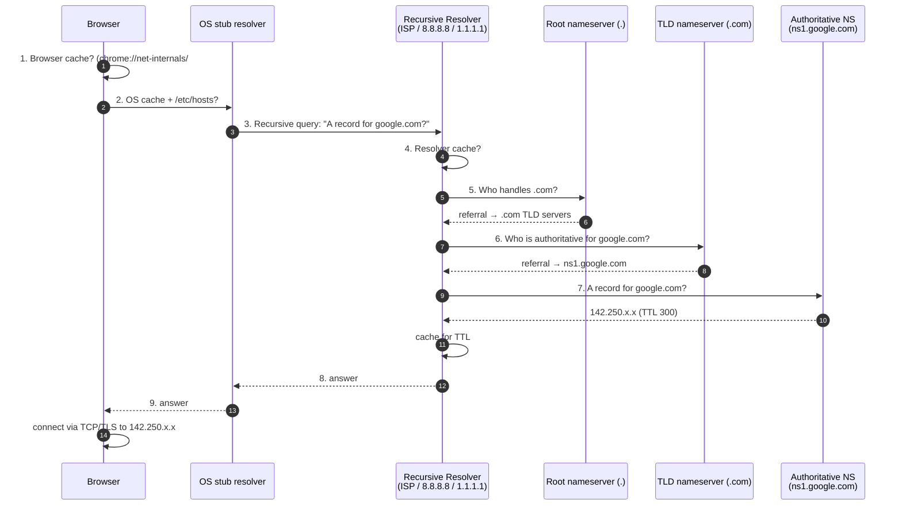
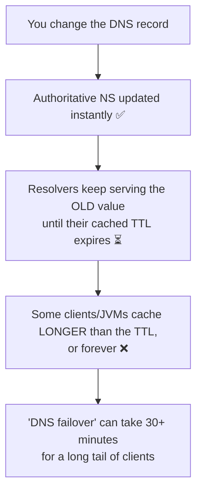
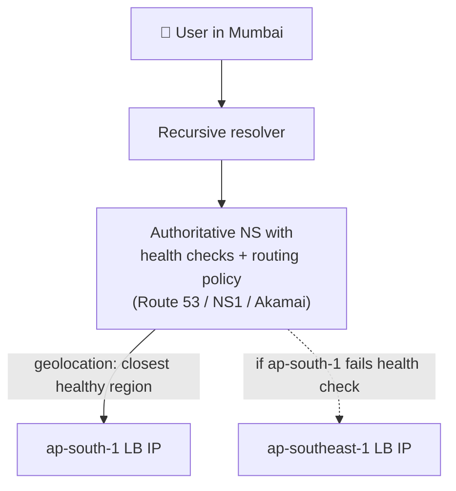

how DNS work
1. when user enters google.com ->
	1. browser cache if not found
	2. OS cache if not found then goes to DNS resolver
	3. DNS resolver cache if not found
	4. Root nameserver -> it find .com nameserver
	5. then it goes to TLD (top level domain) name server -> it find authoritative nameserver for google.com
	6. then it goes to authoritative nameserver => which returns IP address of google.com
	7. then goes to DNS resolver
	8. then OS
	9. then Browser

---

# DNS — Interview-Ready Deep Dive

> **Purpose:** DNS is the first hop of *every* system design. Interviewers use it to test whether you understand caching, TTLs, failover and global traffic routing.
> **Sources:** [awesome-system-design-resources](https://github.com/ashishps1/awesome-system-design-resources) · Cloudflare Learning Center · RFC 1035 / 8484
> **Companions:** [networking.md](networking.md) · [load-balancer.md](load-balancer.md) · [caching.md](caching.md) · [README.md](README.md)

---

## Index

| # | Topic | Section |
|---|---|---|
| 1 | The resolution flow (the note above, as a diagram) | [§1](#1-the-full-resolution-flow) |
| 2 | The four server roles | [§2](#2-the-four-roles) |
| 3 | **Record types** you must know | [§3](#3-record-types) |
| 4 | **TTL & caching** — the layer that causes real outages | [§4](#4-ttl--caching-where-outages-come-from) |
| 5 | Iterative vs recursive · UDP vs TCP · DoH/DoT | [§5](#5-protocol-details) |
| 6 | **DNS as a load balancer** — GeoDNS, weighted, failover, anycast | [§6](#6-dns-as-a-traffic-router-gslb) |
| 7 | Security: DNSSEC, cache poisoning, DDoS amplification | [§7](#7-dns-security) |
| 8 | DNS in system design answers | [§8](#8-dns-in-a-system-design-answer) |
| ★ | Rapid-fire Q&A | [§9](#9-rapid-fire-qa) |

---

## 1. The full resolution flow



> ⭐ **The point to make in an interview:** *"There are **four cache layers** before a query ever leaves the machine — browser, OS, resolver, and then the answer itself is cached for the TTL. That's why DNS is fast in the steady state, and also why a DNS-based failover is never instant."*

**Cost:** a full cold resolution is 20–120 ms and can be several round trips. A cached one is ~0 ms. This is why **DNS prefetch** (`<link rel="dns-prefetch">`) and connection reuse matter for page load.

---

## 2. The four roles

| Role | Job | Example |
|---|---|---|
| **Stub resolver** | The tiny client in the OS/browser | `getaddrinfo()` |
| **Recursive resolver** | Does the legwork and **caches** the result | ISP resolver, Google `8.8.8.8`, Cloudflare `1.1.1.1`, Quad9 `9.9.9.9` |
| **Root servers** | 13 logical root server *addresses* (a, b, … m.root-servers.net), served by **hundreds of anycast instances** | Point you at the TLD |
| **TLD servers** | `.com`, `.org`, `.in`, `.io` | Point you at the authoritative NS |
| **Authoritative NS** | Holds the actual zone file — the source of truth | Route 53, Cloudflare DNS, NS1, `ns1.google.com` |

⚠️ **Common misconception:** there are **not** "only 13 root servers." There are 13 *named addresses*, each announced by **anycast** from over a thousand physical servers worldwide. That's why the root has never gone down.

**Domain hierarchy, read right to left:**
```
www  .  google  .  com  .
 │        │        │     └── root (the trailing dot, usually implicit)
 │        │        └──────── TLD
 │        └───────────────── second-level domain (what you register)
 └────────────────────────── subdomain / hostname
```

---

## 3. Record Types

| Record | Maps | Example / note |
|---|---|---|
| **A** | Hostname → **IPv4** | `google.com → 142.250.183.14` |
| **AAAA** | Hostname → **IPv6** | `google.com → 2404:6800::200e` |
| **CNAME** | Alias → another **hostname** | `www.example.com → example.com`. ⚠️ **Cannot exist at the zone apex** (`example.com` itself) and cannot coexist with other records |
| **ALIAS / ANAME** ⭐ | Apex alias, resolved server-side | The provider-specific fix for the CNAME-at-apex problem (Route 53 "Alias", Cloudflare CNAME flattening) |
| **MX** | Mail servers + priority | `10 mail1.example.com`, `20 mail2.example.com` (lower = higher priority) |
| **TXT** | Arbitrary text | **SPF, DKIM, DMARC** (email anti-spoofing), domain-ownership verification, ACME challenges |
| **NS** | Which nameservers are authoritative | Delegation |
| **SOA** | Zone metadata: primary NS, serial, refresh, **negative-caching TTL** | One per zone |
| **PTR** | IP → hostname (**reverse** DNS) | Used by mail servers for anti-spam checks |
| **SRV** | Service + port discovery | `_sip._tcp.example.com → 10 60 5060 sipserver`. Used by Kubernetes, SIP, XMPP |
| **CAA** | Which CAs may issue certs for this domain | A cheap, high-value security control |
| **DNSKEY / DS / RRSIG** | DNSSEC signing chain | [§7](#7-dns-security) |

> ⭐ **A vs CNAME in a design answer:** *"I'd point the apex `example.com` at the load balancer with an ALIAS record — a CNAME isn't legal at the apex — and use CNAMEs for `www` and `api` so the underlying LB address can change without touching every record."*

---

## 4. TTL & caching — where outages come from

| TTL | Behaviour | Use for |
|---|---|---|
| **30–60 s** | Fast changes, high query volume against your NS | Failover targets, blue/green cutovers, canaries |
| **300 s (5 min)** | The common default | Most application records |
| **3600 s (1 h)** | Fewer lookups, slower changes | Stable services |
| **86400 s (24 h)** | Very slow to change | `MX`, `NS`, `TXT` verification records |

### ⚠️ The three TTL traps



1. **TTL is a floor, not a guarantee.** Many resolvers enforce a minimum, and some clients ignore TTL entirely. ⚠️ **The JVM historically cached successful DNS lookups *forever*** (`networkaddress.cache.ttl = -1` under a security manager) — a genuine production landmine.
2. **Lower the TTL *before* the migration.** Drop it to 60 s a day ahead, migrate, then raise it back. Lowering it *during* the incident is too late — the old TTL is already cached.
3. **Negative caching.** An `NXDOMAIN` is cached too, for the TTL in the **SOA** record. Create a record and it can still 404 for hours.

> ⭐ **The senior conclusion:** *"I would never rely on DNS as my primary failover mechanism — it's eventually consistent with an unbounded tail. DNS gets me to the right **region**; within a region, health-checked load balancers and anycast do the fast failover in seconds."* → [load-balancer.md](load-balancer.md)

---

## 5. Protocol details

### Iterative vs recursive

| | Recursive | Iterative |
|---|---|---|
| Who does the work | The **resolver** does everything and returns a final answer | Each server returns a **referral**; the asker keeps going |
| Used between | Client ↔ resolver | Resolver ↔ root/TLD/authoritative |

⚠️ **Authoritative servers do not perform recursion** — they answer only for their own zones. An "open recursive resolver" exposed to the internet is a DDoS amplification weapon ([§7](#7-dns-security)).

### UDP vs TCP

| | Detail |
|---|---|
| **UDP/53 by default** | One small request, one small response — a TCP handshake would cost more than a retry ([networking.md](networking.md) §3) |
| **Falls back to TCP** | When the response exceeds 512 bytes (the classic limit), for zone transfers (`AXFR`/`IXFR`), or when the truncation (`TC`) bit is set |
| **EDNS0** | Extension allowing larger UDP responses (up to 4096 bytes) — needed for DNSSEC |

### Encrypted DNS

| Protocol | How | Note |
|---|---|---|
| **DoT** (DNS over TLS) | Port **853** | Network operators can still see *that* you're doing DNS |
| **DoH** (DNS over HTTPS) | Port **443**, looks like normal web traffic | ⭐ Better privacy; ⚠️ bypasses enterprise DNS filtering, which is why it's controversial |
| **DNSCrypt** | Alternative encryption | Less common |

---

## 6. DNS as a traffic router (GSLB)

> This is the part that matters most in system design: **DNS is your first load balancer.**



| Routing policy | Behaviour | Use for |
|---|---|---|
| **Simple** | One answer | Single-region apps |
| **Weighted** ⭐ | 90% → v1, 10% → v2 | **Canary releases**, gradual migrations, cost shifting between clouds |
| **Latency-based** | Route to the region with the lowest measured RTT | Global performance |
| **Geolocation / Geoproximity** | Route by the user's country/region | **Data residency (GDPR)**, localised content, legal compliance |
| **Failover (active-passive)** | Primary until its health check fails, then secondary | Disaster recovery |
| **Multivalue answer** | Return several healthy IPs; the client picks | Poor-man's load balancing + client-side failover |

### Round-robin DNS — and its four flaws

Returning multiple A records is the simplest load balancing that exists. ⚠️ **But:**
1. **No health awareness** — a dead server keeps being handed out until you remove the record *and* every cache expires.
2. **Caching skews distribution** — one big ISP resolver caches one IP and sends millions of users to it.
3. **No load awareness** — it's blind round robin, not least-connections.
4. **Failover is slow** — bounded by TTL plus client caching behaviour.

> ⭐ **So the standard architecture is layered:** *"**DNS/GSLB picks the region. Anycast picks the PoP. The L4 load balancer picks the machine. The L7 proxy picks the request handler.** Each layer is faster and more informed than the one above it, and DNS is deliberately the coarsest."*

### Anycast

One IP address announced via BGP from many locations; the internet's own routing sends each user to the topologically nearest instance.

| ✅ | ❌ |
|---|---|
| Sub-second failover (withdraw the BGP route) | Routing changes can break long-lived TCP sessions |
| Absorbs DDoS by spreading it across every PoP | Requires your own AS + BGP peering (or a provider) |
| No DNS TTL dependency | Less precise than geo-DNS for content decisions |

**Used by:** root DNS servers, `1.1.1.1` / `8.8.8.8`, Cloudflare, every major CDN.

---

## 7. DNS Security

| Threat | What happens | Mitigation |
|---|---|---|
| **Cache poisoning / spoofing** (Kaminsky) | An attacker injects a forged response into a resolver's cache, sending users to their server | **DNSSEC**, source-port + query-ID randomisation, 0x20 encoding, DoH/DoT |
| **DDoS amplification** ⭐ | A 60-byte spoofed query yields a 4,000-byte response aimed at the victim — **~70× amplification** | Don't run open resolvers; response rate limiting (RRL); BCP 38 anti-spoofing at the network edge |
| **Domain hijacking** | Registrar account compromised, NS records changed | Registrar **lock**, MFA on the registrar account, registry lock for high-value domains |
| **Subdomain takeover** ⭐ | A dangling CNAME points at a deprovisioned cloud resource; an attacker claims it and serves content on **your** domain | Audit and delete dangling records; monitor continuously |
| **DNS tunnelling** | Data exfiltration encoded in DNS queries | Egress DNS monitoring, block direct outbound :53 |
| **Typosquatting / homograph** | `gooogle.com`, Unicode lookalikes | Defensive registrations, browser punycode display |
| **Unauthorised certificate issuance** | Someone gets a cert for your domain | **CAA records** restricting which CAs may issue |

**DNSSEC** signs records cryptographically so a resolver can verify authenticity via a chain of trust from the root (`DS` → `DNSKEY` → `RRSIG`).
⚠️ **It provides authenticity and integrity — not confidentiality.** Queries are still plaintext; that's what DoH/DoT are for. It also **increases response sizes**, which is why EDNS0 and TCP fallback matter.

---

## 8. DNS in a system design answer

> **Draw DNS as the first box, then say one useful sentence about it.** Most candidates draw it and say nothing.

| Situation | What to say |
|---|---|
| **Global users** | *"Latency-based or geolocation routing at the DNS layer sends users to the nearest healthy region; a CDN with anycast handles static assets and terminates TLS at the edge."* |
| **Multi-region DR** | *"Failover routing with health checks, and a **60-second TTL on the failover records** specifically so the cutover isn't hostage to a one-hour cache."* |
| **Canary / blue-green** | *"Weighted records to shift 1% → 10% → 100%, with instant rollback by reverting the weights."* |
| **Service discovery** | *"DNS-based discovery is convenient but caches aggressively and can't express health or weight — for fast failover I'd use a registry (Consul/etcd) or Kubernetes Endpoints instead."* → [distributed-systems.md](distributed-systems.md) |
| **Compliance** | *"Geolocation routing keeps EU users on EU infrastructure for GDPR data residency."* |
| **Cost** | *"Weighted routing lets us shift traffic between providers or regions to manage egress cost."* |

---

## 9. Rapid-fire Q&A

| Question | Answer |
|---|---|
| **Walk me through a DNS lookup.** | Browser cache → OS cache/hosts → recursive resolver cache → root (referral to TLD) → TLD (referral to authoritative) → authoritative (the answer) → cached at every layer on the way back. |
| **Recursive vs iterative?** | The resolver answers the client *recursively* by making *iterative* queries to root/TLD/authoritative servers, following referrals. |
| **Why does DNS use UDP?** | One small request/response; a TCP handshake would cost more than a retry. It falls back to TCP above 512 bytes and for zone transfers. |
| **Are there really only 13 root servers?** | 13 named addresses, served by 1,000+ physical servers via **anycast**. |
| **A vs CNAME?** | A maps to an IP; CNAME aliases to another hostname. **CNAME is illegal at the zone apex** — use ALIAS/ANAME. |
| **What is a TXT record used for?** | SPF/DKIM/DMARC email authentication, domain-ownership verification, ACME challenges. |
| **What does TTL control?** | How long resolvers may cache the answer. It's a floor — some clients cache longer, and negative answers are cached per the SOA. |
| **How do you migrate a domain with no downtime?** | Lower the TTL to ~60 s a day in advance, run both endpoints in parallel, switch the record, verify, then raise the TTL again. |
| **Why is DNS failover slow?** | Resolver and client caches honour (or exceed) the TTL, so there's a long tail. Use anycast + health-checked load balancers for fast failover. |
| **Round-robin DNS — good idea?** | Only as a crude first layer. It's health-blind, load-blind, skewed by resolver caching, and slow to fail over. |
| **What is GSLB?** | Global server load balancing — DNS-level routing by geography, latency, weight or health to choose a **region**. |
| **What is anycast?** | One IP announced from many locations; BGP routes users to the nearest. Gives sub-second failover and DDoS absorption. |
| **What is DNS cache poisoning?** | Injecting a forged answer into a resolver's cache. Mitigated by DNSSEC, randomisation and encrypted transport. |
| **What is DNS amplification?** | A small spoofed query producing a large response aimed at a victim — ~70× amplification. Don't run open resolvers; use response rate limiting. |
| **What does DNSSEC give you?** | Authenticity and integrity via signatures — **not** confidentiality. DoH/DoT provide privacy. |
| **What is a subdomain takeover?** | A dangling CNAME to a deleted cloud resource that an attacker re-creates, letting them serve content on your domain. |
| **DoH vs DoT?** | Both encrypt DNS. DoT uses port 853 (visible as DNS); DoH uses 443 and blends into web traffic, which improves privacy but bypasses enterprise filtering. |
