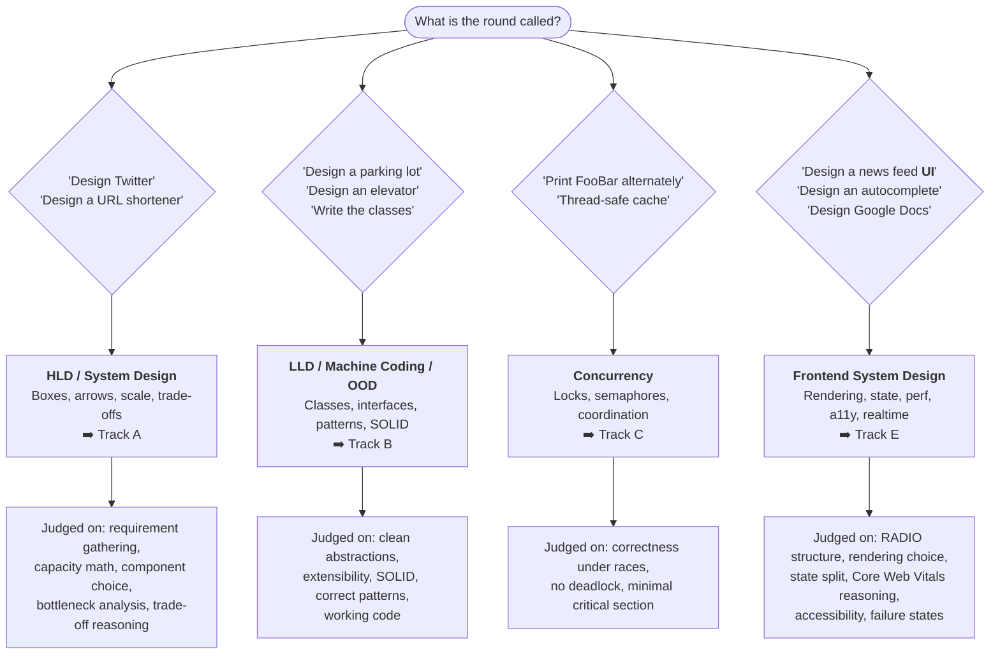
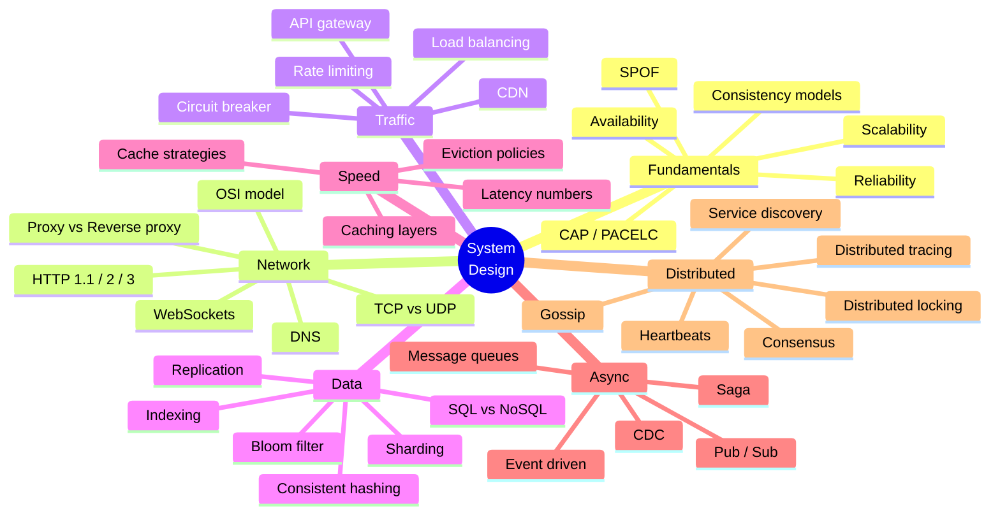

# 🧭 System Design & LLD — Master Index

> **What this repo is:** a complete, interview-ready knowledge base for **High Level Design (HLD)**, **Low Level Design (LLD)**, **Frontend System Design**, and the fundamentals underneath all three.
>
> **How to use it:** start at [§1 Study Roadmap](#1-study-roadmap), pick your track, and follow the order. Every topic links to a file in this repo. Use [§4 Readiness Checklist](#4-readiness-checklist) to track progress.
>
> **Structure of every note in this repo:** *concept → diagram → concrete example → failure mode → what to say in the interview.*
>
> **Curated from:** [awesome-system-design-resources](https://github.com/ashishps1/awesome-system-design-resources) · [awesome-low-level-design](https://github.com/ashishps1/awesome-low-level-design) · ByteByteGo · Hello Interview · AlgoMaster · Amazon Builders' Library · freeCodeCamp — plus published engineering blogs from **Uber, LinkedIn, Airbnb, Netflix, Shopify, Figma, Discord and Vercel** ([§6](#6-real-world-case-study-index)).

---

## 0. Which interview are you preparing for?

| | HLD | LLD |
|---|---|---|
| **Question** | "How do we *deploy* it and how do systems *talk*?" | "How do we *code* it — what classes and interfaces?" |
| **Unit of thought** | Service, database, queue, cache | Class, interface, method |
| **Output** | Architecture diagram + numbers | Class diagram + working code |
| **Typical failure** | "I'll add a load balancer" with no reasoning | One god-class with 30 `if/else` branches |
| **Start here** | [high-level-system-design-cocept.md](high-level-system-design-cocept.md) | [low-level-design.md](low-level-design.md) |

> 🟠 **And if the round is front-end:** the unit of thought is the *component, the bundle and the network round trip*; the output is a component diagram plus an API contract plus a performance story. The typical failure is drifting into backend scaling. **Start here → [frontend-system-design.md](frontend-system-design.md)**

---

## 1. Study Roadmap

### 🟢 Track A — High Level Design (HLD)

| # | Topic | File | Status |
|---|---|---|---|
| A1 | Core concepts: scalability, availability, reliability, SPOF, CAP, PACELC, consistency models | [high-level-system-design-cocept.md](high-level-system-design-cocept.md) | ✅ |
| A2 | Networking: OSI, IP, TCP vs UDP, HTTP/1.1→3, WebSockets, proxies | [networking.md](networking.md) | ✅ |
| A3 | DNS end-to-end: resolution, record types, TTL, GSLB, anycast | [DNS.md](DNS.md) | ✅ |
| A4 | Latency, throughput, bandwidth, availability, tail latency, back-of-envelope math | [latency.md](latency.md) | ✅ |
| A5 | Load balancers: L4 vs L7, algorithms, health checks, sticky sessions | [load-balancer.md](load-balancer.md) | ✅ |
| A6 | Caching: layers, strategies, TTL, eviction, stampede/penetration/avalanche | [caching.md](caching.md) · [cache.md](cache.md) | ✅ |
| A7 | Databases: ACID, SQL vs NoSQL, indexing, sharding, replication, scaling | [databases.md](databases.md) | ✅ |
| A8 | APIs: REST design, idempotency, pagination, versioning, rate limiting, gateways | [rest-api.md](rest-api.md) | ✅ |
| A9 | API styles compared: REST vs GraphQL vs RPC/gRPC | [restvsgraphqlVsRPC.md](restvsgraphqlVsRPC.md) | ✅ |
| A10 | Async: message queues, pub/sub, Kafka, CDC, event-driven, saga | [distributed-systems.md](distributed-systems.md) | ✅ |
| A11 | Distributed primitives: heartbeats, service discovery, consensus, locking, gossip, circuit breaker | [distributed-systems.md](distributed-systems.md) | ✅ |
| A12 | Cloud native: microservices, containers, K8s, DevOps, observability | [cloud-native.md](cloud-native.md) | ✅ |
| A13 | Full course walkthrough: auth, authz, API security, big data, production | [system-design-course-fcc.md](system-design-course-fcc.md) | ✅ |
| A14 | **The interview itself**: framework, capacity math, 40+ problems, trade-offs | [system-design-interview-playbook.md](system-design-interview-playbook.md) | ✅ |

### 🔵 Track B — Low Level Design (LLD)

| # | Topic | File | Status |
|---|---|---|---|
| B1 | OOP fundamentals, class relationships, SOLID/DRY/KISS/YAGNI, UML, LLD framework | [low-level-design.md](low-level-design.md) | ✅ |
| B2 | All 23 GoF design patterns with code + when to use + when NOT to | [design-patterns.md](design-patterns.md) | ✅ |
| B3 | A complete worked LLD: cache-aside in Python/TS/JS with tests | [cache-aside-lld.md](cache-aside-lld.md) | ✅ |
| B4 | Data structures + when each one shows up in a design | [data-structure.md](data-structure.md) | ✅ |

### 🟣 Track C — Concurrency

| # | Topic | File | Status |
|---|---|---|---|
| C1 | Threads vs processes, race conditions, mutex, semaphore, condition variables, CAS | [concurrency.md](concurrency.md) | ✅ |
| C2 | Deadlock, livelock, starvation + the four Coffman conditions | [concurrency.md](concurrency.md) | ✅ |
| C3 | Patterns: thread pool, producer-consumer, reader-writer, signaling | [concurrency.md](concurrency.md) | ✅ |
| C4 | Classic interview problems (FooBar, H2O, thread-safe cache) | [concurrency.md](concurrency.md) | ✅ |

### ⚫ Track D — Specialised / job-specific

| # | Topic | File |
|---|---|---|
| D1 | gRPC in a real polyglot product — full KT walkthrough | [grpc-architecture-kt.md](grpc-architecture-kt.md) |
| D2 | HPC / ML kernels and GPU offload | [hpc-ml-kernels-gpu-offload.md](hpc-ml-kernels-gpu-offload.md) |
| D3 | OpenMP shared-memory parallelism | [openmp-shared-memory-hpc.md](openmp-shared-memory-hpc.md) |
| D4 | Switching into AI: curriculum, gap list, project path | [ai-engineer-roadmap.md](ai-engineer-roadmap.md) |
| D5 | **AI system design from LinkedIn + Uber engineering blogs** — retrieval funnels, distillation, GPU efficiency, agents, + Q&A bank | [ai-company-engineering-blogs.md](ai-company-engineering-blogs.md) |

### 🟠 Track E — Frontend System Design

> The browser-side counterpart to Track A. Start at [frontend-system-design.md](frontend-system-design.md) — it holds the **RADIO** framework, the concept map and the navigation for the rest.

| # | Topic | File | Status |
|---|---|---|---|
| E0 | **Hub**: RADIO framework, scoring rubric, 30-concept map, cheat sheet, readiness checklist | [frontend-system-design.md](frontend-system-design.md) | ✅ |
| E1 | Rendering & delivery: CSR · SSR · SSG · ISR · streaming · RSC · **PPR** · islands · hydration · SEO | [frontend-rendering.md](frontend-rendering.md) | ✅ |
| E2 | Performance: **Core Web Vitals**, critical path, bundles, images, fonts, long tasks, virtualisation, budgets | [frontend-performance.md](frontend-performance.md) | ✅ |
| E3 | State & data: server vs client state, normalisation, caching, optimistic UI, pagination, **offline** | [frontend-state-data.md](frontend-state-data.md) | ✅ |
| E4 | Architecture: components, **design systems**, monorepos, micro-frontends, **server-driven UI**, a11y, i18n | [frontend-architecture.md](frontend-architecture.md) | ✅ |
| E5 | Realtime & collaboration: polling → SSE → WebSocket → WebRTC, presence, bandwidth, **CRDT/OT/LWW** | [frontend-realtime-collab.md](frontend-realtime-collab.md) | ✅ |
| E6 | **Case studies** — Airbnb · Netflix · Shopify · Figma · Discord · Vercel · Uber, with published numbers | [frontend-company-case-studies.md](frontend-company-case-studies.md) | ✅ |
| E7 | **The interview** — 45-min clock, 14 worked problems, weak-vs-strong, level calibration | [frontend-interview-playbook.md](frontend-interview-playbook.md) | ✅ |

---

## 2. The 30-concept map (one picture)

---

## 3. Cheat sheet — pick the right tool

| If the interviewer says… | Reach for | Read |
|---|---|---|
| "reads are slow" | Cache → read replicas → index | [caching.md](caching.md) · [databases.md](databases.md) |
| "writes are slow" | Batch, async queue, write-behind, shard | [databases.md](databases.md) |
| "one table is too big" | Sharding + consistent hashing | [databases.md](databases.md) |
| "spiky traffic" | Queue for buffering + autoscale + load shedding | [distributed-systems.md](distributed-systems.md) |
| "users are global" | CDN + GSLB/anycast + regional replicas | [DNS.md](DNS.md) · [load-balancer.md](load-balancer.md) |
| "must not lose data" | Durable queue + WAL + replication + idempotency | [databases.md](databases.md) |
| "real time updates" | WebSocket / SSE / long polling | [networking.md](networking.md) |
| "prevent abuse" | Rate limiting + auth + WAF | [rest-api.md](rest-api.md) |
| "one slow service kills everything" | Timeout + retry budget + circuit breaker + bulkhead | [distributed-systems.md](distributed-systems.md) |
| "design the classes for X" | Requirements → entities → relationships → patterns | [low-level-design.md](low-level-design.md) |
| "multiple threads touch it" | Immutability first, then the smallest lock | [concurrency.md](concurrency.md) |
| "the **page** is slow" | Name the metric (LCP/INP/CLS) → then the lever | [frontend-performance.md](frontend-performance.md) |
| "it must rank on Google" | SSR/SSG/ISR + semantic HTML + metadata | [frontend-rendering.md](frontend-rendering.md) |
| "the **UI** must update live" | Weakest transport that works: polling → SSE → WebSocket | [frontend-realtime-collab.md](frontend-realtime-collab.md) |
| "two users edit the same thing" | Per-property LWW + fractional indexing before reaching for CRDT/OT | [frontend-realtime-collab.md](frontend-realtime-collab.md) |
| "design a news feed **UI**" | RADIO: requirements → architecture → data → interface → optimisations | [frontend-interview-playbook.md](frontend-interview-playbook.md) |

---

## 4. Readiness Checklist

Tick these off. If you can't explain one **out loud in 60 seconds**, you're not ready for it.

<b>HLD fundamentals</b>

- [ ] Vertical vs horizontal scaling, and when vertical is the *right* answer
- [ ] Availability nines → actual downtime per year
- [ ] CAP theorem, and why "CP vs AP" is a per-operation choice, not a per-system one
- [ ] PACELC — the half of CAP everyone forgets
- [ ] Strong vs eventual vs causal vs read-your-writes consistency
- [ ] Every single point of failure in a diagram you just drew
- [ ] Back-of-envelope: DAU → QPS → storage → bandwidth → server count

<b>Traffic & network</b>

- [ ] L4 vs L7 load balancing in one sentence each
- [ ] Why HTTP/2 + gRPC breaks a naive L4 load balancer
- [ ] Health checks: shallow vs deep, and the fleet-wide outage deep checks cause
- [ ] Sticky sessions — and why the real answer is to be stateless
- [ ] TCP vs UDP, and one system that deliberately picks UDP
- [ ] The full DNS resolution path, with caching at each hop
- [ ] Long polling vs SSE vs WebSocket

<b>Data</b>

- [ ] ACID, each letter, with a failure example
- [ ] When NoSQL is genuinely better (not "because scale")
- [ ] How a B+Tree index makes reads fast and writes slower
- [ ] Sharding strategies + the hot-shard problem + resharding
- [ ] Consistent hashing with virtual nodes — and *why* `% N` is catastrophic
- [ ] Leader-follower replication, replication lag, read-your-writes
- [ ] Bloom filter: what a false positive costs you

<b>Caching</b>

- [ ] Cache-aside read path and write path — and why it's DB-first-then-DELETE
- [ ] Stampede vs penetration vs avalanche, with the fix for each
- [ ] Eviction (memory pressure) vs TTL (staleness) — different problems
- [ ] What happens the moment your cache is 100% cold
- [ ] Hot key mitigation

<b>LLD</b>

- [ ] All 5 SOLID principles with a code smell for each
- [ ] Association vs aggregation vs composition
- [ ] Strategy vs State (they look identical — say the difference)
- [ ] Factory Method vs Abstract Factory
- [ ] Observer, and where it appears in real frameworks
- [ ] Draw a class diagram for a parking lot in 10 minutes
- [ ] Why you'd refuse to use Singleton

<b>Concurrency</b>

- [ ] Race condition → critical section → mutex, in order
- [ ] Mutex vs semaphore vs condition variable
- [ ] The four Coffman conditions for deadlock, and how to break each
- [ ] Why `check-then-act` is broken and CAS fixes it
- [ ] Producer-consumer with a bounded buffer

<b>Frontend system design</b>

- [ ] Run any prompt through **RADIO** out loud
- [ ] CSR vs SSR vs SSG vs ISR vs PPR — and the *deciding question* for each
- [ ] Why hydration is the expensive part, and three ways to cut it
- [ ] LCP / INP / CLS: what each measures, the threshold, and the first thing you'd check
- [ ] Server state vs client state — and why one library shouldn't do both
- [ ] Why infinite scroll needs **cursor** pagination
- [ ] What list virtualisation breaks (Ctrl+F, a11y, deep links, scroll restore)
- [ ] Optimistic update → snapshot → rollback → idempotency key
- [ ] Polling vs SSE vs WebSocket vs WebRTC, with the reconnect/resume story
- [ ] Per-property LWW vs OT vs CRDT — and why Figma chose the simplest one
- [ ] The one good reason for micro-frontends, and their four real costs
- [ ] Accessibility as an architectural concern, not a checklist

---

## 5. Repo conventions

| Convention | Why |
|---|---|
| Every file opens with a **Syllabus Coverage Index** table | Jump straight to a topic without scrolling |
| Mermaid diagrams over ASCII | Renders in GitHub/VS Code preview; easy to redraw on a whiteboard |
| ✅ / ❌ / ⚠️ / ⭐ markers | ✅ do this · ❌ avoid · ⚠️ trap · ⭐ senior-level signal |
| "**Interview line:**" blockquotes | A sentence you can say verbatim |
| Rapid-fire Q&A table at the end of each file | Last-minute revision |

> 💡 **Tip:** press `Ctrl+Shift+V` in VS Code to preview a Markdown file with the diagrams rendered.

---

## 6. Real-world case-study index

> Every core note now ends with a **"Real-World Case Study"** section grounded in published engineering posts from **[LinkedIn Engineering](https://www.linkedin.com/blog/engineering)** and **[Uber Engineering](https://www.uber.com/en-IN/blog/engineering/)**. Use them to replace *"I'd add a cache"* with *"here's how a team serving 40M reads/sec did it, and what broke."*

### 6.1 The four source systems

| # | System | Company | The one-line story | Numbers to remember |
|---|---|---|---|---|
| **S1** | **CacheFront** — integrated cache for Docstore | Uber | Cache-aside pushed *into* the database's stateless query layer; invalidation driven by binlog CDC | 40M+ reads/sec · P75 −75% · 6M RPS from 3K Redis cores vs 60K DB cores · 99.99% measured consistency |
| **S2** | **Cinnamon load manager** | Uber | Static quotas + 429s failed; replaced by concurrency-based, priority-aware shedding with a PID controller | +80% throughput under overload · p99 −70% · goroutines −93% |
| **S3** | **Northguard + Xinfra** | LinkedIn | Kafka's inventors replaced Kafka: log striping, sharded Raft metadata, SWIM gossip — then migrated via a virtualization layer | 32T records/day · 400K topics · 80%+ fewer clusters · 128+ metadata shards vs Kafka's 1 |
| **S4** | **Native gRPC in OpenSearch** | Uber | Deleted a Protobuf↔JSON translation layer by upstreaming a gRPC transport | p99 ingest −60% · vector search p50 −53% · request bodies −88.7% |

### 6.2 Where each one is written up

| Note | Section | Case study | What it demonstrates |
|---|---|---|---|
| [caching.md](caching.md) | §24 | S1 | Every caching technique in one system: cache-aside, CDC invalidation, negative caching, cache warming, sharding, circuit breakers, adaptive timeouts |
| [cache.md](cache.md) | §16 | S1 | The condensed version, mapped onto this file's TL;DR |
| [load-balancer.md](load-balancer.md) | §26 | S2 | Overload control: CoDel → adaptive LIFO → priority tiers → PID control → "bring your own signal" |
| [rest-api.md](rest-api.md) | §17 | S2 | Why the textbook quota-based rate limiter fails, and rate limiting vs load shedding |
| [databases.md](databases.md) | §14 | S1 · S2 · S3 | Docstore's architecture, partition key vs primary key, why the scaling ladder runs out, durability as a number |
| [distributed-systems.md](distributed-systems.md) | §16 | S3 | Consensus, gossip, replication granularity, deterministic simulation, and a zero-downtime infrastructure migration |
| [latency.md](latency.md) | §11 | S1 · S2 · S4 | Adaptive timeouts, real percentile movements, Little's Law as an overload detector |
| [networking.md](networking.md) | §12 | S3 · S4 | HTTP/1.1+JSON vs HTTP/2+Protobuf measured; application-level windowing; SWIM; Direct I/O |
| [restvsgraphqlVsRPC.md](restvsgraphqlVsRPC.md) | §19 | S4 | The only published apples-to-apples REST vs gRPC production numbers |
| [concurrency.md](concurrency.md) | §10 | S1 · S2 | Concurrency as a health signal, adaptive LIFO queues, goroutine regulators, CAS across a network |
| [data-structure.md](data-structure.md) | §12 | S1 · S3 | Consistent hash rings, buddy allocation, sparse indexes, sliding windows, version stamps — chosen for invariants, not Big-O |
| [cloud-native.md](cloud-native.md) | §13 | all four | Platform engineering: when to build one, operability as design, deterministic simulation, strangler migration, upstreaming |
| [high-level-system-design-cocept.md](high-level-system-design-cocept.md) | §13 | all four | Control-plane scaling, CAP as a granularity choice, the 6× cost of redundancy, warm failover, degradation tiers |
| [grpc-architecture-kt.md](grpc-architecture-kt.md) | App. D | S4 | Industry reference numbers for the gRPC decision + IDL-in-CI practices |
| [ai-company-engineering-blogs.md](ai-company-engineering-blogs.md) | all | 7 AI case studies | Retrieval funnels, distillation, GPU efficiency, agents |

### 6.3 Frontend case studies (Track E)

> Six more production case studies, all with published numbers — written up in [frontend-company-case-studies.md](frontend-company-case-studies.md).

| System | Company | One-line story | Number to remember |
|---|---|---|---|
| **Ghost Platform** | Airbnb | Server-driven UI over one shared GraphQL schema for web + iOS + Android | Ship a UI change with **no app release** |
| **Homepage JS diet** | Netflix | Removed client-side React from the logged-out homepage | **−200 kB JS → −50% TTI**; prefetch → **−30% TTI** next page |
| **React Native migration** | Shopify | All apps on RN — and "100% RN should be an anti-goal" | **<500 ms P75** screen loads, **>99.9%** crash-free |
| **Multiplayer** | Figma | CRDT-*inspired* per-property LWW + fractional indexing | The hard part is **undo**, not merging |
| **Gateway bandwidth** | Discord | Streaming zstd + snapshot→delta dispatches | **−40%** WebSocket traffic (one message was **35%** of it) |
| **Partial prerendering** | Vercel | Static shell from the edge + `<Suspense>`-shaped dynamic holes | Static by default, dynamic only where request data is touched |

### 6.4 The six cross-cutting lessons

1. **Push the cross-cutting concern into the platform.** Caching, rate limiting and invalidation solved once in a shared layer beat N teams solving them badly — *if* adoption is transparent and opt-in.
2. **Derive limits from live distributions.** Timeouts from P99.99, queue deadlines from P90, concurrency limits from a PID loop. Nothing that matters should be a hard-coded constant.
3. **Shed by priority, and fail fast.** A queued request holds memory; rejecting in 2 ms beats answering in 30 s. Tier your traffic *before* you need to.
4. **The committed log is the integration point.** CDC from the binlog invalidates caches, feeds search indexes, drives replication and populates the warehouse — with no dual writes and no uncommitted data.
5. **Engineer away correlated failure.** Shard the cache on a different key than the database; replicate cache *keys* not values across regions; make the replication unit small enough that availability and consistency stop competing.
6. **Migrate underneath your users.** Virtualize the dependency, dual-write for rollback, move producers then consumers, remove the old path last.
