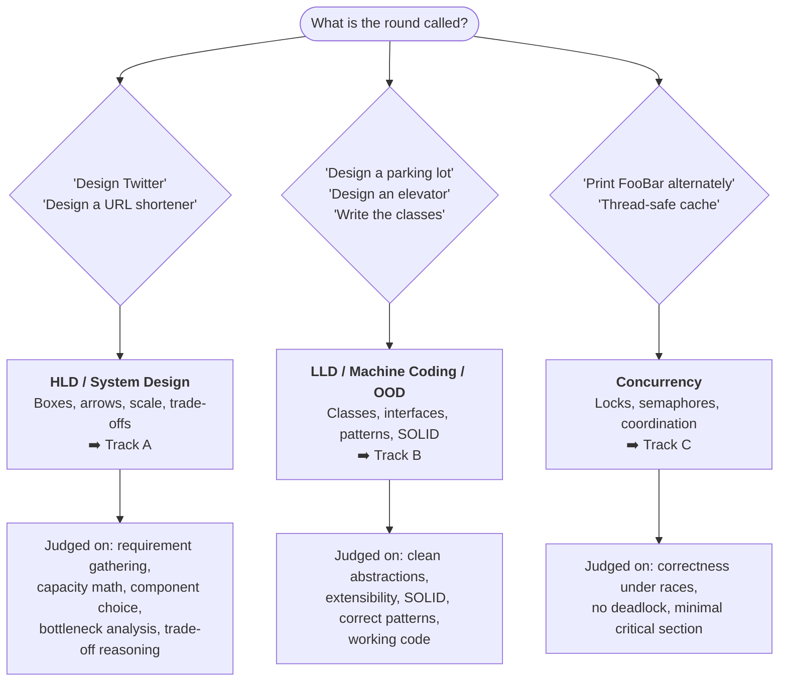
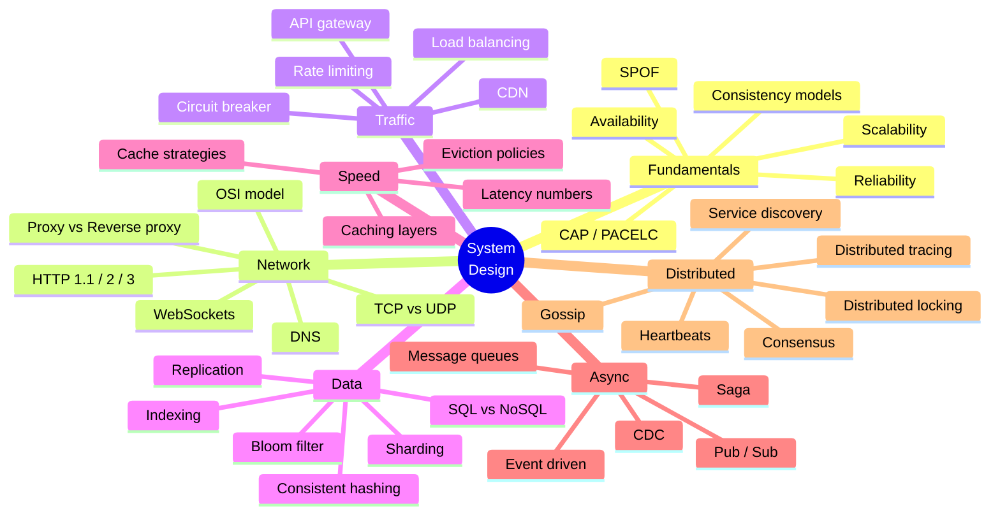

# 🧭 System Design & LLD — Master Index

> **What this repo is:** a complete, interview-ready knowledge base for **High Level Design (HLD)**, **Low Level Design (LLD)**, and the fundamentals underneath both.
>
> **How to use it:** start at [§1 Study Roadmap](#1-study-roadmap), pick your track, and follow the order. Every topic links to a file in this repo. Use [§4 Readiness Checklist](#4-readiness-checklist) to track progress.
>
> **Structure of every note in this repo:** *concept → diagram → concrete example → failure mode → what to say in the interview.*
>
> **Curated from:** [awesome-system-design-resources](https://github.com/ashishps1/awesome-system-design-resources) · [awesome-low-level-design](https://github.com/ashishps1/awesome-low-level-design) · ByteByteGo · Hello Interview · AlgoMaster · Amazon Builders' Library · freeCodeCamp

---

## 0. Which interview are you preparing for?

| | HLD | LLD |
|---|---|---|
| **Question** | "How do we *deploy* it and how do systems *talk*?" | "How do we *code* it — what classes and interfaces?" |
| **Unit of thought** | Service, database, queue, cache | Class, interface, method |
| **Output** | Architecture diagram + numbers | Class diagram + working code |
| **Typical failure** | "I'll add a load balancer" with no reasoning | One god-class with 30 `if/else` branches |
| **Start here** | [high-level-system-design-cocept.md](high-level-system-design-cocept.md) | [low-level-design.md](low-level-design.md) |

---

## 1. Study Roadmap

### 🟢 Track A — High Level Design (HLD)

| # | Topic | File | Status |
|---|---|---|---|
| A1 | Core concepts: scalability, availability, reliability, SPOF, CAP, PACELC, consistency models | [high-level-system-design-cocept.md](high-level-system-design-cocept.md) | ✅ |
| A2 | Networking: OSI, IP, TCP vs UDP, HTTP/1.1→3, WebSockets, proxies | [networking.md](networking.md) | ✅ |
| A3 | DNS end-to-end: resolution, record types, TTL, GSLB, anycast | [DNS.md](DNS.md) | ✅ |
| A4 | Latency, throughput, bandwidth, availability, tail latency, back-of-envelope math | [latency.md](latency.md) | ✅ |
| A5 | Load balancers: L4 vs L7, algorithms, health checks, sticky sessions | [load-balancer.md](load-balancer.md) | ✅ |
| A6 | Caching: layers, strategies, TTL, eviction, stampede/penetration/avalanche | [caching.md](caching.md) · [cache.md](cache.md) | ✅ |
| A7 | Databases: ACID, SQL vs NoSQL, indexing, sharding, replication, scaling | [databases.md](databases.md) | ✅ |
| A8 | APIs: REST design, idempotency, pagination, versioning, rate limiting, gateways | [rest-api.md](rest-api.md) | ✅ |
| A9 | API styles compared: REST vs GraphQL vs RPC/gRPC | [restvsgraphqlVsRPC.md](restvsgraphqlVsRPC.md) | ✅ |
| A10 | Async: message queues, pub/sub, Kafka, CDC, event-driven, saga | [distributed-systems.md](distributed-systems.md) | ✅ |
| A11 | Distributed primitives: heartbeats, service discovery, consensus, locking, gossip, circuit breaker | [distributed-systems.md](distributed-systems.md) | ✅ |
| A12 | Cloud native: microservices, containers, K8s, DevOps, observability | [cloud-native.md](cloud-native.md) | ✅ |
| A13 | Full course walkthrough: auth, authz, API security, big data, production | [system-design-course-fcc.md](system-design-course-fcc.md) | ✅ |
| A14 | **The interview itself**: framework, capacity math, 40+ problems, trade-offs | [system-design-interview-playbook.md](system-design-interview-playbook.md) | ✅ |

### 🔵 Track B — Low Level Design (LLD)

| # | Topic | File | Status |
|---|---|---|---|
| B1 | OOP fundamentals, class relationships, SOLID/DRY/KISS/YAGNI, UML, LLD framework | [low-level-design.md](low-level-design.md) | ✅ |
| B2 | All 23 GoF design patterns with code + when to use + when NOT to | [design-patterns.md](design-patterns.md) | ✅ |
| B3 | A complete worked LLD: cache-aside in Python/TS/JS with tests | [cache-aside-lld.md](cache-aside-lld.md) | ✅ |
| B4 | Data structures + when each one shows up in a design | [data-structure.md](data-structure.md) | ✅ |

### 🟣 Track C — Concurrency

| # | Topic | File | Status |
|---|---|---|---|
| C1 | Threads vs processes, race conditions, mutex, semaphore, condition variables, CAS | [concurrency.md](concurrency.md) | ✅ |
| C2 | Deadlock, livelock, starvation + the four Coffman conditions | [concurrency.md](concurrency.md) | ✅ |
| C3 | Patterns: thread pool, producer-consumer, reader-writer, signaling | [concurrency.md](concurrency.md) | ✅ |
| C4 | Classic interview problems (FooBar, H2O, thread-safe cache) | [concurrency.md](concurrency.md) | ✅ |

### ⚫ Track D — Specialised / job-specific

| # | Topic | File |
|---|---|---|
| D1 | gRPC in a real polyglot product — full KT walkthrough | [grpc-architecture-kt.md](grpc-architecture-kt.md) |
| D2 | HPC / ML kernels and GPU offload | [hpc-ml-kernels-gpu-offload.md](hpc-ml-kernels-gpu-offload.md) |
| D3 | OpenMP shared-memory parallelism | [openmp-shared-memory-hpc.md](openmp-shared-memory-hpc.md) |

---

## 2. The 30-concept map (one picture)

---

## 3. Cheat sheet — pick the right tool

| If the interviewer says… | Reach for | Read |
|---|---|---|
| "reads are slow" | Cache → read replicas → index | [caching.md](caching.md) · [databases.md](databases.md) |
| "writes are slow" | Batch, async queue, write-behind, shard | [databases.md](databases.md) |
| "one table is too big" | Sharding + consistent hashing | [databases.md](databases.md) |
| "spiky traffic" | Queue for buffering + autoscale + load shedding | [distributed-systems.md](distributed-systems.md) |
| "users are global" | CDN + GSLB/anycast + regional replicas | [DNS.md](DNS.md) · [load-balancer.md](load-balancer.md) |
| "must not lose data" | Durable queue + WAL + replication + idempotency | [databases.md](databases.md) |
| "real time updates" | WebSocket / SSE / long polling | [networking.md](networking.md) |
| "prevent abuse" | Rate limiting + auth + WAF | [rest-api.md](rest-api.md) |
| "one slow service kills everything" | Timeout + retry budget + circuit breaker + bulkhead | [distributed-systems.md](distributed-systems.md) |
| "design the classes for X" | Requirements → entities → relationships → patterns | [low-level-design.md](low-level-design.md) |
| "multiple threads touch it" | Immutability first, then the smallest lock | [concurrency.md](concurrency.md) |

---

## 4. Readiness Checklist

Tick these off. If you can't explain one **out loud in 60 seconds**, you're not ready for it.

<b>HLD fundamentals</b>

- [ ] Vertical vs horizontal scaling, and when vertical is the *right* answer
- [ ] Availability nines → actual downtime per year
- [ ] CAP theorem, and why "CP vs AP" is a per-operation choice, not a per-system one
- [ ] PACELC — the half of CAP everyone forgets
- [ ] Strong vs eventual vs causal vs read-your-writes consistency
- [ ] Every single point of failure in a diagram you just drew
- [ ] Back-of-envelope: DAU → QPS → storage → bandwidth → server count

<b>Traffic & network</b>

- [ ] L4 vs L7 load balancing in one sentence each
- [ ] Why HTTP/2 + gRPC breaks a naive L4 load balancer
- [ ] Health checks: shallow vs deep, and the fleet-wide outage deep checks cause
- [ ] Sticky sessions — and why the real answer is to be stateless
- [ ] TCP vs UDP, and one system that deliberately picks UDP
- [ ] The full DNS resolution path, with caching at each hop
- [ ] Long polling vs SSE vs WebSocket

<b>Data</b>

- [ ] ACID, each letter, with a failure example
- [ ] When NoSQL is genuinely better (not "because scale")
- [ ] How a B+Tree index makes reads fast and writes slower
- [ ] Sharding strategies + the hot-shard problem + resharding
- [ ] Consistent hashing with virtual nodes — and *why* `% N` is catastrophic
- [ ] Leader-follower replication, replication lag, read-your-writes
- [ ] Bloom filter: what a false positive costs you

<b>Caching</b>

- [ ] Cache-aside read path and write path — and why it's DB-first-then-DELETE
- [ ] Stampede vs penetration vs avalanche, with the fix for each
- [ ] Eviction (memory pressure) vs TTL (staleness) — different problems
- [ ] What happens the moment your cache is 100% cold
- [ ] Hot key mitigation

<b>LLD</b>

- [ ] All 5 SOLID principles with a code smell for each
- [ ] Association vs aggregation vs composition
- [ ] Strategy vs State (they look identical — say the difference)
- [ ] Factory Method vs Abstract Factory
- [ ] Observer, and where it appears in real frameworks
- [ ] Draw a class diagram for a parking lot in 10 minutes
- [ ] Why you'd refuse to use Singleton

<b>Concurrency</b>

- [ ] Race condition → critical section → mutex, in order
- [ ] Mutex vs semaphore vs condition variable
- [ ] The four Coffman conditions for deadlock, and how to break each
- [ ] Why `check-then-act` is broken and CAS fixes it
- [ ] Producer-consumer with a bounded buffer

---

## 5. Repo conventions

| Convention | Why |
|---|---|
| Every file opens with a **Syllabus Coverage Index** table | Jump straight to a topic without scrolling |
| Mermaid diagrams over ASCII | Renders in GitHub/VS Code preview; easy to redraw on a whiteboard |
| ✅ / ❌ / ⚠️ / ⭐ markers | ✅ do this · ❌ avoid · ⚠️ trap · ⭐ senior-level signal |
| "**Interview line:**" blockquotes | A sentence you can say verbatim |
| Rapid-fire Q&A table at the end of each file | Last-minute revision |

> 💡 **Tip:** press `Ctrl+Shift+V` in VS Code to preview a Markdown file with the diagrams rendered.
