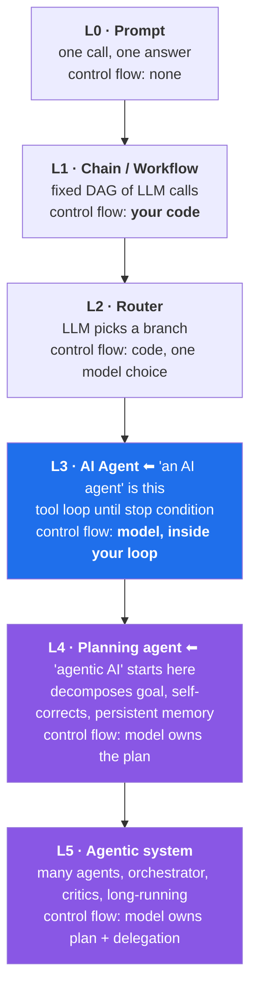
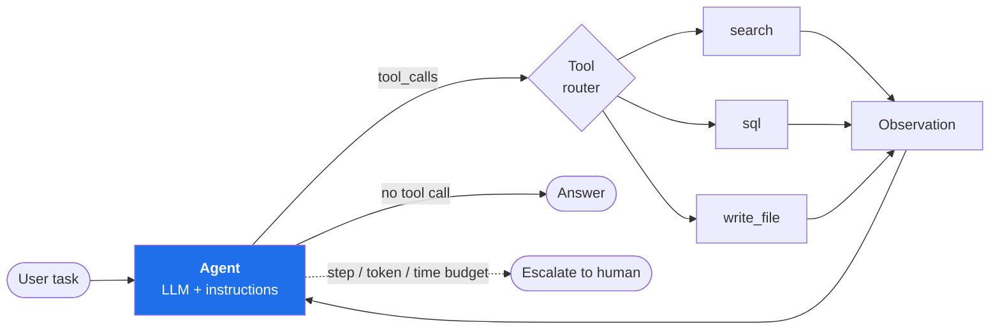
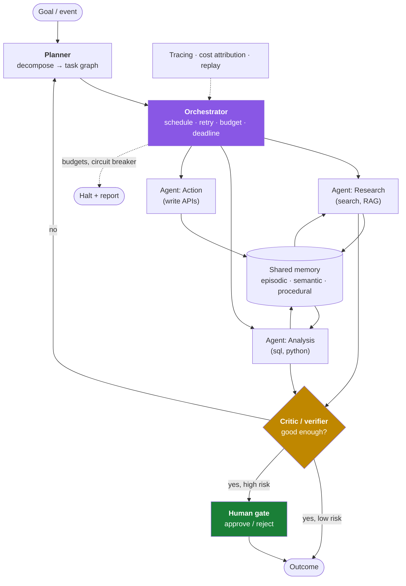
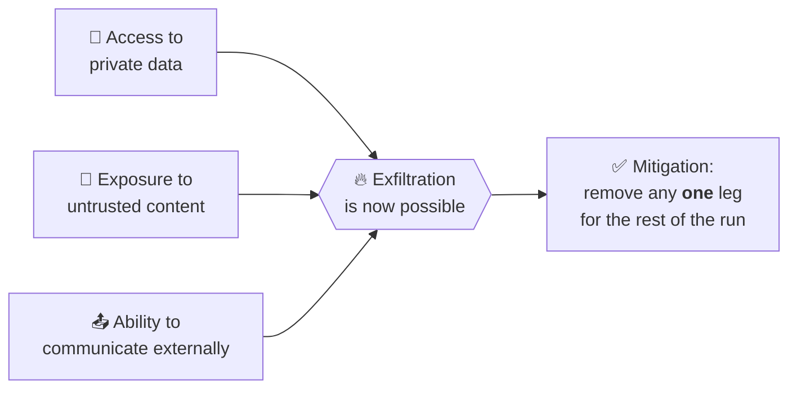
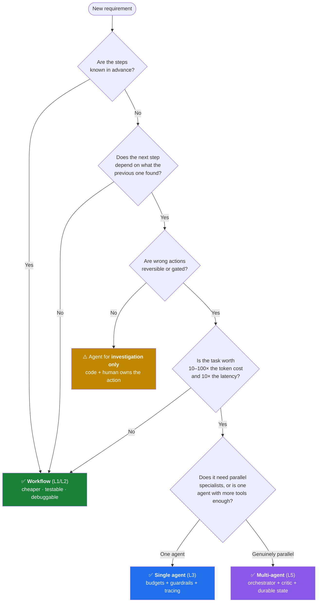

# AI Agent vs Agentic AI — the difference, and why it matters in design

> **The one-line answer:** an **AI agent** is a *thing you build* — one model in a loop with tools, pointed at a task. **Agentic AI** is a *property of a system* — how much of the control flow, goal decomposition, memory and recovery you have handed over to models instead of to code.
>
> One is a **noun** (a component). The other is an **adjective** (a degree of autonomy). Everything else in this file is a consequence of that.
>
> Related notes: [ai-engineer-roadmap.md](ai-engineer-roadmap.md) · [ai-company-engineering-blogs.md](ai-company-engineering-blogs.md) · [distributed-systems.md](distributed-systems.md) (saga, circuit breaker, idempotency) · [latency.md](latency.md) (tail latency, budgets) · [caching.md](caching.md) · [cloud-native.md](cloud-native.md) (observability) · [design-patterns.md](design-patterns.md) (the orchestration patterns are old friends).

---

## 0. Syllabus coverage index

| § | Topic | Why you care |
|---|---|---|
| [1](#1-the-60-second-answer) | The 60-second answer + the honest caveat | What to say when asked cold |
| [2](#2-the-autonomy-ladder--the-only-mental-model-you-need) | The autonomy ladder L0→L5 | Replaces the fake binary with a spectrum |
| [3](#3-definitions-that-survive-contact-with-an-interviewer) | Precise definitions, workflow vs agent | The line that actually matters |
| [4](#4-side-by-side-the-big-table) | 16-dimension comparison table | The core of the answer |
| [5](#5-two-architectures-two-diagrams) | Single-agent loop vs agentic system | Diagrams + runnable loop |
| [6](#6-the-same-problem-at-four-levels-of-autonomy) | One refund problem, four designs | Concrete, not hand-wavy |
| [7](#7-this-is-a-distributed-systems-problem-in-a-costume) | Mapping to what you already know | Your senior-engineer edge |
| [8](#8-failure-modes--the-part-that-gets-you-hired) | Failure modes and mitigations | Where interviews are won |
| [9](#9-the-cost-and-latency-model) | Token/latency math | Agents fail on economics first |
| [10](#10-evaluation-and-observability) | Evals, tracing, guardrails | The production difference |
| [11](#11-decision-guide-when-not-to-go-agentic) | When **not** to build an agent | ⭐ senior signal |
| [12](#12-vocabulary-de-confusion) | Agentic RAG, multi-agent, MCP vs A2A, copilot | Buzzword disambiguation |
| [13](#13-interview-lines-say-these-verbatim) | Lines to say verbatim | Night-before revision |
| [14](#14-rapid-fire-qa) | Rapid-fire Q&A | Last-minute revision |

---

## 1. The 60-second answer

| | **AI agent** | **Agentic AI** |
|---|---|---|
| **Grammatical role** | A noun — a *component* you can point at in a diagram | An adjective — a *property* of the whole system |
| **Scope** | One goal, one loop, one bounded task | A goal *space*: decompose, delegate, sequence, revise |
| **Who decides the next step** | The model, within a loop you wrote | The model, including *which loops to run* and *who runs them* |
| **Composition** | Model + tools + instructions + stop condition | Many agents/roles + orchestration + shared memory + critics + human gates |
| **Memory** | Usually the current context window (+ maybe RAG) | Persistent, cross-session, cross-agent state |
| **Time horizon** | Seconds to minutes, one request | Minutes to days, resumable, often event-triggered |
| **Human role** | Human **in** the loop (approves each hop, or gets a final answer) | Human **on** the loop (sets policy, reviews exceptions) |
| **Canonical example** | "Answer this question, you may call `search()` and `sql()`" | "Own our weekly billing-anomaly investigation end to end" |

> **Interview line:** "An AI agent is a single LLM-driven control loop with tools and a stop condition. *Agentic* describes how much of the control flow, planning and recovery has moved from my code into the model. So it isn't agent-vs-agentic-AI, it's a dial — and my job is to turn that dial up only as far as the reliability, cost and blast radius allow."

### ⚠️ The honest caveat: half of this is marketing

The terms are **not** standardised. Vendors relabel chatbots, RPA scripts and if/else workflows as "agentic AI" — Gartner calls this **agent washing**, and in 2025 estimated only a small fraction of self-described agentic vendors offered anything genuinely agentic, while predicting that **>40% of agentic AI projects will be cancelled by end-2027** on cost, unclear value and weak risk controls. There *is* a real academic taxonomy behind the split (single-entity tool-augmented agents vs multi-agent, memory-bearing, orchestrated systems), but in a design discussion the winning move is:

> ✅ **Don't argue about the label — ask the four questions that actually change the design:** *Who sets the goal? Who chooses the next step? What state survives the request? What is the blast radius of a wrong step?*

---

## 2. The autonomy ladder — the only mental model you need



| Level | What it is | Who owns control flow | Predictable? | Cost per task | Use when |
|---|---|---|---|---|---|
| **L0 Prompt** | Single call | Nobody — it's one hop | ✅ Fully | 1× | Classification, extraction, rewriting |
| **L1 Workflow** | Prompt chain / fixed DAG | **Your code** | ✅ Fully | 2–5× | The steps are known in advance |
| **L2 Router** | LLM picks branch, code executes | Code, with one model decision | ✅ Mostly | 2–6× | Known branches, ambiguous input |
| **L3 Agent** | Loop: think → call tool → observe → repeat | **Model**, inside your loop | ⚠️ Bounded by budgets | 5–50× | Steps depend on what earlier steps found |
| **L4 Planning agent** | Writes and revises its own plan, keeps memory | Model owns the plan | ❌ Emergent | 20–200× | Open-ended tasks, long horizon |
| **L5 Agentic system** | Orchestrator + specialist agents + critic + HITL gates | Model owns plan *and* delegation | ❌ Emergent, coordination effects | 50–1000× | Genuinely parallel, multi-skill work with review |

**The two rules that follow from this table:**

1. ⭐ **Every rung up trades determinism for capability.** You pay in cost, latency, debuggability and blast radius. Never climb for free.
2. ❌ **Never start at L4/L5.** Build L1, measure where it fails, and add autonomy *only* at the step that actually needed it.

---

## 3. Definitions that survive contact with an interviewer

### 3.1 AI agent

> A system where an **LLM drives a control loop**: it decides which tool to call, sees the result, and decides again — until a stop condition is met.

Minimum viable parts:

| Part | Role | Failure if missing |
|---|---|---|
| **Model** | The policy — chooses the next action | — |
| **Instructions** | Role, constraints, tool-use policy | Tool thrashing, off-task behaviour |
| **Tools** | The only way it touches the world | It hallucinates instead of acting |
| **Observation handling** | Feeding results back in | Loops without learning |
| **Stop condition + budgets** | Max steps, max tokens, wall-clock, max spend | 🔥 Infinite loop, runaway bill |
| **Guardrails** | Input/output validation, permissioning | Data exfiltration, destructive actions |

The loop is genuinely this small — frameworks hide it, which is why you should write it once by hand:

```python
def run_agent(goal, tools, max_steps=8, max_tokens=60_000, deadline_s=90):
    msgs = [{"role": "system", "content": SYSTEM}, {"role": "user", "content": goal}]
    spent, t0 = 0, time.monotonic()

    for step in range(max_steps):                      # ← budget ceiling #1
        if spent > max_tokens or time.monotonic() - t0 > deadline_s:
            return escalate("budget exhausted", msgs)  # ← degrade, don't hang

        rsp = llm(msgs, tools=schema(tools))
        spent += rsp.usage.total_tokens
        msgs.append(rsp.message)

        if not rsp.message.tool_calls:                 # ← the stop condition
            return rsp.message.content

        for call in rsp.message.tool_calls:
            if not allowed(call, policy):              # ← guardrail / permission
                out = "DENIED: not permitted"
            else:
                # idempotency_key makes an at-least-once retry safe
                out = invoke(call, idempotency_key=f"{run_id}:{step}:{call.id}")
            msgs.append({"role": "tool", "tool_call_id": call.id, "content": out})

    return escalate("step budget exhausted", msgs)     # ← never "just stop"
```

Everything an agent framework sells you is a wrapper around those 20 lines plus state management.

### 3.2 Agentic AI

> A system that pursues a **goal** rather than executing a **task**: it decomposes the goal itself, allocates work (often to multiple specialised agents), keeps state across steps and sessions, evaluates and revises its own output, and can be triggered by events rather than by a user turn.

The distinguishing capabilities — the checklist to test any "agentic" claim against:

- [ ] **Goal decomposition** — the plan is produced by the system, not by your code
- [ ] **Persistent memory** — state survives the request (episodic + semantic + procedural)
- [ ] **Delegation / role specialisation** — planner, researcher, coder, critic
- [ ] **Self-evaluation** — a critic/verifier step that can send work back
- [ ] **Recovery** — re-plans after a failed step instead of returning an error
- [ ] **Initiative** — can be started by a schedule/event, not only by a human prompt
- [ ] **Long horizon** — survives restarts; can be paused, resumed, resumed by a human

> ⚠️ If a product ticks none of these, it is an L1 workflow with a marketing budget.

### 3.3 The line that actually matters: who owns the control flow

The most useful industry framing (Anthropic's, and it has stuck) is **workflow vs agent**:

| | **Workflow** | **Agent** |
|---|---|---|
| Path through the system | **Predefined in code** | **Chosen by the model at runtime** |
| Steps | Known before you start | Discovered while running |
| Debugging | Read the code | Read the trace |
| Testing | Deterministic fixtures | Statistical evals |
| Failure | Fails at a known step | Fails in a way you haven't seen yet |

> ✅ **The senior answer:** "Most production 'agents' should be workflows. Use an agent only when the *sequence* of steps genuinely cannot be known in advance — and even then, wrap it in a workflow that owns retries, budgets, checkpoints and the human gate."

---

## 4. Side-by-side: the big table

| # | Dimension | **AI agent** (L3) | **Agentic AI** (L4–L5) |
|---|---|---|---|
| 1 | **Unit of work** | A task | A goal / an outcome |
| 2 | **Trigger** | User request | User request **or** schedule/event/webhook |
| 3 | **Planning** | Implicit, one step ahead | Explicit plan artefact, revised as it learns |
| 4 | **Decomposition** | You decompose, it executes | It decomposes |
| 5 | **Number of models/roles** | Usually one | Many, specialised (planner, worker, critic, router) |
| 6 | **Coordination** | None | Orchestrator / handoffs / blackboard / message bus |
| 7 | **Memory** | Context window + retrieval | Persistent store: episodic, semantic, procedural; shared across agents |
| 8 | **State** | In-request | Durable, checkpointed, resumable |
| 9 | **Tools** | A fixed toolbox you pass in | A registry it can discover (often via **MCP**), possibly per-role |
| 10 | **Error handling** | Retry the tool, then fail | Re-plan, substitute a step, delegate, escalate |
| 11 | **Termination** | Stop condition + step budget | Goal satisfaction judged by a critic + global budgets |
| 12 | **Human role** | In the loop (approve/answer) | On the loop (policy, exception review, audit) |
| 13 | **Observability need** | Log the steps | Distributed tracing, per-agent spans, cost attribution, replay |
| 14 | **Evaluation** | Task success rate, tool-call accuracy | Trajectory/plan quality, cost per outcome, intervention rate |
| 15 | **Dominant failure** | Loops, wrong tool, hallucinated args | Goal drift, compounding error, coordination deadlock, cost blow-up |
| 16 | **Blast radius** | One task | Anything any of its tools can reach ⚠️ |

**The compressed version, if you only remember one row: #12.** Whether a human is *in* the loop or *on* the loop is the single change that dictates your permissioning model, your audit requirements and your latency budget.

---

## 5. Two architectures, two diagrams

### 5.1 An AI agent — the tool loop



**Properties:** one context window, one thread of control, one bill, one trace. Fails *closed* — when the budget runs out you return a partial answer and stop.

### 5.2 An agentic system — orchestrator, workers, critic, memory



**What is new versus 5.1, and each maps to something you already know:**

| New piece | You already know it as |
|---|---|
| Orchestrator | Workflow engine / saga coordinator ([distributed-systems.md](distributed-systems.md)) |
| Task graph | DAG scheduler |
| Shared memory | Cache + database + a blackboard pattern ([caching.md](caching.md)) |
| Critic | Code review / a validation stage / LLM-as-judge |
| Human gate | Manual approval step in a deployment pipeline |
| Budgets + circuit breaker | Load shedding and overload control ([load-balancer.md](load-balancer.md)) |
| Replay | Event sourcing |

> ⭐ **Senior signal:** say out loud that the orchestrator should be a **durable workflow** (checkpoint after every step) — because a 40-step agentic run that dies at step 39 and restarts from zero is both a cost incident and a correctness incident (duplicate side effects).

---

## 6. The same problem at four levels of autonomy

**Problem:** *"A customer emailed asking for a refund. Handle it."*

| Level | Design | What the model decides | What breaks |
|---|---|---|---|
| **L1 Workflow** | `classify(email)` → `lookup_order()` → `apply_policy()` → `draft_reply()` → human sends | Only the classification and the wording | Anything the policy code didn't anticipate → falls to a human queue. **Boring and correct.** |
| **L2 Router** | Classifier routes to one of 5 coded playbooks | Which playbook | Mis-routing; still bounded |
| **L3 Agent** | One agent with `get_order`, `get_policy`, `issue_refund(≤₹2000)`, `escalate` in a loop | Which tools, in what order, when to stop | Loops on ambiguity; wrong arguments to `issue_refund`; **needs a spend cap and an idempotency key** |
| **L5 Agentic** | Planner splits into *verify identity / reconstruct order history / check fraud signals / decide / execute / notify*; critic checks the decision against policy text; refunds > ₹2000 hit a human gate; memory keeps "this customer already got a goodwill refund in March" | The plan, the delegation, the retries, the stopping | Goal drift ("be helpful" → over-refunding), compounding error across 6 steps, fraud-signal agent starving on rate limits, duplicate refunds on retry 🔥 |

**The design lesson:** the refund *itself* — the irreversible, money-moving side effect — should be an **idempotent, capped, audited tool call gated by policy code**, no matter which level you build. Autonomy belongs in the *investigation*, not in the *irreversible act*.

> ✅ **Rule of thumb: let models decide what to *find out*; let code decide what to *do* when the action is irreversible.**

---

## 7. This is a distributed systems problem in a costume

This is where 12 years of backend experience beats a prompt-engineering certificate. Every agentic concern maps onto something in this repo:

| Agentic concern | Classic equivalent | Note in this repo |
|---|---|---|
| Tool call retried after a timeout | At-least-once delivery → **idempotency keys** | [rest-api.md](rest-api.md), [distributed-systems.md](distributed-systems.md) |
| Multi-step run with side effects that must be undone | **Saga + compensating transactions** | [distributed-systems.md](distributed-systems.md) |
| Run dies mid-way | **Checkpointing / durable execution / event sourcing** | [distributed-systems.md](distributed-systems.md) |
| A tool starts failing or getting slow | **Circuit breaker, bulkhead, timeout from P99.99** | [distributed-systems.md](distributed-systems.md), [latency.md](latency.md) |
| Agent floods a downstream API | **Rate limiting, backpressure, load shedding by priority** | [load-balancer.md](load-balancer.md), [rest-api.md](rest-api.md) |
| Repeated identical sub-queries | **Caching** (semantic cache, prompt/KV cache) | [caching.md](caching.md) |
| "Why did it do that?" | **Distributed tracing** — a span per step, per tool, per agent | [cloud-native.md](cloud-native.md) |
| Choosing model per step | **Routing / tiered service classes** | [load-balancer.md](load-balancer.md) |
| Parallel workers writing shared memory | **Concurrency control, lost update, optimistic locking** | [concurrency.md](concurrency.md), [databases.md](databases.md) |
| Cost ceiling per run | **Quotas and admission control** | [rest-api.md](rest-api.md) |

> **Interview line:** "An agentic system is a distributed system where one of the services is non-deterministic, slow, expensive and occasionally lies. So I design it exactly like any other unreliable dependency: timeouts, budgets, idempotency, checkpoints, circuit breakers, tracing — plus one thing normal services don't need, which is a policy gate on irreversible actions."

---

## 8. Failure modes — the part that gets you hired

| # | Failure | Cause | Mitigation |
|---|---|---|---|
| 1 | **Infinite / oscillating loop** | No stop condition; tool returns ambiguous output | Max steps, no-progress detector (repeat state hash), token+wall-clock budget |
| 2 | **Compounding error** | Multi-step: per-step accuracy multiplies | Fewer steps; verifier between steps; checkpoints a human can inspect |
| 3 | **Goal drift** | Long horizon; the original goal is diluted or summarised away | Re-inject the goal each turn as a pinned system fact; critic checks output *against the original goal text* |
| 4 | **Context rot / window overflow** | Every observation is appended forever | Summarise + evict; store artefacts externally and pass handles, not blobs |
| 5 | **Prompt injection → data exfiltration** 🔥 | The **lethal trifecta**: private data + untrusted content + an outbound channel | Break one leg of the trifecta: no outbound network after untrusted input, allowlist egress, strip tool access in untrusted contexts, human approval for sends |
| 6 | **Destructive/duplicate side effects** | Retries; `DELETE`/refund/email tools | Idempotency keys, dry-run mode, spend caps, two-phase confirm, reversible-by-default |
| 7 | **Cost explosion** | Quadratic context growth × steps × agents | Per-run token budget, small-model routing for cheap steps, prompt caching, hard kill switch |
| 8 | **Coordination overhead (multi-agent)** | Agents duplicate work, argue, or wait on each other | Single orchestrator with explicit task ownership; prefer one strong agent over five weak ones |
| 9 | **Deadlock / starvation** | Two agents waiting on the same rate-limited tool or lock | Deadlines everywhere; priority tiers; shed low-priority sub-tasks first |
| 10 | **Silent quality regression** | Prompt/model changed; no offline evals | Eval suite in CI, LLM-as-judge with a human-labelled calibration set, canary the model change |
| 11 | **Non-reproducible bug** | Sampling + hidden state | Log the *full* trajectory (messages, tools, seeds, model version); support replay |
| 12 | **Over-permissioned agent** | One service account with everything | Per-agent least-privilege credentials, scoped tokens, egress allowlist, audit log |

### The compounding-error math you should be able to do out loud

Per-step reliability `p`, `n` sequential steps, no verification:

```
P(success) = p^n
p = 0.95, n = 5  → 77%
p = 0.95, n = 10 → 60%
p = 0.95, n = 20 → 36%
p = 0.99, n = 20 → 82%
```

> **Interview line:** "A twenty-step agent with 95%-reliable steps succeeds a third of the time. That's why the design question isn't 'which framework' — it's 'how do I get fewer steps, higher per-step reliability, and a verifier that catches the bad ones before they compound.'"

### The lethal trifecta, in one diagram



Agentic systems hit this constantly because tools naturally supply all three legs (a database tool, a web-fetch tool, an email tool). ⚠️ **The moment untrusted text enters the context, treat every subsequent tool call as attacker-influenced.**

---

## 9. The cost and latency model

Agents rarely die of "bad reasoning" first — they die of **economics**.

**Why cost grows super-linearly:** each step re-sends the whole conversation. With `n` steps and roughly `c` tokens added per step, input tokens across a run are ≈ `c · n(n+1)/2` — **quadratic in steps**, before you multiply by the number of agents.

| Lever | Effect | Cost |
|---|---|---|
| Cap steps (`n`) | Quadratic saving | Some tasks unfinishable → escalate |
| Summarise/evict context | Turns quadratic back toward linear | Lossy; can cause goal drift |
| Prompt/KV caching of the stable prefix | Big saving on repeated prefixes | Requires stable prompt ordering |
| Route cheap steps to a small model | 5–20× on those steps | More routing logic, more evals |
| Parallel sub-agents | **Latency** down | **Cost up** — parallelism doesn't reduce tokens |
| Batch/async for non-interactive runs | Large discount | Not for interactive UX |

**Latency:** an agent's user-visible latency is `Σ(model latency + tool latency)` across steps — so it's a *tail latency* problem, and the tail dominates ([latency.md](latency.md)). Design for it: stream intermediate reasoning/progress, make the run resumable, and give the user a "still working" surface instead of a spinner. ⭐ For anything over ~30s, stop treating it as a request and start treating it as a **job with a status page**.

---

## 10. Evaluation and observability

| | AI agent | Agentic AI |
|---|---|---|
| **Unit under test** | Final answer + each tool call | The **trajectory**: plan quality, delegation, recovery |
| **Metrics** | Task success rate, tool-selection accuracy, hallucinated-argument rate | + cost per completed outcome, steps per outcome, human-intervention rate, time-to-outcome, % runs hitting budget ceilings |
| **Method** | Golden dataset + LLM-as-judge, in CI | + trajectory grading, simulation environments, shadow runs against production traffic |
| **Telemetry** | Step log | Span per agent/step/tool with cost + tokens attached; full replayable trajectory |
| **Guardrails** | Input validation, output schema | + per-agent permissions, egress allowlists, policy engine on irreversible tools, kill switch |

> ✅ **The eval is the product.** Anyone can wire an agent together in an afternoon; what makes it shippable is a regression suite that tells you a prompt change dropped success from 82% → 71% *before* users find out. This is the single biggest differentiator called out in [ai-engineer-roadmap.md](ai-engineer-roadmap.md).

---

## 11. Decision guide: when **not** to go agentic



**Red flags that you're over-engineering:**

- ❌ You added a second agent because the first one's prompt got long → that's a **prompt/tool** problem, not an architecture problem.
- ❌ Your "multi-agent system" is five prompts that always run in the same order → that's a **workflow**, name it honestly.
- ❌ You can't say what the system does when step 3 of 7 fails → you don't have a design yet.
- ❌ There's no per-run cost ceiling → it's a pager incident waiting to happen.
- ❌ The agent has write credentials to production with no approval gate → 🔥.

> ⭐ **Best single sentence to land in a design review:** "Start with the simplest thing that works, measure, and add autonomy only at the specific step where determinism actually fails — because every rung up the ladder costs you determinism, money and a debugging story."

---

## 12. Vocabulary de-confusion

| Term | What it actually means | Level |
|---|---|---|
| **Copilot / assistant** | Human-driven; model suggests, human acts | L0–L2 |
| **AI agent** | LLM in a tool loop with a stop condition | L3 |
| **Agentic workflow** | A workflow with one or more agentic steps — *not* a fully autonomous system | L1–L3 hybrid |
| **Agentic RAG** | Retrieval where the model decides *whether/what/how often* to retrieve, and grades results | L3 applied to retrieval |
| **Multi-agent system** | Several agents with roles + a coordination mechanism | L5 |
| **Autonomous agent** | Runs without a human turn; event/schedule-triggered | L4–L5 |
| **Orchestrator-workers** | One planner delegates to specialists and merges results | L5 pattern |
| **Handoff / swarm** | Decentralised: agents pass control to each other, no central planner | L5 pattern |
| **Reflection / critic** | A verify step that can send work back | Pattern, any level ≥ L1 |
| **HITL (in the loop)** | Human approves each significant action | Control model |
| **HOTL (on the loop)** | Human sets policy and reviews exceptions/audits | Control model |
| **MCP** (Model Context Protocol) | Standard for connecting **agents ↔ tools/data** | Plumbing |
| **A2A** (Agent2Agent) | Standard for **agent ↔ agent** communication across vendors | Plumbing |
| **Tool / function calling** | The model emits a structured call; *your* code executes it | Mechanism |
| **ReAct** | Reason → Act → Observe prompting loop; the classic agent recipe | Mechanism |
| **Agent washing** | Relabelling chatbots/RPA as "agentic AI" | ⚠️ Marketing |

**MCP vs A2A in one line:** MCP is USB-C for tools; A2A is the protocol for two agents to hire each other. Neither makes a system agentic — they're the wiring.

---

## 13. Interview lines (say these verbatim)

1. **The definition:** "An AI agent is a component — an LLM in a control loop with tools and a stop condition. Agentic AI is a system property — how much of the planning, delegation, memory and recovery has moved from my code into models. It's a dial, not a binary."
2. **The reframe:** "The question I actually ask is: who sets the goal, who chooses the next step, what state survives the request, and what's the blast radius of a wrong step. The label follows from those four answers."
3. **The restraint:** "Most things called agents should be workflows. Autonomy is a cost, not a feature — I add it only at the step where the sequence genuinely can't be known in advance."
4. **The reliability math:** "Twenty steps at 95% per-step reliability succeeds 36% of the time. So I optimise for fewer steps and verification between steps, not for a bigger model."
5. **The safety line:** "Once untrusted content is in the context, every later tool call is attacker-influenced. If the run has private data, untrusted input and an outbound channel at the same time, I've built an exfiltration path — so I remove one of those three legs."
6. **The systems line:** "It's a distributed system whose most important dependency is non-deterministic, slow, expensive and occasionally lies. Idempotency keys, budgets, checkpoints, circuit breakers and tracing aren't optional extras — they're the design."
7. **The irreversibility line:** "Models decide what to find out; code decides what to do when the action is irreversible."

---

## 14. Rapid-fire Q&A

| Question | Answer |
|---|---|
| One-sentence difference? | Agent = a component (LLM in a tool loop); agentic = a property (how much control flow you handed to models). |
| Is every agent "agentic AI"? | It's the first rung of it. "Agentic AI" usually implies planning, memory, multiple roles and long horizons. |
| What makes a chatbot *not* an agent? | No tools and no control loop — it can't take actions or decide the next step. |
| Workflow vs agent? | Workflow = path predefined in code. Agent = path chosen by the model at runtime. |
| Cheapest way to add capability? | More/better tools and better context — not more agents. |
| When is multi-agent actually right? | Genuinely parallel, skill-separated subtasks, or when you need an independent critic. Otherwise it adds coordination cost for nothing. |
| The #1 production failure? | Cost/loop blow-ups from missing budgets, then compounding error across steps. |
| The #1 security failure? | Prompt injection with tool access — the lethal trifecta. |
| How do you stop an agent looping? | Max steps + token + wall-clock budget, plus a no-progress detector on repeated state. |
| How do you make retries safe? | Idempotency keys on every side-effecting tool call, and compensating actions for the rest. |
| How do you debug one? | Full trajectory tracing with a span per step (tokens + cost attached) and deterministic replay. |
| How do you test one? | Offline eval set + LLM-as-judge in CI for outputs; trajectory grading for the plan; canary before rollout. |
| What's the human's role? | In the loop for irreversible/high-value actions; on the loop for policy and exceptions. |
| Why do agentic projects get cancelled? | Cost, unclear value, and missing risk controls — Gartner's projection is >40% by end-2027. |
| What is MCP? | A standard interface between agents and tools/data. Plumbing, not autonomy. |
| Where does memory live? | Outside the context window: episodic (what happened), semantic (facts/RAG), procedural (learned how-to). |
| What's the first thing you add to any agent? | A budget ceiling and a permission policy on tools. Before the second agent. Always. |

---

## 15. Sources worth reading

- Anthropic — *Building Effective Agents* (the workflow-vs-agent framing and the composable patterns)
- OpenAI — *A Practical Guide to Building Agents* (single-agent loop, manager vs handoff patterns, guardrails)
- Sapkota, Roumeliotis & Karkee — *AI Agents vs. Agentic AI: A Conceptual Taxonomy, Applications and Challenges* (arXiv:2505.10468) — the academic version of this file
- Gartner (2025) — agent washing, and the >40% cancellation projection
- Simon Willison — *The Lethal Trifecta* for AI agents
- OWASP — *Top 10 for LLM Applications* (prompt injection, excessive agency, supply chain)
- Model Context Protocol (MCP) spec · Agent2Agent (A2A) spec
