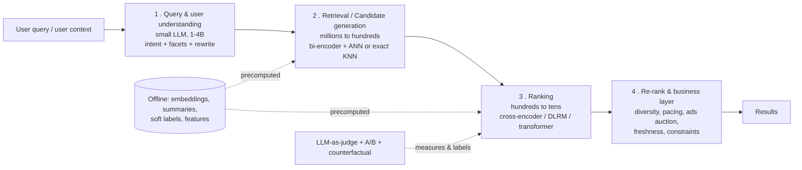
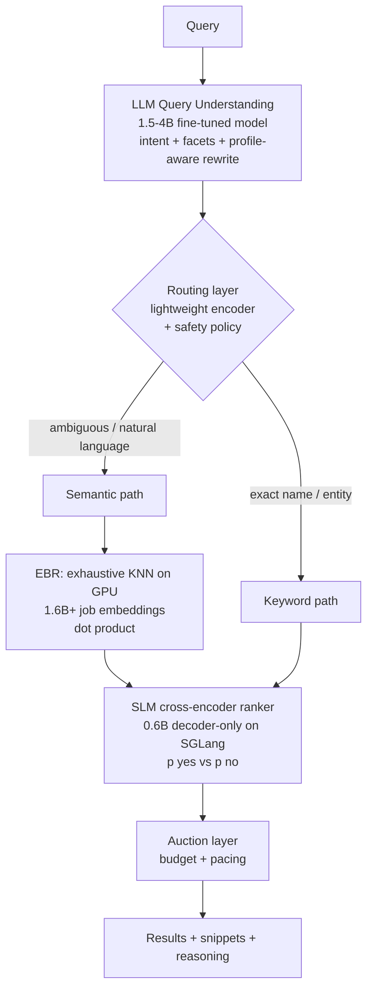
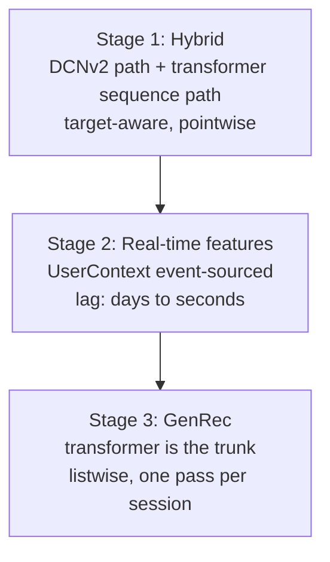

# LinkedIn + Uber AI Engineering Blogs — Interview-Ready Notes

> **Who this is for:** an experienced software engineer moving into AI/ML (e.g. while doing the IIT-B DS&AI diploma).
> **What this is:** the 7 most interview-relevant posts from [LinkedIn Engineering](https://www.linkedin.com/blog/engineering) and [Uber AI/ML](https://www.uber.com/en-IN/blog/engineering/uber-ai/), rewritten as *answers you can speak out loud*.
>
> Related notes in this repo: [ai-engineer-roadmap.md](ai-engineer-roadmap.md), [caching.md](caching.md), [latency.md](latency.md), [distributed-systems.md](distributed-systems.md), [databases.md](databases.md).

---

## 0. How to use this document

| Stage | What to do |
|---|---|
| First pass | Read §1 (the one diagram) and §3 (cheat sheet). That is 80% of the vocabulary. |
| Second pass | Read the 7 case studies in §2. Each has **Problem → Design → Numbers → Interview angle**. |
| Night before | Skim §4 (numbers), §5 (Q&A bank), §6 (design templates). |
| In the room | Pick **two** case studies and know them cold. Depth beats breadth. Interviewers punish name-dropping. |

**The single most important reframing:** these blogs are not "AI papers." They are *distributed-systems posts where one of the services happens to be a neural network*. Latency budgets, caching, precomputation, throughput/GPU, online-offline parity, cost amortisation — you already speak this language. That is your edge as a switcher.

---

## 1. The one diagram: the universal retrieval funnel

Both companies — and Google, Meta, Amazon, Netflix, Flipkart, Swiggy — build the same shape. Learn this once and you can answer 60% of AI system design questions.



### Why the funnel exists (say this verbatim in an interview)

> "You cannot run an expensive model over every document. So you build a cascade: each stage is ~10x cheaper per item and ~10x less accurate than the next, and each stage cuts the candidate set by 10–1000x. Retrieval optimises **recall** — never lose the right answer. Ranking optimises **precision** — put the right answer at position 1. The whole game is choosing where to spend your compute budget."

### The two model shapes you must be able to contrast

| | **Bi-encoder (two-tower / dual-tower)** | **Cross-encoder** |
|---|---|---|
| Structure | Query and item encoded **separately** | Query and item encoded **together** in one prompt |
| Score | dot product / cosine of two vectors | model outputs a score directly |
| Item embeddings | **Precomputable offline** | Impossible — depends on the query |
| Cost | O(items) offline + O(1) online + cheap vector math | O(query × items) online |
| Accuracy | Lower — no query-item token interaction | Higher — full attention across the pair |
| Used for | **Retrieval** (LinkedIn EBR, Uber TTE) | **Ranking** (LinkedIn SLM ranker) |

> **The one-liner:** "Bi-encoders are fast because they let you cheat with precomputation. Cross-encoders are accurate because they don't."

**Middle ground worth mentioning:** *late interaction* (ColBERT) — multi-vector per document, cheap MaxSim interaction. LinkedIn explicitly names this as their next step.

---

## 2. The seven case studies

---

### CASE 1 — LinkedIn: Reimagining the search tech stack (AI Job Search + People Search)

📎 [Blog](https://www.linkedin.com/blog/engineering/search/reimagining-linkedins-search-stack) · Jan 2026 · *the single richest post of the set*

#### Problem
Keyword search fails on **vocabulary mismatch**. A member types *"remote roles where I can use my Python skills to help with climate change"* — no job posting contains those words in that order. They needed semantic understanding at **millions of queries per second**, without the inference bill exploding.

#### The architecture



#### Component by component

**1. Query understanding.** One fine-tuned **1.5–4B model** replaced *multiple brittle NER and heuristic components*. It does intent classification + facet extraction (title, company, school, location) + profile-aware rewriting in a single pass.
> 🎯 **Interview gold:** "They collapsed a pipeline of hand-written NER and rules into one small fine-tuned model. That's the classic 2024-26 pattern — replace a chain of brittle specialists with one distilled generalist, and you get fewer failure modes plus one thing to retrain."

**2. Intelligent routing.** A *lightweight encoder* classifies the query at high QPS and picks the path: expensive semantic interpretation only when the query is ambiguous; cheap keyword lookup for `"Satya Nadella"`. Also runs policy-based safety checks.
> 🎯 This is **model routing / cost-aware serving**. Same idea as an L7 load balancer choosing a backend — see [load-balancer.md](load-balancer.md).

**3. Embedding-Based Retrieval (EBR).**
- Fine-tuned an **open-source LLM embedding model** into a dual-tower bi-encoder (query encoder + job encoder → shared semantic space).
- Trained end-to-end with **Hugging Face Accelerate + PyTorch FSDP** across many GPUs.
- **Training/serving consistency via a prompt template** — the *same* template at train time and serve time:
  ```
  Instruct: Given a job search query, retrieve relevant job postings
  Query: {query}
  {Optional Aspect e.g. Company}: {company}
  ```
- **Loss = InfoNCE contrastive + margin-based pairwise ranking.**
  - InfoNCE: pull the positive job toward the query, push the negatives away.
  - Pairwise margin: force $\text{sim}(q, d^+) > \text{sim}(q, d^-) + \gamma$.
  - Total: $\mathcal{L} = \mathcal{L}_{\text{InfoNCE}} + \lambda\,\mathcal{L}_{\text{pair}}$
- **Hard positives / hard negatives mined from LLM-judged data.** Hard positive = LLM says relevant but the model ranks it low. Hard negative = LLM says irrelevant but the model ranks it high. *These are exactly the examples where the model is wrong* — training on them is far more efficient than random samples.
- **Serving:** all job embeddings precomputed into **GPU-backed indexes**; at runtime only the query is encoded, then **exhaustive (brute-force) KNN** over **1.6B+ docs** on GPU with dot product.

> 🎯 **Counter-intuitive point worth raising:** they use **exhaustive** search, not HNSW/IVF-PQ. Modern GPUs make brute force on billions of vectors viable, and it gives **100% recall** — no approximation error to debug. "ANN is a workaround for not having enough parallel compute" is a genuinely sharp thing to say.

**4. SLM ranking (the cross-encoder).** A **decoder-only 0.6B** model. Structured prompt = system prefix + query + item attributes + suffix. Then:

$$p_{\text{yes}} = \frac{e^{\text{logit}_{\text{yes}}}}{e^{\text{logit}_{\text{yes}}} + e^{\text{logit}_{\text{no}}}}$$

Rank by $p_{\text{yes}}$.
> 🎯 **Why this is clever:** they don't *generate* text. They read the logits of two specific tokens after a single forward pass. Generation is autoregressive and slow; one forward pass + a softmax over 2 tokens is a classifier wearing an LLM costume. Say this and you sound like a practitioner.

**5. Multi-teacher, multi-task distillation.** Teachers: a **relevance** teacher (from product policy) and **engagement** teachers (job views, applies, recruiter accepts; for people search: profile views, connects, messages, follows). A 7B policy model was first distilled to **1.7B** to be an affordable teacher. Teachers run **live on sampled production traffic** producing soft probabilities; the **0.6B student** trains with **KL divergence** against the teacher ensemble.

| Model | NDCG@10 | Apply AUC | Click AUC |
|---|---|---|---|
| Relevance Teacher 1.7B | 0.9484 | – | – |
| Engagement Teacher 1.7B | – | 0.8049 | 0.6772 |
| **SLM 0.6B (distilled student)** | **0.9239** | **0.8007** | **0.6704** |

> A third of the size, ~97% of teacher NDCG, ~99% of engagement AUC.

**6. Inference efficiency — the three-lever stack (memorise this table).**

| Setup | NDCG@10 | Throughput (items/sec/GPU) |
|---|---|---|
| SLM with raw text | 0.9432 | 290 |
| Pruned SLM + summarised text | 0.9218 | 2,200 (**7.6×**) |
| SLM with embedding compression | 0.9239 | **22,000 (75×)** |

- **Model pruning** — *structured* only: remove whole MLP neurons, attention heads, transformer layers, then fine-tune to recover. They explicitly reject unstructured pruning: "drops individual weights but often provides no meaningful speedup without specialized hardware."
  > 🎯 **Say this:** "Sparsity you can't schedule on a dense GEMM kernel is sparsity you don't get paid for."
- **Context pruning** — job descriptions are **median ~900 tokens, max >2,300**, making up **>94% of the prompt**, and ~10% of inputs were being truncated at the 2,048 limit. Removing them destroyed quality, so instead a **1.7B model summarises descriptions offline**, refreshed via streaming updates. The summariser is RL-fine-tuned with reward = *semantic consistency* (KL between the ranker's output on summarised vs raw text) − *length penalty*, weighted by $w$.
  > 🎯 That reward design is beautiful: the summary is optimised **for the downstream consumer**, not for human readability.
- **Embedding compression** — attention is $O(n^2)$ in sequence length, so they invented a text–embedding hybrid architecture that compresses an item's description into a **single-token embedding** produced by an encoder LLM, cached nearline, and injected into the ranker LLM. Two 0.6B models trained **jointly**. Only high-signal raw fields (title, company, location) stay as text.

**7. LLM-as-a-judge (the evaluation backbone — arguably the most transferable idea).**
- Product managers write a **product policy** rating query–document pairs on a **5-point scale**, and act as a "Supreme Court", calibrating until **weighted Cohen's Kappa ≥ 0.8**. Only then are their labels treated as ground truth.
- **Golden set construction:** categorise queries by attribute (title–company, name–company, title–skill), split into *existing* vs *aspirational* queries, then **stratified sample** to guarantee coverage.
- Prompt-engineer a SOTA LLM to maximise Kappa against the golden set, then **distil into an 8B evaluator** that grades **tens of millions of pairs daily**.
- Continuous loop: sample/synthesize queries → run them → decorate docs → grade with the judge → compute **precision, recall, NDCG**.
- The judge serves **three** purposes: monitor production relevance, evaluate experiments, and **generate training labels for the retrieval and ranking models**.

> 🎯 **This is the highest-leverage answer in the whole document.** Whenever an interviewer asks "how do you evaluate an LLM feature?", give this structure: *policy → human golden set with an inter-annotator agreement bar → prompt-engineered judge → distilled cheap judge → continuous scoring → labels feed back into training.* Note the ordering: **they built evaluation first**, then the models.

**8. Explainability.** Snippets = cosine similarity between the query embedding and **precomputed unigram/bigram phrase embeddings** per profile section, stored in **Venice** (LinkedIn's derived-data KV store), served with lazy loading + caching. A "reasoning" module emits a *thinking state* ("Searching for community development specialist at MSA Professional Services affiliated with Berkeley"), **cached in Couchbase** and reused for repeated or semantically similar queries.
> 🎯 **Semantic caching** — see [caching.md](caching.md). Cache key is an embedding neighbourhood, not a string hash.

#### Headline outcomes
- Double-digit improvements in search quality and member engagement.
- Click AUC **0.61 → 0.67** with 6+ multitask objectives.
- **Inference cost comparable to the traditional RecSys models they replaced.** That is the punchline: LLM quality at RecSys cost.

---

### CASE 2 — LinkedIn: The training infrastructure behind AI job search (8× faster distillation)

📎 [Blog](https://www.linkedin.com/blog/engineering/infrastructure/the-training-infrastructure-behind-ai-powered-job-search-eight-x-faster-multi-teacher-distillation) · Aug 2026 · *the MLOps / platform-engineering post*

#### Problem
Distillation **moves cost from serving to training**. Serving is now cheap (0.6B student at **~22,000 req/sec/GPU**) — but a full training iteration took **~45 hours**, so *infrastructure, not modelling*, capped how fast the product could improve. Worse, every run re-ran the entire chain even when only the student changed.

#### The two costs of multi-teacher distillation
Student loss: $\mathcal{L}_{KD} = \text{CE}(\text{hard labels}) + \text{KL}(\text{teacher soft labels})$

1. **Compute** — every teacher does a forward pass over every batch, and teachers are many times larger than the student.
2. **Data movement** — the embedding teacher emits large dense tensors that must reach the student *every step*. This became a **network bandwidth bottleneck**.

> 🎯 "Distributed training problems are almost always one of these two: you're compute-bound or you're bandwidth-bound. Naming which one you're solving is the whole answer."

#### Fix 1 — Make teacher fine-tuning fast
- **PyTorch FSDP** with a *configurable* sharding policy (models span many sizes/architectures — one strategy doesn't fit all).
- Migrated to **FSDP2 + HSDP (Hybrid Sharded Data Parallel)**: **shard fully within a node, replicate across nodes.** Inter-node traffic drops from expensive *parameter all-gathers* to just *gradient all-reduces* — because **intra-node NVLink bandwidth ≫ inter-node network**.
- **Liger kernels** (LinkedIn's own open-source Triton kernels), latest CUDA/PyTorch, migration to **H200**.
- ➡️ **~25h → <12h** on 20M records, **+75% batch size**, **2× hardware FLOPs utilisation**, quality preserved.

> 🎯 **HSDP is a great thing to know.** ZeRO-3/FSDP shards params+grads+optimizer across *all* GPUs — maximum memory saving, maximum communication. HSDP says: shard inside the fast domain, replicate across the slow domain. It is **topology-aware parallelism**. Direct analogue: rack-aware replica placement in [distributed-systems.md](distributed-systems.md).

#### Fix 2 — Online distillation (teachers live alongside the student)
- Naive start: all teachers co-located with the student on one node. Simple, but teachers and student **compete for the same GPUs**; adding a teacher or growing the batch OOMs.
- **Biggest single lever:** stop using a plain `model.forward()` for teacher inference. Run each teacher on a **high-throughput inference engine — the same one that serves production ranking — with continuous batching and paged attention.**
  ➡️ **2× faster teacher inference, 4× larger batches (or 5× more augmented samples).**
- Plus **tensor parallelism** for the big teachers and **prefetching the next batch's teacher inference** so it overlaps with the student's backward pass.
- Multi-node: student sharded with data parallelism; **each teacher replicated on every node** so outputs stay on-box — trading extra GPUs for zero per-step network cost.
- ➡️ **~45h → ~10h.**

> 🎯 **The lesson that gets you hired:** *"They used a serving engine for a training workload."* Training loops call models naively — batch size 1-ish, no KV cache management, terrible utilisation. vLLM/SGLang-style continuous batching + paged attention exist to fix exactly that. Reaching across the training/serving boundary is the kind of insight that reads as senior.

#### Fix 3 — Offline distillation (decouple and cache)
- **Stage 1:** each teacher runs inference over the data **once**, writing soft labels/embeddings to **HDFS**. Cache key = **(model version, data fingerprint)** — updating one teacher does **not** invalidate another's cache.
- **Stage 2:** student trains purely from the cache. **Zero teacher GPUs needed.**
- **Per-shard cache granularity**, not all-or-nothing: new/modified shards trigger inference, unchanged shards reuse cache.
- **Streaming data pipeline** reads directly from HDFS instead of staging the whole dataset to local disk first — killing startup time and local storage needs. (Profiling this path also uncovered a dataloader bug whose fix improved both speed *and* quality.)
- Cache generation costs **<2 hours**, paid **once per (teacher, data) version**, then amortised over every student iteration.
- ➡️ **<5 hours end-to-end. 8× faster than the original ~45h. Quality-neutral.**

> 🎯 This is **cache invalidation and memoisation**, straight out of [caching.md](caching.md). Key insight: *"Teams iterate on the student far more often than on the teachers or the data, so re-paying for teacher inference on every run was pure waste."* Optimise for the actual access pattern.

#### The unified Ray platform
Four component types on a **heterogeneous GPU cluster**:

| Component | Job |
|---|---|
| **Inference workers** | Run teachers on dedicated GPU nodes via the production serving engine; independently scaled with DP/TP; also **write to cache in the background** while serving live |
| **Cache readers** | Serve precomputed outputs from shared storage instead of a live fleet |
| **Collector** | Sits on the trainer node, merges all teacher outputs (live or cached) — averaging or **learned weighting** |
| **Trainer orchestrator** | Checks cache per teacher, routes to live-vs-cache, fuses embeddings into student input, computes KD loss, backprops |

The elegant part: **online vs offline is a per-teacher decision inside one run.** Warm cache for teacher A + updated teacher B → read A, run B live. Over successive runs the system **naturally converges toward fully cached operation**, shedding GPU cost automatically as teachers stabilise. Topology (number of teachers, DP/TP degree of each) is **configuration, not a rewrite**.

> 🎯 **Business framing to use:** *"Most of the savings came from eliminating GPU waste, not from adding GPUs."* Interviewers at any level love cost framing.

**What's next (good "where is this going" answer):** turning it into a backend-agnostic distillation framework, and noting that **RL post-training has the identical shape** — reward and reference models stand in for teachers. So one platform can serve distillation *and* RLHF/RLAIF.

---

### CASE 3 — LinkedIn: Rebuilding Follows Recommendations with LLM semantic retrieval

📎 [Blog](https://www.linkedin.com/blog/engineering/ai/rebuilding-linkedins-follows-recommendations-with-llm-based-semantic-retrieval-and-ranking) · Aug 2026 · *the best cold-start story*

#### Problem
The old system used heuristic candidate generation + **popularity-driven ranking**. Two failures:
1. It missed strong-but-unpopular matches — *"a robotics engineer who would value a lesser-known researcher writing about embodied AI."*
2. **New members** had almost no activity, so they got generic popular suggestions. The classic **cold-start** problem.

Root cause, in their own words: *"our system ranked creators without really understanding them."*

#### Design

**Step 1 — Profile → prompt.** Profiles are rich but noisy (bio, headline, tagline, skills, experience — all with varying completeness). Embedding raw profile text gives noisy representations. So they **frame profile encoding as a prompting task**. Two options evaluated:

| | Templated prompting | **Narrative prompting (chosen)** |
|---|---|---|
| Form | `Title: X. Company: Y. Skills: Z.` | A short natural-language paragraph describing the person |
| Missing fields | Leaves awkward empty slots | Degrades gracefully |
| Semantics | Flattened, lossy | Preserves nuance |
| LLM alignment | Mismatched with pretraining | **Matches pretraining distribution** |
| Latent interests | No | **Yes — can infer unstated interests** |

> 🎯 **Say this:** "They wrote profiles as prose, not as key-value pairs, because the encoder was pretrained on prose. Aligning your input format with the model's pretraining distribution is free accuracy." This generalises to *every* RAG chunking decision.

**Step 2 — Model choice.** A **mid-size, instruction-tuned encoder**, chosen for three concrete reasons: task-aware embeddings via instruction tuning, **multilingual** support for a global member base, and competitive **MTEB** retrieval/STS scores — sized to balance quality against GPU inference cost.
> 🎯 That's a textbook build-vs-buy justification. Reuse the structure when asked "how do you pick an embedding model?"

**Step 3 — Supervised contrastive fine-tuning.** Bi-encoder with **shared parameters**: one tower encodes the viewer prompt, one encodes the creator prompt. Similarity = **cosine with temperature scaling**. Loss = **InfoNCE** — maximise similarity for real (viewer, creator) follow pairs, minimise against in-batch negatives.

Three efficiency techniques (know all three, they come up constantly):

| Technique | What it does | Trade |
|---|---|---|
| **LoRA (PEFT)** | Low-rank matrices approximate weight updates; applied only to **query, key, value, and dense** modules | Trainable params drop sharply, quality preserved |
| **Mixed precision** | 16-bit for speed/memory (weights), 32-bit where numerics matter (normalisation) | Speed + memory vs stability |
| **Gradient checkpointing** | Store only some forward activations, **recompute the rest** during backprop | **Trades compute for memory** |

**Step 4 — Two EBR pipelines, chosen by latency requirement.**

| | **Offline pipeline** | **Online pipeline** |
|---|---|---|
| Use case | Nightly batch candidate pools | **Member onboarding** — fresh signals, real-time |
| Inference | **Ray** across the GPU cluster; actor model reuses GPU memory; autoscaling + fault tolerance; hundreds of millions of records → HDFS | Encoder hosted on **Proxima** (LinkedIn model hosting); prompt built on the fly from onboarding fields |
| Search | **FAISS `IndexFlatIP`**, **exact KNN** | Hosted vector-search service, high-throughput low-latency KNN |
| Why | Creator set is **< 10M**, so exact beats IVF-PQ/HNSW on precision at acceptable latency | Must answer inside a live request |

> 🎯 **Two details interviewers love:**
> 1. **L2-normalise embeddings, then inner product == cosine similarity.** That's why `IndexFlatIP` is correct. Being able to state this shows you've actually built one.
> 2. **They deliberately chose exact over approximate.** "Under ~10M vectors, ANN buys you very little and costs you recall and a tuning surface." Knowing *when not* to use the fancy thing is a seniority signal.

**Step 5 — Reuse the embeddings in the L2 ranker.** The same viewer/creator embeddings become **features** in the downstream ranking model. Two reasons:
1. Behavioural/categorical/CF features can't capture **profession-level alignment**, especially for cold-start members.
2. **Score consistency** — if EBR runs alongside legacy graph/popularity generators, training the ranker on the same embeddings stops it from mis-scoring LLM-sourced candidates relative to the others.

> 🎯 **This second reason is subtle and impressive.** When you add a new candidate source to a multi-source funnel, the ranker has never seen that distribution and systematically mis-scores it. Feeding the source's own representation into the ranker fixes the calibration. Great answer to *"what breaks when you add a new retrieval source?"*

**The dimensionality problem and its fix.** LLM embeddings are **1,024–4,096 dims** → storage cost, **feature dominance** (they drown the other features), and latency. Solution: **task-aware supervised projection** — two lightweight feed-forward layers (one per side) reduce e.g. 4,096 → 64/128 dims. Crucially they're **trained jointly with the ranking DNN** (FC + ReLU + BatchNorm + Dropout) under **binary cross-entropy on follow probability**, so the compression stays aligned with the objective. Afterwards the projection layers are **extracted as standalone submodules** so low-dim embeddings can be precomputed and served.

> 🎯 **Contrast to offer:** "PCA compresses to preserve variance. A supervised projection compresses to preserve *the signal your task needs*. Different objectives — and only one of them knows what you're predicting." Also mention **Matryoshka embeddings** as the modern alternative.

#### Outcome
Statistically significant **follow-rate lifts across all member segments**, strongest for **new members** — who now get relevant matches in their first session instead of popularity fallbacks.

**What's next:** richer prompts (recent content engagement, browsing, connections — *"what a member is interested in right now, not just what their profile states"*) and **late interaction (ColBERT) / multi-vector** profiles.

---

### CASE 4 — Uber: Two-Tower Embeddings (TTE) at Michelangelo

📎 [Blog](https://www.uber.com/en-IN/blog/innovative-recommendation-applications-using-two-tower-embeddings/) · *the canonical retrieval-system interview answer*

#### Problem
Uber Eats must retrieve the best few hundred stores out of **millions**, in **~hundreds of ms (p99)**. The incumbent was **city-wise Deep Matrix Factorization (DeepMF)**:
- Required **thousands of per-city models**
- **Thousands of Spark jobs run weekly** just to build them
- Not reusable, extremely expensive to maintain
- Only `user_id` and `store_id` as features — nowhere to add context

Uber's terminology: **FPR** = First Pass Ranker (retrieval), **SPR** = Second Pass Ranker (ranking).

#### The complexity argument — memorise this, it's the cleanest version anywhere

Scoring every (eater, store) pair with a deep model online is $O(q \times M)$ **real-time DL inferences** — impossible.

With two towers:

| | Cost |
|---|---|
| Item tower, offline | $O(M)$ DL inference — precompute all store embeddings, build the ANN index |
| Query tower, online | $O(q)$ DL inference — one per request |
| Similarity, online | $O(q \times M)$ **dot products** inside the ANN index — cheap arithmetic, not neural forward passes |

> 🎯 **The sentence:** "Two towers don't reduce the number of comparisons. They make each comparison a dot product instead of a neural network forward pass, and they let you do all the expensive encoding offline." Uber's index is **SIA**, their unified search platform, used across Eats, Groceries and Maps.

#### Why TTE beat DeepMF (three axes)
1. **Scalable labelling** — training labels are user engagement (clicks, orders), free and abundant, versus classification tasks needing manual human tags.
2. **Localisation → scalable training** — TTE uses only 0-hop/1-hop relations in the interaction graph, so features can be **pre-sampled and pre-computed to disk** and streamed batch-by-batch. A **GNN** would need `node_id → features` for the whole graph in memory.
   > 🎯 Great **"why not a GNN?"** answer: *"Graph models need global state; two-tower models are embarrassingly local, which is what makes them trainable at our scale."*
3. **Feature extensibility** — you can add anything to either tower: contextual (query time, order location), numerical (price, rating, delivery distance), NLP (menus, ordered dishes). DeepMF could only take IDs.

#### Training tricks (the technically meatiest part)

**Metric:** `recall@large_N` where N is hundreds→tens of thousands. To optimise recall@hundreds you need **far more than a few hundred negatives** per example.

**a) In-batch negatives.** Reuse other examples' positives in the mini-batch as negatives. Cheap — no extra sampling — but only works if the negatives are *meaningful*.

**b) Spatial indexing.** Recommendations are geospatial: an eater won't order from a far store. Formally, keep candidates where $d_h(L(q), L(i)) < \delta(q,i)$ with $d_h$ = **haversine distance**. So they **geohash and sort** training data before forming mini-batches — putting geographically plausible stores in the same batch, so the negatives are *hard and realistic* rather than trivially wrong.

> 🎯 **This is the single best "hard negative mining" story in the set.** A store in another city is a useless negative — the model learns nothing from it. A nearby store the user *didn't* order from teaches the actual decision boundary. Compare directly with LinkedIn's LLM-judge-mined hard negatives in Case 1: **same principle, different mining mechanism.**

**c) logQ correction.** In-batch negatives approximate a full softmax, but they're **biased toward popular items** (popular items appear as positives more often, so they get punished as negatives more often). Correct it by subtracting the log sampling probability:

$$s^{\text{corrected}} = \frac{s}{T} - \log Q, \qquad Q = 1 - (1-w)^{B}$$

where $B$ = batch size and $w$ = the item's weight in the full data.

➡️ **recall@500 improved from 89% → 93%.**

> 🎯 A concrete, memorable number attached to a specific bias fix. Perfect interview ammunition.

**d) Bag-of-Words (BOW) activity features.** Instead of a giant `eater_uuid` embedding table, represent an eater by their **time-decay-sorted list of previously ordered `store_id`s** over several months.
- ➡️ **20× smaller model** (millions of stores ≪ hundreds of millions of eaters)
- ➡️ **Partially solves eater cold start** — a brand new eater with two orders already has a usable representation

> 🎯 **Deep, reusable idea:** "Represent a user by the items they've touched, not by their identity." The user embedding table is the expensive, cold-start-prone part; the item table is smaller and shared. This is also why sequence models (Case 5) work so well.

**e) Layer sharing between the two towers.** Atypical for textbook TTE, but critical here: the query tower and item tower **share the same UUID embedding layer**. Layer sharing is old (LeCun's 1989 zip-code CNN, AlexNet, transformers) but usually *within* a module — here it's *across two nominally independent towers*.
> 🎯 **Why it works:** stores appear both as items and inside eaters' BOW history. Sharing the table means both towers land in a genuinely shared space and every store gets gradient from both sides.

#### Platform integration (the "productionising ML" angle)
Previously "a collection of custom PySpark jobs." Now fully inside **Michelangelo**:
- **Palette** (feature store) tightened with the search platform, so registered embeddings serve **online and offline via config**, not code.
- **Canvas** training framework extended with new modules/feature encoders, so other teams train TTE models **spec-driven**, with standardised retraining, deployment, and the online prediction service.

#### Challenges they call out honestly
| Challenge | Detail |
|---|---|
| **Model size** | Ablations showed `eater_id` + `store_id` are crucial, but both are **high-cardinality** → huge embedding tables |
| **Training time** | Days to weeks |
| **Evaluation** | AUC/NDCG **ignore context**. Built a session-level, location- and context-aware **Factorized Top-K** framework → recall@k **plus business metrics** |

> 🎯 The evaluation point is excellent: *"offline metrics that ignore context will happily reward a model that recommends a great restaurant 40 km away."* Always tie an offline metric to a business metric.

#### Results
- **One global contextual model replaced thousands of city DeepMF models**
- Scales to **hundreds of millions of eaters, millions of stores, hundreds of millions of grocery items**
- Training cost: **hundreds of thousands of core-hours → thousands of core-hours per week**
- **Three production uses:** Eats homefeed FPR; **final ranking layer** for grocery item feed (where a full ranker was too expensive); **transferable embedding features** for downstream models including risk

> 🎯 Note use #2: a **retrieval architecture used as the ranker** because the proper ranker's feature-fetch latency was unaffordable. Cost, not accuracy, drives real architecture choices.

---

### CASE 5 — Uber Eats: From DLRM to a Generative Recommender

📎 [Blog](https://www.uber.com/en-IN/blog/next-gen-restaurant-recommendation/) · Apr 2026 · *the "where recsys is heading in 2026" post*

A clean three-step evolution. Learn it as a narrative — it doubles as an answer to *"how would you modernise a legacy recommender?"*



#### Stage 1 — Statistics → behavioural sequences
Baseline `DeepCVR` used aggregate statistics and hand-crafted features: good at steady-state preference, blind to **chronological context**.

Dual-path hybrid:
- **DLRM/DCNv2 path** — high-dimensional sparse features + dense statistics (steady-state eater preference, merchant characteristics).
- **Sequence path** — chronological log of clicks and orders through **multi-head self-attention**, capturing temporal dependencies and **evolving intent**.

**Target-aware sequence modelling (the key trick):** instead of encoding the user's history in isolation, they **append the target store to the sequence**. The transformer then computes the direct relationship between past behaviour and *this specific candidate*. Inspired by **DIN (Deep Interest Network)** and **BST (Behavior Sequence Transformer)**.

> 🎯 **Why it matters:** a single user embedding must summarise *all* interests at once. Target-aware attention lets the model ask a narrower question: "given that I'm scoring a sushi place, which parts of your history matter?" This is **cross-encoder thinking applied to sequences** — and it's exactly why it goes in the ranking stage, not retrieval.

#### Stage 2 — Batch → near-real-time features (the best MLOps section of any of these posts)
Old features came from offline jobs with **24h+ lag** — the model literally could not see what you clicked five minutes ago.

- **UserContext**: a **near-real-time, cross-line-of-business, event-sourced history of user actions** in the Next Personalization Platform. Features are computed **on the fly from the action sequence**, not read from pre-materialised aggregates.
- **FeatureExtractors**: pure Java functions invoked by the online Feature Store service.
- **The parity mechanism:** for training data, a **Spark job reconstructs UserContext as of each past inference timestamp** and invokes **the exact same FeatureExtractors**.

> 🎯 **This is the answer to "how do you prevent training–serving skew?" and it is a top-5 ML systems interview question.**
> Say: *"Two things. First, one implementation of the feature logic used by both paths — not a Python copy of a Java function. Second, point-in-time correctness: you replay the event log to the historical timestamp so training never sees data that didn't exist yet. Then you verify continuously with sampled feature logging comparing live outputs against offline recomputation."*
> The failure it prevents: **label leakage / time travel**, where an aggregate silently includes post-event data, your offline AUC looks fantastic, and the A/B test is flat.

- ➡️ Lag from **days to a few seconds**; *"particularly transformative for cold-start users."*
  > 🎯 **Insight:** cold start isn't only about *new* users — it's about *any* user you don't have fresh signal for. Freshness is a cold-start fix.

#### Stage 3 — Discriminative/pointwise → Generative/listwise
Even the hybrid was **pointwise**: one forward pass per (user, store) pair, with two paths merged at the end.

- **Transformer becomes the trunk.** No parallel DLRM path. Non-sequence features are transformed and **concatenated onto target token features** before entering the transformer, acting as enriched token representations.
- **Pointwise → listwise.** The model takes **an array of candidate stores from the same session** and scores the whole list in **one forward pass** — cutting per-store complexity to roughly **1/T** (T = number of targets).

> 🎯 **Two wins in one, and you should name both:**
> 1. **Efficiency** — one pass instead of T passes, amortising the shared user-history encoding.
> 2. **Quality** — a listwise model can see the candidates *in context of each other*, so it can reason about **diversity and relative ordering**. A pointwise model scores each item in a vacuum and then you sort; it has no idea it just returned five identical pizza places.

#### ML systems optimisation (pure engineering — your home turf)
| Change | Why | Result |
|---|---|---|
| **Keras/TF → PyTorch v2** | Flexibility for advanced sequence architectures | Enabler |
| **Multi-hash embeddings** | Handle high-cardinality IDs without a giant table (hashing trick with multiple hash functions to cut collisions) | Material throughput gain |
| **BF16 mixed precision** | Wider dynamic range than FP16, no loss-scaling fiddling | Notable speedup |
| **ONNX → TensorRT converted offline**, hardware-aware packaging | On-the-fly conversion caused **10–60s startup delays** and GPU contention | Near-zero cold-start, reproducible across a heterogeneous GPU fleet |
| **CPU/GPU disaggregation** | GPU utilisation was low because GPUs were doing CPU-bound feature preprocessing | **Double-digit % throughput gain per node**, minimal added latency |

> 🎯 **The disaggregation point is the most transferable.** *"Your GPU is the most expensive resource in the building; anything it does that isn't matrix multiplication is waste. Split preprocessing onto CPU nodes and let GPUs do nothing but inference."* Same reasoning as separating compute from storage — see [cloud-native.md](cloud-native.md).
> **The TensorRT point is a classic ops bug:** JIT compilation at process start = slow cold starts + thundering-herd GPU contention during a deploy. Move it to build time.

#### Roadmap (three genuinely hard open problems — good to raise)
1. **Account-life sequence learning** — extend from medium-length sequences to months/years, to separate *transient cravings* from *deep preferences*.
2. **2-D whole-page personalisation** — the homefeed isn't a 1-D list, it's carousels. Optimise the **whole page layout**, visual flow and diversity, jointly.
3. **Real-world constraints** — delivery radius, physical location, and the multi-objective tension between **reorder intent vs new discovery**.

---

### CASE 6 — Uber: Open source + in-house LLM training (the GPU efficiency post)

📎 [Blog](https://www.uber.com/en-IN/blog/open-source-and-in-house-how-uber-optimizes-llm-training/) · *everything you need for "how do you train/serve an LLM at scale?"*

#### Why Uber fine-tunes at all
GenAI powers Eats recommendations/search, support chatbots, code development, SQL generation. They use closed APIs (OpenAI, Google) **and** open models (Llama 2, Mixtral) — but Uber has domain knowledge that generic models lack. Two ways to inject it: **RAG**, and **continuous pretraining + instruction fine-tuning**.

> 🎯 **The money quote:** a model fine-tuned on Uber's knowledge of items, dishes and restaurants beat generic open models on item tagging, search queries and preference understanding, and **"can achieve similar performance to GPT-4 models while allowing for much more traffic at Uber's scale."**
> That is the **build-vs-buy** answer: at high QPS, a small fine-tuned open model beats a frontier API on cost, latency, throughput limits and data residency. Below that volume, the API wins on engineering cost. **Know where the crossover is and say so.**

#### The stack, layer by layer
| Layer | Technology |
|---|---|
| **L0 Hardware** | On-prem: 4× **A100**, 600 GB RAM, 3 TB SSD per host. GCP: `a3-highgpu-8g` = 8× **H100**, 1,872 GB RAM, 6 TB SSD. Managed by **Crane**. |
| **L1 Orchestration** | **Kubernetes** (schedules workloads, hardware requirements) + **Ray** and the **KubeRay** operator (distributes work to workers) |
| **L2 Federation** | A federation layer over multiple K8s clusters, scheduling by resource availability. Jobs modelled as a **Job with multiple Tasks**; a **JobSpec** declares the goal state — instance SKUs, clusters, compute/storage, post-Docker-launch commands |
| **Training** | **PyTorch** + **Ray Train** + **HF Transformers** + **DeepSpeed** + **NCCL** (Ray coordinates at the top, NCCL does GPU communication at the bottom) |

> 🎯 **JobSpec = declarative desired state.** Same idea as a Kubernetes manifest or Terraform plan. Easy point to connect to your existing infra experience.

#### The distributed training pipeline
1. **Multi-host/multi-GPU comms** — `TorchTrainer` (Ray Train) creates workers as **Ray Actors**, handles in-bound communication via the Ray Object Store, and initialises a **PyTorch distributed process group** used by DeepSpeed across all hosts.
2. **Data prep** — remote sources: Uber HDFS, **Terrablob**, HF public datasets.
3. **Training** — tokenise; each GPU worker initialises an HF `Trainer` with **DeepSpeed ZeRO stage 1/2/3**.
4. **Results** — metrics to **Comet**; weights + configs pushed from the Ray head node to **Terrablob**.

**ZeRO stages — know the ladder:**
| Stage | Shards across GPUs | Memory saved | Comms added |
|---|---|---|---|
| 1 | Optimizer states | ~4× | Low |
| 2 | + Gradients | ~8× | Medium |
| 3 | + Parameters | Linear in GPU count | High (param all-gathers) |

#### Finding 1 — LoRA/QLoRA is not free
Training-loss curves for Llama 2 13B and 70B with and without (Q)LoRA: **LoRA/QLoRA use far fewer GPUs and train much faster, but the loss decreases much less than full-parameter training.** Their conclusion: *therefore it's important to improve throughput/MFU for full-parameter fine-tuning.*

> 🎯 **A genuinely valuable, non-obvious takeaway.** Most people repeat "just use LoRA." Uber's data says LoRA is a *capacity-limited approximation*: excellent for style/format/task adaptation, weaker when you need to move a lot of knowledge. **When you need real capability change, you need full fine-tuning — so make full fine-tuning affordable.** Saying this marks you out from people who only read tutorials.

#### Finding 2 — Two memory levers, and which one to reach for
| Optimisation | Mechanism | Measured result (Llama 2 70B) |
|---|---|---|
| **DeepSpeed ZeRO-3 CPU optimizer offload** | Move optimizer states to CPU RAM | **≥34% GPU memory freed** at the same batch size → **3–4× batch size** at the same fwd/bwd speed → **2–3× throughput** |
| **Flash Attention** | IO-aware tiled attention; never materialises the $n \times n$ matrix | **50% GPU memory saved** at the same batch size → **2× batch size** |

Both work by the same chain: **free memory → bigger batch → better GPU utilisation → more throughput.**

> 🎯 **Flash Attention in one sentence:** "It doesn't change the maths of attention; it changes the memory access pattern — tiling the computation in SRAM so the $O(n^2)$ matrix is never written to HBM. Same result, far less memory traffic." That's an $O(n^2)$-memory → $O(n)$-memory win, and attention is memory-bandwidth-bound, so it's also faster.

#### Finding 3 — MFU, and diagnosing memory-bound vs compute-bound
**MFU (Model FLOPs Utilisation)** = observed throughput ÷ theoretical maximum throughput at peak FLOPS with zero memory/communication overhead. Measured with the **DeepSpeed Flops Profiler**: FLOPS/GPU = (forward+backward FLOPS) ÷ iteration latency, then ÷ device peak. They set `gradient_accumulation_steps = 1` so `macro_batch = micro_batch × num_gpus`.

| Workload | Diagnosis | What helped most |
|---|---|---|
| **Llama 2 70B**, 32 GPUs (8× A100 hosts / 4× H100 hosts) | **Memory-bound** — MFU lower on H100 than A100, GPU util not full even at max memory | **CPU offload** |
| **Llama 2 7B**, 4 GPUs single host | **Compute-bound** — higher MFU than 70B, CPU offload didn't help | **Flash Attention** |
| Network | 10 GB/s on H100, 3 GB/s on A100 — *small vs infra theoretical* | **Not a bottleneck** |

> 🎯 **This is a complete performance-engineering answer, and it's the highest-signal thing in the post.**
> *"First measure MFU. If MFU is low and memory is saturated but SM utilisation isn't, you're memory-bound — offload or shard to free memory and grow the batch. If MFU is already decent and you're compute-bound, memory tricks won't help; you need better kernels, like Flash Attention. And measure the network before assuming it's the problem — for us it wasn't close."*
> Amdahl's law applied to GPUs. Never optimise before profiling. Bring this to any perf question.

#### Finding 4 — The LLM Scorer (offline batch inference)
For evaluating raw or fine-tuned models over large datasets:
- **Ray** cluster on Kubernetes, multiple instances, multiple GPUs each
- **vLLM** as the inference server on each instance
- Ray jobs allocate CPU/GPU, download models, **partition datasets by rank**; a Ray **`ActorPool`** aggregates outputs
- Benchmark (Mixtral 8x7b, 2 GPUs, 4K input tokens, 700 max output tokens): output tokens/sec scales **linearly up to batch size 64**; **H100 delivers ~3× A100 throughput**

> 🎯 Two things to extract: (a) **batch inference is a different problem from online serving** — you optimise throughput, not latency, so you push batch size until it stops scaling; (b) benchmark-driven capacity planning: *"this benchmark helps teams make production decisions and plan resource requirements."*

#### Their own conclusions (good closing lines)
1. **Embracing open source is key to keeping up with GenAI.** Hugging Face and DeepSpeed moved fast; new architectures (Falcon, Llama, Mixtral) ship every few months.
2. **Long-tested, extensible cluster management is critical.** A mature **Ray + Kubernetes** stack made integrating each new open-source component easy.

> 🎯 Translation: **the moat is the platform, not the model.** Models are commoditising; the ability to adopt a new one in a week is what compounds.

---

### CASE 7 — Uber: uSpec, an agentic system for design specs

📎 [Blog](https://www.uber.com/en-IN/blog/automate-design-specs/) · Mar 2026 · *your MCP / agent talking point*

#### Problem
Uber's Base design system has **hundreds of components** shipping across **7 implementation stacks** (UIKit, SwiftUI, Android XML, Android Compose, Web React, Go, SDUI). Each component needs a 6-section spec: **anatomy, API, properties, colour annotation, structure, screen reader**. The accessibility section alone spans **three APIs** (VoiceOver, TalkBack, ARIA), each with hundreds of properties — and *"a single wrong property means a broken experience for assistive technology users."* Manual specs are slow, inconsistent across authors, and **drift out of date the moment a component changes.**

#### Architecture
An AI agent in **Cursor** connected to **Figma** through the open-source **Figma Console MCP** — over a **local WebSocket to Figma Desktop**. The agent crawls the real component tree, compiles it with your added context, and **renders finished spec pages directly into the Figma file**.

Two layers:
1. **Agent skills encode domain knowledge.** Each spec section has its own skill, and each skill **loads its own instruction file with validation rules, structured schemas, and reference documentation**. The screen-reader skill loads the VoiceOver/TalkBack/ARIA property references *before* analysing the component — so **"the agent doesn't guess at property names — it selects from documented APIs."**
2. **MCP gives read-write access.** Each skill declares which data it needs (colour annotation → token values; screen reader → screenshots + structure). The agent crawls the tree, identifies sub-components and slot-based compositions, **detects when designers used variables in place of variants**, and translates Figma's internal modelling into clean API docs. Then it imports the template, detaches it, and populates it — text fields, cloned sections, tables, markers — all through MCP.

#### The design principle worth stealing
> **"AI judgment where interpretation matters — classifying accessibility semantics, selecting the right token mappings, deciding how to structure a spec — and programmatic scripts where precision matters, rendering the result directly in Figma."**

🎯 **This is the best one-line agent design principle in the whole document.** A plugin can *extract* data but can't *interpret* it. An LLM can interpret but is unreliable at deterministic mechanics. **Use the LLM for judgment, use code for execution.** Deploy this answer whenever asked "where should an LLM sit in this workflow?"

#### Why it works at enterprise scale (six properties)
| Property | Detail |
|---|---|
| **Security** | Entire pipeline runs **locally**. MCP → Figma Desktop over local WebSocket, agent in Cursor on your machine. **No cloud API, no proprietary design data leaving the network.** *"At Uber, this is what makes AI-assisted documentation possible in the first place."* |
| **Consistency** | Structured schemas and templates enforce it, **not authors** |
| **Speed** | Full 3-platform screen-reader spec in **under 2 minutes** |
| **Accuracy** | Reads real token names and variant values from Figma — **no transcription errors** |
| **Multi-platform** | One prompt → iOS + Android + Web accessibility specs in one pass |
| **Maintainability** | Changelogs update in Figma via MCP with a single prompt |

Net effect: **months of spec writing → days.**

> 🎯 **Note the ordering of that list.** Security is #1, and it's what *unlocked* the project. For any enterprise AI question — banking, healthcare, pharma, defence — **lead with the data-residency story.** "Runs locally, nothing leaves the network" is often the difference between a project existing and not existing.

#### Bonus talking points
- **RAG-by-another-name:** skills loading reference documentation before acting is exactly retrieval-augmented generation, scoped per task. Grounding in documented APIs is what stops hallucinated property names.
- **Open-source leverage:** the whole thing rests on a community MCP server built by Southleft. *"The foundation layer and the application layer depend on each other."*
- **Roadmap:** drift detection, code-to-spec generation.

---

## 3. Concept cheat sheet — be able to say each of these in ~20 seconds

### Retrieval & ranking
| Term | Say this |
|---|---|
| **Embedding** | A dense vector where geometric closeness means semantic similarity. Turns human features into ML-friendly numbers usable for clustering, NN-search, or as input features — with no feature engineering. |
| **Bi-encoder / two-tower** | Query and item encoded separately; score = dot product. Item side precomputed offline. Fast, less accurate. **Retrieval.** |
| **Cross-encoder** | Query and item in one prompt, full attention across both. Can't precompute. Accurate, expensive. **Ranking.** |
| **Late interaction (ColBERT)** | Multi-vector per document, cheap MaxSim at query time. Middle ground between the two. |
| **ANN vs exact KNN** | ANN (HNSW, IVF-PQ) trades recall for speed. **Under ~10M vectors, or with enough GPU, exact search wins** — 100% recall, no tuning surface. LinkedIn does exhaustive search on 1.6B+ vectors on GPU. |
| **`IndexFlatIP` + L2 normalisation** | L2-normalise, then inner product **is** cosine similarity. Why FAISS `IndexFlatIP` is the right exact-cosine index. |
| **Recall@K / NDCG@K / AUC** | Recall@K = did we retrieve it at all (retrieval metric). NDCG@K = is it near the top, discounted by position (ranking metric). AUC = ranking quality of a binary classifier. |
| **Hard negatives** | Negatives the model currently gets wrong. Random negatives teach almost nothing; hard negatives teach the decision boundary. Mine them from an LLM judge (LinkedIn) or from geography (Uber). |
| **In-batch negatives** | Reuse other examples' positives as negatives — free, but biased toward popular items. |
| **logQ correction** | Subtract $\log Q$ (sampling probability) from scores to debias in-batch negatives. Uber: recall@500 **89% → 93%**. |
| **InfoNCE** | Contrastive loss: softmax over (one positive + N negatives), scaled by temperature $\tau$. The standard retrieval training loss. |
| **Cold start** | No history for a user or item. Fixes: content/profile embeddings, item-based user representations (Uber's BOW), fresher signals, popularity fallback. |
| **Training–serving skew** | Feature values differ between training and inference. Fix: **one implementation used by both paths** + **point-in-time correct** replay + continuous sampled comparison. |
| **Pointwise vs listwise** | Pointwise scores one item at a time, then you sort — no awareness of the other candidates. Listwise scores the whole candidate list in one pass — cheaper and can optimise diversity/ordering. |
| **Target-aware attention (DIN/BST)** | Append the candidate item to the user's history sequence so attention retrieves the history relevant to *this* candidate, instead of one static user vector. |

### LLM training & serving
| Term | Say this |
|---|---|
| **Knowledge distillation** | A big teacher's soft output distribution supervises a small student. Loss = CE on hard labels + **KL** on teacher soft labels. Soft labels carry more information than a one-hot ("this is 70% a cat, 25% a fox") — that's why the student can beat training on labels alone. |
| **Multi-teacher / multi-task distillation** | Several specialised teachers (relevance, engagement, embeddings) supervise one student, merged by averaging or learned weighting. |
| **Online vs offline distillation** | Online = teachers run live each step (fresh, expensive). Offline = teacher outputs precomputed and cached (cheap, needs invalidation). Best systems make it a **per-teacher decision**. |
| **LoRA / QLoRA** | Freeze base weights, learn low-rank update matrices (LinkedIn applies them to q/k/v/dense). QLoRA adds 4-bit quantisation of the base. Far fewer trainable params — **but Uber measured that loss decreases less than full fine-tuning**, so it's an approximation, not a free lunch. |
| **Gradient checkpointing** | Store only some activations, recompute the rest in backward. **Trades compute for memory.** |
| **Mixed precision / BF16** | 16-bit for speed and memory, 32-bit where numerics matter. BF16 has FP32's exponent range, so no loss scaling needed. |
| **ZeRO / FSDP** | Shard optimizer states (1), + gradients (2), + parameters (3) across GPUs. More sharding = less memory, more communication. |
| **HSDP** | **Shard within a node, replicate across nodes.** Inter-node traffic becomes gradient all-reduce instead of parameter all-gather — because NVLink ≫ the network. Topology-aware parallelism. |
| **Flash Attention** | IO-aware tiled attention that never materialises the $n \times n$ matrix in HBM. Same maths, ~50% less memory, faster because attention is bandwidth-bound. |
| **CPU optimizer offload** | Park optimizer states in host RAM. Frees ≥34% GPU memory → 3–4× batch → 2–3× throughput (Uber, Llama 2 70B). |
| **MFU / HFU** | Achieved FLOPS ÷ hardware peak FLOPS. The single best number for "is my expensive GPU actually working?" |
| **Memory-bound vs compute-bound** | Low MFU + saturated memory + idle SMs = memory-bound → offload/shard. Decent MFU = compute-bound → better kernels. **Profile before you optimise.** |
| **Continuous batching** | The scheduler swaps finished sequences out and new ones in mid-flight, instead of waiting for the slowest sequence in a static batch. Huge throughput win for variable-length generation. |
| **Paged attention** | Manage the KV cache in fixed-size pages like OS virtual memory, eliminating fragmentation and enabling prefix sharing. The core vLLM idea. |
| **Structured vs unstructured pruning** | Structured removes whole neurons/heads/layers → real speedup on dense GPU kernels. Unstructured drops individual weights → usually no speedup without special hardware. |
| **Quantisation** | Lower-precision weights/activations (INT8, INT4, FP8). Smaller and faster; watch for quality loss on hard examples. |
| **Speculative decoding** | A small draft model proposes several tokens, the big model verifies them in one pass. Latency win with identical output distribution. |

### Evaluation & LLM products
| Term | Say this |
|---|---|
| **LLM-as-a-judge** | An LLM scores outputs against a written policy. Validate it against a human golden set (LinkedIn's bar: **weighted Cohen's Kappa ≥ 0.8**), then **distil it** so it's cheap enough to run continuously. |
| **Golden dataset** | Human-labelled ground truth, **stratified** across query categories, including *aspirational* cases you want to get good at, not just existing traffic. |
| **Cohen's Kappa** | Agreement corrected for chance. Use it to prove your judge (or your annotators) actually agree. |
| **Counterfactual evaluation** | Re-rank historical logged candidate lists with the new model and measure against known labels — estimates impact without a live experiment. |
| **RAG** | Retrieve relevant context, put it in the prompt, generate a grounded answer. Uber's uSpec skills loading API reference docs are RAG scoped per task. |
| **MCP (Model Context Protocol)** | A standard protocol for exposing tools and data to a model. Uber's local Figma MCP means proprietary data never leaves the machine. |
| **Agent skill** | A scoped instruction file + validation rules + reference docs + tool permissions, loaded on demand. Narrow context beats one giant prompt. |
| **Semantic caching** | Cache keyed by embedding neighbourhood rather than exact string — so semantically similar queries reuse cached results (LinkedIn caches reasoning output in Couchbase this way). |

---

## 4. Numbers worth memorising

Quoting two or three real numbers makes you sound like someone who reads engineering blogs rather than someone who skimmed a listicle. Always attribute them.

| Number | Context |
|---|---|
| **290 → 2,200 → 22,000 items/sec/GPU** | LinkedIn ranker: raw text → pruned+summarised → embedding compression. **75×**, NDCG@10 ~0.943 → ~0.924 |
| **~22,000 req/sec/GPU** | LinkedIn's 0.6B student SLM in production |
| **7B → 1.7B → 0.6B** | LinkedIn's distillation chain (policy model → teacher → student) |
| **0.9484 → 0.9239 NDCG@10** | Teacher vs distilled student — ⅓ the size, ~97% the quality |
| **Click AUC 0.61 → 0.67** | LinkedIn job ranking after 6+ multitask objectives |
| **1.6B+ vectors, exhaustive GPU search** | LinkedIn EBR — they chose exact over approximate |
| **Kappa ≥ 0.8** | LinkedIn's inter-annotator agreement bar before PM labels count as ground truth |
| **~45h → ~10h → <5h (8×)** | LinkedIn training: baseline → optimised online → cached offline distillation |
| **~25h → <12h, +75% batch, 2× HFU** | LinkedIn teacher fine-tuning after FSDP2 + HSDP + Liger + H200 |
| **2× teacher inference, 4× batch** | From using a production serving engine (continuous batching + paged attention) for teacher inference |
| **recall@500: 89% → 93%** | Uber TTE with logQ correction |
| **20× model size reduction** | Uber's BOW eater features replacing raw `eater_uuid` embeddings |
| **100k+ → ~1k core-hours/week** | Uber: thousands of city DeepMF models → one global TTE model |
| **≥34% GPU memory, 2–3× throughput** | DeepSpeed ZeRO-3 CPU optimizer offload on Llama 2 70B |
| **50% GPU memory saved** | Flash Attention at the same batch size |
| **H100 ≈ 3× A100 throughput** | Mixtral 8x7b batch inference on vLLM |
| **24h+ → seconds** | Uber Eats feature freshness after event-sourced UserContext |
| **10–60s startup delay eliminated** | Moving ONNX→TensorRT conversion from runtime to build time |
| **<2 minutes** | uSpec generating a 3-platform accessibility spec |

---

## 5. Interview Q&A bank

Structure every answer: **(1) restate the constraint → (2) the design → (3) the trade-off → (4) how you'd measure it.**

<details open>
<summary><b>Q1. Design a job / restaurant / product search system.</b></summary>

Draw the funnel from §1. Then talk through:
1. **Understanding** — a small fine-tuned model extracts intent + facets and rewrites the query; a lightweight router sends exact-entity lookups to the cheap keyword path and ambiguous natural language to the semantic path.
2. **Retrieval** — bi-encoder, item embeddings precomputed and indexed, query encoded online, top-K by dot product. Exact KNN if the corpus is small or you have GPUs; ANN otherwise. Optimise **recall@K**.
3. **Ranking** — cross-encoder over the top few hundred, multi-task (relevance + engagement). Optimise **NDCG@10** and per-action AUC.
4. **Business layer** — diversity, freshness, pacing/budget, hard constraints (delivery radius).
5. **Serving** — precompute everything item-side; cache scores; a ranking-depth controller trades depth for latency under load; traffic shaping at peak.
6. **Evaluation** — LLM judge on a policy + golden set, counterfactual replay on logs, then online A/B.

Then name the trade-off you'd be watching: **recall vs latency at retrieval, precision vs cost at ranking.**
</details>

<details>
<summary><b>Q2. Your LLM ranker is too slow/expensive in production. What do you do?</b></summary>

"Four levers, in increasing order of effort — and I'd measure before each one."
1. **Serving-level (free):** continuous batching + paged attention; score caching; a depth controller so only the top N candidates get deep ranking; semantic caching for repeated queries.
2. **Shrink the model:** distil a big teacher into a small student — LinkedIn got ~97% of teacher NDCG at ⅓ the size. Then **structured** pruning (whole heads/layers, so dense GPU kernels get faster) and fine-tune to recover.
3. **Shrink the input** — usually the biggest win, since attention is $O(n^2)$ in sequence length. LinkedIn found item descriptions were **>94% of the prompt**: summarise them offline with a small model (RL-trained on a reward of *semantic consistency minus length*), or compress each item into a **single-token embedding** cached nearline. That step alone took them from 2,200 to 22,000 items/sec/GPU.
4. **Route:** don't send every query to the expensive path.

Close with: "Each step trades a little quality for a lot of throughput, and I'd hold NDCG@10 as the guardrail metric at every step — LinkedIn's whole ladder cost them about 0.02 NDCG for 75× throughput."
</details>

<details>
<summary><b>Q3. How do you evaluate an LLM feature where there's no obvious ground truth?</b></summary>

The LinkedIn ladder, in order:
1. **Write the policy first.** Define what "good" means on a fixed scale (they used 5 points) *before* building anything.
2. **Get humans to agree.** PMs act as a calibration body; only accept their labels once **weighted Cohen's Kappa ≥ 0.8**. If your humans can't agree, no model can be evaluated.
3. **Build the golden set properly** — categorise by query type, include both existing traffic and *aspirational* queries, then stratified-sample for coverage.
4. **Prompt-engineer a frontier LLM** to maximise agreement with the golden set.
5. **Distil it** into a small evaluator so it's cheap enough to grade tens of millions of pairs daily.
6. **Run it continuously** — monitoring, experiment evaluation, and **as a label source for training** retrieval and ranking models.

Punchline: **"They built the evaluation system before the models, and the same judge became their training-label factory. Evaluation isn't a phase after modelling — it's the thing that makes modelling possible."**
</details>

<details>
<summary><b>Q4. How do you prevent training–serving skew?</b></summary>

See Case 5. Three mechanisms:
1. **One implementation of feature logic** used by both paths — Uber's `FeatureExtractors` are pure Java functions called by the online feature store, and the Spark training job invokes *the same functions*. Not a reimplementation.
2. **Point-in-time correctness** — reconstruct the user's state **as of the historical inference timestamp** by replaying the event log, so training never sees data that didn't exist yet. Prevents label leakage.
3. **Continuous verification** — sampled feature logging comparing live outputs against offline recomputation, as a monitored metric.

Add the symptom: "The tell is offline metrics that look great and an A/B test that's flat or negative. That's almost always leakage or skew, not a modelling problem."
</details>

<details>
<summary><b>Q5. How would you solve cold start?</b></summary>

Four attacks, and I'd use several:
1. **Content over collaborative** — represent users by *what they are* (profile → narrative prompt → embedding) rather than *what they've clicked*. LinkedIn's biggest follow-rate lift was exactly on new members.
2. **Item-based user representation** — Uber's BOW feature represents an eater as a time-decayed list of stores they've ordered from. Two orders is already a usable signal, and it shrank the model 20×.
3. **Freshness** — Uber cut feature lag from 24h+ to seconds, and called it *"particularly transformative for cold-start users."* If you can use signals from *this session*, a new user stops being cold within a minute.
4. **Shared embedding space** — put users and items in one space so a brand-new user with only a profile can still be matched.

Then: "And I'd measure cold start as its own segment, because an aggregate metric will hide it completely."
</details>

<details>
<summary><b>Q6. Bi-encoder or cross-encoder?</b></summary>

"Both — that's what the funnel is for. Bi-encoder for retrieval because you can precompute the item side and turn similarity into a dot product; cross-encoder for ranking because query-item attention is where the accuracy is, and you can only afford it on a few hundred candidates. If I had to pick a middle ground, late interaction like ColBERT — LinkedIn names it as their next step."
</details>

<details>
<summary><b>Q7. ANN or exact nearest neighbour?</b></summary>

"Depends on corpus size and hardware, and the answer is less obvious than people assume. LinkedIn's Follows team chose **exact** FAISS `IndexFlatIP` because the creator set is under 10 million — ANN would buy little and cost recall plus a tuning surface. LinkedIn Search runs **exhaustive** GPU search over 1.6B+ job vectors. Modern GPUs make brute force viable far beyond where people expect. I'd start exact, measure, and only reach for HNSW or IVF-PQ when I've proven I need it — because with ANN, every recall bug becomes ambiguous: is it the model or the index?"
</details>

<details>
<summary><b>Q8. Explain knowledge distillation and why it's used here.</b></summary>

"A large teacher produces soft output distributions; a small student trains to match them. Loss = cross-entropy on hard labels + KL divergence on the teacher's soft labels. Soft labels carry more information than one-hot — the relative probabilities encode the teacher's uncertainty structure.

It's used because of a hard serving constraint: LinkedIn must rank thousands of jobs per query inside a tight latency budget, so multi-billion-parameter models are a non-starter. Distillation keeps most of the quality — 0.9484 → 0.9239 NDCG@10 at ⅓ the size — and lets them serve 22,000 req/sec/GPU.

The catch, which is the interesting part: **distillation moves cost from serving to training.** That's why LinkedIn wrote an entire second blog post about making the training pipeline 8× faster. Every optimisation has a conservation law — you're usually moving cost, not deleting it."
</details>

<details>
<summary><b>Q9. Your distributed training job is slow. How do you debug it?</b></summary>

1. **Measure MFU first.** Achieved FLOPS ÷ hardware peak. If it's ~50%+ you're doing fine; if it's 10% something is badly wrong.
2. **Classify the bottleneck.** Low MFU + saturated GPU memory + idle SMs = **memory-bound**. Decent MFU with full SM utilisation = **compute-bound**. Check the network separately — Uber measured 10 GB/s on H100 and concluded *"the network is yet to be a bottleneck compared to GPU compute and memory."*
3. **Apply the matching fix.** Memory-bound → CPU optimizer offload or more sharding, then grow the batch (Uber: ≥34% memory freed → 3–4× batch → 2–3× throughput). Compute-bound → better kernels: Flash Attention, Liger, BF16.
4. **Fix the topology.** HSDP: shard within a node over NVLink, replicate across nodes, so inter-node traffic is gradient all-reduce not parameter all-gather.
5. **Check the boring stuff.** LinkedIn found a **dataloader bug** while profiling — fixing it improved speed *and* quality. Also: are you staging the whole dataset to local disk before starting? Stream it instead.
6. **Question the loop itself.** LinkedIn's biggest single win was running teacher inference on a **production serving engine** with continuous batching instead of a naive forward pass — 2× faster, 4× larger batches.
</details>

<details>
<summary><b>Q10. When do you fine-tune vs use RAG vs use a bigger prompt?</b></summary>

| Need | Use |
|---|---|
| Facts that change / must be cited | **RAG** |
| Format, style, tone, structured output | **Fine-tuning (LoRA is usually enough)** |
| Domain vocabulary and reasoning patterns the base model lacks | **Full fine-tuning or continued pretraining** |
| Lower latency/cost at high QPS | **Distil a fine-tuned small model** |
| One-off or low volume | **Prompt a frontier API** |

"Uber does all of these. RAG for domain knowledge, and fine-tuning where a model trained on Uber's own item/dish/restaurant data beats generic models — reaching **GPT-4-comparable performance while supporting far more traffic at Uber's scale**. That's the real driver: at high QPS the economics of a small fine-tuned model beat an API on cost, latency, rate limits and data residency.

And a caveat most people miss — Uber's loss curves show **LoRA and QLoRA converge to a visibly worse loss than full fine-tuning**. LoRA is a capacity-limited approximation. It's the right default for adaptation, but if you genuinely need new capability, you need full fine-tuning, and then your job is making full fine-tuning affordable."
</details>

<details>
<summary><b>Q11. What's an agent, and where do you draw the line on what it should do?</b></summary>

"An agent is a model in a loop with tools: it observes, decides on a tool call, executes it, reads the result, and repeats until a termination condition. The engineering is entirely in the loop, not the model — termination conditions, cost ceilings, retries, idempotency, and permissions.

For where to draw the line, Uber's uSpec has the cleanest rule I've seen: **AI judgment where interpretation matters, programmatic scripts where precision matters.** The agent classifies accessibility semantics and picks token mappings — genuine judgment. But rendering the spec into Figma is deterministic code. A plugin could extract the data but couldn't interpret it; an LLM can interpret but shouldn't be trusted with deterministic mechanics.

Two more things I'd steal from that design: **skills load their own reference documentation before acting**, so the agent selects from documented APIs instead of hallucinating property names — that's RAG scoped per task. And **it runs entirely locally over a WebSocket to the desktop app**, which is what made it approvable at Uber in the first place."
</details>

<details>
<summary><b>Q12. How do you pick an embedding model?</b></summary>

"Four axes, and I'd benchmark on my own data rather than trusting a leaderboard. LinkedIn's stated reasoning for their Follows encoder is a good template: **instruction-tuned** so embeddings are task-aware; **multilingual** because the member base is global; **competitive MTEB retrieval and STS scores**; and **sized to balance semantic quality against GPU inference cost.**

Then fine-tune it on your actual task — they fine-tuned on follow prediction with supervised contrastive learning, because a general-purpose encoder is not optimised for your objective. And watch dimensionality: 1,024–4,096-dim embeddings cause storage cost, latency, and **feature dominance** when concatenated with other features in a downstream model."
</details>

<details>
<summary><b>Q13. You have 4,096-dim embeddings and a downstream model. Problem?</b></summary>

"Three: storage and online serving cost, latency, and **feature dominance** — 4,096 dims will drown 50 behavioural features in the ranker.

LinkedIn's fix is a **task-aware supervised projection**: two small feed-forward layers, one per side, reducing 4,096 → 64 or 128, **trained jointly with the ranking DNN under binary cross-entropy on the actual objective**. So the compression preserves what the task needs, not what maximises variance the way PCA would. Then they extract those projection layers as standalone submodules so the low-dim embeddings can be precomputed and served cheaply.

The modern alternative is **Matryoshka embeddings**, where the model is trained so that truncating the vector still works."
</details>

<details>
<summary><b>Q14. How would you add a new candidate source to an existing recommender?</b></summary>

"The failure mode people miss: your ranker has never seen the new source's distribution, so it **systematically mis-scores those candidates** relative to the existing ones — and your new source looks worse than it is.

LinkedIn's fix is elegant: feed **the new source's own representation into the ranker as a feature**. They train the L2 ranker on the same viewer/creator embeddings that power EBR, so scoring stays consistent whether a candidate came from EBR, the graph generator, or the popularity generator.

Operationally: run the new source in shadow first, compare candidate-set overlap with existing generators to confirm it adds genuinely new candidates, retrain the ranker with the new feature, then ramp. And segment your A/B results — LinkedIn's biggest wins were concentrated in the new-member segment and would have been diluted in the aggregate."
</details>

<details>
<summary><b>Q15. Why is a "small" model often better than a big one in production?</b></summary>

"Because in production, throughput is a feature. LinkedIn's 0.6B student serves 22,000 requests/sec/GPU at ~97% of a 1.7B teacher's NDCG. The 3% quality you gave up buys you the ability to rank thousands of candidates per query instead of dozens — and **ranking more candidates deeper usually gains you more than a marginally smarter model would.**

The strategic version: use the big model **offline**, where latency doesn't matter — to generate labels, judge quality, and summarise items. Use the small model **online**. LinkedIn does this at three separate points: a frontier LLM produces golden labels, a 1.7B model summarises job descriptions offline, and a 0.6B model serves the traffic."
</details>

<details>
<summary><b>Q16. What would you do differently / what are the weaknesses in these designs?</b></summary>

Good senior-signal answer. Pick two or three:
- **The judge is a single point of failure.** If the LLM judge has a systematic bias, it propagates into the golden metrics *and* into the hard-negative mining *and* into the distillation labels. You'd want periodic human re-calibration and drift monitoring on the judge itself.
- **Cache invalidation across teacher versions** is the classic hard problem. LinkedIn key on (model version, data fingerprint) at per-shard granularity — sound, but a silent fingerprint bug would train the student on stale labels with no error raised.
- **Offline summarisation creates a freshness window.** A job description edited after the summary was generated ranks on stale text until the streaming refresh catches up.
- **Popularity bias is corrected, not eliminated.** logQ correction fixed the sampling bias, but engagement labels are still generated by an existing ranker — a feedback loop. You'd want exploration traffic to break it.
- **Listwise ranking makes debugging harder.** A score now depends on the other candidates in the request, so results aren't reproducible from a single (user, item) pair.
</details>

---

## 6. Two full system-design walkthroughs

### 6.1 "Design semantic search for a large marketplace"

**Clarify first (always):** corpus size? QPS? p99 latency budget? Is relevance defined anywhere? Multilingual? Personalised?

**Then, in this order:**

1. **Evaluation before architecture.** Write a relevance policy on a 5-point scale. Build a stratified golden set (by query category; include aspirational queries). Validate human agreement to Kappa ≥ 0.8. Prompt-engineer a judge against it, then distil the judge so it's cheap to run continuously. *"I'd do this first, because without it I can't tell whether any later change helped."*

2. **Offline pipeline.** Encode every item with an item tower into a vector index. Precompute a compressed text representation (a summary, or a single-token embedding) for the ranker. Refresh via streaming so edits propagate in minutes, not a day. Spark/Flink split: batch for the bulk, nearline for freshness.

3. **Online path.**
   - Query understanding: one small fine-tuned model → intent, facets, rewrite.
   - Router: exact-entity → keyword path; ambiguous → semantic path. Plus safety checks.
   - Retrieval: encode query, top-K by dot product. Exact if you can afford it, ANN if you can't.
   - Ranking: cross-encoder over ~hundreds. Read `p(yes)` from two token logits instead of generating. Multi-task heads for relevance + each engagement action.
   - Business layer: diversity, freshness, constraints, pacing.

4. **Training.** Distil from a teacher ensemble; mine hard positives/negatives from judge disagreement; use InfoNCE + a pairwise margin loss for the retriever; KL for the ranker student.

5. **Latency and cost controls.** Score caching; semantic caching for repeated queries; ranking-depth controller (fewer candidates go deep when the system is hot); traffic shaping at peak; graceful degradation to the keyword path if the semantic path breaks its SLO.

6. **Measurement.** Offline: NDCG@10 and recall@K against the judge. Counterfactual: re-rank logged candidate lists. Online: A/B on engagement, **segmented** — especially new users. Guardrails: p99 latency, cost per query, safety violation rate.

7. **Name the trade-offs out loud.** Recall vs latency at retrieval. Precision vs cost at ranking. Freshness vs precompute. Quality vs throughput at every compression step.

### 6.2 "Make our LLM fine-tuning pipeline 5× faster"

1. **Profile first.** MFU per stage. Classify memory-bound vs compute-bound. Measure network utilisation before assuming it's the problem.
2. **Fix the obvious waste.** Is the job staging the whole dataset to local disk before starting? Stream from HDFS/S3. Is the dataloader starving the GPU? (LinkedIn found a real dataloader bug this way.) Is any model conversion or compilation happening at process start rather than build time?
3. **Free memory, then grow the batch.** ZeRO-3 CPU optimizer offload (≥34% memory), Flash Attention (~50% memory), gradient checkpointing, BF16. Each frees memory; memory becomes batch size; batch size becomes throughput.
4. **Better kernels if compute-bound.** Liger/fused kernels, current CUDA + PyTorch, newer hardware.
5. **Topology-aware parallelism.** FSDP2 + HSDP — shard within the node over NVLink, replicate across nodes, so inter-node cost is gradient all-reduce not parameter all-gather.
6. **Question the loop.** If your loop calls auxiliary models (teachers, reward models, reference models), run them on a **real inference engine** with continuous batching and paged attention, not `model.forward()`. Prefetch their outputs so they overlap with the student's backward pass.
7. **Cache and amortise.** Anything that doesn't change between runs should be computed once and cached, keyed on (version, data fingerprint), at **shard granularity** so a partial data update doesn't invalidate everything.
8. **Make topology configuration, not code.** Number of teachers, DP/TP degree, online-vs-cached — all config, so experimentation doesn't require an infra change.
9. **Prove quality neutrality.** Every speedup must be verified against the same eval set. LinkedIn's headline is *"8× faster with no loss in model quality"* — the second half is what makes the first half credible.

---

## 7. Positioning yourself as a switcher

You're a software engineer with an IIT-B DS&AI diploma moving into AI. The mistake is presenting yourself as a junior data scientist. **Don't.**

### The framing that works
> "AI systems in production are 20% modelling and 80% systems engineering — latency budgets, caching, precomputation, cost control, online-offline consistency, evaluation infrastructure. I've been doing the 80% for years, and the diploma is closing the 20%."

Back it up with evidence from these very blogs:
- LinkedIn's search post is mostly about **throughput, caching, pruning, and routing.**
- LinkedIn's training post is a **distributed systems and cache-invalidation post** that happens to involve GPUs.
- Uber's TTE post is fundamentally an **algorithmic complexity argument**: $O(q \times M)$ neural forward passes → $O(M)$ offline + $O(q)$ online + cheap dot products.
- Uber's LLM post is **performance engineering**: profile, classify the bottleneck, apply the matching fix.

### Mapping your existing notes to AI topics

| You already know | It maps to |
|---|---|
| [caching.md](caching.md) | Score caching, semantic caching, KV cache, teacher-output caching keyed on (version, fingerprint) |
| [latency.md](latency.md) | p99 budgets, TTFT vs total latency, ranking-depth controllers, cold-start latency |
| [databases.md](databases.md) | Vector indexes are just indexes with a recall/latency trade-off; feature stores are read-optimised derived data |
| [distributed-systems.md](distributed-systems.md) | FSDP/HSDP is topology-aware replication; agent loops are sagas; Ray actors are the actor model |
| [load-balancer.md](load-balancer.md) | Model routing, fallback chains, traffic shaping, graceful degradation |
| [concurrency.md](concurrency.md) | Continuous batching, prefetch/overlap, CPU/GPU disaggregation |
| [high-level-system-design-cocept.md](high-level-system-design-cocept.md) | The retrieval funnel *is* a multi-tier architecture with a cache hierarchy |

### Three portfolio projects that mirror these blogs

Pick **one** and do it properly — depth beats a list.

1. **A two-stage search system.** Bi-encoder retrieval (FAISS `IndexFlatIP`, L2-normalised) + cross-encoder re-ranking on any public dataset. Measure recall@K and NDCG@10 at each stage. Then add hard-negative mining and show the delta. *This one project lets you answer Q1, Q6, Q7 and Q12 from first-hand experience.*
2. **An LLM-as-judge evaluation harness.** Write a policy, label 100 examples yourself, compute Cohen's Kappa between yourself and a judge prompt, iterate the prompt until Kappa ≥ 0.8, then run the judge over 10k examples in CI. *Answers Q3, and evaluation is the most under-supplied skill in the market.*
3. **A distillation + measurement exercise.** Take a large open model, generate soft labels, train a small student, and produce a table of **quality vs throughput vs cost**. Then prune it and re-measure. *Answers Q2, Q8 and Q15, and gets you a real MFU number to talk about.*

### Questions to ask *them* (shows you read this material)
- "Are your item embeddings precomputed and refreshed in batch, or nearline? What's the freshness window?"
- "How do you evaluate relevance — human labels, an LLM judge, or purely online metrics?"
- "Do your retrieval and ranking stages share representations, or are they trained independently?"
- "What's your MFU on training jobs, and do you know whether you're memory- or compute-bound?"
- "How do you guarantee online-offline feature parity?"
- "Where's the crossover for you between a hosted API and a fine-tuned open model?"

---

## 8. Cross-cutting themes (the meta-lessons)

If you remember nothing else, remember these nine. They repeat across every post and they're what interviewers are actually testing for.

1. **Build the evaluation system before the models.** LinkedIn's policy + golden set + distilled judge came first, and then became the label factory for everything downstream.
2. **Move work offline.** Item embeddings, summaries, soft labels, projections — anything that doesn't depend on the live request gets precomputed. This is the single most reused idea in the entire set.
3. **Big model offline, small model online.** Frontier LLM generates labels; a 1.7B model summarises; a 0.6B model serves.
4. **Cascade your compute.** Cheap-and-broad, then expensive-and-narrow. Recall first, precision second.
5. **Optimisations move cost, they don't delete it.** Distillation moved cost from serving to training — which required a second engineering effort to fix. Always ask where the cost went.
6. **Profile before optimising.** Memory-bound and compute-bound need opposite fixes. MFU tells you which.
7. **Align formats with the model's pretraining.** Narrative prompts beat templated key-value prompts because the encoder was pretrained on prose.
8. **Hard examples teach; random examples don't.** Mine negatives from judge disagreement (LinkedIn) or geographic plausibility (Uber).
9. **AI for judgment, code for execution.** The clearest agent-design principle in the set, from Uber's uSpec.

---

## 9. Source index

**LinkedIn Engineering** — [blog](https://www.linkedin.com/blog/engineering) · [AI topic](https://www.linkedin.com/blog/engineering/ai) · [Infrastructure topic](https://www.linkedin.com/blog/engineering/infrastructure)
- [Reimagining LinkedIn's search tech stack](https://www.linkedin.com/blog/engineering/search/reimagining-linkedins-search-stack) — Case 1
- [The Training Infrastructure Behind AI-Powered Job Search: 8X Faster Multi-Teacher Distillation](https://www.linkedin.com/blog/engineering/infrastructure/the-training-infrastructure-behind-ai-powered-job-search-eight-x-faster-multi-teacher-distillation) — Case 2
- [Rebuilding LinkedIn's Follows Recommendations with LLM-Based Semantic Retrieval and Ranking](https://www.linkedin.com/blog/engineering/ai/rebuilding-linkedins-follows-recommendations-with-llm-based-semantic-retrieval-and-ranking) — Case 3
- Also worth reading: [High-Signal AI Code Review That Adapts to Your Codebase at Scale](https://www.linkedin.com/blog/engineering/ai/high-signal-ai-code-review-that-adapts-to-your-codebase-at-scale) · [QA Agent: AI-Driven Autonomous Testing](https://www.linkedin.com/blog/engineering/ai/qa-agent-reimagining-software-quality-with-ai-driven-autonomous-testing) · [Faster than Light: Optimizing Generative Recommender Training Efficiency](https://www.linkedin.com/blog/engineering/infrastructure/faster-than-light-optimizing-generative-recommender-training-efficiency-at-linkedin) · [Open-sourcing Venice](https://www.linkedin.com/blog/engineering/open-source/open-sourcing-venice-linkedin-s-derived-data-platform)

**Uber Engineering — AI/ML** — [blog](https://www.uber.com/en-IN/blog/engineering/uber-ai/) (113+ articles)
- [Innovative Recommendation Applications Using Two Tower Embeddings at Uber](https://www.uber.com/en-IN/blog/innovative-recommendation-applications-using-two-tower-embeddings/) — Case 4
- [Next-Gen Restaurant Recommendation with Generative Modeling and Real-Time Features](https://www.uber.com/en-IN/blog/next-gen-restaurant-recommendation/) — Case 5
- [Open Source and In-House: How Uber Optimizes LLM Training](https://www.uber.com/en-IN/blog/open-source-and-in-house-how-uber-optimizes-llm-training/) — Case 6
- [How Uber Built an Agentic System to Automate Design Specs in Minutes](https://www.uber.com/en-IN/blog/automate-design-specs/) — Case 7
- Also worth reading: [Scaling Real-Time Traffic Forecasting with a Graph-Aware Transformer](https://www.uber.com/en-IN/blog/scaling-real-time-traffic/) · [Evolution and Scale of Uber's Delivery Search Platform](https://www.uber.com/en-IN/blog/evolution-and-scale-of-ubers-delivery-search-platform/) · [Requirement Adherence: Boosting Data Labeling Quality Using LLMs](https://www.uber.com/en-IN/blog/requirement-adherence-boosting-data-labeling-quality-using-llms/) · [Enhancing Uber's Guidance Heatmap with Deep Probabilistic Models](https://www.uber.com/en-IN/blog/enhancing-ubers-guidance-heatmap-with-deep-probabilistic-models/)

**Referenced open-source / papers**
LoRA · QLoRA · PEFT · DeepSpeed (ZeRO) · PyTorch FSDP/FSDP2 · Flash Attention · [Liger Kernel (LinkedIn)](https://github.com/linkedin/Liger-Kernel) · [vLLM](https://github.com/vllm-project/vllm) · SGLang · [Ray](https://www.ray.io/) + KubeRay · FAISS · Hugging Face Transformers/Accelerate · MTEB · DIN · BST · ColBERT · [Figma Console MCP](https://github.com/southleft/figma-console-mcp)
