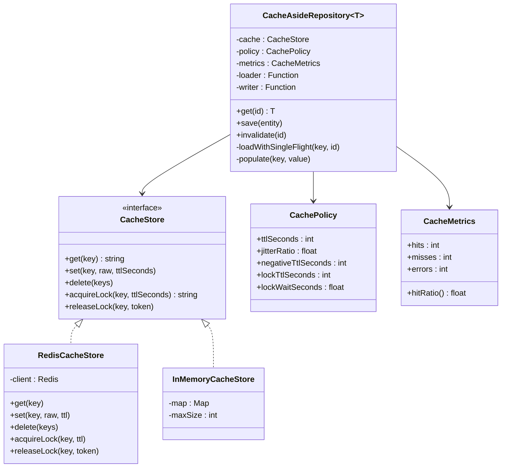
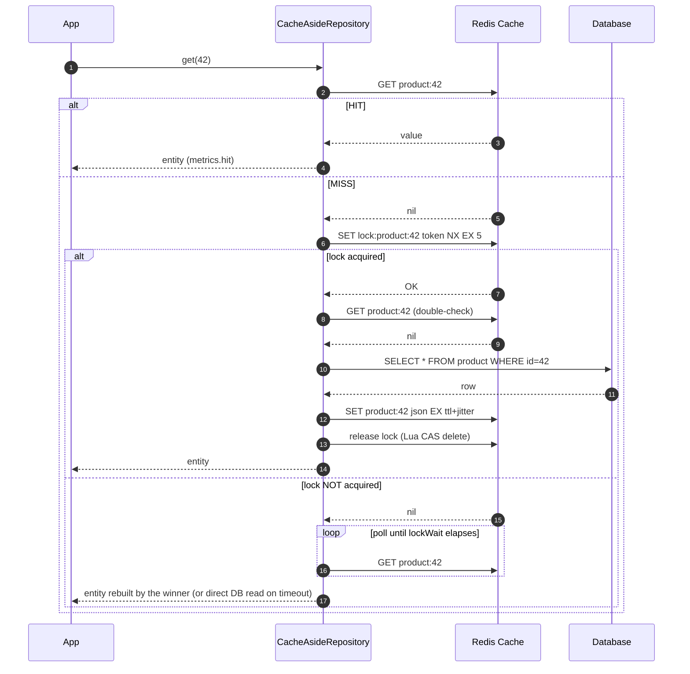

# Cache-Aside — Low Level Design (LLD)

> Companion to [caching.md §8.1](caching.md). Production-shaped implementations in **Python**, **TypeScript**, and dependency-free **JavaScript** (whiteboard version).
> **Goal:** be able to *design the classes*, *write the code*, and *defend every line* in an LLD/system-design round.

---

## 1. Requirements

### Functional
| # | Requirement |
|---|---|
| F1 | `get(id)` returns the entity from cache if present, otherwise loads it from the source of truth and populates the cache |
| F2 | `save(entity)` writes to the source of truth **first**, then **deletes** the cache key |
| F3 | `invalidate(id)` removes a key explicitly (for event-driven invalidation) |
| F4 | Every cached entry has a **TTL** |
| F5 | "Not found" results are cacheable (negative caching) with a shorter TTL |

### Non-functional
| # | Requirement | Design response |
|---|---|---|
| N1 | A cache outage must **not** break reads | Wrap every cache call in try/except → fall through to the DB |
| N2 | A hot key expiring must **not** stampede the DB | **Single-flight** via distributed lock + double-check |
| N3 | Keys must not expire in lockstep | **TTL jitter** |
| N4 | Non-existent keys must not penetrate to the DB repeatedly | Negative-cache sentinel |
| N5 | Must be observable | hit / miss / error / load-latency counters |
| N6 | Serialization must be safe | **JSON only** — never `pickle`/`eval` on cache bytes (untrusted-data deserialization = RCE) |
| N7 | Must be reusable for any entity | Generic over `T` with injected loader/writer |

---

## 2. Class Design



**Why this shape:**
- `CacheStore` is a **port** → swap Redis for an in-memory fake in tests without touching business logic.
- `CachePolicy` is a **value object** → per-entity tuning (`Product` TTL 10 min, `FeatureFlag` TTL 30 s) with no code change.
- `loader`/`writer` are **injected functions** → one repository class works for every entity (Open/Closed).
- `CacheMetrics` is separate → observability is not tangled into the read path.

---

## 3. Sequence — the full read path



> **The double-check after acquiring the lock is what makes this correct.** Without it, every waiter rebuilds in turn once the holder releases — you turn a *simultaneous* herd into a *sequential* one.

---

## 4. Python Implementation

```python
"""Cache-aside repository: Redis + any source of truth.

Design notes
------------
* The application owns the miss path; the cache never talks to the DB.
* Writes go to the DB first, then DELETE the cache key (never UPDATE it).
* Every cache failure degrades to a direct DB read - it never fails the request.
"""

from __future__ import annotations

import asyncio
import json
import logging
import random
import secrets
import time
from abc import ABC, abstractmethod
from dataclasses import dataclass
from typing import Any, Awaitable, Callable, Generic, TypeVar

log = logging.getLogger(__name__)

T = TypeVar("T")

# Distinguishes "we know this does not exist" from "not in cache".
_MISS_SENTINEL = "\x00__NOT_FOUND__"
_UNSET = object()


# --------------------------------------------------------------------- ports

class CacheStore(ABC):
    @abstractmethod
    async def get(self, key: str) -> str | None: ...

    @abstractmethod
    async def set(self, key: str, raw: str, ttl_seconds: int) -> None: ...

    @abstractmethod
    async def delete(self, *keys: str) -> None: ...

    @abstractmethod
    async def acquire_lock(self, key: str, ttl_seconds: int) -> str | None: ...

    @abstractmethod
    async def release_lock(self, key: str, token: str) -> None: ...


class RedisCacheStore(CacheStore):
    # Compare-and-delete: only the owner may release, so a lock that already
    # expired cannot be released by the previous (slow) holder.
    _RELEASE_LUA = """
    if redis.call('get', KEYS[1]) == ARGV[1] then
        return redis.call('del', KEYS[1])
    end
    return 0
    """

    def __init__(self, client: Any) -> None:
        self._redis = client
        self._release = client.register_script(self._RELEASE_LUA)

    async def get(self, key: str) -> str | None:
        return await self._redis.get(key)

    async def set(self, key: str, raw: str, ttl_seconds: int) -> None:
        await self._redis.set(key, raw, ex=ttl_seconds)

    async def delete(self, *keys: str) -> None:
        if keys:
            await self._redis.delete(*keys)

    async def acquire_lock(self, key: str, ttl_seconds: int) -> str | None:
        token = secrets.token_hex(16)
        acquired = await self._redis.set(key, token, nx=True, ex=ttl_seconds)
        return token if acquired else None

    async def release_lock(self, key: str, token: str) -> None:
        await self._release(keys=[key], args=[token])


# ------------------------------------------------------------------- policy

@dataclass(frozen=True)
class CachePolicy:
    ttl_seconds: int = 300
    jitter_ratio: float = 0.10        # +/-10% so keys never expire in lockstep
    negative_ttl_seconds: int = 30    # short: a missing row may appear later
    lock_ttl_seconds: int = 5
    lock_wait_seconds: float = 2.0
    lock_poll_seconds: float = 0.05

    def effective_ttl(self) -> int:
        spread = self.ttl_seconds * self.jitter_ratio
        return max(1, int(self.ttl_seconds + random.uniform(-spread, spread)))


class CacheMetrics:
    def __init__(self) -> None:
        self.hits = 0
        self.misses = 0
        self.errors = 0
        self.load_seconds = 0.0

    @property
    def hit_ratio(self) -> float:
        total = self.hits + self.misses
        return self.hits / total if total else 0.0


# --------------------------------------------------------------- repository

class CacheAsideRepository(Generic[T]):
    def __init__(
        self,
        cache: CacheStore,
        namespace: str,
        loader: Callable[[str], Awaitable[T | None]],
        writer: Callable[[T], Awaitable[None]],
        serialize: Callable[[T], dict[str, Any]],
        deserialize: Callable[[dict[str, Any]], T],
        policy: CachePolicy | None = None,
        metrics: CacheMetrics | None = None,
    ) -> None:
        self._cache = cache
        self._namespace = namespace
        self._loader = loader
        self._writer = writer
        self._serialize = serialize
        self._deserialize = deserialize
        self._policy = policy or CachePolicy()
        self.metrics = metrics or CacheMetrics()

    # ---- public API -----------------------------------------------------

    async def get(self, entity_id: str) -> T | None:
        key = self._key(entity_id)

        raw = await self._cache_get(key)
        if raw is not None:
            self.metrics.hits += 1
            return self._decode(raw)

        self.metrics.misses += 1
        return await self._load_single_flight(key, entity_id)

    async def save(self, entity_id: str, entity: T) -> None:
        # Order is load-bearing: DB first, cache second. Reversing it lets a
        # reader repopulate the cache with the pre-update value.
        await self._writer(entity)
        await self._cache_delete(self._key(entity_id))

    async def invalidate(self, entity_id: str) -> None:
        await self._cache_delete(self._key(entity_id))

    # ---- internals ------------------------------------------------------

    def _key(self, entity_id: str) -> str:
        return f"{self._namespace}:{entity_id}"

    def _decode(self, raw: str) -> T | None:
        if raw == _MISS_SENTINEL:
            return None
        return self._deserialize(json.loads(raw))

    async def _load_single_flight(self, key: str, entity_id: str) -> T | None:
        lock_key = f"lock:{key}"
        token = await self._acquire_lock(lock_key)

        if token is None:
            # Another caller is rebuilding. Wait for them rather than adding
            # this request to the pile on the database.
            waited = await self._await_rebuild(key)
            if waited is not _UNSET:
                return waited  # type: ignore[return-value]
            # Rebuild did not land in time: degrade to a direct read.
            return await self._load_and_populate(key, entity_id, write_back=False)

        try:
            # Double-check: the lock winner may already have populated it.
            raw = await self._cache_get(key)
            if raw is not None:
                self.metrics.hits += 1
                return self._decode(raw)
            return await self._load_and_populate(key, entity_id, write_back=True)
        finally:
            await self._release_lock(lock_key, token)

    async def _load_and_populate(
        self, key: str, entity_id: str, *, write_back: bool
    ) -> T | None:
        started = time.perf_counter()
        value = await self._loader(entity_id)
        self.metrics.load_seconds += time.perf_counter() - started

        if write_back:
            await self._populate(key, value)
        return value

    async def _populate(self, key: str, value: T | None) -> None:
        if value is None:
            # Negative caching: stops repeated lookups of a key that does not
            # exist (cache penetration) without pinning a long TTL.
            await self._cache_set(key, _MISS_SENTINEL, self._policy.negative_ttl_seconds)
            return
        raw = json.dumps(self._serialize(value), separators=(",", ":"))
        await self._cache_set(key, raw, self._policy.effective_ttl())

    async def _await_rebuild(self, key: str) -> Any:
        deadline = time.monotonic() + self._policy.lock_wait_seconds
        while time.monotonic() < deadline:
            await asyncio.sleep(self._policy.lock_poll_seconds)
            raw = await self._cache_get(key)
            if raw is not None:
                self.metrics.hits += 1
                return self._decode(raw)
        return _UNSET

    # ---- cache calls are best-effort: never fail the request ------------

    async def _cache_get(self, key: str) -> str | None:
        try:
            return await self._cache.get(key)
        except Exception:
            self.metrics.errors += 1
            log.warning("cache GET failed for %s; falling through to source", key, exc_info=True)
            return None

    async def _cache_set(self, key: str, raw: str, ttl: int) -> None:
        try:
            await self._cache.set(key, raw, ttl)
        except Exception:
            self.metrics.errors += 1
            log.warning("cache SET failed for %s", key, exc_info=True)

    async def _cache_delete(self, key: str) -> None:
        try:
            await self._cache.delete(key)
        except Exception:
            # A failed invalidation leaves stale data until the TTL expires -
            # surface it loudly so the alert fires.
            self.metrics.errors += 1
            log.error("cache DELETE failed for %s; entry stale until TTL", key, exc_info=True)

    async def _acquire_lock(self, lock_key: str) -> str | None:
        try:
            return await self._cache.acquire_lock(lock_key, self._policy.lock_ttl_seconds)
        except Exception:
            self.metrics.errors += 1
            return None

    async def _release_lock(self, lock_key: str, token: str) -> None:
        try:
            await self._cache.release_lock(lock_key, token)
        except Exception:
            self.metrics.errors += 1
```

### Wiring it up

```python
import redis.asyncio as aioredis
from dataclasses import dataclass, asdict


@dataclass
class Product:
    id: str
    name: str
    price_cents: int


async def build_product_repo(db) -> CacheAsideRepository[Product]:
    client = aioredis.from_url("redis://localhost:6379", decode_responses=True)

    return CacheAsideRepository[Product](
        cache=RedisCacheStore(client),
        namespace="product:v1",          # version segment => bulk invalidation
        loader=db.find_product,
        writer=db.upsert_product,
        serialize=asdict,
        deserialize=lambda d: Product(**d),
        policy=CachePolicy(ttl_seconds=600, negative_ttl_seconds=30),
    )


# usage
product = await repo.get("42")            # miss -> DB -> populate
product = await repo.get("42")            # hit
await repo.save("42", updated_product)    # DB write, then cache DELETE
```

---

## 5. TypeScript Implementation

```typescript
/**
 * Cache-aside repository. The application owns the miss path;
 * the cache never talks to the database.
 */
import { randomBytes } from "node:crypto";
import type Redis from "ioredis";

const MISS_SENTINEL = "\u0000__NOT_FOUND__";

export interface CacheStore {
  get(key: string): Promise<string | null>;
  set(key: string, raw: string, ttlSeconds: number): Promise<void>;
  delete(key: string): Promise<void>;
  acquireLock(key: string, ttlSeconds: number): Promise<string | null>;
  releaseLock(key: string, token: string): Promise<void>;
}

export class RedisCacheStore implements CacheStore {
  // Compare-and-delete so an expired lock cannot be released by its old holder.
  private static readonly RELEASE_LUA = `
    if redis.call('get', KEYS[1]) == ARGV[1] then
      return redis.call('del', KEYS[1])
    end
    return 0
  `;

  constructor(private readonly redis: Redis) {}

  get(key: string) {
    return this.redis.get(key);
  }

  async set(key: string, raw: string, ttlSeconds: number) {
    await this.redis.set(key, raw, "EX", ttlSeconds);
  }

  async delete(key: string) {
    await this.redis.del(key);
  }

  async acquireLock(key: string, ttlSeconds: number) {
    const token = randomBytes(16).toString("hex");
    const ok = await this.redis.set(key, token, "EX", ttlSeconds, "NX");
    return ok ? token : null;
  }

  async releaseLock(key: string, token: string) {
    await this.redis.eval(RedisCacheStore.RELEASE_LUA, 1, key, token);
  }
}

export interface CachePolicy {
  ttlSeconds: number;
  jitterRatio: number;
  negativeTtlSeconds: number;
  lockTtlSeconds: number;
  lockWaitMs: number;
  lockPollMs: number;
}

export const DEFAULT_POLICY: CachePolicy = {
  ttlSeconds: 300,
  jitterRatio: 0.1,
  negativeTtlSeconds: 30,
  lockTtlSeconds: 5,
  lockWaitMs: 2000,
  lockPollMs: 50,
};

export class CacheMetrics {
  hits = 0;
  misses = 0;
  errors = 0;

  get hitRatio(): number {
    const total = this.hits + this.misses;
    return total === 0 ? 0 : this.hits / total;
  }
}

export interface CacheAsideOptions<T> {
  cache: CacheStore;
  namespace: string;
  loader: (id: string) => Promise<T | null>;
  writer: (entity: T) => Promise<void>;
  policy?: Partial<CachePolicy>;
}

export class CacheAsideRepository<T> {
  private readonly policy: CachePolicy;
  readonly metrics = new CacheMetrics();

  constructor(private readonly opts: CacheAsideOptions<T>) {
    this.policy = { ...DEFAULT_POLICY, ...opts.policy };
  }

  async get(id: string): Promise<T | null> {
    const key = this.key(id);

    const raw = await this.safeGet(key);
    if (raw !== null) {
      this.metrics.hits++;
      return this.decode(raw);
    }

    this.metrics.misses++;
    return this.loadSingleFlight(key, id);
  }

  /** DB first, then DELETE the cache key. Never UPDATE the cache here. */
  async save(id: string, entity: T): Promise<void> {
    await this.opts.writer(entity);
    await this.safeDelete(this.key(id));
  }

  async invalidate(id: string): Promise<void> {
    await this.safeDelete(this.key(id));
  }

  // ---------------------------------------------------------------- internals

  private key(id: string) {
    return `${this.opts.namespace}:${id}`;
  }

  private decode(raw: string): T | null {
    return raw === MISS_SENTINEL ? null : (JSON.parse(raw) as T);
  }

  private effectiveTtl(): number {
    const spread = this.policy.ttlSeconds * this.policy.jitterRatio;
    return Math.max(1, Math.round(this.policy.ttlSeconds + (Math.random() * 2 - 1) * spread));
  }

  private async loadSingleFlight(key: string, id: string): Promise<T | null> {
    const lockKey = `lock:${key}`;
    const token = await this.safeAcquire(lockKey);

    if (token === null) {
      // Someone else is rebuilding - wait instead of piling onto the DB.
      const rebuilt = await this.awaitRebuild(key);
      if (rebuilt !== undefined) return rebuilt;
      return this.opts.loader(id); // degrade: read through without write-back
    }

    try {
      // Double-check: the winner may already have populated it.
      const raw = await this.safeGet(key);
      if (raw !== null) {
        this.metrics.hits++;
        return this.decode(raw);
      }

      const value = await this.opts.loader(id);
      await this.populate(key, value);
      return value;
    } finally {
      await this.safeRelease(lockKey, token);
    }
  }

  private async populate(key: string, value: T | null): Promise<void> {
    if (value === null) {
      // Negative caching stops cache penetration on non-existent keys.
      await this.safeSet(key, MISS_SENTINEL, this.policy.negativeTtlSeconds);
      return;
    }
    await this.safeSet(key, JSON.stringify(value), this.effectiveTtl());
  }

  private async awaitRebuild(key: string): Promise<T | null | undefined> {
    const deadline = Date.now() + this.policy.lockWaitMs;
    while (Date.now() < deadline) {
      await new Promise((r) => setTimeout(r, this.policy.lockPollMs));
      const raw = await this.safeGet(key);
      if (raw !== null) {
        this.metrics.hits++;
        return this.decode(raw);
      }
    }
    return undefined;
  }

  // Cache calls are best-effort: a cache outage degrades, it does not fail.
  private async safeGet(key: string) {
    try {
      return await this.opts.cache.get(key);
    } catch {
      this.metrics.errors++;
      return null;
    }
  }

  private async safeSet(key: string, raw: string, ttl: number) {
    try {
      await this.opts.cache.set(key, raw, ttl);
    } catch {
      this.metrics.errors++;
    }
  }

  private async safeDelete(key: string) {
    try {
      await this.opts.cache.delete(key);
    } catch {
      // Failed invalidation => stale until TTL. Must be alerted on.
      this.metrics.errors++;
      throw new Error(`cache invalidation failed for ${key}`);
    }
  }

  private async safeAcquire(lockKey: string) {
    try {
      return await this.opts.cache.acquireLock(lockKey, this.policy.lockTtlSeconds);
    } catch {
      this.metrics.errors++;
      return null;
    }
  }

  private async safeRelease(lockKey: string, token: string) {
    try {
      await this.opts.cache.releaseLock(lockKey, token);
    } catch {
      this.metrics.errors++;
    }
  }
}
```

### Usage

```typescript
interface Product {
  id: string;
  name: string;
  priceCents: number;
}

const repo = new CacheAsideRepository<Product>({
  cache: new RedisCacheStore(redis),
  namespace: "product:v1",
  loader: (id) => db.findProduct(id),
  writer: (p) => db.upsertProduct(p),
  policy: { ttlSeconds: 600 },
});

await repo.get("42");                 // miss -> DB -> populate
await repo.get("42");                 // hit
await repo.save("42", updated);       // DB write, then cache DELETE
console.log(repo.metrics.hitRatio);
```

---

## 6. JavaScript — the whiteboard version (no dependencies)

This is what an interviewer usually asks you to *actually write*: an in-process cache-aside layer with **LRU + TTL + in-process single-flight**. No Redis, ~60 lines.

```javascript
/**
 * In-process cache-aside with LRU eviction, per-entry TTL and single-flight.
 * Map preserves insertion order, so it doubles as the LRU recency list.
 */
class CacheAside {
  #store = new Map();     // key -> { value, expiresAt }
  #inFlight = new Map();  // key -> Promise  (single-flight / request coalescing)

  constructor(loader, { maxSize = 1000, ttlMs = 60_000, jitterRatio = 0.1 } = {}) {
    this.loader = loader;
    this.maxSize = maxSize;
    this.ttlMs = ttlMs;
    this.jitterRatio = jitterRatio;
    this.stats = { hits: 0, misses: 0, evictions: 0 };
  }

  async get(key) {
    const entry = this.#store.get(key);

    if (entry && entry.expiresAt > Date.now()) {
      this.#store.delete(key);          // re-insert => move to MRU end
      this.#store.set(key, entry);
      this.stats.hits++;
      return entry.value;
    }
    if (entry) this.#store.delete(key); // expired

    this.stats.misses++;

    // Single-flight: 10,000 concurrent misses on the same key produce ONE load.
    if (this.#inFlight.has(key)) return this.#inFlight.get(key);

    const promise = this.loader(key)
      .then((value) => {
        this.#set(key, value);
        return value;
      })
      .finally(() => this.#inFlight.delete(key));

    this.#inFlight.set(key, promise);
    return promise;
  }

  /** Write path: caller updates the DB first, then calls invalidate(). */
  invalidate(key) {
    this.#store.delete(key);
  }

  #set(key, value) {
    if (this.#store.size >= this.maxSize && !this.#store.has(key)) {
      const lru = this.#store.keys().next().value; // oldest insertion = LRU
      this.#store.delete(lru);
      this.stats.evictions++;
    }
    const spread = this.ttlMs * this.jitterRatio;
    const ttl = this.ttlMs + (Math.random() * 2 - 1) * spread; // jitter
    this.#store.set(key, { value, expiresAt: Date.now() + ttl });
  }

  get hitRatio() {
    const total = this.stats.hits + this.stats.misses;
    return total === 0 ? 0 : this.stats.hits / total;
  }
}

// --- usage -----------------------------------------------------------------
const products = new CacheAside((id) => db.findProduct(id), { ttlMs: 300_000 });

await Promise.all(Array.from({ length: 10_000 }, () => products.get("42")));
// => exactly ONE db.findProduct call, 1 miss + 9,999 coalesced waiters

async function updateProduct(p) {
  await db.upsertProduct(p);   // 1. source of truth first
  products.invalidate(p.id);   // 2. then invalidate
}
```

### Complexity

| Operation | Time | Space |
|---|---|---|
| `get` (hit) | **O(1)** — `Map` lookup + delete/re-insert | O(n) entries |
| `get` (miss) | O(1) + loader cost | — |
| `invalidate` | **O(1)** | — |
| LRU eviction | **O(1)** — `Map.keys().next()` is the oldest key | — |

> **Interview note:** `Map` preserving insertion order is *why* this LRU is O(1) without a hand-rolled doubly-linked list. If asked for a classic implementation, use **HashMap + doubly linked list** (`get`, `put` both O(1)).

---

## 7. Test Checklist (say these out loud in the interview)

| Test | Asserts |
|---|---|
| Hit path | Loader is **not** called on the second `get` |
| Miss path | Loader called **once**, cache populated with a TTL |
| Single-flight | N concurrent misses on the same key → **exactly 1** loader invocation |
| Double-check | Waiter that loses the lock does **not** re-query the DB |
| Negative caching | Loader returning `null` caches the sentinel; second `get` doesn't hit the DB |
| Write path order | `writer` is called **before** `cache.delete` |
| Write path semantics | Cache is **deleted**, not overwritten |
| Cache outage | `cache.get` throwing → request still succeeds via loader; `metrics.errors` increments |
| TTL expiry | After TTL the loader is called again |
| Jitter | Two entries written in the same tick get **different** expiry times |
| LRU | Inserting beyond `maxSize` evicts the least-recently-*read* key |

---

## 8. Extension Points (senior-level talking points)

| Extension | How |
|---|---|
| **Read-through** | Move `loader` inside `CacheStore` → the app makes a single `get` call. Removes the drifting miss-block, but the cache layer gets more complex |
| **Write-through** | Replace `save()` with `writer()` + `populate()` in one synchronous step → no invalidation race, but every write pays DB latency |
| **Two-level (near) cache** | Wrap `RedisCacheStore` in an `L1InMemoryCacheStore` decorator; invalidate L1 cluster-wide over Redis pub/sub |
| **Batch loading** | Add `getMany(ids)` → `MGET` + a single `WHERE id IN (...)` for the misses. Avoids N+1 on miss storms |
| **Probabilistic early refresh** | On a hit, if `remainingTtl < beta * log(rand()) * loadTime`, refresh in the background → the key never actually expires under load (XFetch) |
| **Stale-while-revalidate** | Store `{value, softExpiry, hardExpiry}`; past `softExpiry` return stale immediately and refresh async |
| **Event-driven invalidation** | Kafka/CDC consumer calls `invalidate(id)` → cross-service correctness without shortening TTLs |
| **Circuit breaker** | Trip after N consecutive cache errors → skip the cache entirely for a cool-down window instead of paying the timeout on every request |
| **Bloom filter** | In front of `get` to reject keys that provably don't exist → cheaper than negative-caching a billion IDs |

---

## 9. Security Notes

| Risk | Mitigation |
|---|---|
| **Insecure deserialization** | Cache contents are **untrusted input**. Use JSON, never `pickle` / `eval` / `unserialize` |
| **Cache poisoning** | Namespace + version every key (`product:v1:{id}`) and validate the shape after decoding |
| **Sensitive data in a shared cache** | Don't cache PII, tokens or financial data in a multi-tenant cache. If you must, encrypt and scope the key by tenant |
| **Key injection** | Never interpolate raw user input into a key without validation — a caller passing `42:admin` can collide with another namespace |
| **Cache penetration / DoS** | Negative caching + bloom filter + input validation + rate limiting |
| **Unbounded memory** | Always set `maxSize` and a TTL — an unbounded in-process cache is a memory-exhaustion DoS |

---

## 10. 60-Second Verbal Summary

> "Cache-aside means the **application** owns the miss path — the cache is a passive key-value store that never talks to the database.
> **Read:** check cache → hit returns; miss queries the DB, writes back with a **TTL plus jitter**, and returns.
> **Write:** update the **database first**, then **delete** the cache key — delete rather than update because deletes are idempotent and won't seed a value a concurrent transaction already replaced.
> The three things that bite you are the **write-invalidate race**, the **thundering herd on expiry**, and **cold start**. I close the herd with a distributed lock plus a **double-check** after acquiring it, bound the race with a short TTL and a `SET NX` write-back, and warm critical keys on deploy.
> Every cache call is **best-effort** — if Redis is down we fall through to the database instead of failing the request — and I track hit ratio, P99 and, most importantly, **DB load during misses**, because a 99% hit ratio still means nothing if that 1% takes the database down."
