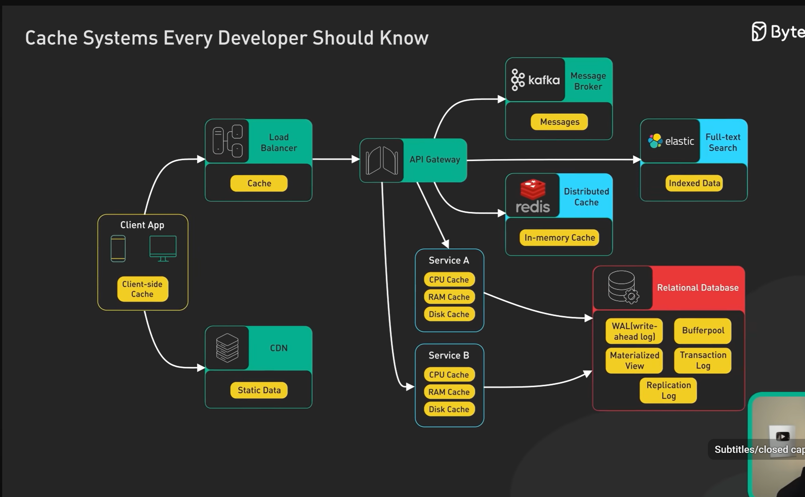

# Cache Systems Every Developer Should Know

> Source: ByteByteGo — *Cache Systems Every Developer Should Know* (YouTube: `dGAgxozNWFE`)
> Interview-prep summary
>
> **Go deeper in this repo:** [caching.md](caching.md) (full HLD masterclass) · [cache-aside-lld.md](cache-aside-lld.md) (runnable LLD) · [databases.md](databases.md) · [load-balancer.md](load-balancer.md) · [data-structure.md](data-structure.md) (LRU, bloom filters, consistent hashing) · [README.md](README.md)



---

## 1. What is a Cache?

A **cache** is a high-speed data storage layer that stores a subset of data — usually **transient** — so that future requests for that data are served faster than by re-computing it or fetching it from the primary source (DB, disk, remote API).

**Why cache?**
- Reduce **latency** (RAM/SSD is 10x–1000x faster than DB/network).
- Reduce **load** on origin systems (DBs, upstream services).
- Reduce **cost** (fewer expensive computations / DB reads / bandwidth).
- Improve **throughput** and **scalability**.
- Increase **availability** (cache can serve stale data when origin is down).

**Trade-off:** Cache stores duplicate data → risk of **staleness / inconsistency**. Cache design is fundamentally about balancing *freshness* vs *performance*.

---

## 2. Where Caches Live — The Full Request Path

A typical web request passes through **many cache layers**. Understanding all of them is a common interview question.

```
Client ──► DNS ──► CDN ──► Load Balancer ──► API Gateway ──► App Server ──► DB
   │        │        │           │                │                │           │
 Browser  DNS     Edge       Reverse-proxy   In-process /       DB query   Buffer
  cache  cache   cache          cache         Distributed        cache      pool
                                              cache (Redis)
```

### 2.1 Client-side (Browser) Cache
- Stored on the user's device (memory, disk, service worker, IndexedDB, localStorage).
- Controlled by HTTP headers: `Cache-Control`, `ETag`, `Expires`, `Last-Modified`.
- **Fastest possible cache** — zero network hop.
- Used for: static assets (JS, CSS, images), API responses.

### 2.2 DNS Cache
- Caches domain → IP mappings at OS, browser, and resolver levels.
- Governed by **TTL** returned in DNS records.
- Avoids repeated recursive DNS lookups.

### 2.3 CDN (Content Delivery Network) Cache
- Geographically distributed **edge servers** (Cloudflare, Akamai, CloudFront, Fastly).
- Serves static (and increasingly dynamic) content close to the user.
- Reduces latency and offloads origin.
- Cache keys typically include URL + query string + (sometimes) headers/cookies.

### 2.4 Load Balancer / Reverse Proxy Cache
- Nginx, HAProxy, Varnish sitting in front of app servers.
- Can cache full HTTP responses.
- Useful for anonymous / read-heavy traffic.

### 2.5 API Gateway Cache
- Gateways (Kong, AWS API Gateway, Apigee) cache responses for identical API calls.
- Typically keyed by URL + method + headers.

### 2.6 Application / In-Process Cache
- Cache **inside** the app process (Guava, Caffeine, `ConcurrentHashMap`, `.NET MemoryCache`).
- **Pros:** fastest (no network), simple.
- **Cons:** not shared across instances → data inconsistency; lost on restart; consumes app memory.
- Best for: hot, mostly-read, small datasets (config, feature flags, lookup tables).

### 2.7 Distributed / Remote Cache
- Dedicated cache cluster (Redis, Memcached, Hazelcast).
- Shared across all app instances → consistent view.
- Adds a network hop (~sub-ms in same DC).
- Best for: session data, user profiles, computed results, rate limiting counters.

### 2.8 Database Cache
- **Buffer pool / page cache** (Postgres, MySQL InnoDB) — hot pages held in RAM.
- **Query cache** (deprecated in MySQL 8) / result cache.
- **Materialized views** — precomputed query results.

### 2.9 Full-page / HTML Fragment Cache
- Whole rendered pages cached (common in Wordpress, e-commerce).
- Fragment caching for parts of the page (e.g., product recommendations).

---

## 3. Cache Read Strategies

### 3.1 Cache-Aside (Lazy Loading) — **most common**
```
App reads:
  1. Check cache
  2. HIT  → return
  3. MISS → read from DB, write to cache, return
```
- **Pros:** simple; only requested data is cached; resilient to cache failure.
- **Cons:** first request is slow (cache miss penalty); stale data possible; app owns the caching logic.

### 3.2 Read-Through
- App queries the **cache only**; the cache library fetches from DB on miss.
- Abstraction is cleaner; DB access hidden behind cache API.
- Used by frameworks like EhCache, Hazelcast, some Redis clients.

---

## 4. Cache Write Strategies

### 4.1 Write-Through
```
Write → Cache → DB (synchronously) → ack to client
```
- **Pros:** cache always consistent with DB; simple reads.
- **Cons:** every write has DB latency; caches data that may never be read.

### 4.2 Write-Around
```
Write → DB only (skip cache) 
Reads populate cache via cache-aside
```
- **Pros:** avoids polluting cache with write-once data.
- **Cons:** recent writes cause cache misses on first read.

### 4.3 Write-Back (Write-Behind)
```
Write → Cache (ack immediately) → async flush to DB
```
- **Pros:** very low write latency; batches DB writes; great for write-heavy workloads.
- **Cons:** **data loss risk** if cache crashes before flush; complex; harder consistency.

**Interview tip:** state the trade-off — write-back is fastest but least durable; write-through is safest but slowest.

---

## 5. Cache Eviction Policies

When the cache is full, which entry do we evict?

| Policy | Meaning | Use case |
|---|---|---|
| **LRU** (Least Recently Used) | Evict the entry not used for the longest time | General-purpose; most common (Redis default variant) |
| **LFU** (Least Frequently Used) | Evict the least-accessed entry | When popularity is stable over time |
| **FIFO** | Evict oldest inserted | Simple; rarely optimal |
| **LIFO** | Evict newest | Rare; specialized |
| **MRU** (Most Recently Used) | Evict newest access | When recent items are unlikely to be reused (e.g., scanning) |
| **Random** | Evict a random entry | Cheap; used when access patterns are uniform |
| **TTL-based** | Evict when time-to-live expires | Time-sensitive data (sessions, tokens) |
| **ARC** | Adaptive between LRU & LFU | Advanced (used by some file systems) |

Redis supports: `noeviction`, `allkeys-lru`, `allkeys-lfu`, `volatile-lru`, `volatile-lfu`, `allkeys-random`, `volatile-random`, `volatile-ttl`.

---

## 6. Cache Invalidation — "One of the two hard things in CS"

Ways to keep cache in sync with source of truth:

1. **TTL / Expiration** — simplest; every entry has a lifetime. Stale reads possible until expiry.
2. **Explicit invalidation** — on write, delete/update the cache key. Requires the writer to know all affected keys.
3. **Write-through / Write-back** — cache is written on every DB write.
4. **Event-driven invalidation** — DB emits change events (CDC, Debezium, Kafka) → consumers evict cache.
5. **Version stamping** — include a version in the cache key; bumping the version invalidates all old entries logically.
6. **Cache tags / groups** — invalidate a group of related keys together.

Common bugs:
- Forgotten invalidation → stale reads forever.
- Invalidation on the wrong key.
- Race condition between reader (misses, reads DB, writes cache) and writer (updates DB, invalidates cache) → stale write can overwrite fresh invalidation.

---

## 7. Cache Consistency Models

- **Strong consistency** — cache and DB always agree (usually requires write-through + synchronous invalidation; expensive).
- **Eventual consistency** — cache converges after some delay (default for most systems).
- **Read-your-writes** — a client sees its own writes immediately (often achieved by bypassing cache on read after write, or updating cache on write).

---

## 8. Classic Cache Problems and Mitigations

### 8.1 Cache Stampede / Thundering Herd
Many concurrent requests miss the same key and hammer the DB.
**Fixes:**
- **Locking / single-flight**: only one request rebuilds the entry; others wait.
- **Request coalescing** at the cache layer.
- **Early recomputation** before TTL expires (probabilistic early expiration).
- **Stale-while-revalidate**: serve stale value while a background job refreshes it.

### 8.2 Cache Penetration
Requests for keys that **don't exist** in DB either (e.g., malicious). Cache always misses → DB overloaded.
**Fixes:**
- Cache negative results ("not found") with a short TTL.
- **Bloom filter** in front of cache to reject known-missing keys.
- Input validation / rate limiting.

### 8.3 Cache Avalanche
Many keys expire at the same time (e.g., mass TTL expiry after a deploy) → massive DB spike.
**Fixes:**
- **Jitter** / randomize TTLs.
- Multi-level caching.
- Warm-up strategies after deploys.
- Circuit breakers to protect the DB.

### 8.4 Hot Key
A single key gets disproportionately high traffic (celebrity user, viral post).
**Fixes:**
- Replicate the hot key across nodes / shards.
- Local (in-process) copy of hot data with short TTL.
- Sharding by consistent hashing with virtual nodes.

### 8.5 Big Key
A single value is huge (multi-MB list) → network + memory pressure.
**Fixes:**
- Split into smaller keys.
- Use hash / list / stream data structures instead of one blob.
- Compress values.

---

## 9. Distributed Caching Concerns

- **Sharding** — data partitioned across nodes; usually via **consistent hashing** to minimize rebalancing when nodes come/go.
- **Replication** — primary/replica for HA and read scaling.
- **Failover** — Redis Sentinel, Redis Cluster.
- **Serialization** — JSON vs MessagePack vs Protobuf; affects size and speed.
- **Network overhead** — batch with pipelining / `MGET`.
- **Connection pooling** — cache clients need efficient pools.

---

## 10. Redis vs Memcached (Common Interview Comparison)

| Feature | Redis | Memcached |
|---|---|---|
| Data types | Strings, hashes, lists, sets, sorted sets, streams, HyperLogLog, geo, bitmaps | Strings only |
| Persistence | RDB snapshots + AOF | None (pure in-memory) |
| Replication | Yes (async) | No (client-side sharding) |
| Cluster mode | Yes | Client-side sharding |
| Threading | Mostly single-threaded (I/O threads in 6+) | Multi-threaded |
| Pub/Sub, Lua scripts, transactions | Yes | No |
| Best for | Rich data + durability | Simple, high-throughput key/value |

---

## 11. Choosing What to Cache

Good candidates:
- **Read-heavy** data (read/write ratio > 5:1).
- **Expensive to compute** results (aggregations, joins, ML inference).
- **Rarely changes** or tolerates staleness.
- **Small enough** to fit affordably in memory.

Poor candidates:
- Write-heavy, rarely-read data.
- Data requiring strict, real-time consistency (financial ledger, inventory checkout — needs careful design).
- Extremely large blobs with low reuse.

---

## 12. Key Metrics to Monitor

- **Hit ratio** = hits / (hits + misses). Target 80–95% for well-tuned caches.
- **Miss latency** — how expensive is a miss?
- **Eviction rate** — high evictions ⇒ cache too small.
- **Memory usage / fragmentation**.
- **Latency percentiles** (p50/p95/p99).
- **Throughput** (ops/sec).
- **Error rate** (timeouts, connection failures).

---

## 13. Quick Interview Cheat-Sheet Answers

**Q: Walk me through where caches exist in a web app.**
Browser → DNS → CDN → Load balancer / reverse-proxy → API gateway → in-process app cache → distributed cache (Redis) → DB buffer pool / query cache.

**Q: Cache-aside vs write-through vs write-back?**
Cache-aside: lazy, app-managed, most common. Write-through: sync write to cache+DB, consistent but slower. Write-back: write to cache only, async flush to DB, fast but risks data loss.

**Q: How do you handle cache invalidation?**
TTL + explicit invalidation on writes; event-driven via CDC for cross-service; versioned keys for bulk invalidation.

**Q: How do you prevent cache stampede?**
Mutex/single-flight rebuild, stale-while-revalidate, TTL jitter, probabilistic early refresh.

**Q: Cache penetration vs avalanche vs stampede?**
- **Penetration**: keys don't exist anywhere → cache negatives + bloom filters.
- **Avalanche**: many keys expire simultaneously → TTL jitter.
- **Stampede**: single hot key expires and everyone rebuilds it → locking / SWR.

**Q: LRU vs LFU — when to use which?**
LRU when recency predicts reuse (typical). LFU when popularity is stable and some items are just perpetually hot.

**Q: Redis or Memcached?**
Memcached: simple, multi-threaded, pure KV, ephemeral. Redis: rich data types, persistence, replication, pub/sub, Lua — the default choice unless you specifically need Memcached's simplicity.

**Q: How do you keep the cache consistent with the DB?**
Depends on the consistency requirement:
- Strong: write-through + synchronous invalidation (or bypass cache on critical reads).
- Eventual: cache-aside with TTL + invalidate-on-write; use CDC for cross-service correctness.

**Q: What's a hot key and how do you fix it?**
A single key receiving disproportionate traffic. Fix with local caching, key replication/sharding, or request coalescing.

---

## 14. Real-World Design Sketches to Practice

- **Feed / timeline caching** (Twitter, Instagram): precomputed feeds in Redis, fanout-on-write vs fanout-on-read.
- **Session store** (Redis with TTL).
- **Rate limiter** (Redis `INCR` + TTL, or token bucket in Lua).
- **Leaderboard** (Redis sorted set — `ZADD` / `ZRANGE`).
- **Product catalog cache** (cache-aside + CDN for images).
- **Read-through cache in front of a slow analytics query**.

---

## 15. TL;DR

Caching is about **putting data closer to where it's used** at every layer of the stack. Master:
1. **Where** caches live (client → CDN → app → distributed → DB).
2. **How** they're read/written (cache-aside, read-through, write-through/back/around).
3. **How** they evict (LRU/LFU/TTL).
4. **How** they're invalidated (TTL, explicit, event-driven).
5. **The failure modes** (stampede, penetration, avalanche, hot key) and their mitigations.
6. **Metrics** (hit ratio is king).

Nail these and any "design X" interview involving caching becomes a structured conversation.

