# Caching in System Design — HLD Masterclass Notes

> **Sources:**
> 1. [HLD Masterclass: Caching in System Design | Cache-Aside, Redis, TTL, Cache Stampede & More](https://www.youtube.com/watch?v=6K15bFcxZBY) — CodeKerdos (speaker: Ankit, ~18 yrs exp, Adobe/Google)
> 2. [Caching in System Design Interviews w/ Meta Staff Engineer](https://www.youtube.com/watch?v=1NngTUYPdpI) — Hello Interview (Evan, ex-Meta staff engineer) — interview delivery, concrete numbers, cache warming
> 3. [**Caching challenges and strategies**](https://aws.amazon.com/builders-library/caching-challenges-and-strategies/) — **Amazon Builders' Library** (Matt Brinkley & Jas Chhabra) — production operations, cache addiction, inline vs side caches, soft/hard TTL, security
>
> **Purpose:** Interview prep. Every section = concept → flow chart → problem → solution.
> **Companion:** [cache-aside-lld.md](cache-aside-lld.md) — low-level design + Python / TypeScript / JavaScript implementations.

---

## Syllabus Coverage Index

| # | Topic | Section |
|---|---|---|
| **1** | Why caching improves latency & throughput | [§3](#3-why-cache--the-three-benefits--the-cost), [§4](#4-latency-hierarchy-relative-not-absolute), [§16](#16-cache-observability) |
| | ⚠️ **Cache addiction / modal behaviour** — when the cache becomes a critical dependency | [§3.1](#31-the-cache-addiction-trap--the-ecstasy-and-the-agony-of-caches) |
| | When caching makes sense · right candidates | [§5](#5-what-should-you-cache) |
| | Architectural complexity & stale data | [§1](#1-where-caching-sits-in-cap-theorem), [§3](#3-why-cache--the-three-benefits--the-cost), [§12](#12-consistency--the-real-cost) |
| | Cache invalidation challenges | [§11](#11-cache-invalidation--the-most-annoying-part-of-caching), [§8.1.7](#817-the-three-failure-modes-this-is-where-interviews-go-deep) |
| **2** | Browser caching (HTTP headers, ETag, 304) | [§6.1](#61-browser--http-caching--the-headers-interviewers-ask-about) |
| | Browser **storage APIs** (localStorage / sessionStorage / cookies / IndexedDB) | [§6.2](#62-browser-storage-apis--where-the-data-physically-goes) |
| | CDN caching | [§6](#6-caching-layers-architecture), [§6.1](#61-browser--http-caching--the-headers-interviewers-ask-about), [§15.3](#153-cdn-vs-redis--they-are-not-the-same-thing) |
| | Application-level caching · local vs distributed | [§6](#6-caching-layers-architecture), [§7](#7-local-cache-vs-distributed-cache) |
| | Distributed caches · Redis | [§7](#7-local-cache-vs-distributed-cache), [§15.1](#151-redis-deep-dive), [§15.2](#152-redis-vs-memcached) |
| | Speed vs consistency vs scalability trade-offs | [§4](#4-latency-hierarchy-relative-not-absolute), [§7](#7-local-cache-vs-distributed-cache), [§12](#12-consistency--the-real-cost) |
| **3** | Cache-Aside (+ full LLD) | [§8.1](#81-cache-aside-lazy-loading--the-industry-default), [cache-aside-lld.md](cache-aside-lld.md) |
| | Read-Through · Write-Through · Write-Behind · Write-Around | [§8.2](#82-read-through)–[§8.5](#85-write-around) |
| | When to use which strategy | [§8.6](#86-summary-table), [§8.7](#87-choosing-a-pattern--decision-matrix) |
| | **Inline vs side caches** (AWS taxonomy + the availability trade-off) | [§8.8](#88-inline-vs-side-caches--the-aws-taxonomy) |
| **4** | TTL · TTL jitter | [§9](#9-ttl-time-to-live), [§8.1.8](#818-choosing-a-ttl) |
| | TTL **implementation** (absolute expiry) · cache-key design · refresh endpoint | [§9.1](#91-how-to-actually-implement-a-ttl--absolute-expiry-checked-lazily)–[§9.4](#94-the-explicit-refresh--cache-bypass-endpoint) |
| | **Soft TTL / hard TTL** + backpressure (availability, not just latency) | [§9.5](#95-soft-ttl--hard-ttl--the-resilience-pattern-aws-actually-uses) |
| | LRU · LFU · other eviction policies | [§10](#10-eviction-policies) |
| | Managing memory constraints (sizing, `maxmemory`) | [§10.1](#101-managing-memory-constraints--capacity-planning) |
| **5** | Cache Stampede · Request coalescing | [§13.1](#131-cache-stampede-thundering-herd) |
| | Cache Penetration · Negative caching · Bloom filters | [§13.2](#132-cache-penetration) |
| | Cache Avalanche | [§13.3](#133-cache-avalanche) |
| | Hot keys · key replication & splitting | [§13.4](#134-hot-key-celebrity-problem) |
| **6** | Consistent hashing (+ virtual nodes) | [§14](#14-distributed-caching-sharding-replication-consistent-hashing) |
| | Scaling distributed caches (Cluster, Sentinel, replication) | [§14.1](#141-scaling-a-distributed-cache-in-practice) |
| | **Operating a cache fleet** · serialization rollback safety · poison pills | [§14.2](#142-operating-an-external-cache-fleet--the-hazards-nobody-mentions) |
| | **Cache security** (encryption, poisoning, timing side channels) | [§16.2](#162-cache-security--three-risks-to-name) |
| | Hit ratio · P95/P99 · memory · backend load · alerting | [§16](#16-cache-observability), [§16.1](#161-what-to-actually-alert-on) |
| **★** | End-to-end application | [§17 YouTube feed](#17-case-study--youtube-home-feed), [§18 framework](#18-the-7-question-caching-design-framework-), [§19 rapid fire](#19-rapid-fire--interview-answers) |
| **★** | **How & when to bring caching up in the interview** | [§18.1](#181-how-to-actually-talk-about-caching-in-the-interview) |
| **★** | **Team discussion log + fact-check** (Tarang × Mahesh) | [§21](#21-discussion-log--tarang--mahesh) |
| **★** | **A worked example for EVERY technique in this file** | [§22](#22-worked-examples--one-for-every-technique-in-this-file) |
| **★** | **Amazon's 7-point caching checklist** | [§23](#23-amazons-caching-checklist) |

---

## 0. The One Rule of the Whole Session

> **"I will use Redis" is NOT a design answer.**
> The design starts when you explain **why** Redis, **what problem** it solves, and **why it is the best fit** for *this* problem.

Don't memorize caching patterns. Understand the **trade-offs**. In an HLD interview anyone can draw a box — the skill is explaining:
1. Why does this box exist?
2. What is inside it?
3. What happens when it is **empty** (miss), **full** (eviction), **stale** (consistency), or **dead** (failure)?

---

## 1. Where Caching Sits in CAP Theorem

CAP = **C**onsistency, **A**vailability, **P**artition tolerance — you can realistically get only two.

**Interview question:** *Which of the three does a cache hurt?*
**Answer: Consistency.**

Why: the moment you add a cache you create a **second copy of the data**. The source of truth (DB / S3 / another service) can change without the cache knowing → **stale reads**.

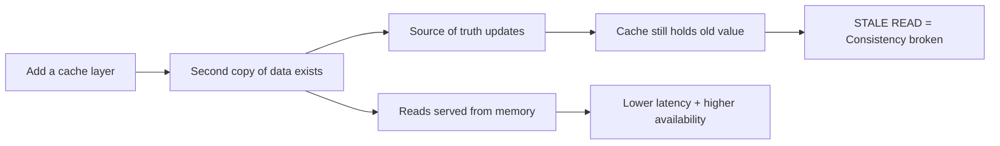

**One-line justification to use in an interview:**
> "I accept **complexity** and **staleness** in exchange for **performance** and **scalability**."

---

## 2. The Starting Problem

> Service receives **1,00,000 req/sec**. Database can handle only **10,000 reads/sec**. What do you do?

Valid answers (caching is only one of them — say all of them, then pick):

| Option | What it does |
|---|---|
| **Caching** | Serve repeat reads from memory (this session's focus) |
| **Read replicas** | Spread reads across replica DBs |
| **Vertical scaling** | Bigger DB box |
| **Horizontal scaling / sharding** | Split data across DB nodes |
| **Pre-computation** | Batch-compute results (analytics/logging style) and store them |
| **Queue + async** | Absorb the burst, process later |

**Follow-up:** 1 lakh users ask for **the same** piece of data at the same time (celebrity uploads a video).
→ 1 request fetches it, the other **99,999** are served from cache.

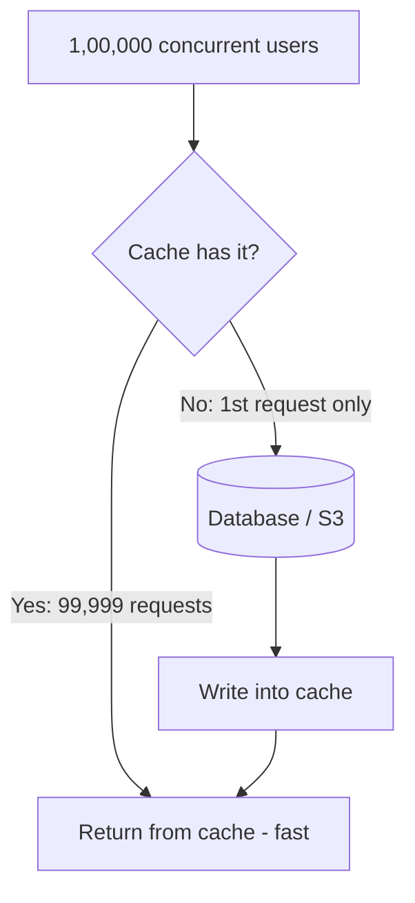

**Trap:** Don't jump to Redis here. A **video** belongs on a **CDN**, not Redis. Redis is for application-level data (config, sessions, computed objects).

### What does "the DB can handle 10,000 reads/sec" actually mean?

A number like this is about **in-flight concurrency**, not a hard counter.

> **The book analogy:** you buy a 100-page book and hand one page to each student. 100 students → fine. 200 students → you physically cannot serve the other 100; you tell them "I don't have it" while you arrange more copies. If you'd known 200 were coming, you could have **provisioned** in advance.

- If 5,000 requests are in flight and none have finished, request **5,001 is rejected** — not because 5,000 is an absolute lifetime limit, but because every slot is occupied.
- Requests **complete and free their slot**, so a steady 5,000/sec is fine. What kills you is 5,000 arriving in the next second **before the previous 5,000 have finished**.
- This is why **cache warming and pre-provisioning matter** — known load can be planned for; unknown load cannot.

**How you actually find out you're over capacity** (there is no magic metric in an interview — name the symptoms):

| Symptom | Where you see it |
|---|---|
| **HTTP 500 / 503** and connection timeouts | API responses |
| Errors flooding logs across **every** service in the distributed system | Centralised logging |
| DB connection-pool exhaustion, query queueing | DB metrics |
| **Users complaining everywhere** — the least pleasant but fastest signal | Support channels |

---

## 3. Why Cache — The Three Benefits + The Cost

| Benefit | Explanation |
|---|---|
| **Latency** | Reading from memory ≫ faster than a remote DB/data layer call |
| **Throughput** | If 90% of reads are served by cache, the DB only processes 10% |
| **Cost** | A managed cache (ElastiCache/Redis) is far cheaper than scaling RDS to absorb every read |

**But caching is not free:**
- Extra **memory** cost
- Extra **layer** = more operational complexity
- You now need an **eviction policy**, an **invalidation strategy**, and a **failure strategy**

> Caching is a **trade-off**, not a free win.

### 3.1 The Cache Addiction Trap — "the ecstasy and the agony of caches"

> *Amazon Builders' Library.* This is the single most important operational insight about caching, and almost nobody raises it in an interview.

The failure story Amazon has lived through repeatedly:

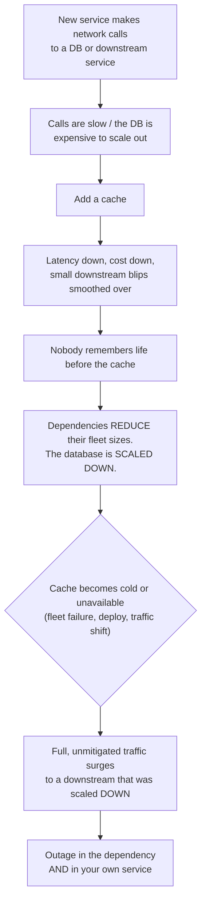

**The cache was inadvertently promoted from a helpful addition to a necessary, critical component** — without anyone deciding that, and without it being operated to that standard.

#### The root cause: modal behaviour

> A cache introduces **two modes** into your system: the *cached* path and the *uncached* path. Your capacity planning is silently based on the observed **distribution** between them. **An unanticipated shift in that distribution is the disaster.**

| Mode | Cost per request | What you sized for |
|---|---|---|
| **Hit** (99%) | 0.4 ms, no downstream call | The DB fleet you kept |
| **Miss** (1%) | 35 ms + one downstream call | — |
| **Cache gone (100% miss)** | Every request hits a downstream **sized for 1%** | 💥 |

#### What to actually say in an interview

| Question to ask yourself | Why it matters |
|---|---|
| **"Can my dependency survive a 0% hit ratio?"** | If not, the cache is no longer an optimisation — it is a **critical dependency** and must be operated like one |
| **"Have I load-tested with the cache disabled?"** ⭐ | Amazon's explicit practice. It is the *only* way to know whether your safeguards work |
| **"Did we scale the DB down after adding the cache?"** | If yes, you have traded an optimisation for a hidden single point of failure |

**Mitigations** (these are the real answer, not "add a cache and move on"):

| Mitigation | Detail |
|---|---|
| **Load shedding** | Cap the maximum request rate you will send downstream. Shed the excess rather than browning out the dependency |
| **In-memory fallback behind the external cache** | If Redis dies, fall back to a per-process L1 — **not** straight to the database |
| **Serve stale** | Soft TTL / hard TTL ([§9.5](#95-soft-ttl--hard-ttl--the-resilience-pattern-aws-actually-uses)) |
| **Don't over-shrink the origin** | Keep enough downstream capacity to survive a cache-cold event, or accept and document the risk |

---

## 4. Latency Hierarchy (relative, not absolute)

Focus on **relative order**, the actual numbers depend on hardware.

```
CPU / RAM            ▏ fastest
Local in-process cache (HashMap)  ▏▏
Redis (distributed) ▏▏▏▏      ← adds a NETWORK hop
Database            ▏▏▏▏▏▏▏▏
Remote service call ▏▏▏▏▏▏▏▏▏▏▏  slowest
```

**Key principle:** *The closer the cache is to the user/application, the lower the latency.*

**But** closer ≠ always better — if your app runs on 10,000 instances, a local HashMap means 10,000 copies of the data → memory waste + inconsistency. That is exactly why **distributed cache** exists.

### Numbers to quote in an interview

| Access | Typical latency | Note |
|---|---|---|
| **Memory / RAM** | ≈ **100 ns** | Where a cache lives |
| **Disk / SSD** | ≈ **1 ms** | Where a database lives |
| **→ Ratio** | **≈ 10,000× faster** | This gap is the *entire* justification for caching |
| Redis in the same DC | ≈ **0.5–2 ms** | RAM speed **+** a network hop |
| Cross-continent round trip (e.g. Australia → Virginia) | ≈ **300–350 ms** | Why CDNs exist |
| CDN edge a few miles away | ≈ **20–40 ms** | ~10× better than crossing the planet |

> ⭐ **Two different problems, two different caches.** Redis/in-process caching optimises **memory vs disk**. A CDN optimises **network distance**. Saying that distinction out loud is a strong signal in an interview.

---

## 5. What Should You Cache?

A good cache candidate ticks these **four boxes** (memorize this checklist):

1. ✅ **Read frequently**
2. ✅ **Expensive to fetch or compute**
3. ✅ **Result is reused** across requests/users
4. ✅ **Some staleness is tolerable**

### Good candidates
- Product metadata (images, description, price-ish data)
- Feature flags & application configuration
- Recommendations (heavy ML computation in the background → keep a **warm cache**)
- Document/video metadata, thumbnails
- Session data

### Bad candidates
- **Bank balance / wallet balance**
- **Stock prices**
- Any **financial transaction** data
- Anything needing **strict real-time consistency**

**How to reason about it as a user:**
> "Am I comfortable seeing a value that is 5 seconds old? 1 minute old? If someone transfers me money, do I need it reflected instantly?"

**Interview move:** If asked *"what cache should I use?"*, **counter-question first**:
> "What are the consistency and freshness requirements? Is stale data acceptable? If the cache is down, can we serve stale or default data?"

### Frequency and Cost are TWO independent axes

The four-box checklist reads like an AND, but **cost of computation alone can justify a cache even when access is infrequent**.

```
                   HIGH compute cost
                          |
   Cache it (recompute    |    Cache it - the
   is 5s, even if rarely  |    obvious win
   asked for)            |
  ------------------------+------------------------ HIGH access frequency
                          |
   Don't cache -          |    Cache it if the
   not worth the          |    origin is slow or
   complexity             |    far away
                          |
                   LOW compute cost
```

**Worked example (document-summarisation app):** the app reads a file and produces an AI summary; an enhancement also links the new summary to previous ones. Generating one summary takes **~5 seconds**. Even if a given document is opened only occasionally, caching the summary is worth it — the alternative is re-reading every file from the file system and re-running the model on every request.

> ⭐ So the question is not only *"is it read often?"* but also *"what does it cost me to produce it again?"* Recommendations, ML inference, report aggregation and PDF/summary generation all sit in the expensive-but-infrequent quadrant.

### When NOT to cache — the practical checks

| Situation | Why caching adds nothing |
|---|---|
| The **origin is already fast / nearby** | If the data source is on the same box and answers in microseconds, a cache buys you nothing but staleness |
| Access is **"once in a blue moon"** | An entry read once before it expires is pure overhead — you paid to populate it and never got a hit |
| The data **changes faster than any usable TTL** | If it changes every second, a 1-second TTL means ~100% miss rate; you've added a hop for nothing |
| **Request volume is low** | A single-box app with a handful of users doesn't need three cache layers — that is complexity without benefit |
| The value is **security-sensitive** | Balance, tokens, PII — read from the source of truth |

> **YAGNI reminder:** for a single-box application, adding browser **+** server **+** distributed caching is over-engineering. Add a layer when you can point at the bottleneck it removes.

### The AWS cacheability test

Amazon frames the decision as three concrete questions:

| # | Question | Fails if… |
|---|---|---|
| **1** | **Is there a latency or efficiency problem** at the anticipated request rate? Will the dependency start **throttling** or fail to keep up? | You're caching preemptively with no measured bottleneck |
| **2** | **Would the cache have a good hit ratio?** Can a result be reused **across multiple requests or operations**? | Every request needs a **unique query with unique-per-request results** → the hit rate is negligible and **the cache does no good** |
| **3** | **Are the service _and its clients_ tolerant of eventual consistency?** | Cached data necessarily drifts from the source. Caching only succeeds if **both sides compensate** |

> ⭐ **An extra trigger worth naming:** caching is especially worth considering when you see **uneven request patterns causing hot-key / hot-partition throttling** on the dependency — a cache absorbs the skew that the datastore's partitioning cannot.

**How inconsistent will it actually be?** Two factors, and they interact: the **rate of change of the source data** × the **cache refresh policy**. Slow-changing data can be cached far more aggressively — which is why "how often does this change?" is the first question to ask before picking a TTL ([§9.3](#93-choosing-the-ttl-number)).

---

## 6. Caching Layers Architecture

Caching is **not** either/or — real systems run **all these layers together**.

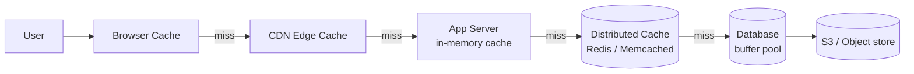

| Layer | What to store | Notes |
|---|---|---|
| **Browser** | Session details, UI preferences, profile info, API responses, encrypted tokens | Never store anything with a security concern unencrypted |
| **CDN** | Images, video, JS, CSS — any static/cacheable HTTP content | Distributes content geographically close to the user |
| **App in-memory** | Config, feature flags, small hot lookups (HashMap) | Fastest, but per-instance → inconsistent |
| **Distributed (Redis)** | Sessions, product objects, computed results, recommendations, user metadata | Shared across all app instances |
| **Database buffer pool** | Hot pages/queries | Postgres/MongoDB do this internally — **you cannot configure it from the app side** |

> Every layer gives you an opportunity to avoid an expensive operation — **and** introduces its own freshness/invalidation problem.

### Where to actually put the cache — interview guidance

The four placements you'll be judged on, in the order you should reach for them:

| Placement | Also called | When to bring it up | Trade-off |
|---|---|---|---|
| **External cache** ⭐ | Remote / distributed / shared cache (Redis, Memcached) | **Your default in every interview.** Runs on its own server, manages its own memory, and is **shared by every app server** — so once one server warms a key, all of them benefit | One network hop; you now own its availability, sharding and failover |
| **In-process cache** | Local / embedded (HashMap, Caffeine, Guava) | Only for **config, feature flags, small lookup tables** that every request needs, or when **ultra-low latency** matters. Frequently under-used in the real world | **Fastest** (zero network hop) but **each server has its own copy** → inconsistency + duplicated memory |
| **CDN** | Edge cache | **Global users + media.** Images, video, static assets. Modern CDNs also cache public API responses, HTML, and can run **edge logic** to personalise | Purge/invalidation is slower and coarser |
| **Client-side cache** | Browser HTTP cache / localStorage / mobile on-device store | Least often relevant. Bring it up for **offline functionality** or client-heavy workloads (e.g. Strava caching runs offline, then syncing) | You have the **least control** — staleness and invalidation are hardest |

> **Interview rule:** default to the **external cache**. Mention in-process caching only as a *deliberate optimisation* (e.g. a local fallback for a hot key — see [§13.4](#134-hot-key-celebrity-problem)), not as your starting point.

### 6.1 Browser / HTTP Caching — the headers interviewers ask about

The browser and CDN layers are driven **entirely by HTTP response headers**. Knowing them is what separates "I'd use a CDN" from an actual design.

| Header | Meaning |
|---|---|
| `Cache-Control: max-age=3600` | Fresh for 1 hour — served with **zero network round-trips** |
| `Cache-Control: public` / `private` | `public` = CDN **and** browser may cache. `private` = **browser only** (use for per-user responses) |
| `Cache-Control: no-store` | Never write to any cache — auth tokens, PII, banking |
| `Cache-Control: no-cache` | May store, but **must revalidate** before every use |
| `Cache-Control: s-maxage=600` | TTL for **shared** caches (CDN) only; overrides `max-age` at the edge |
| `Cache-Control: stale-while-revalidate=60` | Serve stale for 60 s while refreshing in the background — the HTTP-level answer to cache stampede |
| `Cache-Control: immutable` | Never revalidate — pairs with fingerprinted filenames |
| `ETag: "v3-abc"` | Content fingerprint. Client resends it as `If-None-Match` → server replies **304 Not Modified** with **no body** |
| `Last-Modified` / `If-Modified-Since` | Weaker, timestamp-based revalidation (1-second granularity) |
| `Vary: Accept-Encoding, Authorization` | Which **request** headers form part of the cache key |
| `Age: 120` | How long the CDN has held this response — useful for debugging edge TTLs |

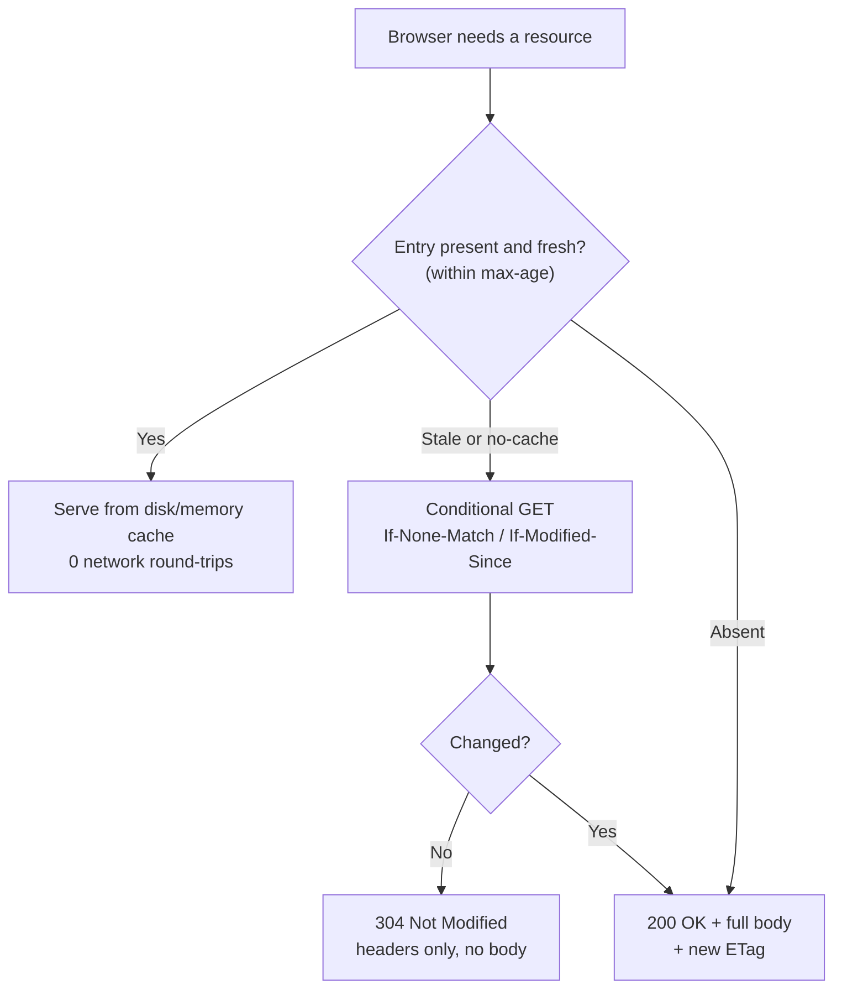

**CDN cache key** = URL + query string + whatever `Vary` names (sometimes cookies/headers). Two symmetric mistakes:

| Mistake | Consequence |
|---|---|
| Including a **per-user** cookie/header in the cache key for shared content | Hit ratio collapses toward 0 — every user gets their own copy |
| **Not** marking per-user responses `private` | The CDN serves **user A's response to user B** — a real **cache-poisoning / data-leak** incident |

**CDN invalidation options:**

| Method | Notes |
|---|---|
| **Purge by URL** | Precise, but slow to propagate across all PoPs |
| **Purge by tag / surrogate key** | Invalidate a whole group ("all pages showing product 42") |
| **Cache busting via fingerprinted filename** (`app.9f3c1a.js`) ⭐ | **Preferred** — a new deploy produces a new URL, so nothing ever needs purging. Pair with `max-age=31536000, immutable` |
| **TTL expiry** | Simplest; just wait |

### 6.2 Browser Storage APIs — where the data physically goes

HTTP headers control the **browser's own HTTP cache**. When *your JavaScript* wants to cache an API response, you pick one of these instead:

| Mechanism | Lifetime | Size | Sent to server? | Use it for |
|---|---|---|---|---|
| **In-memory** (a `Map` / service-level store) | **Until page reload** — dies on refresh or navigation away from the SPA | RAM-bound | No | Data that must survive **route changes within one page load**. Fastest possible |
| **`sessionStorage`** | Until the **tab** is closed. **Each tab gets its own copy** | ~5 MB | No | Per-tab working state, wizard progress, filters you want reset next time |
| **`localStorage`** | **Persists across tab close and browser restart** until explicitly cleared | ~5–10 MB | No | User preferences, theme, last-viewed list, feature flags |
| **Cookies** | Configurable (`Expires`/`Max-Age`) | **~4 KB** | **Yes — on every request** | Auth/session tokens only. Never bulk data — it inflates every request |
| **IndexedDB** | Persistent | Hundreds of MB+ | No | Large structured datasets, offline-first apps |
| **Cache Storage / Service Worker** | Persistent, programmable | Large | No | Offline shell, precached assets, custom SWR logic |

#### Decision rules (worked example: a "worklist" page)

| Requirement | Choice |
|---|---|
| "User navigates to another page and comes **back**, don't refetch" | **In-memory** store at the global/service level |
| "Survive a **tab close and reopen**" | **`localStorage`** |
| "Only for **this tab/session**, reset next time" | **`sessionStorage`** |
| "Server must see it on every call" (auth) | **Cookie** |
| "Cache 50 MB of offline experiment data" | **IndexedDB** |

> ⚠️ **Precision point:** `sessionStorage` is scoped to the **browser tab**, *not* to a login session. Two tabs = two independent copies, and it survives a page **reload** but not a tab close. If you want "reset when the user logs in again", clear your `localStorage` keys explicitly on logout — don't rely on `sessionStorage` to mean "login session".

> 🔒 **Security:** never put tokens or PII in `localStorage` unencrypted — it is readable by any script on the origin, which makes XSS far more damaging. Prefer `HttpOnly` `Secure` cookies for session tokens.

---

## 7. Local Cache vs Distributed Cache

**Scenario:** Java app, 10 instances, each with its own `HashMap`.

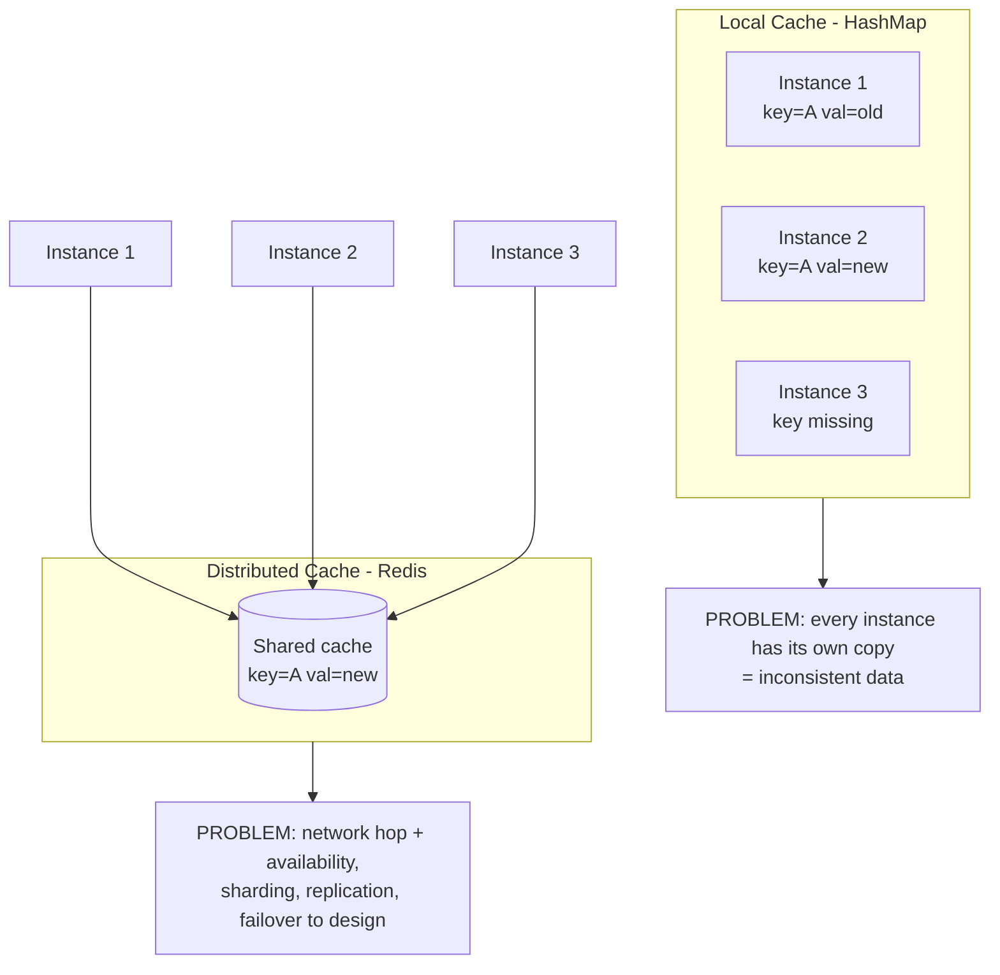

| | Local (HashMap) | Distributed (Redis) |
|---|---|---|
| Speed | Fastest (no network) | Slower (network hop) |
| Consistency across instances | ❌ Each instance differs | ✅ Single shared view |
| Memory | Duplicated N× | Single pool |
| Ops burden | None | Availability, sharding, replication, failover |

**There is no universal answer.** A small local cache **in front of** the distributed cache is a valid hybrid for extremely hot, safe-to-cache data.

### The N-servers, N-cold-misses problem

Spell this out with numbers — it lands much harder than "each instance has its own copy":

> You horizontally scale to **100 app servers** and use an in-process cache. A load balancer sends each request to an arbitrary server, and **you have no control over which one**.
>
> - Request 1 hits server 7 → miss → DB read → populate server 7's map.
> - Request 2 hits server 42 → **miss again** — server 42 has never seen this key.
> - … in the worst case the **first 100 requests for the same key all miss**, produce **100 identical DB queries**, and store **100 duplicate copies** of the same value.
>
> After warm-up all 100 are hot and the hit rate looks fine — but you paid **100× the cold cost and 100× the memory**, and any write now has to be invalidated on **all 100 servers**.

**Two more in-process consequences:**

| Consequence | Detail |
|---|---|
| **Restart = total cache loss** | Deploy, crash or autoscale-down wipes it. On restart the whole working set must be rebuilt from scratch — a **cold start** on every rollout |
| **Invalidation is a broadcast problem** | With one shared Redis you delete one key. With 100 in-process caches you need pub/sub to reach every instance |
| **Downstream load scales with your fleet** ⭐ | AWS states it as a law: *with an in-memory cache, load on the dependency is **proportional to fleet size**.* Autoscale from 10 to 200 pods and you have **20× the cold traffic** hitting a downstream that never changed size. An external cache decouples the two |
| **Cache coherence** | A client making two calls can get **newer data first and older data second**, purely depending on which server handled each request |

> ⭐ In a distributed system, in-process caching only makes sense for data that is **small, identical everywhere, and tolerant of per-instance drift** — config, feature flags, lookup tables — or as a deliberate **L1 in front of Redis** for a known hot key.

> 💡 **Side note from the video (DSA interviews):** use a **HashSet**, not a HashMap, when you only need presence/absence checks. Candidates get rejected for this.

---

## 8. Caching Patterns (Read + Write)

> ⭐ **A pattern is NOT a placement.** Cache-aside, read-through, write-through, write-behind and write-around describe **who talks to the database and when** — they say nothing about *where* the cache lives. Cache-aside works identically with an in-process `HashMap`, an external Redis, or a CDN. Don't let "cache-aside" become a synonym for "Redis".

| | In-process (`HashMap` / Caffeine) | External (Redis / Memcached) |
|---|---|---|
| **Cache-aside** | ✅ Natural fit — check map → miss → DB → put in map | ✅ The industry default |
| **Read-through** | ⚠️ Needs a separate loader/service that owns the DB fetch — at which point in-process stops making sense | ✅ Needs a library (Redisson, Hazelcast, Spring Cache) |
| **Write-through / write-behind** | ⚠️ Same — you're building a mini cache service | ✅ Needs framework support |
| **Write-around** | ✅ Trivial — just don't touch the cache on write | ✅ Trivial |

> **Why:** the moment the *cache* owns the DB-fetch logic (read-through and the write patterns), it needs a life of its own — configuration, a loader, error handling. Keeping that inside your app process gives you all of the complexity and none of the sharing benefit.

### 8.1 Cache-Aside (Lazy Loading) — the industry default

> 📖 **Deep dive + runnable code:** [cache-aside-lld.md](cache-aside-lld.md) (Python / TypeScript / JavaScript LLD)
> **Sources:** [Azure Architecture Center](https://learn.microsoft.com/en-us/azure/architecture/patterns/cache-aside) · [AWS Database Caching Strategies](https://docs.aws.amazon.com/whitepapers/latest/database-caching-strategies-using-redis/caching-patterns.html) · [Redisson](https://redisson.pro/glossary/cache-aside.html) · [GeeksforGeeks](https://www.geeksforgeeks.org/system-design/cache-aside-pattern/)

**Definition:** The cache is a **passive** key-value store. The **application** — not the cache — owns the read-miss and invalidation logic. The cache **never talks to the database**.

**Also called:** *Lazy loading* (entries are created only in response to a real request) and *look-aside caching*. All three names describe the same pattern.

#### 8.1.1 Read path (3 steps — memorize this)

1. Application checks the **cache** first.
2. **Hit** → return immediately.
3. **Miss** → query the **database**, write the result into the cache **with a TTL**, then return it.

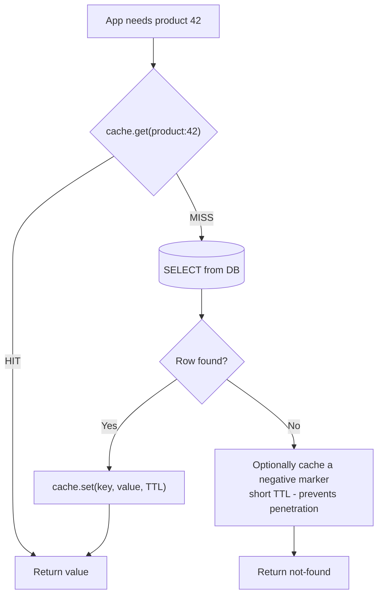

**Pseudocode (the canonical 5 lines):**

```
value = cache.get(key)
if value is null:
    value = database.query(key)
    if value is not null:
        cache.set(key, value, ttl)
return value
```

#### 8.1.2 Write path — order matters ⚠️

**Update the database FIRST, then DELETE the cache key.**

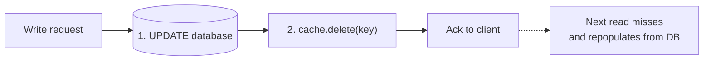

Two rules interviewers probe on:

| Rule | Why |
|---|---|
| **DB first, cache second** | If you delete the cache first, a reader can slip in *before* the DB write commits, read the **old** row, and repopulate the cache with stale data that survives until TTL. (Azure explicitly calls this out.) |
| **DELETE, don't UPDATE the cache** | A delete is **idempotent** and forces the next read to repopulate from the system of record. An overwrite can seed the cache with a value that a concurrent transaction has already superseded — and that wrong value then persists until it expires. |

#### 8.1.3 Advantages

| Advantage | Detail |
|---|---|
| **Only useful data is cached** | Nothing is loaded in advance → cache stays small and cost-effective (AWS) |
| **Resilient to cache failure** | If Redis is down, the app still reads from the DB — it degrades, it doesn't break (contrast: write-through *blocks writes*). ⚠️ But see the caveat below — a **naive** fallback is how outages happen |
| **Works with any cache** | Requires nothing beyond `GET` / `SET` / `DEL`. Redis has no built-in "pattern" — cache-aside lives entirely in your code |
| **Cache anything** | Not tied to one query. You can cache a row, an expensive join, a rendered fragment, or a value assembled from three microservices |
| **Fine-grained control** | Per-key TTL, per-key serialization, per-key invalidation |

> ⚠️ **The "resilient to cache failure" claim has a big caveat (AWS).** Falling back to the database on a cache miss is fine for *one* key. Falling back for **every** key during an **extended cache outage** produces "an atypical spike in traffic to the downstream service, leading to throttling or brownout" — you convert a cache outage into a **database** outage.
>
> Amazon's preferred safeguards, in order:
>
> | Safeguard | What it does |
> |---|---|
> | **External cache + in-memory fallback** | If Redis is unreachable, serve from a per-process L1 instead of stampeding the DB |
> | **Load shedding / rate cap** | Cap the maximum request rate you will forward downstream; shed the rest |
> | **Serve stale (hard TTL)** | Keep answering from expired-but-present data — see [§9.5](#95-soft-ttl--hard-ttl--the-resilience-pattern-aws-actually-uses) |
> | **Test with caching disabled** ⭐ | Run load tests with the cache turned off to *prove* the safeguards work. This is an explicit Amazon practice |

#### 8.1.4 Disadvantages

| Disadvantage | Detail |
|---|---|
| **Cache-miss penalty** | First request pays cache-round-trip **+** DB round-trip **+** cache-write. Initial response time is *worse* than no cache (AWS) |
| **Stale data window** | Between the DB write and the cache delete — and between the delete and the next read — readers can see stale or missing data |
| **Duplicated miss-handling code** | The check → load → populate block is repeated at every read path and **drifts** between them. That's the signal to move to **read-through** |
| **No consistency guarantee** | An external process can change the DB at any time; the cache won't know until TTL or explicit invalidation |
| **Cold start** | After a deploy, failover or flush, **every** read is a miss until the working set is rebuilt |

#### 8.1.5 Problems & Considerations (Azure checklist — great for interviews)

| Consideration | What to say |
|---|---|
| **Lifetime of cached data (TTL)** | Match the expiry to the access pattern. Too short → constant DB round-trips. Too long → stale data. Caching works best for **relatively static or read-frequently** data |
| **Eviction** | The cache is far smaller than the data store. Most caches default to **LRU**; some allow customization |
| **Configuration** | Global vs per-item. If an item is **expensive to retrieve**, configure it individually — keep it cached even if accessed less often than cheap items |
| **Priming / warming** | Prepopulate at startup with data you know is needed. Cache-aside still handles what expires or is evicted |
| **Consistency** | Cache-aside gives **no** consistency guarantee between cache and store |
| **Staleness after writes** | Cache-aside invalidates on write and repopulates on the next read → a brief window of miss/stale. If you need **read-after-write** freshness, use **write-through** |
| **Local caching** | A per-instance in-memory cache is **private** — instances diverge. Use shorter TTLs, or move to a shared/distributed cache |
| **Semantic caching** | For LLM workloads you can key on *meaning* rather than exact key — but only when semantic equivalence is safe and the data isn't private/sensitive |

#### 8.1.6 When to use / when NOT to use

**✅ Use cache-aside when:**
- **Read-heavy** workload with **uneven access** — a small subset of keys serves most requests
- Brief **staleness is acceptable**
- Resource demand is **unpredictable** — you can't predict what to preload
- The cache has **no native read-through/write-through** support (Redis, Memcached)

**❌ Avoid cache-aside when:**
- The data is **sensitive/security related** — especially with a shared cache. Always read from the primary source
- The dataset is **static and small** — just prime the cache at startup and never expire it
- **Most requests miss** — the overhead of checking + populating outweighs the benefit
- **Writes dominate**, or cache and DB **must never diverge** → use **write-through**
- The same entity is read from **dozens of call sites** and the miss-handling block keeps drifting → use **read-through**
- Caching **session state in a web farm** — avoid client-server affinity dependencies

#### 8.1.7 The Three Failure Modes (this is where interviews go deep)

##### ① Write-Invalidate Race (stale-write-back)

A DB write and a cache invalidation are **two separate operations** — a reader can slip between them.

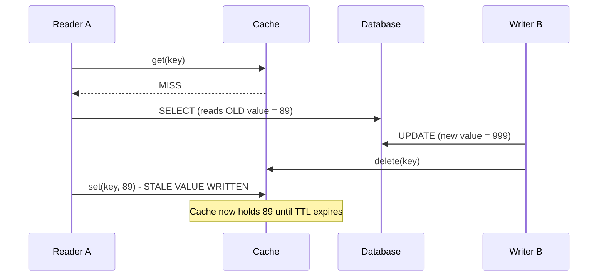

**Fixes:**
| Fix | Effect |
|---|---|
| **Short TTL** | Bounds how long the stale value can live (mitigation, not a cure) |
| **Distributed lock on the key** | Properly closes the window — the writer's delete and the reader's set can't interleave |
| **`SET ... NX`** (set-if-absent) on repopulate | The reader won't overwrite a fresh value |
| **Versioned keys / CAS** | Reader only writes back if the version it read is still current |
| **Delayed double-delete** | Delete the key, write the DB, then delete again after a short delay |

##### ② Thundering Herd / Cache Stampede on expiry

A property of **lazy loading itself**, not a bug: a popular key expires → every concurrent reader misses at the same instant → all of them query the DB together. → See [§13.1](#131-cache-stampede-thundering-herd). Standard fix: **one caller repopulates while the rest wait** (distributed lock / single-flight) + **TTL jitter**.

##### ③ Cold Start

An empty cache serves nothing. After a deploy, a failover, or a `FLUSHALL`, every read is a miss and the DB sees **full** traffic.

**Fixes:** warm critical keys on startup, stage the restart/rollout, keep a pre-computed fallback, rate-limit the DB during warm-up.

#### 8.1.8 Choosing a TTL

> **A TTL is not a performance setting — it is a statement about how stale a value is allowed to become.** It also doubles as the backstop for the invalidation race.

- Set the TTL **when you write the key**. Don't rely on **eviction** — eviction fires under **memory pressure**, which is not the same thing as data going out of date.
- **Correctness matters more than hit rate** → longer TTL **+** explicit invalidation on write.
- **Correctness doesn't matter much** → short TTL, no invalidation. That is often the entire design.
- Always add **jitter** so keys don't expire in lockstep.

#### 8.1.9 Optimizations

| Technique | What it does |
|---|---|
| **Negative caching** | Cache "not found" with a short TTL → stops cache penetration |
| **Batch / MGET on miss** | Group multiple misses into one DB round-trip instead of N |
| **Hierarchical / tiered cache** | L1 in-process (Caffeine/Guava) + L2 distributed (Redis) → removes the network hop on hot keys |
| **Near cache** | L1 copy invalidated cluster-wide automatically (Redisson `RLocalCachedMap`, Hazelcast near cache) |
| **Sliding expiration** | Reset the TTL on each access so hot keys stay resident |
| **Event-driven invalidation** | Kafka/CDC events invalidate keys in real time instead of waiting for TTL |
| **Graceful degradation** | Cache timeouts must **not** fail the request — fall through to the DB, wrapped in a **circuit breaker** |
| **Avoid caching `null`** | Cache an explicit sentinel instead, so "no value" and "cache down" are distinguishable |

#### 8.1.10 Real-World Usage

| Company | Implementation |
|---|---|
| **Netflix** | **EVCache** (built on Memcached) for catalog metadata and recommendations — miss → backend DB → populate → serve |
| **Amazon** | Redis + **DynamoDB Accelerator (DAX)** for product details and inventory during peak shopping |
| **Facebook** | **Memcached + TAO** for session data and social-graph reads (profiles, friend lists) at billions of requests/day |

#### 8.1.11 Interview Cheat Answers

| Question | Answer |
|---|---|
| **What is cache-aside?** | The application manages the cache: check cache → on miss query DB → populate cache → invalidate on write. The cache never queries the DB. |
| **Why is it called lazy loading?** | Entries are created only in response to a real request; nothing is preloaded. |
| **Cache-aside vs read-through?** | Both populate on miss. The difference is **who** does it — the application (cache-aside) or the cache itself (read-through). |
| **Is Redis "cache-aside"?** | No. Redis is a key-value store with no built-in pattern. Cache-aside lives in your application code — which is why it works with every client. |
| **Update or delete the cache on a write?** | **Delete.** It's idempotent and forces repopulation from the source of truth. Updating risks seeding a value a concurrent transaction already replaced. |
| **DB first or cache first on a write?** | **DB first, then delete the cache.** The reverse creates a window where a reader repopulates the cache with the pre-update value. |
| **Main drawbacks?** | Miss penalty on first read, duplicated miss-handling code, write-invalidate race, thundering herd on expiry, cold start. |
| **How do you fix each drawback?** | TTL + jitter; invalidation on write; lock/single-flight around repopulation; warm-up on deploy; move to read-through when the code drifts. |
| **When would you NOT use it?** | Write-heavy workloads, strict consistency requirements, sensitive data, mostly-miss access patterns, small static datasets (just prime it). |

### 8.2 Read-Through

**The cache itself knows how to load from the backing store.**

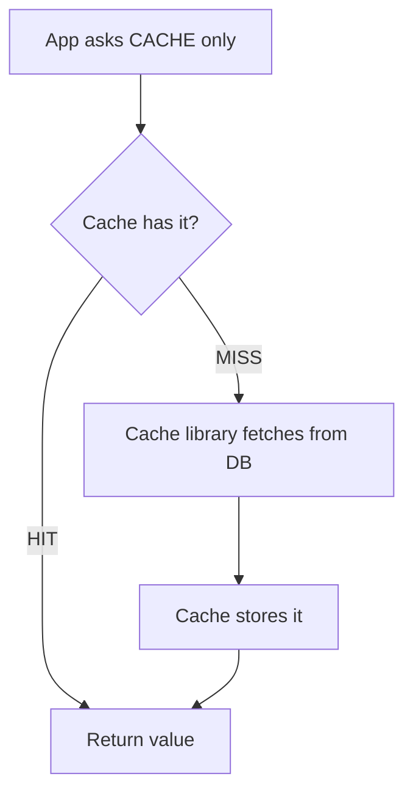

- ✅ Application code becomes very simple
- ❌ Cache layer becomes more sophisticated — **complexity moved, not removed**
- ❌ Needs a cache **library/framework that supports it** — plain Redis/Memcached will not do the DB lookup for you

**Mental model:** read-through is *cache-aside with the cache acting as a proxy*. Same behaviour, different owner of the miss path.

**The real distinction is coupling:**

| | Cache-aside | Read-through |
|---|---|---|
| Coupling | **Tightly coupled** — your service code contains cache-specific logic (check, populate, invalidate) scattered through every read path | **Decoupled** — your service makes one `get()` call and has no idea what happens behind it |
| Extra code you own | A `HashMap`/Redis block in every handler | None — the loader is registered once |
| Who to blame on a miss | Your service | The cache layer |

> Swapping an in-process map for an external Redis does **not** fix this — with cache-aside your server still has to do all the same work, just over a socket. Read-through is what actually removes the coupling.

**This is exactly how a CDN works** — on an edge miss the CDN itself fetches from the origin (S3), caches the result, and serves it. In an interview, read-through is usually the right thing to name **in the CDN / edge-caching context**; for application-level caching, cache-aside stays the default because it needs no special adapter.

**Interview framing:** the differentiator between cache-aside and read-through is one question — *"Who is responsible for loading the data?"*

### 8.3 Write-Through

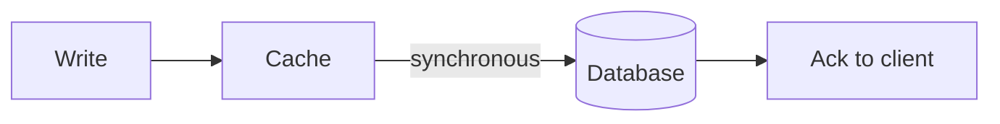

- ✅ Cache always stays **warm**, relatively **strong consistency**
- ❌ Write path is **slower** (every write pays DB latency)
- ❌ **Cache pollution** — you write *everything* to the cache, including data nobody ever reads back. Cache-aside only ever holds what was actually requested
- ❌ **Needs framework support.** Redis and Memcached do **not** natively write through to a database. Either you write to both from application code (and inherit the problem below) or you use a library like **Spring Cache** or **Hazelcast** that triggers the DB write for you

**⚠️ The dual-write problem** — the failure mode interviewers probe on:

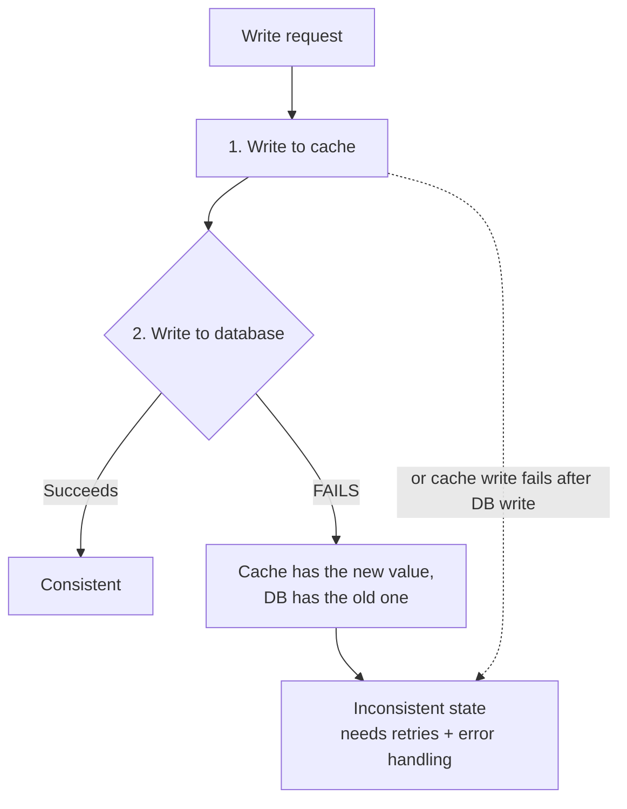

Two separate systems, no shared transaction. Perfect consistency across them is very hard in a distributed system — which is why write-through is far less common than cache-aside in practice.

**When to bring it up:** only when reads **must** always return fresh data **and** the system can tolerate slower writes. Before you commit, convince yourself that cache-aside (or a short TTL + invalidate-on-write) doesn't already satisfy the requirement.

### 8.4 Write-Behind / Write-Back

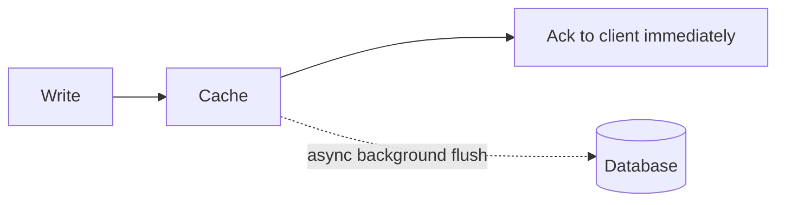

- ✅ **Very fast** writes and responses
- ❌ **Risk: data loss.** If the cache dies before the flush, the write never reaches the DB
- ❌ **Never** use for critical financial data (bank balance, stocks)
- ℹ️ Modern Redis has persistence/recovery mechanisms that reduce (not remove) this risk

**Good fit:** analytics / metrics pipelines where very high write throughput matters more than immediate consistency and occasional loss is acceptable.

> 🚩 **Interview advice (Hello Interview):** unless you are genuinely expert in caching **and** can strongly justify it, **avoid proposing write-behind**. There is almost always another way to solve the same problem, and naming it opens the door to a line of follow-ups you probably don't want.

#### The real-world rule: write-behind works when the **product has already promised a delay**

Write-behind is acceptable exactly when the **user has been told to expect it**:

| Example | Why it works |
|---|---|
| **Bank address / profile update** — "it will reflect in 2 working days" | The bank batches the day's profile changes and applies them together at end-of-day. The user was told 2 days, so a few hours of staleness is invisible — **the expectation was set at the product level, not the engineering level** |
| **PF / EPFO passbook balance** not showing the latest contribution | Same shape: deferred, batched settlement. Users tolerate it because the portal says so |
| **News site / blog article** | Nobody is harmed by a 5-minute-old article |
| **Analytics / metrics ingestion** | Losing a few events on a crash is acceptable |

**And the counter-example:** the **same bank** must **never** use write-behind for a **balance**. Withdraw ₹4,000 at a branch, and if the online channel is still flushing asynchronously you can initiate a second payment against money that is already gone.

> ⚠️ **Verified correction — NEFT is NOT write-behind.** It is tempting to call NEFT "write-behind" because it is asynchronous and deferred, but that is a **batch settlement system**, not a cache write policy:
>
> | | Write-behind (caching) | NEFT (batching) |
> |---|---|---|
> | What it is | A **cache** acknowledges the write, then flushes to the DB asynchronously | RBI collects transactions and **settles them in half-hourly batches** (48 batches/day, 24×7) |
> | Why | Write latency | Throughput/settlement across ~thousands of banks and millions of customers |
> | Data at risk | Yes — unflushed cache entries | No — every transaction is durably recorded before batching |
>
> **RTGS** is the real-time counterpart (₹2 lakh minimum, settled individually and immediately); **IMPS/UPI** are instant. The *async + deferred + batched* **shape** is the same as write-behind, and that analogy is useful — but say "this is a batching system" so the interviewer knows you know the difference.

### 8.5 Write-Around

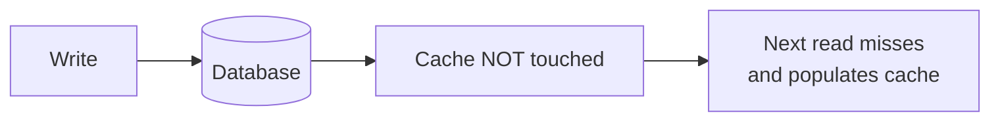

- ✅ Great for **write-heavy** systems — avoids polluting the cache with data nobody reads
- ❌ First read after a write is a miss / may serve stale data
- **Example:** Twitter/Instagram feeds. If Amitabh Bachchan tweets and you see it 2 minutes later — that's fine.

### 8.6 Summary Table

| Pattern | Who manages what |
|---|---|
| **Cache-aside** | **Application** manages the cache |
| **Read-through** | **Cache** manages reading from the backing store |
| **Write-through** | Cache **and** DB updated **synchronously** |
| **Write-behind** | Cache first, DB updated **asynchronously** |
| **Write-around** | DB first, cache populated **later** on a read |

> For an e-commerce product catalog read by millions: **cache-aside** or **read-through** both work. There is no single right answer — it depends on the constraints you established earlier in the discussion.

> 🧠 **Don't stress about the names.** Interviewers do not care whether you say "cache-aside" — they care that you can **describe the behaviour**. If the term escapes you, just say: *"I'll check the cache first; if it's not there I'll go to the database and then populate the cache."* That is the whole answer. Understanding beats vocabulary.
>
> If you remember **one** architecture from this file, make it **cache-aside** — it is what you will use in the overwhelming majority of interviews.

### 8.7 Choosing a Pattern — Decision Matrix

| If the workload is… | Use | Why |
|---|---|---|
| Read-heavy, uneven access, staleness OK | **Cache-aside** | Only caches what was actually asked for; survives a cache outage |
| The same entity is read from **many** call sites | **Read-through** | Miss logic lives in one place instead of drifting across the codebase |
| **Read-after-write** freshness needed, writes are rare | **Write-through** | Cache and DB never diverge; no invalidation race |
| Write-heavy, low write latency required, small loss tolerable | **Write-behind** | Ack immediately, batch the DB writes |
| Write-heavy, the written data is **rarely read back** | **Write-around** | Doesn't pollute the cache with cold data |
| Financial ledger, inventory checkout, auth | **No cache** (or write-through + bypass on critical reads) | Consistency beats latency |

**In practice you combine them.** AWS's guidance is explicit: *write-through is almost always implemented together with lazy loading* — write-through keeps hot data warm, and cache-aside backfills whatever expired or was evicted.

#### Pair a READ pattern with a WRITE pattern — worked example

They are not alternatives; you pick one of each. Banking login is the cleanest illustration:

| Data | Read pattern | Write pattern | Why |
|---|---|---|---|
| **Profile / login info** (name, address, preferences — shown on every login) | **Read-through / cache-aside** | **Write-behind** is tolerable ("reflects in 2 days") | Read-heavy, low consequence if briefly stale |
| **Account balance** | **Write-through** — or bypass the cache entirely | **Write-through**, never write-behind | A stale balance lets a user spend money they no longer have |
| **Product listing (Amazon seller)** | **Read-through** for buyers | **Write-through** when the seller edits the price | Together they guarantee buyers see the price the seller just set |

**The failure this prevents:**

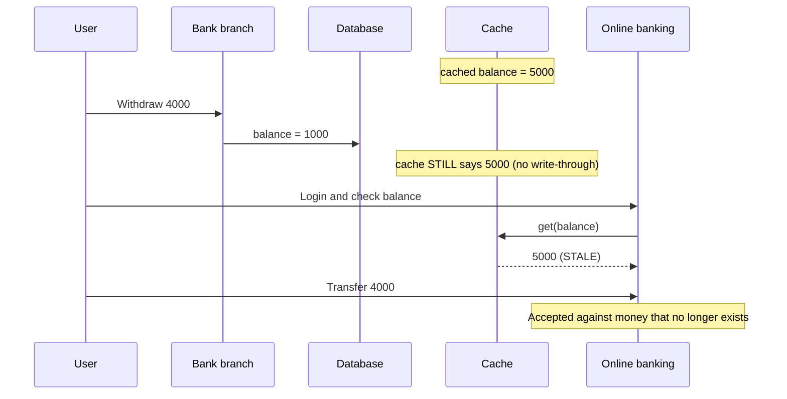

> ⚠️ **Precision note:** in reality most banks do **not** cache the live balance at all — it is read transactionally from the system of record on every request. What they *do* cache is the **non-monetary profile/session data** that every screen needs. "Use write-through for the balance" is the right *pattern* answer; "don't cache the balance, cache the profile" is the better *design* answer. Say both.

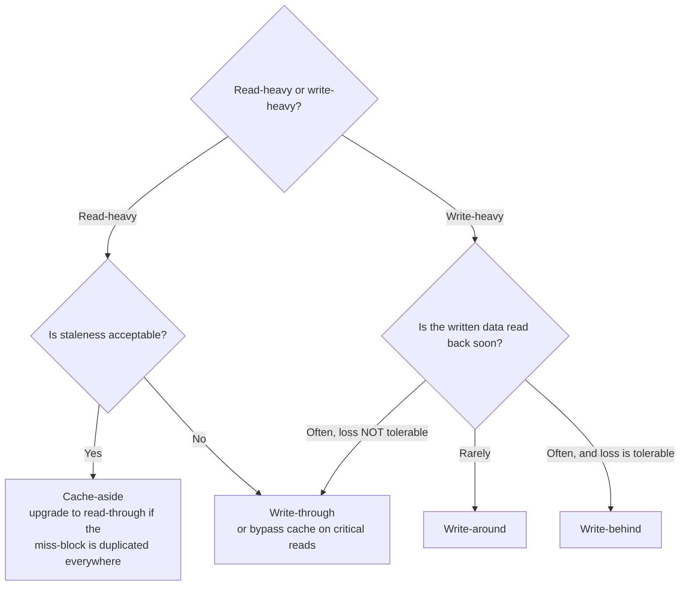

### 8.8 Inline vs Side Caches — the AWS taxonomy

> *Amazon Builders' Library.* A second, orthogonal way to classify caches — and the one that surfaces the **availability** trade-off the read/write-pattern view hides.

| | **Inline cache** | **Side cache** |
|---|---|---|
| Also called | Read-through / write-through | Look-aside / cache-aside |
| Where cache management lives | **Inside the data-access API** — an implementation detail the client never sees | **In your application code** — you check before, and populate after, each data-source call |
| Examples | **DynamoDB DAX**, HTTP caching (caching HTTP client, **Nginx**, **Varnish**, a **CDN**) | **ElastiCache** (Memcached/Redis), **Ehcache**, **Guava** |
| Client sees | One uniform API. Caching can be added, removed or tuned with **zero client changes** | The cache explicitly |

```
INLINE - the cache sits IN the request path
   Client ───► [ Cache: Varnish / DAX / CDN ] ───► Origin
               cache down  =  dependency down

SIDE - the cache sits BESIDE the request path
   Client ──┬─► [ Cache: Redis / Memcached ]
            └─► Origin
               cache down  =  slower, but still works
```

**Why inline is attractive**

| Benefit | Detail |
|---|---|
| **Uniform API for clients** | Caching becomes invisible; you can turn it on, off or tune it without touching client logic |
| **Removes a class of bugs** | Cache-management logic leaves your application code entirely |
| **Off-the-shelf for HTTP** | In-memory libraries, standalone proxies (Nginx, Varnish) and managed CDNs all exist — nothing to build |

**Why inline is dangerous** ⭐

| Downside | Detail |
|---|---|
| **The cache joins the availability equation** | The client has **no opportunity to compensate** for a temporarily unavailable cache. If your Varnish fleet goes down, *from your service's perspective the dependency itself went down* |
| **Must be built into the protocol** | If no inline cache exists for your protocol, it isn't an option — unless you build an integrated client or proxy yourself |

> ⭐ **The one-line trade-off:** a **side cache** lets you degrade (fall through to the origin); an **inline cache** does not — when it's down, the dependency is down. That is the real reason cache-aside remains the default for application data, while inline caching is reserved for the HTTP/CDN layer where the transparency is worth it.

---

## 9. TTL (Time To Live)

**TTL = "this value is valid in the cache for the next N minutes."** A background process expires it.

| | Short TTL | Long TTL |
|---|---|---|
| Freshness | ✅ Fresher data | ❌ More stale data |
| Hit ratio | ❌ More cache misses | ✅ Better hit ratio |

### Problem: 1 million keys all created together with a 1-hour TTL

They **all expire at the same instant** → mass miss → DB gets hammered → **Cache Avalanche**.

### Solution: TTL Jitter

Instead of exactly `10 min`, store `10 min + random(0..N) seconds`:

```
key1 → 10m 05s
key2 → 10m 08s
key3 → 10m 12s
```

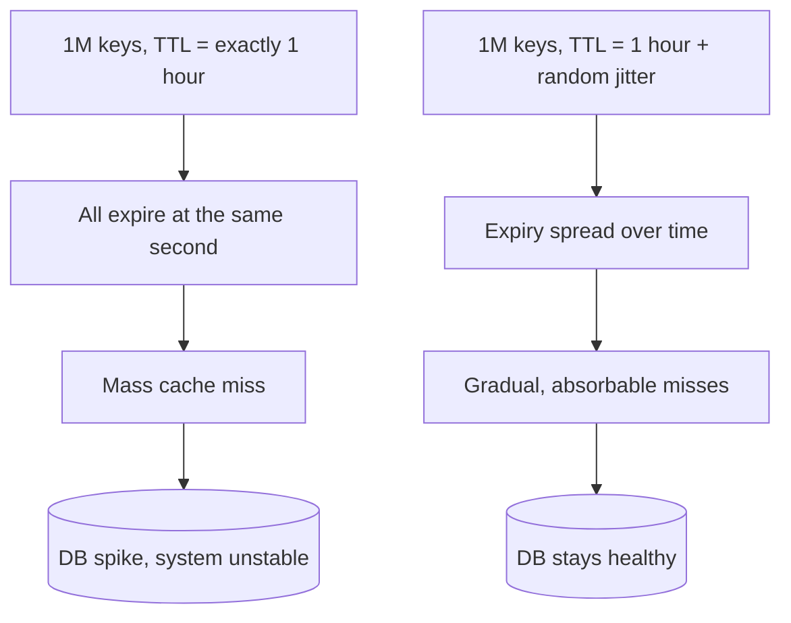

**Scope:** TTL is commonly associated with distributed caches (Redis), but it applies to browser caches, mobile apps, and application-level caches too.

### 9.1 How to actually implement a TTL — absolute expiry, checked lazily

A common instinct is *"run a timer every 2 minutes and check if the data is old."* Don't. **Stamp an absolute expiry at write time and compare it on read.**

```js
// WRITE: compute the deadline once, when you populate
cache.set(key, { value, expiresAt: Date.now() + ttlMs });

// READ: no timer, no background job - just compare
const entry = cache.get(key);
if (entry && entry.expiresAt > Date.now()) return entry.value;   // fresh
cache.delete(key);                                               // expired
return refetchAndPopulate(key);
```

| Why absolute beats a countdown/timer |
|---|
| **No background thread** — nothing to schedule, nothing to leak. Expiry is evaluated only when someone actually asks |
| **Survives suspension** — a laptop sleeping for 3 hours, or a tab throttled in the background, still gets the correct answer on the next read |
| **Serialisable** — an absolute timestamp round-trips through `localStorage`/JSON; a running timer does not |
| **Instant response on the happy path** — the user sees the cached value immediately, with no "am I still valid?" round trip |

**Worked example:** the worklist API responds at **13 Aug, 3:00 PM**. Observed behaviour says the underlying data changes roughly hourly, so you stamp `expiresAt = 13 Aug, 4:00 PM`. Every navigation back to the page before 4:00 PM is served from cache with zero network calls. At **4:05 PM** the next read sees `now > expiresAt`, fires the API once, and re-stamps `5:05 PM`.

### 9.2 TTL alone is not enough — the key must carry every input

> **Refetch if the TTL expired **OR** any request parameter changed.**

A TTL only answers *"is this value old?"* It does not answer *"is this value even for the right question?"* If the user switches folder, filter, sort order, page or tenant, a still-valid entry is now simply **the wrong answer**.

```
❌ cache.set("worklist", data)
   → user changes the folder filter, TTL hasn't expired, they see the OLD folder

✅ cache.set(`worklist:v1:${userId}:${folderId}:${status}:${sort}:${page}`, data)
   → a different filter is a different key, so it simply misses and refetches
```

**Rule:** *every input that can change the response must appear in the cache key.* This is the application-level equivalent of the HTTP `Vary` header (see [§6.1](#61-browser--http-caching--the-headers-interviewers-ask-about)). Add a `v1` version segment so you can invalidate everything by bumping it.

### 9.3 Choosing the TTL number

Derive it from **how often the underlying data actually changes**, not from a round number:

| Observation | TTL |
|---|---|
| Worklist changes roughly once an hour | ~1 hour |
| Trending feed recomputed every minute | 60 s |
| Product description edited a few times a year | Hours to a day |
| Live score | Don't cache (or 1–2 s + SWR) |

**Shortening the TTL is the cheapest way to detect change faster** — dropping 1 hour to 15 minutes bounds staleness at 15 minutes — but you pay 4× the misses, and you have still *not* eliminated staleness. If you need change detection rather than a staleness bound, use **event-driven invalidation** ([§11](#11-cache-invalidation--the-most-annoying-part-of-caching)) instead of shrinking the TTL.

### 9.4 The explicit refresh / cache-bypass endpoint

A pattern worth naming: alongside `GET /worklist` (cache-allowed), expose **`POST /worklist/refresh`** that skips every cache layer, re-reads the source of truth, repopulates, and returns fresh data.

| | `GET /worklist` | `POST /worklist/refresh` |
|---|---|---|
| Reads cache | Yes | **No** — bypasses it |
| Repopulates cache | On miss | **Always** |
| Triggered by | Every page load | A user clicking **Refresh** |

**Why it exists:** the user just dropped a new experiment into the watched folder and wants it *now*. No TTL is short enough to feel instant, and no invalidation event exists for a manual file drop.

> This is the **escape hatch**, not the strategy. It is the API-level equivalent of a browser hard-refresh (`Cache-Control: no-cache`). Interviewers like seeing it because it acknowledges that **some staleness can only be resolved by the human who caused it**.

### 9.5 Soft TTL / Hard TTL — the resilience pattern AWS actually uses

> *Amazon Builders' Library.* Give every entry **two** expiry times. This is one of the highest-value things you can name in an interview, because it converts a cache from a latency optimisation into an **availability** mechanism.

| | Meaning |
|---|---|
| **Soft TTL** | "Try to refresh me now." On a read past the soft TTL, the client attempts to fetch fresh data |
| **Hard TTL** | "After this I am genuinely unusable." If the refresh **fails** — downstream is down, throttling, or not responding — the client **keeps serving the existing cached value** until the hard TTL |

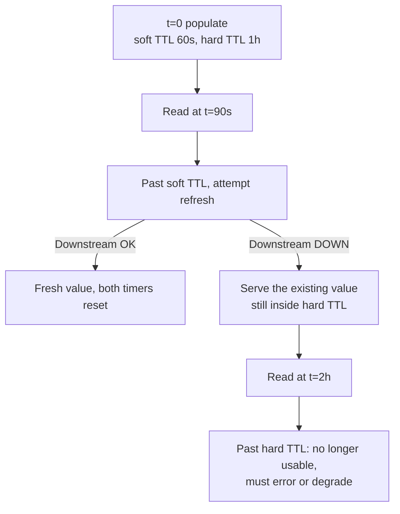

**Why this matters:** with a single TTL, a downstream outage at exactly the wrong moment turns every cached entry into a miss, and every miss into an error. With soft/hard TTL, a downstream outage shorter than `hardTTL − softTTL` is **invisible to users**.

> **Real usage:** the **AWS IAM client** uses exactly this pattern.

#### Soft/hard TTL + backpressure

The pattern gets stronger when the downstream can **signal** its own distress:

1. The downstream service starts browning out and responds with a **backpressure signal**.
2. Callers switch to **serving cached data until the hard TTL**, and only send requests for keys they genuinely don't have.
3. This continues until the downstream **removes** the backpressure.

> ⭐ The result: the struggling dependency gets breathing room to recover **while its upstreams stay available**. Contrast with the naive design, where a browning-out service receives *more* traffic (retries + cache misses) exactly when it can least handle it.

**How it differs from `stale-while-revalidate`:**

| | `stale-while-revalidate` | Soft / hard TTL |
|---|---|---|
| When stale is served | Always, for a fixed window after expiry | **Only when the refresh actually fails** |
| Purpose | **Latency** — never make a user wait for a rebuild | **Availability** — survive a downstream outage |
| Upper bound on staleness | The SWR window (seconds) | The **hard TTL** — typically far longer |

They compose well: SWR for the happy path, hard TTL as the outage backstop.

---

## 10. Eviction Policies

**Eviction = the cache is FULL and you must remove something to make room.**

> **Analogy from the video:** TTL is like **resigning** — you leave on your own terms at a known time. Eviction is like a **layoff** — the system forces you out to make space.

| Policy | Removes | Best for |
|---|---|---|
| **LRU** – Least Recently Used | The one not touched for the longest time | Recency predicts reuse (general default) |
| **LFU** – Least Frequently Used | The least-accessed one | A few items are permanently popular |
| **FIFO** | Oldest inserted | Simple, rarely optimal |
| **Random** | A random entry | Cheap, uniform access patterns |
| **TTL-based** | Whatever expired | Time-sensitive data |

### LRU vs LFU — the classic example

| Object | Access count | Last accessed |
|---|---|---|
| **A** | 100 times | 1:00 AM |
| **B** | 50 times | 2:00 AM |

- **LRU evicts A** (least *recently* used — it hasn't been touched since 1 AM)
- **LFU evicts B** (least *frequently* used — only 50 hits)

**Use LFU** when a few products/keys are permanently hot — LFU captures **popularity**. **Use LRU** when **recency** is the better signal.

> 🎯 *Design an LRU / LFU cache* is one of Microsoft's most frequent DSA questions (~80% chance). Know the implementation.

> ⚠️ **But know which round you're in.** In a **DSA/coding round** the *implementation* is the question (HashMap + doubly linked list for LRU; frequency buckets for LFU). In an **HLD/system-design round** the implementation is **almost always out of scope** — saying "LRU, typically backed by a linked list or priority queue" and moving on is the right depth. Naming the policy **and justifying it for your data** is what earns the point.

**Which to pick in an interview:**

| Policy | Pick it when |
|---|---|
| **LRU** | The default. Recency predicts reuse |
| **LFU** | Access is **highly skewed** — a few items are read far more often than everything else |
| **TTL** | **Freshness matters more than recency or frequency** — sessions, API responses, feeds |
| **FIFO** | Almost never the right answer; know it only because it's the simplest |

### Scope: eviction vs TTL

| | Eviction policy (LRU/LFU/...) | TTL |
|---|---|---|
| Configured at | **Cache/subsystem level** (Redis server, app cache) | **Per object** |
| Granularity | Global for the whole subsystem — the *cart* subsystem has one policy, the *wishlist* another | You can set a different TTL for each key |
| Example | You cannot say "LRU for user X, LFU for user Y" | You **can** say heavy shopper → TTL 10 days, light shopper → TTL 1 hour |

### 10.1 Managing Memory Constraints & Capacity Planning

**Redis `maxmemory-policy`** — what happens once `maxmemory` is reached:

| Policy | Behaviour |
|---|---|
| `noeviction` | **Writes fail** with an OOM error (reads still work). Correct for a *datastore*, dangerous for a *cache* |
| `allkeys-lru` | Evict LRU across all keys — the usual choice for a pure cache |
| `allkeys-lfu` | Evict LFU across all keys — better when popularity is stable over time |
| `allkeys-random` | Evict at random — cheapest; surprisingly fine under uniform access |
| `volatile-lru` / `volatile-lfu` / `volatile-random` | Same, but only among keys that **have a TTL set** |
| `volatile-ttl` | Evict the key with the nearest expiry |

> ⚠️ **Classic production incident:** a `volatile-*` policy evicts **nothing** if no key has a TTL — so instead of evicting, Redis starts returning OOM errors on writes. Either set `allkeys-lru` or make sure every key gets a TTL.

**Sizing math — say it out loud in the interview:**

```
working set   = hot_keys x (key_bytes + value_bytes + per_key_overhead)
overhead      ~ 50-100 bytes/key   (object header + expiry + dict entry)
provisioned   = working set x 1.3  (fragmentation + replication buffer + headroom)
```

*Example:* 10 M sessions × (40 B key + 400 B value + 80 B overhead) ≈ **5.2 GB** → provision ≈ **7 GB**, then divide by shard count.

**Symptom → cause → fix:**

| Symptom | Cause | Fix |
|---|---|---|
| Eviction rate rising, hit ratio falling | Working set **>** memory | Add memory or shard |
| `used_memory_rss` ≫ `used_memory` | **Fragmentation** | `activedefrag yes`, restart, or resize values |
| One value is multi-MB | **Big key** — blocks the single-threaded loop and saturates NIC | Split into hash fields / smaller keys, compress, or move the blob to S3 and cache the pointer |
| OOM errors with **zero** evictions | `noeviction`, or `volatile-*` with no TTLs | Switch policy or add TTLs |
| Memory flat but hit ratio poor | Key design churn (unbounded key cardinality) | Namespace + version keys; cache at a coarser granularity |

**Also budget for:** the cache is a **fraction** of the data store. Cache the **hot working set** (often ~1–5% of rows serving ~80–95% of reads), not the whole table.

---

## 11. Cache Invalidation — "the most annoying part of caching"

The moment you cache, you have **two copies**. When the DB value changes, what happens to the cache?

| Strategy | How it works |
|---|---|
| **Explicit delete/update** | On write, the service deletes or updates the cache key |
| **TTL expiry** | Let it expire naturally |
| **Event-driven (most common at scale)** | Service updates price → publishes to **Kafka** → consumers invalidate/refresh their caches |
| **Versioned keys** | `user:{id}:v2:homefeed` — bump the version to logically invalidate everything |
| **Proactive refresh** | Application refreshes the value before returning the response |

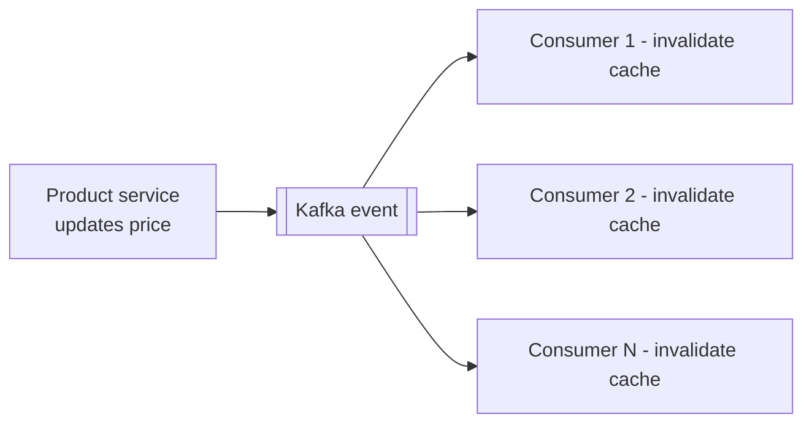

> **Rule:** Don't pick an invalidation strategy first. First establish **how fresh the data must be**, *then* pick the strategy.

**Cross-instance invalidation (100 app instances):** use pub/sub — Kafka, Redis pub/sub, or ZooKeeper node updates that all instances watch.

---

## 12. Consistency — the real cost

> **Root cause in one line:** *most systems **read from the cache** but **write to the database**.* That asymmetry is what creates the stale window — and it is the single most common thing interviewers probe once you introduce a cache.

**Scenario:** Seller updates a product price to ₹999. Cache still holds ₹89.
→ User sees **₹89**, because the app hits the cache first. The cache is **stale**.

**Second scenario (social network):** a user uploads a new profile picture. The DB now has `image2`, but the cache still holds `image1` — and **every other user keeps seeing `image1`** until that key is evicted or expires.

**Is that always a problem? No.**

| Data | Staleness acceptable? |
|---|---|
| Product description / T-shirt listing | ✅ Fine, refresh in a day |
| Social media feed (10s old vs 1s old) | ✅ Fine |
| Government-regulated gold purity spec | ❌ Must be exact |
| Bank balance after you made 5 payments | ❌ Must be instant |

> Some products literally **sell consistency** as a tier (silver / gold / platinum) — premium customers get more frequent cache refreshes.

**The question that unlocks the whole HLD interview:**
> "**How stale can this data be?** 5 seconds? 1 minute? Not at all?"

The answer immediately tells you the consistency model. **Strong consistency always costs more. Eventual consistency buys you performance and flexibility.**

### The three strategies — and how to say them out loud

| Strategy | When | What to say |
|---|---|---|
| **Invalidate on write** | Consistency matters | *"When the profile picture is updated I write to the DB and then delete that cache key, so the next read repopulates from the source of truth."* |
| **Short TTL** | Some staleness is fine | *"This changes often, so I'll keep a 60-second TTL and accept up to a minute of staleness."* |
| **Accept eventual consistency** | Feeds, analytics, metrics | *"I'll put a 5-minute TTL on cached profile data. Some users see a stale avatar for up to 5 minutes — and that's fine, it isn't worth the complexity of stronger guarantees."* |

> ⭐ **There is no perfect fix.** The interviewer is not looking for one — they are looking for you to **name the staleness window and justify it against the product requirement**. An explicit "5 minutes of stale avatar is acceptable here, because …" scores better than a vague "I'll invalidate the cache."

---

## 13. Cache Failure Scenarios — Problem → Solution

### 13.1 Cache Stampede (Thundering Herd)

**Problem:** A very popular key expires at 10:00:00. At 10:00:01, 10,000 requests all miss and all go to the DB. The cache was supposed to *protect* the DB — instead the miss **killed** it.

**Concrete example to use in an interview:** you cache the **home feed** with a **60 s TTL** (short, because you don't want it stale) and you serve **100,000 requests/second**. For 60 seconds everything is a hit and the DB is idle. The instant it expires, **100,000 requests miss simultaneously**, all of them query the DB, and one query becomes 100,000 → the database falls over and the failure cascades.

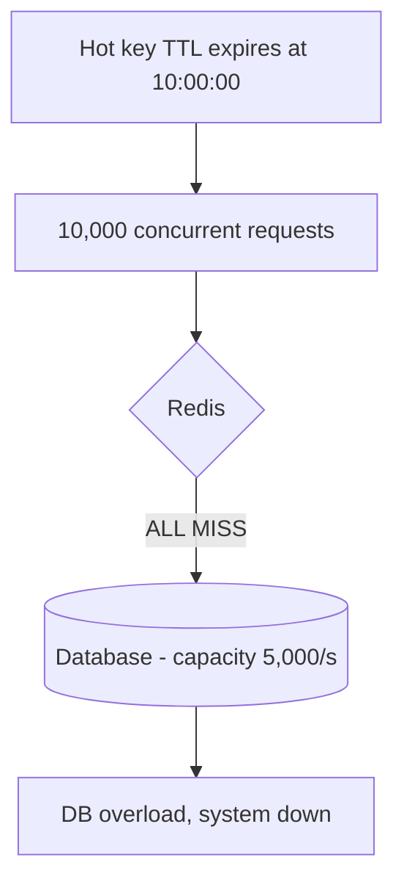

**Solutions:**

| Solution | How it works |
|---|---|
| **Request coalescing / single-flight** | Only the **first** request goes to the DB and rebuilds the cache; the rest **wait** for that result |
| **Distributed lock** | One process holds the lock and rebuilds; others block or serve stale |
| **Randomized TTL (jitter)** | Keys don't all expire together |
| **Cache warming / proactive refresh** ⭐ | Refresh the key **just before** it expires — e.g. re-populate at the **55 s** mark of a **60 s** TTL. The key then **never actually expires**, so there is never a moment where everyone misses. Equally as common in practice as single-flight |
| **Proactive / early rebuild** | Build version `v2` **before** `v1` expires (versioned keys) |
| **Serve stale-while-revalidate** | Return the old (or a default) value while the cache is being rebuilt in the background |

```mermaid
flowchart LR
    A["TTL = 60 s"] --> B["t=0 populate"]
    B --> C["t=55 s background refresh<br/>resets TTL to 60 s"]
    C --> C
    C --> D["Key never reaches expiry<br/>=> no simultaneous miss"]
```

```mermaid
flowchart TD
    A["10,000 requests miss"] --> B{Single-flight guard}
    B -- "1st request" --> C[("DB read, rebuild cache")]
    B -- "other 9,999" --> D["Wait / serve stale value"]
    C --> E[Cache populated]
    E --> D
    D --> F[All requests served, DB hit once]
```

> **Interview tip:** If the interviewer says *"now the cache is invalidated and 10,000 requests come in..."* — they are steering you into stampede. Say it out loud: *"I think you're leading me toward the cache stampede problem; here's how I'd solve it."* That answer gets you hired.

**How request coalescing is actually implemented** (be ready to describe the mechanism, not just the name):

| Scope | Mechanism |
|---|---|
| **Within one process** | A `Map<key, Promise>` of in-flight loads — concurrent callers for the same key **share the same promise/future**. Go calls this `singleflight`; Java uses `Caffeine`'s loading cache |
| **Across the cluster** | A **distributed lock**: `SET lock:<key> <token> NX EX 5`. The winner rebuilds; losers poll the key for a bounded window, then degrade to a direct read |
| **Correctness detail** ⭐ | **Re-check the cache after acquiring the lock.** Without it, every waiter rebuilds in turn once the holder releases — you convert a *simultaneous* herd into a *sequential* one |
| **Release safely** | Delete the lock with a **Lua compare-and-delete** so a slow holder can't release someone else's lock after its own lease expired |
| **HTTP layer equivalent** | Nginx `proxy_cache_lock`, Varnish request coalescing, `Cache-Control: stale-while-revalidate` |

📖 Full working implementation in [cache-aside-lld.md](cache-aside-lld.md) (Python / TypeScript / JavaScript).

---

### 13.2 Cache Penetration

**Problem:** An attacker repeatedly requests keys that **don't exist anywhere** — `userId=999999`, then another random ID, then another. Every request: cache miss → DB miss → 404. The cache **can never protect** the DB because the value is never cacheable.

```mermaid
flowchart TD
    A["Request userId 999999 - does not exist"] --> B{Cache}
    B -- MISS --> C[(Database)]
    C -- "NOT FOUND" --> D[404 returned]
    D --> E[Attacker sends another random ID]
    E --> A
    C --> F[DB load grows with zero cache benefit]
```

**Solutions:**

| Solution | How it works | Caveat |
|---|---|---|
| **Negative caching** | Cache the fact that a key **doesn't exist** (short TTL) | Storing 1 billion "doesn't exist" markers is impractical/expensive |
| **Bloom filter** ⭐ | Probabilistic membership check *before* touching cache/DB. This is how Gmail/Hotmail instantly tells you "this ID already exists" | Small false-positive rate, never false-negative |
| **Input validation** | Reject malformed IDs at the edge | — |
| **Rate limiting / throttling** | Per-IP, per-second limits on suspicious traffic | — |

#### Bloom Filter — how it actually works (be ready to explain this)

A **bit array of size `m`** plus **`k` independent hash functions**. It stores **no values** — only bits.

- **Add(x):** set the bits at positions `h₁(x) mod m … h_k(x) mod m` to 1.
- **MayContain(x):** if **any** of those `k` bits is 0 → **definitely absent**. If all are 1 → **probably present**.

```mermaid
flowchart LR
    K["key = user:999999"] --> H1["h1 -> bit 3"]
    K --> H2["h2 -> bit 11"]
    K --> H3["h3 -> bit 27"]
    H1 --> B{"Is ANY of those bits 0?"}
    H2 --> B
    H3 --> B
    B -- "Yes" --> N["DEFINITELY absent<br/>reject before touching cache or DB"]
    B -- "No" --> P["Probably present<br/>fall through to cache, then DB"]
```

| Property | Value |
|---|---|
| False **positives** | Possible — occasionally lets a non-existent key through. Harmless: it just falls through once |
| False **negatives** | **Impossible** — which is exactly what makes it safe as a gatekeeper |
| Deletion | **Not supported** — clearing a bit would corrupt other keys. Use a **counting Bloom filter** or rebuild periodically |
| Space | ≈ **10 bits/element** for a 1% false-positive rate → **1 billion IDs ≈ 1.2 GB**, versus hundreds of GB to negative-cache every ID |
| Optimal hash count | $k = \frac{m}{n}\ln 2$, giving $p \approx \left(1 - e^{-kn/m}\right)^{k}$ |

**Where it's used in the wild:** Gmail/Hotmail "this username is taken", Cassandra / HBase / LevelDB skipping SSTable reads, Chrome's malicious-URL check, Bitcoin SPV wallets. Redis exposes it via the **RedisBloom** module (`BF.ADD` / `BF.EXISTS`), or you can hand-roll it on a Redis bitmap with `SETBIT`/`GETBIT`.

> **Interview framing:** *"A Bloom filter trades a small false-positive rate for a massive space saving, and it never produces false negatives — so it can safely say 'this key does not exist' without ever wrongly rejecting a real key."*

#### Negative caching has a **second**, different job: caching downstream *errors*

> *Amazon Builders' Library.* Penetration is about keys that don't exist. This is about the downstream **failing to answer** — the fix looks similar, but the reasoning is different.

When the dependency returns an error you have two choices:

| Option | What it does |
|---|---|
| **Serve the last known-good value** | Via soft/hard TTL ([§9.5](#95-soft-ttl--hard-ttl--the-resilience-pattern-aws-actually-uses)) |
| **Cache the error response** | Store the failure as a negative entry with a **different (shorter) TTL** than positive entries, and propagate the error to the client |

Which you pick depends on whether it is better for *your* clients to see **stale data** or an **error**.

> 🚨 **But whichever you choose, make sure _something_ ends up in the cache on an error.** If nothing is cached, a temporarily unavailable downstream — or a resource that was deleted and will *never* resolve — means the upstream **keeps bombarding it with identical failing requests**, either causing an outage or making an existing one worse. Amazon has seen exactly this turn a blip into an incident, with increased failure rates and faults.

**Why the negative TTL must be shorter:** a missing row may legitimately appear a second later, and a downstream may recover in seconds. A 10-minute negative TTL would extend a 5-second outage into a 10-minute one.

> The video's practical verdict: **negative caching is usually not worth the cost** — you'd be paying every day to defend against an attack that happens rarely. Prefer **bloom filter + input validation + rate limiting**.
> 📚 *Designing a bloom filter* is itself a very frequent system-design interview problem.

---

### 13.3 Cache Avalanche

**Problem:** *Stampede is about ONE hot key. Avalanche is about MANY keys at once.* 1 billion keys all given exactly 1 hour TTL. One hour later, a huge fraction expire together → the app must rebuild a massive number of entries → DB traffic spikes, latency climbs, the whole system destabilises.

```mermaid
flowchart TD
    A["1B keys created together<br/>TTL = exactly 1 hour"] --> B[Mass simultaneous expiry]
    B --> C[Huge rebuild storm]
    C --> D[(DB traffic spike)]
    D --> E["Latency climbs, system unstable"]
```

**Solutions:**

| Solution | How it works |
|---|---|
| **TTL jitter** | Randomize expiry times |
| **Staggered refresh** | Refresh 1/10th of the keys at a time |
| **Versioning** | Build the next version before the current one dies |
| **Pre-warming** | Allocate more cache than needed (buffer) and rebuild proactively before expiry. When a **new Redis node** comes up, let it build its cache **first**, and only then start routing traffic to it |

> **Core idea:** never let your entire cache disappear at the same time, and never let your system try to rebuild the entire cache at the same time.

> ⚠️ **Verified correction — the most common mix-up in this whole topic.** "1,000 keys all expire at 1:00 AM, 100,000 requests arrive, the DB can only take 5,000 and falls over" is almost always described as a **cache stampede**. It is actually **cache avalanche**. Keep them straight:
>
> | | **Stampede / thundering herd** | **Avalanche** |
> |---|---|---|
> | Trigger | **ONE hot key** expires | **MANY keys** expire together |
> | Shape of the load | N concurrent requests rebuilding the **same** value | N different values all needing rebuild at once |
> | Primary fix | **Single-flight / distributed lock** (+ cache warming) | **TTL jitter** (+ staggered refresh, pre-warming) |
> | Does jitter help? | Only indirectly | **Yes — it is the fix** |
> | Does single-flight help? | **Yes — it is the fix** | Only per-key; it won't stop 1M distinct rebuilds |
>
> Many blog posts use "stampede" loosely for both. In an interview, **name which one you mean and pick the matching fix** — that distinction alone signals you actually understand the mechanism.

---

### 13.4 Hot Key (Celebrity Problem)

**Problem:** Ronaldo goes live. His profile key gets 1 million req/sec. Consistent hashing sends **all** of them to **one node** — that node dies while the rest of the cluster is idle.

**The other canonical example:** you're building Twitter/X and everyone loads **Taylor Swift's** profile. `user:taylorswift` takes millions of req/s and melts a single Redis node — even though the cache is "working as expected" and the overall hit rate looks great.

> **The lesson:** *Average load can look perfectly healthy while one single key is killing your system.*

> ⚠️ **This is the classic follow-up after you introduce a cache to scale reads.** Caching raises read throughput (memory instead of disk) — it does **not** make the system infinitely scalable. And it isn't cache-specific: databases have **hot rows and hot partitions** for exactly the same reason.

```mermaid
flowchart TD
    A["1M req/s for key celebrity:ronaldo"] --> B{"Hash to single node"}
    B --> N1[Node 1 - OVERLOADED]
    B -.-> N2[Node 2 - idle]
    B -.-> N3[Node 3 - idle]
```

**Solutions:**

| Solution | How it works |
|---|---|
| **Key splitting / replication** ⭐ | Store the hot value under N derived keys — `ronaldo:1`, `ronaldo:2` … `ronaldo:10` — one per node. Any node can serve the request |
| **Local (in-process) cache** | If you know a live session is scheduled, cache it in the app layer too |
| **Rate limiting** | Protect against abusive traffic |
| **Alerting / observability** | Page at 70–80% of node limits so you can react to an *unexpected* celebrity |

```mermaid
flowchart TD
    A[Request for hot key] --> B["Pick random suffix 1..10"]
    B --> K1["ronaldo:1 on Node 1"]
    B --> K2["ronaldo:2 on Node 2"]
    B --> K3["ronaldo:N on Node N"]
```

**Real-world example:** New iPhone launches on Amazon → millions query the same product. Amazon replicates that product's data across all nodes so no single node melts.

**Proactive vs reactive:** A planned launch → proactive replication. An overnight viral creator → reactive, driven by **observability metrics + alerts/pages**.

---

## 14. Distributed Caching: Sharding, Replication, Consistent Hashing

Two problems to solve when the cache outgrows one node:

| Problem | Question it answers |
|---|---|
| **Sharding** | *Which node should store my key?* |
| **Replication** | *What happens if my node dies?* |

### The naive approach and why it breaks

`node = hash(key) % number_of_nodes`

Add a 4th node → the modulo changes → **a huge portion of keys remap** → most of your cache goes **cold** at once.

```mermaid
flowchart LR
    subgraph Before["hash mod 3"]
        A1["key 1 to N1"]
        A2["key 2 to N2"]
        A3["key 4 to N1"]
    end
    subgraph After["hash mod 4 - node added"]
        B1["key 1 to N2 - moved"]
        B2["key 2 to N3 - moved"]
        B3["key 4 to N4 - moved"]
    end
    Before --> X["Massive remap - cache goes cold"]
```

### Consistent Hashing

Map both **nodes** and **keys** onto the same circular hash space (e.g. `0 … 2³²-1`). A key is owned by the **first node clockwise** from its own position.

```
ring position:  0 ------- 90 -------- 180 -------- 270 ------> wraps to 0
nodes:          A          B            C            D
keys:              15 -> B    120 -> C     200 -> D     300 -> A (wraps)
                   ^ owned by the first node clockwise

add node E at 135:
keys:              15 -> B    120 -> E     200 -> D     300 -> A
                              ^^^^^^^^ ONLY keys between 90 and 135 move.
                                       Everything else stays put.
```

| | `hash(key) % N` | Consistent hashing |
|---|---|---|
| Keys remapped when a node is added | ≈ **(N-1)/N** — almost everything | ≈ **1/N** — only $K/N$ keys |
| Cache goes cold on scale-out | Yes, catastrophically | Barely |
| Load balance | Perfectly even by construction | Uneven → fixed by **virtual nodes** |
| Node removal | Full reshuffle | Only that node's range moves |

**Virtual nodes (vnodes):** place each **physical** node at many points on the ring (typically 100–200 replicas) instead of one.

| Benefit | Why |
|---|---|
| **Even distribution** | One unlucky placement can no longer hand a node 50% of the ring |
| **Even failure redistribution** | When a node dies its keys spread across **all** survivors, not dumped on one neighbour |
| **Heterogeneous capacity** | A 2× bigger box simply gets 2× the vnodes |

> **One-line interview answer:** *"Consistent hashing minimizes key remapping when the caching topology changes — only K/N keys move instead of nearly all of them — and virtual nodes make the distribution even and failure-tolerant."*

⚠️ **Consistent hashing does NOT solve the hot key problem.** It balances *keys* across nodes, not *traffic*. One viral key still lands on one node — that needs key splitting (§13.4).

📚 A favourite standalone interview question (Salesforce, Indeed). Also used by DynamoDB, Cassandra, Riak, and for sticky/stateful server routing — not just caches.

### 14.1 Scaling a Distributed Cache in Practice

| Mechanism | What it gives you | What to say about it |
|---|---|---|
| **Redis Cluster** | Sharding **+** automatic failover, built in | **16,384 hash slots** spread over primaries; clients follow `MOVED`/`ASK` redirects. Multi-key commands must land in one slot → use **hash tags**: `user:{42}:cart` and `user:{42}:wishlist` co-locate |
| **Primary–replica replication** | Read scaling + redundancy | Replication is **asynchronous** → replicas can serve slightly stale data, and a failover can lose the most recent writes |
| **Redis Sentinel** | Automatic failover for non-clustered deployments | A quorum of sentinels promotes a replica and reconfigures clients |
| **Client-side sharding** | What **Memcached** does (no server-side cluster) | Simple and fast, but the client library owns the ring — every client must agree on it |
| **Proxy (Twemproxy, Envoy, mcrouter)** | Central routing, connection pooling, fan-out | Adds a hop; simplifies clients |
| **Vertical scaling** | Bigger box | Fastest fix, hard ceiling — and Redis command execution is single-threaded, so more cores help less than you'd hope |
| **Tiered / near cache** | L1 in-process + L2 Redis | Removes the network hop for the hottest keys; needs cluster-wide L1 invalidation |

**Scaling checklist to recite:**
1. **Shard** with consistent hashing + vnodes (or Redis Cluster slots).
2. **Replicate** each shard for HA and read scaling — and state that replication is async.
3. Handle the **hot key separately** — sharding alone cannot fix it.
4. **Pre-warm** a new node before routing traffic to it, or you cause an avalanche.
5. **Pipeline / `MGET`** to amortise RTT — batch, never loop.
6. Beware **cross-slot multi-key commands** — they fail in cluster mode.
7. Decide **cache topology independently of DB topology** — your Redis sharding strategy need not match your database's.

### 14.2 Operating an External Cache Fleet — the hazards nobody mentions

> *Amazon Builders' Library.* An external cache is **another fleet you now own**: to monitor, patch, scale and roll back. These are the failure modes that bite in production but rarely come up in study material.

#### ① The cache fleet's availability is *not* your service's availability

The cache fleet often has **worse** availability characteristics than the dependency it fronts — no zero-downtime upgrades, mandatory maintenance windows, different patch cadence. You must explicitly write code for **fleet unavailability, single-node failure, and `get`/`put` failures**, and decide what happens in each case (see the caveat in [§8.1.3](#813-advantages)).

#### ② Scaling the fleet without causing the outage you're trying to prevent

| Hazard | What to do |
|---|---|
| You don't know when you're near the limit | Find the **leading indicator** metric. On one AWS team, **Redis CPU utilisation** climbed sharply as request rate approached its ceiling — so CPU became the alarm, not request count |
| You can't guess the ceiling | **Load test with realistic traffic patterns** to find the actual limit, then set the alarm threshold below it |
| Some cache servers **can't add nodes without downtime** | Verify this for your specific technology *before* you need to scale |
| **Not all client libraries implement consistent hashing** ⚠️ | Without it, adding a node **remaps almost every key** and dumps a cold cache on your database. Consistent hashing is a **client-library** property, not something Redis gives you for free |
| Node discovery varies wildly between clients | **Thoroughly test adding and removing cache servers before production** |

#### ③ Serialization format evolution — treat the cache like a persistent store ⭐⭐

This is the most under-appreciated point in the whole article.

> **Cached data must be treated as if it were in a persistent store.** During a rolling deploy your fleet runs **old and new code simultaneously**, both reading and writing the same cache.

| Requirement | Why |
|---|---|
| **New code must read data written by old code** | Otherwise the first pod to upgrade can't use anything already cached |
| **Old code must gracefully handle new formats/fields** | During the rollout, un-upgraded pods will encounter values the new pods wrote |
| **Never throw an uncaught exception on an unexpected format** | That is a **poison pill** — one bad entry crashes every request that touches it, repeatedly |
| **Beware the "just discard mismatched versions" reflex** ⚠️ | Detecting a version mismatch and dropping the entry sounds safe, but doing it fleet-wide triggers a **mass cache refresh** → downstream throttling or brownout. You've traded a format bug for an avalanche |

**Practical design:** put an explicit **version number inside the serialized object** (not only in the key), and write deserialization code that can read every version still in flight. Additive, optional fields; never repurpose an existing field.

#### ④ Caches have no transactions

Cache entries are updated by **individual nodes across your fleet**, and caches typically offer **no conditional puts and no transactions**. There is nothing stopping two nodes from writing conflicting values. Your update code must be written so it **can never leave the cache in an invalid or inconsistent state** — prefer whole-value replacement over multi-step mutation, and use `SET … NX` / Lua / `WATCH` when you genuinely need atomicity ([§15.1](#151-redis-deep-dive)).

---

## 15. Redis, Memcached & CDN — Choosing the Right Cache

### 15.1 Redis Deep Dive

Redis is the default distributed cache because it is an in-memory **data-structure server**, not just a key-value blob store.

| Structure | Commands | Caching use case |
|---|---|---|
| **String** | `GET` / `SET` / `SETEX` / `INCR` | Serialized objects, counters, rendered HTML fragments |
| **Hash** | `HGET` / `HSET` / `HGETALL` | An object whose fields update independently — avoids read-modify-write of a whole blob |
| **List** | `LPUSH` / `LRANGE` | Recent-items feeds, simple queues |
| **Set** | `SADD` / `SISMEMBER` | Tags, dedup, "has this user seen it" |
| **Sorted Set (ZSET)** | `ZADD` / `ZRANGE` / `ZRANGEBYSCORE` | **Leaderboards**, time-ordered feeds, sliding-window rate limiting |
| **Bitmap / HyperLogLog** | `SETBIT` / `PFADD` `PFCOUNT` | Daily-active flags; **cardinality** estimates in ~12 KB regardless of size |
| **Stream** | `XADD` / `XREAD` | Event log with consumer groups |
| **Geo** | `GEOADD` / `GEOSEARCH` | "Restaurants near me" |

**Execution model:** command execution is **single-threaded** (I/O threading exists in 6+, but *your command* still runs atomically on one thread).

- ✅ No locks, no races → `INCR`, `SETNX` and Lua scripts are **atomic for free**.
- ❌ **One slow command blocks everything.** Never run `KEYS *`, an unbounded `SMEMBERS`, or a huge `ZRANGE` in production — use `SCAN` and bound your ranges. This is also *why* **big keys** are so dangerous.

**Atomicity primitives to name-drop:**
- `SET key val NX EX 30` → distributed lock acquire — the basis of **single-flight** (see [cache-aside-lld.md](cache-aside-lld.md)).
- **Lua (`EVAL`)** → multi-step read-modify-write executed atomically: compare-and-delete lock release, token-bucket rate limiter.
- `MULTI`/`EXEC` + `WATCH` → optimistic concurrency.

**Persistence** — for a *cache* this is about **warm restart**, not durability:

| Mode | Behaviour |
|---|---|
| **RDB** | Fork + point-in-time snapshot. Fast restart; can lose minutes of writes |
| **AOF** | Append-only command log — `everysec` (default) / `always` / `no` |
| **RDB + AOF** | Common production setup |
| **None** | Fine for a pure cache — but a restart then means a **cold start** stampede |

**Other levers:** pipelining and `MGET`/`MSET` to amortise RTT, connection pooling, client-side caching (RESP3 tracking = near cache), and `maxmemory-policy` (see [§10.1](#101-managing-memory-constraints--capacity-planning)).

### 15.2 Redis vs Memcached

| | **Redis** | **Memcached** |
|---|---|---|
| Data types | Strings, hashes, lists, sets, sorted sets, streams, bitmaps, HLL, geo | **Strings only** |
| Threading | Command execution single-threaded | **Multi-threaded** — scales better vertically on big boxes |
| Persistence | RDB + AOF | None (purely volatile) |
| Replication / failover | Built in (Cluster, Sentinel) | None — **client-side sharding** |
| Atomic ops, Lua, pub/sub, transactions | Yes | No |
| Eviction | Configurable `maxmemory-policy` | LRU only, slab allocator |
| Memory efficiency for plain KV | Slightly more per-key overhead | Very lean; slabs limit fragmentation |
| Best for | Anything richer than "get/set a blob" | Huge, simple, volatile, string-only cache at very high throughput |

> **Interview answer:** *"Redis by default. Memcached only when I specifically want its multi-threaded simplicity for a very large, purely volatile, string-only cache. The moment I need sorted sets, atomic counters, persistence or built-in failover, Memcached is out."*

### 15.3 CDN vs Redis — they are NOT the same thing

> A CDN is **not** just a faster Redis. They solve **different problems**.

| | **CDN** (Cloudflare, Akamai, CloudFront) | **Redis / Memcached** |
|---|---|---|
| Purpose | Content delivery, geographically close to users | Application-level distributed cache |
| Stores | Images, video, JS, CSS — any static/cacheable HTTP content | Sessions, product objects, computed results, recommendations, user metadata, config |
| Placement | Global edge PoPs | Inside your data centre / VPC |
| Billing | Based on how many/how close the edge nodes are | Instance/memory based (generally **more expensive** per GB) |

**Real systems use both.** A single page load:
- **CDN** serves the images/thumbnails/JS
- **Redis** serves the application-level data
- **Database / S3** remains the **source of truth**

> **Quick rule to recall in an interview:** multimedia + CSS/JS → **CDN**. Configuration + application data → **Redis**.

---

## 16. Cache Observability

You cannot say "I deployed Redis, done." You must prove the cache is **helping**.

| Metric | Why |
|---|---|
| **Hit ratio** = hits / (hits + misses) | The headline number |
| **Cache latency: P50 / P95 / P99** | Averages hide the tail |
| **Memory usage** | Are we close to full? |
| **Eviction rate** | High evictions ⇒ cache too small |
| **Hot key detection** | Uneven node load |
| **Invalidation lag** | How stale are we really? |
| **Backend/DB load during misses** ⭐ | The one people forget |

### 🎯 The 99% Hit Ratio Trap

> *"My cache has a 99% hit ratio. Is my system healthy?"*
> **Answer: NO.**

That remaining **1%** can be exactly the stampede/hot-key traffic that takes the database down. You are not optimizing a *cache* metric — you are optimizing **overall system health**.

**Never look at cache metrics in isolation.** Correlate the cache graphs with DB load, service latency, and error rates.

### 16.1 What to Actually Alert On

| Signal | Healthy | Alert when | Likely cause |
|---|---|---|---|
| **Hit ratio** | 80–95%+ | drops >10 points vs baseline | TTL too short, key churn, cold start, bad key design |
| **Eviction rate** | ≈ 0 for a properly sized cache | sustained non-zero **and** hit ratio falling | Working set > memory |
| **`used_memory` / `maxmemory`** | < 75% | > 85% | Under-provisioned → scale or shard |
| **Cache P99 latency** | < 5 ms in-DC | > 20 ms | Big keys, slow command, NIC saturation, CPU |
| **Backend QPS during misses** ⭐ | flat | spikes correlated with key expiry | **Stampede / avalanche** |
| **Per-node QPS skew** | even across shards | one node ≫ the rest | **Hot key** |
| **Connection errors / timeouts** | 0 | any sustained | Pool exhaustion, failover in progress |
| **Invalidation lag** (Kafka consumer lag) | < TTL | growing | Stale reads accumulating |
| **Slowlog entries** | 0 | any | `KEYS`, big-key reads, unbounded ranges |

**Formulas worth quoting in an interview:**

- **Effective read latency:** $L = h \cdot L_{cache} + (1-h)\,(L_{cache} + L_{db})$
  With $h = 0.95$, $L_{cache} = 1\,\text{ms}$, $L_{db} = 50\,\text{ms}$ → $L \approx 3.5\,\text{ms}$.
- **Backend load remaining:** $(1-h)$.
  95% → the DB sees **5%** of reads. Going 95% → 99% **halves the DB load again** — which is why the last few points are worth chasing.

**Instrument three layers, always together:**

| Layer | Metrics |
|---|---|
| **Client** | hits, misses, cache-call latency, timeouts, serialization cost |
| **Cache server** | memory, RSS/fragmentation, evictions, expired keys, keyspace size, per-node QPS, slowlog, replication lag |
| **Backend** | QPS, P99, connection pool saturation, error rate |

Reading any one of these in isolation is precisely the mistake the 99%-hit-ratio trap punishes.

### 16.2 Cache Security — three risks to name

> *Amazon Builders' Library.* Adding a cache adds an attack surface. These are rarely raised in interviews, which is exactly why raising them lands.

| Risk | What it is | Mitigation |
|---|---|---|
| **① Unencrypted data & transport** | External cache fleets **often lack encryption** for serialized data and for the connection. Critical if any user data is cached | **Encryption in transit and at rest** (e.g. ElastiCache for Redis supports both). Better still: **don't cache sensitive data at all** — see [§5](#5-what-should-you-cache) |
| **② Cache poisoning** | A vulnerability in the **downstream protocol** lets an attacker get a value **of their choosing** written into the cache. The impact is **amplified**: every request served while that value is cached sees the malicious content | Validate and canonicalise responses before caching; make the cache key include everything that varies the response (`Vary`); never let unvalidated request headers influence a shared cache key ([§6.1](#61-browser--http-caching--the-headers-interviewers-ask-about)) |
| **③ Side-channel timing attacks** ⭐ | **Cached values return faster than uncached ones.** An attacker can measure response time to learn **what other clients or tenants have been requesting** — a genuine cross-tenant information leak | Namespace keys per tenant; add constant-time padding on sensitive endpoints; don't share a cache across trust boundaries for sensitive lookups |

**Two more from the rest of this file, worth restating here:**

| Risk | Mitigation |
|---|---|
| **Insecure deserialization** — cache contents are untrusted input | JSON only; never `pickle` / `eval` / `unserialize` ([cache-aside-lld.md](cache-aside-lld.md)) |
| **Serving user A's response to user B** via a CDN | `Cache-Control: private` on every per-user response ([§6.1](#61-browser--http-caching--the-headers-interviewers-ask-about)) |

---

## 17. Case Study — YouTube Home Feed

> **Problem:** User opens the app. Serve a **personalized** feed in **< 200 ms**.

### Q1. What do we cache?

| Item | Why |
|---|---|
| Previously computed **recommendations** | ML pipeline output — very expensive to compute |
| **Trending content per geography** | Compute-heavy; shared by many users. (Cache the *trending content*, not the geography itself — geography isn't expensive to compute) |
| **Subscription latest posts** | Per-user, reused across requests |
| **Video metadata** | Titles, durations, channel info |
| **Thumbnails** ⭐ | Few KB each; the feed renders instantly with no spinner → definitely cached (CDN) |

### Q2. What is the cache key?

Never the user's email. Internally everything maps to a **UUID** (32-char user ID).

```
{uuid}:{version}:homefeed
{uuid}:{version}:profile
```

The `version` segment lets you invalidate everything for a user by bumping it.

### Q3. Shared vs personalized data

A single video appears in **millions** of feeds. Do **not** store the full object per user.

```mermaid
flowchart TD
    A["user123:v1:homefeed"] --> B["List of video IDs:<br/>vid_9, vid_4, vid_77"]
    C["user456:v1:homefeed"] --> D["List of video IDs:<br/>vid_9, vid_12"]
    B --> E[("video:vid_9 - full metadata<br/>stored ONCE, shared")]
    D --> E
```

- **Personalized data** → store as-is per user
- **Shared data** → store **once**, keep only a **reference/ID** in the personalized entry

### Q4. What TTL?

Depends on the **user's usage pattern** *and* the **nature of the content**. Frequently-changing metadata → short TTL. Stable metadata → long TTL.

### Q5. A creator publishes a new video — how does it reach relevant feeds?

**Event-driven approach** (notifications are the user-facing symptom; **events** are the backend mechanism).

```mermaid
flowchart LR
    P[Publishing service] --> E[[Event / Kafka]]
    E --> F["Feed / recommendation service"]
    F --> I[Invalidate affected feed keys]
    I --> R[Refresh cache with new feed]
```

📚 Read up on **fan-out** (fan-out-on-write vs fan-out-on-read) — used by Twitter and most social platforms.

### Q6. What if Redis itself goes down?

**Do NOT send every request to the database.**

```mermaid
flowchart TD
    A[Redis is down] --> B{Circuit breaker}
    B -- "let 1 request through" --> C[(DB rebuild)]
    B -- "hold the rest" --> D["Queue / wait"]
    C --> E[Cache rebuilt]
    E --> D
    A --> F[Serve stale previous version]
    A --> G[Serve default value]
    A --> H[Fall back to pre-computed feed]
    A --> I[Rate-limit the database]
```

| Fallback | Description |
|---|---|
| **Circuit breaker** | Intercept the first request, hold the flood, release only after the cache is rebuilt (like an electrical fuse) |
| **Serve stale** | Return the previous version |
| **Serve default** | Return a generic/non-personalized feed |
| **Pre-computed fallback feed** | A generic trending feed as a safety net |
| **Rate-limit the DB** | Protect the source of truth |

> This is exactly why **"caching is not just adding a Redis layer."** You must design what happens when it **works**, when it **misses**, and when it **completely fails**.

---

## 18. The 7-Question Caching Design Framework ⭐

When a caching question appears in an HLD interview, **do not draw a Redis box.** Ask these seven questions:

```mermaid
flowchart TD
    Q1["1. What exactly are we caching?"] --> Q2["2. Where should the cache live?<br/>browser / CDN / local / distributed"]
    Q2 --> Q3["3. Which caching pattern?<br/>cache-aside / read-through / write-through / write-behind / write-around"]
    Q3 --> Q4["4. How fresh must the data be?<br/>determines TTL + invalidation"]
    Q4 --> Q5["5. What happens when the cache fails?<br/>stampede / penetration / avalanche / hot key"]
    Q5 --> Q6["6. How do we scale the cache?<br/>sharding / replication / consistent hashing"]
    Q6 --> Q7["7. What do we measure?<br/>hit ratio, P95/P99, evictions, memory, backend load"]
```

### 18.1 How to Actually Talk About Caching in the Interview

> Source: Hello Interview (ex-Meta staff engineer). This is the *delivery* layer — the difference between knowing caching and being scored well on it.

#### ① When to bring it up

> 🚩 **Never add a cache "because systems have caches."** Candidates routinely drop a Redis box with no justification. An unjustified cache is a **red flag even when it happens to be the right call**.

Four legitimate triggers — and you should **quantify** whichever one you use:

| Trigger | What to actually say |
|---|---|
| **Read-heavy workload straining the DB** | *"100 M DAU × 20 reads/day ≈ **2 billion reads/day** ≈ 23 k reads/sec — more than our database can serve. I'll put a cache in front to take that read load off it."* |
| **Expensive queries** | *"Computing a personalised newsfeed joins posts, followers and likes across several tables — far too expensive per request. I'll compute it once, cache it with a 60-second TTL, and serve it from Redis."* |
| **Latency requirement** (from your non-functional requirements) | *"We committed to a 100 ms response on this endpoint; that query alone is well over budget at the database, so it has to be served from cache."* |
| **High database CPU** | The real-world trigger. You won't have this metric in an interview — but naming it shows production instinct. |

**The pattern never changes:** **identify the bottleneck → quantify it with rough numbers → explain how caching removes it.**

#### ② The 5-step script for introducing it

```mermaid
flowchart TD
    S1["1. Identify the bottleneck<br/>with a number attached"] --> S2["2. Decide WHAT to cache<br/>+ the exact KEY and VALUE"]
    S2 --> S3["3. Choose the architecture<br/>cache-aside by default"]
    S3 --> S4["4. State the eviction policy<br/>LRU / LFU / TTL, with a reason"]
    S4 --> S5["5. Address the downsides<br/>relevant to THIS system"]
```

| Step | What to say |
|---|---|
| **1. Bottleneck** | *"Reads on the profile endpoint are what's straining the DB — roughly 23 k/sec."* |
| **2. What to cache (+ key and value)** ⭐ | *"I'll cache the user profile object under `user:{uuid}:v1:profile`, value = the serialized profile JSON."* |
| **3. Architecture** | *"Cache-aside on read: check Redis first, return on hit; on a miss query the DB, store the result in Redis, return it."* |
| **4. Eviction policy** | *"LRU, plus a 5-minute TTL — profiles change rarely and a few minutes of staleness is acceptable."* |
| **5. Downsides** | *"The risks here are consistency after a profile update, and a hot key if a celebrity profile trends. I'd invalidate on write for the first, and replicate the hot key for the second."* |

> **Step 2 is where most candidates lose points.** Saying "I'll add a cache here" invites the follow-up *"Cache what? What's your cache key? What's in the value?"* — especially in junior/mid-level interviews. **Answer it before you're asked.**

> For step 5, **don't recite every failure mode** — pick the ones that are actually relevant to *your* design. "Do I have a TTL on a popular key? Is stale data a problem for this data type? Do I have a plausible hot key?"

#### ③ Where in the interview it belongs

Caching almost always surfaces in the **deep dives**, triggered by **scale or latency** in your non-functional requirements — not in the initial high-level design.

| Weak | Strong |
|---|---|
| "I'll add Redis here." | "Reads are our bottleneck at ~23 k/sec, so I'll add a Redis cache-aside layer on the profile read path." |
| "We'll cache the user data." | "Key `user:{uuid}:v1:profile`, value = profile JSON, LRU + 5-minute TTL." |
| "Caching solves this." | "This gets us to a ~95% hit ratio, so the DB only sees ~5% of reads — but it introduces a stale window I need to talk about." |
| "I'll use write-behind for speed." | "Cache-aside is enough here; write-behind would add data-loss risk I can't justify." |

---

## 19. Rapid Fire — Interview Answers

| Question | Answer |
|---|---|
| **Redis vs Memcached?** | Depends on the use case — compare **data structures**, **persistence**, **operational requirements**, **workload**, **staleness tolerance**. Never answer "distributed vs application cache" by size alone. |
| **Distributed cache or application cache?** | Same reasoning: features, data structures, persistence, ops burden, workload, staleness. |
| **Why not cache everything?** | Memory is limited; data goes stale; caching adds invalidation + operational complexity; some data (financial) needs strict consistency. |
| **LRU or LFU?** | LRU = **recency**. LFU = **frequency/popularity**. Depends on the access pattern. |
| **How to invalidate across 100 app instances?** | Event-driven: pub/sub, Kafka, ZooKeeper watches, or a shared cache with coordinated invalidation. |
| **What is cache stampede?** | One hot key expires → thousands of simultaneous misses → DB overload. Fix with single-flight, locks, jitter, early rebuild, stale-while-revalidate. |
| **Stampede vs Avalanche vs Penetration?** | Stampede = **one hot key** expires. Avalanche = **many keys** expire together. Penetration = keys that **don't exist anywhere**. |
| **How do you handle a hot key?** | Key splitting/replication across nodes, local cache, rate limiting, alerting. |
| **Why consistent hashing?** | It minimizes key remapping when the caching topology changes. |
| **Which caching metrics do you monitor?** | Hit/miss ratio, P50/P95/P99 latency, memory, eviction rate, invalidation lag, **and correlated backend/system load**. |
| **Is a 99% hit ratio good?** | Not necessarily — the remaining 1% can still take the DB down. Optimize system health, not the cache metric. |
| **When should you bring caching up?** | When you can point at a bottleneck: read-heavy load straining the DB, an expensive query, a latency SLO, or high DB CPU. **Quantify it first** — an unjustified cache is a red flag. |
| **What's the dual-write problem?** | In write-through, cache and DB are two systems with no shared transaction. If one write succeeds and the other fails, they diverge — requiring retries and error handling that are hard to get right in a distributed system. |
| **Do I need to remember the pattern names?** | No. Interviewers score the **behaviour description**, not the vocabulary: *"check the cache, on a miss read the DB and populate the cache"* is a complete answer. |
| **How do you avoid a stampede without locks?** | **Cache warming** — proactively refresh a hot key just before its TTL expires (e.g. at 55 s of a 60 s TTL), so it never actually expires. |
| **What happens if your cache disappears entirely?** ⭐ | The dangerous answer is "we fall back to the DB." At scale that turns a cache outage into a **database** outage, because the DB was scaled down once the cache existed. Real answer: in-memory fallback, load shedding / rate cap to the downstream, serve stale via hard TTL — and **load-test with the cache disabled** to prove it. |
| **What is cache modal behaviour?** | A cache gives the system two modes (hit / miss) with wildly different costs. You size capacity for the observed *distribution*. An unanticipated shift in that distribution — a cold cache — is the outage. |
| **Inline vs side cache?** | Inline (read/write-through: DAX, Varnish, CDN) hides caching behind the data API — uniform client API, but the cache **joins the availability equation** and the client cannot compensate. Side (cache-aside: Redis/Memcached) is explicit in app code but **degrades gracefully**. |
| **What is a soft TTL / hard TTL?** | Two expiries per entry: refresh at the **soft** TTL, but if the refresh fails keep serving the existing value until the **hard** TTL. Turns a cache into an availability mechanism. Used by the AWS IAM client. |
| **Why is a cache like a persistent store?** | During a rolling deploy old and new code share it. New code must read old formats, old code must tolerate new fields, and an unexpected format must never throw — that's a **poison pill**. Discarding mismatched entries fleet-wide causes a mass refresh (avalanche). |
| **What security risks does a cache add?** | Unencrypted data/transport on the cache fleet, **cache poisoning** (one malicious value served to everyone), and **timing side channels** (cache hits are faster, leaking what other tenants requested). |

---

## 20. Key Takeaways — the 5 questions to always ask

1. **What exactly are we caching?**
2. **Why is caching worth the complexity?**
3. **How fresh does the data need to be?**
4. **What happens when the cache misses or fails?**
5. **How will we scale and observe it?**

> **If you remember only one thing:** don't memorize caching patterns — understand the **trade-offs**.
> In an HLD interview, anyone can draw boxes. The real skill is explaining **why that box fits**, **what it contains**, and **what happens when it is empty, overwhelmed, or completely down.**

---

## 21. Discussion Log — Tarang × Mahesh

> Sessions of **13 Aug 2026** and **18 Aug 2026**. Discussed in Hindi/English; translated and **fact-checked** below. Points already covered elsewhere in this file are cross-linked rather than repeated.

### 21.1 The progressive-optimisation walkthrough (the best narrative in the discussion)

Same feature — a **worklist page** backed by experiment folders on disk — optimised one layer at a time. This is exactly how to narrate a caching design in an interview: *start with the naive version and add a layer only when you can name the cost it removes.*

| Level | Implementation | Cost per request | What the next layer removes |
|---|---|---|---|
| **0** | Scan the whole file system on every API call, extract experiment details, return them | **~30 s** | Repeated disk traversal |
| **1** | Scan once; store **only the required fields** in a database. API reads the DB | **~1 s** | Full-filesystem scans |
| **2** | Add an **in-memory cache layer between the app and the DB**. Same params + TTL not expired → serve from memory | **sub-ms** | Repeated DB round trips |
| **3** | Add a **browser-side cache**. Navigating away and back doesn't call the server at all | **0 ms — no network** | The network hop itself |

**Two design decisions embedded in that table:**
- Level 1 stores a **projection** (only the fields the UI needs), not whole files. Caching a smaller shape is itself an optimisation.
- Level 2's condition is *"same parameters **and** TTL not expired"* — both, not either. See [§9.2](#92-ttl-alone-is-not-enough--the-key-must-carry-every-input).

### 21.2 Why cache in the browser when the server already caches?

Because the two layers remove **different costs**:

| Layer | Removes |
|---|---|
| Server-side cache | The **database** round trip (~1 s → sub-ms) |
| Browser-side cache | The **network** round trip entirely |

This looks pointless on a single-box on-prem deployment where client and server are metres apart. It becomes decisive the moment you **move to the cloud**: the browser is on the user's laptop and the server is in another region, so every avoided call saves a full internet round trip — see the numbers in [§4](#4-latency-hierarchy-relative-not-absolute).

> **Corollary:** do **not** build all three layers by default. On a single-box app the complexity isn't justified. Add a layer when you can point at the cost it removes.

### 21.3 Why video buffers — and where it's actually cached

Netflix/Prime buffering happens because pulling the stream from the origin takes time. Two distinct mechanisms are at work, and interviewers notice if you merge them:

| Mechanism | What it is |
|---|---|
| **CDN edge caching** | The video segments are cached on edge servers geographically near the user — one layer *above* the origin servers. This is the server-side fix |
| **Client-side buffering** | The player **prefetches the next N seconds** into local memory so playback survives jitter. This is a client-side read-ahead, not a CDN feature |

Both reduce perceived latency; only the first is "caching" in the sense this document uses.

### 21.4 Who owns the cache?

| Role | Responsibility |
|---|---|
| **Backend / service developers** | Primary owners. They know *what* needs caching, because they own the slow service. Deciding **whether to cache, what to cache, and whether it's actually helping** is a development decision |
| **SRE / platform engineers** | Provisioning, capacity, failover, cluster health |

> Mahesh's sharpest point: **monitoring whether the cache is genuinely useful is the biggest job**, not adding it. That is [§16](#16-cache-observability) — and it is why "I added Redis" is never a finished answer.

### 21.5 Open question worth researching

**How does Google Docs stay consistent for live multi-user editing across continents?** Fifty people in Mumbai, New York and Kanpur editing one document, everyone seeing everyone's keystrokes near-instantly. Caching alone cannot deliver that — it needs **operational transformation / CRDTs, multi-region replication, and a real-time transport (WebSockets)**, with caching playing only a supporting role. Worth reading separately; don't try to answer it with cache patterns.

### 21.6 Verification pass — what was correct, and the two corrections

| # | What was said | Verdict |
|---|---|---|
| 1 | Cache expensive computations (5 s summarisation) even if not frequently accessed | ✅ **Correct** — frequency and compute cost are independent axes. Added to [§5](#5-what-should-you-cache) |
| 2 | Don't cache if the origin is already fast/near, if access is rare, or if data changes constantly | ✅ **Correct.** Added to [§5](#5-what-should-you-cache) |
| 3 | Deciding *when to invalidate* is harder than choosing the caching strategy | ✅ **Correct** — the canonical "two hard problems" point. [§11](#11-cache-invalidation--the-most-annoying-part-of-caching) |
| 4 | Browser options: localStorage, sessionStorage, cookies, in-memory | ✅ **Correct** (IndexedDB and the Cache API complete the list). [§6.2](#62-browser-storage-apis--where-the-data-physically-goes) |
| 5 | localStorage survives tab close/reopen; sessionStorage does not | ✅ **Correct** |
| 6 | sessionStorage ≈ "login session" | ⚠️ **Imprecise.** `sessionStorage` is scoped to the **browser tab**, not to a login. Two tabs = two copies. For "reset on re-login", clear keys explicitly on logout. Corrected in [§6.2](#62-browser-storage-apis--where-the-data-physically-goes) |
| 7 | Store an **absolute expiry timestamp** at write time and compare on read, rather than polling every N minutes | ✅ **Correct — and the better implementation.** Promoted to [§9.1](#91-how-to-actually-implement-a-ttl--absolute-expiry-checked-lazily) |
| 8 | TTL alone is insufficient — also refetch when the request parameters change | ✅ **Correct.** This is cache-key design. [§9.2](#92-ttl-alone-is-not-enough--the-key-must-carry-every-input) |
| 9 | A separate `refresh` endpoint that bypasses the cache | ✅ **Correct and a real pattern.** [§9.4](#94-the-explicit-refresh--cache-bypass-endpoint) |
| 10 | Cache-aside applies to in-process caches too, not just external ones | ✅ **Correct** — pattern and placement are orthogonal. Added to [§8](#8-caching-patterns-read--write) |
| 11 | Redis is used as an in-memory cache but is itself a server | ✅ **Correct.** "In-memory" describes where *Redis* stores data, not that it runs inside your process |
| 12 | In-process cache + 100 servers → each server misses and populates separately | ✅ **Correct.** Quantified in [§7](#7-local-cache-vs-distributed-cache) |
| 13 | In-process cache is lost on restart and must be repopulated | ✅ **Correct** — this is cold start |
| 14 | Cache-aside makes app and cache **tightly coupled**; read-through decouples them | ✅ **Correct.** Added to [§8.2](#82-read-through) |
| 15 | Read-through in-process needs a separate service, which defeats the purpose | ✅ **Correct** |
| 16 | You detect over-capacity via 500s/timeouts, error floods in logs, and user complaints | ✅ **Correct.** Added to [§2](#2-the-starting-problem) |
| 17 | "5,000 request capacity" = 5,001 gets rejected while the first 5,000 are in flight | ✅ **Correct** — it's about concurrency and completion rate, not a lifetime counter. Added to [§2](#2-the-starting-problem) |
| 18 | Banking: reads via read-through, **writes must use write-through**, else a stale balance allows overdraft | ✅ **Correct pattern answer.** Refinement added: real banks typically **don't cache the balance at all** and cache profile data instead. [§8.7](#87-choosing-a-pattern--decision-matrix) |
| 19 | Amazon seller price update → write-through for the seller, read-through for buyers | ✅ **Correct** |
| 20 | Write-behind fits bank address updates ("2 days"), PF balance, blogs/news | ✅ **Correct** — and the insight that it works because **the product already set the expectation** is a genuinely good framing. Added to [§8.4](#84-write-behind--write-back) |
| 21 | NEFT uses write-behind | ❌ **Corrected.** NEFT is a **batch settlement system** (half-hourly RBI batches, 24×7), not a cache write policy. RTGS is real-time for ≥ ₹2 lakh; IMPS/UPI are instant. The async-and-deferred *shape* is analogous — say "batching", not "write-behind". [§8.4](#84-write-behind--write-back) |
| 22 | 1,000 keys expiring together + 100,000 requests = **cache stampede**, fixed by jitter | ⚠️ **Corrected.** Many keys expiring together is **cache avalanche**; stampede is **one hot key**. Jitter is the avalanche fix; single-flight is the stampede fix. Both were being described under one name. Comparison table added to [§13.3](#133-cache-avalanche) |
| 23 | Video/Netflix buffering is solved by caching one level above the servers, in the CDN | ✅ **Correct**, with the nuance in [§21.3](#213-why-video-buffers--and-where-its-actually-cached) that client buffering is a separate mechanism |
| 24 | For a single-box app, three cache layers are unnecessary complexity | ✅ **Correct** — YAGNI |

---

## 22. Worked Examples — one for every technique in this file

> Every technique above, with a concrete scenario and numbers. Use these to make an answer specific instead of generic.

### 22.1 Cache placements

| Technique | Worked example |
|---|---|
| **Browser cache** | An e-commerce SPA stores the logged-in user's profile (`name`, `avatarUrl`, `theme`) in `localStorage`. Page reload → header renders in **0 ms** with no API call. On logout the key is deleted. |
| **CDN** | A user in **Sydney** requests `product-hero.jpg`. Origin is **S3 in us-east-1**. Direct: **~320 ms**. Via a Sydney edge PoP: **~25 ms** on a hit; on a miss the edge fetches once from S3 and every subsequent Sydney user gets 25 ms. |
| **App in-process cache** | Feature flags (~200 booleans, ~8 KB) refreshed every 60 s into a `Map` at process start. Every request reads them **without a network call**; a config service outage doesn't break request handling. |
| **Distributed cache (Redis)** | 40 API pods share one Redis. Pod 12 caches `product:88` → pods 1–40 all hit it immediately. Without it, the first request to each of 40 pods would miss (see [§7](#7-local-cache-vs-distributed-cache)). |
| **DB buffer pool** | Postgres holds the hot pages of `orders` in `shared_buffers`. A repeated `WHERE id = 42` never touches disk. **You cannot configure this from the app** — it's why a "slow" query can suddenly be fast the second time. |

### 22.2 HTTP caching headers

| Header | Worked example |
|---|---|
| `max-age=31536000, immutable` | `app.9f3c1a.js` — fingerprinted bundle. Cached for a year, never revalidated. A deploy produces `app.7b2d40.js`, a **new URL**, so no purge is ever needed. |
| `no-store` | `GET /api/account/statement` — must never be written to disk cache or a CDN. |
| `no-cache` | `GET /api/feature-flags` — may be stored, but the browser must revalidate every time. Response is usually a **304** (~200 bytes) instead of the full payload. |
| `s-maxage=600` + `max-age=60` | A public blog post: browsers revalidate after 60 s, but the **CDN** holds it for 10 minutes, so the origin sees ~6 requests/hour regardless of traffic. |
| `stale-while-revalidate=60` | Homepage feed with `max-age=30, stale-while-revalidate=60`. At t=45 s the user gets the stale copy **instantly** while the CDN refreshes in the background — an HTTP-native stampede fix. |
| `ETag` + `If-None-Match` | `GET /api/worklist` returns `ETag: "a1b2"`. Next call sends `If-None-Match: "a1b2"`; nothing changed → **304, no body**. A 400 KB response becomes ~300 bytes. |
| `Last-Modified` | Same idea with `If-Modified-Since: Wed, 13 Aug 2026 15:00:00 GMT`. Weaker — 1-second granularity, so two edits in the same second are missed. |
| `Vary: Accept-Encoding, Accept-Language` | The CDN keeps separate entries for gzip vs brotli and `en` vs `fr`. Omit `Accept-Language` and a French user gets the English page. |
| `Cache-Control: private` | `GET /api/me` — the browser may cache it, the CDN **must not**. Omitting this is how one user's profile gets served to another. |

### 22.3 Browser storage APIs

| Technique | Worked example |
|---|---|
| **In-memory `Map`** | Angular/React service holds `worklist$`. User goes Worklist → Detail → back to Worklist: **no API call**. A browser refresh clears it. |
| **`sessionStorage`** | A 5-step import wizard stores progress. Refreshing the tab keeps your place; closing it discards a half-finished import. Open a second tab → a clean, independent wizard. |
| **`localStorage`** | `{"theme":"dark","pageSize":50,"columns":[...]}`. Survives browser restart, so the grid renders in the user's layout before the first API response arrives. |
| **Cookie** | `session=<jwt>; HttpOnly; Secure; SameSite=Strict; Max-Age=3600`. ~200 bytes, sent on every request. Never put a 50 KB list here — you'd add 50 KB to *every* request. |
| **IndexedDB** | A field-inspection app stores 400 MB of photos and forms offline, then syncs when connectivity returns. |

### 22.4 Caching patterns

| Pattern | Worked example |
|---|---|
| **Cache-aside** | `GET /product/42`: `GET product:v1:42` → miss → `SELECT * FROM product WHERE id=42` (35 ms) → `SET product:v1:42 <json> EX 600` → return. Next 10,000 reads in the next 10 minutes cost **0.4 ms** each. |
| **Read-through** | CloudFront: `GET /img/a.jpg` at the edge → miss → CloudFront itself fetches from S3, caches, returns. **Your application never runs.** |
| **Write-through** | Seller changes price ₹899 → ₹799. `SET product:42 {price:799}` **and** `UPDATE product SET price=799` complete before the 200 OK. Write takes 45 ms instead of 20 ms, but the very next buyer read is correct. |
| **Write-behind** | An IoT platform ingests 50,000 readings/sec into Redis, acking in ~1 ms, and flushes to TimescaleDB in 5,000-row batches every 2 s. A crash loses ≤ 2 s of readings — acceptable for telemetry, fatal for payments. |
| **Write-around** | A logging service writes 2 M events/day straight to the DB and never touches the cache. Only the ~0.1% of events actually queried later get cached, on first read. |

### 22.5 TTL and expiry

| Technique | Worked example |
|---|---|
| **TTL** | Cached user session: `SETEX session:abc 1800 <json>` — auto-expires 30 minutes after login with no cleanup job. |
| **Absolute expiry stamp** | Worklist fetched at 15:00 is stored with `expiresAt = 16:00`. Laptop sleeps until 18:00; the next read compares `now > expiresAt` and refetches correctly — a countdown timer would have been wrong. |
| **TTL jitter** | Deploy warms 1 M product keys at 02:00 with `ttl = 3600 + rand(0..600)`. Expiry spreads over 10 minutes: ~1,700 rebuilds/sec instead of **1 M in one second**. |
| **Sliding expiration** | A shopping cart with a 20-minute sliding TTL: every add-to-cart resets the clock, so an actively shopping user never loses their cart, while an abandoned one expires. |

### 22.6 Eviction policies and memory

| Technique | Worked example |
|---|---|
| **LRU** | A 10 GB Redis holding 50 GB of product data. Yesterday's long-tail SKUs age out; today's browsed SKUs stay. Hit ratio ~92%. |
| **LFU** | A news site where 20 evergreen articles serve 60% of traffic. Under LRU a traffic spike on 10,000 fresh articles evicts them; **LFU keeps them** because their lifetime access counts dominate. |
| **FIFO** | A fixed 1,000-entry audit ring buffer — entry 1,001 evicts entry 1 regardless of access. Simple, and correct only because order *is* the semantics. |
| **Random** | A 100-node Memcached tier under uniform access. Random eviction avoids maintaining recency metadata and performs within ~2% of LRU. |
| **TTL-based** | OTP codes: `SETEX otp:9876543210 300 482913`. Expiry *is* the business rule. |
| **`allkeys-lru`** | Correct for a pure cache: at `maxmemory` Redis evicts and keeps serving. |
| **`volatile-lru` with no TTLs** ⚠️ | The classic incident: policy is `volatile-lru`, but nobody set TTLs → **nothing is eligible for eviction** → writes start failing with OOM while memory sits full. Fix: `allkeys-lru`, or always set a TTL. |
| **Capacity sizing** | 10 M sessions × (40 B key + 400 B value + 80 B overhead) ≈ **5.2 GB** → provision ~7 GB → 2 shards of 4 GB. |
| **Big key** | One `session:abc` blob grows to 8 MB. Fetching it blocks Redis's single thread for milliseconds and saturates the NIC. Fix: split into a hash and `HGET` only the fields needed. |

### 22.7 Invalidation strategies

| Technique | Worked example |
|---|---|
| **Explicit delete on write** | `PUT /product/42` → `UPDATE …` → `DEL product:v1:42`. Next read repopulates. **DB first, then DEL** — see [§8.1.2](#812-write-path--order-matters-). |
| **TTL expiry** | Trending-products list with a 5-minute TTL and no explicit invalidation. Simplest possible design and completely adequate. |
| **Event-driven (Kafka/CDC)** | Pricing service emits `PriceChanged{sku, price}`. Search, cart and recommendation services each consume it and delete their own key — cross-service correctness **without** shortening anyone's TTL. |
| **Versioned keys** | Feed format changes shape. Bump `user:{id}:v1:feed` → `v2`. All v1 entries become unreachable instantly and age out on their own — **no mass delete, no scan**. |
| **Proactive refresh** | A nightly job recomputes the homepage recommendation block at 04:00 and writes it directly, so the 08:00 traffic peak never sees a miss. |
| **Cross-instance invalidation** | 100 pods with L1 caches subscribe to a Redis pub/sub channel `cache-invalidate`. One `PUBLISH cache-invalidate product:42` clears all 100 L1 copies. |

### 22.8 Consistency strategies

| Technique | Worked example |
|---|---|
| **Invalidate on write** | User uploads a new avatar → DB updated → `DEL user:99:profile`. Their next page load shows the new image. Staleness window ≈ one request. |
| **Short TTL** | Stock-count badge with a 30-second TTL. Occasionally shows "3 left" when it's 2 — acceptable, because checkout re-validates against the DB transactionally. |
| **Accept eventual consistency** | *"5-minute TTL on profile data. Some users see a stale avatar for up to 5 minutes; that's fine and not worth stronger guarantees."* — **stating and justifying the window** is the answer, not eliminating it. |

### 22.9 Failure modes and their fixes

| Technique | Worked example |
|---|---|
| **Cache stampede** | Home feed, 60 s TTL, 100,000 req/s. At t=60 s all 100,000 miss the **same key** and hit a DB rated for 5,000. |
| → **Single-flight** | Request #1 wins `SET lock:feed <tok> NX EX 5`, rebuilds, and writes the key. The other 99,999 poll for up to 2 s and read the rebuilt value. **DB sees 1 query.** |
| → **Distributed lock + double-check** | After acquiring the lock the winner **re-reads the cache first**. Skip this and every waiter rebuilds in turn — a simultaneous herd becomes a sequential one. |
| → **Cache warming** | A job refreshes the feed at the **55 s** mark of a 60 s TTL. The key never actually expires, so there is never a moment where everyone misses. |
| → **Stale-while-revalidate** | Serve the 61-second-old feed instantly to all 100,000 while one background task rebuilds it. Zero user-visible latency. |
| **Cache penetration** | An attacker loops `GET /user/{random}`. Every ID misses cache **and** DB → 404. The cache protects nothing. |
| → **Negative caching** | `SET user:999999 "__NOTFOUND__" EX 30`. The next 30 seconds of that ID cost nothing. Short TTL, because the row may legitimately appear later. |
| → **Bloom filter** | 1 B valid IDs in ~1.2 GB at a 1% false-positive rate. A random ID is rejected **before** touching cache or DB. Never a false negative, so a real user is never wrongly blocked. |
| → **Input validation + rate limiting** | Reject IDs that aren't valid UUIDs at the edge; cap 100 req/min/IP on the lookup endpoint. |
| **Cache avalanche** | Post-deploy warm-up writes 1 B keys with an identical 1 h TTL. One hour later a huge fraction expire together and the DB is buried. |
| → **TTL jitter** | `3600 + rand(0..600)` spreads the same expiry over 10 minutes. |
| → **Staggered refresh** | A job refreshes 10% of keys every 6 minutes, so no more than 10% is ever cold. |
| → **Pre-warming a new node** | A new Redis node is added to the cluster but takes **no traffic** until it has loaded its key range — otherwise adding capacity causes an outage. |
| **Hot key** | Taylor Swift's profile: 2 M req/s all hashing to node 3. Nodes 1, 2, 4–16 idle; node 3 dies. Average cluster CPU looks *fine*. |
| → **Key splitting** | Write the value to `celeb:taylor:0` … `celeb:taylor:15`, one per node. Readers pick a random suffix → 125 k req/s per node. |
| → **L1 local cache** | Each of 40 app pods keeps the celebrity object in-process with a 5 s TTL. Redis sees **8 req/s** (40 pods ÷ 5 s) instead of 2 M. |
| → **Rate limiting** | Cap per-IP requests on the profile endpoint so scrapers can't manufacture a hot key. |
| → **Alerting** | Page when any node's QPS exceeds 3× the cluster median — this is how you catch an *unplanned* celebrity. |

### 22.10 Scaling a distributed cache

| Technique | Worked example |
|---|---|
| **`hash % N` (why it breaks)** | 3 nodes → add a 4th. `hash("product:42") % 3 = 0` becomes `% 4 = 2`. ~75% of keys remap, the cache goes cold, and the DB takes the full read load at once. |
| **Consistent hashing** | Same 4th node on a hash ring: only the keys between the new node and its predecessor move — roughly **25%**, and the other 75% never notice. |
| **Virtual nodes** | Each of 4 physical nodes gets 150 ring positions. Load spread stays within a few percent instead of one node accidentally owning 40% of the ring; and when a node dies its keys spread across **all three** survivors. |
| **Redis Cluster + hash tags** | `user:{42}:cart` and `user:{42}:wishlist` both hash on `42`, so they land in the **same slot** and `MGET` across them works. Without the braces the command fails with `CROSSSLOT`. |
| **Primary–replica replication** | 1 primary + 2 replicas per shard. Reads spread 3 ways; a primary failure promotes a replica in seconds. Replication is **async**, so a failover can lose the last few writes — say this out loud. |
| **Redis Sentinel** | 3 sentinels watch a non-clustered primary. Two agree it's down → a replica is promoted and clients are reconfigured automatically. |
| **Client-side sharding (Memcached)** | The client library hashes the key and picks the server. Fast and simple — but **every client must use the same ring**, or they'll write to different nodes for the same key. |
| **Tiered / near cache** | L1 Caffeine (10 k entries, 5 s TTL) in front of L2 Redis. ~70% of reads never leave the process; Redis load drops ~3×. |

### 22.11 Redis data structures

| Structure | Worked example |
|---|---|
| **String** | `SETEX product:42 600 '{"name":"…","price":799}'` — the plain cache-aside entry. |
| **Hash** | `HSET user:99 name "Tarang" theme "dark"`. Changing the theme is one `HSET` — no read-modify-write of the whole blob, and no lost update if two fields change concurrently. |
| **List** | `LPUSH user:99:recent product:42` + `LTRIM user:99:recent 0 9` — a "recently viewed" list capped at 10, in two O(1)-ish commands. |
| **Set** | `SADD post:7:viewers 99` then `SISMEMBER post:7:viewers 99` — dedup "has this user seen it" without a DB round trip. |
| **Sorted Set** | `ZADD leaderboard 98450 user:99` / `ZREVRANGE leaderboard 0 9 WITHSCORES` — top-10 in O(log N + 10). Also the basis of sliding-window rate limiting via `ZREMRANGEBYSCORE`. |
| **Bitmap** | `SETBIT dau:2026-08-20 <userId> 1`; `BITCOUNT` gives daily actives. 10 M users ≈ **1.25 MB**. |
| **HyperLogLog** | `PFADD uv:2026-08-20 <sessionId>` / `PFCOUNT` — unique visitors within ~0.8% error in a fixed **12 KB**, regardless of whether it's 1 K or 1 B visitors. |
| **Stream** | `XADD events * type price_changed sku 42` with consumer groups — an event log with at-least-once delivery and acknowledgement. |
| **Geo** | `GEOADD stores 72.87 19.07 "andheri"` / `GEOSEARCH stores FROMLONLAT … BYRADIUS 5 km` — "stores near me" without a spatial DB query. |

### 22.12 Optimisations

| Technique | Worked example |
|---|---|
| **Batch / `MGET` on miss** | A feed page needs 40 product objects. Naive: 40 `GET`s + 40 `SELECT`s. Better: one `MGET` for all 40, then a single `WHERE id IN (…)` for the 6 that missed. **80 round trips → 2.** |
| **Pipelining** | 100 independent `SET`s in one pipeline: 100 × 0.5 ms RTT = 50 ms becomes ~1 ms. |
| **Near cache invalidation** | Redisson `RLocalCachedMap` keeps an L1 copy per JVM and invalidates it cluster-wide on write — the speed of in-process with the correctness of shared. |
| **Probabilistic early refresh (XFetch)** | On a hit, if `remainingTtl < β × loadTime × −log(rand())`, refresh in the background. Hot keys refresh early and quietly; cold keys don't waste work. |
| **Graceful degradation** | Redis call wrapped in a 50 ms timeout + try/catch. If Redis is down the request **still succeeds** from the DB, just slower, and an error counter increments. |
| **Circuit breaker** | After 20 consecutive Redis errors, skip the cache entirely for 30 s instead of paying a 50 ms timeout on every single request. |
| **Avoid caching raw `null`** | Store a `"__NOTFOUND__"` sentinel instead, so "the row doesn't exist" and "the cache is unavailable" are distinguishable in code and in metrics. |
| **Compression** | A 400 KB JSON feed gzips to ~40 KB. 10× less memory and 10× less network per read, at a small CPU cost — usually a clear win for values > 10 KB. |

### 22.13 Observability

| Metric | Worked example |
|---|---|
| **Hit ratio** | Drops 94% → 71% after a deploy. Cause: a new `?locale=` query parameter was added to the cache key, fragmenting every entry into 6 copies. |
| **P99 latency** | Redis P50 is 0.4 ms but P99 is 45 ms. Cause: a nightly job running `KEYS *`, blocking the single-threaded event loop. Fix: `SCAN`. |
| **Eviction rate** | Rises from 0 to 8 k/s while hit ratio falls. The working set has outgrown memory — add memory or a shard. |
| **`used_memory_rss` ≫ `used_memory`** | 12 GB RSS vs 7 GB logical = fragmentation. Enable `activedefrag` or restart the replica and fail over. |
| **Per-node QPS skew** | Node 3 at 900 k/s, all others at 60 k/s → a **hot key**. Confirm with `redis-cli --hotkeys`, then split it. |
| **Backend QPS during misses** ⭐ | DB QPS spikes to 40 k every hour on the hour, exactly at TTL boundaries → **avalanche**. Add jitter. |
| **Invalidation lag** | Kafka consumer lag on the cache-invalidation topic grows to 4 minutes → users see 4-minute-old prices even though invalidation "works". |
| **The 99% trap** | 99% hit ratio, but the 1% is one key expiring at 100 k req/s and taking the DB down. **Cache metrics alone declared success while the system was failing.** |

### 22.14 AWS-specific techniques

| Technique | Worked example |
|---|---|
| **Soft / hard TTL** | Config service cached with `softTTL = 60 s`, `hardTTL = 6 h`. At t=90 s the client tries to refresh; the config service is mid-deploy and returns 503 → the client **keeps serving the 90-second-old value**. The 4-minute deploy is completely invisible to users. With a single 60 s TTL, every request in that window would have failed. |
| **Backpressure + hard TTL** | An inventory service under strain returns `X-Backpressure: 1`. All 200 callers immediately stop refreshing and serve from cache until their hard TTL, sending only genuinely-uncached keys. Inventory's load drops ~90%, it recovers in 2 minutes, and clears the flag. **No upstream ever returned an error.** |
| **Inline cache** | A Varnish fleet fronting a REST dependency. Zero client changes to enable it — but when Varnish went down, every client saw the dependency as down. Root cause of a real class of outage. |
| **Side cache** | The same dependency behind ElastiCache with cache-aside: Redis dies, latency triples, **nothing errors**. |
| **Serialization rollback safety** | v1 caches `{"id":42,"price":799}`. v2 adds `"currency":"INR"`. During the rolling deploy, v1 pods read a v2 object — they must **ignore** the unknown field, not throw. And v2 pods reading a v1 object must **default** `currency`, not discard the entry (discarding fleet-wide = mass refresh = avalanche). |
| **Poison pill** | One malformed 3 KB entry causes `JsonParseException` on every read. Because it's never evicted, **every request for that key crashes** until someone manually deletes it. Fix: catch, log, treat as a miss, and delete the entry. |
| **Client-library consistent hashing** | Team adds a 4th Memcached node. Their client library used plain `hash % N` → ~75% of keys remapped, the cache went cold, and the DB brownout was caused by *adding capacity*. Test add/remove **before** production. |
| **Redis CPU as the leading indicator** | Request-rate limits don't announce themselves. Load testing showed CPU climbing steeply as the rate approached the ceiling → alarm on **CPU at 70%**, not on request count. |
| **Test with the cache disabled** ⭐ | A scheduled game-day runs full production load with the cache flag off. Either the load shedder holds and the DB survives, or you have just discovered — in a controlled window — that your service is **addicted to its cache** ([§3.1](#31-the-cache-addiction-trap--the-ecstasy-and-the-agony-of-caches)). |
| **Timing side channel** | An attacker on a multi-tenant API measures that `GET /doc/12345` returns in 2 ms rather than 40 ms, and infers that **another tenant recently accessed that document**. |

---

## 23. Amazon's Caching Checklist

> The Amazon Builders' Library closes with the checklist their teams use whenever they introduce a cache. It is the best single summary of "did I actually think this through?" — and maps almost one-to-one onto the [7-question framework](#18-the-7-question-caching-design-framework-).

| # | Practice | Where it's covered here |
|---|---|---|
| **1** | **Justify the cache.** Prove a legitimate need in terms of cost, latency and/or availability. Confirm the data **is cacheable** — reusable across multiple client requests. **Be sceptical**: carefully evaluate that the benefits outweigh the risks the cache introduces | [§5](#5-what-should-you-cache), [§18.1](#181-how-to-actually-talk-about-caching-in-the-interview) |
| **2** | **Operate it with the same rigour as the rest of your fleet.** Don't underestimate this. Emit utilisation and hit-rate metrics; monitor CPU and memory; set alarms; verify the fleet can scale up **without downtime or mass invalidation** (i.e. that consistent hashing actually works) | [§14.2](#142-operating-an-external-cache-fleet--the-hazards-nobody-mentions), [§16](#16-cache-observability) |
| **3** | **Be deliberate and empirical** about cache size, expiration policy and eviction policy. Test them; use the metrics to validate and tune. Don't let an arbitrary initial guess live forever | [§9.3](#93-choosing-the-ttl-number), [§10.1](#101-managing-memory-constraints--capacity-planning) |
| **4** | **Be resilient to cache non-availability** — cold starts, fleet outages, traffic-pattern shifts, extended downstream outages. This often means **trading some availability** to keep your dependencies from browning out (load shedding, capping downstream requests, serving stale). **Run load tests with caches disabled** | [§3.1](#31-the-cache-addiction-trap--the-ecstasy-and-the-agony-of-caches), [§9.5](#95-soft-ttl--hard-ttl--the-resilience-pattern-aws-actually-uses) |
| **5** | **Consider security** — encryption at rest and in transit, cache-poisoning attacks, and side-channel timing attacks | [§16.2](#162-cache-security--three-risks-to-name) |
| **6** | **Design the storage format to evolve** (use a version number) and write deserialization that reads older versions. **Beware poison pills** | [§14.2](#142-operating-an-external-cache-fleet--the-hazards-nobody-mentions) |
| **7** | **Decide how the cache handles downstream errors**, and consider a **negative cache with a distinct TTL**. Don't cause or amplify an outage by repeatedly asking for the same failing resource and discarding the error | [§13.2](#132-cache-penetration) |

> **Amazon's own closing line, worth remembering verbatim:**
> *"Despite the benefits of these techniques, we don't take the decision to incorporate caching lightly, because the downsides can often outweigh the upsides."*
>
> That is the opposite of how most candidates treat caching in an interview — and saying it is a strong signal.
