# Caching in System Design — HLD Masterclass Notes

> **Source:** [HLD Masterclass: Caching in System Design | Cache-Aside, Redis, TTL, Cache Stampede & More](https://www.youtube.com/watch?v=6K15bFcxZBY) — CodeKerdos (speaker: Ankit, ~18 yrs exp, Adobe/Google)
> **Purpose:** Interview prep. Every section = concept → flow chart → problem → solution.
> **Companion:** [cache-aside-lld.md](cache-aside-lld.md) — low-level design + Python / TypeScript / JavaScript implementations.

---

## Syllabus Coverage Index

| # | Topic | Section |
|---|---|---|
| **1** | Why caching improves latency & throughput | [§3](#3-why-cache--the-three-benefits--the-cost), [§4](#4-latency-hierarchy-relative-not-absolute), [§16](#16-cache-observability) |
| | When caching makes sense · right candidates | [§5](#5-what-should-you-cache) |
| | Architectural complexity & stale data | [§1](#1-where-caching-sits-in-cap-theorem), [§3](#3-why-cache--the-three-benefits--the-cost), [§12](#12-consistency--the-real-cost) |
| | Cache invalidation challenges | [§11](#11-cache-invalidation--the-most-annoying-part-of-caching), [§8.1.7](#817-the-three-failure-modes-this-is-where-interviews-go-deep) |
| **2** | Browser caching (HTTP headers, ETag, 304) | [§6.1](#61-browser--http-caching--the-headers-interviewers-ask-about) |
| | CDN caching | [§6](#6-caching-layers-architecture), [§6.1](#61-browser--http-caching--the-headers-interviewers-ask-about), [§15.3](#153-cdn-vs-redis--they-are-not-the-same-thing) |
| | Application-level caching · local vs distributed | [§6](#6-caching-layers-architecture), [§7](#7-local-cache-vs-distributed-cache) |
| | Distributed caches · Redis | [§7](#7-local-cache-vs-distributed-cache), [§15.1](#151-redis-deep-dive), [§15.2](#152-redis-vs-memcached) |
| | Speed vs consistency vs scalability trade-offs | [§4](#4-latency-hierarchy-relative-not-absolute), [§7](#7-local-cache-vs-distributed-cache), [§12](#12-consistency--the-real-cost) |
| **3** | Cache-Aside (+ full LLD) | [§8.1](#81-cache-aside-lazy-loading--the-industry-default), [cache-aside-lld.md](cache-aside-lld.md) |
| | Read-Through · Write-Through · Write-Behind · Write-Around | [§8.2](#82-read-through)–[§8.5](#85-write-around) |
| | When to use which strategy | [§8.6](#86-summary-table), [§8.7](#87-choosing-a-pattern--decision-matrix) |
| **4** | TTL · TTL jitter | [§9](#9-ttl-time-to-live), [§8.1.8](#818-choosing-a-ttl) |
| | LRU · LFU · other eviction policies | [§10](#10-eviction-policies) |
| | Managing memory constraints (sizing, `maxmemory`) | [§10.1](#101-managing-memory-constraints--capacity-planning) |
| **5** | Cache Stampede · Request coalescing | [§13.1](#131-cache-stampede-thundering-herd) |
| | Cache Penetration · Negative caching · Bloom filters | [§13.2](#132-cache-penetration) |
| | Cache Avalanche | [§13.3](#133-cache-avalanche) |
| | Hot keys · key replication & splitting | [§13.4](#134-hot-key-celebrity-problem) |
| **6** | Consistent hashing (+ virtual nodes) | [§14](#14-distributed-caching-sharding-replication-consistent-hashing) |
| | Scaling distributed caches (Cluster, Sentinel, replication) | [§14.1](#141-scaling-a-distributed-cache-in-practice) |
| | Hit ratio · P95/P99 · memory · backend load · alerting | [§16](#16-cache-observability), [§16.1](#161-what-to-actually-alert-on) |
| **★** | End-to-end application | [§17 YouTube feed](#17-case-study--youtube-home-feed), [§18 framework](#18-the-7-question-caching-design-framework-), [§19 rapid fire](#19-rapid-fire--interview-answers) |

---

## 0. The One Rule of the Whole Session

> **"I will use Redis" is NOT a design answer.**
> The design starts when you explain **why** Redis, **what problem** it solves, and **why it is the best fit** for *this* problem.

Don't memorize caching patterns. Understand the **trade-offs**. In an HLD interview anyone can draw a box — the skill is explaining:
1. Why does this box exist?
2. What is inside it?
3. What happens when it is **empty** (miss), **full** (eviction), **stale** (consistency), or **dead** (failure)?

---

## 1. Where Caching Sits in CAP Theorem

CAP = **C**onsistency, **A**vailability, **P**artition tolerance — you can realistically get only two.

**Interview question:** *Which of the three does a cache hurt?*
**Answer: Consistency.**

Why: the moment you add a cache you create a **second copy of the data**. The source of truth (DB / S3 / another service) can change without the cache knowing → **stale reads**.

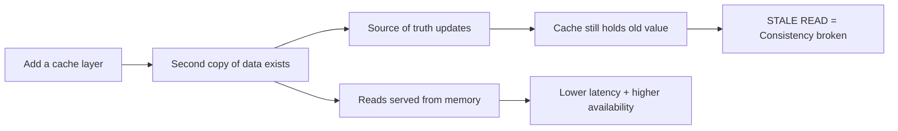

**One-line justification to use in an interview:**
> "I accept **complexity** and **staleness** in exchange for **performance** and **scalability**."

---

## 2. The Starting Problem

> Service receives **1,00,000 req/sec**. Database can handle only **10,000 reads/sec**. What do you do?

Valid answers (caching is only one of them — say all of them, then pick):

| Option | What it does |
|---|---|
| **Caching** | Serve repeat reads from memory (this session's focus) |
| **Read replicas** | Spread reads across replica DBs |
| **Vertical scaling** | Bigger DB box |
| **Horizontal scaling / sharding** | Split data across DB nodes |
| **Pre-computation** | Batch-compute results (analytics/logging style) and store them |
| **Queue + async** | Absorb the burst, process later |

**Follow-up:** 1 lakh users ask for **the same** piece of data at the same time (celebrity uploads a video).
→ 1 request fetches it, the other **99,999** are served from cache.

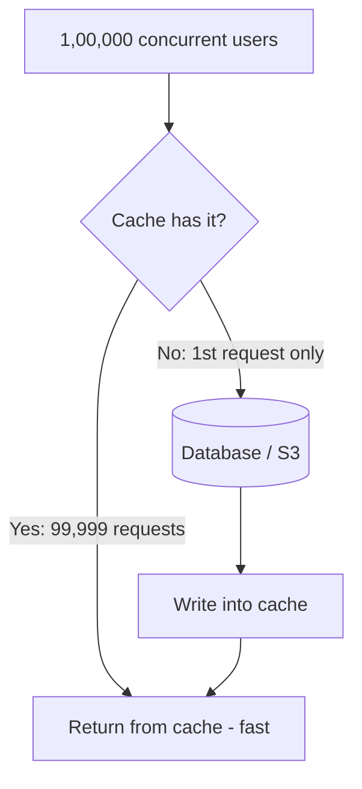

**Trap:** Don't jump to Redis here. A **video** belongs on a **CDN**, not Redis. Redis is for application-level data (config, sessions, computed objects).

---

## 3. Why Cache — The Three Benefits + The Cost

| Benefit | Explanation |
|---|---|
| **Latency** | Reading from memory ≫ faster than a remote DB/data layer call |
| **Throughput** | If 90% of reads are served by cache, the DB only processes 10% |
| **Cost** | A managed cache (ElastiCache/Redis) is far cheaper than scaling RDS to absorb every read |

**But caching is not free:**
- Extra **memory** cost
- Extra **layer** = more operational complexity
- You now need an **eviction policy**, an **invalidation strategy**, and a **failure strategy**

> Caching is a **trade-off**, not a free win.

---

## 4. Latency Hierarchy (relative, not absolute)

Focus on **relative order**, the actual numbers depend on hardware.

```
CPU / RAM            ▏ fastest
Local in-process cache (HashMap)  ▏▏
Redis (distributed) ▏▏▏▏      ← adds a NETWORK hop
Database            ▏▏▏▏▏▏▏▏
Remote service call ▏▏▏▏▏▏▏▏▏▏▏  slowest
```

**Key principle:** *The closer the cache is to the user/application, the lower the latency.*

**But** closer ≠ always better — if your app runs on 10,000 instances, a local HashMap means 10,000 copies of the data → memory waste + inconsistency. That is exactly why **distributed cache** exists.

---

## 5. What Should You Cache?

A good cache candidate ticks these **four boxes** (memorize this checklist):

1. ✅ **Read frequently**
2. ✅ **Expensive to fetch or compute**
3. ✅ **Result is reused** across requests/users
4. ✅ **Some staleness is tolerable**

### Good candidates
- Product metadata (images, description, price-ish data)
- Feature flags & application configuration
- Recommendations (heavy ML computation in the background → keep a **warm cache**)
- Document/video metadata, thumbnails
- Session data

### Bad candidates
- **Bank balance / wallet balance**
- **Stock prices**
- Any **financial transaction** data
- Anything needing **strict real-time consistency**

**How to reason about it as a user:**
> "Am I comfortable seeing a value that is 5 seconds old? 1 minute old? If someone transfers me money, do I need it reflected instantly?"

**Interview move:** If asked *"what cache should I use?"*, **counter-question first**:
> "What are the consistency and freshness requirements? Is stale data acceptable? If the cache is down, can we serve stale or default data?"

---

## 6. Caching Layers Architecture

Caching is **not** either/or — real systems run **all these layers together**.

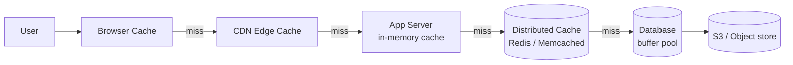

| Layer | What to store | Notes |
|---|---|---|
| **Browser** | Session details, UI preferences, profile info, API responses, encrypted tokens | Never store anything with a security concern unencrypted |
| **CDN** | Images, video, JS, CSS — any static/cacheable HTTP content | Distributes content geographically close to the user |
| **App in-memory** | Config, feature flags, small hot lookups (HashMap) | Fastest, but per-instance → inconsistent |
| **Distributed (Redis)** | Sessions, product objects, computed results, recommendations, user metadata | Shared across all app instances |
| **Database buffer pool** | Hot pages/queries | Postgres/MongoDB do this internally — **you cannot configure it from the app side** |

> Every layer gives you an opportunity to avoid an expensive operation — **and** introduces its own freshness/invalidation problem.

### 6.1 Browser / HTTP Caching — the headers interviewers ask about

The browser and CDN layers are driven **entirely by HTTP response headers**. Knowing them is what separates "I'd use a CDN" from an actual design.

| Header | Meaning |
|---|---|
| `Cache-Control: max-age=3600` | Fresh for 1 hour — served with **zero network round-trips** |
| `Cache-Control: public` / `private` | `public` = CDN **and** browser may cache. `private` = **browser only** (use for per-user responses) |
| `Cache-Control: no-store` | Never write to any cache — auth tokens, PII, banking |
| `Cache-Control: no-cache` | May store, but **must revalidate** before every use |
| `Cache-Control: s-maxage=600` | TTL for **shared** caches (CDN) only; overrides `max-age` at the edge |
| `Cache-Control: stale-while-revalidate=60` | Serve stale for 60 s while refreshing in the background — the HTTP-level answer to cache stampede |
| `Cache-Control: immutable` | Never revalidate — pairs with fingerprinted filenames |
| `ETag: "v3-abc"` | Content fingerprint. Client resends it as `If-None-Match` → server replies **304 Not Modified** with **no body** |
| `Last-Modified` / `If-Modified-Since` | Weaker, timestamp-based revalidation (1-second granularity) |
| `Vary: Accept-Encoding, Authorization` | Which **request** headers form part of the cache key |
| `Age: 120` | How long the CDN has held this response — useful for debugging edge TTLs |

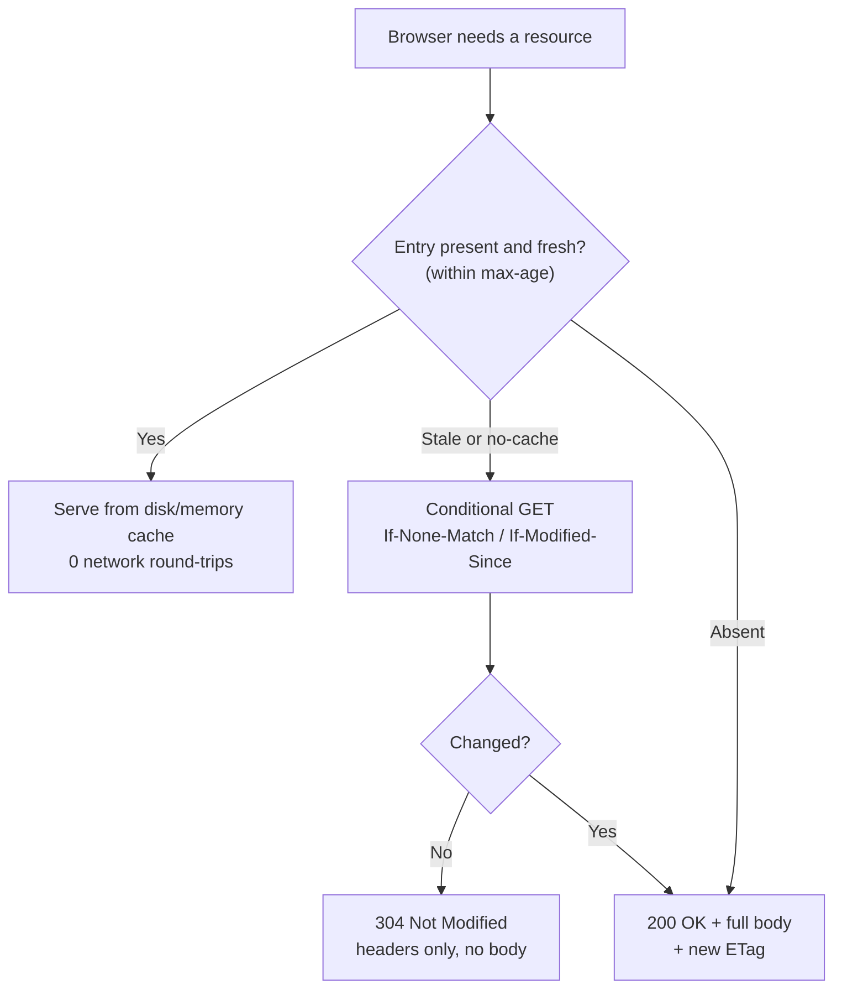

**CDN cache key** = URL + query string + whatever `Vary` names (sometimes cookies/headers). Two symmetric mistakes:

| Mistake | Consequence |
|---|---|
| Including a **per-user** cookie/header in the cache key for shared content | Hit ratio collapses toward 0 — every user gets their own copy |
| **Not** marking per-user responses `private` | The CDN serves **user A's response to user B** — a real **cache-poisoning / data-leak** incident |

**CDN invalidation options:**

| Method | Notes |
|---|---|
| **Purge by URL** | Precise, but slow to propagate across all PoPs |
| **Purge by tag / surrogate key** | Invalidate a whole group ("all pages showing product 42") |
| **Cache busting via fingerprinted filename** (`app.9f3c1a.js`) ⭐ | **Preferred** — a new deploy produces a new URL, so nothing ever needs purging. Pair with `max-age=31536000, immutable` |
| **TTL expiry** | Simplest; just wait |

---

## 7. Local Cache vs Distributed Cache

**Scenario:** Java app, 10 instances, each with its own `HashMap`.

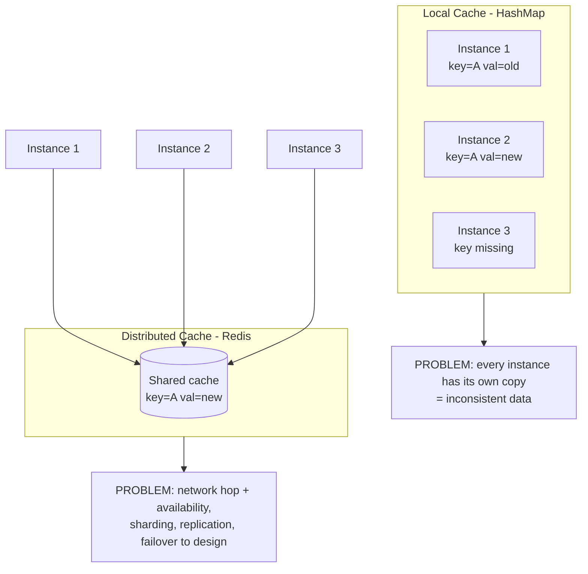

| | Local (HashMap) | Distributed (Redis) |
|---|---|---|
| Speed | Fastest (no network) | Slower (network hop) |
| Consistency across instances | ❌ Each instance differs | ✅ Single shared view |
| Memory | Duplicated N× | Single pool |
| Ops burden | None | Availability, sharding, replication, failover |

**There is no universal answer.** A small local cache **in front of** the distributed cache is a valid hybrid for extremely hot, safe-to-cache data.

> 💡 **Side note from the video (DSA interviews):** use a **HashSet**, not a HashMap, when you only need presence/absence checks. Candidates get rejected for this.

---

## 8. Caching Patterns (Read + Write)

### 8.1 Cache-Aside (Lazy Loading) — the industry default

> 📖 **Deep dive + runnable code:** [cache-aside-lld.md](cache-aside-lld.md) (Python / TypeScript / JavaScript LLD)
> **Sources:** [Azure Architecture Center](https://learn.microsoft.com/en-us/azure/architecture/patterns/cache-aside) · [AWS Database Caching Strategies](https://docs.aws.amazon.com/whitepapers/latest/database-caching-strategies-using-redis/caching-patterns.html) · [Redisson](https://redisson.pro/glossary/cache-aside.html) · [GeeksforGeeks](https://www.geeksforgeeks.org/system-design/cache-aside-pattern/)

**Definition:** The cache is a **passive** key-value store. The **application** — not the cache — owns the read-miss and invalidation logic. The cache **never talks to the database**.

**Also called:** *Lazy loading* (entries are created only in response to a real request) and *look-aside caching*. All three names describe the same pattern.

#### 8.1.1 Read path (3 steps — memorize this)

1. Application checks the **cache** first.
2. **Hit** → return immediately.
3. **Miss** → query the **database**, write the result into the cache **with a TTL**, then return it.

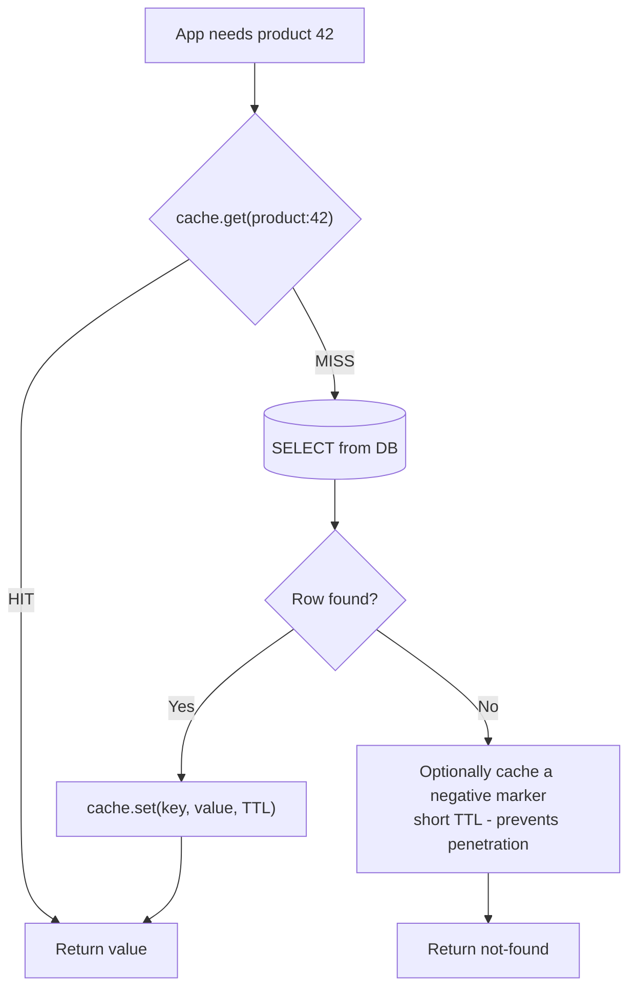

**Pseudocode (the canonical 5 lines):**

```
value = cache.get(key)
if value is null:
    value = database.query(key)
    if value is not null:
        cache.set(key, value, ttl)
return value
```

#### 8.1.2 Write path — order matters ⚠️

**Update the database FIRST, then DELETE the cache key.**

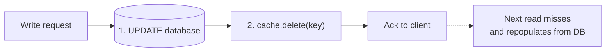

Two rules interviewers probe on:

| Rule | Why |
|---|---|
| **DB first, cache second** | If you delete the cache first, a reader can slip in *before* the DB write commits, read the **old** row, and repopulate the cache with stale data that survives until TTL. (Azure explicitly calls this out.) |
| **DELETE, don't UPDATE the cache** | A delete is **idempotent** and forces the next read to repopulate from the system of record. An overwrite can seed the cache with a value that a concurrent transaction has already superseded — and that wrong value then persists until it expires. |

#### 8.1.3 Advantages

| Advantage | Detail |
|---|---|
| **Only useful data is cached** | Nothing is loaded in advance → cache stays small and cost-effective (AWS) |
| **Resilient to cache failure** | If Redis is down, the app still reads from the DB — it degrades, it doesn't break (contrast: write-through *blocks writes*) |
| **Works with any cache** | Requires nothing beyond `GET` / `SET` / `DEL`. Redis has no built-in "pattern" — cache-aside lives entirely in your code |
| **Cache anything** | Not tied to one query. You can cache a row, an expensive join, a rendered fragment, or a value assembled from three microservices |
| **Fine-grained control** | Per-key TTL, per-key serialization, per-key invalidation |

#### 8.1.4 Disadvantages

| Disadvantage | Detail |
|---|---|
| **Cache-miss penalty** | First request pays cache-round-trip **+** DB round-trip **+** cache-write. Initial response time is *worse* than no cache (AWS) |
| **Stale data window** | Between the DB write and the cache delete — and between the delete and the next read — readers can see stale or missing data |
| **Duplicated miss-handling code** | The check → load → populate block is repeated at every read path and **drifts** between them. That's the signal to move to **read-through** |
| **No consistency guarantee** | An external process can change the DB at any time; the cache won't know until TTL or explicit invalidation |
| **Cold start** | After a deploy, failover or flush, **every** read is a miss until the working set is rebuilt |

#### 8.1.5 Problems & Considerations (Azure checklist — great for interviews)

| Consideration | What to say |
|---|---|
| **Lifetime of cached data (TTL)** | Match the expiry to the access pattern. Too short → constant DB round-trips. Too long → stale data. Caching works best for **relatively static or read-frequently** data |
| **Eviction** | The cache is far smaller than the data store. Most caches default to **LRU**; some allow customization |
| **Configuration** | Global vs per-item. If an item is **expensive to retrieve**, configure it individually — keep it cached even if accessed less often than cheap items |
| **Priming / warming** | Prepopulate at startup with data you know is needed. Cache-aside still handles what expires or is evicted |
| **Consistency** | Cache-aside gives **no** consistency guarantee between cache and store |
| **Staleness after writes** | Cache-aside invalidates on write and repopulates on the next read → a brief window of miss/stale. If you need **read-after-write** freshness, use **write-through** |
| **Local caching** | A per-instance in-memory cache is **private** — instances diverge. Use shorter TTLs, or move to a shared/distributed cache |
| **Semantic caching** | For LLM workloads you can key on *meaning* rather than exact key — but only when semantic equivalence is safe and the data isn't private/sensitive |

#### 8.1.6 When to use / when NOT to use

**✅ Use cache-aside when:**
- **Read-heavy** workload with **uneven access** — a small subset of keys serves most requests
- Brief **staleness is acceptable**
- Resource demand is **unpredictable** — you can't predict what to preload
- The cache has **no native read-through/write-through** support (Redis, Memcached)

**❌ Avoid cache-aside when:**
- The data is **sensitive/security related** — especially with a shared cache. Always read from the primary source
- The dataset is **static and small** — just prime the cache at startup and never expire it
- **Most requests miss** — the overhead of checking + populating outweighs the benefit
- **Writes dominate**, or cache and DB **must never diverge** → use **write-through**
- The same entity is read from **dozens of call sites** and the miss-handling block keeps drifting → use **read-through**
- Caching **session state in a web farm** — avoid client-server affinity dependencies

#### 8.1.7 The Three Failure Modes (this is where interviews go deep)

##### ① Write-Invalidate Race (stale-write-back)

A DB write and a cache invalidation are **two separate operations** — a reader can slip between them.

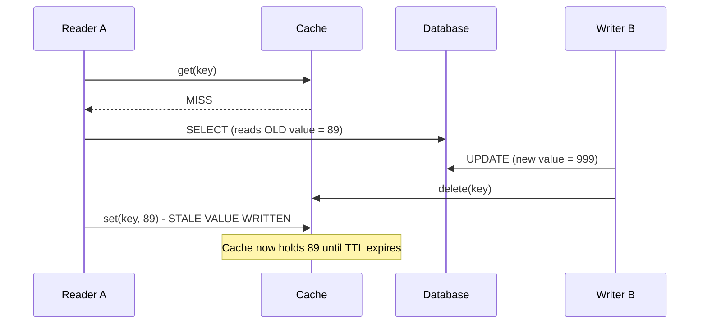

**Fixes:**
| Fix | Effect |
|---|---|
| **Short TTL** | Bounds how long the stale value can live (mitigation, not a cure) |
| **Distributed lock on the key** | Properly closes the window — the writer's delete and the reader's set can't interleave |
| **`SET ... NX`** (set-if-absent) on repopulate | The reader won't overwrite a fresh value |
| **Versioned keys / CAS** | Reader only writes back if the version it read is still current |
| **Delayed double-delete** | Delete the key, write the DB, then delete again after a short delay |

##### ② Thundering Herd / Cache Stampede on expiry

A property of **lazy loading itself**, not a bug: a popular key expires → every concurrent reader misses at the same instant → all of them query the DB together. → See [§13.1](#131-cache-stampede-thundering-herd). Standard fix: **one caller repopulates while the rest wait** (distributed lock / single-flight) + **TTL jitter**.

##### ③ Cold Start

An empty cache serves nothing. After a deploy, a failover, or a `FLUSHALL`, every read is a miss and the DB sees **full** traffic.

**Fixes:** warm critical keys on startup, stage the restart/rollout, keep a pre-computed fallback, rate-limit the DB during warm-up.

#### 8.1.8 Choosing a TTL

> **A TTL is not a performance setting — it is a statement about how stale a value is allowed to become.** It also doubles as the backstop for the invalidation race.

- Set the TTL **when you write the key**. Don't rely on **eviction** — eviction fires under **memory pressure**, which is not the same thing as data going out of date.
- **Correctness matters more than hit rate** → longer TTL **+** explicit invalidation on write.
- **Correctness doesn't matter much** → short TTL, no invalidation. That is often the entire design.
- Always add **jitter** so keys don't expire in lockstep.

#### 8.1.9 Optimizations

| Technique | What it does |
|---|---|
| **Negative caching** | Cache "not found" with a short TTL → stops cache penetration |
| **Batch / MGET on miss** | Group multiple misses into one DB round-trip instead of N |
| **Hierarchical / tiered cache** | L1 in-process (Caffeine/Guava) + L2 distributed (Redis) → removes the network hop on hot keys |
| **Near cache** | L1 copy invalidated cluster-wide automatically (Redisson `RLocalCachedMap`, Hazelcast near cache) |
| **Sliding expiration** | Reset the TTL on each access so hot keys stay resident |
| **Event-driven invalidation** | Kafka/CDC events invalidate keys in real time instead of waiting for TTL |
| **Graceful degradation** | Cache timeouts must **not** fail the request — fall through to the DB, wrapped in a **circuit breaker** |
| **Avoid caching `null`** | Cache an explicit sentinel instead, so "no value" and "cache down" are distinguishable |

#### 8.1.10 Real-World Usage

| Company | Implementation |
|---|---|
| **Netflix** | **EVCache** (built on Memcached) for catalog metadata and recommendations — miss → backend DB → populate → serve |
| **Amazon** | Redis + **DynamoDB Accelerator (DAX)** for product details and inventory during peak shopping |
| **Facebook** | **Memcached + TAO** for session data and social-graph reads (profiles, friend lists) at billions of requests/day |

#### 8.1.11 Interview Cheat Answers

| Question | Answer |
|---|---|
| **What is cache-aside?** | The application manages the cache: check cache → on miss query DB → populate cache → invalidate on write. The cache never queries the DB. |
| **Why is it called lazy loading?** | Entries are created only in response to a real request; nothing is preloaded. |
| **Cache-aside vs read-through?** | Both populate on miss. The difference is **who** does it — the application (cache-aside) or the cache itself (read-through). |
| **Is Redis "cache-aside"?** | No. Redis is a key-value store with no built-in pattern. Cache-aside lives in your application code — which is why it works with every client. |
| **Update or delete the cache on a write?** | **Delete.** It's idempotent and forces repopulation from the source of truth. Updating risks seeding a value a concurrent transaction already replaced. |
| **DB first or cache first on a write?** | **DB first, then delete the cache.** The reverse creates a window where a reader repopulates the cache with the pre-update value. |
| **Main drawbacks?** | Miss penalty on first read, duplicated miss-handling code, write-invalidate race, thundering herd on expiry, cold start. |
| **How do you fix each drawback?** | TTL + jitter; invalidation on write; lock/single-flight around repopulation; warm-up on deploy; move to read-through when the code drifts. |
| **When would you NOT use it?** | Write-heavy workloads, strict consistency requirements, sensitive data, mostly-miss access patterns, small static datasets (just prime it). |

### 8.2 Read-Through

**The cache itself knows how to load from the backing store.**

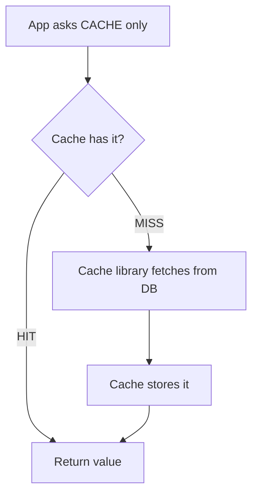

- ✅ Application code becomes very simple
- ❌ Cache layer becomes more sophisticated — **complexity moved, not removed**

**Interview framing:** the differentiator between cache-aside and read-through is one question — *"Who is responsible for loading the data?"*

### 8.3 Write-Through

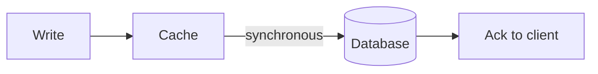

- ✅ Cache always stays **warm**, relatively **strong consistency**
- ❌ Write path is **slower** (every write pays DB latency)

### 8.4 Write-Behind / Write-Back

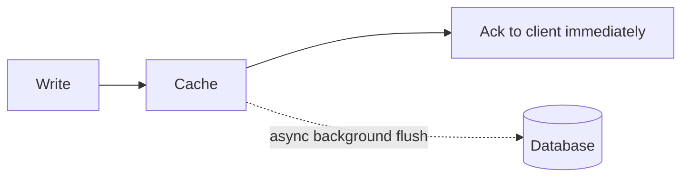

- ✅ **Very fast** writes and responses
- ❌ **Risk: data loss.** If the cache dies before the flush, the write never reaches the DB
- ❌ **Never** use for critical financial data (bank balance, stocks)
- ℹ️ Modern Redis has persistence/recovery mechanisms that reduce (not remove) this risk

### 8.5 Write-Around

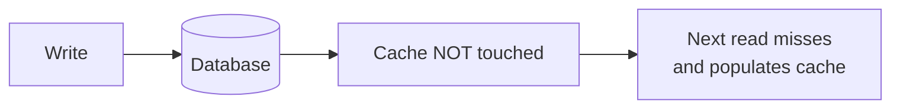

- ✅ Great for **write-heavy** systems — avoids polluting the cache with data nobody reads
- ❌ First read after a write is a miss / may serve stale data
- **Example:** Twitter/Instagram feeds. If Amitabh Bachchan tweets and you see it 2 minutes later — that's fine.

### 8.6 Summary Table

| Pattern | Who manages what |
|---|---|
| **Cache-aside** | **Application** manages the cache |
| **Read-through** | **Cache** manages reading from the backing store |
| **Write-through** | Cache **and** DB updated **synchronously** |
| **Write-behind** | Cache first, DB updated **asynchronously** |
| **Write-around** | DB first, cache populated **later** on a read |

> For an e-commerce product catalog read by millions: **cache-aside** or **read-through** both work. There is no single right answer — it depends on the constraints you established earlier in the discussion.

### 8.7 Choosing a Pattern — Decision Matrix

| If the workload is… | Use | Why |
|---|---|---|
| Read-heavy, uneven access, staleness OK | **Cache-aside** | Only caches what was actually asked for; survives a cache outage |
| The same entity is read from **many** call sites | **Read-through** | Miss logic lives in one place instead of drifting across the codebase |
| **Read-after-write** freshness needed, writes are rare | **Write-through** | Cache and DB never diverge; no invalidation race |
| Write-heavy, low write latency required, small loss tolerable | **Write-behind** | Ack immediately, batch the DB writes |
| Write-heavy, the written data is **rarely read back** | **Write-around** | Doesn't pollute the cache with cold data |
| Financial ledger, inventory checkout, auth | **No cache** (or write-through + bypass on critical reads) | Consistency beats latency |

**In practice you combine them.** AWS's guidance is explicit: *write-through is almost always implemented together with lazy loading* — write-through keeps hot data warm, and cache-aside backfills whatever expired or was evicted.

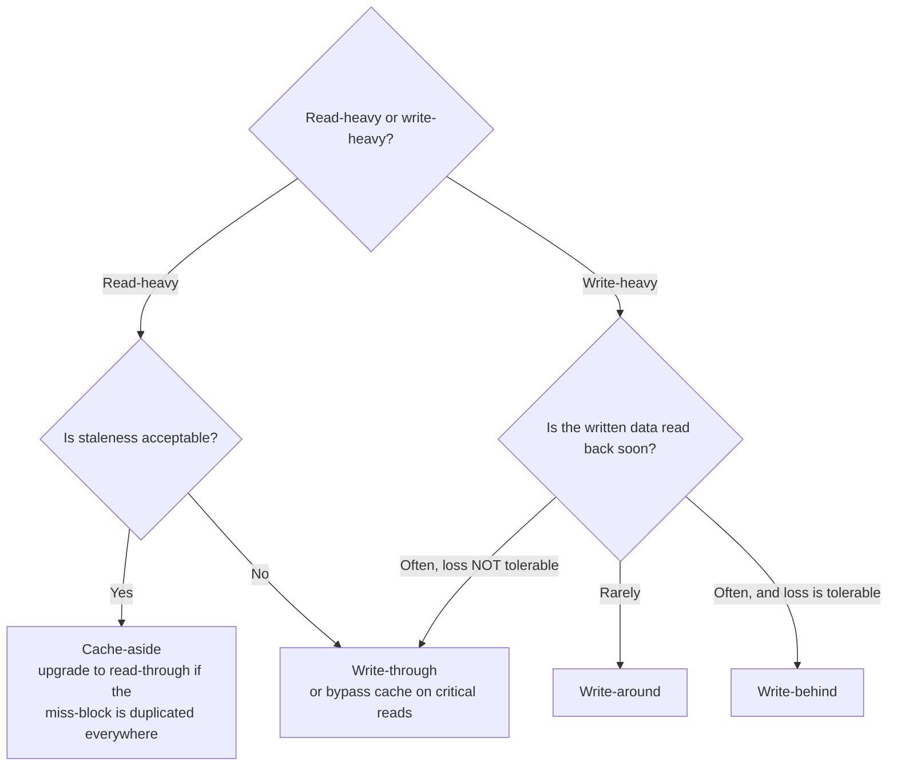

---

## 9. TTL (Time To Live)

**TTL = "this value is valid in the cache for the next N minutes."** A background process expires it.

| | Short TTL | Long TTL |
|---|---|---|
| Freshness | ✅ Fresher data | ❌ More stale data |
| Hit ratio | ❌ More cache misses | ✅ Better hit ratio |

### Problem: 1 million keys all created together with a 1-hour TTL

They **all expire at the same instant** → mass miss → DB gets hammered → **Cache Avalanche**.

### Solution: TTL Jitter

Instead of exactly `10 min`, store `10 min + random(0..N) seconds`:

```
key1 → 10m 05s
key2 → 10m 08s
key3 → 10m 12s
```

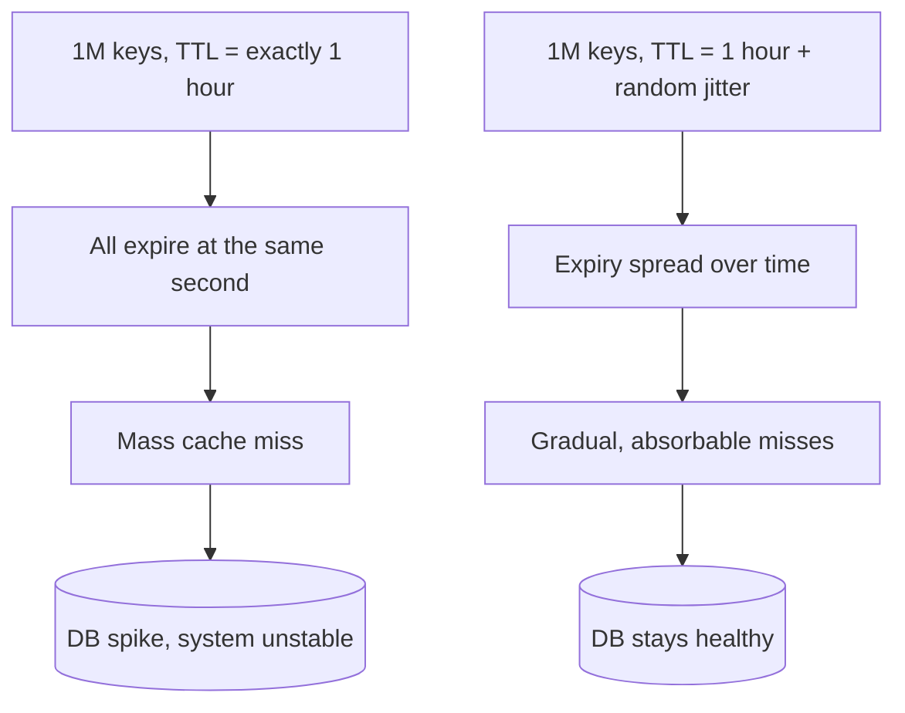

**Scope:** TTL is commonly associated with distributed caches (Redis), but it applies to browser caches, mobile apps, and application-level caches too.

---

## 10. Eviction Policies

**Eviction = the cache is FULL and you must remove something to make room.**

> **Analogy from the video:** TTL is like **resigning** — you leave on your own terms at a known time. Eviction is like a **layoff** — the system forces you out to make space.

| Policy | Removes | Best for |
|---|---|---|
| **LRU** – Least Recently Used | The one not touched for the longest time | Recency predicts reuse (general default) |
| **LFU** – Least Frequently Used | The least-accessed one | A few items are permanently popular |
| **FIFO** | Oldest inserted | Simple, rarely optimal |
| **Random** | A random entry | Cheap, uniform access patterns |
| **TTL-based** | Whatever expired | Time-sensitive data |

### LRU vs LFU — the classic example

| Object | Access count | Last accessed |
|---|---|---|
| **A** | 100 times | 1:00 AM |
| **B** | 50 times | 2:00 AM |

- **LRU evicts A** (least *recently* used — it hasn't been touched since 1 AM)
- **LFU evicts B** (least *frequently* used — only 50 hits)

**Use LFU** when a few products/keys are permanently hot — LFU captures **popularity**. **Use LRU** when **recency** is the better signal.

> 🎯 *Design an LRU / LFU cache* is one of Microsoft's most frequent DSA questions (~80% chance). Know the implementation.

### Scope: eviction vs TTL

| | Eviction policy (LRU/LFU/...) | TTL |
|---|---|---|
| Configured at | **Cache/subsystem level** (Redis server, app cache) | **Per object** |
| Granularity | Global for the whole subsystem — the *cart* subsystem has one policy, the *wishlist* another | You can set a different TTL for each key |
| Example | You cannot say "LRU for user X, LFU for user Y" | You **can** say heavy shopper → TTL 10 days, light shopper → TTL 1 hour |

### 10.1 Managing Memory Constraints & Capacity Planning

**Redis `maxmemory-policy`** — what happens once `maxmemory` is reached:

| Policy | Behaviour |
|---|---|
| `noeviction` | **Writes fail** with an OOM error (reads still work). Correct for a *datastore*, dangerous for a *cache* |
| `allkeys-lru` | Evict LRU across all keys — the usual choice for a pure cache |
| `allkeys-lfu` | Evict LFU across all keys — better when popularity is stable over time |
| `allkeys-random` | Evict at random — cheapest; surprisingly fine under uniform access |
| `volatile-lru` / `volatile-lfu` / `volatile-random` | Same, but only among keys that **have a TTL set** |
| `volatile-ttl` | Evict the key with the nearest expiry |

> ⚠️ **Classic production incident:** a `volatile-*` policy evicts **nothing** if no key has a TTL — so instead of evicting, Redis starts returning OOM errors on writes. Either set `allkeys-lru` or make sure every key gets a TTL.

**Sizing math — say it out loud in the interview:**

```
working set   = hot_keys x (key_bytes + value_bytes + per_key_overhead)
overhead      ~ 50-100 bytes/key   (object header + expiry + dict entry)
provisioned   = working set x 1.3  (fragmentation + replication buffer + headroom)
```

*Example:* 10 M sessions × (40 B key + 400 B value + 80 B overhead) ≈ **5.2 GB** → provision ≈ **7 GB**, then divide by shard count.

**Symptom → cause → fix:**

| Symptom | Cause | Fix |
|---|---|---|
| Eviction rate rising, hit ratio falling | Working set **>** memory | Add memory or shard |
| `used_memory_rss` ≫ `used_memory` | **Fragmentation** | `activedefrag yes`, restart, or resize values |
| One value is multi-MB | **Big key** — blocks the single-threaded loop and saturates NIC | Split into hash fields / smaller keys, compress, or move the blob to S3 and cache the pointer |
| OOM errors with **zero** evictions | `noeviction`, or `volatile-*` with no TTLs | Switch policy or add TTLs |
| Memory flat but hit ratio poor | Key design churn (unbounded key cardinality) | Namespace + version keys; cache at a coarser granularity |

**Also budget for:** the cache is a **fraction** of the data store. Cache the **hot working set** (often ~1–5% of rows serving ~80–95% of reads), not the whole table.

---

## 11. Cache Invalidation — "the most annoying part of caching"

The moment you cache, you have **two copies**. When the DB value changes, what happens to the cache?

| Strategy | How it works |
|---|---|
| **Explicit delete/update** | On write, the service deletes or updates the cache key |
| **TTL expiry** | Let it expire naturally |
| **Event-driven (most common at scale)** | Service updates price → publishes to **Kafka** → consumers invalidate/refresh their caches |
| **Versioned keys** | `user:{id}:v2:homefeed` — bump the version to logically invalidate everything |
| **Proactive refresh** | Application refreshes the value before returning the response |

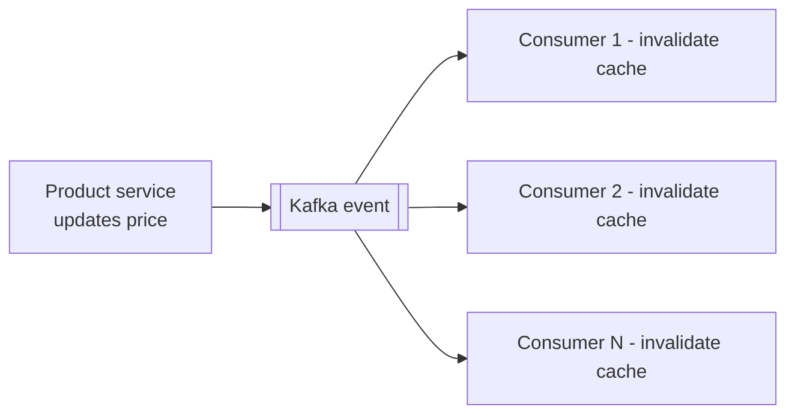

> **Rule:** Don't pick an invalidation strategy first. First establish **how fresh the data must be**, *then* pick the strategy.

**Cross-instance invalidation (100 app instances):** use pub/sub — Kafka, Redis pub/sub, or ZooKeeper node updates that all instances watch.

---

## 12. Consistency — the real cost

**Scenario:** Seller updates a product price to ₹999. Cache still holds ₹89.
→ User sees **₹89**, because the app hits the cache first. The cache is **stale**.

**Is that always a problem? No.**

| Data | Staleness acceptable? |
|---|---|
| Product description / T-shirt listing | ✅ Fine, refresh in a day |
| Social media feed (10s old vs 1s old) | ✅ Fine |
| Government-regulated gold purity spec | ❌ Must be exact |
| Bank balance after you made 5 payments | ❌ Must be instant |

> Some products literally **sell consistency** as a tier (silver / gold / platinum) — premium customers get more frequent cache refreshes.

**The question that unlocks the whole HLD interview:**
> "**How stale can this data be?** 5 seconds? 1 minute? Not at all?"

The answer immediately tells you the consistency model. **Strong consistency always costs more. Eventual consistency buys you performance and flexibility.**

---

## 13. Cache Failure Scenarios — Problem → Solution

### 13.1 Cache Stampede (Thundering Herd)

**Problem:** A very popular key expires at 10:00:00. At 10:00:01, 10,000 requests all miss and all go to the DB. The cache was supposed to *protect* the DB — instead the miss **killed** it.

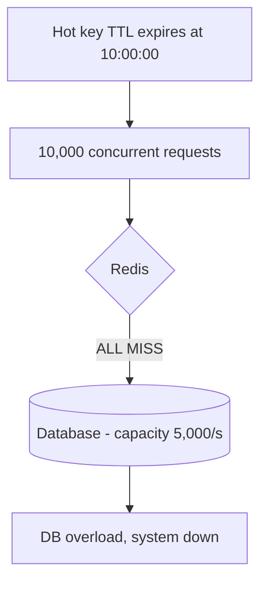

**Solutions:**

| Solution | How it works |
|---|---|
| **Request coalescing / single-flight** | Only the **first** request goes to the DB and rebuilds the cache; the rest **wait** for that result |
| **Distributed lock** | One process holds the lock and rebuilds; others block or serve stale |
| **Randomized TTL (jitter)** | Keys don't all expire together |
| **Proactive / early rebuild** | Build version `v2` **before** `v1` expires (versioned keys) |
| **Serve stale-while-revalidate** | Return the old (or a default) value while the cache is being rebuilt in the background |

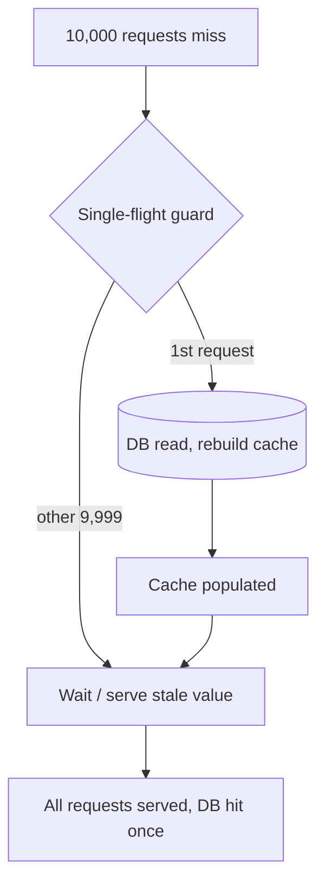

> **Interview tip:** If the interviewer says *"now the cache is invalidated and 10,000 requests come in..."* — they are steering you into stampede. Say it out loud: *"I think you're leading me toward the cache stampede problem; here's how I'd solve it."* That answer gets you hired.

**How request coalescing is actually implemented** (be ready to describe the mechanism, not just the name):

| Scope | Mechanism |
|---|---|
| **Within one process** | A `Map<key, Promise>` of in-flight loads — concurrent callers for the same key **share the same promise/future**. Go calls this `singleflight`; Java uses `Caffeine`'s loading cache |
| **Across the cluster** | A **distributed lock**: `SET lock:<key> <token> NX EX 5`. The winner rebuilds; losers poll the key for a bounded window, then degrade to a direct read |
| **Correctness detail** ⭐ | **Re-check the cache after acquiring the lock.** Without it, every waiter rebuilds in turn once the holder releases — you convert a *simultaneous* herd into a *sequential* one |
| **Release safely** | Delete the lock with a **Lua compare-and-delete** so a slow holder can't release someone else's lock after its own lease expired |
| **HTTP layer equivalent** | Nginx `proxy_cache_lock`, Varnish request coalescing, `Cache-Control: stale-while-revalidate` |

📖 Full working implementation in [cache-aside-lld.md](cache-aside-lld.md) (Python / TypeScript / JavaScript).

---

### 13.2 Cache Penetration

**Problem:** An attacker repeatedly requests keys that **don't exist anywhere** — `userId=999999`, then another random ID, then another. Every request: cache miss → DB miss → 404. The cache **can never protect** the DB because the value is never cacheable.

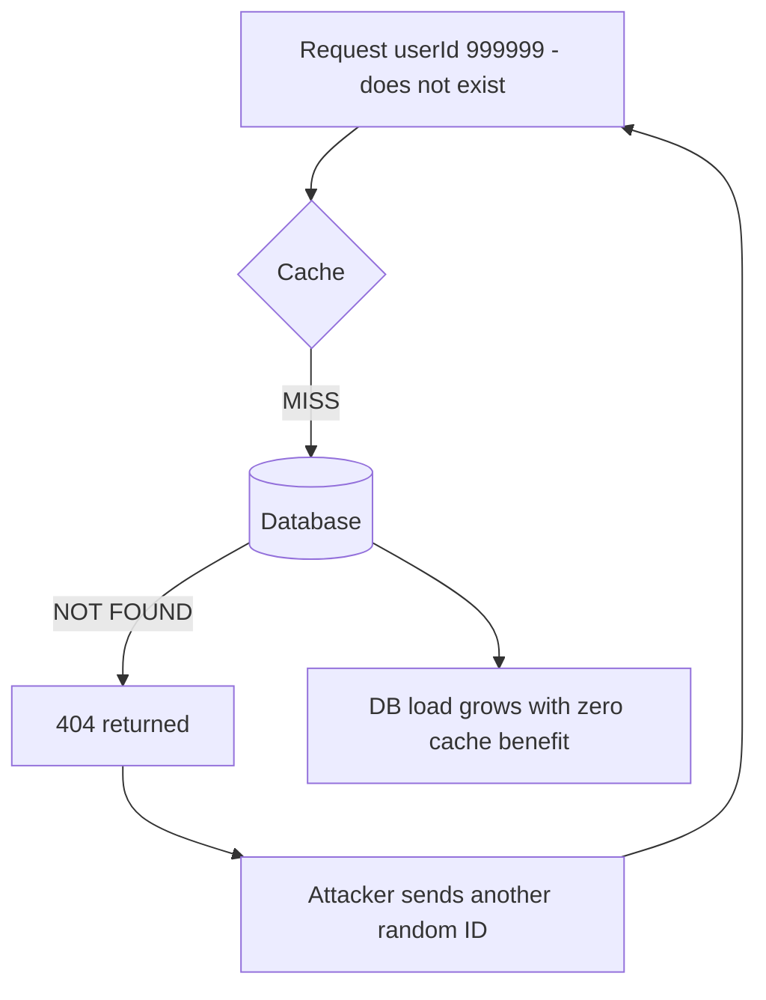

**Solutions:**

| Solution | How it works | Caveat |
|---|---|---|
| **Negative caching** | Cache the fact that a key **doesn't exist** (short TTL) | Storing 1 billion "doesn't exist" markers is impractical/expensive |
| **Bloom filter** ⭐ | Probabilistic membership check *before* touching cache/DB. This is how Gmail/Hotmail instantly tells you "this ID already exists" | Small false-positive rate, never false-negative |
| **Input validation** | Reject malformed IDs at the edge | — |
| **Rate limiting / throttling** | Per-IP, per-second limits on suspicious traffic | — |

#### Bloom Filter — how it actually works (be ready to explain this)

A **bit array of size `m`** plus **`k` independent hash functions**. It stores **no values** — only bits.

- **Add(x):** set the bits at positions `h₁(x) mod m … h_k(x) mod m` to 1.
- **MayContain(x):** if **any** of those `k` bits is 0 → **definitely absent**. If all are 1 → **probably present**.

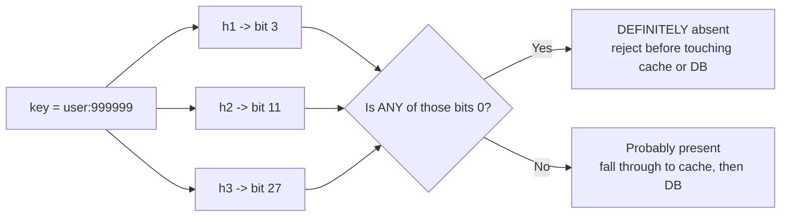

| Property | Value |
|---|---|
| False **positives** | Possible — occasionally lets a non-existent key through. Harmless: it just falls through once |
| False **negatives** | **Impossible** — which is exactly what makes it safe as a gatekeeper |
| Deletion | **Not supported** — clearing a bit would corrupt other keys. Use a **counting Bloom filter** or rebuild periodically |
| Space | ≈ **10 bits/element** for a 1% false-positive rate → **1 billion IDs ≈ 1.2 GB**, versus hundreds of GB to negative-cache every ID |
| Optimal hash count | $k = \frac{m}{n}\ln 2$, giving $p \approx \left(1 - e^{-kn/m}\right)^{k}$ |

**Where it's used in the wild:** Gmail/Hotmail "this username is taken", Cassandra / HBase / LevelDB skipping SSTable reads, Chrome's malicious-URL check, Bitcoin SPV wallets. Redis exposes it via the **RedisBloom** module (`BF.ADD` / `BF.EXISTS`), or you can hand-roll it on a Redis bitmap with `SETBIT`/`GETBIT`.

> **Interview framing:** *"A Bloom filter trades a small false-positive rate for a massive space saving, and it never produces false negatives — so it can safely say 'this key does not exist' without ever wrongly rejecting a real key."*

> The video's practical verdict: **negative caching is usually not worth the cost** — you'd be paying every day to defend against an attack that happens rarely. Prefer **bloom filter + input validation + rate limiting**.
> 📚 *Designing a bloom filter* is itself a very frequent system-design interview problem.

---

### 13.3 Cache Avalanche

**Problem:** *Stampede is about ONE hot key. Avalanche is about MANY keys at once.* 1 billion keys all given exactly 1 hour TTL. One hour later, a huge fraction expire together → the app must rebuild a massive number of entries → DB traffic spikes, latency climbs, the whole system destabilises.

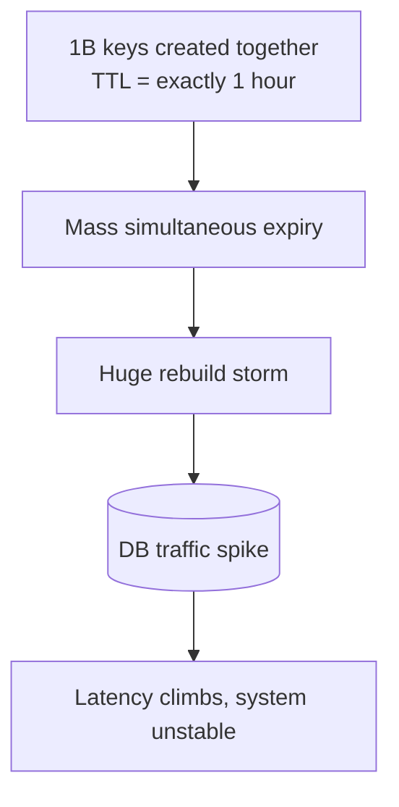

**Solutions:**

| Solution | How it works |
|---|---|
| **TTL jitter** | Randomize expiry times |
| **Staggered refresh** | Refresh 1/10th of the keys at a time |
| **Versioning** | Build the next version before the current one dies |
| **Pre-warming** | Allocate more cache than needed (buffer) and rebuild proactively before expiry. When a **new Redis node** comes up, let it build its cache **first**, and only then start routing traffic to it |

> **Core idea:** never let your entire cache disappear at the same time, and never let your system try to rebuild the entire cache at the same time.

---

### 13.4 Hot Key (Celebrity Problem)

**Problem:** Ronaldo goes live. His profile key gets 1 million req/sec. Consistent hashing sends **all** of them to **one node** — that node dies while the rest of the cluster is idle.

> **The lesson:** *Average load can look perfectly healthy while one single key is killing your system.*

```mermaid
flowchart TD
    A["1M req/s for key celebrity:ronaldo"] --> B{"Hash to single node"}
    B --> N1[Node 1 - OVERLOADED]
    B -.-> N2[Node 2 - idle]
    B -.-> N3[Node 3 - idle]
```

**Solutions:**

| Solution | How it works |
|---|---|
| **Key splitting / replication** ⭐ | Store the hot value under N derived keys — `ronaldo:1`, `ronaldo:2` … `ronaldo:10` — one per node. Any node can serve the request |
| **Local (in-process) cache** | If you know a live session is scheduled, cache it in the app layer too |
| **Rate limiting** | Protect against abusive traffic |
| **Alerting / observability** | Page at 70–80% of node limits so you can react to an *unexpected* celebrity |

```mermaid
flowchart TD
    A[Request for hot key] --> B["Pick random suffix 1..10"]
    B --> K1["ronaldo:1 on Node 1"]
    B --> K2["ronaldo:2 on Node 2"]
    B --> K3["ronaldo:N on Node N"]
```

**Real-world example:** New iPhone launches on Amazon → millions query the same product. Amazon replicates that product's data across all nodes so no single node melts.

**Proactive vs reactive:** A planned launch → proactive replication. An overnight viral creator → reactive, driven by **observability metrics + alerts/pages**.

---

## 14. Distributed Caching: Sharding, Replication, Consistent Hashing

Two problems to solve when the cache outgrows one node:

| Problem | Question it answers |
|---|---|
| **Sharding** | *Which node should store my key?* |
| **Replication** | *What happens if my node dies?* |

### The naive approach and why it breaks

`node = hash(key) % number_of_nodes`

Add a 4th node → the modulo changes → **a huge portion of keys remap** → most of your cache goes **cold** at once.

```mermaid
flowchart LR
    subgraph Before["hash mod 3"]
        A1["key 1 to N1"]
        A2["key 2 to N2"]
        A3["key 4 to N1"]
    end
    subgraph After["hash mod 4 - node added"]
        B1["key 1 to N2 - moved"]
        B2["key 2 to N3 - moved"]
        B3["key 4 to N4 - moved"]
    end
    Before --> X["Massive remap - cache goes cold"]
```

### Consistent Hashing

Map both **nodes** and **keys** onto the same circular hash space (e.g. `0 … 2³²-1`). A key is owned by the **first node clockwise** from its own position.

```
ring position:  0 ------- 90 -------- 180 -------- 270 ------> wraps to 0
nodes:          A          B            C            D
keys:              15 -> B    120 -> C     200 -> D     300 -> A (wraps)
                   ^ owned by the first node clockwise

add node E at 135:
keys:              15 -> B    120 -> E     200 -> D     300 -> A
                              ^^^^^^^^ ONLY keys between 90 and 135 move.
                                       Everything else stays put.
```

| | `hash(key) % N` | Consistent hashing |
|---|---|---|
| Keys remapped when a node is added | ≈ **(N-1)/N** — almost everything | ≈ **1/N** — only $K/N$ keys |
| Cache goes cold on scale-out | Yes, catastrophically | Barely |
| Load balance | Perfectly even by construction | Uneven → fixed by **virtual nodes** |
| Node removal | Full reshuffle | Only that node's range moves |

**Virtual nodes (vnodes):** place each **physical** node at many points on the ring (typically 100–200 replicas) instead of one.

| Benefit | Why |
|---|---|
| **Even distribution** | One unlucky placement can no longer hand a node 50% of the ring |
| **Even failure redistribution** | When a node dies its keys spread across **all** survivors, not dumped on one neighbour |
| **Heterogeneous capacity** | A 2× bigger box simply gets 2× the vnodes |

> **One-line interview answer:** *"Consistent hashing minimizes key remapping when the caching topology changes — only K/N keys move instead of nearly all of them — and virtual nodes make the distribution even and failure-tolerant."*

⚠️ **Consistent hashing does NOT solve the hot key problem.** It balances *keys* across nodes, not *traffic*. One viral key still lands on one node — that needs key splitting (§13.4).

📚 A favourite standalone interview question (Salesforce, Indeed). Also used by DynamoDB, Cassandra, Riak, and for sticky/stateful server routing — not just caches.

### 14.1 Scaling a Distributed Cache in Practice

| Mechanism | What it gives you | What to say about it |
|---|---|---|
| **Redis Cluster** | Sharding **+** automatic failover, built in | **16,384 hash slots** spread over primaries; clients follow `MOVED`/`ASK` redirects. Multi-key commands must land in one slot → use **hash tags**: `user:{42}:cart` and `user:{42}:wishlist` co-locate |
| **Primary–replica replication** | Read scaling + redundancy | Replication is **asynchronous** → replicas can serve slightly stale data, and a failover can lose the most recent writes |
| **Redis Sentinel** | Automatic failover for non-clustered deployments | A quorum of sentinels promotes a replica and reconfigures clients |
| **Client-side sharding** | What **Memcached** does (no server-side cluster) | Simple and fast, but the client library owns the ring — every client must agree on it |
| **Proxy (Twemproxy, Envoy, mcrouter)** | Central routing, connection pooling, fan-out | Adds a hop; simplifies clients |
| **Vertical scaling** | Bigger box | Fastest fix, hard ceiling — and Redis command execution is single-threaded, so more cores help less than you'd hope |
| **Tiered / near cache** | L1 in-process + L2 Redis | Removes the network hop for the hottest keys; needs cluster-wide L1 invalidation |

**Scaling checklist to recite:**
1. **Shard** with consistent hashing + vnodes (or Redis Cluster slots).
2. **Replicate** each shard for HA and read scaling — and state that replication is async.
3. Handle the **hot key separately** — sharding alone cannot fix it.
4. **Pre-warm** a new node before routing traffic to it, or you cause an avalanche.
5. **Pipeline / `MGET`** to amortise RTT — batch, never loop.
6. Beware **cross-slot multi-key commands** — they fail in cluster mode.
7. Decide **cache topology independently of DB topology** — your Redis sharding strategy need not match your database's.

---

## 15. Redis, Memcached & CDN — Choosing the Right Cache

### 15.1 Redis Deep Dive

Redis is the default distributed cache because it is an in-memory **data-structure server**, not just a key-value blob store.

| Structure | Commands | Caching use case |
|---|---|---|
| **String** | `GET` / `SET` / `SETEX` / `INCR` | Serialized objects, counters, rendered HTML fragments |
| **Hash** | `HGET` / `HSET` / `HGETALL` | An object whose fields update independently — avoids read-modify-write of a whole blob |
| **List** | `LPUSH` / `LRANGE` | Recent-items feeds, simple queues |
| **Set** | `SADD` / `SISMEMBER` | Tags, dedup, "has this user seen it" |
| **Sorted Set (ZSET)** | `ZADD` / `ZRANGE` / `ZRANGEBYSCORE` | **Leaderboards**, time-ordered feeds, sliding-window rate limiting |
| **Bitmap / HyperLogLog** | `SETBIT` / `PFADD` `PFCOUNT` | Daily-active flags; **cardinality** estimates in ~12 KB regardless of size |
| **Stream** | `XADD` / `XREAD` | Event log with consumer groups |
| **Geo** | `GEOADD` / `GEOSEARCH` | "Restaurants near me" |

**Execution model:** command execution is **single-threaded** (I/O threading exists in 6+, but *your command* still runs atomically on one thread).

- ✅ No locks, no races → `INCR`, `SETNX` and Lua scripts are **atomic for free**.
- ❌ **One slow command blocks everything.** Never run `KEYS *`, an unbounded `SMEMBERS`, or a huge `ZRANGE` in production — use `SCAN` and bound your ranges. This is also *why* **big keys** are so dangerous.

**Atomicity primitives to name-drop:**
- `SET key val NX EX 30` → distributed lock acquire — the basis of **single-flight** (see [cache-aside-lld.md](cache-aside-lld.md)).
- **Lua (`EVAL`)** → multi-step read-modify-write executed atomically: compare-and-delete lock release, token-bucket rate limiter.
- `MULTI`/`EXEC` + `WATCH` → optimistic concurrency.

**Persistence** — for a *cache* this is about **warm restart**, not durability:

| Mode | Behaviour |
|---|---|
| **RDB** | Fork + point-in-time snapshot. Fast restart; can lose minutes of writes |
| **AOF** | Append-only command log — `everysec` (default) / `always` / `no` |
| **RDB + AOF** | Common production setup |
| **None** | Fine for a pure cache — but a restart then means a **cold start** stampede |

**Other levers:** pipelining and `MGET`/`MSET` to amortise RTT, connection pooling, client-side caching (RESP3 tracking = near cache), and `maxmemory-policy` (see [§10.1](#101-managing-memory-constraints--capacity-planning)).

### 15.2 Redis vs Memcached

| | **Redis** | **Memcached** |
|---|---|---|
| Data types | Strings, hashes, lists, sets, sorted sets, streams, bitmaps, HLL, geo | **Strings only** |
| Threading | Command execution single-threaded | **Multi-threaded** — scales better vertically on big boxes |
| Persistence | RDB + AOF | None (purely volatile) |
| Replication / failover | Built in (Cluster, Sentinel) | None — **client-side sharding** |
| Atomic ops, Lua, pub/sub, transactions | Yes | No |
| Eviction | Configurable `maxmemory-policy` | LRU only, slab allocator |
| Memory efficiency for plain KV | Slightly more per-key overhead | Very lean; slabs limit fragmentation |
| Best for | Anything richer than "get/set a blob" | Huge, simple, volatile, string-only cache at very high throughput |

> **Interview answer:** *"Redis by default. Memcached only when I specifically want its multi-threaded simplicity for a very large, purely volatile, string-only cache. The moment I need sorted sets, atomic counters, persistence or built-in failover, Memcached is out."*

### 15.3 CDN vs Redis — they are NOT the same thing

> A CDN is **not** just a faster Redis. They solve **different problems**.

| | **CDN** (Cloudflare, Akamai, CloudFront) | **Redis / Memcached** |
|---|---|---|
| Purpose | Content delivery, geographically close to users | Application-level distributed cache |
| Stores | Images, video, JS, CSS — any static/cacheable HTTP content | Sessions, product objects, computed results, recommendations, user metadata, config |
| Placement | Global edge PoPs | Inside your data centre / VPC |
| Billing | Based on how many/how close the edge nodes are | Instance/memory based (generally **more expensive** per GB) |

**Real systems use both.** A single page load:
- **CDN** serves the images/thumbnails/JS
- **Redis** serves the application-level data
- **Database / S3** remains the **source of truth**

> **Quick rule to recall in an interview:** multimedia + CSS/JS → **CDN**. Configuration + application data → **Redis**.

---

## 16. Cache Observability

You cannot say "I deployed Redis, done." You must prove the cache is **helping**.

| Metric | Why |
|---|---|
| **Hit ratio** = hits / (hits + misses) | The headline number |
| **Cache latency: P50 / P95 / P99** | Averages hide the tail |
| **Memory usage** | Are we close to full? |
| **Eviction rate** | High evictions ⇒ cache too small |
| **Hot key detection** | Uneven node load |
| **Invalidation lag** | How stale are we really? |
| **Backend/DB load during misses** ⭐ | The one people forget |

### 🎯 The 99% Hit Ratio Trap

> *"My cache has a 99% hit ratio. Is my system healthy?"*
> **Answer: NO.**

That remaining **1%** can be exactly the stampede/hot-key traffic that takes the database down. You are not optimizing a *cache* metric — you are optimizing **overall system health**.

**Never look at cache metrics in isolation.** Correlate the cache graphs with DB load, service latency, and error rates.

### 16.1 What to Actually Alert On

| Signal | Healthy | Alert when | Likely cause |
|---|---|---|---|
| **Hit ratio** | 80–95%+ | drops >10 points vs baseline | TTL too short, key churn, cold start, bad key design |
| **Eviction rate** | ≈ 0 for a properly sized cache | sustained non-zero **and** hit ratio falling | Working set > memory |
| **`used_memory` / `maxmemory`** | < 75% | > 85% | Under-provisioned → scale or shard |
| **Cache P99 latency** | < 5 ms in-DC | > 20 ms | Big keys, slow command, NIC saturation, CPU |
| **Backend QPS during misses** ⭐ | flat | spikes correlated with key expiry | **Stampede / avalanche** |
| **Per-node QPS skew** | even across shards | one node ≫ the rest | **Hot key** |
| **Connection errors / timeouts** | 0 | any sustained | Pool exhaustion, failover in progress |
| **Invalidation lag** (Kafka consumer lag) | < TTL | growing | Stale reads accumulating |
| **Slowlog entries** | 0 | any | `KEYS`, big-key reads, unbounded ranges |

**Formulas worth quoting in an interview:**

- **Effective read latency:** $L = h \cdot L_{cache} + (1-h)\,(L_{cache} + L_{db})$
  With $h = 0.95$, $L_{cache} = 1\,\text{ms}$, $L_{db} = 50\,\text{ms}$ → $L \approx 3.5\,\text{ms}$.
- **Backend load remaining:** $(1-h)$.
  95% → the DB sees **5%** of reads. Going 95% → 99% **halves the DB load again** — which is why the last few points are worth chasing.

**Instrument three layers, always together:**

| Layer | Metrics |
|---|---|
| **Client** | hits, misses, cache-call latency, timeouts, serialization cost |
| **Cache server** | memory, RSS/fragmentation, evictions, expired keys, keyspace size, per-node QPS, slowlog, replication lag |
| **Backend** | QPS, P99, connection pool saturation, error rate |

Reading any one of these in isolation is precisely the mistake the 99%-hit-ratio trap punishes.

---

## 17. Case Study — YouTube Home Feed

> **Problem:** User opens the app. Serve a **personalized** feed in **< 200 ms**.

### Q1. What do we cache?

| Item | Why |
|---|---|
| Previously computed **recommendations** | ML pipeline output — very expensive to compute |
| **Trending content per geography** | Compute-heavy; shared by many users. (Cache the *trending content*, not the geography itself — geography isn't expensive to compute) |
| **Subscription latest posts** | Per-user, reused across requests |
| **Video metadata** | Titles, durations, channel info |
| **Thumbnails** ⭐ | Few KB each; the feed renders instantly with no spinner → definitely cached (CDN) |

### Q2. What is the cache key?

Never the user's email. Internally everything maps to a **UUID** (32-char user ID).

```
{uuid}:{version}:homefeed
{uuid}:{version}:profile
```

The `version` segment lets you invalidate everything for a user by bumping it.

### Q3. Shared vs personalized data

A single video appears in **millions** of feeds. Do **not** store the full object per user.

```mermaid
flowchart TD
    A["user123:v1:homefeed"] --> B["List of video IDs:<br/>vid_9, vid_4, vid_77"]
    C["user456:v1:homefeed"] --> D["List of video IDs:<br/>vid_9, vid_12"]
    B --> E[("video:vid_9 - full metadata<br/>stored ONCE, shared")]
    D --> E
```

- **Personalized data** → store as-is per user
- **Shared data** → store **once**, keep only a **reference/ID** in the personalized entry

### Q4. What TTL?

Depends on the **user's usage pattern** *and* the **nature of the content**. Frequently-changing metadata → short TTL. Stable metadata → long TTL.

### Q5. A creator publishes a new video — how does it reach relevant feeds?

**Event-driven approach** (notifications are the user-facing symptom; **events** are the backend mechanism).

```mermaid
flowchart LR
    P[Publishing service] --> E[[Event / Kafka]]
    E --> F["Feed / recommendation service"]
    F --> I[Invalidate affected feed keys]
    I --> R[Refresh cache with new feed]
```

📚 Read up on **fan-out** (fan-out-on-write vs fan-out-on-read) — used by Twitter and most social platforms.

### Q6. What if Redis itself goes down?

**Do NOT send every request to the database.**

```mermaid
flowchart TD
    A[Redis is down] --> B{Circuit breaker}
    B -- "let 1 request through" --> C[(DB rebuild)]
    B -- "hold the rest" --> D["Queue / wait"]
    C --> E[Cache rebuilt]
    E --> D
    A --> F[Serve stale previous version]
    A --> G[Serve default value]
    A --> H[Fall back to pre-computed feed]
    A --> I[Rate-limit the database]
```

| Fallback | Description |
|---|---|
| **Circuit breaker** | Intercept the first request, hold the flood, release only after the cache is rebuilt (like an electrical fuse) |
| **Serve stale** | Return the previous version |
| **Serve default** | Return a generic/non-personalized feed |
| **Pre-computed fallback feed** | A generic trending feed as a safety net |
| **Rate-limit the DB** | Protect the source of truth |

> This is exactly why **"caching is not just adding a Redis layer."** You must design what happens when it **works**, when it **misses**, and when it **completely fails**.

---

## 18. The 7-Question Caching Design Framework ⭐

When a caching question appears in an HLD interview, **do not draw a Redis box.** Ask these seven questions:

```mermaid
flowchart TD
    Q1["1. What exactly are we caching?"] --> Q2["2. Where should the cache live?<br/>browser / CDN / local / distributed"]
    Q2 --> Q3["3. Which caching pattern?<br/>cache-aside / read-through / write-through / write-behind / write-around"]
    Q3 --> Q4["4. How fresh must the data be?<br/>determines TTL + invalidation"]
    Q4 --> Q5["5. What happens when the cache fails?<br/>stampede / penetration / avalanche / hot key"]
    Q5 --> Q6["6. How do we scale the cache?<br/>sharding / replication / consistent hashing"]
    Q6 --> Q7["7. What do we measure?<br/>hit ratio, P95/P99, evictions, memory, backend load"]
```

---

## 19. Rapid Fire — Interview Answers

| Question | Answer |
|---|---|
| **Redis vs Memcached?** | Depends on the use case — compare **data structures**, **persistence**, **operational requirements**, **workload**, **staleness tolerance**. Never answer "distributed vs application cache" by size alone. |
| **Distributed cache or application cache?** | Same reasoning: features, data structures, persistence, ops burden, workload, staleness. |
| **Why not cache everything?** | Memory is limited; data goes stale; caching adds invalidation + operational complexity; some data (financial) needs strict consistency. |
| **LRU or LFU?** | LRU = **recency**. LFU = **frequency/popularity**. Depends on the access pattern. |
| **How to invalidate across 100 app instances?** | Event-driven: pub/sub, Kafka, ZooKeeper watches, or a shared cache with coordinated invalidation. |
| **What is cache stampede?** | One hot key expires → thousands of simultaneous misses → DB overload. Fix with single-flight, locks, jitter, early rebuild, stale-while-revalidate. |
| **Stampede vs Avalanche vs Penetration?** | Stampede = **one hot key** expires. Avalanche = **many keys** expire together. Penetration = keys that **don't exist anywhere**. |
| **How do you handle a hot key?** | Key splitting/replication across nodes, local cache, rate limiting, alerting. |
| **Why consistent hashing?** | It minimizes key remapping when the caching topology changes. |
| **Which caching metrics do you monitor?** | Hit/miss ratio, P50/P95/P99 latency, memory, eviction rate, invalidation lag, **and correlated backend/system load**. |
| **Is a 99% hit ratio good?** | Not necessarily — the remaining 1% can still take the DB down. Optimize system health, not the cache metric. |

---

## 20. Key Takeaways — the 5 questions to always ask

1. **What exactly are we caching?**
2. **Why is caching worth the complexity?**
3. **How fresh does the data need to be?**
4. **What happens when the cache misses or fails?**
5. **How will we scale and observe it?**

> **If you remember only one thing:** don't memorize caching patterns — understand the **trade-offs**.
> In an HLD interview, anyone can draw boxes. The real skill is explaining **why that box fits**, **what it contains**, and **what happens when it is empty, overwhelmed, or completely down.**
