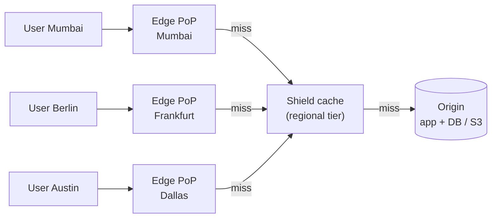
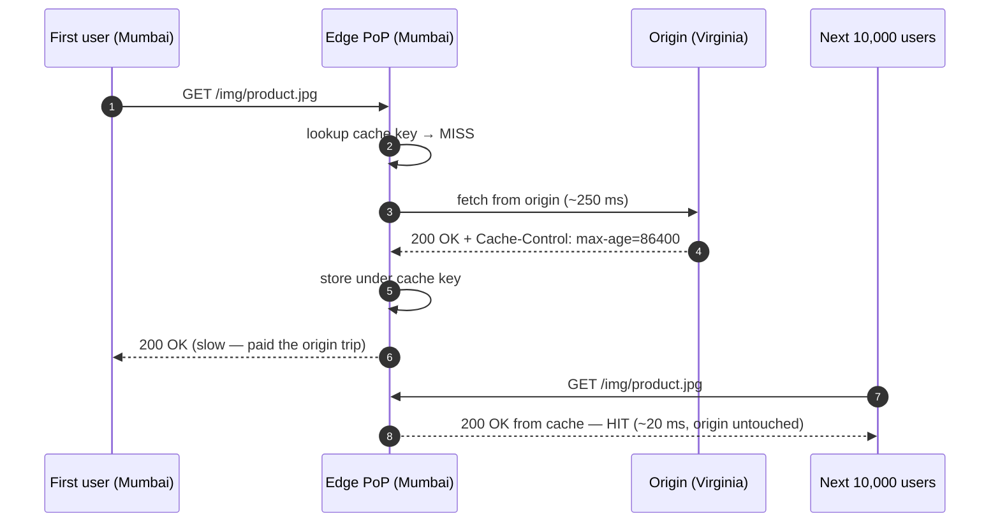
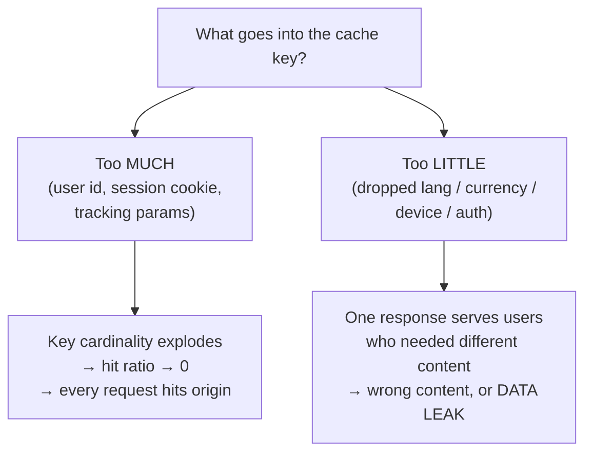
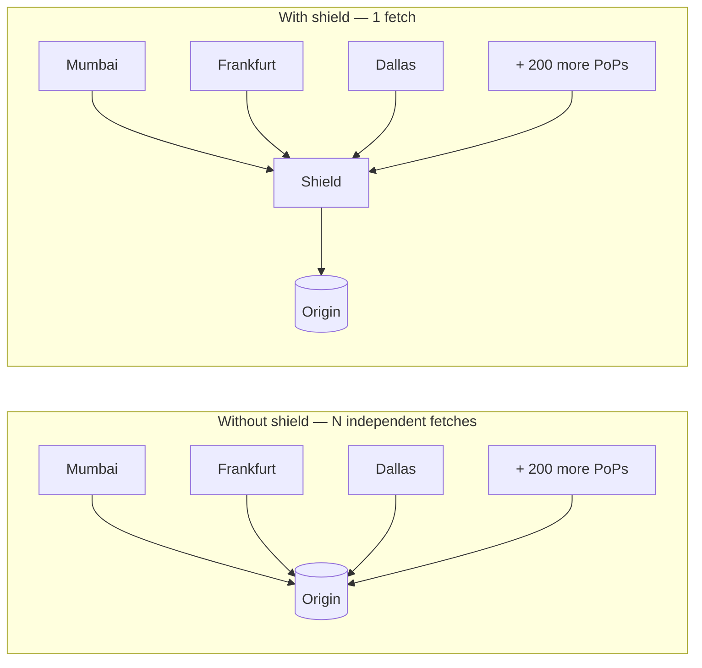
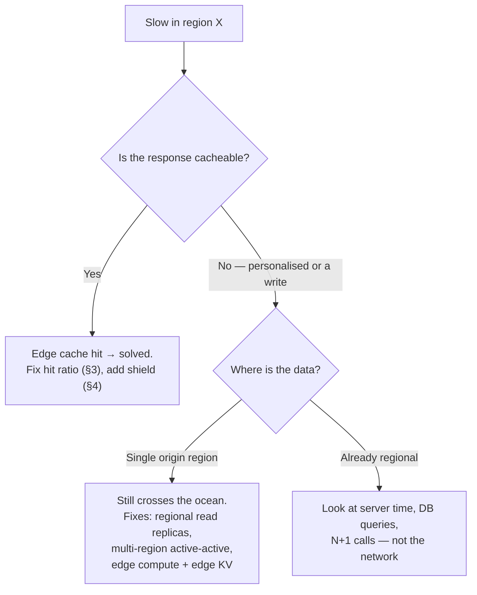
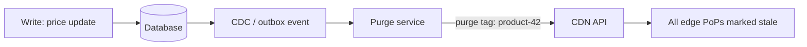

# CDN & The Edge — Interview-Ready Deep Dive

> **Purpose:** a CDN is the *only* layer that fixes the one thing you cannot optimise away in software — **the speed of light**. Interviewers use it to test whether you understand cache keys, invalidation, origin protection and global latency, or whether "I'll put a CDN in front" is a slogan.
>
> **Covers:** edge caching · cache keys · origin shielding · geo-performance · cache purge.
>
> **Companions:** [caching.md](caching.md) (the caching masterclass — layers, TTL, stampede) · [cache.md](cache.md) (quick reference) · [DNS.md](DNS.md) (anycast, GeoDNS, GSLB) · [latency.md](latency.md) (RTT numbers, bandwidth-delay product) · [load-balancer.md](load-balancer.md) (where the edge sits in the funnel) · [frontend-performance.md](frontend-performance.md) (Core Web Vitals impact) · [README.md](README.md)

---

## Index

| # | Topic | Section |
|---|---|---|
| 1 | The mental model: PoP, edge, shield, origin | [§1](#1-the-mental-model) |
| 2 | **Edge caching** — hit/miss flow, what to cache, hit-ratio math, edge TTLs | [§2](#2-edge-caching) |
| 3 | **Cache keys** — anatomy, cardinality, normalisation, the two symmetric mistakes | [§3](#3-cache-keys) |
| 4 | **Origin shielding** — tiered caching, fill amplification, request collapsing | [§4](#4-origin-shielding-tiered-caching) |
| 5 | **Geo-performance** — distance → latency math, anycast, what the edge cannot fix | [§5](#5-geo-performance) |
| 6 | **Cache purge** — purge by URL/tag, soft purge, versioned URLs, propagation | [§6](#6-cache-purge--invalidation) |
| 7 | All five together — a product page, end to end | [§7](#7-all-five-together--an-e-commerce-product-page) |
| 8 | Failure-mode catalogue | [§8](#8-failure-mode-catalogue) |
| ★ | What to say in the interview | [§9](#9-what-to-say-in-the-interview) |
| ★ | Rapid-fire Q&A | [§10](#10-rapid-fire-qa) |
| ★ | One-line summary + the library analogy | [§11](#11-summary--the-memory-trick) |

---

## 1. The Mental Model

A CDN is a **worldwide network of mini-warehouses** holding copies of your content close to users. Three tiers matter:

| Tier | Name | Where | Job |
|---|---|---|---|
| 1 | **Edge / PoP** (Point of Presence) | Hundreds of cities, usually inside or next to the user's ISP | Terminate TCP+TLS, serve cache hits, run edge logic |
| 2 | **Shield / regional tier** | A handful of large hubs, often near your origin | Absorb edge misses so the origin sees one request, not hundreds |
| 3 | **Origin** | Your data centre, S3 bucket, or load balancer | **Source of truth.** Should see the smallest possible fraction of traffic |



> ⭐ **The framing that scores:** *"A CDN is not 'a faster cache'. Redis optimises **memory vs disk**; a CDN optimises **network distance**. They sit at different layers and solve different problems — most real systems run both."* (see [caching.md §15.3](caching.md#153-cdn-vs-redis--they-are-not-the-same-thing))

**Vendor names to drop:** Cloudflare, Akamai, AWS CloudFront, Fastly, Google Cloud CDN, Bunny. Netflix runs its own — **Open Connect** appliances installed *inside ISP networks*, which is why a movie streams from a box a few hops away rather than from a Netflix data centre.

---

## 2. Edge Caching

### 2.1 The flow

**Without edge caching** every request crosses the planet:

```
User (India) ──────────────────────► Origin (USA)     ~250 ms per round trip
```

**With edge caching** only the *first* request does:



Every response should tell you which happened: `X-Cache: HIT`/`MISS` (CloudFront), `cf-cache-status`, plus `Age: 1200` = how long the edge has held it.

### 2.2 What actually belongs at the edge

| Content | Cacheable at edge? | Notes |
|---|---|---|
| Images, video segments, fonts | ✅ Trivially | The classic case. Long TTL + fingerprinted names |
| JS / CSS bundles | ✅ Trivially | `app.9f3c1a.js` + `max-age=31536000, immutable` |
| Public HTML (marketing, blog, docs, product pages) | ✅ | Needs a purge story — content changes |
| Public API responses (catalogue, search facets, config) | ✅ With short TTL | Even **5 s** of TTL collapses a traffic spike by orders of magnitude |
| Personalised HTML / `/me`, cart, order history | ❌ | Mark `Cache-Control: private`. Or split: cache the shell, stream the personal fragment (see [frontend-rendering.md](frontend-rendering.md)) |
| Anything behind `Authorization` | ❌ by default | CDNs bypass cache when auth headers are present — do **not** override this without a per-user cache key |
| Writes (`POST`/`PUT`/`DELETE`) | ❌ | Never cached; but they still benefit from **TLS termination at the edge** (§5.2) |

> ⭐ **The high-value, under-mentioned answer:** *"Micro-caching."* A 1–10 second TTL on a hot, non-personalised endpoint is invisible to users and turns 50,000 rps into ~1 rps at the origin. Bring this up when someone says "but my content is dynamic".

### 2.3 The only math you need

$$\text{origin QPS} = Q \times (1 - h)$$

| Total traffic $Q$ | Edge hit ratio $h$ | Origin QPS | Comment |
|---|---|---|---|
| 100,000 rps | 0 % | 100,000 | You must build for 100k |
| 100,000 rps | 90 % | 10,000 | Still a big fleet |
| 100,000 rps | 99 % | **1,000** | A modest cluster |
| 100,000 rps | 99.9 % | **100** | Origin is almost decorative |

> ⭐ **Say the sensitivity out loud:** *"Going from 90 % to 99 % hit ratio is not a 9 % improvement — it's a **10× reduction in origin load**. That's why cache-key hygiene (§3) matters more than any origin optimisation."*

### 2.4 The controls (all HTTP headers)

| Header | Effect at the edge |
|---|---|
| `Cache-Control: public, max-age=60` | Browser **and** CDN may cache for 60 s |
| `Cache-Control: s-maxage=600` | **Shared caches only** (the CDN). Lets you say "browser 60 s, edge 10 min" |
| `Cache-Control: private` | **Browser only** — the CDN must not store it. Your defence against cross-user leakage |
| `Cache-Control: no-store` | Nobody caches. Tokens, PII, banking |
| `stale-while-revalidate=30` | Serve stale instantly, refresh in the background → the HTTP answer to **cache stampede** |
| `stale-if-error=86400` | If the origin 5xx's, keep serving the stale copy → the CDN becomes an **availability** layer, not just a latency one |
| `Vary: Accept-Encoding` | Adds a request header to the cache key (§3) |
| `Surrogate-Control` / `Surrogate-Key` | CDN-only TTL and purge tags, stripped before reaching the browser |

Full header table and the 304/`ETag` revalidation flow: [caching.md §6.1](caching.md#61-browser--http-caching--the-headers-interviewers-ask-about).

> 🔥 **`stale-if-error` is the answer to "what happens when your origin is down?"** — a well-configured CDN keeps a read-only version of the site alive for hours.

---

## 3. Cache Keys

### 3.1 What a cache key is

The **unique label the CDN files a response under**. On every request it computes the key, looks it up, and answers **HIT** or **MISS**. It is the single most consequential CDN configuration you own.

Default key (roughly):

```
key = method + scheme + host + path + query-string + headers named in Vary
```

```
GET https://shop.com/product/123?ref=email
        └───────────────────────────────────┘
key →  GET|https|shop.com|/product/123|ref=email
```

### 3.2 The two symmetric mistakes — this is the whole topic



| Mistake | Symptom | Real incident shape |
|---|---|---|
| **Key too specific** — includes `?utm_source`, `?fbclid`, a session cookie, or a unique request id | Hit ratio collapses; origin melts under traffic it was already "protected" from | A marketing campaign appends 8 tracking params → 8 distinct cached copies of one page → 0 % hit ratio on launch day |
| **Key too generic** — ignores `lang`, `currency`, `country`, device class | Wrong content cached and fanned out to everyone | French users served English; EU users shown USD prices |
| **Key too generic + personalised response not marked `private`** | **The CDN serves user A's page to user B** | A genuine security incident — account data cross-served. This is the failure you must name |

> ⭐ **The line:** *"Cache-key design is a correctness problem before it's a performance problem. Anything that changes the response body must be in the key; anything that doesn't must be out of it. Then everything per-user gets `Cache-Control: private` so a key mistake can never become a data leak."*

### 3.3 Worked examples

**Distinct pages → distinct keys (the easy case)**

| Request | Key | Result |
|---|---|---|
| `/product/100` | `product-100` | cached separately |
| `/product/101` | `product-101` | cached separately |

**Language — the classic "must be in the key"**

| Request | Key includes `lang`? | Outcome |
|---|---|---|
| `/home?lang=en` | ✅ → `home-en` | correct |
| `/home?lang=fr` | ✅ → `home-fr` | correct |
| `/home?lang=fr` | ❌ → `home` | French users get whatever was cached first — **English** |

**Tracking params — the classic "must be out of the key"**

| Request | Naive key | Normalised key |
|---|---|---|
| `/article/42?utm_source=twitter` | separate copy | `article/42` |
| `/article/42?utm_source=email&fbclid=xyz` | separate copy | `article/42` |
| `/article/42` | separate copy | `article/42` |

Three copies of one identical article vs one. Fix: **query-parameter allowlist** — key on `?page` and `?sort`, ignore everything else. (Cloudflare "Cache Key" rules, CloudFront cache policies, Fastly VCL `req.url` normalisation.)

### 3.4 Normalisation rules worth stating

| Rule | Why |
|---|---|
| **Allowlist** query params, don't blocklist | New tracking params appear constantly; a blocklist is always behind |
| **Sort** remaining params (`?b=2&a=1` → `?a=1&b=2`) | Otherwise param order fragments the cache |
| Lowercase host; canonicalise trailing slash | `/About/` and `/about` should not be two entries |
| Collapse cookies to a **derived** value, never the raw cookie | `Vary: Cookie` is the most reliable way to destroy a hit ratio. Map "has session / no session" or "plan tier" into one small header at the edge and key on that |
| Bucket the device dimension | Key on `mobile` / `desktop`, never on the raw `User-Agent` (millions of distinct values) |
| Key on **country**, not on IP | `country=IN` has ~200 values; IP has billions |

> ⚠️ **`Vary: Accept-Encoding` is fine** (2–3 values). **`Vary: User-Agent` and `Vary: Cookie` are hit-ratio bombs.**

### 3.5 Cache poisoning — the security angle

If an **unkeyed** input can still change the cached response (an unkeyed header like `X-Forwarded-Host` reflected into the HTML, an unkeyed param reflected into a script src), an attacker sends one poisoned request and the CDN serves the malicious response to every subsequent user of that key.

**Defences:** never reflect unkeyed input into a cacheable response · keep the key and the response's true inputs identical · `private`/`no-store` on anything user-specific · strip untrusted hop-by-hop headers at the edge. See also [caching.md §16.2](caching.md#162-cache-security--three-risks-to-name).

---

## 4. Origin Shielding (Tiered Caching)

### 4.1 The problem it solves

A cache **hit** protects the origin. A cache **miss** does not — and you have hundreds of edge PoPs, each with its own independent cache. A brand-new or newly expired object is a miss **at every PoP simultaneously**.



**Origin shielding** designates one cache tier (usually a PoP near your origin) as the *only* one allowed to talk to the origin. Everyone else fills from the shield.

Vendor names: CloudFront **Origin Shield** · Cloudflare **Tiered Cache / Argo** · Fastly **Shielding** · Akamai **Tiered Distribution**.

### 4.2 The math

Two independent hit ratios multiply:

$$\text{origin load fraction} = (1 - h_{\text{edge}}) \times (1 - h_{\text{shield}})$$

| Layer | Traffic in | Hit ratio | Traffic out |
|---|---|---|---|
| Edge (all PoPs) | 100,000 rps | 90 % | 10,000 rps |
| Shield | 10,000 rps | 90 % | **1,000 rps** |
| Origin | 1,000 rps | — | **100× reduction** |

And for **cache fill amplification** on a single object with $N$ PoPs, TTL $T$, over a window $W$:

$$\text{origin fetches} \;=\; N \times \frac{W}{T} \quad\longrightarrow\quad \text{with shield}\; =\; 1 \times \frac{W}{T}$$

With $N = 200$ PoPs and a 60 s TTL, one hour of traffic on one URL = **12,000 origin fetches without a shield, 60 with one**.

### 4.3 Request collapsing (the other half of the answer)

Shielding fixes *fan-out across PoPs*. **Request collapsing / coalescing** fixes *fan-out within one PoP*: when 5,000 users hit the same missing key at the same edge, the CDN sends **one** request upstream and parks the rest.

> ⭐ **Say both:** *"Origin shielding deduplicates misses **across** PoPs; request collapsing deduplicates them **within** a PoP. Together they are the CDN-layer implementation of single-flight — the same idea as the mutex in cache-aside."* ([caching.md §13.1](caching.md#131-cache-stampede-thundering-herd) · [cache-aside-lld.md](cache-aside-lld.md))

### 4.4 Two examples

| Scenario | Without shield | With shield |
|---|---|---|
| **Viral news article** — millions of readers in India, Europe, the US within minutes | Every PoP independently asks the origin for the same article; the origin (a CMS + DB) falls over at exactly the moment traffic peaks | Shield fetches once, fans out to all PoPs. Origin sees ~1 request per TTL |
| **5 GB `app.zip` release day** | Hundreds of PoPs each pull 5 GB from origin = terabytes of origin egress before a single hit | One 5 GB pull; PoPs fill from the shield over the CDN's private backbone. **Origin egress bill drops by orders of magnitude** |

### 4.5 The trade-offs (name them — this is where senior candidates separate)

| Cost | Detail |
|---|---|
| **Extra hop on a miss** | Edge → shield → origin. Adds latency **only on misses**, and often *reduces* it because the CDN's private backbone beats the public internet |
| **New failure domain** | If the shield PoP degrades, everything queues behind it. Providers auto-fail-over to origin — verify your origin can absorb that |
| **Shield placement matters** | Put the shield in the region **closest to your origin**. A shield in Singapore for a Virginia origin adds a Pacific crossing to every miss |
| **Doesn't help unique content** | Shielding deduplicates *shared* objects. Per-user responses have per-user keys → nothing to deduplicate |

---

## 5. Geo-Performance

### 5.1 Why distance is the bottleneck

Light in fibre travels ~200,000 km/s (≈ ⅔ c). Minimum theoretical RTT:

$$RTT_{\min} = \frac{2d}{200{,}000\ \text{km/s}}$$

| Path | Distance | Theoretical RTT | Observed RTT |
|---|---|---|---|
| Within a data centre | — | ~0 | **0.5 ms** |
| New York → New York | ~0 | ~0 | **~20 ms** (last mile dominates) |
| London → Virginia | 5,900 km | 59 ms | **~80 ms** |
| Mumbai → Virginia | 13,000 km | 130 ms | **~250 ms** (routing is never a straight line) |
| Sydney → Virginia | 15,900 km | 159 ms | **~300 ms** |

**No amount of bandwidth fixes this.** More bandwidth = a wider pipe; latency = the length of the pipe. See [latency.md](latency.md).

### 5.2 The multiplier: round trips, not one trip

A cold HTTPS request is not one round trip:

| Step | Round trips |
|---|---|
| TCP handshake | 1 |
| TLS 1.3 handshake | 1 (TLS 1.2 = 2) |
| The HTTP request itself | 1 |
| **Total before first byte** | **~3 RTT** |

$$TTFB \approx (1 + n_{\text{handshake}}) \times RTT + T_{\text{server}}$$

| User | RTT | Cold TTFB (3 RTT) |
|---|---|---|
| Direct to origin, Mumbai → Virginia | 250 ms | **~750 ms before a single byte** |
| Via Mumbai edge (cache hit) | 20 ms | **~60 ms** |

> ⭐ **The insight most candidates miss:** *"Even for **uncacheable** requests the CDN wins, because the edge terminates TCP and TLS locally and keeps a warm, pre-established connection to the origin over an optimised backbone. You pay 3 short round trips plus 1 long one, instead of 3 long ones."*

### 5.3 How a user reaches the *nearest* edge

| Mechanism | How | Trade-off |
|---|---|---|
| **Anycast** ⭐ | One IP announced from every PoP; BGP routes to the topologically nearest | Instant failover, no DNS TTL problem. Used by Cloudflare |
| **GeoDNS / GSLB** | DNS returns a different IP per resolver location | Simple, but bound by **DNS TTL** and by resolver location ≠ user location (mitigated by EDNS Client Subnet) |

Detail in [DNS.md §6](DNS.md#6-dns-as-a-traffic-router-gslb).

### 5.4 What the edge does **not** fix



| Symptom | Real cause | Fix |
|---|---|---|
| Static assets fast, **API slow** in Asia | API is uncacheable and served from one region | Regional API deployments + read replicas; or move the read path to edge KV |
| Logged-in pages slow everywhere | Personalised HTML can't be cached | Cache the shell at the edge, stream personal fragments ([frontend-rendering.md](frontend-rendering.md)) |
| **Writes** slow far from origin | Writes must reach the primary | Accept it, make the UI optimistic, or shard by geography (data residency often forces this anyway) |
| Game lag in Singapore, server in California | Interactive latency ≠ content delivery | **Regional game servers.** A CDN cannot help a real-time bidirectional session |

### 5.5 Measuring geo-performance (say this, it's what real teams do)

| Method | What it gives you |
|---|---|
| **RUM** (Real User Monitoring) ⭐ | Actual field data. Slice **p75 TTFB / LCP by country and by ASN** — the aggregate p50 hides an entire continent |
| **Synthetic checks** from N regions | Reproducible regression detection, pre-launch |
| **CDN analytics** | Hit ratio, `Age`, origin offload **per PoP** — a single PoP with a bad hit ratio is a common, invisible bug |

> ⭐ **The line:** *"I'd never report one global latency number. Geo-performance is a **distribution**: p75 per region. A p50 of 120 ms can hide 900 ms for every user in Australia."*

---

## 6. Cache Purge / Invalidation

### 6.1 Why it exists

TTL says "this is good for 24 hours". Reality says "we shipped a fix 3 minutes ago". A **purge** evicts content from the CDN **before** it naturally expires: *forget the old version, fetch a fresh copy.*

Two motivating incidents:

| Incident | Without purge | With purge |
|---|---|---|
| **Logo / branding update** | Users keep seeing the old logo until the 24 h TTL expires | Purge `logo.png` → next request refetches → new branding immediately |
| **Pricing error — page cached showing `$99` instead of `$999`** | You sell at the wrong price for the rest of the TTL, globally | Purge the product page → correct price served worldwide in seconds |

### 6.2 The five options

| Method | Granularity | Speed | Use when |
|---|---|---|---|
| **TTL expiry** | per object | as slow as the TTL | Default. Tune the TTL first — most "purge" needs are really "the TTL was too long" |
| **Purge by URL** | one object | seconds, but must reach every PoP | Targeted fixes: one image, one page |
| **Purge by tag / surrogate key** ⭐ | a logical group | seconds | *"Everything showing product 42"* — the product page, the category page, the search fragment, the JSON API. **This is the grown-up answer** |
| **Purge everything** | the whole zone | seconds to issue, **minutes to recover** | Emergencies only — see the failure mode below |
| **Versioned / fingerprinted URLs** ⭐⭐ | n/a — you never purge | instant | **The best option: design purge away** |

### 6.3 Surrogate keys — how they work

The origin tags each response with the entities it depends on:

```
GET /product/42          →  Surrogate-Key: product-42 category-shoes
GET /category/shoes      →  Surrogate-Key: category-shoes product-42 product-99
GET /api/search?q=shoes  →  Surrogate-Key: category-shoes
```

Price changes on product 42 → one API call purges the tag `product-42` → **every** cached object that mentions it is invalidated, no matter what its URL was. This is the cache-invalidation analogue of a foreign key.

### 6.4 Soft purge (the safe default)

| | **Hard purge** | **Soft purge** ⭐ |
|---|---|---|
| Effect | Deletes the object | Marks it **stale** |
| Next request | MISS → waits for the origin | Serves stale **instantly**, revalidates in the background |
| Risk | A purge-all becomes a **thundering herd** on a cold cache | Origin refills gently |

> ⭐ **Failure mode to name:** *"`purge everything` on a high-traffic site is a self-inflicted DDoS — you drop the hit ratio to 0 % and send 100 % of traffic to an origin sized for 1 %. I'd use tag-based **soft** purge, and keep `stale-while-revalidate` on so the refill is gradual."*

### 6.5 Versioned URLs — design the problem away

```
/static/app.js                 → must be purged on every deploy
/static/app.9f3c1a2.js         → new deploy = new URL = nothing to purge
```

Pair with `Cache-Control: public, max-age=31536000, immutable`. The old object simply ages out. **No purge, no propagation delay, no stale-asset bug, and instant rollback** (point the HTML at the previous hash).

> This is why the correct answer to "how do you invalidate your JS bundle?" is **"I don't — I change its name."** The same trick works for images (`/img/logo.v3.png`) and for API payloads (`/v2/config`).

### 6.6 Purge is *not* instant — and other traps

| Trap | Detail |
|---|---|
| **Propagation** | The purge must reach every PoP. Typically < 1–5 s on modern CDNs, but it is **eventually consistent** — never build a correctness guarantee on "we purged it" |
| **The browser still has it** | Purging the CDN does nothing about the copy in 10 million browsers. If `max-age` was 24 h, users keep the old file. **Keep browser TTLs short and CDN TTLs long** (`max-age=60, s-maxage=86400`) — you can purge the CDN, you can't purge a laptop |
| **Purge storms** | An automated "purge on every write" on a hot entity = constant misses. Rate-limit purges, or shorten the TTL instead |
| **Race with the fill** | Purge, then an in-flight origin response lands and re-caches the *old* body. Purge **after** the write is committed and readable |
| **Rate limits & cost** | Providers cap purge API calls (and CloudFront charges beyond a free tier). Batch by tag |

### 6.7 Event-driven purge



Same pattern as CDC-driven cache invalidation for Redis ([distributed-systems.md](distributed-systems.md)) — the write path emits an event, a consumer purges. Never leave purging to a human remembering to click a button.

---

## 7. All Five Together — An E-commerce Product Page

```mermaid
sequenceDiagram
    autonumber
    participant U as User (Mumbai)
    participant E as Edge PoP (Mumbai)
    participant S as Shield (Virginia)
    participant O as Origin
    participant PS as Purge service

    Note over U,O: Launch — cold cache
    U->>E: GET /product/42?utm_source=email
    E->>E: normalise key → "product/42 + country=IN + lang=en" (utm dropped)
    E->>S: MISS
    S->>O: MISS (the ONLY origin request, for every PoP)
    O-->>S: 200 + s-maxage=300, stale-while-revalidate=60,<br/>Surrogate-Key: product-42
    S-->>E: fill
    E-->>U: 200 (first user pays; everyone after this is a HIT)

    Note over U,O: Steady state — 99% hit ratio, origin sees ~1 rps
    Note over U,O: Price changes
    PS->>E: purge tag "product-42" (soft)
    U->>E: GET /product/42
    E-->>U: stale copy served instantly
    E->>S: background revalidate → new price
```

| Concept | Its job in this flow |
|---|---|
| **Edge caching** | The page lives in Mumbai; Indian users get ~20 ms instead of ~250 ms |
| **Cache key** | `utm_source` dropped (protects hit ratio); `country`/`lang` included (protects correctness) |
| **Origin shielding** | 200 PoPs' misses collapse into one origin fetch |
| **Geo-performance** | India, Europe and the US all see comparable p75 — measured per region, not globally |
| **Cache purge** | Price/inventory change → tag purge → correct price everywhere in seconds |

---

## 8. Failure-Mode Catalogue

| Failure | Cause | Fix |
|---|---|---|
| Hit ratio stuck near 0 % | Tracking params / cookies / `User-Agent` in the cache key | Query-param allowlist, derived cookie header, device bucketing (§3.4) |
| **User A's page served to user B** | Personalised response cached publicly with a too-generic key | `Cache-Control: private` on everything per-user; audit `Set-Cookie` on cacheable responses |
| Origin melts on a viral event | Miss fan-out across PoPs | Origin shield + request collapsing (§4) |
| Origin melts right after a deploy | `purge everything` on a cold cache | Tag-based **soft** purge + `stale-while-revalidate` (§6.4) |
| Users still see the old asset after a purge | The **browser** cache, not the CDN | Short `max-age` + long `s-maxage`; fingerprinted filenames (§6.5) |
| Site down when the origin is down | No stale-serving configured | `stale-if-error` (§2.4) |
| One region is slow, others fine | Uncacheable/dynamic path served from a single origin region | Regional replicas, edge compute, or accept and measure (§5.4) |
| Cached page shows attacker content | Cache poisoning via unkeyed input | Never reflect unkeyed input into cacheable responses (§3.5) |
| Cache stampede at TTL expiry | Everything expires simultaneously | TTL jitter + `stale-while-revalidate` ([caching.md §13.3](caching.md#133-cache-avalanche)) |

---

## 9. What to Say in the Interview

**When to bring the CDN up:** the moment requirements mention **global users**, **images/video**, **traffic spikes**, or **a read-heavy public surface**. Bring it up *before* you optimise the database — it removes most of the traffic.

**The 6-question checklist:**

| # | Question | Why it matters |
|---|---|---|
| 1 | What fraction of traffic is **cacheable**? | Sets the ceiling on everything else |
| 2 | What is in the **cache key**? | Correctness first, hit ratio second |
| 3 | What TTL — and can I serve **stale** while revalidating / on error? | Latency *and* availability |
| 4 | How do misses **fan out**? Shield + collapsing? | Origin protection |
| 5 | How do I **invalidate**? Tags, versioned URLs, or just a short TTL? | The hard part of caching |
| 6 | How do I **measure it per region**? | p75 by country, hit ratio per PoP |

**Three lines that land:**

> *"A CDN optimises network **distance**; Redis optimises **memory vs disk**. Different layers, different problems — I'd use both."*

> *"Cache-key design is a correctness problem before it's a performance problem — anything that changes the body is in the key, everything per-user is `private`."*

> *"I'd rather design purge away with versioned URLs than operate a purge pipeline. Where content must stay at a stable URL, I use surrogate-key soft purge driven by a CDC event — never a `purge everything`."*

---

## 10. Rapid-Fire Q&A

<details>
<summary><b>Isn't a CDN just for static assets?</b></summary>

No. Modern CDNs cache public API responses and HTML, run **edge compute** (Workers / Lambda@Edge), terminate TLS, absorb DDoS, and serve stale content when the origin is down. Even for fully uncacheable requests you win by terminating TCP/TLS near the user and reusing a warm connection to the origin (§5.2).
</details>

<details>
<summary><b>My content is dynamic — how can I cache it?</b></summary>

Three answers, in order: **(1) micro-caching** — even a 1–5 s TTL collapses a spike by orders of magnitude; **(2) split the response** — cache the generic shell, stream the personalised fragment; **(3) `stale-while-revalidate`** — users always get an instant response, freshness lags by seconds.
</details>

<details>
<summary><b>Why is my hit ratio low?</b></summary>

In order of likelihood: tracking query params in the key · `Vary: Cookie` or `Vary: User-Agent` · `Set-Cookie` on a response (many CDNs refuse to cache it) · TTL shorter than the request inter-arrival time at a PoP · long-tail content that's genuinely only requested once per PoP (this is what a shield fixes) · `Authorization` header present.
</details>

<details>
<summary><b>Edge cache vs origin shield vs origin — how many layers is too many?</b></summary>

Three is the standard shape, and each has a distinct job: the edge owns **latency**, the shield owns **origin protection**, the origin owns **truth**. Adding a fourth rarely pays; the real lever is hit ratio at layer one.
</details>

<details>
<summary><b>How fast is a purge?</b></summary>

Usually sub-second to a few seconds to reach all PoPs — but it is **eventually consistent**, and it does nothing for copies already in browsers. Design so that a slow purge is an inconvenience, never a correctness bug.
</details>

<details>
<summary><b>Purge-by-URL or purge-by-tag?</b></summary>

Tag. One entity typically appears in many URLs (page, category page, search JSON, sitemap). Tags let one write invalidate all of them; URL purging requires you to *know* every URL, and you never do.
</details>

<details>
<summary><b>What breaks if the CDN itself goes down?</b></summary>

Everything, unless you planned: a **second CDN** with DNS/multi-CDN steering, or a documented origin-direct failover — and an origin that can survive 0 % offload for the time it takes to fail over. Naming the CDN as a **single point of failure** is a strong senior signal.
</details>

<details>
<summary><b>Where does the CDN sit relative to the load balancer?</b></summary>

In front of everything: `DNS → anycast edge → DDoS scrubbing → CDN cache → GSLB → regional L4 LB → L7 LB → service`. See [load-balancer.md](load-balancer.md).
</details>

---

## 11. Summary + the Memory Trick

| Concept | In one sentence |
|---|---|
| **Edge caching** | Store content on CDN servers close to users so most requests never reach the origin |
| **Cache key** | The unique label used to find cached content — too specific kills the hit ratio, too generic serves the wrong content |
| **Origin shielding** | An extra cache tier so hundreds of PoPs' misses become **one** origin request |
| **Geo-performance** | How fast the site is *per region* — bounded by the speed of light and the number of round trips |
| **Cache purge** | Evicting content before its TTL expires so users get the fresh version now |

**The library analogy** (use it if the interviewer wants intuition, then immediately give the numbers):

| CDN | Library |
|---|---|
| Edge cache | Your local branch keeps copies of popular books |
| Cache key | The ISBN — one label per distinct edition |
| Origin shield | The regional hub that supplies all local branches, so the publisher ships once |
| Geo-performance | How far you have to travel to the nearest branch |
| Cache purge | Pulling an outdated edition off every shelf and replacing it |

> ⭐ **Closing line:** *"Every layer of caching buys latency and origin relief, and charges you in staleness. The CDN charges the most because it's the furthest from your control — so the design work is all in the cache key and the invalidation story, not in turning it on."*
