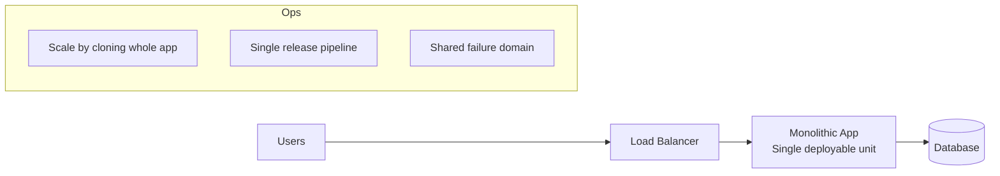
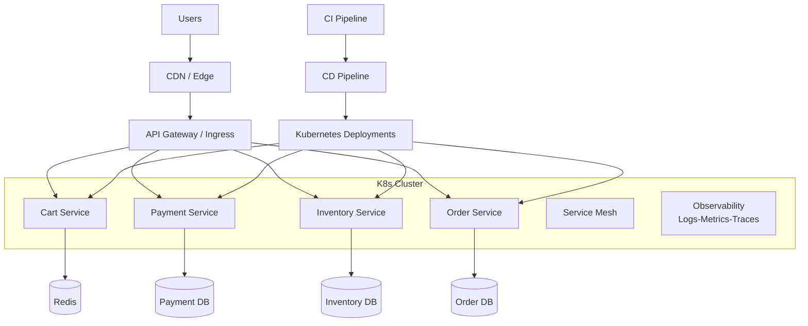
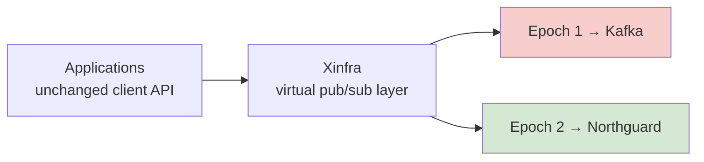

# Cloud Native: Interview-Ready Summary

Source video: ByteByteGo (What is Cloud Native?)

> **Related notes in this repo:** [distributed-systems.md](distributed-systems.md) (service discovery, consensus, resilience patterns, observability) · [high-level-system-design-cocept.md](high-level-system-design-cocept.md) (architectural patterns) · [networking.md](networking.md) · [databases.md](databases.md) · [system-design-interview-playbook.md](system-design-interview-playbook.md) · [README.md](README.md)

## 1. Core Message of the Video

Cloud Native is not just about running software in the cloud. It is a blueprint for building web-scale systems that are:
- more scalable,
- more available,
- and faster to evolve (high deployment agility) without sacrificing reliability.

The video emphasizes that there is no single universal definition of Cloud Native, but there is a practical interpretation based on widely accepted engineering patterns.

## 2. Cloud Native vs Cloud Computing

### Cloud Computing (baseline)

Cloud Computing means using cloud provider managed infrastructure (compute, storage, networking) instead of owning physical hardware.

Benefits:
- No hardware procurement and maintenance.
- Fast infrastructure provisioning.
- Easier vertical/horizontal scaling compared to on-prem.

### Cloud Native (next level)

Cloud Native is an application and operations model designed specifically to exploit cloud properties.

Key point:
- Moving a monolith from on-prem to cloud is Cloud Computing.
- It is not automatically Cloud Native.

Interview one-liner:
- Cloud Computing is where you run.
- Cloud Native is how you design, build, deploy, and operate.

## 3. Why Cloud Native Exists (Promises)

Cloud Native aims to solve the classic scale-speed-reliability tension:
- Ship features quickly.
- Keep systems highly available.
- Scale components independently as demand changes.

In other words, it improves business responsiveness while maintaining operational stability.

## 4. The 4 Pillars of Cloud Native (as presented in the video)

## 4.1 Pillar 1: Application Architecture (Microservices)

Traditional approach:
- Monolith: one large codebase and often one deployable unit.
- Harder to develop, test, deploy, and scale independently.

Cloud Native approach:
- Break large system into small, focused microservices.
- Each service has clear ownership.
- Services are loosely coupled and communicate through well-defined APIs.
- Teams can deploy and scale each service independently.

Example from video:
- E-commerce app split into shopping cart, payment, and inventory services.

Interview value:
- Improves team autonomy and release velocity.
- Enables targeted scaling (scale payment without scaling entire app).

## 4.2 Pillar 2: Containers and Orchestration

Containers:
- Lightweight packaging unit with app + dependencies.
- Improves portability and consistency across environments.

Why orchestration is required:
- At scale, you may run hundreds/thousands of containers.
- You need automated scheduling, health management, and traffic balancing.

Kubernetes role (video highlight):
- Places containers on nodes.
- Detects failures and heals/restarts workloads.
- Balances load across services.
- Lets many microservices run as one cohesive platform.

Interview value:
- Containers solve packaging portability.
- Kubernetes solves operational complexity at fleet scale.

## 4.3 Pillar 3: Development Process (DevOps + CI/CD)

Because services are independently built and deployed, organizations need:
- tight collaboration between Dev and Ops,
- strong automation for build, test, and release.

DevOps in this context:
- A practice emphasizing collaboration, communication, and automation to deliver reliably and quickly.

CI/CD details from transcript:
- CI: frequently merge code, run automated tests to validate changes.
- CD: automate deployment through pipelines to deliver faster and safer.

Interview value:
- Cloud Native is as much an organizational/process shift as a technology shift.

## 4.4 Pillar 4: Open Standards and Ecosystem Adoption

As ecosystem matures, common platform capabilities become standardized.

Cloud Native means adopting these standards instead of reinventing infrastructure primitives.

Examples mentioned:
- Orchestration: Kubernetes.
- Distributed tracing/observability: Jaeger, Zipkin, OpenTelemetry.
- Service mesh: Istio, Linkerd.

Outcome:
- Teams avoid rebuilding generic concerns (tracing, discovery, traffic management).
- Engineers focus on business logic.

Interview value:
- Standardization reduces vendor lock-in risk and improves interoperability.

## 5. Observability and Service Communication (Implicit Deep Point)

With microservices, request paths become distributed and complex.

That creates two needs:
- Observability to understand cross-service behavior (tracing).
- A communication control layer (service mesh) for traffic, security, and resilience policies.

Interview articulation:
- Monolith complexity is mostly code complexity.
- Microservice complexity shifts into distributed systems and operations complexity.

## 6. Should You Go Cloud Native?

Video answer: It depends.

When Cloud Native may be unnecessary:
- Small, simple applications.
- Low scale and low rate of change.
- Team/process maturity not ready for distributed systems overhead.

When Cloud Native is beneficial:
- Large and complex applications.
- High scale, high availability requirements.
- Need for frequent independent deployments.
- Multi-team ownership and rapid product iteration.

Decision should consider:
- Application requirements.
- Organizational resources and skills.

## 7. Practical Trade-offs (Great for Interview Discussion)

Benefits:
- Better scalability through independent service scaling.
- Better resilience and availability patterns.
- Faster release cycles through team autonomy and CI/CD.
- Better operational consistency with containers and standards.

Costs and risks:
- Higher architectural complexity.
- Distributed debugging difficulty.
- More operational tooling and platform engineering investment.
- Need for strong observability and automation culture.

Balanced statement:
- Cloud Native is not automatically better; it is better for the right scale and complexity profile.

## 8. Interview Cheat Sheet (High-Probability Questions)

Q1: What is Cloud Native?
- A way to build and run scalable, resilient, cloud-optimized applications using microservices, containers, orchestration, DevOps/CI/CD, and open standards.

Q2: How is Cloud Native different from Cloud Computing?
- Cloud Computing is using cloud infrastructure.
- Cloud Native is architecting and operating software to fully leverage cloud dynamics.

Q3: Is lifting a monolith to cloud Cloud Native?
- No. That is cloud migration. Cloud Native requires architecture/process/platform changes.

Q4: What are the main pillars?
- Microservices architecture, containers + orchestration, DevOps + CI/CD process, and open standards ecosystem adoption.

Q5: Why is Kubernetes central?
- It automates placement, scaling, recovery, and load balancing of containers at scale.

Q6: Why is tracing important?
- In microservices, one user request spans multiple services. Tracing provides end-to-end visibility.

Q7: When should we avoid Cloud Native?
- For simple low-scale systems where overhead of microservices/platform complexity outweighs benefits.

Q8: What organizational change is required?
- Strong DevOps culture and automation-first delivery pipelines.

## 9. 60-Second Interview Pitch

Cloud Native is an engineering model for building web-scale systems that remain agile and reliable under growth. It goes beyond just hosting apps in cloud infrastructure. The core pillars are microservices architecture, containerization with orchestration like Kubernetes, DevOps with CI/CD automation, and adoption of ecosystem standards like OpenTelemetry and service mesh. The model enables independent scaling and deployment, but it also introduces distributed systems complexity. So adoption should be based on application scale, complexity, and team maturity rather than trend-following.

## 10. Final Takeaway

Cloud Native is best viewed as a strategy, not a tool choice:
- architecture + platform + process + standards,
- chosen deliberately when business speed and system scale justify the additional complexity.

## 11. Interview Diagrams (Monolith vs Cloud Native)

### 11.1 Monolith on Cloud (Cloud Computing, Not Fully Cloud Native)



Use this when explaining lift-and-shift:
- Faster migration to cloud infrastructure.
- Lower migration effort initially.
- But scaling and deployments are coarse-grained.

### 11.2 Cloud Native Microservices Stack



Talking points:
- Independent deployments per service.
- Independent scaling per bottleneck.
- Requires stronger platform, observability, and operational maturity.

### 11.3 Decision Flow: Should We Go Cloud Native?

```mermaid
flowchart TD
		A[Start] --> B{Is system simple\nand small-scale?}
		B -- Yes --> C[Prefer monolith or modular monolith\nwith basic cloud deployment]
		B -- No --> D{Need frequent independent\nreleases across teams?}
		D -- No --> E[Use simpler architecture\nwith selective cloud services]
		D -- Yes --> F{Do we have DevOps/Platform\nreadiness for automation?}
		F -- No --> G[Build CI/CD, observability, SRE\ncapability first]
		F -- Yes --> H[Adopt Cloud Native incrementally\n(start with a few services)]
```

Interview tip:
- Avoid "all-in" framing. Say "incremental adoption based on bottlenecks and team readiness."

## 12. Scenario-Based Interview Answers

## 12.1 Scenario A: Early-Stage Startup

Question:
- "We are a startup with one product team and moderate traffic. Should we go Cloud Native now?"

Model answer:
- I would not start with full microservices on day one. I would choose a well-structured modular monolith deployed on cloud infrastructure with strong CI/CD, monitoring, and containerization basics. This gives fast delivery with low operational overhead. I would define module boundaries and APIs early so we can extract services later if scaling hotspots emerge.

Why this is strong:
- Shows pragmatism.
- Avoids premature distributed complexity.
- Keeps migration path open.

## 12.2 Scenario B: Mid-Size Product with Rapid Growth

Question:
- "Traffic is growing fast, and multiple teams are blocked by monolith release coupling. What would you do?"

Model answer:
- I would adopt Cloud Native incrementally. First identify high-change and high-scale domains, for example checkout and catalog, and extract them as microservices behind clear APIs. Run them on Kubernetes with per-service CI/CD pipelines. Introduce distributed tracing and service-level SLOs before broad rollout. Keep low-change modules in the monolith until there is a clear business need to split them.

Why this is strong:
- Prioritizes business bottlenecks.
- Reduces migration risk.
- Connects architecture changes to measurable outcomes.

## 12.3 Scenario C: Enterprise with Strict Compliance and Reliability Needs

Question:
- "How would Cloud Native help a regulated enterprise where uptime and auditability are critical?"

Model answer:
- Cloud Native can help by standardizing deployments, observability, and policy enforcement. I would use Kubernetes-based deployment controls, GitOps-style change traceability, and centralized telemetry with OpenTelemetry for end-to-end audit trails. Service mesh can enforce mTLS and traffic policies consistently. I would pair this with staged rollouts, disaster recovery drills, and clear SLO/error budget governance to balance velocity and compliance.

Why this is strong:
- Addresses security, compliance, and operability.
- Shows platform-level controls, not just app-level coding.

## 12.4 Scenario D: "Why Not Stay on a Monolith Forever?"

Question:
- "Monolith works today. Why change?"

Model answer:
- If the monolith meets current scale, reliability, and release-speed goals, we should keep it. Architecture should follow constraints, not trends. I would move to Cloud Native only when we observe clear pain: independent scaling needs, multi-team release conflicts, or reliability issues caused by a single failure domain. Until then, invest in modular boundaries and automation to preserve optionality.

Why this is strong:
- Shows engineering judgment.
- Demonstrates cost-awareness.

## 12.5 Scenario E: "Big-Bang vs Incremental Migration"

Question:
- "Should we rewrite everything as microservices?"

Model answer:
- I would avoid a big-bang rewrite. I prefer incremental extraction using domain boundaries, for example strangler pattern. Build a platform baseline first: CI/CD, secrets management, observability, and runtime standards. Then migrate one domain at a time with measurable success criteria such as deployment frequency, p95 latency, MTTR, and availability improvements.

Why this is strong:
- Lowers delivery risk.
- Preserves business continuity.

## 12.6 Quick "Use in Interview" Answer Starters

- "I would decide based on scale, team topology, and release coupling, not just technology preference."
- "Cloud Native gives independent deployability, but only if automation and observability maturity are in place."
- "For small systems, a modular monolith on cloud is often the best engineering-economic choice."
- "I would adopt Cloud Native incrementally, starting from the highest business bottleneck."

---

## 13. Real-World Case Studies — platform engineering at Uber and LinkedIn

> **Sources:** Uber — *[CacheFront](https://www.uber.com/en-US/blog/how-uber-serves-over-40-million-reads-per-second-using-an-integrated-cache/)*, *[Intelligent load management](https://www.uber.com/in/en/blog/from-static-rate-limiting-to-intelligent-load-management/)*, *[gRPC in OpenSearch](https://www.uber.com/in/en/blog/high-performance-grpc/)* · LinkedIn — *[Northguard and Xinfra](https://www.linkedin.com/blog/engineering/infrastructure/introducing-northguard-and-xinfra)*.
>
> These four posts are, between them, a syllabus in **platform engineering** — the discipline this file describes at a conceptual level.

## 13.1 The platform argument, stated by the people who lived it

Uber's motivation for building CacheFront is the clearest justification for a platform team you will read. Before it, every microservice team ran its own cache:

| Symptom of *no* platform | Consequence |
|---|---|
| *"Each team has to provision and maintain their own Redis cache for their respective services"* | N teams doing infrastructure work that is not their product |
| *"Cache invalidation logic is implemented decentrally within each microservice"* | The hardest problem in the system, solved N times, wrong in N different ways |
| *"In case of region failover, services either have to maintain caching replication to stay hot or suffer higher latencies"* | Every team independently re-derives a disaster-recovery strategy |

Their stated goals read like a platform-team charter:

- *"Replace most of the custom-built caching solutions that were (or will be) built by the individual teams… especially in the cases where **caching is not the core business or competency of the team**."*
- *"Make it **transparent** by reusing existing Docstore client **without any additional boilerplate**."*
- *"Increase developer productivity and allow us to release new features or **replace the underlying caching technology transparently** to customers."*
- *"**Move ownership for maintaining and on-calling Redis from feature teams to the Docstore team**."*

> ⭐ **Say this:** *"A platform is worth building when the same non-differentiating problem is being solved by every product team, badly. The three tests I'd apply are: is it transparent — do teams get it without changing their code; does it move the on-call pager to the people who understand it; and can the implementation be swapped underneath without a migration. Uber's integrated cache passes all three, which is why it replaced dozens of bespoke Redis deployments."*

The counter-signal matters too: they made it **opt-in per database, per table and per request**, and let flows that need strong consistency bypass it. A platform that forces one policy on everyone gets routed around.

## 13.2 Operability as a first-class design goal

LinkedIn's Kafka pain was overwhelmingly **operational**, not performance-related:

> *"Added traffic led to load balancing challenges, and with the over 100 clusters we were now running, we now needed **an ecosystem of services just to manage all the clusters**."*

Northguard was designed so that the operational work **disappears** rather than being automated:

| Operational task | Kafka | Northguard |
|---|---|---|
| Keep data evenly distributed | External service (Cruise Control) | **Balanced by design** — new segments naturally land on new brokers |
| Add a broker | External service migrates existing data onto it | **No data movement needed** |
| Restore replication factor after a failure | External service | **Self-healing** — the metadata coordinator initiates re-replication |
| Number of clusters to operate | Baseline | **80%+ fewer** |
| Deploy builds/configs safely | Scales with cluster size | **Constant time regardless of cluster size**, via placement policies |

> ⭐ **The distinction worth making:** *"Automating toil and eliminating toil are different maturity levels. A rebalancer service is automation; a data model where the cluster balances itself is elimination. When I evaluate a platform choice I ask which of the two I'm buying, because automation is a system I now have to operate as well."*

Note the deploy point especially — it belongs in the [§4.3 DevOps](#43-pillar-3-development-process-devops--cicd) discussion. LinkedIn encodes **broker attributes** (rack, DC, deploy group) and expresses replica placement as **constraints over those attributes**. The same abstraction that gives rack-aware replication also guarantees that a rolling deploy never takes down a quorum — *"in constant time regardless of cluster size."*

## 13.3 Testing distributed systems — deterministic simulation

The strongest answer to *"how do you test a cloud-native system?"* — far better than "we have integration tests":

> *"We run Northguard under **deterministic simulation**. This means we run a cluster as well as clients **under a single thread** and swap out nondeterministic components with deterministic versions of them. We **simulate years of activity under various scenarios every day**."*

Faults injected into the simulation:

| Category | Injected fault |
|---|---|
| Process | Broker shutdown · rolling restarts |
| Network | Network partition · packet loss · packet corruption |
| Storage | Disk corruption · disk I/O errors |
| Change | Config deployments |

The payoff is the part people miss: *"We can easily **share, replay, and step through failed runs**, and this helps us catch bugs before they happen in production."* A chaos experiment in production gives you an incident and a hypothesis; a deterministic simulation gives you a **reproducible test case you can attach to a debugger**.

> ⭐ **Say this:** *"Chaos engineering in production is necessary but it's the last line, not the first. If the fault injection runs in a deterministic simulation, a failure becomes a seed number you can replay in a debugger. That's the difference between 'we test resilience' and 'we can reproduce the resilience bug'."*

## 13.4 Observability — instrument the *decision*, not just the outcome

Two examples that raise the bar above "we have dashboards":

| System | What they instrumented | Why it's unusual |
|---|---|---|
| **CacheFront "compare cache"** | A shadow mode that mirrors reads to the cache and **compares cached data against the database**, logging and emitting every mismatch as a metric. Result: **99.99% measured consistency** | Most teams monitor hit rate and latency. Almost nobody monitors **correctness**. *"All this talk about improving consistency means nothing if it's not measurable."* |
| **Uber's load manager** | *"Track **what's being shed, why it's being shed, and how each component contributes to system pressure**."* | The shedder explains its own decisions. Without that, an on-call engineer sees 429s and has no idea which of six signals fired |

Both are the practical version of [§5 Observability](#5-observability-and-service-communication-implicit-deep-point): metrics on the *business invariant* (is my cache correct?) and on the *control loop* (why did the system reject that request?), not just on CPU and latency.

## 13.5 Migration strategy — virtualize first, then migrate underneath

LinkedIn had to move **thousands of applications**, several hundred thousand topics and hundreds of clusters — with **zero downtime** and without handling each application individually.



| Step | Detail |
|---|---|
| **1. Insert an abstraction** | Xinfra virtualizes topics so a topic is no longer tied to one physical cluster. **90%+ of applications** were moved onto Xinfra clients *before* any migration |
| **2. Give the abstraction a versioned history** | A virtual topic has **epochs** — one epoch in Kafka, the next in Northguard. Users never change the topic name |
| **3. Migrate producers first, with dual writes** | *"Producers perform **dual writes** during the migration period to allow a safe rollback in case of migration failure."* Ordering guarantees are preserved throughout |
| **4. Migrate consumers** | They can still read back through older epochs until retention expires |
| **5. Turn off dual writes last** | The final, and only irreversible, step |

This is the **strangler pattern** ([§12.5](#125-scenario-e-big-bang-vs-incremental-migration)) applied to infrastructure rather than to application code, and it's the answer to *"how do you replace a system everyone depends on?"* — **you don't migrate the consumers, you migrate underneath them.** Result: thousands of topics moved, **trillions of records/day**, no application downtime.

Uber's gRPC work used the same shape at the API layer: the new transport ships as a **module on separate ports alongside REST**, sharing all internal logic, *"enabling teams to migrate incrementally rather than all at once."*

## 13.6 Open standards and upstreaming — the fourth pillar, done properly

[§4.4](#44-pillar-4-open-standards-and-ecosystem-adoption) argues for open standards. Uber's gRPC work is what that looks like in practice, and it's a good story to have ready:

> *"We designed and implemented native gRPC support **directly in OpenSearch** to avoid maintaining long-term forks or translation layers. This approach ensured that the solution would benefit from Uber's production workloads and the broader OpenSearch community."*

They also **contributed conversion rules upstream to OpenAPI Generator** rather than keeping them internal. The engineering argument is unsentimental: a fork is a permanent tax, and a private translation layer is a permanent tax plus a permanent latency cost. Upstreaming converts both into shared maintenance.

The automation they built around it is a good CI/CD talking point too — a three-stage pipeline (**preprocess → convert → postprocess**) that regenerates Protobuf definitions from the OpenAPI spec and **gates every change on a wire-compatibility check** against previously generated messages, because *"Protobuf APIs can't tolerate changes such as field renumbering without breaking existing clients."* Contract compatibility enforced in CI, not in code review.

## 13.7 The lessons, condensed

| Lesson | Source |
|---|---|
| **Build a platform when N teams are badly solving the same non-differentiating problem** — and measure success by whether the pager moved | Uber, CacheFront |
| **Make platform adoption transparent and opt-in per request**, or teams will route around it | Uber, CacheFront |
| **Prefer eliminating operational work to automating it** | LinkedIn, Northguard |
| **Encode topology (racks, DCs, deploy groups) as data**, then express placement as constraints over it | LinkedIn, storage policies |
| **Fault injection belongs in a deterministic simulation first**, production chaos second | LinkedIn, deterministic simulation |
| **Instrument correctness and control-loop decisions**, not only latency and errors | Uber, compare-cache + shedding metrics |
| **Virtualize, then migrate underneath; dual-write for rollback; remove the old path last** | LinkedIn, Xinfra |
| **Upstream instead of forking**, and gate contract compatibility in CI | Uber, OpenSearch gRPC |

> ⭐ **Closing line:** *"Cloud native isn't containers and Kubernetes — those are implementation details. It's whether a product team can ship a change safely without understanding the infrastructure underneath it. Every one of these case studies is the same move: take a hard cross-cutting problem out of N product teams, solve it once in a platform, make adoption transparent and reversible, and prove it works with measurement rather than assertion."*


