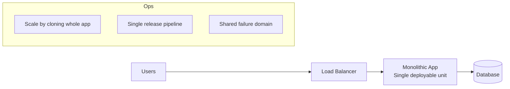
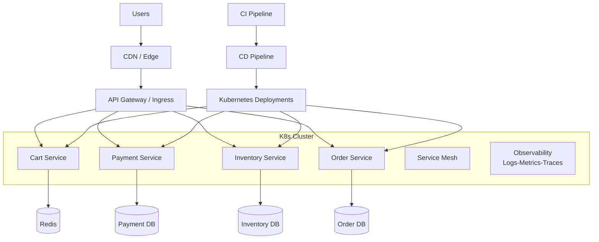

# Cloud Native: Interview-Ready Summary

Source video: ByteByteGo (What is Cloud Native?)

## 1. Core Message of the Video

Cloud Native is not just about running software in the cloud. It is a blueprint for building web-scale systems that are:
- more scalable,
- more available,
- and faster to evolve (high deployment agility) without sacrificing reliability.

The video emphasizes that there is no single universal definition of Cloud Native, but there is a practical interpretation based on widely accepted engineering patterns.

## 2. Cloud Native vs Cloud Computing

### Cloud Computing (baseline)

Cloud Computing means using cloud provider managed infrastructure (compute, storage, networking) instead of owning physical hardware.

Benefits:
- No hardware procurement and maintenance.
- Fast infrastructure provisioning.
- Easier vertical/horizontal scaling compared to on-prem.

### Cloud Native (next level)

Cloud Native is an application and operations model designed specifically to exploit cloud properties.

Key point:
- Moving a monolith from on-prem to cloud is Cloud Computing.
- It is not automatically Cloud Native.

Interview one-liner:
- Cloud Computing is where you run.
- Cloud Native is how you design, build, deploy, and operate.

## 3. Why Cloud Native Exists (Promises)

Cloud Native aims to solve the classic scale-speed-reliability tension:
- Ship features quickly.
- Keep systems highly available.
- Scale components independently as demand changes.

In other words, it improves business responsiveness while maintaining operational stability.

## 4. The 4 Pillars of Cloud Native (as presented in the video)

## 4.1 Pillar 1: Application Architecture (Microservices)

Traditional approach:
- Monolith: one large codebase and often one deployable unit.
- Harder to develop, test, deploy, and scale independently.

Cloud Native approach:
- Break large system into small, focused microservices.
- Each service has clear ownership.
- Services are loosely coupled and communicate through well-defined APIs.
- Teams can deploy and scale each service independently.

Example from video:
- E-commerce app split into shopping cart, payment, and inventory services.

Interview value:
- Improves team autonomy and release velocity.
- Enables targeted scaling (scale payment without scaling entire app).

## 4.2 Pillar 2: Containers and Orchestration

Containers:
- Lightweight packaging unit with app + dependencies.
- Improves portability and consistency across environments.

Why orchestration is required:
- At scale, you may run hundreds/thousands of containers.
- You need automated scheduling, health management, and traffic balancing.

Kubernetes role (video highlight):
- Places containers on nodes.
- Detects failures and heals/restarts workloads.
- Balances load across services.
- Lets many microservices run as one cohesive platform.

Interview value:
- Containers solve packaging portability.
- Kubernetes solves operational complexity at fleet scale.

## 4.3 Pillar 3: Development Process (DevOps + CI/CD)

Because services are independently built and deployed, organizations need:
- tight collaboration between Dev and Ops,
- strong automation for build, test, and release.

DevOps in this context:
- A practice emphasizing collaboration, communication, and automation to deliver reliably and quickly.

CI/CD details from transcript:
- CI: frequently merge code, run automated tests to validate changes.
- CD: automate deployment through pipelines to deliver faster and safer.

Interview value:
- Cloud Native is as much an organizational/process shift as a technology shift.

## 4.4 Pillar 4: Open Standards and Ecosystem Adoption

As ecosystem matures, common platform capabilities become standardized.

Cloud Native means adopting these standards instead of reinventing infrastructure primitives.

Examples mentioned:
- Orchestration: Kubernetes.
- Distributed tracing/observability: Jaeger, Zipkin, OpenTelemetry.
- Service mesh: Istio, Linkerd.

Outcome:
- Teams avoid rebuilding generic concerns (tracing, discovery, traffic management).
- Engineers focus on business logic.

Interview value:
- Standardization reduces vendor lock-in risk and improves interoperability.

## 5. Observability and Service Communication (Implicit Deep Point)

With microservices, request paths become distributed and complex.

That creates two needs:
- Observability to understand cross-service behavior (tracing).
- A communication control layer (service mesh) for traffic, security, and resilience policies.

Interview articulation:
- Monolith complexity is mostly code complexity.
- Microservice complexity shifts into distributed systems and operations complexity.

## 6. Should You Go Cloud Native?

Video answer: It depends.

When Cloud Native may be unnecessary:
- Small, simple applications.
- Low scale and low rate of change.
- Team/process maturity not ready for distributed systems overhead.

When Cloud Native is beneficial:
- Large and complex applications.
- High scale, high availability requirements.
- Need for frequent independent deployments.
- Multi-team ownership and rapid product iteration.

Decision should consider:
- Application requirements.
- Organizational resources and skills.

## 7. Practical Trade-offs (Great for Interview Discussion)

Benefits:
- Better scalability through independent service scaling.
- Better resilience and availability patterns.
- Faster release cycles through team autonomy and CI/CD.
- Better operational consistency with containers and standards.

Costs and risks:
- Higher architectural complexity.
- Distributed debugging difficulty.
- More operational tooling and platform engineering investment.
- Need for strong observability and automation culture.

Balanced statement:
- Cloud Native is not automatically better; it is better for the right scale and complexity profile.

## 8. Interview Cheat Sheet (High-Probability Questions)

Q1: What is Cloud Native?
- A way to build and run scalable, resilient, cloud-optimized applications using microservices, containers, orchestration, DevOps/CI/CD, and open standards.

Q2: How is Cloud Native different from Cloud Computing?
- Cloud Computing is using cloud infrastructure.
- Cloud Native is architecting and operating software to fully leverage cloud dynamics.

Q3: Is lifting a monolith to cloud Cloud Native?
- No. That is cloud migration. Cloud Native requires architecture/process/platform changes.

Q4: What are the main pillars?
- Microservices architecture, containers + orchestration, DevOps + CI/CD process, and open standards ecosystem adoption.

Q5: Why is Kubernetes central?
- It automates placement, scaling, recovery, and load balancing of containers at scale.

Q6: Why is tracing important?
- In microservices, one user request spans multiple services. Tracing provides end-to-end visibility.

Q7: When should we avoid Cloud Native?
- For simple low-scale systems where overhead of microservices/platform complexity outweighs benefits.

Q8: What organizational change is required?
- Strong DevOps culture and automation-first delivery pipelines.

## 9. 60-Second Interview Pitch

Cloud Native is an engineering model for building web-scale systems that remain agile and reliable under growth. It goes beyond just hosting apps in cloud infrastructure. The core pillars are microservices architecture, containerization with orchestration like Kubernetes, DevOps with CI/CD automation, and adoption of ecosystem standards like OpenTelemetry and service mesh. The model enables independent scaling and deployment, but it also introduces distributed systems complexity. So adoption should be based on application scale, complexity, and team maturity rather than trend-following.

## 10. Final Takeaway

Cloud Native is best viewed as a strategy, not a tool choice:
- architecture + platform + process + standards,
- chosen deliberately when business speed and system scale justify the additional complexity.

## 11. Interview Diagrams (Monolith vs Cloud Native)

### 11.1 Monolith on Cloud (Cloud Computing, Not Fully Cloud Native)



Use this when explaining lift-and-shift:
- Faster migration to cloud infrastructure.
- Lower migration effort initially.
- But scaling and deployments are coarse-grained.

### 11.2 Cloud Native Microservices Stack



Talking points:
- Independent deployments per service.
- Independent scaling per bottleneck.
- Requires stronger platform, observability, and operational maturity.

### 11.3 Decision Flow: Should We Go Cloud Native?

```mermaid
flowchart TD
		A[Start] --> B{Is system simple\nand small-scale?}
		B -- Yes --> C[Prefer monolith or modular monolith\nwith basic cloud deployment]
		B -- No --> D{Need frequent independent\nreleases across teams?}
		D -- No --> E[Use simpler architecture\nwith selective cloud services]
		D -- Yes --> F{Do we have DevOps/Platform\nreadiness for automation?}
		F -- No --> G[Build CI/CD, observability, SRE\ncapability first]
		F -- Yes --> H[Adopt Cloud Native incrementally\n(start with a few services)]
```

Interview tip:
- Avoid "all-in" framing. Say "incremental adoption based on bottlenecks and team readiness."

## 12. Scenario-Based Interview Answers

## 12.1 Scenario A: Early-Stage Startup

Question:
- "We are a startup with one product team and moderate traffic. Should we go Cloud Native now?"

Model answer:
- I would not start with full microservices on day one. I would choose a well-structured modular monolith deployed on cloud infrastructure with strong CI/CD, monitoring, and containerization basics. This gives fast delivery with low operational overhead. I would define module boundaries and APIs early so we can extract services later if scaling hotspots emerge.

Why this is strong:
- Shows pragmatism.
- Avoids premature distributed complexity.
- Keeps migration path open.

## 12.2 Scenario B: Mid-Size Product with Rapid Growth

Question:
- "Traffic is growing fast, and multiple teams are blocked by monolith release coupling. What would you do?"

Model answer:
- I would adopt Cloud Native incrementally. First identify high-change and high-scale domains, for example checkout and catalog, and extract them as microservices behind clear APIs. Run them on Kubernetes with per-service CI/CD pipelines. Introduce distributed tracing and service-level SLOs before broad rollout. Keep low-change modules in the monolith until there is a clear business need to split them.

Why this is strong:
- Prioritizes business bottlenecks.
- Reduces migration risk.
- Connects architecture changes to measurable outcomes.

## 12.3 Scenario C: Enterprise with Strict Compliance and Reliability Needs

Question:
- "How would Cloud Native help a regulated enterprise where uptime and auditability are critical?"

Model answer:
- Cloud Native can help by standardizing deployments, observability, and policy enforcement. I would use Kubernetes-based deployment controls, GitOps-style change traceability, and centralized telemetry with OpenTelemetry for end-to-end audit trails. Service mesh can enforce mTLS and traffic policies consistently. I would pair this with staged rollouts, disaster recovery drills, and clear SLO/error budget governance to balance velocity and compliance.

Why this is strong:
- Addresses security, compliance, and operability.
- Shows platform-level controls, not just app-level coding.

## 12.4 Scenario D: "Why Not Stay on a Monolith Forever?"

Question:
- "Monolith works today. Why change?"

Model answer:
- If the monolith meets current scale, reliability, and release-speed goals, we should keep it. Architecture should follow constraints, not trends. I would move to Cloud Native only when we observe clear pain: independent scaling needs, multi-team release conflicts, or reliability issues caused by a single failure domain. Until then, invest in modular boundaries and automation to preserve optionality.

Why this is strong:
- Shows engineering judgment.
- Demonstrates cost-awareness.

## 12.5 Scenario E: "Big-Bang vs Incremental Migration"

Question:
- "Should we rewrite everything as microservices?"

Model answer:
- I would avoid a big-bang rewrite. I prefer incremental extraction using domain boundaries, for example strangler pattern. Build a platform baseline first: CI/CD, secrets management, observability, and runtime standards. Then migrate one domain at a time with measurable success criteria such as deployment frequency, p95 latency, MTTR, and availability improvements.

Why this is strong:
- Lowers delivery risk.
- Preserves business continuity.

## 12.6 Quick "Use in Interview" Answer Starters

- "I would decide based on scale, team topology, and release coupling, not just technology preference."
- "Cloud Native gives independent deployability, but only if automation and observability maturity are in place."
- "For small systems, a modular monolith on cloud is often the best engineering-economic choice."
- "I would adopt Cloud Native incrementally, starting from the highest business bottleneck."


