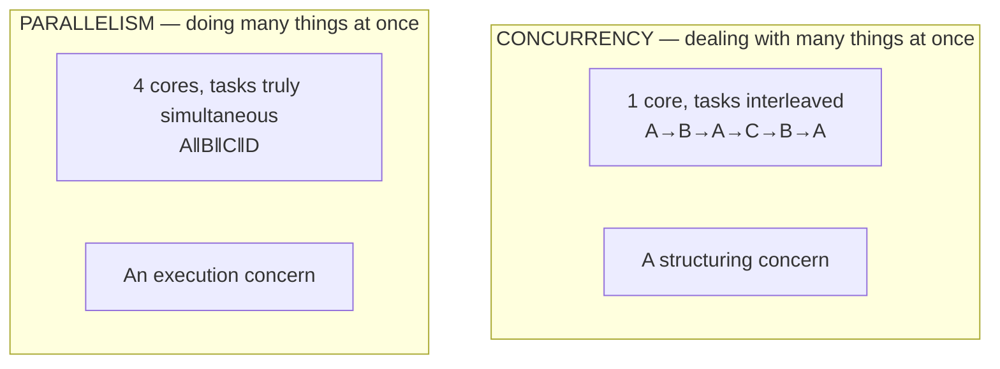
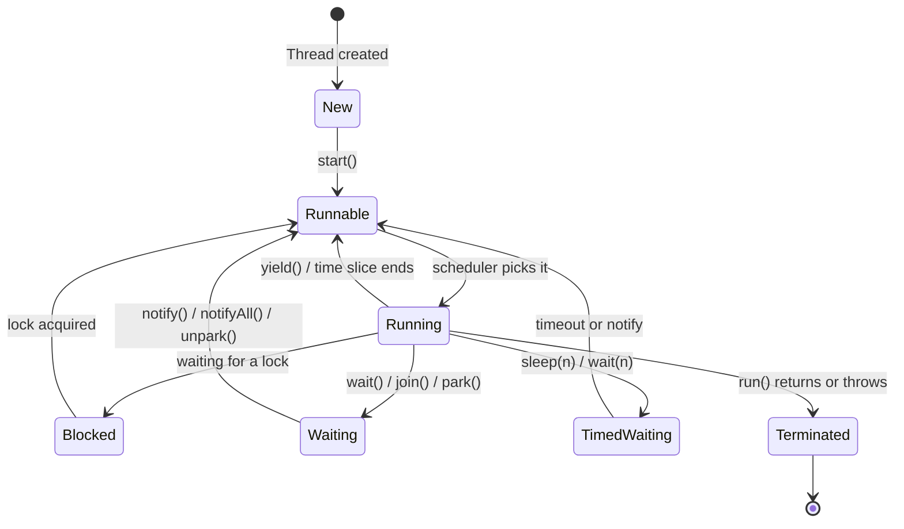
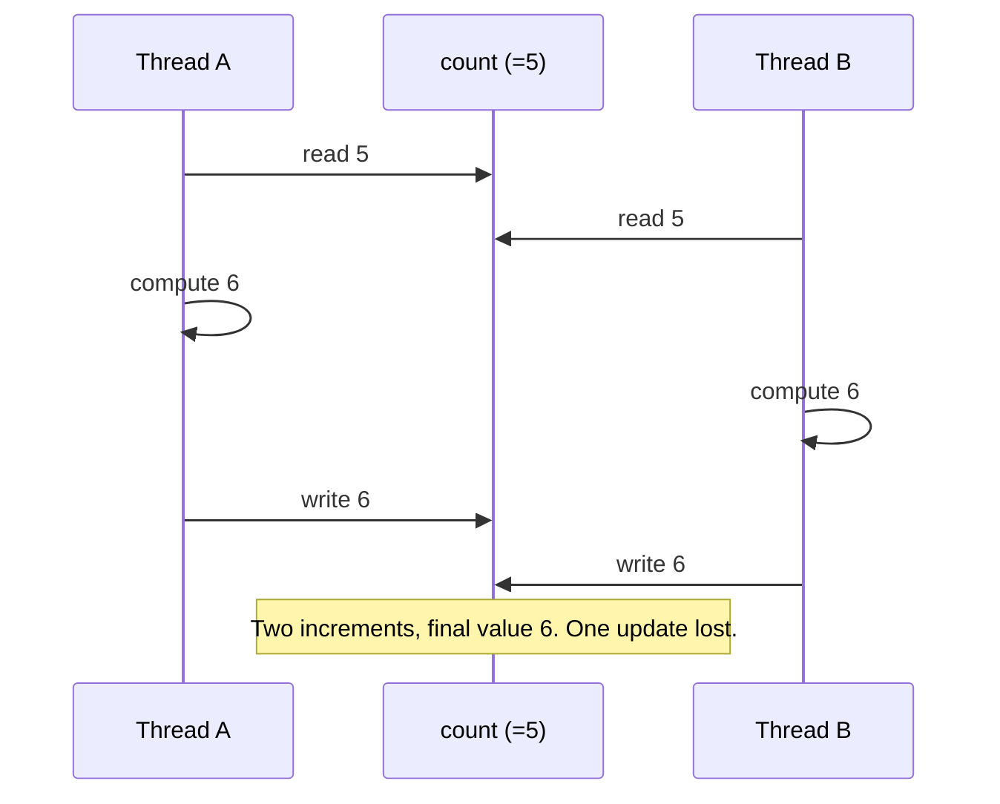
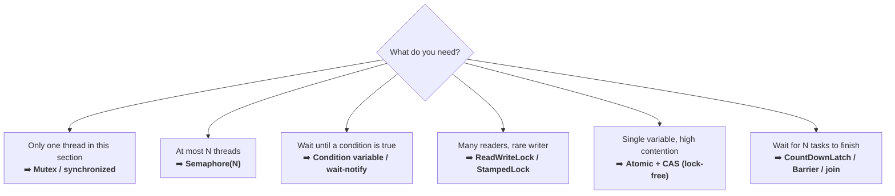
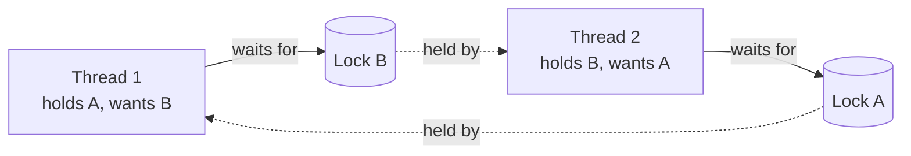
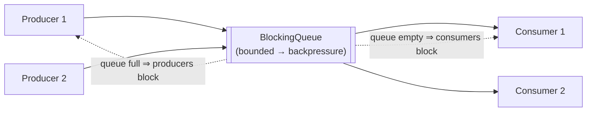
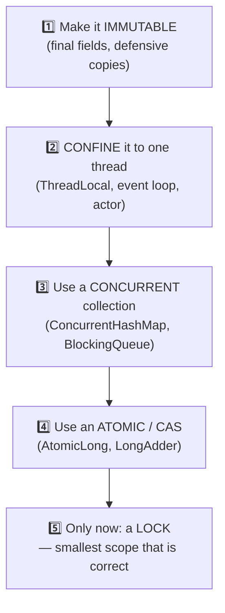
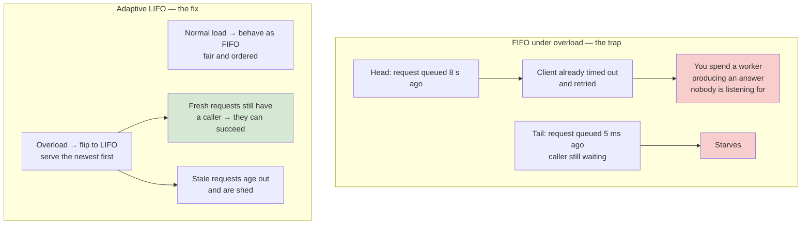

# Concurrency & Multithreading — Interview Masterclass

> **Purpose:** Everything asked in concurrency rounds and in the "make it thread-safe" half of LLD rounds.
> **Sources:** [awesome-low-level-design](https://github.com/ashishps1/awesome-low-level-design) (concurrency track) · Java Concurrency in Practice · The Little Book of Semaphores
> **Companions:** [low-level-design.md](low-level-design.md) · [design-patterns.md](design-patterns.md) · [cache-aside-lld.md](cache-aside-lld.md) · [README.md](README.md)

---

## Syllabus Coverage Index

| # | Topic | Section |
|---|---|---|
| 1 | Concurrency vs parallelism · processes vs threads · thread lifecycle | [§1](#1-concurrency-101) |
| 2 | Race conditions, critical sections, atomicity, visibility, reordering | [§2](#2-what-actually-goes-wrong) |
| 3 | Mutex · semaphore · condition variable · CAS · read-write lock | [§3](#3-synchronization-primitives) |
| 4 | Deadlock (4 Coffman conditions) · livelock · starvation · priority inversion | [§4](#4-the-failure-modes) |
| 5 | Patterns: thread pool · producer-consumer · reader-writer · signaling · fork-join | [§5](#5-concurrency-patterns) |
| 6 | Thread-safe collections + the immutability-first rule | [§6](#6-thread-safety-toolkit-in-order-of-preference) |
| 7 | Classic interview problems with solutions | [§7](#7-classic-interview-problems) |
| 8 | Concurrency inside a *system design* answer | [§8](#8-concurrency-at-system-scale) |
| ★ | Rapid-fire Q&A | [§9](#9-rapid-fire-qa) |
| ★ | 🏭 **Real-world: adaptive LIFO queues · goroutine regulators · CAS over a network** | [§10](#10-real-world-case-study--concurrency-control-inside-ubers-databases) |

---

## 1. Concurrency 101

### 1.1 Concurrency vs Parallelism



> **Rob Pike's line, worth memorising:** *"Concurrency is about **dealing** with lots of things at once. Parallelism is about **doing** lots of things at once."*
> Concurrency is a **design** property; parallelism is a **hardware** outcome. A single-core machine can be concurrent but never parallel.

### 1.2 Process vs Thread

| | Process | Thread |
|---|---|---|
| Memory | Own address space | **Shares** the process's heap |
| Owns privately | Everything | Stack, registers, program counter, thread-local storage |
| Creation cost | Heavy (ms) | Light (µs) |
| Communication | IPC: pipes, sockets, shared memory | Shared variables (fast, and dangerous) |
| Crash blast radius | Isolated | **Takes down the whole process** |
| Context switch | Expensive (TLB flush) | Cheaper |

> **Why threads are hard:** the shared heap is both the feature *and* the bug. Every concurrency defect you'll ever debug is two threads disagreeing about a shared mutable location.

**Green / virtual threads (say this to sound current):** Java 21 virtual threads, Go goroutines, Kotlin coroutines, Python `asyncio` — many logical threads multiplexed onto few OS threads. They make *blocking I/O* cheap (millions of them), but they do **not** make shared mutable state safe.

### 1.3 Thread lifecycle



⚠️ **`Blocked` vs `Waiting`:** Blocked = fighting for a monitor lock. Waiting = voluntarily gave up the lock and is waiting for a signal. In a thread dump, lots of `BLOCKED` means lock contention; lots of `WAITING` usually means a queue or a leak.

---

## 2. What Actually Goes Wrong

### 2.1 Race condition & critical section

```java
private int count = 0;
public void increment() { count++; }     // NOT atomic - it is read, add, write
```



> **Critical section** = the code region that touches shared mutable state and must not be interleaved. **Keep it as small as correctness allows** — a lock held across an I/O call is a throughput disaster.

### 2.2 The three problems, not one

Most candidates only know the first. Naming all three is a senior signal.

| Problem | What it means | Fixed by |
|---|---|---|
| **Atomicity** | A multi-step operation gets interleaved (`count++`, check-then-act) | Locks, atomics, transactions |
| **Visibility** ⭐ | Thread B never *sees* A's write — it's sitting in A's CPU cache/register | `volatile`, locks, `Atomic*`, memory barriers |
| **Ordering / reordering** ⭐ | Compiler & CPU legally reorder instructions; another thread observes them out of order | `volatile`, `synchronized`, memory model guarantees |

```java
// A classic visibility bug: this loop may NEVER exit, even after stop() is called.
private boolean running = true;              // ❌ needs `volatile`
public void run()  { while (running) { work(); } }
public void stop() { running = false; }
```

### 2.3 The check-then-act family

```java
// ❌ Every one of these is broken under concurrency
if (map.get(k) == null) map.put(k, v);                 // → map.putIfAbsent(k, v)
if (!list.contains(x)) list.add(x);                    // → use a Set + proper locking
if (balance >= amount) balance -= amount;              // → lock, or CAS loop
if (instance == null) instance = new Singleton();      // → holder idiom / volatile DCL
if (!file.exists()) file.create();                     // → TOCTOU: atomic create-if-absent
```

> ⚠️ **TOCTOU (Time-Of-Check to Time-Of-Use)** is the same bug in security clothing — check permission, then act, and an attacker swaps the target in between. Worth naming: it's an OWASP-relevant race.

---

## 3. Synchronization Primitives



### 3.1 Mutex (mutual exclusion)

```java
// Intrinsic lock
public synchronized void transfer(Account to, Money amt) { ... }

// Explicit lock - more control
private final ReentrantLock lock = new ReentrantLock();
public void transfer(Account to, Money amt) {
    lock.lock();
    try { ... } finally { lock.unlock(); }        // ALWAYS unlock in finally
}
```

| `synchronized` | `ReentrantLock` |
|---|---|
| Auto-released on exit/exception | You **must** `unlock()` in `finally` |
| No timeout, no interrupt | `tryLock(5, SECONDS)`, `lockInterruptibly()` |
| One implicit condition queue | Multiple `Condition` objects |
| Non-fair only | Optional **fairness** (FIFO) — slower but starvation-free |
| Cannot be acquired in one method and released in another | Can |

**Reentrancy:** a thread that already holds the lock can re-acquire it (the JVM counts). Without reentrancy, a synchronized method calling another synchronized method on the same object would self-deadlock.

**Lock granularity** (an explicit interview topic):

| | Coarse-grained | Fine-grained |
|---|---|---|
| Example | One lock for the whole `ParkingLot` | One lock per `Level` / per bucket |
| Correctness | Easy to get right | Easy to get **wrong** (deadlock risk ↑) |
| Throughput | Low — serialises everything | High |
| Rule | ⭐ **Start coarse, prove the contention with a profiler, then split.** Match lock granularity to the contention domain, not to the class count. |

### 3.2 Semaphore — a counter of permits

```java
// Limit concurrent DB connections to 10, regardless of how many threads exist.
private final Semaphore permits = new Semaphore(10);

public Result query(String sql) throws InterruptedException {
    permits.acquire();
    try { return db.execute(sql); }
    finally { permits.release(); }
}
```

| | Mutex | Semaphore |
|---|---|---|
| Count | Exactly 1 | N |
| Ownership | ⭐ **Owned** — only the locker may unlock | **Not owned** — any thread may release |
| Purpose | Mutual exclusion | Resource counting / **signalling** |
| Binary variant | — | `Semaphore(1)` ≈ mutex but **without ownership**, so it can be released by a different thread |

> ⭐ **The distinction interviewers want:** *"A mutex is about ownership and exclusion; a semaphore is about counting permits. A binary semaphore looks like a mutex but lacks ownership, which is exactly why it can be used as a signal between two different threads."*

### 3.3 Condition variables / wait–notify

```java
private final Object lock = new Object();
private final Queue<Task> queue = new LinkedList<>();

public void put(Task t) {
    synchronized (lock) {
        while (queue.size() == CAPACITY) lock.wait();   // ⚠️ WHILE, never IF
        queue.add(t);
        lock.notifyAll();
    }
}
public Task take() throws InterruptedException {
    synchronized (lock) {
        while (queue.isEmpty()) lock.wait();
        Task t = queue.poll();
        lock.notifyAll();
        return t;
    }
}
```

⚠️ **Three rules that are pure interview gold:**
1. **Always `while`, never `if`** — *spurious wakeups* are permitted by the spec, and another thread may have consumed the condition before you reacquire the lock.
2. **`wait()` atomically releases the lock** and re-acquires it before returning. That's the whole point — `sleep()` does **not** release the lock.
3. **Prefer `notifyAll()` over `notify()`** unless you can prove all waiters are interchangeable; `notify()` can wake the wrong waiter and cause a **lost wakeup** deadlock.

### 3.4 Compare-and-Swap (CAS) — lock-free

```java
// Hardware primitive: "if the value is still `expected`, set it to `next`" - atomically.
private final AtomicInteger count = new AtomicInteger();
count.incrementAndGet();                    // internally a CAS retry loop

// Hand-rolled CAS loop
int prev, next;
do { prev = count.get(); next = prev + 1; } while (!count.compareAndSet(prev, next));
```

| ✅ | ❌ |
|---|---|
| No blocking, no context switch | **Livelock** under very high contention (constant retry) |
| No deadlock possible | Only works on a **single** variable |
| Great for counters, flags, stacks | ⚠️ **ABA problem** |

⚠️ **The ABA problem** (name it — it separates levels): a thread reads `A`, another changes it `A→B→A`, the first thread's CAS succeeds even though the world changed underneath. **Fix:** a version/stamp (`AtomicStampedReference`) so you compare `(value, version)`.

### 3.5 Read-write locks

```java
private final ReadWriteLock rw = new ReentrantReadWriteLock();
public V get(K k) { rw.readLock().lock();  try { return map.get(k); } finally { rw.readLock().unlock(); } }
public void put(K k, V v) { rw.writeLock().lock(); try { map.put(k,v); } finally { rw.writeLock().unlock(); } }
```

Many concurrent readers **or** one exclusive writer. ✅ Wins when reads vastly outnumber writes and the critical section is long. ❌ Loses when the section is short (lock bookkeeping costs more than the work) or writes are frequent — and naive implementations **starve writers**. `StampedLock` adds optimistic reads for a further win.

### 3.6 Coordination helpers

| Tool | Use |
|---|---|
| `CountDownLatch(n)` | Wait for N one-off events (startup, fan-out join). **Not reusable.** |
| `CyclicBarrier(n)` | N threads wait for each other, then all proceed. **Reusable** — good for iterative simulations |
| `Phaser` | A barrier with a dynamic party count |
| `CompletableFuture` / `Task` / `Promise` | Compose async results without blocking threads |
| `ThreadLocal` | Per-thread state (⚠️ **leaks** in thread pools — always `remove()`) |

---

## 4. The Failure Modes

### 4.1 Deadlock — and the four Coffman conditions



**All four must hold. Break any one and deadlock is impossible.**

| # | Condition | How to break it |
|---|---|---|
| 1 | **Mutual exclusion** — resource can't be shared | Use immutable data / lock-free structures |
| 2 | **Hold and wait** — holds one, requests another | Acquire **all** locks at once, or release before requesting |
| 3 | **No preemption** — can't force a release | Use `tryLock(timeout)` and back off ⭐ |
| 4 | **Circular wait** — a cycle in the wait-for graph | ⭐ **Global lock ordering** — the standard fix |

```java
// ✅ The canonical bank-transfer fix: always lock in a consistent global order.
void transfer(Account from, Account to, Money amount) {
    Account first  = from.id().compareTo(to.id()) < 0 ? from : to;
    Account second = first == from ? to : from;
    synchronized (first) {
        synchronized (second) {
            from.withdraw(amount);
            to.deposit(amount);
        }
    }
}
```

⚠️ **Edge case worth mentioning:** if `from.id().equals(to.id())` (self-transfer), the ordering trick still works because the lock is reentrant — but you should reject it as a business rule anyway.

### 4.2 Livelock, starvation, priority inversion

| Failure | Definition | Symptom | Fix |
|---|---|---|---|
| **Deadlock** | Everyone blocked forever | Threads `BLOCKED`, CPU ~0% | Lock ordering, timeouts |
| **Livelock** | Threads keep *acting* but make no progress (two people dodging in a corridor) | CPU **100%**, no throughput | **Randomised backoff** (this is why Ethernet/TCP use exponential backoff + jitter) |
| **Starvation** | One thread never gets the resource | One task's latency → ∞ | **Fair** locks, priority ageing |
| **Priority inversion** | Low-priority thread holds a lock a high-priority thread needs | High-priority task stalls | **Priority inheritance** (the Mars Pathfinder bug) |

---

## 5. Concurrency Patterns

### 5.1 Thread Pool

```java
ExecutorService pool = new ThreadPoolExecutor(
    4,                                    // core threads
    16,                                   // max threads
    60L, TimeUnit.SECONDS,                // idle keep-alive
    new ArrayBlockingQueue<>(1000),       // ⭐ BOUNDED queue = backpressure
    new ThreadPoolExecutor.CallerRunsPolicy()  // ⭐ rejection = natural throttle
);
```

> ⚠️ **The #1 production mistake:** `Executors.newFixedThreadPool(n)` uses an **unbounded** `LinkedBlockingQueue`. Under overload it doesn't reject — it queues until you `OutOfMemoryError`. **Always bound the queue and choose a rejection policy.** Saying this is a strong signal.

**Sizing the pool:**

$$N_{threads} = N_{cores} \times U_{target} \times \left(1 + \frac{W}{C}\right)$$

where $W/C$ = wait time ÷ compute time.

- **CPU-bound** ($W \approx 0$): threads ≈ cores (+1). More just adds context switching.
- **I/O-bound** ($W \gg C$): threads ≫ cores. A task that waits 90 ms and computes 10 ms on 8 cores → $8 \times 1 \times (1 + 9) = 80$ threads.
- **Modern alternative:** virtual threads / async I/O, so you don't need 80 OS threads to wait on 80 sockets.

⚠️ **Bulkhead:** use a **separate pool per downstream dependency**. One slow dependency then exhausts only its own pool instead of every thread in the process. → [distributed-systems.md](distributed-systems.md)

### 5.2 Producer–Consumer (bounded buffer)



```java
BlockingQueue<Task> queue = new ArrayBlockingQueue<>(1000);
// Producer
queue.put(task);                   // blocks when full  => backpressure, for free
// Consumer
Task t = queue.take();             // blocks when empty
```

> ⭐ **The system-design link:** *"A bounded blocking queue is a message queue inside one process. The bound is what gives you backpressure — an unbounded queue converts a throughput problem into a memory problem, in-process and at cluster scale alike."*

**Poison pill** shutdown: push N sentinel objects so each of the N consumers exits cleanly.

### 5.3 Reader–Writer

Many readers concurrently, writers exclusive. Three fairness policies: reader-preference (writers starve), writer-preference (readers starve), **fair/FIFO** (neither). Say which you'd pick and why.

### 5.4 Signaling & other patterns

| Pattern | Use |
|---|---|
| **Signaling** | Thread A must finish step 1 before B starts step 2 → `CountDownLatch` / semaphore |
| **Fork-Join / divide & conquer** | Recursively split work, **work-stealing** pool → `ForkJoinPool`, parallel merge sort |
| **Immutable / copy-on-write** | No synchronisation needed at all — ⭐ the best pattern |
| **Thread confinement** | Data touched by exactly one thread (`ThreadLocal`, actor mailbox, single-threaded event loop — Node.js, Redis) |
| **Actor model** | No shared state; message passing only (Akka, Erlang, Go channels) |
| **Double-buffering** | Writers fill buffer B while readers read A, then swap atomically |

---

## 6. Thread-safety toolkit (in order of preference)

> ⭐ **Say the ladder in this order.** Reaching for a lock first is a junior instinct.



| Tool | Use for | Note |
|---|---|---|
| `ConcurrentHashMap` | Shared map | Lock striping. `computeIfAbsent` is atomic — use it instead of check-then-put |
| `CopyOnWriteArrayList` | Many reads, rare writes | Every write copies the array — listeners lists, config |
| `BlockingQueue` | Producer-consumer | Bounded variants give backpressure |
| `AtomicLong` / `LongAdder` | Counters | `LongAdder` wins under heavy contention (per-thread cells, summed on read) |
| `ConcurrentLinkedQueue` | Lock-free FIFO | Unbounded — no backpressure |
| ❌ `Vector`, `Hashtable`, `Collections.synchronizedMap` | — | Method-level locks: safe per call, but **compound operations are still races** |

```java
// ⚠️ synchronizedMap is NOT enough - this is still a race
synchronized (map) { if (!map.containsKey(k)) map.put(k, v); }   // needs an external lock
// ✅ ConcurrentHashMap gives you the compound operation atomically
map.putIfAbsent(k, v);
map.computeIfAbsent(k, key -> expensiveLoad(key));
```

---

## 7. Classic Interview Problems

### 7.1 Print `foobar` alternately (n times)

> Two threads; one prints `foo`, the other `bar`; output must be `foobarfoobar…`

```java
class FooBar {
    private final Semaphore fooTurn = new Semaphore(1);   // foo goes first
    private final Semaphore barTurn = new Semaphore(0);
    private final int n;

    public void foo(Runnable printFoo) throws InterruptedException {
        for (int i = 0; i < n; i++) {
            fooTurn.acquire();
            printFoo.run();
            barTurn.release();          // hand the turn to bar
        }
    }
    public void bar(Runnable printBar) throws InterruptedException {
        for (int i = 0; i < n; i++) {
            barTurn.acquire();
            printBar.run();
            fooTurn.release();
        }
    }
}
```

> ⭐ **The template for the whole "alternating threads" family** (print zero-even-odd, FizzBuzz multithreaded, H2O, dining philosophers): **one semaphore per turn, initialised so exactly one is available.** Say that and you've solved five problems at once.

### 7.2 Thread-safe cache with TTL

```java
public final class TtlCache<K, V> {
    private record Entry<V>(V value, long expiresAtNanos) {
        boolean isExpired() { return System.nanoTime() > expiresAtNanos; }
    }
    private final ConcurrentHashMap<K, Entry<V>> map = new ConcurrentHashMap<>();
    private final long ttlNanos;

    public V get(K key, Function<K, V> loader) {
        Entry<V> e = map.get(key);
        if (e != null && !e.isExpired()) return e.value();

        // computeIfAbsent gives single-flight per key: only ONE thread runs the loader.
        map.remove(key, e);
        return map.computeIfAbsent(key,
                k -> new Entry<>(loader.apply(k), System.nanoTime() + ttlNanos)).value();
    }
}
```

⚠️ **Two things to mention:** (1) `computeIfAbsent` holds a **per-bin lock** — never do slow I/O or call back into the same map inside it. (2) Expired entries are only cleaned lazily; add a background sweeper or a size bound or you leak. Full production version with jitter, negative caching and single-flight: [cache-aside-lld.md](cache-aside-lld.md).

### 7.3 Bounded blocking queue (implement it yourself)

```java
public final class BoundedQueue<T> {
    private final Deque<T> items = new ArrayDeque<>();
    private final int capacity;
    private final ReentrantLock lock = new ReentrantLock();
    private final Condition notFull  = lock.newCondition();
    private final Condition notEmpty = lock.newCondition();

    public void put(T item) throws InterruptedException {
        lock.lock();
        try {
            while (items.size() == capacity) notFull.await();   // WHILE
            items.addLast(item);
            notEmpty.signal();                                  // targeted signal
        } finally { lock.unlock(); }
    }
    public T take() throws InterruptedException {
        lock.lock();
        try {
            while (items.isEmpty()) notEmpty.await();
            T item = items.removeFirst();
            notFull.signal();
            return item;
        } finally { lock.unlock(); }
    }
}
```

> ⭐ **Why two `Condition`s beat one monitor:** with a single `wait()` queue you must `notifyAll()` and wake producers *and* consumers, most of whom go straight back to sleep (a "thundering herd" on the lock). Two conditions let you `signal()` exactly the right group.

### 7.4 Dining philosophers (deadlock demo)

```java
// Deadlock: all 5 grab left, then all wait for right, forever.
// Fix 1 (resource ordering): always pick up the LOWER-numbered fork first.
// Fix 2 (limit concurrency): a Semaphore(4) so at most 4 sit down - one always eats.
// Fix 3 (asymmetry): odd philosophers take left-then-right, even take right-then-left.
```

### 7.5 Rate limiter (token bucket, thread-safe)

```java
public final class TokenBucket {
    private final long capacity, refillPerSecond;
    private double tokens;
    private long lastRefillNanos;

    public synchronized boolean tryAcquire(int permits) {
        refill();
        if (tokens >= permits) { tokens -= permits; return true; }
        return false;
    }
    private void refill() {
        long now = System.nanoTime();
        double elapsedSec = (now - lastRefillNanos) / 1_000_000_000.0;
        tokens = Math.min(capacity, tokens + elapsedSec * refillPerSecond);
        lastRefillNanos = now;
    }
}
```
→ Distributed version (Redis + Lua) in [rest-api.md](rest-api.md).

---

## 8. Concurrency at System Scale

The same problems reappear across machines — with better names and worse failure modes.

| In-process | Distributed equivalent | File |
|---|---|---|
| Mutex | **Distributed lock** (Redis Redlock, ZooKeeper, etcd) — ⚠️ needs fencing tokens | [distributed-systems.md](distributed-systems.md) |
| `count++` race | Lost update across replicas | [databases.md](databases.md) |
| `synchronized` | Database **transaction** + isolation level | [databases.md](databases.md) |
| CAS | **Optimistic concurrency control** — version column, `WHERE version = ?` | [databases.md](databases.md) |
| Blocking queue | Kafka / SQS / RabbitMQ | [distributed-systems.md](distributed-systems.md) |
| Thread pool | Service instance pool / autoscaling group | [load-balancer.md](load-balancer.md) |
| Bulkhead | Separate connection pools per dependency | [distributed-systems.md](distributed-systems.md) |
| Livelock backoff | **Retry with exponential backoff + jitter** | [distributed-systems.md](distributed-systems.md) |
| Deadlock | Distributed deadlock / cyclic service dependency | [distributed-systems.md](distributed-systems.md) |

### Optimistic vs pessimistic — the one to know

| | Pessimistic | Optimistic |
|---|---|---|
| Assumes | Conflicts are likely | Conflicts are rare |
| Mechanism | Lock first (`SELECT … FOR UPDATE`) | Read a version, write with `WHERE version = old`, retry on 0 rows |
| Cost | Blocking, deadlock risk, lock held over network latency | Wasted work on retry |
| Use for | Seat/inventory booking, hot rows | User profile edits, low-contention updates |

> ⭐ **Interview answer for "how do you prevent double booking a seat?"**: *"Optimistic concurrency on a `seat_status` row with a version column, or a `SELECT … FOR UPDATE` inside a short transaction. On top of that, a **temporary hold** with a TTL at selection time so the seat isn't locked for the user's whole checkout, plus an **idempotency key** on the booking request so a retry can't double-charge."*

---

## 9. Rapid-fire Q&A

| Question | Answer |
|---|---|
| **Concurrency vs parallelism?** | Concurrency = dealing with many things at once (structure). Parallelism = doing many at once (execution). Concurrency is possible on one core; parallelism is not. |
| **Process vs thread?** | Processes have isolated memory and are expensive; threads share the heap, are cheap, and one crash kills the process. |
| **What is a race condition?** | Correctness depends on the unpredictable interleaving of threads over shared mutable state. |
| **The three concurrency problems?** | Atomicity, **visibility**, and **ordering**. Most people only name the first. |
| **What does `volatile` do?** | Guarantees **visibility** and prevents reordering across the access. It does **not** provide atomicity — `volatile count++` is still a race. |
| **Mutex vs semaphore?** | Mutex = ownership + exclusion (1 permit, only the owner releases). Semaphore = counting permits, releasable by any thread; used for limits and signalling. |
| **Why `while` around `wait()`?** | Spurious wakeups are legal, and another thread may consume the condition before you reacquire the lock. |
| **`wait()` vs `sleep()`?** | `wait()` releases the lock and needs a notify; `sleep()` holds the lock the whole time. |
| **`notify()` vs `notifyAll()`?** | `notify()` wakes one arbitrary waiter and can cause lost wakeups when waiters aren't interchangeable. Default to `notifyAll()` or use targeted `Condition.signal()`. |
| **Four conditions for deadlock?** | Mutual exclusion, hold-and-wait, no preemption, circular wait. Break any one. |
| **Most practical deadlock fix?** | **Global lock ordering**, plus `tryLock` with a timeout as a safety net. |
| **Deadlock vs livelock?** | Deadlock: blocked, CPU idle. Livelock: busy, CPU pegged, zero progress. Fix livelock with randomised backoff. |
| **What is CAS?** | An atomic "compare expected value, then swap" hardware instruction — the basis of lock-free algorithms. |
| **What is the ABA problem?** | A value changes A→B→A, so CAS succeeds even though state changed. Fix with a version stamp. |
| **How do you size a thread pool?** | `cores × utilisation × (1 + wait/compute)`. CPU-bound ≈ cores; I/O-bound ≫ cores. And always bound the queue. |
| **What's wrong with `newFixedThreadPool`?** | Unbounded queue → no backpressure → OOM under overload. Use an explicit `ThreadPoolExecutor` with a bounded queue and a rejection policy. |
| **Is `ConcurrentHashMap` fully safe?** | Individual operations are atomic; **your** compound operations aren't unless you use `putIfAbsent`/`compute*`. |
| **Best way to make a class thread-safe?** | Make it **immutable**. Then confine, then use concurrent collections, then atomics, and only then locks. |
| **How do you debug a deadlock?** | Thread dump (`jstack`/`jcmd`), look for `BLOCKED` threads and the "found one Java-level deadlock" report; build the wait-for graph. |
| **Optimistic vs pessimistic locking?** | Pessimistic locks up front (high contention); optimistic detects conflict at write time via a version and retries (low contention). |

---

## 10. Real-World Case Study — concurrency control inside Uber's databases

> **Sources:** Uber Engineering — *[Intelligent load management](https://www.uber.com/in/en/blog/from-static-rate-limiting-to-intelligent-load-management/)* (Apr 2026) and *[CacheFront](https://www.uber.com/en-US/blog/how-uber-serves-over-40-million-reads-per-second-using-an-integrated-cache/)* (Feb 2024).
>
> [§8](#8-concurrency-at-system-scale) says "bound your queue and shed load." This is what that looks like when a real team builds it for a database serving tens of millions of requests/sec.

### 10.1 Concurrency as the health signal

Uber needed one number to answer *"is this node drowning?"*. They rejected QPS and chose **in-flight concurrency**:

$$\text{Concurrency} = \text{Throughput} \times \text{Latency}$$

> *"Simple QPS-based rate limiting is too coarse. It fails to account for workload variability, often shedding too late or too early. What can be more effective is concurrency: the number of operations currently in flight. It directly reflects system load, following Little's Law."*

This is the same **Little's Law** you use to size a thread pool ([§8](#8-concurrency-at-system-scale)) — used backwards. When latency rises at constant throughput, in-flight count rises **automatically**, so the detector re-calibrates itself as the workload changes. A QPS threshold cannot do that.

> ⭐ **Say this:** *"I'd instrument in-flight concurrency, not just QPS. Concurrency is throughput × latency, so it's the only single metric that moves when **either** the arrival rate or the service time degrades — which makes it the right trigger for backpressure."*

### 10.2 Adaptive LIFO — the queue discipline nobody teaches

The classic bounded work queue in front of a thread pool is **FIFO**. Under overload, FIFO is actively harmful:



From the blog:

> *"Under overload, FIFO creates a trap: old requests accumulate, wait too long, and often get abandoned or retried by the client. This results in wasted work. Meanwhile, fresh requests, still relevant and likely to succeed, sit idle at the end of the line."*
>
> *"Under normal load, the queue behaves as FIFO. Under pressure, it switches to LIFO, favoring newer requests that still have a chance to succeed."*

This comes from **CoDel (Controlled Delay)**, borrowed from networking's bufferbloat work: shed based on **how long an item has waited**, not on how many items are queued. Queue *length* tells you nothing about whether the work is still wanted; queue *latency* does.

**Queue isolation** is the other half — separate queues per operation class so one class can't starve another. Uber ran three: **read** (point lookups), **write** (insert/update/upsert), **slow** (scans, deletes, background jobs, replication). That's the **bulkhead pattern** ([§8](#8-concurrency-at-system-scale)) applied to queues rather than connection pools.

### 10.3 Static limits vs a PID controller

The v1 shedder used **fixed queue timeouts and static in-flight concurrency limits**. Two problems, both familiar from thread-pool tuning:

| Problem | Symptom |
|---|---|
| **Static limits are low-fidelity for a dynamic system** | *"Requiring frequent manual tuning and leading to operational toil"* — the same reason a hard-coded `nThreads` is always wrong six months later |
| **Fixed wait times synchronise the clients** | Everything gets rejected at the same instant → everything retries at the same instant → **thundering herd** ([§4](#4-the-failure-modes)) |

The replacement (**Cinnamon**) makes both adaptive:

- Queue timeout thresholds are **derived from the service's own P90 latency**.
- An **Auto Tuner** continuously adjusts the **in-flight concurrency limit** from live latency and error-rate signals.
- Shedding is driven by a **PID controller** — it uses *history and trend*, not just the instantaneous error rate.

> *"Simple, reactive shedding based solely on current error rates often causes instability, overcorrecting too late, and too hard. PID based regulation brings balance by incorporating system history and directional trends."*
>
> *"Without PID regulation, shedding acts like a hammer: reactive and abrupt. With it, it's more like a dimmer switch: smooth and stable."*

### 10.4 Runtime-level backpressure — the goroutine and memory regulators

Concurrency limits are not only about queues. Uber runs **node-local regulators** that throttle on raw runtime health:

| Regulator | Trips on |
|---|---|
| **Goroutines** | Total goroutine count crossing a threshold |
| **Memory** | Free process memory running low |
| **Write bytes** | Concurrent write volume, to prevent I/O saturation |
| **Partition key** | Traffic concentrating on one hot key |

The goroutine regulator is the Go equivalent of *"my thread pool is unbounded and I am about to OOM"*. Note **why** it's needed: goroutines are cheap enough that nothing stops you creating 150,000 of them — the language removes the natural backpressure that expensive OS threads used to provide. So you have to add it back deliberately.

**The measured effect of rejecting immediately instead of holding requests in memory:**

| Metric | Token-bucket limiter | PID-based shedder |
|---|---|---|
| Goroutines at overload peak | **150,000** | **10,000** (−93%) |
| Heap | 5–6 GB spikes | 1 GB max (−60%) |
| Throughput under overload | 3,000 QPS | 5,400 QPS (+80%) |
| p99 latency (upsert) | 3.1 s | 1.0 s (−70%) |

> *"Cinnamon sheds excess requests immediately using a PID controller, **avoiding the memory and goroutine buildup caused by token bucket limiters**."*

That's the whole lesson in one line: **a queued request is a live object holding a stack, a buffer and a connection.** "Queue it and hope" is not free — it converts a latency problem into a memory problem, and then into a crash.

### 10.5 Lock-free coordination in the cache path

CacheFront hits a textbook **lost-update race** ([§2](#2-what-actually-goes-wrong)) across processes, not threads:

> The read path writes rows to Redis after a cache miss. Concurrently, the CDC consumer writes the *newest* rows to Redis. A slow read can land **last** and overwrite the newer value with a stale one.

The fix is pure optimistic concurrency control:

| Step | Mechanism |
|---|---|
| **Version** | The MySQL row **timestamp** acts as the version, encoded into the cached value |
| **Compare-and-set** | A Redis **Lua script via `EVAL`** behaves like `MSET` but first compares the timestamps already in the cache and only writes if the incoming value is newer |
| **Atomicity** | Redis executes the whole script atomically, *"in a single request instead of requiring multiple round trips"* |

That is **CAS with a version stamp** ([§3](#3-synchronization-primitives)) — the same pattern as optimistic row locking, and the same defence against **ABA** — implemented in a distributed system by moving the compare **to** the data rather than pulling the data to the comparer.

> ⭐ **Say this:** *"Read-modify-write over a network is the distributed version of a race condition, and the fix is the same: don't do read-then-write, do compare-and-set. In Redis that means a Lua script so the compare and the write are one atomic operation; in a database it's an optimistic version column. Either way you need a **version** — and a monotonic write timestamp from the source of truth is usually already available."*

### 10.6 The transferable lessons

| Lesson | Applies to |
|---|---|
| **Measure in-flight concurrency, not just rate** | Any thread pool, connection pool or queue |
| **Prefer LIFO under overload** | Any bounded work queue with client timeouts |
| **Isolate queues per workload class** | Bulkheads, so scans can't starve point reads |
| **Derive limits from live metrics; configure only the maximum** | Thread-pool sizes, timeouts, queue deadlines |
| **Reject fast — a queued request costs memory** | Anywhere you were tempted to use an unbounded queue |
| **Use PID/trend-based control, not step thresholds** | Autoscaling, circuit breakers, shedders |
| **Cross-process races need CAS + a version** | Caches, distributed counters, any dual-writer path |
