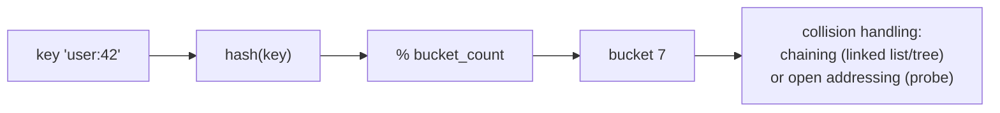
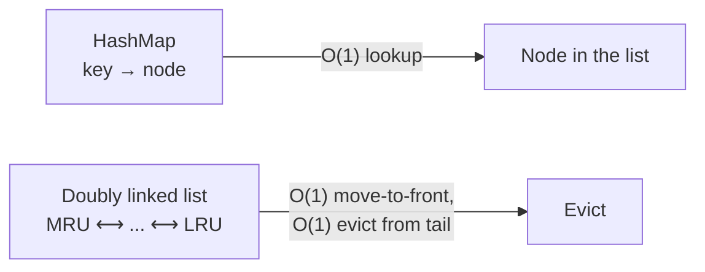
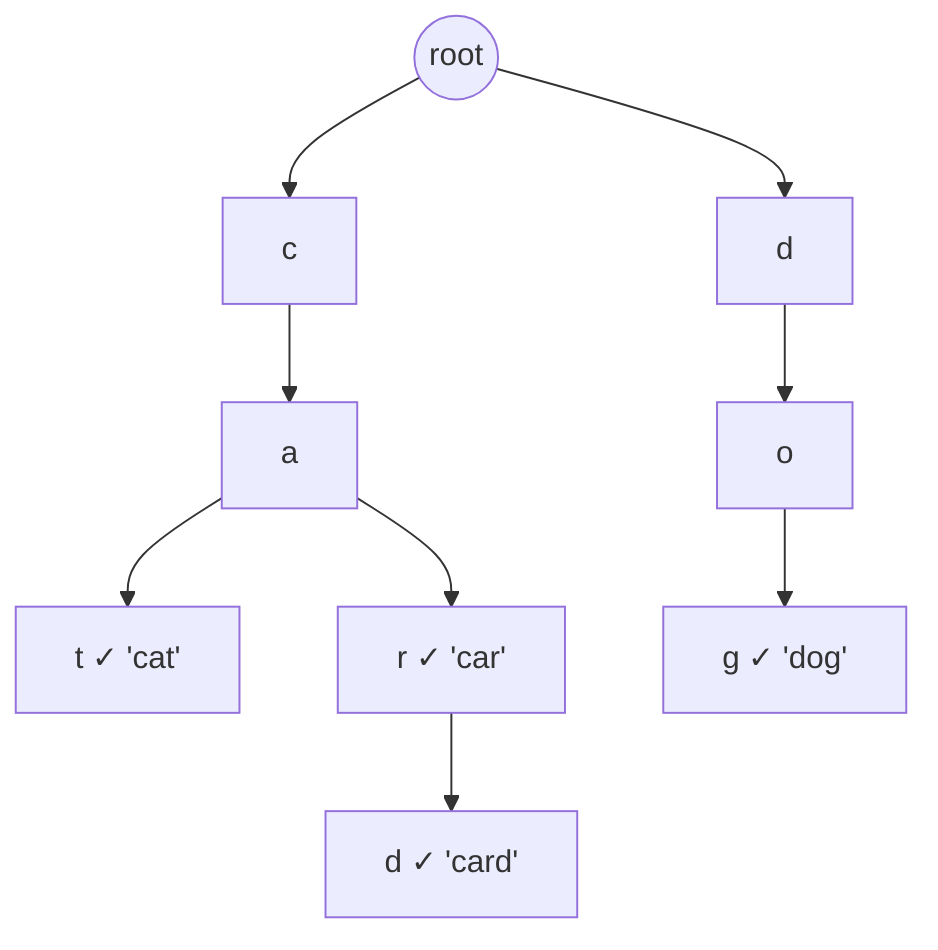
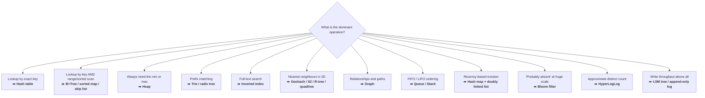

data structures
1. list/array
2. stack
3. queue
4. Heap -> task schduling for memory managment 
5. trees -> hirechical data
6. hash table -> its effeicit to look data , insertion and deletion used -> search engine, cache system, compiler/interpreter
7. suffiex tree -> searching strings in documents, this is perfect for text editors and search algo
8. Graphs -> tracking relationship and provide it
9. R-trees -> good at finding nearest neighbors, it stores spatial data

---

# Data Structures — Interview-Ready Reference

> **Purpose:** the complexity tables you must recall instantly, **plus** the thing most DSA notes skip — *where each structure shows up inside a real system design*.
> **Companions:** [low-level-design.md](low-level-design.md) · [databases.md](databases.md) · [caching.md](caching.md) · [system-design-interview-playbook.md](system-design-interview-playbook.md) · [README.md](README.md)

---

## Index

| # | Topic | Section |
|---|---|---|
| 1 | Big-O in 60 seconds + the growth table | [§1](#1-big-o-the-only-part-you-need) |
| 2 | **The master complexity table** | [§2](#2-the-master-complexity-table) |
| 3 | Linear: array · linked list · stack · queue · deque | [§3](#3-linear-structures) |
| 4 | Hash table — collisions, load factor, why O(1) is amortised | [§4](#4-hash-tables-the-most-important-one) |
| 5 | Trees: BST · balanced · **B/B+Tree** · heap · trie · segment/Fenwick | [§5](#5-trees) |
| 6 | Graphs: representations, BFS/DFS, shortest path, topological sort | [§6](#6-graphs) |
| 7 | Spatial: R-tree · quadtree · geohash · S2 | [§7](#7-spatial-structures) |
| 8 | Probabilistic: bloom filter · HyperLogLog · count-min sketch · t-digest | [§8](#8-probabilistic-structures-system-design-favourites) |
| 9 | **Which structure does each system use?** ⭐ | [§9](#9-where-each-structure-shows-up-in-system-design) |
| 10 | Structure selection flow chart | [§10](#10-how-to-choose) |
| ★ | Rapid-fire Q&A | [§11](#11-rapid-fire-qa) |

---

## 1. Big-O — the only part you need

| Growth | Name | n = 1,000,000 |
|---|---|---|
| O(1) | Constant | 1 |
| O(log n) | Logarithmic | ~20 |
| O(n) | Linear | 1,000,000 |
| O(n log n) | Linearithmic | ~20,000,000 |
| O(n²) | Quadratic | 10¹² ❌ |
| O(2ⁿ) | Exponential | ☠️ |

> ⭐ **The practical takeaway:** the gap between O(n) and O(log n) at a million elements is **50,000×**. That is the entire justification for indexes, tries, heaps and hash tables.

**Amortised vs worst case:** a dynamic array's `push` is O(1) *amortised* — most pushes are O(1), but a resize copies everything in O(n). Averaged over n pushes it's O(1). ⚠️ For a **latency-sensitive** service, the amortised average hides a p99 spike — say this if asked about tail latency.

---

## 2. The Master Complexity Table

| Structure | Access | Search | Insert | Delete | Space | Ordered? |
|---|---|---|---|---|---|---|
| **Array (static)** | **O(1)** | O(n) | O(n) | O(n) | O(n) | by index |
| **Dynamic array** | **O(1)** | O(n) | O(1)* at end | O(n) | O(n) | by index |
| **Singly linked list** | O(n) | O(n) | **O(1)** at head | **O(1)** given the node | O(n) | insertion |
| **Doubly linked list** | O(n) | O(n) | **O(1)** | **O(1)** given the node | O(n) | insertion |
| **Stack** | O(n) | O(n) | **O(1)** | **O(1)** | O(n) | LIFO |
| **Queue** | O(n) | O(n) | **O(1)** | **O(1)** | O(n) | FIFO |
| **Hash table** | — | **O(1)*** | **O(1)*** | **O(1)*** | O(n) | ❌ **no order** |
| **BST (unbalanced)** | O(n)⚠️ | O(n)⚠️ | O(n)⚠️ | O(n)⚠️ | O(n) | ✅ in-order |
| **Balanced BST** (AVL / Red-Black) | O(log n) | **O(log n)** | **O(log n)** | **O(log n)** | O(n) | ✅ |
| **B / B+Tree** | O(log n) | **O(log n)** | O(log n) | O(log n) | O(n) | ✅ + **range scans** |
| **Binary heap** | O(1) for min/max | O(n) | **O(log n)** | **O(log n)** pop | O(n) | partial |
| **Trie** | — | **O(L)** L = key length | O(L) | O(L) | O(alphabet × nodes) | ✅ lexicographic |
| **Skip list** | O(log n)* | O(log n)* | O(log n)* | O(log n)* | O(n log n) | ✅ |
| **LSM tree** | — | O(log n) + read amp | **O(1)** buffered | O(1) tombstone | O(n) | ✅ per SSTable |
| **Graph (adj. list)** | — | O(V+E) traverse | O(1) add edge | O(E) | O(V+E) | ❌ |

\* amortised / expected

### Sorting, for completeness

| Algorithm | Best | Average | Worst | Space | Stable | Note |
|---|---|---|---|---|---|---|
| **Quicksort** | O(n log n) | O(n log n) | **O(n²)** | O(log n) | ❌ | Fastest in practice; randomise the pivot |
| **Mergesort** | O(n log n) | O(n log n) | **O(n log n)** | O(n) | ✅ | ⭐ **The basis of external sorting** — sorting data bigger than RAM |
| **Heapsort** | O(n log n) | O(n log n) | O(n log n) | **O(1)** | ❌ | In-place, predictable |
| **Timsort** | O(n) | O(n log n) | O(n log n) | O(n) | ✅ | Python/Java default; exploits existing runs |
| **Counting/Radix** | O(n+k) | O(n+k) | O(n+k) | O(n+k) | ✅ | Only for bounded integer keys |

---

## 3. Linear Structures

### 3.1 Array vs Linked List — the real answer

| | Array | Linked List |
|---|---|---|
| Memory | **Contiguous** | Scattered nodes + pointers |
| Random access | **O(1)** | O(n) |
| Insert/delete in middle | O(n) (shift) | O(1) *given the node* |
| Memory overhead | None | 8–16 bytes per node for pointers |
| **Cache locality** ⭐ | **Excellent** | **Terrible** |

> ⭐ **The answer that separates levels:** *"In theory a linked list wins on insertion. In practice arrays usually win anyway because of **cache locality** — an array walk prefetches sequential cache lines, while a linked-list walk is a chain of dependent cache misses at ~100 ns each. Modern CPUs make O(n) over contiguous memory beat O(1) over scattered memory for anything under a few thousand elements."*

### 3.2 Stack (LIFO)

**Used for:** call stacks · undo/redo ([design-patterns.md](design-patterns.md#command)) · expression evaluation · balanced-bracket checks · DFS (iterative) · browser back button · JVM/interpreter frames · backtracking.

### 3.3 Queue (FIFO) & variants

| Variant | Use |
|---|---|
| **Queue** | BFS · task scheduling · **message queues** ([distributed-systems.md](distributed-systems.md)) · request buffering |
| **Deque** | Sliding-window maximum · LRU recency list · work-stealing pools |
| **Circular buffer / ring buffer** ⭐ | Fixed-memory logging, audio/video buffers, metrics windows, Kafka-style batching, `Disruptor` |
| **Priority queue (heap)** | Dijkstra · task priorities · rate limiter expiry · timer wheels |
| **Blocking queue** | Producer-consumer with backpressure ([concurrency.md](concurrency.md)) |

---

## 4. Hash Tables (the most important one)



| Concept | Detail |
|---|---|
| **Collision** | Two keys hash to the same bucket. **Unavoidable** (pigeonhole principle) |
| **Chaining** | Each bucket holds a list. Java 8+ converts a bucket to a **red-black tree** past 8 entries, so worst case becomes O(log n) instead of O(n) |
| **Open addressing** | Probe for the next free slot (linear/quadratic/double hashing). Better cache locality, worse at high load |
| **Load factor** | `entries / buckets`. Java resizes at **0.75** — a trade-off between memory and collision rate |
| **Rehashing** | On resize, every key is rehashed — an **O(n) pause**. ⚠️ Pre-size your maps in hot paths |
| **Why O(1) is "amortised"** | A single operation can hit a resize or a long chain. Worst case is O(n) |

⚠️ **Hash-flooding DoS:** an attacker sends keys that all collide, turning every lookup into O(n) and pinning your CPU. **Mitigation:** randomised hash seeds per process (Python, Java, Ruby all do this now) and treeified buckets. This is a genuine OWASP-relevant issue — worth naming.

> 💡 **From the original note above:** use a **HashSet** when you only need presence/absence, not a HashMap with dummy values. Candidates get dinged for this.

**LRU Cache = HashMap + Doubly Linked List** — the single most-asked structure-design question:


Both `get` and `put` are **O(1)**: the map finds the node, the list maintains recency. In JavaScript a `Map` preserves insertion order, so it doubles as the recency list — see the implementation in [cache-aside-lld.md](cache-aside-lld.md) §6.

---

## 5. Trees

### 5.1 BST → balanced BST

An unbalanced BST built from sorted input degenerates into a linked list — **O(n)**. That's why production code uses self-balancing trees:

| Tree | Balance rule | Character |
|---|---|---|
| **AVL** | Height difference ≤ 1 | Stricter → **faster reads**, more rotations on write |
| **Red-Black** | Colour invariants | Looser → **faster writes**. Used by Java `TreeMap`, C++ `std::map`, Linux scheduler |
| **Skip list** | Probabilistic layers | Simpler to make lock-free → Redis **sorted sets**, LevelDB memtable |

### 5.2 ⭐ B-Tree vs B+Tree — why databases don't use BSTs

> **The reason is disk, not asymptotics.** A binary tree over 1 billion keys is ~30 levels deep = 30 random disk reads. A B+Tree with a fanout of ~500 is **~4 levels** = 4 reads.

| | B-Tree | B+Tree |
|---|---|---|
| Data stored in | All nodes | **Leaves only** |
| Leaves linked | ❌ | ✅ **Linked list** |
| Range scan | Requires tree traversal | ⭐ **Walk the leaf chain — sequential I/O** |
| Fanout | Lower (nodes carry data) | **Higher** (internal nodes are pure keys → more per page) |
| Used by | Some filesystems | **Postgres, MySQL/InnoDB, SQL Server, Oracle** |

> ⭐ **Say this:** *"A B+Tree node is sized to one disk page (~4–16 KB), which is why the fanout is in the hundreds and the tree is only 3–4 levels deep for a billion rows. And because the leaves are a linked list, `WHERE created_at BETWEEN ...` is a sequential leaf walk instead of a tree traversal. That's the whole reason range queries are cheap on a relational index and impossible on a hash index."* → [databases.md](databases.md) §4

### 5.3 Heap

An **almost-complete binary tree** stored in a flat array — `parent = (i-1)/2`, `children = 2i+1, 2i+2`. No pointers, perfect cache locality.

| Operation | Cost |
|---|---|
| Peek min/max | **O(1)** |
| Insert / extract | O(log n) |
| **Build heap from n items** | ⭐ **O(n)**, not O(n log n) |
| Find arbitrary element | O(n) — ⚠️ heaps aren't for searching |

**System uses:** Dijkstra & A* · **task/job scheduling** (the original note above) · **top-k** streaming (keep a min-heap of size k → O(n log k)) · timer wheels & TTL expiry · median maintenance (two heaps) · **external merge sort** (k-way merge of sorted runs).

### 5.4 Trie (prefix tree)



Lookup is **O(L)** where L is the key length — **independent of how many keys are stored**. That's the superpower.

**Used for:** autocomplete / typeahead ⭐ · spell check · **IP routing tables** (longest-prefix match) · dictionary/word games · T9 · **URL routing** in web frameworks · **radix tree** (compressed trie) in Redis and Linux page caches.

⚠️ **Memory is the cost.** A naive trie stores an array of 26+ child pointers per node. Fixes: a compressed **radix tree**, a map instead of an array per node, or a **DAWG/succinct trie**.

> ⭐ **The autocomplete answer:** *"A trie gives prefix matching in O(L), but walking the subtree to rank suggestions is expensive at query time. So I'd **precompute and cache the top-k completions at each node** offline, and rebuild that periodically — turning a query into one O(L) walk plus a constant-size read."*

### 5.5 Segment tree & Fenwick (BIT)

| | Segment tree | Fenwick / BIT |
|---|---|---|
| Range query | O(log n) — any associative op | O(log n) — prefix sums |
| Point update | O(log n) | O(log n) |
| Space | O(4n) | **O(n)** |
| Flexibility | Any op (min/max/sum/gcd), lazy propagation | Sums only, much simpler code |

**Used for:** range analytics · time-series roll-ups · leaderboards ("rank of score X") · competitive programming.

---

## 6. Graphs

### 6.1 Representations

| | Adjacency matrix | Adjacency list |
|---|---|---|
| Space | O(V²) | **O(V+E)** |
| "Is there an edge u→v?" | **O(1)** | O(degree) |
| Iterate a node's neighbours | O(V) | **O(degree)** |
| Best for | Dense graphs | ⭐ **Sparse graphs — i.e. almost every real graph** |

### 6.2 The algorithms and what they answer

| Algorithm | Answers | Complexity |
|---|---|---|
| **BFS** | Shortest path in an **unweighted** graph; level order | O(V+E) |
| **DFS** | Connectivity, cycle detection, path existence | O(V+E) |
| **Topological sort** | A valid ordering of dependencies | O(V+E) |
| **Dijkstra** | Shortest path, **non-negative** weights | O((V+E) log V) |
| **Bellman-Ford** | Shortest path with **negative** weights; detects negative cycles | O(V·E) |
| **A\*** | Shortest path with a heuristic — ⭐ **how map routing actually works** | depends on heuristic |
| **Union-Find (DSU)** | Connected components, cycle detection in undirected graphs | ~O(1) amortised |
| **Kruskal / Prim** | Minimum spanning tree | O(E log V) |
| **Tarjan / Kosaraju** | Strongly connected components | O(V+E) |
| **PageRank** | Node importance | iterative |

> ⭐ **System-design links:** *"Topological sort is how a **build system**, a **task scheduler with dependencies**, and a **service startup order** all work — and detecting a cycle is how you detect a circular dependency. Union-Find is how you detect a cycle when adding an edge, which is exactly the check a **friend-recommendation** or **fraud-ring** system needs."*

**Used in production for:** social graphs (friends-of-friends) · recommendation engines · **map routing** (contracted A\*) · dependency resolution (npm/Maven) · fraud detection · network topology · **Kubernetes owner references** · Git commit DAG.

---

## 7. Spatial Structures

> Expanding the original note's point 9 — this is the heart of any "design Uber/Yelp/Google Maps" question.

| Structure | Idea | Used by |
|---|---|---|
| **R-tree** | Nested bounding rectangles | PostGIS, SQLite R\*Tree, spatial indexes |
| **Quadtree** | Recursively split a plane into 4 quadrants until each holds ≤ k points | Image compression, collision detection, older map tiling |
| **KD-tree** | Split alternately on each dimension | k-NN search, ML |
| **Geohash** ⭐ | Interleave lat/long bits into a **base-32 string**; a shared prefix means spatial proximity | Redis `GEO`, Elasticsearch, DynamoDB geo |
| **S2 / H3** | Map the sphere onto space-filling-curve cells (S2) or hexagons (H3) | Google Maps, **Uber (H3)** |

### Why geohash is the interview answer

```
Geohash of a point: "tdr1y8v"
  "t"       → a huge region
  "tdr"     → ~150 km cell
  "tdr1y8v" → ~150 m cell

⭐ Two nearby points share a prefix ⇒ a proximity query becomes a STRING PREFIX query,
   which any B-tree index or key-value store can serve.
```

> ⭐ **The full "find drivers near me" answer:** *"I'd index driver locations by geohash prefix at a precision matching the search radius, and shard by that prefix. A query reads the user's cell **plus its 8 neighbours** — because the target may sit just across a cell boundary — then filters by exact haversine distance and sorts. Location updates are extremely write-heavy and highly perishable, so they go to Redis with a TTL rather than a relational table."*

⚠️ **The two geohash gotchas to name:** (1) **edge effects** — adjacent points can have completely different prefixes near a boundary, hence querying neighbours; (2) **cell size varies with latitude**, which is exactly why Google built S2 and Uber built H3.

---

## 8. Probabilistic Structures (system-design favourites)

> ⭐ **These trade a small, *bounded* error for enormous memory savings. Naming them is a strong senior signal** — most candidates never mention them.

| Structure | Answers | Error | Memory |
|---|---|---|---|
| **Bloom filter** | "Is X *definitely not* in the set?" | False positives, **never** false negatives | ~10 bits/element for 1% FP |
| **Counting bloom filter** | Same, but supports **delete** | Same | ~4× a plain bloom filter |
| **Cuckoo filter** | Same + delete + better locality | Same | Better than counting bloom |
| **HyperLogLog** | "How many **distinct** items?" | ~**0.81%** standard error | ⭐ **12 KB for billions of items** |
| **Count-Min Sketch** | "How often did X appear?" (frequency) | Over-estimates only | Sub-linear |
| **t-digest / DDSketch** | "What's the p99?" over a stream | Bounded relative error | Kilobytes |
| **MinHash / SimHash** | "How similar are these two sets/docs?" | Approximate Jaccard | Small signatures |

**Where they're used:**

| Structure | Real use |
|---|---|
| Bloom filter | **Cassandra/RocksDB SSTable skipping** · cache-penetration defence ([caching.md](caching.md)) · Chrome malicious-URL check · CDN one-hit-wonder filtering · crawler URL dedupe |
| HyperLogLog | **Redis `PFCOUNT`** · unique visitors/DAU · "unique viewers" counts · Presto/BigQuery `APPROX_COUNT_DISTINCT` |
| Count-Min Sketch | **Heavy-hitter / hot-key detection** ⭐ · trending topics · network flow monitoring |
| t-digest | p50/p95/p99 in metrics systems (Prometheus histograms, Elasticsearch percentiles) |
| MinHash | Near-duplicate detection in crawlers, plagiarism, recommendation |

> ⭐ **The line that lands:** *"For 'count unique daily visitors' I would not store 200 million user IDs in a set — that's gigabytes per day. HyperLogLog gives me the same answer within about 1% using 12 KB, and HLLs are **mergeable**, so I can union per-hour sketches to get per-day, per-week and per-month counts for free. If the product needs an exact number, I'll say so and pay for it — but for a dashboard, 1% error is invisible."*

---

## 9. Where each structure shows up in system design

| Structure | The system that runs on it |
|---|---|
| **Hash table** | Every cache · session store · in-memory index · database hash join · load-balancer flow table |
| **Doubly linked list + hash map** | **LRU cache** eviction |
| **B+Tree** | **Every relational database index** — Postgres, MySQL, Oracle |
| **LSM tree + SSTables + bloom filters** | **Cassandra, RocksDB, LevelDB, HBase, ScyllaDB** — the write-optimised stack |
| **Skip list** | **Redis sorted sets** (leaderboards, priority queues, rate limiters) · LevelDB memtable |
| **Heap / priority queue** | Job schedulers · Dijkstra · TTL expiry · top-k streaming |
| **Trie / radix tree** | Autocomplete · **IP routing tables** · URL routers · Redis internal encodings |
| **Inverted index** (map term → doc list) | **Elasticsearch, Lucene, Solr** — all full-text search |
| **Merkle tree** ⭐ | Cassandra/Dynamo anti-entropy repair · **Git** · **blockchains** · S3 integrity |
| **Consistent hash ring + virtual nodes** | Cache/shard placement — Memcached, Cassandra, DynamoDB ([load-balancer.md](load-balancer.md)) |
| **Geohash / S2 / H3** | Uber, Lyft, Yelp, Tinder, Google Maps proximity search |
| **Graph (adjacency list)** | Social graphs · recommendations · fraud rings · dependency resolution |
| **Circular buffer** | Metrics windows · audio/video buffers · Kafka batching · `LMAX Disruptor` |
| **Bitmap / bitset** | Feature flags per user · presence · Roaring bitmaps in analytics engines |
| **Count-min sketch** | Hot-key detection in a cache or shard |
| **HyperLogLog** | Unique-visitor counting at web scale |
| **Bloom filter** | Skipping expensive lookups everywhere |
| **DAG** | Airflow/Spark job graphs · Git history · build systems |

---

## 10. How to choose



**Then ask three follow-up questions:**
1. **Does it fit in memory?** If not, you need a disk-friendly structure (B+Tree, LSM) — asymptotics stop being the whole story once random I/O is involved.
2. **Is it concurrent?** Some structures are far easier to make lock-free (skip lists, append-only logs) than others (balanced trees). → [concurrency.md](concurrency.md)
3. **Read-heavy or write-heavy?** B+Tree favours reads; LSM favours writes. This single question chooses your database.

---

## 11. Rapid-fire Q&A

| Question | Answer |
|---|---|
| **Array vs linked list?** | Array: O(1) access, contiguous, cache-friendly. List: O(1) insert given the node, but pointer-chasing kills cache performance. Arrays usually win in practice. |
| **Why is a hash table O(1) "amortised"?** | Individual operations can hit a resize (O(n)) or a long collision chain. Expected cost is O(1) with a good hash and a bounded load factor. |
| **How are hash collisions handled?** | Chaining (list, treeified past a threshold in Java 8+) or open addressing (probing). |
| **What is a load factor?** | entries ÷ buckets. Java resizes at 0.75 to bound collisions at the cost of memory. |
| **HashMap vs HashSet?** | Same structure; a set only stores keys. Use a set for pure membership checks. |
| **Why don't databases use binary search trees?** | Depth. A BST over 1B keys is ~30 levels = 30 random disk reads. A B+Tree with fanout ~500 is ~4 levels. |
| **B-Tree vs B+Tree?** | B+Tree keeps data only in leaves and links the leaves, giving higher fanout and sequential range scans. That's why every relational engine uses it. |
| **B+Tree vs LSM tree?** | B+Tree updates in place (read-optimised); LSM appends and compacts (write-optimised, with read amplification offset by bloom filters). |
| **Implement an LRU cache.** | HashMap for O(1) lookup + doubly linked list for O(1) recency updates and O(1) tail eviction. |
| **LRU vs LFU?** | LRU when recency predicts reuse (the common case). LFU when popularity is stable and some items are perpetually hot. |
| **Heap vs BST?** | Heap: O(1) min/max, O(log n) insert, no search, no ordering. BST: O(log n) search **and** full in-order traversal. |
| **How do you find the top k of a stream?** | A **min-heap of size k** → O(n log k) time, O(k) space. |
| **Why a trie for autocomplete?** | Lookup is O(key length), independent of dictionary size. Precompute top-k at each node so ranking isn't done at query time. |
| **How do you find nearby drivers?** | Geohash/S2/H3 cell as the index and shard key; query the cell plus its 8 neighbours; refine by exact distance. Store in Redis with a TTL. |
| **BFS vs DFS?** | BFS for shortest path in unweighted graphs and level-order. DFS for connectivity, cycles and topological sort. |
| **Which algorithm does map routing use?** | A\* (Dijkstra with a heuristic), plus heavy precomputation like contraction hierarchies. |
| **What is a bloom filter for?** | Cheaply proving something is **absent** so you can skip an expensive lookup. No false negatives. |
| **How do you count unique visitors at scale?** | HyperLogLog — ~12 KB, ~1% error, and sketches are mergeable across time windows. |
| **How do you detect a hot key?** | Count-Min Sketch over the request stream, or sampled request logs. |
| **What is a Merkle tree used for?** | Comparing large datasets cheaply — replica repair in Cassandra/Dynamo, Git, blockchains, S3 integrity. |
| **Adjacency matrix vs list?** | Matrix: O(V²) space, O(1) edge lookup — dense graphs. List: O(V+E) space — every real-world graph. |
| **What is a circular buffer for?** | Fixed-memory streaming: logs, metrics windows, audio buffers, batching. It never allocates after startup. |
