# Databases — System Design Masterclass

> **Purpose:** Everything the data tier gets asked about: ACID, SQL vs NoSQL, indexing, sharding, replication, scaling, consistency, and the failure modes.
> **Sources:** [awesome-system-design-resources](https://github.com/ashishps1/awesome-system-design-resources) · Designing Data-Intensive Applications (Kleppmann) · Dynamo / Spanner / Bigtable papers · AWS & MongoDB docs
> **Companions:** [caching.md](caching.md) · [distributed-systems.md](distributed-systems.md) · [high-level-system-design-cocept.md](high-level-system-design-cocept.md) · [system-design-course-fcc.md](system-design-course-fcc.md) · [README.md](README.md)

---

## Syllabus Coverage Index

| # | Topic | Section |
|---|---|---|
| 1 | ACID — each letter with a failure story | [§1](#1-acid-transactions) |
| 2 | Isolation levels & the anomalies they prevent | [§2](#2-isolation-levels--the-anomalies) |
| 3 | SQL vs NoSQL · the 15 database types | [§3](#3-sql-vs-nosql) |
| 4 | Indexing — B+Tree, LSM, hash, inverted, composite | [§4](#4-indexing) |
| 5 | **Scaling the data tier** — the escalation ladder | [§5](#5-the-database-scaling-ladder) |
| 6 | Replication — leader/follower, multi-leader, leaderless, lag | [§6](#6-replication) |
| 7 | **Sharding / partitioning** — strategies, hot shards, resharding | [§7](#7-sharding-partitioning) |
| 8 | Consistent hashing | [§8](#8-consistent-hashing-the-30-second-version) |
| 9 | Bloom filters | [§9](#9-bloom-filters) |
| 10 | CAP / PACELC applied to real databases | [§10](#10-cap--pacelc-applied) |
| 11 | Distributed transactions: 2PC, saga, outbox, idempotency | [§11](#11-distributed-transactions) |
| 12 | Choosing a database — decision flow | [§12](#12-choosing-a-database) |
| ★ | Rapid-fire Q&A | [§13](#13-rapid-fire-qa) |
| ★ | 🏭 **Real-world: Uber Docstore & LinkedIn's storage stack** | [§14](#14-real-world-case-studies--uber-docstore--linkedins-storage-stack) |

---

## 1. ACID Transactions

> A **transaction** is a group of operations that succeed or fail as one unit.

| Letter | Guarantee | What breaks without it |
|---|---|---|
| **A — Atomicity** | All-or-nothing | Money leaves account A, the process crashes, it never arrives at B |
| **C — Consistency** | The DB moves from one valid state to another; all constraints hold | A foreign key points at a deleted row; a balance goes negative |
| **I — Isolation** | Concurrent transactions don't corrupt each other | Two withdrawals both read balance 100 and both succeed |
| **D — Durability** | Once committed, it survives a crash | The server loses power and the confirmed order is gone |

**How they're actually implemented** (say this — it shows depth):

| Property | Mechanism |
|---|---|
| Atomicity | **Undo log** / rollback segment |
| Durability | **Write-Ahead Log (WAL)** — write the intent to a sequential log and `fsync` **before** touching the data pages. Sequential disk writes are ~100× faster than random ones |
| Isolation | Locks (2PL) and/or **MVCC** — Multi-Version Concurrency Control, where readers see a snapshot and never block writers |
| Consistency | Constraints, triggers, and the application's own invariants |

> ⚠️ **The "C" in ACID and the "C" in CAP are different things.** ACID-C = database constraints/invariants. CAP-C = every read sees the latest write (linearizability). Being able to say this unprompted is a genuine differentiator.

**BASE** — the NoSQL counterpoint: **B**asically **A**vailable, **S**oft state, **E**ventually consistent. Trades immediate consistency for availability and scale.

---

## 2. Isolation Levels & the Anomalies

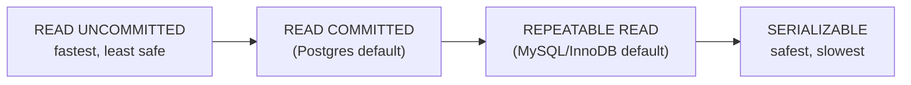

| Anomaly | What happens |
|---|---|
| **Dirty read** | You read data another transaction wrote but hasn't committed (and may roll back) |
| **Non-repeatable read** | You read row X twice in one transaction and get different values |
| **Phantom read** | You run the same `WHERE` query twice and new rows appear |
| **Lost update** | Two transactions read-modify-write the same row; one update vanishes |
| **Write skew** | Both transactions read a shared invariant, both write, and together they break it (classic: two on-call doctors both go off-shift) |

| Level | Dirty read | Non-repeatable | Phantom | Cost |
|---|---|---|---|---|
| Read Uncommitted | ✅ possible | ✅ | ✅ | Lowest |
| Read Committed | ❌ | ✅ | ✅ | Low |
| Repeatable Read | ❌ | ❌ | ⚠️ (prevented by InnoDB's gap locks, allowed by the standard) | Medium |
| Serializable | ❌ | ❌ | ❌ | Highest |

> **Interview line:** *"Almost nobody runs Serializable in production. The practical answer is Read Committed plus explicit handling for the rows that matter — optimistic locking with a version column, or `SELECT … FOR UPDATE` on the hot row. That gives you correctness where you need it and throughput everywhere else."*

---

## 3. SQL vs NoSQL

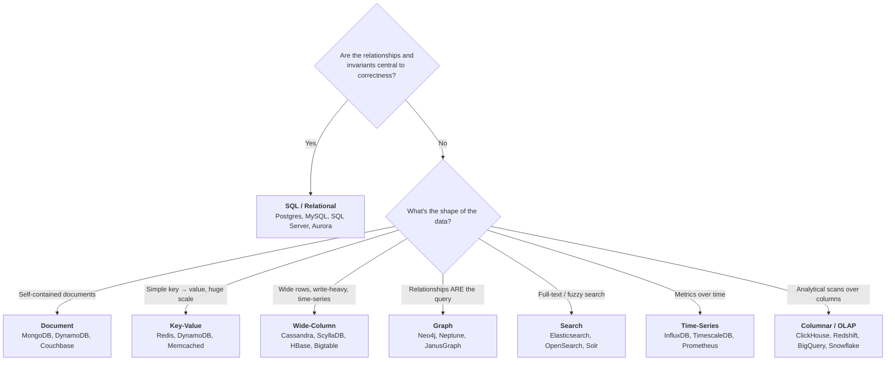

| | **SQL (Relational)** | **NoSQL** |
|---|---|---|
| Schema | Fixed, enforced, migrations required | Flexible / schema-on-read |
| Relationships | **JOINs** — first-class | Denormalise / embed / application-side joins |
| Transactions | Full ACID across rows & tables | Often single-document/single-partition only |
| Scaling | Vertical first; sharding is manual and painful | **Horizontal by design** |
| Consistency | Strong by default | Usually tunable / eventual |
| Query power | SQL — declarative, ad-hoc, expressive | Limited; you must design for known access patterns |
| Best at | Correctness, complex queries, reporting | Scale, throughput, flexible/evolving shapes |

> ⭐ **The mature answer to "SQL or NoSQL?":**
> *"Default to Postgres. It does JSONB, full-text search, geospatial, and now scales further than most teams will ever need. I'd move off it when I hit a specific wall — write throughput beyond a single leader, a truly schemaless shape, or a query pattern relational engines are bad at (graph traversal, log-scale time-series, full-text ranking). 'We might need scale one day' is not a reason; a measured bottleneck is."*

⚠️ **The NoSQL trap:** NoSQL doesn't remove joins — it moves them into your application, where they have no query planner, no transaction, and no index the DB can use. **You must know your access patterns before you model the data.** With DynamoDB/Cassandra you literally design the table around the query.

---

## 4. Indexing

> An index is a **separate sorted data structure** that trades write speed and disk space for read speed. Without one, the DB does a full table scan.

### 4.1 The structures

| Structure | Used by | Great at | Weak at |
|---|---|---|---|
| **B+Tree** | Postgres, MySQL/InnoDB, Oracle, SQL Server | Range scans, sorted reads, point lookups — O(log n) | Random-write amplification |
| **LSM Tree** ⭐ | Cassandra, RocksDB, LevelDB, HBase, ScyllaDB | **Write-heavy** workloads — buffers in memory, flushes sequentially | Read amplification (must check many SSTables) → mitigated by **bloom filters**; compaction cost |
| **Hash index** | Redis, some engines | O(1) exact match | ❌ No range queries, no ordering |
| **Inverted index** | Elasticsearch, Lucene | Full-text: term → list of documents | Not for OLTP row lookups |
| **Bitmap** | Data warehouses | Low-cardinality columns (gender, status) | Terrible for high-cardinality / frequent updates |
| **Geospatial** | PostGIS, R-tree, geohash, S2, quadtree | "Nearest N" and bounding-box queries | Specialised |

> **B+Tree vs LSM in one line:** *"B+Tree updates in place — good reads, costlier random writes. LSM appends and compacts — excellent writes, extra read work that bloom filters buy back. So write-heavy telemetry goes to Cassandra; read-heavy transactional data stays on Postgres."*

### 4.2 Rules that get asked

```sql
-- COMPOSITE INDEX: order matters. This index...
CREATE INDEX idx_user_created ON orders (user_id, created_at);

-- ✅ used (leftmost prefix)
WHERE user_id = 42
WHERE user_id = 42 AND created_at > '2026-01-01'
-- ❌ NOT used - created_at is not the leftmost column
WHERE created_at > '2026-01-01'
```

| Rule | Detail |
|---|---|
| **Leftmost prefix** | A composite index `(a,b,c)` serves `a`, `(a,b)`, `(a,b,c)` — never `b` alone |
| **Selectivity** | Index high-cardinality columns. An index on `status` with 3 values often loses to a scan |
| **Covering index** | If the index contains every column the query needs, the DB never touches the table — a big win |
| **Writes pay** | Every index must be updated on every `INSERT`/`UPDATE`/`DELETE`. 8 indexes = 8× write amplification |
| **Function kills it** | `WHERE LOWER(email) = ?` can't use an index on `email` — create a functional/expression index instead |
| **Clustered vs secondary** | Clustered index *is* the table order (InnoDB primary key). A secondary index stores the PK, so lookups do a second hop |

> ⭐ **How to answer "the query is slow":** *"`EXPLAIN ANALYZE` first — I want to know whether it's a sequential scan, a bad join order, or a cardinality misestimate. Then: index, or rewrite the query, or denormalise, or cache. Adding an index blindly is how you end up with a write-throughput problem instead."*

---

## 5. The Database Scaling Ladder

> ⭐ **Never jump straight to sharding.** Walk the ladder out loud — it's exactly the reasoning interviewers grade.

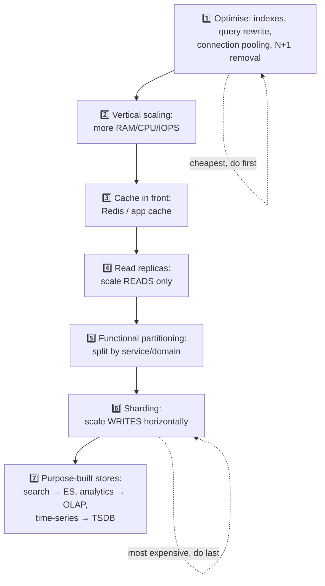

| Rung | Buys you | Cost |
|---|---|---|
| 1. Optimise | Often **10–100×** for free | Engineering time; ⭐ *always do this first* |
| 2. Vertical | Simple, no code change | Hard ceiling, expensive, still a SPOF |
| 3. Cache | Removes most reads from the DB | Staleness + a new critical dependency ([caching.md](caching.md)) |
| 4. Read replicas | Read scaling + HA + analytics isolation | **Replication lag** → read-your-writes breaks |
| 5. Functional split | Independent scaling and blast radius | ❌ You **lose cross-domain joins and transactions** |
| 6. Sharding | The only way to scale **writes** | Cross-shard queries, resharding, hot shards, no global transactions |
| 7. Specialised | Right tool per access pattern | More systems to operate + sync/CDC pipelines |

---

## 6. Replication

### 6.1 Topologies

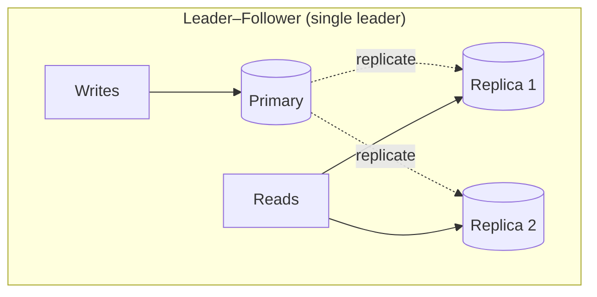

| Topology | Writes | Pros | Cons |
|---|---|---|---|
| **Single leader** | One node | Simple, no write conflicts, strong-ish | Leader is a write bottleneck + failover gap |
| **Multi-leader** | Several nodes (often one per region) | Low write latency per region, survives region loss | ⚠️ **Write conflicts** need resolution (LWW, CRDTs, app logic) |
| **Leaderless** (Dynamo-style) | Any node | Highly available, no failover | Quorums, read repair, tunable but complex |

**Quorum arithmetic (Cassandra/Dynamo):** with N replicas, W write acks and R read acks — **if $W + R > N$ you're guaranteed to read at least one node with the latest write.** Typical: N=3, W=2, R=2. Set W=1 for fast writes and accept staleness; W=N for strong writes and poor availability.

### 6.2 Sync vs async

| | Synchronous | Asynchronous | Semi-sync |
|---|---|---|---|
| Commit waits for | Replica ack | Nothing | **One** replica ack |
| Data loss on failover | None | ⚠️ Possible | Bounded |
| Write latency | High | Low | Medium |
| Availability | A slow replica blocks writes | Best | Good |

### 6.3 ⚠️ Replication lag — the trap you must name

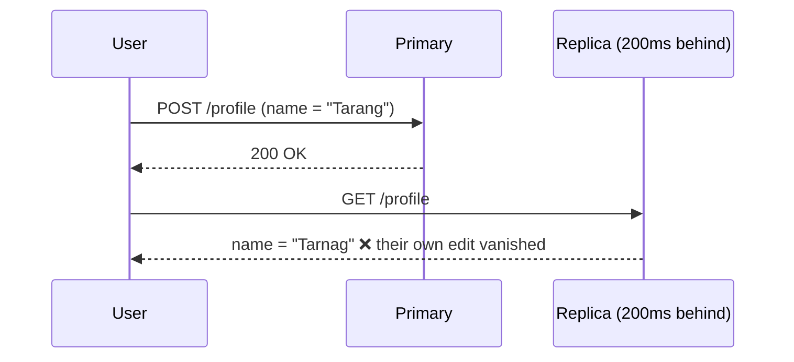

| Fix | How |
|---|---|
| **Read-your-writes** | Route a user's reads to the **primary** for N seconds after their write, or pin by session |
| **Monotonic reads** | Pin a user to one replica so they never go "back in time" |
| **Consistency token** | Client sends the log position (LSN/GTID) it must see; router picks a replica that's caught up |
| **Wait-for-replication** | Write returns only after the replica confirms (i.e. go synchronous for that path) |

> ⭐ *"A generic L4 load balancer in front of read replicas cannot solve this — it has no vocabulary for 'has this replica caught up?'. That's why you use a protocol-aware proxy like ProxySQL/PgBouncer/RDS Proxy or handle routing in the application."* → [load-balancer.md](load-balancer.md)

---

## 7. Sharding (Partitioning)

> **Vertical partitioning** = split *columns*/tables apart. **Horizontal partitioning (sharding)** = split *rows* across nodes. Interviewers mean the second one.

### 7.1 Strategies

| Strategy | Key | ✅ | ❌ |
|---|---|---|---|
| **Range** | `user_id 1–1M → S1`, `1M–2M → S2`; or by date | Efficient **range scans**; easy to reason about | ⚠️ **Hot shards** — newest date/ID gets all the traffic |
| **Hash** | `hash(user_id) % N` | Even distribution | ❌ No range queries; ⚠️ **`% N` remaps ~everything** when N changes |
| **Consistent hashing** ⭐ | Hash ring + virtual nodes | Only ~1/N keys move when adding a node | Slightly more complex; still needs bounded loads for hot keys |
| **Directory / lookup** | A lookup service maps key → shard | Total flexibility; easy rebalancing | The directory is a new SPOF and an extra hop (cache it) |
| **Geo / tenant** | Shard by region or customer | Data residency, locality, blast-radius isolation | Skew: one giant tenant = one melted shard |

### 7.2 Choosing the shard key — where designs live or die

> ⭐ **The shard key is the single most consequential decision in the data tier, and it is very hard to change later.**

A good shard key is:
1. **High cardinality** — many distinct values
2. **Evenly distributed** — no value dominates
3. **Present in most queries** — otherwise every read becomes a **scatter-gather** across all shards
4. **Stable** — it shouldn't change (moving a row between shards is expensive)

| Bad key | Why |
|---|---|
| `country` | India/US shards melt; Liechtenstein idles |
| `created_at` | All *current* writes hit one shard |
| `status` | 4 values → 4 shards max, and 90% are `ACTIVE` |
| auto-increment `id` | All new writes land on the last shard |

> **Worked example (chat app):** shard by `chat_id`, not `user_id` — all messages of a conversation live together, so loading a conversation is a single-shard read. But then "all chats for user X" becomes scatter-gather → keep a secondary index table sharded by `user_id`. **Say the trade-off; there is no free lunch.**

### 7.3 The three problems sharding creates

| Problem | Detail | Mitigation |
|---|---|---|
| **Cross-shard queries** | `JOIN`, `ORDER BY`, `COUNT(*)` across shards | Scatter-gather + merge in the app; denormalise; keep a search index; pre-aggregate |
| **No distributed transactions** | An ACID transaction across shards needs 2PC (slow, blocking) | Redesign so a transaction stays inside one shard; else **Saga** ([§11](#11-distributed-transactions)) |
| **Resharding** | Doubling shards means moving data while live | Consistent hashing; **pre-split into many logical shards** (e.g. 1024) and map several to each physical node — then rebalancing is just moving logical shards ⭐ |

> ⭐ **The pre-splitting trick is a strong senior answer:** *"I'd create 1024 logical partitions up front and map them onto 8 physical nodes. Growing to 16 nodes means reassigning logical partitions — no rehashing, no key movement beyond what's necessary."* This is how Vitess, Kafka partitions, and Elasticsearch shards work.

### 7.4 Celebrity / hot shard problem

One key (a celebrity user, a viral product) receives 10,000× the traffic of the average key.

**Fixes:** dedicated shard for known hot keys · **key splitting** (`celebrity:123#1..N` with reads fanned across them) · a local in-process cache in front · read replicas for that shard · **consistent hashing with bounded loads** ([load-balancer.md](load-balancer.md)).

---

## 8. Consistent Hashing (the 30-second version)

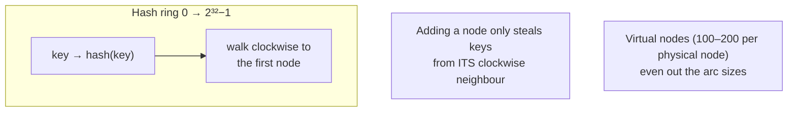

| Change | Keys remapped with `hash % N` | With consistent hashing |
|---|---|---|
| 3 → 4 nodes | ~**75%** | ~**25%** |
| 100 → 101 nodes | ~**99%** | ~**1%** |

For a cache tier that's the difference between a blip and **a total cache flush that takes the database down**. Full treatment (virtual nodes, Maglev, bounded loads): [load-balancer.md](load-balancer.md) §8.7–8.8.

---

## 9. Bloom Filters

> A **probabilistic** set membership structure. Answers *"is X definitely NOT in the set?"* with certainty, and *"is X in the set?"* with a tunable false-positive rate. **No false negatives.**

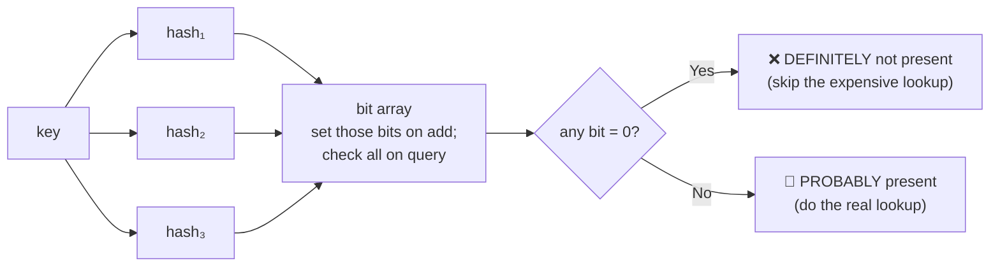

$$m = -\frac{n \ln p}{(\ln 2)^2}, \qquad k = \frac{m}{n}\ln 2$$

For **1 % false positives you need ≈ 9.6 bits per element** — 1 billion keys in ~1.2 GB, versus tens of GB for the real keys.

**Where they're used:**
| System | Purpose |
|---|---|
| Cassandra / HBase / RocksDB | Skip SSTables that can't contain the key (this is what makes LSM reads viable) |
| CDNs | "One-hit-wonder" filtering — don't cache an object until it's requested twice |
| Chrome / Safari | Malicious-URL checks without shipping the whole list |
| Caches | **Cache penetration** defence — reject keys that provably don't exist ([caching.md](caching.md) §13.2) |
| Bitcoin / Ethereum | Lightweight client filtering |

⚠️ **Standard bloom filters can't delete.** Use a **counting bloom filter** or a **cuckoo filter** if you need removal.

---

## 10. CAP & PACELC Applied

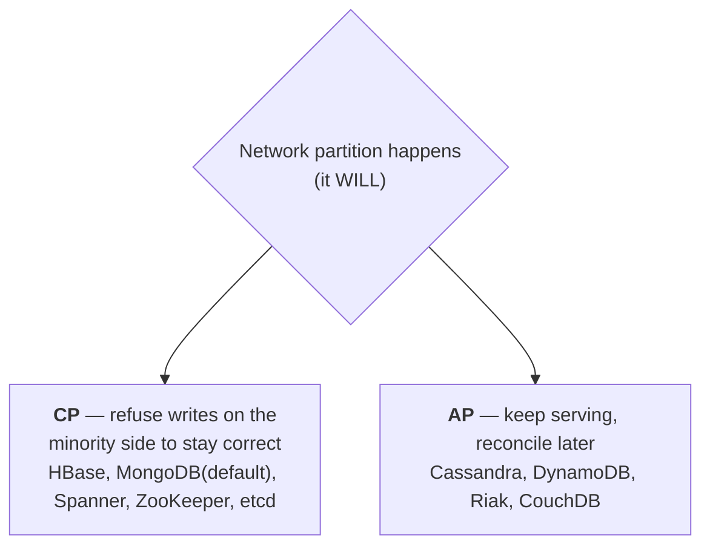

**PACELC** — the half everyone forgets:
> **If Partition → choose Availability or Consistency; Else (normal operation) → choose Latency or Consistency.**

| System | PACELC | Reading |
|---|---|---|
| **Cassandra / Dynamo** | PA/EL | Available under partition; fast (eventually consistent) normally |
| **Spanner** | PC/EC | Consistent always — pays latency (TrueTime + Paxos) |
| **MongoDB** | PC/EC (default) | Consistent, tunable via read/write concerns |
| **PostgreSQL** (single node) | — | No partition to tolerate; CA only in the trivial sense |

> ⭐ **The senior framing:** *"CAP is a choice you make **per operation**, not per system. In one product I'd want the payment write to be CP and the 'people also viewed' read to be AP. Modern databases are tunable, so the real design question is which operations can tolerate staleness."*

**Consistency models, strongest → weakest:**

| Model | Guarantee |
|---|---|
| **Linearizable / strict** | Every read sees the latest write, globally, as if there were one copy |
| **Sequential** | Everyone sees operations in the *same* order (not necessarily real time) |
| **Causal** | Causally related operations are seen in order; concurrent ones may differ |
| **Read-your-writes** | You always see your own writes |
| **Monotonic reads** | You never see time go backwards |
| **Eventual** | Given no new writes, all replicas converge — eventually |

---

## 11. Distributed Transactions

### 11.1 Two-Phase Commit (2PC)

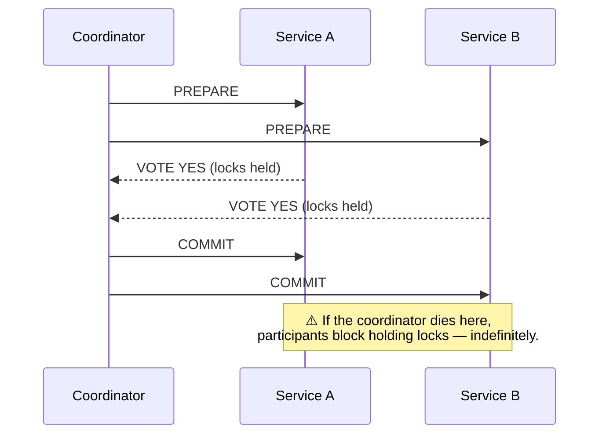

✅ Real atomicity. ❌ **Blocking**, synchronous, coordinator is a SPOF, locks held across network latency, throughput collapses. **Rarely used in modern microservices.**

### 11.2 Saga — the practical answer

A sequence of local transactions; each has a **compensating** transaction that semantically undoes it.


| Style | How | Trade-off |
|---|---|---|
| **Choreography** | Each service emits an event; others react | No central point; ⚠️ hard to see the whole flow, cyclic dependencies |
| **Orchestration** ⭐ | A saga orchestrator drives each step | Explicit, observable, testable; orchestrator must be HA |

⚠️ **A saga is not atomic** — it's *eventually consistent* with **no isolation**. Someone can observe the half-finished state. Compensations must be **idempotent** and **commutative-safe**, and some actions (an email sent, a rocket launched) can't be compensated at all.

### 11.3 The Transactional Outbox

> **The dual-write problem:** you must write to the DB *and* publish an event. Two systems, no shared transaction → one can succeed and the other fail.

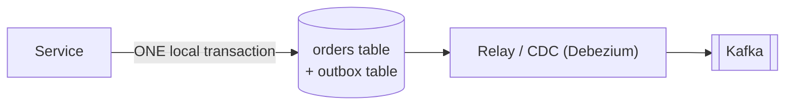

Write the business row **and** the event row in the *same* local transaction. A relay (or CDC on the WAL) publishes from the outbox. **At-least-once** delivery, so consumers must be idempotent.

### 11.4 Idempotency — the glue that makes all of this safe

```sql
-- The client sends Idempotency-Key: 8f14e45f. Retries reuse the same key.
INSERT INTO payments (idempotency_key, order_id, amount, status)
VALUES ('8f14e45f', 42, 9900, 'PENDING')
ON CONFLICT (idempotency_key) DO NOTHING;
```
> ⭐ **Say this in every payment/booking question:** *"Networks retry. Without an idempotency key you will double-charge someone. I'd store the key with the result, return the stored result on a repeat, and expire keys after 24 hours."* → [rest-api.md](rest-api.md)

---

## 12. Choosing a Database

| Requirement | Choose | Why |
|---|---|---|
| Financial ledger, orders, inventory | **PostgreSQL / MySQL** | ACID, constraints, joins, mature ops |
| Session store, rate limiter, leaderboard, lock | **Redis** | In-memory, rich types, TTL, atomic ops |
| Product catalog with varying attributes | **MongoDB / DynamoDB** | Flexible documents, no migration per attribute |
| 1M writes/sec of telemetry | **Cassandra / ScyllaDB** | LSM, leaderless, linear write scaling |
| Metrics & dashboards | **Prometheus / InfluxDB / Timescale** | Time-series compression + downsampling |
| Full-text / faceted search | **Elasticsearch / OpenSearch** | Inverted index, relevance ranking, aggregations |
| "Friends of friends", fraud rings, recommendations | **Neo4j / Neptune** | Traversals are O(edges), not O(joins) |
| BI over billions of rows | **ClickHouse / BigQuery / Snowflake** | Columnar + vectorised + massively parallel |
| Global, strongly consistent, multi-region | **Spanner / CockroachDB / YugabyteDB** | Consensus + synchronized clocks |
| Blobs: images, video, backups | **S3 / GCS / Blob Storage** ⭐ | ⚠️ **Never put large binaries in a relational DB** — store the URL |

> ⭐ **Polyglot persistence:** real systems use several. *"Postgres for orders, Redis for sessions, Elasticsearch for search, S3 for media, ClickHouse for analytics — each one where its access pattern wins. The cost is keeping them in sync, which I'd do with CDC rather than dual writes."*

---

## 13. Rapid-fire Q&A

| Question | Answer |
|---|---|
| **What is ACID?** | Atomicity (all-or-nothing), Consistency (invariants hold), Isolation (concurrent txns don't corrupt), Durability (survives crashes). |
| **How is durability implemented?** | Write-Ahead Log — append the intent sequentially and `fsync` before modifying data pages. |
| **ACID-C vs CAP-C?** | ACID-C = database constraints/invariants. CAP-C = every read sees the latest write. Completely different. |
| **What is MVCC?** | Multi-Version Concurrency Control — each write creates a new version, readers see a consistent snapshot, so **readers never block writers**. |
| **Default isolation level?** | Postgres: Read Committed. MySQL/InnoDB: Repeatable Read. Serializable is rare in production. |
| **SQL vs NoSQL — how do you choose?** | Start relational. Move when you hit a measured wall: write throughput past a single leader, genuinely schemaless data, or an access pattern relational engines are bad at. |
| **When is NoSQL wrong?** | When correctness depends on multi-entity transactions and joins, or when you don't yet know your access patterns. |
| **B+Tree vs LSM tree?** | B+Tree updates in place — better reads, costlier random writes. LSM appends + compacts — excellent writes, extra read amplification offset by bloom filters. |
| **Why is my index not used?** | Wrong leftmost prefix, a function wrapped around the column, low selectivity, stale statistics, or implicit type coercion. |
| **Cost of an index?** | Slower writes (every index updated per write), more disk, more memory. |
| **What's a covering index?** | One containing all columns the query needs, so the engine never reads the table. |
| **How do you scale a database?** | Optimise → vertical → cache → read replicas → functional split → shard → specialised stores. In that order. |
| **Read replicas fix what?** | Reads and availability. **Not writes.** And they introduce replication lag. |
| **What is replication lag and how do you handle it?** | Followers trail the leader. Fix read-your-writes by routing recent writers to the primary, pinning sessions, or using a consistency token. |
| **Sharding strategies?** | Range, hash, consistent hashing, directory, geo/tenant. |
| **How do you pick a shard key?** | High cardinality, even distribution, present in most queries, stable. Otherwise you get hot shards or scatter-gather everywhere. |
| **Biggest downside of sharding?** | You lose cross-shard joins and transactions, and resharding is operationally hard. |
| **How do you reshard without downtime?** | Pre-split into many logical shards mapped onto fewer physical nodes; rebalance by moving logical shards. Or consistent hashing. |
| **What's a hot shard and how do you fix it?** | One key/range takes disproportionate traffic. Split the key, cache it locally, give it a dedicated shard, or use bounded-load hashing. |
| **What is a bloom filter?** | A probabilistic set — no false negatives, tunable false positives, ~10 bits/element for 1%. Used to skip expensive lookups. |
| **Explain CAP with a real choice.** | Under partition: CP refuses writes to stay correct (Spanner, etcd); AP keeps serving and reconciles (Cassandra, Dynamo). It's a per-operation choice. |
| **What is PACELC?** | CAP plus: even with no partition, you still trade **Latency vs Consistency**. |
| **2PC vs Saga?** | 2PC is atomic but blocking with a coordinator SPOF. Saga is a chain of local transactions with compensations — eventually consistent, no isolation, but it scales. |
| **How do you avoid double-charging?** | Idempotency key stored with the result; retries return the stored response. Plus a unique constraint in the DB as the backstop. |
| **How do you publish an event and write a row atomically?** | **Transactional outbox** — write both in one local transaction, relay/CDC publishes from the outbox. Never dual-write. |
| **Where do you store images/video?** | Object storage (S3), with the URL in the database. Never blobs in a relational DB. |

---

## 14. Real-World Case Studies — Uber Docstore & LinkedIn's storage stack

> **Sources:** Uber — *[Serving 40M reads/sec with an integrated cache](https://www.uber.com/en-US/blog/how-uber-serves-over-40-million-reads-per-second-using-an-integrated-cache/)* and *[From static rate-limiting to intelligent load management](https://www.uber.com/in/en/blog/from-static-rate-limiting-to-intelligent-load-management/)* · LinkedIn — *[Northguard and Xinfra](https://www.linkedin.com/blog/engineering/infrastructure/introducing-northguard-and-xinfra)*.

### 14.1 Uber Docstore — what "MySQL at planet scale" actually looks like

**Docstore** and its append-optimised sibling **Schemaless** are Uber's in-house distributed databases built **on top of MySQL**. Scale: thousands of clusters, **tens of petabytes**, **tens of millions of requests/sec**, billions of rows read or updated, backing 170M+ monthly active users.

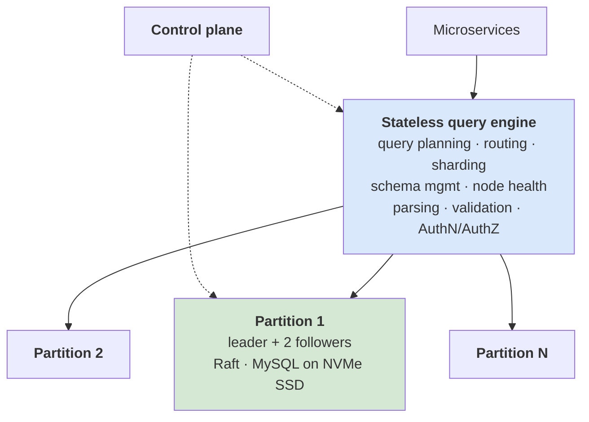

| Layer | Owns |
|---|---|
| **Stateless query engine** | Query planning, request routing, sharding, schema management, node health monitoring, parsing, validation, authorization |
| **Stateful storage engine** | Transactions, connection pooling, **consensus via Raft**, replication, concurrency control, load management |
| **Partition** | **1 leader + 2 followers** of MySQL on **locally attached NVMe SSDs**, coordinated by Raft for **strong consistency** |

**Four things to take from this architecture:**

1. **Separating a stateless routing tier from a stateful storage tier is the standard shape.** It's what lets you scale query capacity and storage capacity independently — the same split as [§5 The scaling ladder](#5-the-database-scaling-ladder), just made explicit.
2. **"Use a distributed database" usually means "use MySQL/Postgres with a consensus layer on top."** Docstore, Vitess, PlanetScale and CockroachDB all keep a boring, battle-tested storage engine and add consensus + sharding around it. Saying this is far stronger than naming an exotic database.
3. **Replication factor 3 with Raft** ([distributed-systems.md §4](distributed-systems.md#4-consensus--leader-election)) is the default for a reason: a majority quorum of 3 tolerates one failure at the lowest cost.
4. **Cost scales with the replication topology, not with the data.** Uber's blunt framing: capacity increases are *"multiplied 6× to handle each of the 3 stateful nodes across both regions."* That single sentence is the best argument for caching a read-heavy workload instead of scaling the database.

### 14.2 Partition key vs primary key — the distinction people fumble

Docstore makes the relationship explicit, and it's the cleanest definition you'll find:

| Term | Definition |
|---|---|
| **Primary key** (row key) | Uniquely identifies a row and enforces uniqueness. One or more columns |
| **Partition key** | A **prefix of the primary key** that determines **which shard the row lives in** |

> They are not separate keys — *"partition keys are simply a part of (or equal to) the primary."*

**Example from the blog:**

| Table | Partition key | Primary key |
|---|---|---|
| `person` | `person_id` | `person_id` |
| `orders` | `cust_id` | `(cust_id, order_id)` |

That design means **all of one customer's orders live on one shard** — so "fetch this customer's orders" is a single-shard read rather than a scatter-gather ([§7](#7-sharding-partitioning)). It's also exactly how DynamoDB (partition key + sort key) and Cassandra (partition key + clustering columns) model data.

### 14.3 Why scaling a hot workload the "obvious" way fails

Uber lists the ladder they climbed and why every rung ran out — this is the honest version of [§5](#5-the-database-scaling-ladder):

| Rung | Why it stopped working |
|---|---|
| **Optimise data model + queries** | *"There's a limit to how far one can optimise… beyond that, squeezing out more performance is not possible."* |
| **Vertical scaling** | *"The database engine itself becomes a bottleneck."* Bigger hardware stops helping |
| **Horizontal scaling (more partitions)** | Works "to an extent", but is *"operationally more complex and lengthy"* — you must preserve durability and resiliency with no downtime — and crucially **"doesn't fully help solve the issues of hot keys/partitions/shards"** |
| **Request imbalance** | Reads were **orders of magnitude** higher than writes, so the leader MySQL node struggles regardless of how you split |
| **Cost** | Every rung is multiplied by (replicas × regions) |

> ⭐ **Say this:** *"Sharding is the answer to a **capacity** problem. It is not the answer to a **skew** problem — resharding doesn't fix a hot key, it just gives the hot key a smaller neighbourhood. For skew I'd reach for caching, key-splitting, or bounded-load hashing first."*

### 14.4 Protecting a stateful database from overload

The full story is in [load-balancer.md §26](load-balancer.md#26-real-world-case-study--ubers-load-manager-static-rate-limits--priority-aware-shedding), but three points belong in a database discussion:

| Point | Detail |
|---|---|
| **Put admission control next to the state** | Uber first tried quota-based rate limiting in the *stateless* routing tier. It failed, partly because the routing tier would have had to track realtime health for **thousands of partitions**. Conclusion: *"overload management must live as close to the storage nodes as possible."* |
| **Byte-based cost models lie** | In MySQL, *"a query that performs a full table scan but returns a single row was assigned the same capacity cost as a query that only reads a single row."* Any quota built on that metric is meaningless — a great point to raise if an interviewer proposes "cost-based" rate limiting |
| **Hot partition keys need their own regulator** | Concurrency-based shedding is blind to skew: a low-QPS caller with huge writes, or traffic concentrated on one partition key, will overload one cluster while the rest idle. Uber runs dedicated **write-bytes** and **partition-key** regulators alongside the general shedder |

### 14.5 Consistency is a **per-flow** decision, not a database-wide one

Docstore is strongly consistent; its cache is not. So caching was made **opt-in per database, per table, and even per request**:

| Flow | Choice | Reason |
|---|---|---|
| Items in an Eats **cart** | **Bypass the cache** | Read-your-writes matters; a stale cart is a bug |
| A restaurant **menu** | **Use the cache** | Low write throughput, staleness is harmless |

> ⭐ This is the practical form of **PACELC** ([§10](#10-cap--pacelc-applied)): with no partition you are still trading **latency against consistency**, and the right trade differs per endpoint. The strongest version of the answer is *"I'd expose it as a per-request header rather than picking one global consistency level."*

They also added an explicit **invalidate-after-write API** so callers that need read-your-writes can get it on point writes, while conditional updates fall back to CDC-driven invalidation.

### 14.6 LinkedIn — a storage stack chosen per access pattern

The `Xinfra-metadata-service` is a compact, real example of **polyglot persistence** ([§12](#12-choosing-a-database)) — four stores in one service, each doing what it's best at:

| Store | Used for | Why |
|---|---|---|
| **MySQL** | Virtual/physical topic and cluster metadata | Relational, low volume, needs transactions and constraints |
| **ZooKeeper** | Membership, leadership, consumer-group allocation and rebalancing | Consensus-backed coordination — *not* a database ([distributed-systems.md §5](distributed-systems.md#5-distributed-locking)) |
| **Vitess** (sharded MySQL) + a coalescing buffer | Consumer checkpoint storage | High write rate; the buffer collapses repeated offset updates before they hit disk |
| **Couchbase** | Cache in front of checkpoints | Low-latency checkpoint reads and writes |

And **Northguard's own storage engine** is a tidy summary of storage-engine vocabulary: a **write-ahead log**, **file-per-segment**, **Direct I/O**, and a **sparse index kept in RocksDB** (an LSM store — [§4](#4-indexing)). Appends batch until ~10 ms pass or a size/count limit is hit; then WAL write → append → `fsync` → index update. Direct I/O avoids double buffering and keeps state consistent across `fsync` failures.

**Durability, stated as a number** — the clearest ACID-D contrast you'll find:

| System | Durability guarantee |
|---|---|
| Kafka (as configured at LinkedIn) | **Lazy syncs** — 10 seconds / 20k records |
| Northguard | **`fsync` on all replicas before the produce ack** — 10 ms / 20k records / 10 MB |

> ⭐ **Say this:** *"Durability isn't a boolean, it's a window. The honest question is 'how many milliseconds of acknowledged writes am I willing to lose, and on how many replicas must the fsync land before I ack?' LinkedIn moved from a 10-second lazy sync to fsync-on-all-replicas-before-ack, and paid for it with a better replication design rather than with latency."*

### 14.7 Numbers worth memorising

| Fact | Number |
|---|---|
| Docstore scale | Tens of PB, tens of millions of req/sec, thousands of clusters |
| Docstore partition topology | 1 leader + 2 followers, Raft, NVMe SSD |
| Cost multiplier per capacity increase | **6×** (3 nodes × 2 regions) |
| Share of Docstore queries that are point reads | **> 50%** |
| Cache vs database cost for one 6M-RPS use case | ~**3K Redis cores** vs ~**60K database cores** |
| Overload protection gains (PID shedder vs token bucket) | **+80%** throughput, **−70%** p99 |
| LinkedIn Kafka volume before migration | 32 T records/day, 17 PB/day, 400K topics, 150 clusters |
| Kafka control-plane limit | **1** controller / **1** state machine vs Northguard's **128+** |
