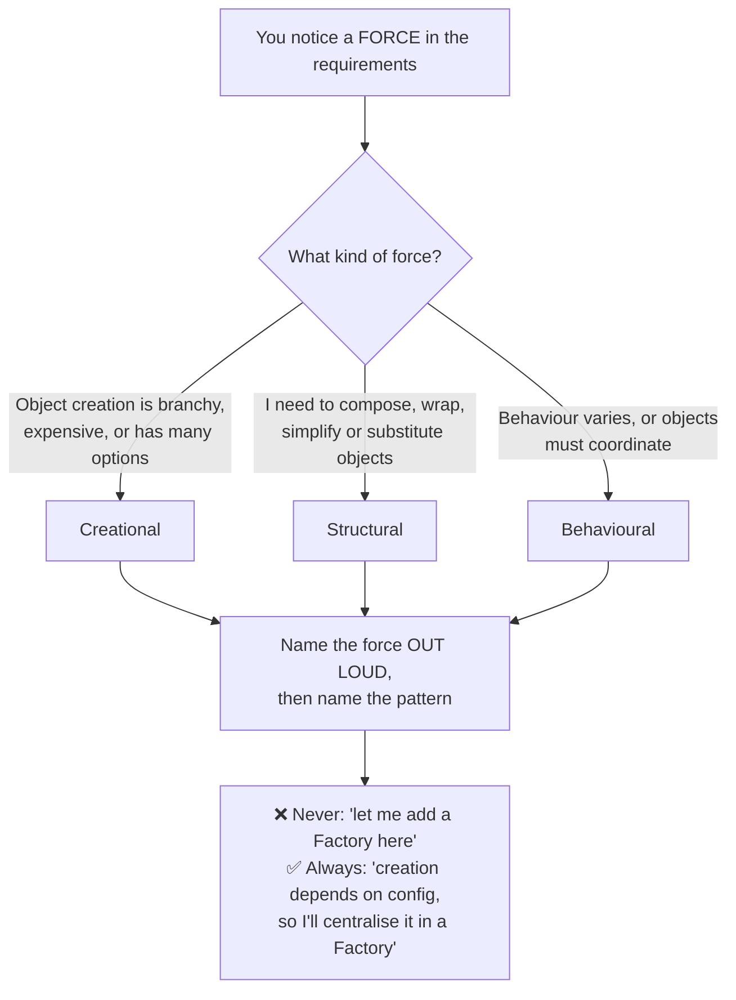
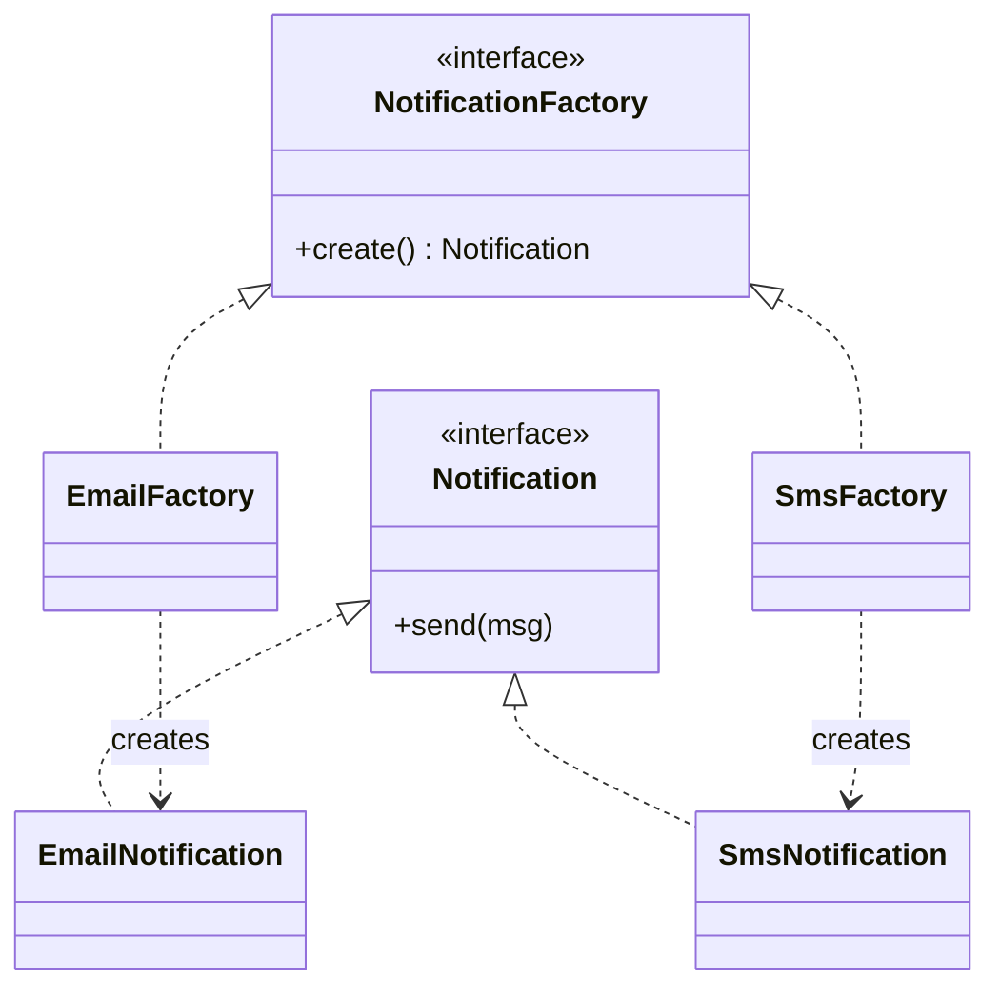
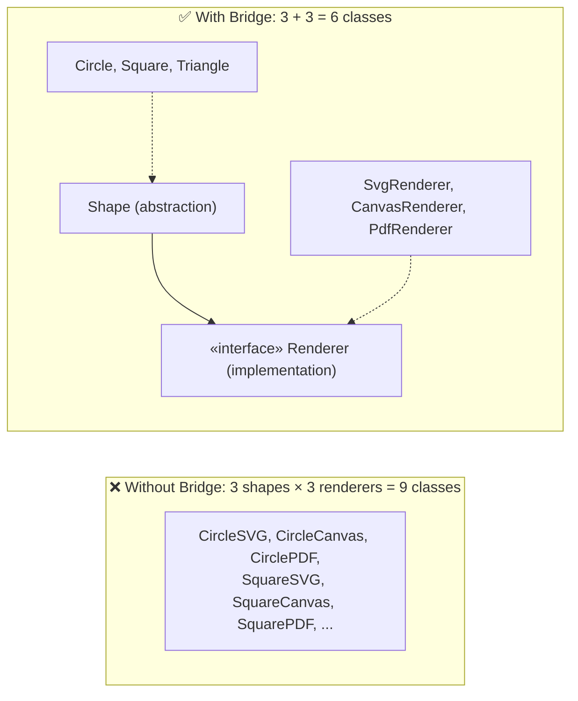
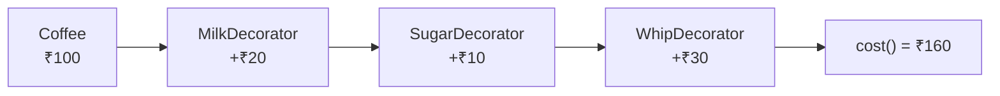
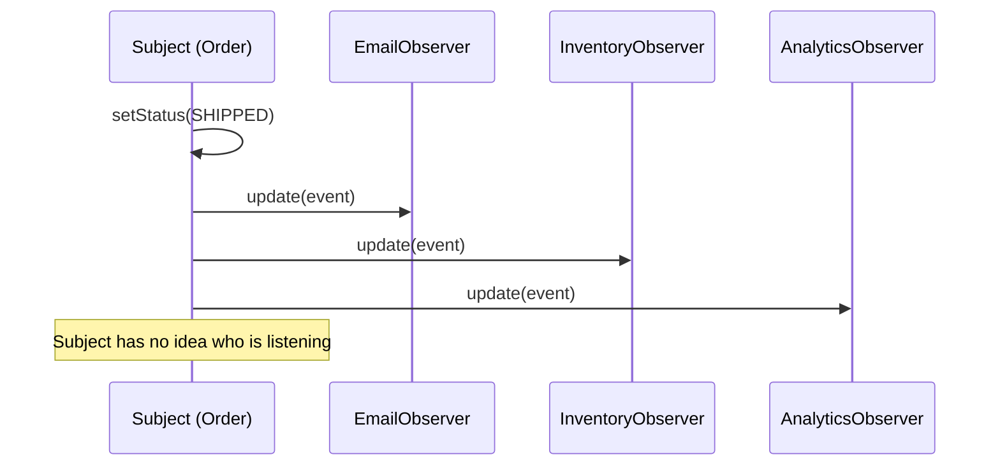
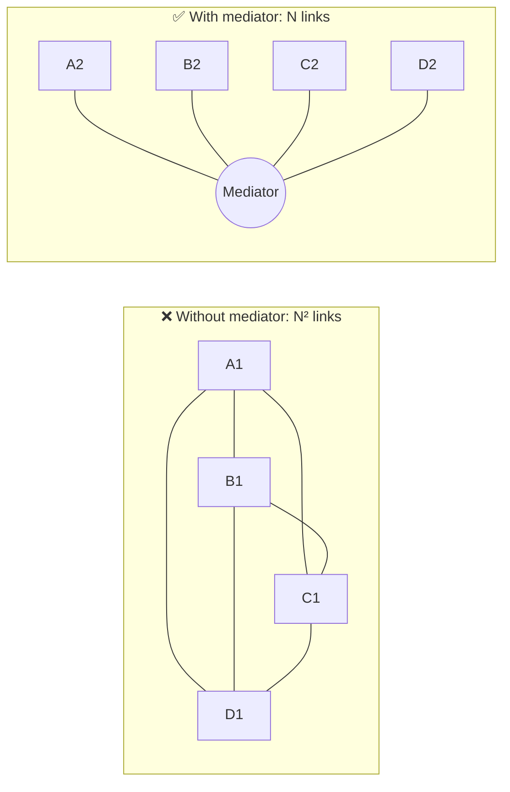

# Design Patterns — All 23 GoF Patterns, Interview-Ready

> **Purpose:** For each pattern: *the force that demands it → structure → code → real-world use → when NOT to use it.*
> **Sources:** [awesome-low-level-design](https://github.com/ashishps1/awesome-low-level-design) · Head First Design Patterns · GoF · Refactoring.Guru
> **Companions:** [low-level-design.md](low-level-design.md) · [concurrency.md](concurrency.md) · [README.md](README.md)

---

## Quick Index

| Creational (5) | Structural (7) | Behavioural (11) |
|---|---|---|
| [Singleton](#singleton) | [Adapter](#adapter) | [Strategy](#strategy) |
| [Factory Method](#factory-method) | [Bridge](#bridge) | [Observer](#observer) |
| [Abstract Factory](#abstract-factory) | [Composite](#composite) | [State](#state) |
| [Builder](#builder) | [Decorator](#decorator) | [Command](#command) |
| [Prototype](#prototype) | [Facade](#facade) | [Chain of Responsibility](#chain-of-responsibility) |
| | [Flyweight](#flyweight) | [Template Method](#template-method) |
| | [Proxy](#proxy) | [Iterator](#iterator) |
| | | [Mediator](#mediator) |
| | | [Memento](#memento) |
| | | [Visitor](#visitor) |
| | | [Interpreter](#interpreter) |

---

## 0. How to actually use patterns in an interview



### The decision table — go from symptom to pattern

| Symptom in the requirements | Pattern |
|---|---|
| "The algorithm/rule varies and will keep changing" | **Strategy** |
| "Behaviour depends on which mode the object is in" | **State** |
| "Many things must react when one thing changes" | **Observer** |
| "10 constructor parameters, most optional" | **Builder** |
| "Which concrete class to create depends on input/config" | **Factory Method** |
| "A whole *family* of related objects must stay consistent" | **Abstract Factory** |
| "Exactly one instance, globally reachable" | **Singleton** ⚠️ |
| "Two incompatible interfaces must work together" | **Adapter** |
| "Add responsibilities at runtime without subclass explosion" | **Decorator** |
| "Tree structure; treat leaf and branch the same" | **Composite** |
| "A complicated subsystem needs a simple front door" | **Facade** |
| "Millions of near-identical objects blow up memory" | **Flyweight** |
| "Control access: lazy-load, cache, permission-check, remote" | **Proxy** |
| "A request should be tried by several handlers in order" | **Chain of Responsibility** |
| "Requests need to be queued, logged, undone" | **Command** |
| "Same skeleton, different steps" | **Template Method** |
| "Traverse a collection without exposing its internals" | **Iterator** |
| "N objects all talking to each other = spaghetti" | **Mediator** |
| "Undo / snapshot / restore" | **Memento** |
| "Add operations to a stable class hierarchy" | **Visitor** |
| "Abstraction and implementation must vary independently" | **Bridge** |

---

# CREATIONAL PATTERNS

## Singleton

**Force:** exactly one instance must exist, and it must be globally reachable (config, connection pool, logger, cache).

```java
// ✅ Enum singleton - serialization-safe, reflection-safe, thread-safe by the JVM
public enum ConfigManager {
    INSTANCE;
    private final Properties props = load();
    public String get(String key) { return props.getProperty(key); }
}

// ✅ Bill Pugh holder idiom - lazy, thread-safe, no synchronization cost
public final class ConnectionPool {
    private ConnectionPool() { }
    private static final class Holder { static final ConnectionPool INSTANCE = new ConnectionPool(); }
    public static ConnectionPool getInstance() { return Holder.INSTANCE; }
}

// ⚠️ Double-checked locking - correct ONLY with `volatile`
public final class Registry {
    private static volatile Registry instance;    // volatile is mandatory
    public static Registry getInstance() {
        if (instance == null) {
            synchronized (Registry.class) {
                if (instance == null) instance = new Registry();
            }
        }
        return instance;
    }
}
```

**Real-world:** `java.lang.Runtime`, Spring beans (default scope), logger factories, `.NET` `HttpClient` (recommended single instance).

**❌ When NOT to use it (say this — it's a maturity signal):**
> *"Singleton is global mutable state wearing a design-pattern hat. It hides dependencies, makes unit tests order-dependent, and is a concurrency hazard. In practice I'd register one instance in a DI container instead — I get the 'one instance' guarantee without the global access point."*

⚠️ **Interview traps:** why `volatile` is required (instruction reordering during construction can publish a half-built object) · why the enum version defeats reflection and serialization attacks · Singleton **per classloader**, not per JVM.

---

## Factory Method

**Force:** the concrete class to instantiate depends on input/config, and you don't want that `switch` duplicated at every call site.



```java
public interface Notification { void send(String to, String body); }

// Simple Factory (not strictly GoF, but the most common interview answer)
public final class NotificationFactory {
    private static final Map<Channel, Supplier<Notification>> REGISTRY = Map.of(
        Channel.EMAIL, EmailNotification::new,
        Channel.SMS,   SmsNotification::new,
        Channel.PUSH,  PushNotification::new
    );
    public static Notification create(Channel channel) {
        return Optional.ofNullable(REGISTRY.get(channel))
                       .orElseThrow(() -> new IllegalArgumentException("unsupported: " + channel))
                       .get();
    }
}
```

> ⭐ **The registry-map version is strictly better than a `switch`** — adding a channel is one map entry, so the factory itself becomes Open/Closed too.

**Real-world:** `Calendar.getInstance()`, `NumberFormat.getInstance()`, `Executors.newFixedThreadPool()`, JDBC `DriverManager.getConnection()`.

**❌ Skip it when** there's only one implementation, or `new Foo()` is genuinely fine. Don't wrap a single constructor in ceremony.

---

## Abstract Factory

**Force:** you need **families** of related objects that must be used together and never mixed.

```java
// The family: every widget must match the OS theme. Mixing = broken UI.
public interface GuiFactory {
    Button   createButton();
    Checkbox createCheckbox();
    Menu     createMenu();
}
public final class MacFactory     implements GuiFactory { /* Mac* products */ }
public final class WindowsFactory implements GuiFactory { /* Windows* products */ }

// The client never knows which OS it's on.
class Application {
    private final GuiFactory factory;
    Application(GuiFactory factory) { this.factory = factory; }
    void render() { factory.createButton().paint(); factory.createCheckbox().paint(); }
}
```

**Factory Method vs Abstract Factory** (the classic confusion):

| | Factory Method | Abstract Factory |
|---|---|---|
| Produces | **One** product | A **family** of products |
| Mechanism | Inheritance (subclass overrides the factory method) | Composition (client holds a factory object) |
| Example | `createButton()` | `GuiFactory` producing button + checkbox + menu |

**Real-world:** `DocumentBuilderFactory`, JDBC driver families, cross-platform UI toolkits, cloud SDK clients (one factory per region/provider).

---

## Builder

**Force:** an object has many parameters, most optional, and telescoping constructors are unreadable / order-error-prone.

```java
// ❌ Telescoping constructors: what does `new Pizza(12, true, false, true, false)` mean?
// ✅ Builder: named, validated, immutable result
public final class Pizza {
    private final Size size;                 // required
    private final boolean extraCheese;
    private final List<Topping> toppings;

    private Pizza(Builder b) {
        this.size = b.size; this.extraCheese = b.extraCheese;
        this.toppings = List.copyOf(b.toppings);          // defensive copy => immutable
    }

    public static Builder builder(Size size) { return new Builder(size); }

    public static final class Builder {
        private final Size size;
        private boolean extraCheese = false;
        private final List<Topping> toppings = new ArrayList<>();

        private Builder(Size size) { this.size = Objects.requireNonNull(size); }
        public Builder extraCheese()            { this.extraCheese = true; return this; }
        public Builder topping(Topping t)       { this.toppings.add(t);    return this; }

        public Pizza build() {
            if (toppings.size() > 8) throw new IllegalStateException("max 8 toppings");
            return new Pizza(this);           // validate invariants HERE, once
        }
    }
}

Pizza p = Pizza.builder(Size.LARGE).extraCheese().topping(Topping.OLIVE).build();
```

**Real-world:** `StringBuilder`, `Stream.Builder`, OkHttp `Request.Builder`, Lombok `@Builder`, `HttpClient.newBuilder()`.

> ⭐ **Say this:** *"The real win isn't fluent syntax — it's that `build()` is the single place cross-field invariants are validated, and the product comes out immutable and therefore thread-safe."*

---

## Prototype

**Force:** creating an object from scratch is expensive (DB load, parsing, network), but cloning a template is cheap.

```java
public interface Prototype<T> { T deepCopy(); }

public final class DocumentTemplate implements Prototype<DocumentTemplate> {
    private final List<Section> sections;    // expensive to build the first time
    @Override public DocumentTemplate deepCopy() {
        return new DocumentTemplate(sections.stream().map(Section::deepCopy).toList());
    }
}
```

⚠️ **Shallow vs deep copy is the whole interview.** Java's `Object.clone()` is shallow — nested mutable objects stay shared, so mutating the copy corrupts the original. Prefer an explicit copy constructor or a serialization round-trip.

**Real-world:** `Object.clone()`, JavaScript `structuredClone()`, game entity spawning, config templates.

---

# STRUCTURAL PATTERNS

## Adapter

**Force:** you have a class you can't change (third-party, legacy) whose interface doesn't match what your code expects.

```java
// Your code speaks this:
public interface PaymentProcessor { PaymentResult pay(Money amount); }

// The vendor SDK speaks this, and you can't edit it:
public final class LegacyStripeSdk { public int chargeInCents(long cents, String currency) { ... } }

// Adapter translates.
public final class StripeAdapter implements PaymentProcessor {
    private final LegacyStripeSdk sdk;
    @Override public PaymentResult pay(Money amount) {
        int code = sdk.chargeInCents(amount.minorUnits(), amount.currency().getCurrencyCode());
        return code == 0 ? PaymentResult.success() : PaymentResult.failure(code);
    }
}
```

**Adapter vs Facade vs Decorator** (asked together — memorise this):

| | Intent | Interface |
|---|---|---|
| **Adapter** | Make an *existing incompatible* interface usable | **Changes** the interface |
| **Facade** | Simplify a *complex subsystem* | Introduces a **new, simpler** interface |
| **Decorator** | Add *responsibilities* at runtime | **Keeps** the same interface |
| **Proxy** | Control *access* | **Keeps** the same interface |

**Real-world:** `Arrays.asList()`, `InputStreamReader` (bytes→chars), SLF4J bridges, ORM dialects.

---

## Bridge

**Force:** two dimensions vary independently, and inheritance would give you a **combinatorial explosion** of subclasses.



```java
public interface Renderer { void drawCircle(double x, double y, double r); }

public abstract class Shape {
    protected final Renderer renderer;            // the BRIDGE
    protected Shape(Renderer renderer) { this.renderer = renderer; }
    public abstract void draw();
}
public final class Circle extends Shape {
    @Override public void draw() { renderer.drawCircle(x, y, radius); }
}
```

**Bridge vs Strategy:** structurally identical. **Bridge** separates two *hierarchies* that both grow (a structural concern, usually decided up front); **Strategy** swaps one *algorithm* (a behavioural concern, often decided at runtime).

**Real-world:** JDBC (`Driver` = implementation, `Connection` API = abstraction), SLF4J, device drivers, cross-platform rendering.

---

## Composite

**Force:** you have a tree, and clients should treat a single item and a group of items **identically**.

```java
public interface FileSystemNode {
    long size();
    void print(String indent);
}

public record File(String name, long bytes) implements FileSystemNode {
    public long size() { return bytes; }
    public void print(String i) { System.out.println(i + name + " (" + bytes + ")"); }
}

public final class Directory implements FileSystemNode {
    private final String name;
    private final List<FileSystemNode> children = new ArrayList<>();
    public Directory add(FileSystemNode n) { children.add(n); return this; }

    // Uniform treatment: a directory's size is just the sum of its children's sizes.
    public long size() { return children.stream().mapToLong(FileSystemNode::size).sum(); }
    public void print(String i) {
        System.out.println(i + name + "/");
        children.forEach(c -> c.print(i + "  "));
    }
}
```

**Real-world:** file systems, DOM/HTML, UI widget trees, org charts, nested menus, `java.awt.Container`, arithmetic expression trees.

⚠️ **Trap:** where do you put `add()`/`remove()`? On the base interface (uniform but leaves must throw) or only on `Composite` (type-safe but clients need `instanceof`). Mention the trade-off — GoF favours the uniform version.

---

## Decorator

**Force:** add behaviour to individual objects **at runtime**, without subclass explosion.



```java
public interface Coffee { double cost(); String description(); }
public record SimpleCoffee() implements Coffee {
    public double cost() { return 100; }
    public String description() { return "Coffee"; }
}

public abstract class CoffeeDecorator implements Coffee {
    protected final Coffee inner;                       // wraps the SAME interface
    protected CoffeeDecorator(Coffee inner) { this.inner = inner; }
}
public final class Milk extends CoffeeDecorator {
    public Milk(Coffee c) { super(c); }
    public double cost()        { return inner.cost() + 20; }
    public String description() { return inner.description() + ", milk"; }
}

Coffee order = new Whip(new Sugar(new Milk(new SimpleCoffee())));   // ₹160
```

**Real-world:** `java.io` (`new BufferedReader(new InputStreamReader(new FileInputStream(f)))`) — the textbook example · Express/ASP.NET middleware · Python `@decorator` · gRPC/HTTP interceptors.

⚠️ **Cost:** deep wrapping makes stack traces and debugging painful, and identity checks (`==`, `equals`) get confusing.

---

## Facade

**Force:** a subsystem has 6 classes and a 12-step correct order of operations; clients keep getting it wrong.

```java
// Subsystem: VideoDecoder, AudioMixer, CodecFactory, BitrateCalculator, FileWriter...
public final class VideoConverterFacade {
    public File convert(File source, Format target) {
        var codec  = CodecFactory.extract(source);
        var buffer = new VideoDecoder(codec).decode(source);
        var audio  = new AudioMixer().normalise(buffer.audioTrack());
        return new FileWriter().write(new Encoder(target).encode(buffer, audio));
    }
}
```

> **Facade doesn't hide the subsystem — it just gives you a front door.** Power users can still reach the classes underneath. That distinguishes it from an Adapter (which replaces an interface).

**Real-world:** `javax.faces.context.FacesContext`, SLF4J's `LoggerFactory`, Spring's `JdbcTemplate`, any SDK's top-level client class, an **API Gateway** at the architecture level.

---

## Flyweight

**Force:** millions of objects that are mostly identical are exhausting memory.

> **The key idea: split state into intrinsic (shared, immutable) and extrinsic (unique, passed in).**

```java
// INTRINSIC: shared. 100 tree types, not 1,000,000 tree objects.
public record TreeType(String name, String texture, Color colour) {
    public void draw(Canvas c, int x, int y) { c.render(texture, colour, x, y); }
}

public final class TreeTypeFactory {
    private static final Map<String, TreeType> CACHE = new ConcurrentHashMap<>();
    public static TreeType get(String name, String texture, Color colour) {
        return CACHE.computeIfAbsent(name + texture + colour,
                                     k -> new TreeType(name, texture, colour));
    }
}

// EXTRINSIC: unique per instance, stored outside the flyweight.
public record Tree(int x, int y, TreeType type) {
    void draw(Canvas c) { type.draw(c, x, y); }
}
```

**Real-world:** Java `String` pool · `Integer.valueOf()` cache (−128..127) · text-editor glyph rendering · game particles/terrain · connection pooling (a close cousin).

⚠️ **Flyweights must be immutable.** A mutable shared object is a data race waiting to happen.

---

## Proxy

**Force:** control *access* to an object without changing its interface.

| Proxy type | Purpose | Example |
|---|---|---|
| **Virtual** | Lazy-create an expensive object | Hibernate lazy loading, large image placeholders |
| **Protection** | Permission check before delegating | `@PreAuthorize`, RBAC wrappers |
| **Remote** | Local stand-in for a remote object | RMI, **gRPC stubs** (see [grpc-architecture-kt.md](grpc-architecture-kt.md)) |
| **Caching** | Memoise results | Spring `@Cacheable` |
| **Logging / smart reference** | Instrument calls, count refs | AOP interceptors |

```java
public final class ProtectedDocument implements Document {
    private final Document real;
    private final User user;
    @Override public String read() {
        if (!user.hasPermission(Permission.READ)) throw new AccessDeniedException();
        return real.read();
    }
}
```

**Proxy vs Decorator:** identical structure, different **intent**. Decorator **adds behaviour** you asked for; Proxy **controls access** to something you already have. Also, a Decorator is usually stacked by the client; a Proxy usually creates/owns its subject.

**Real-world:** Spring AOP, Hibernate proxies, `java.lang.reflect.Proxy`, JS `Proxy`, CDN edge servers, **reverse proxies** (see [load-balancer.md](load-balancer.md)).

---

# BEHAVIOURAL PATTERNS

## Strategy

**Force:** an algorithm/rule varies, and it will keep changing. ⭐ **The most useful pattern in LLD interviews.**

```java
public interface ShippingStrategy { Money cost(Order order); }

public final class FlatRate    implements ShippingStrategy { public Money cost(Order o){ return Money.of(50); } }
public final class WeightBased implements ShippingStrategy { public Money cost(Order o){ return Money.of(o.weightKg() * 12); } }
public final class FreeAbove   implements ShippingStrategy {
    private final ShippingStrategy fallback;
    public Money cost(Order o){ return o.total().isGreaterThan(Money.of(999)) ? Money.ZERO : fallback.cost(o); }
}

public final class Checkout {
    private final ShippingStrategy shipping;              // injected, swappable
    Money total(Order o) { return o.total().plus(shipping.cost(o)); }
}
```

> ⭐ **The line to say:** *"Every long `if/else` over a business rule is a Strategy I haven't extracted yet. Extracting it means a new rule is a new class plus a config entry — zero edits to tested code."*

**Real-world:** `Comparator`, `Collections.sort(list, comparator)`, `ThreadPoolExecutor` rejection policies, pricing/discount engines, load-balancing algorithms, compression codecs.

**In modern languages** a strategy is often just a lambda: `Function<Order, Money>`. Say so — it shows you know the pattern is about the *seam*, not the ceremony.

---

## Observer

**Force:** when one object changes, an unknown number of others must react — and the subject must not know who they are.



```java
public interface OrderObserver { void onOrderEvent(OrderEvent e); }

public final class Order {
    private final List<OrderObserver> observers = new CopyOnWriteArrayList<>();  // safe iteration
    public void subscribe(OrderObserver o)   { observers.add(o); }
    public void unsubscribe(OrderObserver o) { observers.remove(o); }            // ⚠️ or you leak

    public void ship() {
        this.status = SHIPPED;
        notifyAll(new OrderEvent(id, SHIPPED, Instant.now()));
    }
    private void notifyAll(OrderEvent e) { observers.forEach(o -> o.onOrderEvent(e)); }
}
```

⚠️ **Three traps to name:**
1. **Lapsed listener / memory leak** — observers that never unsubscribe keep the subject alive. Use weak references or an explicit lifecycle.
2. **Synchronous notification** — one slow observer blocks the subject. Push to a queue for anything I/O-bound.
3. **Exception in one observer** kills the rest — wrap each callback.

**Real-world:** Java `PropertyChangeListener`, DOM `addEventListener`, RxJS/Reactive Streams, Kafka consumers (distributed observer), Spring `ApplicationEvent`, React state subscriptions.

**Observer vs Pub/Sub:** Observer is **in-process** with direct references; Pub/Sub inserts a **broker** so publisher and subscriber never know each other and can be on different machines. See [distributed-systems.md](distributed-systems.md).

---

## State

**Force:** an object's behaviour changes with its internal state, and you're drowning in `if (status == …)` checks scattered across methods.

```java
public interface VendingState {
    void insertCoin(VendingMachine m, Coin c);
    void selectItem(VendingMachine m, String code);
    void dispense(VendingMachine m);
}

public final class IdleState implements VendingState {
    public void insertCoin(VendingMachine m, Coin c) { m.addCredit(c); m.setState(new HasMoneyState()); }
    public void selectItem(VendingMachine m, String code) { throw new NoCreditException(); }
    public void dispense(VendingMachine m)               { throw new NoSelectionException(); }
}

public final class HasMoneyState implements VendingState {
    public void insertCoin(VendingMachine m, Coin c) { m.addCredit(c); }
    public void selectItem(VendingMachine m, String code) {
        if (m.priceOf(code).isGreaterThan(m.credit())) throw new InsufficientCreditException();
        m.setSelection(code); m.setState(new DispensingState());
    }
    public void dispense(VendingMachine m) { throw new NoSelectionException(); }
}
```

> ⭐ **The signal:** *"Illegal transitions become impossible instead of being caught by validation. `dispense()` in `IdleState` can't silently do the wrong thing — the state object simply doesn't allow it."*

**Strategy vs State — the answer:**

| | Strategy | State |
|---|---|---|
| Who chooses | The **client**, at construction/config time | The **object itself**, based on its condition |
| Do implementations know each other | ❌ Independent | ✅ Each state knows its next state |
| Changes over time | Usually fixed for the object's life | Changes constantly |
| Intent | "Which algorithm?" | "Which mode am I in?" |

**Real-world:** TCP connection states, order/ticket/document lifecycles, elevators, vending machines, media players, `Thread` states, workflow engines.

---

## Command

**Force:** you need to turn a request into an object so it can be **queued, logged, scheduled, retried or undone**.

```java
public interface Command { void execute(); void undo(); }

public final class AddTextCommand implements Command {
    private final Document doc; private final String text; private int position;
    public void execute() { position = doc.cursor(); doc.insert(text, position); }
    public void undo()    { doc.delete(position, text.length()); }
}

public final class CommandHistory {
    private final Deque<Command> done = new ArrayDeque<>();
    private final Deque<Command> undone = new ArrayDeque<>();
    public void run(Command c)  { c.execute(); done.push(c); undone.clear(); }
    public void undo() { if (!done.isEmpty())   { Command c = done.pop();   c.undo();    undone.push(c); } }
    public void redo() { if (!undone.isEmpty()) { Command c = undone.pop(); c.execute(); done.push(c);  } }
}
```

**Real-world:** `Runnable`/`Callable` submitted to an executor, GUI menu actions, transaction logs / **WAL**, CQRS commands, macro recording, job queues, `git` operations.

> ⭐ **Architectural link:** *"Command is what makes a task queue possible — serialise the command, put it on Kafka/SQS, and a worker anywhere can execute it. Undo becomes a compensating command, which is exactly the Saga pattern at scale."* → [distributed-systems.md](distributed-systems.md)

---

## Chain of Responsibility

**Force:** a request should be offered to several handlers in order until one handles it — and the sender shouldn't know which one.

```java
public abstract class Handler {
    private Handler next;
    public Handler linkTo(Handler next) { this.next = next; return next; }
    public final void handle(Request r) {
        if (canHandle(r)) { process(r); }
        else if (next != null) { next.handle(r); }
        else { throw new UnhandledRequestException(r); }
    }
    protected abstract boolean canHandle(Request r);
    protected abstract void process(Request r);
}

// ATM dispensing: ₹2000 → ₹500 → ₹100
new Note2000Handler().linkTo(new Note500Handler()).linkTo(new Note100Handler());
```

**Real-world:** Servlet filters · Express/ASP.NET middleware · Spring Security filter chain · logging levels (DEBUG→INFO→ERROR appenders) · exception propagation · **ATM cash dispensing** and **approval workflows** (the two most-asked LLD uses) · event bubbling in the DOM.

⚠️ **Trap:** nothing guarantees a request is handled. Always have a terminal handler or throw.

---

## Template Method

**Force:** several algorithms share a skeleton but differ in a few steps.

```java
public abstract class DataImporter {
    // final => subclasses cannot reorder the algorithm
    public final ImportReport run(Path file) {
        var raw       = read(file);          // varies
        var records   = parse(raw);          // varies
        validate(records);                   // shared
        var saved     = persist(records);    // varies
        afterImport(saved);                  // HOOK - optional override
        return new ImportReport(saved.size());
    }
    protected abstract String read(Path f);
    protected abstract List<Record> parse(String raw);
    protected abstract int persist(List<Record> r);
    protected void afterImport(int count) { }        // no-op hook
    private void validate(List<Record> r) { /* shared rules */ }
}
```

**Template Method vs Strategy:** Template Method uses **inheritance** and fixes the skeleton at compile time; Strategy uses **composition** and swaps the whole algorithm at runtime. Template Method is a violation risk for LSP if subclasses misbehave — prefer Strategy when the variation is large.

**Real-world:** `AbstractList`, `InputStream.read()`, JUnit `setUp`/`tearDown`, Spring `JdbcTemplate`, servlet `HttpServlet.service()` → `doGet`/`doPost`.

---

## Iterator

**Force:** traverse a collection without exposing its internal representation, and support multiple simultaneous traversals.

```java
public final class BookShelf implements Iterable<Book> {
    private final Book[] books;
    @Override public Iterator<Book> iterator() {
        return new Iterator<>() {
            private int idx = 0;
            public boolean hasNext() { return idx < books.length; }
            public Book next() {
                if (!hasNext()) throw new NoSuchElementException();
                return books[idx++];
            }
        };
    }
}
```

**Real-world:** every `for-each` loop, Java `Iterator`/`Stream`, Python generators (`yield`), C# `IEnumerable`/`yield return`, JS iterators, database cursors, **paginated API clients** (each `next()` fetches the next page).

⚠️ **Trap:** modifying a collection during iteration → `ConcurrentModificationException` (fail-fast). Mention `CopyOnWriteArrayList` or `Iterator.remove()`.

---

## Mediator

**Force:** N objects reference each other directly → N² coupling → changing one breaks five.



```java
public interface ChatRoom { void send(String from, String message); void join(User u); }

public final class User {
    private final ChatRoom room;                    // talks ONLY to the mediator
    public void send(String msg) { room.send(name, msg); }
    public void receive(String from, String msg) { /* display */ }
}
```

**Real-world:** chat rooms · air-traffic control (the canonical example) · `java.util.Timer` · MVC controllers · UI dialog coordination · **service mesh / message broker** at the architecture level.

**Mediator vs Observer:** Observer is one-to-many broadcast from a subject; Mediator is many-to-many routing through a hub, and the mediator usually contains **coordination logic**, not just delivery.

---

## Memento

**Force:** capture and restore an object's internal state **without violating encapsulation**.

```java
public final class Editor {
    private String content;

    public Memento save()               { return new Memento(content); }
    public void restore(Memento m)      { this.content = m.state(); }

    // Nested + private state => only Editor can read it. That's the encapsulation guarantee.
    public static final class Memento {
        private final String state;
        private Memento(String state) { this.state = state; }
        private String state() { return state; }
    }
}
```

**Three roles:** *Originator* (Editor) · *Memento* (snapshot) · *Caretaker* (undo stack — holds mementos but can't read them).

**Real-world:** undo/redo · database savepoints · game checkpoints · VM/container snapshots · React state history · **Redux time-travel debugging**.

⚠️ **Cost:** naive snapshots are O(state size) each. Real systems store **deltas** or use copy-on-write / persistent data structures.

---

## Visitor

**Force:** you need to add **new operations** to a stable class hierarchy without editing every class.

```java
public interface ShapeVisitor<R> { R visit(Circle c); R visit(Square s); R visit(Triangle t); }

public interface Shape { <R> R accept(ShapeVisitor<R> v); }
public record Circle(double r) implements Shape {
    public <R> R accept(ShapeVisitor<R> v) { return v.visit(this); }   // double dispatch
}

// New operation = new visitor class. Zero edits to Circle/Square/Triangle.
public final class AreaVisitor  implements ShapeVisitor<Double> { ... }
public final class SvgVisitor   implements ShapeVisitor<String> { ... }
public final class BoundsVisitor implements ShapeVisitor<Rect>  { ... }
```

> ⭐ **The trade-off that defines Visitor:** it makes **adding operations** easy and **adding types** hard (every new `Shape` forces you to edit every visitor). It is the mirror image of normal polymorphism. This is the **expression problem** — name it.

**Real-world:** compiler AST passes (type-check, optimise, codegen) · `javax.lang.model` annotation processing · XML/JSON tree walkers · static-analysis linters · Roslyn analyzers.

**Use it when** the hierarchy is *stable* and the operations are *many and growing*. Otherwise it's over-engineering.

---

## Interpreter

**Force:** you have a small, well-defined language (a filter DSL, a rule expression, arithmetic) and need to evaluate it.

```java
public interface Expression { boolean evaluate(Context ctx); }

public record Equals(String field, String value) implements Expression {
    public boolean evaluate(Context c) { return value.equals(c.get(field)); }
}
public record And(Expression left, Expression right) implements Expression {
    public boolean evaluate(Context c) { return left.evaluate(c) && right.evaluate(c); }
}
// "status = ACTIVE AND region = APAC"
Expression rule = new And(new Equals("status","ACTIVE"), new Equals("region","APAC"));
```

**Real-world:** `java.util.regex.Pattern` · SQL/query parsers · Spring Expression Language · feature-flag rule engines · search filter DSLs.

⚠️ **Rarely the right answer.** For anything beyond a tiny grammar, use a parser generator (ANTLR) or an existing expression library. Say that — it shows judgement.

---

## Appendix A — Patterns you'll see in system design (not just LLD)

| Pattern | Architectural counterpart | File |
|---|---|---|
| Proxy | Reverse proxy, API gateway, CDN edge, sidecar | [load-balancer.md](load-balancer.md) |
| Observer | Pub/Sub, Kafka, webhooks, CDC | [distributed-systems.md](distributed-systems.md) |
| Command | Task queue, WAL, CQRS, Saga compensations | [distributed-systems.md](distributed-systems.md) |
| Facade | API gateway, BFF | [restvsgraphqlVsRPC.md](restvsgraphqlVsRPC.md) |
| Strategy | Load-balancing algorithm, eviction policy, sharding function | [load-balancer.md](load-balancer.md) · [caching.md](caching.md) |
| Flyweight | Connection pool, string interning, shared immutable config | [caching.md](caching.md) |
| Adapter | Anti-corruption layer between bounded contexts | — |
| Chain of Responsibility | Middleware pipeline, filter chain, WAF rules | [rest-api.md](rest-api.md) |
| Circuit Breaker* | Resilience wrapper around a remote call | [distributed-systems.md](distributed-systems.md) |
| Bulkhead* | Isolated thread pools / connection pools per dependency | [distributed-systems.md](distributed-systems.md) |

\* Not GoF — cloud/resilience patterns, but they get asked in the same breath.

---

## Appendix B — Rapid-fire Q&A

| Question | Answer |
|---|---|
| **Three categories of GoF patterns?** | Creational (5) — object creation. Structural (7) — object composition. Behavioural (11) — object interaction. |
| **Most useful pattern in interviews?** | **Strategy** — every varying business rule is a Strategy. Closely followed by State, Observer and Factory. |
| **Strategy vs State?** | Same shape. Strategy is chosen by the client and is stable; State is chosen by the object's own condition and transitions itself. |
| **Factory Method vs Abstract Factory?** | One product vs a *family* of products; inheritance vs composition. |
| **Adapter vs Decorator vs Proxy vs Facade?** | Adapter **changes** the interface; Decorator **adds behaviour** with the same interface; Proxy **controls access** with the same interface; Facade adds a **new simpler** interface over a subsystem. |
| **Why is Singleton controversial?** | Global mutable state, hidden dependencies, untestable, concurrency hazard. Use DI-managed single instances. |
| **How do you make Singleton thread-safe?** | Enum, Bill Pugh static holder, or double-checked locking **with `volatile`**. |
| **Composite vs Decorator?** | Both recurse over the same interface. Composite models a **whole-part tree**; Decorator wraps **one** object to add behaviour. |
| **Bridge vs Strategy?** | Identical structure. Bridge splits two *hierarchies* that vary independently (structural); Strategy swaps one *algorithm* (behavioural). |
| **What is the expression problem?** | Normal polymorphism makes adding *types* easy and *operations* hard; Visitor flips it. You can't have both easily in most languages. |
| **Which pattern for undo?** | **Command** (with `undo()`) or **Memento** (snapshot/restore). Command for action-based undo; Memento when the state is easier to snapshot than to invert. |
| **Which pattern for middleware?** | **Chain of Responsibility** (and each link is often a **Decorator**). |
| **Which pattern for a plugin system?** | Factory/Abstract Factory + Strategy, wired by a registry. |
| **When do you NOT use a pattern?** | When no force demands it. A pattern with no force is YAGNI, and it makes the code harder to read for zero benefit. |
| **Are lambdas replacing patterns?** | Strategy, Command, Observer and Template Method collapse to lambdas/function references in modern languages. The *seam* still matters — the ceremony doesn't. |
