# Distributed Systems & Microservices — Interview Masterclass

> **Purpose:** the coordination, messaging and resilience primitives that turn "a few servers" into a system that survives production.
> **Sources:** [awesome-system-design-resources](https://github.com/ashishps1/awesome-system-design-resources) · Designing Data-Intensive Applications · Amazon Builders' Library · Paxos / Raft / Dynamo / Kafka / Chubby papers · Kleppmann on distributed locking
> **Companions:** [databases.md](databases.md) · [cloud-native.md](cloud-native.md) · [load-balancer.md](load-balancer.md) · [concurrency.md](concurrency.md) · [secure-reliable-systems.md](secure-reliable-systems.md) (the same primitives under an *adversary*: blast radius, failure domains, controlled degradation, recovery) · [README.md](README.md)

---

## Syllabus Coverage Index

| # | Topic | Section |
|---|---|---|
| 1 | Why distributed systems are hard: the 8 fallacies + partial failure | [§1](#1-the-hard-part-partial-failure) |
| 2 | **Heartbeats** & failure detection (incl. phi-accrual) | [§2](#2-heartbeats--failure-detection) |
| 3 | **Service discovery** — client-side vs server-side, DNS vs registry | [§3](#3-service-discovery) |
| 4 | **Consensus** — Paxos, Raft, ZAB, quorum, leader election | [§4](#4-consensus--leader-election) |
| 5 | **Distributed locking** — and why Redlock is contested | [§5](#5-distributed-locking) |
| 6 | **Gossip protocol** & anti-entropy | [§6](#6-gossip-protocol) |
| 7 | Logical clocks: Lamport, vector clocks, hybrid clocks, TrueTime | [§7](#7-time-in-a-distributed-system) |
| 8 | **Message queues vs pub/sub vs streams** + delivery semantics | [§8](#8-asynchronous-messaging) |
| 9 | **Kafka** essentials for interviews | [§9](#9-kafka-in-10-minutes) |
| 10 | **CDC** & the outbox pattern | [§10](#10-change-data-capture-cdc) |
| 11 | **Resilience**: timeout, retry, backoff, circuit breaker, bulkhead, load shedding | [§11](#11-resilience-patterns) |
| 12 | Microservice patterns & anti-patterns · saga · CQRS · event sourcing | [§12](#12-microservice-patterns) |
| 13 | Observability: logs, metrics, traces, SLI/SLO/error budgets | [§13](#13-observability) |
| 14 | Disaster recovery: RTO/RPO, backup strategies, multi-region | [§14](#14-disaster-recovery) |
| ★ | Rapid-fire Q&A | [§15](#15-rapid-fire-qa) |
| ★ | 🏭 **Real-world: LinkedIn replaces Kafka with Northguard + Xinfra** | [§16](#16-real-world-case-study--linkedin-replaces-kafka-with-northguard) |

---

## 1. The Hard Part: Partial Failure

> **In a single process, a call either returns or throws. Across a network, there is a third outcome: *you don't know*.**

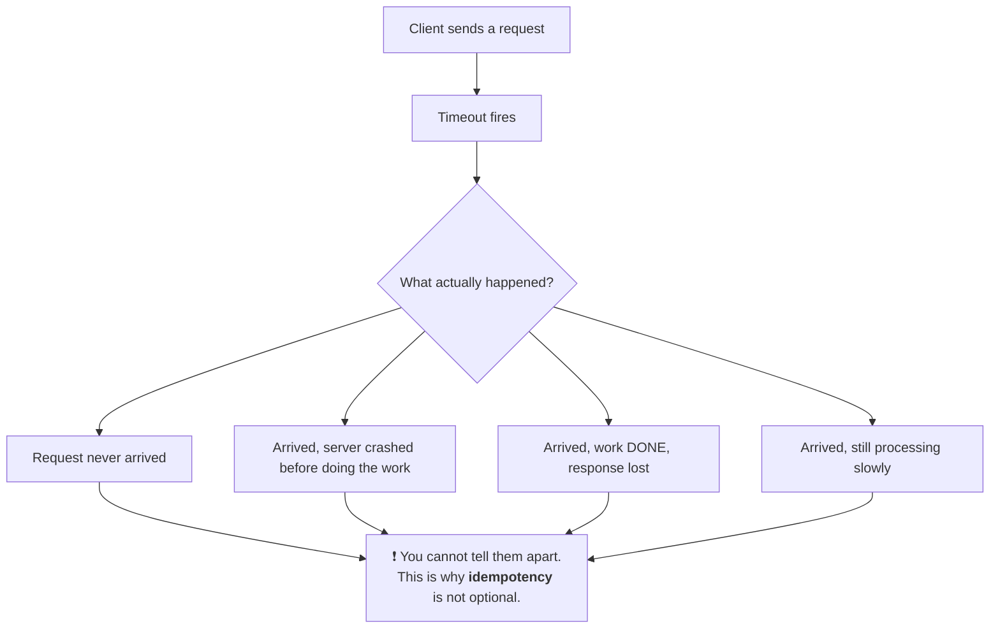

**The 8 fallacies of distributed computing** — each one a wrong assumption:
network is reliable · latency is zero · bandwidth is infinite · network is secure · topology doesn't change · one administrator · transport cost is zero · network is homogeneous.

> ⭐ **The framing that signals seniority:** *"The hardest thing about distributed systems isn't scale — it's that failure becomes ambiguous. Every design decision downstream (idempotency keys, retries with backoff, fencing tokens, quorums) exists to cope with 'I don't know what happened.'"*

---

## 2. Heartbeats & Failure Detection

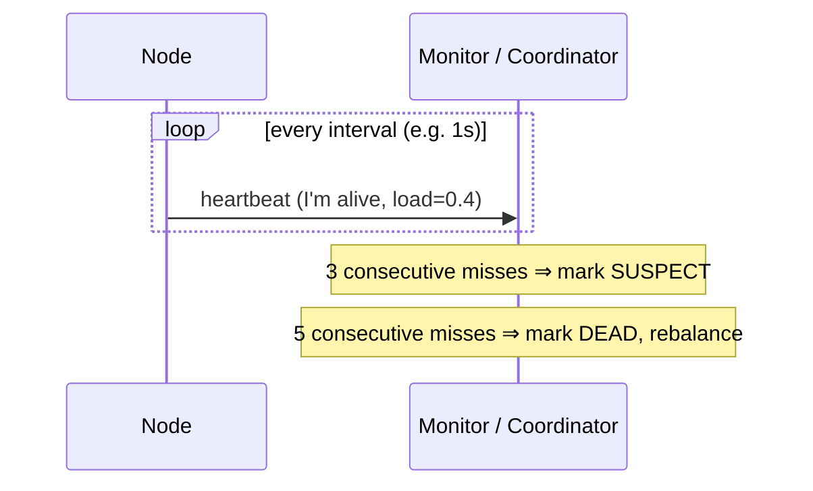

| Mechanism | How | Trade-off |
|---|---|---|
| **Push** | Node sends "I'm alive" | Simple; silence is ambiguous (dead? partitioned? GC pause?) |
| **Pull** | Monitor probes the node | Monitor controls the cadence; monitor becomes a bottleneck at scale |
| **Gossip** | Every node tracks a few peers and shares findings | Scales to thousands; eventually consistent view ([§6](#6-gossip-protocol)) |
| **Phi-accrual** ⭐ | Outputs a *suspicion level* from the history of arrival times instead of a boolean | Adapts to real network variance. Used by **Cassandra** and **Akka** |

### The threshold trade-off (a real design question)

$$\text{detection time} \approx \text{interval} \times \text{threshold}$$

| Setting | Consequence |
|---|---|
| Aggressive (1 s × 2) | Fast failover — but a **2-second GC pause looks like death** → unnecessary rebalancing, flapping |
| Conservative (5 s × 6) | Stable — but 30 seconds of traffic goes into a black hole |

> ⭐ **Say this:** *"Failure detection is fundamentally a trade-off between detection latency and false positives, and it is unsolvable in the general case — you cannot distinguish a dead node from a slow network. So I design for both: fast detection with hysteresis to prevent flapping, and idempotent operations so a false positive is survivable."*

**Liveness vs readiness** (Kubernetes vocabulary, universally applicable):

| Probe | Question | Failure action |
|---|---|---|
| **Startup** | Has it finished booting? | Keep waiting; don't kill it yet |
| **Liveness** | Is the process wedged? | **Restart** it |
| **Readiness** | Can it serve traffic *right now*? | **Remove from the load balancer** (don't restart) |

⚠️ **Conflating these is a classic outage:** a readiness check that fails because a downstream dependency is down, wired as a *liveness* check, restarts your entire healthy fleet.

---

## 3. Service Discovery

> **The problem:** in a dynamic environment, instances come and go and IPs change constantly. Hardcoded addresses cannot work.

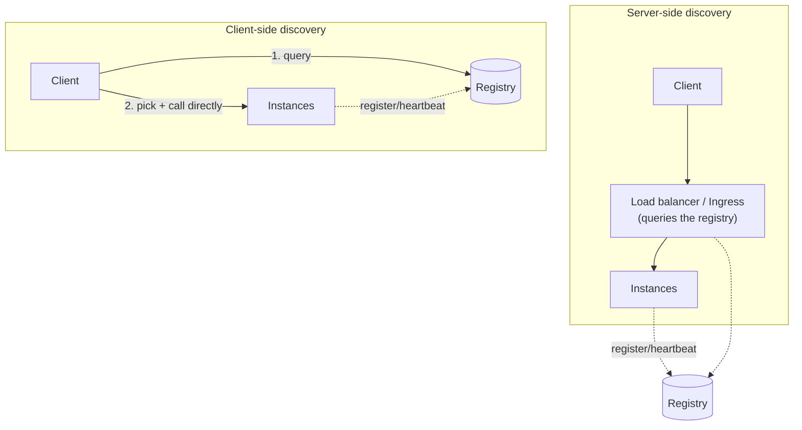

| | Server-side | Client-side |
|---|---|---|
| Who picks the instance | The load balancer | **The client** |
| Extra network hop | ✅ Yes | ❌ No — lower latency |
| Client complexity | None | Needs a discovery library per language |
| Load-balancing quality | Limited to what the LB sees | ⭐ Can do per-request LB over HTTP/2/gRPC |
| Examples | AWS ALB + target groups, K8s Service, NGINX | Netflix Eureka + Ribbon, gRPC + xDS, Consul client |

**Registration:**
| Style | How | Note |
|---|---|---|
| **Self-registration** | The service registers itself on boot and heartbeats | Simple; couples the app to the registry |
| **Third-party registration** ⭐ | A platform component registers it (K8s does this) | App stays ignorant of discovery — cleanest |

**Common implementations:** Consul · etcd · ZooKeeper · Eureka · Kubernetes DNS + Endpoints · AWS Cloud Map.

⚠️ **DNS-based discovery is tempting but has traps:** clients and JVMs cache DNS aggressively (some JVMs cache **forever** by default), TTLs are ignored by many resolvers, and DNS can't express health or weight. Fine for coarse-grained; not for fast failover. → [DNS.md](DNS.md)

> ⭐ **Service mesh answer:** *"With Istio/Linkerd, discovery, load balancing, mTLS, retries and circuit breaking all move into the sidecar via **xDS**. The application makes a plain `localhost` call and the mesh does the rest — the discovery problem disappears from application code entirely."*

---

## 4. Consensus & Leader Election

> **Consensus:** get N nodes to agree on one value, even when some fail. It's the foundation of leader election, distributed locks, config stores and replicated logs.

### 4.1 Quorum arithmetic

For N nodes, a **majority quorum** is $\lfloor N/2 \rfloor + 1$:

| N | Quorum | Failures tolerated | Note |
|---|---|---|---|
| 3 | 2 | **1** | The standard for etcd/ZooKeeper |
| 4 | 3 | **1** | ⚠️ No better than 3 — just more cost |
| 5 | 3 | **2** | Use when you need to survive two losses |
| 7 | 4 | 3 | Diminishing returns; latency grows |

> ⭐ **Always use an odd number.** Even counts add cost without adding fault tolerance, and make split-brain more likely.

### 4.2 Raft (know this one, not Paxos)

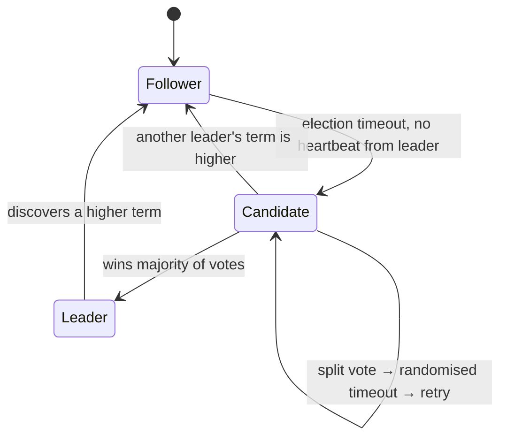

| Concept | Detail |
|---|---|
| **Terms** | A monotonically increasing epoch. Higher term always wins — this is how stale leaders are fenced off |
| **Log replication** | Leader appends, replicates to followers, **commits once a majority acks** |
| **Safety** | A candidate can only win if its log is at least as up to date as the majority's |
| **Randomised election timeout** ⭐ | Prevents perpetual split votes — the same jitter idea as retry backoff |

**Paxos vs Raft vs ZAB:** Paxos is the original and famously hard to implement; **Raft** was designed for understandability and is what you should describe; **ZAB** is ZooKeeper's variant optimised for primary-order broadcast.

**Who uses consensus:** etcd (Kubernetes' brain) · ZooKeeper (Kafka pre-KRaft, HBase) · Consul · CockroachDB / Spanner (Raft/Paxos per shard) · Kafka KRaft.

⚠️ **Consensus is expensive** — every write costs a majority round-trip. **Never put it on the hot path of high-throughput data.** Use it for *metadata* (who is the leader, what is the config, which shard lives where) and let the data path be cheap.

### 4.3 Split brain — and fencing

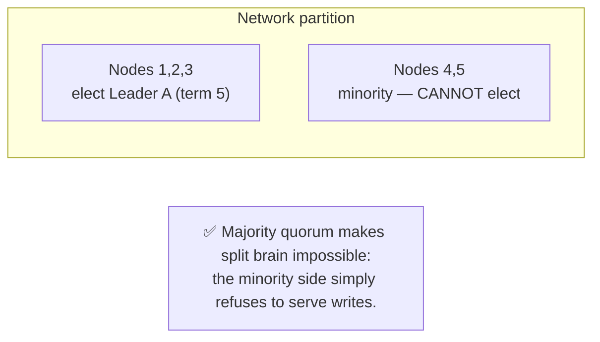

> ⭐ **Fencing token:** every leader gets a monotonically increasing number. Storage rejects any write with a token lower than the highest it has seen. **This is what makes a stale leader (one that was paused by GC and thinks it's still leader) harmless.** Say the word "fencing" — it's a strong marker.

---

## 5. Distributed Locking

```mermaid
sequenceDiagram
    participant A as Client A
    participant R as Redis
    participant S as Storage
    A->>R: SET lock:job1 <uuid> NX PX 10000
    R-->>A: OK (acquired, 10s TTL)
    Note over A: ⚠️ A pauses for 15s (GC / VM steal)
    Note over R: lock EXPIRES; Client B acquires it
    A->>S: write (still believes it holds the lock) ❌
    Note over S: With FENCING TOKENS, storage rejects A's<br/>stale token and the corruption is prevented.
```

| Implementation | Guarantee | Note |
|---|---|---|
| **Redis `SET NX PX`** | ⚠️ Best-effort | Single node = a SPOF; a failover can hand the same lock twice |
| **Redlock** (multi-Redis) | Contested | Kleppmann's critique: it relies on bounded clock drift and bounded pauses, neither of which holds. Fine for *efficiency*, not for *correctness* |
| **ZooKeeper / etcd** ⭐ | Strong (consensus-backed, ephemeral nodes auto-release on session loss) | The right answer when correctness matters |
| **Database row lock** | Strong within one DB | `SELECT … FOR UPDATE`, or a unique constraint on a lock table |

**The rules for using a distributed lock safely:**
1. Always set a **TTL** — otherwise a crashed holder deadlocks the system forever.
2. Release with a **compare-and-delete** (only the owner's token may delete) — see the Lua script in [cache-aside-lld.md](cache-aside-lld.md).
3. Use **fencing tokens** whenever the protected resource is external storage.
4. ⭐ **Prefer to design the lock away.** Partition the work so one owner naturally handles each key (Kafka partition assignment, consistent hashing, sharded schedulers). *"The best distributed lock is the one you didn't need."*

> ⭐ **Kleppmann's distinction, worth quoting:** *"Ask whether the lock is for **efficiency** (avoid doing the same work twice — a Redis lock is fine, a rare double-execution costs money not correctness) or for **correctness** (two writers would corrupt data — then you need consensus plus fencing)."*

---

## 6. Gossip Protocol

> **Epidemic communication:** each node periodically picks a few random peers and exchanges state. Information spreads exponentially.

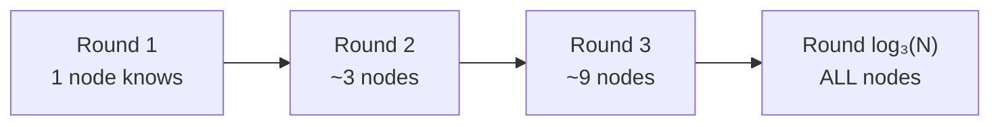

Convergence is **O(log N)** rounds.

| ✅ | ❌ |
|---|---|
| No central coordinator, no SPOF | **Eventually** consistent — no instant global view |
| Scales to thousands of nodes | Redundant messages (constant bandwidth cost) |
| Extremely robust to node/link failure | Hard to reason about and debug |

**Used by:** Cassandra & ScyllaDB (membership + schema) · DynamoDB · Consul (Serf/SWIM) · Redis Cluster · Bitcoin/blockchain propagation · Riak.

**Companion: anti-entropy.** Gossip spreads *changes*; anti-entropy repairs *divergence*. **Merkle trees** let two replicas compare terabytes by exchanging a few hashes and then syncing only the differing ranges — this is how Cassandra/Dynamo do repair. Naming Merkle trees here is a strong signal.

---

## 7. Time in a Distributed System

> ⚠️ **Never trust wall-clock time for ordering.** Clocks drift, NTP steps backwards, VMs get paused, and leap seconds exist.

| Mechanism | Gives you | Limitation |
|---|---|---|
| **Wall clock (NTP)** | Human-readable timestamps | Drift, non-monotonic jumps — unusable for ordering |
| **Monotonic clock** | Safe interval measurement | Meaningless across machines |
| **Lamport timestamp** | A total order consistent with causality | Can't tell *concurrent* from *ordered* |
| **Vector clock** ⭐ | **Detects concurrent writes** so you can resolve conflicts | Size grows with the number of writers |
| **Hybrid Logical Clock (HLC)** | Causality **+** a near-physical timestamp | Slight complexity; used by CockroachDB |
| **TrueTime** (Google) | Bounded uncertainty via GPS + atomic clocks | Requires special hardware; enables Spanner's external consistency |

**Last-Write-Wins (LWW)** is the common cheap conflict resolution — and it **silently discards data** when clocks disagree. Cassandra's LWW on skewed clocks is a real source of lost writes. Alternatives: vector clocks + application merge, or **CRDTs** (Conflict-free Replicated Data Types) which merge deterministically by construction — the basis of collaborative editors and Redis CRDTs.

---

## 8. Asynchronous Messaging

### 8.1 Queue vs Pub/Sub vs Stream

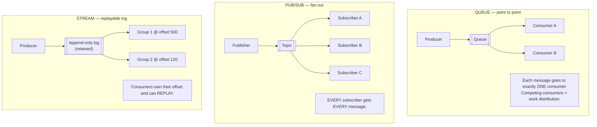

| | Queue (SQS, RabbitMQ) | Pub/Sub (SNS, Redis) | Stream (Kafka, Kinesis, Pulsar) |
|---|---|---|---|
| Delivery | One consumer per message | All subscribers | All consumer *groups*, one member each |
| After consumption | Message deleted | Gone | ⭐ **Retained** (time/size based) |
| Replay | ❌ | ❌ | ✅ |
| Ordering | Per-queue (FIFO variants) | None | **Per partition** |
| Use for | Task/job distribution | Notifications, fan-out | Event sourcing, analytics, CDC, audit |

### 8.2 Why a queue at all — the four reasons

| Reason | Explanation |
|---|---|
| **Decoupling** | Producer doesn't know or care who consumes, or whether they're up right now |
| **Buffering / load levelling** ⭐ | Absorbs a 10× spike so downstream can process at its own steady rate instead of collapsing |
| **Reliability** | Durable storage means a consumer crash doesn't lose work |
| **Async / responsiveness** | Return `202 Accepted` in 20 ms and do the 30-second video transcode in the background |

> ⭐ **The queue-workers correction that impresses:** *"You don't load-balance queue workers — they **pull**, so distribution is emergent and naturally backpressured. A slow worker simply takes fewer messages. The real question for a worker fleet isn't 'which worker?' but 'how many workers?' — and that's autoscaling keyed on **queue depth or message age**, not a load-balancer problem."*

### 8.3 Delivery semantics

| Semantic | Meaning | Cost |
|---|---|---|
| **At-most-once** | Fire and forget; may lose messages | Fast, lossy |
| **At-least-once** ⭐ | Retried until acked; **may duplicate** | The practical default — **so consumers must be idempotent** |
| **Exactly-once** | No loss, no duplicates | ⚠️ Impossible end-to-end in general. Kafka offers it *within* Kafka via idempotent producers + transactions. Across systems you achieve the *effect* with at-least-once + idempotent consumers |

> ⭐ **Say this:** *"I'd design for at-least-once and make the consumer idempotent — dedupe on a message ID or make the operation naturally idempotent (an upsert, a `SET`, a state transition guarded by the current state). Chasing exactly-once delivery is usually a sign of a missing idempotency key."*

### 8.4 Operational must-mentions

| Concept | Why it matters |
|---|---|
| **Dead-letter queue (DLQ)** ⭐ | After N failed attempts, park the message instead of retrying forever. Without a DLQ, one poison message blocks the partition and you have an outage |
| **Visibility timeout** | The window in which a consumer must ack, or the message returns to the queue. Must exceed the worst-case processing time |
| **Backpressure** | A bounded queue that rejects when full is *better* than an unbounded one that OOMs |
| **Consumer lag** | The #1 metric to alert on — it tells you whether you're falling behind in real time |
| **Ordering vs parallelism** | Strict ordering forces one consumer per key. Partition by key so you get ordering *per key* and parallelism *across keys* |
| **Poison pill** | A message that always fails. DLQ + alert, never infinite retry |

---

## 9. Kafka in 10 Minutes

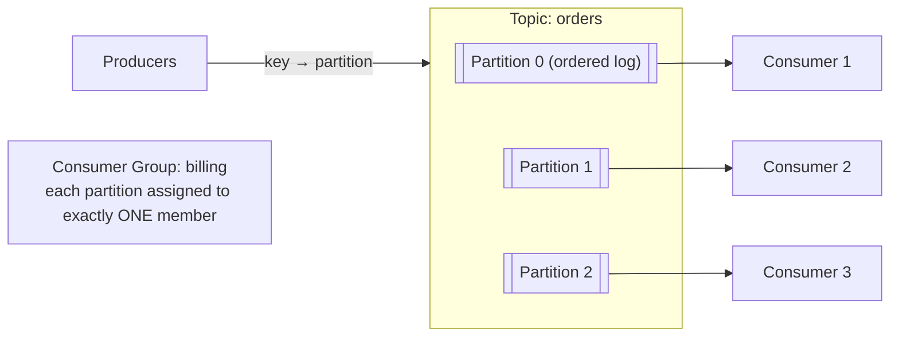

| Concept | Detail |
|---|---|
| **Topic** | A named stream, split into partitions |
| **Partition** | An **ordered, immutable, append-only log**. ⭐ Ordering is guaranteed **only within a partition** |
| **Partition key** | `hash(key) % partitions` → all events for one `user_id` land in the same partition, so they stay ordered |
| **Offset** | The consumer's position. Consumers own it, which is what makes **replay** possible |
| **Consumer group** | Each partition goes to exactly one member; add members to scale up to `#partitions` — ⚠️ **partitions are the parallelism ceiling** |
| **Replication factor** | Typically 3. One leader per partition, followers replicate |
| **ISR (in-sync replicas)** | Replicas caught up to the leader. `acks=all` + `min.insync.replicas=2` = durable writes |
| **Retention** | Time-based (7 days) or size-based, or **log compaction** (keep only the latest value per key — turns a topic into a changelog/table) |
| **Rebalance** | When members change, partitions are reassigned. ⚠️ Stop-the-world pauses; use cooperative/sticky assignors |

**Durability knobs:**

| `acks` | Meaning | Risk |
|---|---|---|
| `0` | Don't wait | Fastest, can lose everything |
| `1` | Leader ack only | Loses data if the leader dies before replication |
| `all` ⭐ | All in-sync replicas acked | Slowest, safest — use for anything that matters |

> ⭐ **The framing that lands:** *"Kafka isn't a queue — it's a **distributed, replicated, append-only log**. That single design choice is what gives you replay, multiple independent consumers over the same data, and event sourcing. The trade-offs are that ordering is only per-partition and that your partition count is both your parallelism limit and hard to change later."*

---

## 10. Change Data Capture (CDC)

> **Problem:** the database changed. Now the cache, the search index, the analytics warehouse and three other services all need to know — and you must not dual-write.

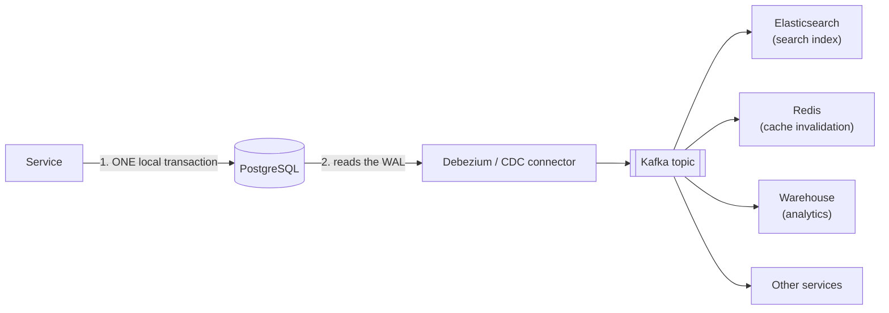

| Approach | How | Verdict |
|---|---|---|
| **Dual write** | App writes to DB *and* publishes an event | ❌ **Broken** — no shared transaction, so the two can diverge |
| **Polling a timestamp** | `WHERE updated_at > last_seen` | ⚠️ Misses deletes, load on the DB, clock/ordering issues |
| **Trigger-based** | DB triggers write to an audit table | ⚠️ Adds write latency, hard to maintain |
| **Log-based CDC** ⭐ | Read the WAL / binlog / oplog | ✅ **The right answer** — zero app impact, captures every change including deletes, correctly ordered |
| **Transactional outbox** ⭐ | Business row + event row in one local transaction; a relay publishes | ✅ Best when you want *domain events*, not raw row changes |

**Use CDC for:** cache invalidation ([caching.md](caching.md)) · keeping a search index in sync · streaming to a warehouse · **strangler-fig migrations** (dual-run old and new stores) · audit trails · materialised views.

⚠️ **CDC caveats:** you're publishing your *schema* as a contract (a column rename breaks consumers — prefer the outbox for public events); the initial snapshot of a large table is heavy; and consumers must handle **at-least-once** and out-of-order-across-tables delivery.

---

## 11. Resilience Patterns

> ⭐ **This section is the difference between a mid-level and a senior answer.** Anyone can draw the happy path.

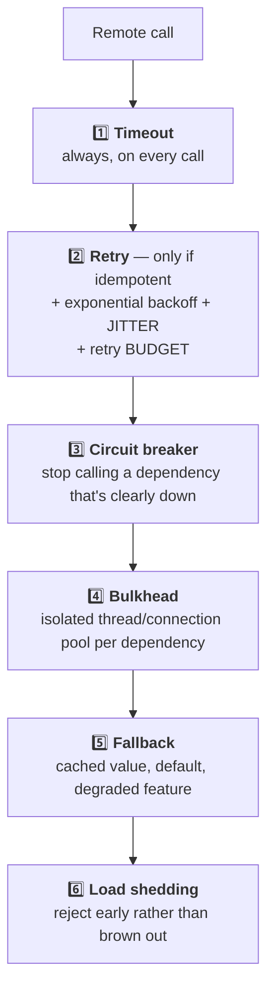

### 11.1 Timeouts

> **An unbounded remote call is a resource leak with extra steps.**

Rules: every network call gets a timeout · the timeout must be **shorter than your caller's** timeout (or you fail after they've already given up) · budget the whole request (`deadline` propagation, as gRPC does) · set connect and read timeouts separately.

### 11.2 Retries — and the storm they cause

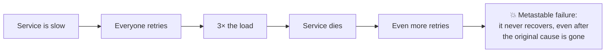

| Rule | Why |
|---|---|
| **Only retry idempotent operations** | Retrying a non-idempotent `POST` double-charges the customer |
| **Only retry retryable errors** | Retrying a `400` or `403` is pure waste. Retry `503`, `429`, timeouts, connection resets |
| **Exponential backoff** | 100 ms → 200 ms → 400 ms → 800 ms |
| **+ Jitter** ⭐ | Without it, all clients retry *in lockstep* and you get synchronised thundering herds. `sleep = random(0, min(cap, base × 2^n))` |
| **Retry budget** ⭐ | Cap retries at e.g. **10% of total requests**. This is what actually prevents the storm — backoff alone doesn't |
| **Don't retry at every layer** | 3 layers × 3 retries = **27× amplification**. Retry at **one** layer, usually the outermost |

### 11.3 Circuit Breaker

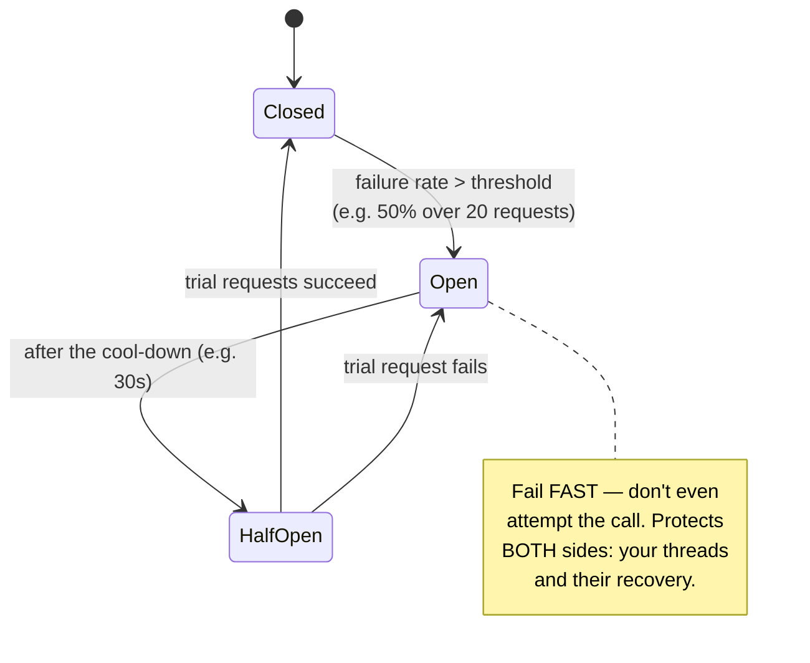

> ⭐ **The insight most candidates miss:** *"A circuit breaker protects **the caller** as much as the callee. Without it, my threads all pile up waiting on a dead dependency's timeout and my service goes down too — even though only the dependency failed. And the open circuit gives the failing service the quiet time it needs to actually recover."*

Libraries: Resilience4j, Polly (.NET), Envoy/Istio outlier detection, Hystrix (retired but the reference implementation).

### 11.4 Bulkhead

Named after ship compartments. **A separate thread pool / connection pool per dependency,** so a slow dependency exhausts only its own compartment.

```
❌ One pool of 100 threads: recommendation service hangs → all 100 threads blocked → checkout dies too
✅ Per-dependency pools: recommendations get 20 threads → they starve → checkout's 40 threads keep working
   (and recommendations degrade to a cached/empty response)
```

### 11.5 Load shedding & backpressure

| Technique | Detail |
|---|---|
| **Load shedding** | Above a concurrency/latency threshold, reject new work with `503` + `Retry-After`. ⭐ **Serving 80% of traffic well beats serving 100% badly** |
| **Priority shedding** | Drop analytics/prefetch requests before checkout requests |
| **Rate limiting** | Bound per-client usage before it becomes a capacity problem → [rest-api.md](rest-api.md) |
| **Queue with a bound** | Reject at the door rather than queueing into an OOM |
| **Admission control** | Reject requests whose deadline has already passed — don't compute an answer nobody will read |

### 11.6 Graceful degradation

> *"What's the least valuable thing I can turn off to keep the most valuable thing working?"*

Netflix without personalised rows still plays video. Amazon without recommendations still takes orders. **Decide the degradation order at design time, not during the incident.**

---

## 12. Microservice Patterns

### 12.1 The patterns

| Pattern | Purpose |
|---|---|
| **API Gateway / BFF** | Single entry point: routing, authN, rate limiting, aggregation. A BFF is a gateway shaped for one client type |
| **Database per service** ⭐ | Each service owns its data; no other service touches its tables. The **defining** microservice rule — break it and you have a distributed monolith |
| **Saga** | Distributed transaction via local transactions + compensations → [databases.md](databases.md) §11.2 |
| **Outbox** | Atomic "write + publish" → [databases.md](databases.md) §11.3 |
| **CQRS** | Separate write model from read model(s). Use when read and write shapes/loads genuinely diverge |
| **Event Sourcing** | Store the *events*, derive state by replay. Perfect audit trail and time travel; ⚠️ heavy — schema evolution of events, snapshots, and a steep learning curve |
| **Sidecar / Service Mesh** | Move cross-cutting concerns (mTLS, retries, tracing, LB) out of the app |
| **Strangler Fig** ⭐ | Migrate off a monolith incrementally: put a proxy in front, route one endpoint at a time to the new service |
| **Anti-corruption layer** | An adapter that keeps a legacy/partner model from leaking into your domain |
| **Backends for Frontends** | Separate gateway per client (web/iOS/Android) so one client's needs don't distort the others |

### 12.2 Anti-patterns (name these — it shows scar tissue)

| ❌ Anti-pattern | Symptom |
|---|---|
| **Distributed monolith** | Services must be deployed together; changing one forces changing three |
| **Shared database** | Two services write the same tables → no independent schema evolution, hidden coupling |
| **Chatty services** | One user request fans out to 40 internal calls → latency stacks, p99 explodes |
| **Nano-services** | So fine-grained that the network overhead exceeds the work done |
| **Synchronous chains** | A → B → C → D; any one being slow fails everything. Break with async/events |
| **No versioning** | A breaking change to one service takes down its callers |
| **Distributed transactions everywhere** | You partitioned the data wrongly — the boundary should follow the transaction |

> ⭐ **The judgement answer:** *"Microservices trade **code complexity for operational complexity**. They're worth it when you need independent deployability across multiple teams. For a small team, a **modular monolith** with clean internal boundaries gives you most of the design benefit and none of the distributed-systems tax — and it's much easier to split later than to merge back."* → [cloud-native.md](cloud-native.md)

---

## 13. Observability

> **Monitoring** answers "is it broken?" (known unknowns). **Observability** answers "*why* is it broken?" (unknown unknowns).

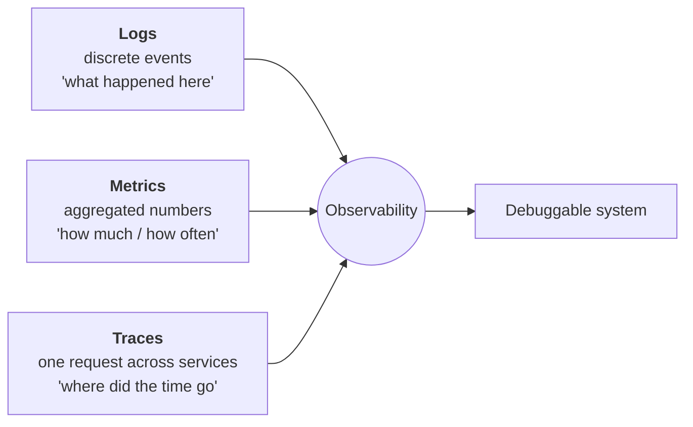

| Pillar | Use for | Watch out |
|---|---|---|
| **Logs** | Post-hoc detail, audit | Expensive at volume; **structured JSON + sampling**; never log PII/secrets |
| **Metrics** | Dashboards, alerting, SLOs | Cheap and aggregatable; **cardinality explosion** kills your TSDB (never tag with user ID) |
| **Traces** | Latency attribution across services | Needs **context propagation** everywhere; sample intelligently (tail-based sampling keeps the slow ones) |

**Correlation ID / trace ID** ⭐: generated at the edge, propagated through every hop (`traceparent` header / W3C Trace Context), attached to every log line. *"Without a correlation ID, debugging a microservice request is archaeology."* Standard: **OpenTelemetry**.

**The four golden signals (Google SRE):** **Latency** · **Traffic** · **Errors** · **Saturation**.
**RED** (per service): Rate, Errors, Duration. **USE** (per resource): Utilisation, Saturation, Errors.

### SLI / SLO / SLA / error budget

| Term | Meaning | Example |
|---|---|---|
| **SLI** | The measurement | "% of requests served < 300 ms" |
| **SLO** | Your internal target | "99.9% of requests < 300 ms over 28 days" |
| **SLA** | The contractual promise (with penalties) | "99.5% uptime or you get credits" |
| **Error budget** ⭐ | `100% − SLO` = allowed failure | 99.9% → **43 min/month**. Budget left → ship features. Budget spent → freeze and fix reliability |

> ⭐ **Say this:** *"The error budget is what turns reliability from an argument into a number. It also says something counter-intuitive: if you're at 100% availability you're **over**-invested in reliability and under-invested in shipping."*

⚠️ **Alert on symptoms, not causes.** Page on "checkout error rate > 1%", not "CPU > 80%" — high CPU may be perfectly fine, and every page that isn't actionable trains people to ignore pages.

---

## 14. Disaster Recovery

| Metric | Question | Drives |
|---|---|---|
| **RTO** — Recovery Time Objective | How long may we be **down**? | Failover architecture |
| **RPO** — Recovery Point Objective | How much **data** may we lose? | Backup/replication frequency |

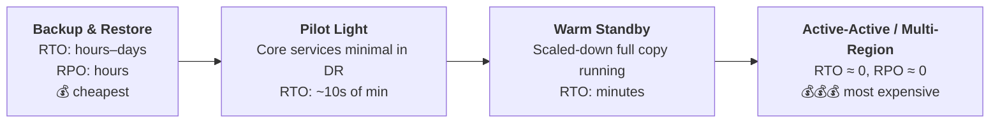

| Practice | Detail |
|---|---|
| **3-2-1 backup rule** | 3 copies, 2 media types, 1 off-site |
| ⭐ **Test the restore** | An untested backup is a rumour. Restore drills, quarterly at minimum |
| **Game days / chaos engineering** | Deliberately kill things in production (Chaos Monkey). Untested failover **does not work** |
| **Runbooks** | Written, current, and rehearsed — not improvised at 3 a.m. |
| **Blast radius** | Cells/shuffle-sharding so one bad tenant/deploy affects 1/N of users, not all |
| **Deployment safety** | Canary → blue/green → feature flags → **automated rollback**. Most outages are caused by deploys |

> ⭐ **Say this:** *"Multi-region active-active sounds great until you price it and confront cross-region write conflicts and data-residency rules. I'd start by asking for the actual RTO/RPO the business needs — most products are honestly fine with warm standby, and pretending otherwise buys enormous complexity nobody will operate correctly."*

---

## 15. Rapid-fire Q&A

| Question | Answer |
|---|---|
| **Hardest thing about distributed systems?** | Partial failure — a timeout doesn't tell you whether the work happened. Everything else (idempotency, retries, quorums, fencing) exists to cope with that. |
| **What is a heartbeat?** | Periodic liveness signals; N consecutive misses marks a node dead. The threshold trades detection speed against false positives. |
| **Can you reliably detect a failed node?** | No — a dead node and a slow network are indistinguishable. Design for false positives instead. |
| **Liveness vs readiness probe?** | Liveness failure → **restart**. Readiness failure → **remove from the load balancer**. Confusing them restarts a healthy fleet. |
| **Client-side vs server-side discovery?** | Client-side picks the instance itself (no extra hop, needs a library); server-side hides it behind a load balancer. |
| **Why is DNS-based discovery risky?** | Aggressive client caching and ignored TTLs, plus DNS can't express health or weight. |
| **What is consensus and who needs it?** | Getting N nodes to agree despite failures — used for leader election, config, locks, replicated logs (etcd, ZooKeeper, Raft-based DBs). |
| **Why an odd number of nodes?** | A majority quorum of 4 tolerates the same single failure as 3, at more cost. |
| **Raft in 30 seconds?** | Elect a leader per term with randomised timeouts; the leader appends to a log and commits once a majority acks; a higher term always supersedes. |
| **What is split brain and how do you prevent it?** | Two nodes both believe they're leader. Prevent with majority quorum plus **fencing tokens** so stale leaders' writes are rejected. |
| **Is Redis a safe distributed lock?** | For **efficiency**, yes. For **correctness**, no — use consensus-backed locks (etcd/ZooKeeper) plus fencing tokens. |
| **What is gossip and when do you use it?** | Randomised peer-to-peer state exchange, converging in O(log N). Used for membership at large scale (Cassandra, Consul, Redis Cluster). |
| **Why not use timestamps to order events?** | Clocks drift and jump. Use logical clocks: Lamport for a total order, **vector clocks** to *detect concurrency*, HLC for both. |
| **Queue vs pub/sub vs stream?** | Queue: one consumer per message. Pub/Sub: every subscriber gets every message. Stream: retained, replayable log with per-group offsets. |
| **Why use a message queue?** | Decoupling, load levelling under spikes, durability, and async responsiveness. |
| **At-least-once vs exactly-once?** | At-least-once is the practical default, so make consumers idempotent. Exactly-once end-to-end is generally unachievable — you emulate its *effect*. |
| **Why do you need a DLQ?** | So one poison message doesn't block a partition forever. Park it after N attempts and alert. |
| **Kafka ordering guarantee?** | Only **within a partition**. Partition by key to get per-key ordering with cross-key parallelism. |
| **What limits Kafka consumer parallelism?** | The partition count — one partition per group member, maximum. |
| **What is CDC and why not dual-write?** | Read the DB's WAL/binlog to publish changes. Dual writes have no shared transaction, so the DB and the event stream can diverge. |
| **How do you stop a retry storm?** | Backoff **with jitter**, a retry budget (~10% of traffic), retry at one layer only, and circuit breakers. |
| **Explain the circuit breaker states.** | Closed → Open (on a failure threshold) → Half-Open (trial after cool-down) → Closed or Open. It protects the caller's threads and gives the callee room to recover. |
| **What is a bulkhead?** | Separate pools per dependency so one slow dependency can't consume every thread in the process. |
| **Load shedding vs rate limiting?** | Shedding is *server-side*, reactive to load. Rate limiting is *per-client*, proactive and fairness-driven. |
| **Three pillars of observability?** | Logs (events), metrics (aggregates), traces (per-request causality) — tied together by a propagated trace ID. |
| **SLI vs SLO vs SLA?** | SLI is the measurement, SLO is your target, SLA is the contract. `100% − SLO` is your **error budget**. |
| **RTO vs RPO?** | RTO = acceptable downtime. RPO = acceptable data loss. They pick your DR strategy and its price. |
| **Should we use microservices?** | Only when you need independent deployability across teams. Otherwise a modular monolith gives the design benefit without the operational tax. |

---

## 16. Real-World Case Study — LinkedIn replaces Kafka with Northguard

> **Source:** LinkedIn Engineering — *[Introducing Northguard and Xinfra: scalable log storage at LinkedIn](https://www.linkedin.com/blog/engineering/infrastructure/introducing-northguard-and-xinfra)* (Jun 2025).
>
> LinkedIn **invented Kafka**. Fifteen years later they replaced it. This case study touches almost every section in this file at once: consensus ([§4](#4-consensus--leader-election)), gossip ([§6](#6-gossip-protocol)), failure detection ([§2](#2-heartbeats--failure-detection)), messaging semantics ([§8](#8-asynchronous-messaging)) and migration strategy.

### 16.1 The scale that broke Kafka

| 2010 | Today |
|---|---|
| 90 M members | **1.2 B+ members** |

Kafka at LinkedIn was running at:

- **32 trillion records/day** at **17 PB/day**
- **400,000 topics** across **10,000+ machines** in **150 clusters**

Five problems, and note that **only one of them is about data volume**:

| Problem | Root cause |
|---|---|
| **Scalability** | Not just more traffic — more **metadata** and more machines. Metadata and cluster-size bottlenecks forced them to keep spawning *more clusters* |
| **Operability** | 100+ clusters needed *an entire ecosystem of services just to manage the clusters* |
| **Availability** | The **partition is a heavyweight unit of replication** — a failed replica means a long, expensive catch-up |
| **Consistency** | Was **deliberately traded away** for produce availability, precisely because of that heavyweight replication unit |
| **Durability** | Kafka's lazy `fsync` (~10 s / 20k records) was too weak for their critical applications |

> ⭐ **The reframe worth stealing:** *"We needed a system that scales in **metadata and cluster size**, not just data."* Most candidates only ever discuss data scaling. Control-plane scaling is the senior observation.

### 16.2 Log striping — the core idea

Kafka's unit of replication is the **partition**: each replica stores a copy of the *entire* log. That creates permanent resource skew:

1. A broker holding more logs than its peers is hotter — and **logs are created infrequently**, so a newly added broker sits **idle** until you migrate existing logs onto it (operationally painful — hence LinkedIn's **Cruise Control** rebalancer).
2. A broker that happens to draw several *resource-intensive* logs is unlucky forever.

Northguard's data model breaks the log into smaller replicated chunks:

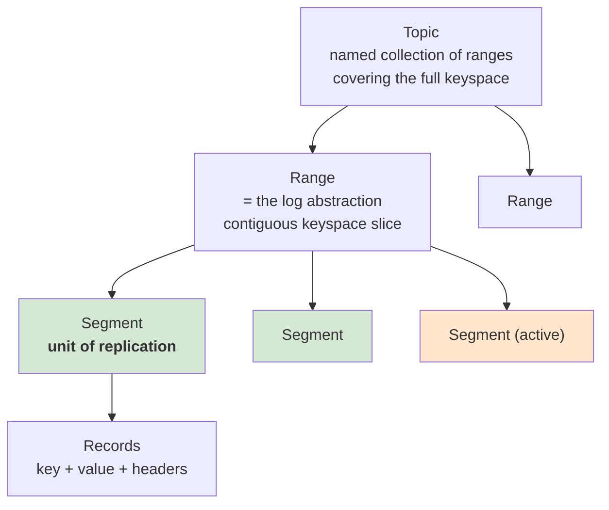

| Concept | Definition |
|---|---|
| **Record** | key + value + user headers, all opaque bytes |
| **Segment** | A sequence of records and **the unit of replication**. *Active* (appendable) or *sealed* (immutable). Sealed on replica failure, at **1 GB**, or after **1 hour** |
| **Range** | The log abstraction — a sequence of segments over a contiguous slice of the keyspace. Ranges **split and merge buddy-allocator style** |
| **Topic** | A named set of ranges that together cover the whole keyspace |

**Why striping fixes the skew:** segments have their own replica sets, and segments are created *constantly*. A new broker doesn't need existing data moved onto it — it **organically starts hosting new segments**. An unlucky combination of hot segments self-corrects on the next segment rotation. **The cluster balances by design instead of needing an external balancing service.**

**Ranges vs "just add partitions":**

| Requirement | Indexed partitions | Ranges |
|---|---|---|
| Scale throughput | Needs a **stop-the-world synchronisation barrier** so producers keep placing records in the right log | A range split interrupts **only the producers writing to that range**; the split *is* the barrier |
| Ordering | Preserved per partition | Preserved: split `R1 → R2, R3` means all of `R1` **happens-before** `R2` and `R3`; merge `R2, R3 → R4` likewise |
| Stream joins | Mismatched partition counts (10 vs 16) force an expensive **shuffle** to repartition | Buddy-style ranges of different topics **inherently align** → the shuffle disappears |

### 16.3 The control plane — sharded Raft + SWIM gossip

This is the part that answers *"how do you scale metadata?"*

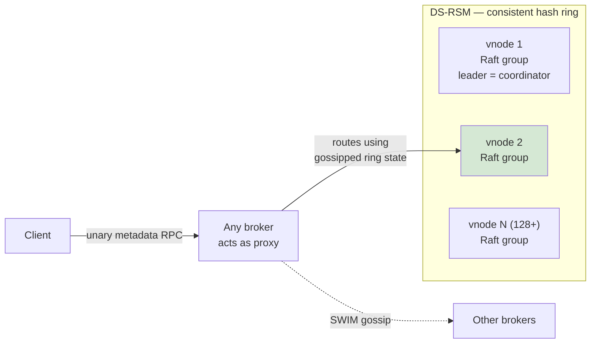

| Mechanism | Detail |
|---|---|
| **vnode** | A fault-tolerant **replicated state machine backed by Raft**, holding *one shard* of the cluster's metadata |
| **Coordinator** | The vnode's Raft **leader**; holds the metadata business logic. State is persisted in the state machine, so a newly elected coordinator resumes exactly where the old one stopped — textbook [§4](#4-consensus--leader-election) |
| **DS-RSM** | *Dynamically-Sharded Replicated State Machine* — a set of vnodes over a **consistent hash ring**. Topic metadata hashes by **topic name**, range/segment metadata by **range ID** → minimises metadata hotspots |
| **Self-healing** | The coordinator tracks each segment's replica set and **initiates sealed-segment replication for under-replicated segments** — no external repair service |
| **Membership: SWIM** | Gossip with **random probing** for failure detection and **infection-style dissemination** for membership changes ([§6](#6-gossip-protocol)). It carries only *minimal* global state: broker host/port/attributes, and each vnode's hash-ring boundaries, leader, term and replicas — exactly enough to route a request to the right leader |
| **Placement policies** | Northguard has **no native concept of racks or datacenters**. Admins bind arbitrary **attributes** to brokers, and storage/metadata policies contain constraint expressions over those attributes. That one abstraction gives rack-aware placement *and* lets them deploy builds/configs safely in **constant time regardless of cluster size** |

> ⭐ **Say this:** *"Kafka's control plane is one controller and one replicated state machine, which starts to hurt at millions of partition replicas. Northguard shards the control plane into 128+ Raft groups on a consistent hash ring and uses gossip instead of centralised heartbeating, so the control plane scales with the cluster instead of against it."*

### 16.4 Wire protocols — unary for metadata, sessionized streams for data

| Protocol class | Shape |
|---|---|
| **Metadata** (`CreateTopic`, `TopicMetadata`, `SegmentMetadata`…) | **Unary**: one request → one response. Sent to any broker, which proxies to the correct vnode leader using gossipped ring state |
| **Produce / consume / replication** | **Sessionized streaming** with **pipelining** (keep data moving) and **windowing** (bound how much is in flight) — i.e. application-level flow control |

**Produce stream:** the client generates a stream ID, handshakes with the active segment leader and learns the broker's window size. It sends `Append`s (stream ID + sequence number + records) while within the window. The broker may send **M acks for N appends**, only for **committed** records, and each ack carries an updated window.

**Consume stream** is the mirror image with the *client* choosing the window: `Read` reports progress and window, `Push` delivers records. **Sealed-segment replication is literally the consume protocol between two brokers** — a nice example of protocol reuse.

**Storage engine ("fps store"):** write-ahead log + file-per-segment + **Direct I/O** + a **sparse index in RocksDB**. Appends batch until ~10 ms elapse, a size limit, or an append-count limit; then WAL write → append to segment files → `fsync` → update index. Direct I/O avoids double buffering, lets them do **application-level caching driven by knowledge of active consume streams**, and keeps state consistent across `fsync` failures.

### 16.5 Testing — deterministic simulation

Beyond thousands of tests and benchmarks, Northguard runs under **deterministic simulation**: the whole cluster *and* its clients run on **a single thread** with all non-deterministic components swapped for deterministic ones. They **simulate years of activity every day** while injecting:

> broker shutdown · rolling restarts · network partition · packet loss · packet corruption · disk corruption · disk I/O errors · config deployments

Because it's deterministic, a failing run can be **shared, replayed and stepped through**. This is the industrial-strength version of "chaos engineering" in [§14](#14-disaster-recovery) — and it's a superb answer to *"how do you test a distributed system?"*

### 16.6 The scorecard — Kafka vs Northguard

| Dimension | Kafka | Northguard |
|---|---|---|
| **Data scalability** | A log is bounded by **one machine's** disk | A log is bounded by the **cluster's** disk |
| **Metadata control plane** | 1 controller, 1 replicated state machine; stressed at millions of partition replicas | **128+** coordinators, **128+** sharded state machines; fine at millions of segment replicas |
| **Metadata distribution** | Global topic metadata state | **Minimal** global state |
| **Cluster membership** | Centralised heartbeating to the controller | **Scalable gossip (SWIM)** |
| **Cluster count** | — | **80%+ fewer** |
| **Balancing** | External service (Cruise Control) | **Balanced by design** |
| **Adding brokers** | External service moves existing data | **No data movement needed** |
| **Restoring replication factor** | External service | **Self-healing** |
| **Availability** | Produce availability degrades as replicas fail | Producers roll onto **new segments** when a replica fails |
| **Consistency** | Sacrificed for produce availability | **Not sacrificed** — striping decouples the two |
| **Durability** | Lazy sync: 10 s / 20k records | **`fsync` on all replicas before ack**: 10 ms / 20k records / 10 MB |

### 16.7 Xinfra — how you actually migrate 400K topics with zero downtime

You cannot ask thousands of application teams, including mission-critical ones, to rewrite their clients. So LinkedIn built a **virtualization layer** first.

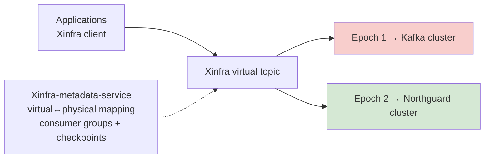

| Piece | Role |
|---|---|
| **Xinfra topic** | A virtual topic with **epochs** capturing its change history — one epoch can live in Kafka and the next in Northguard. Users never change the topic name |
| **Federation** | Topics in different physical clusters can be grouped under one virtual cluster, so a use case can outgrow any single physical cluster |
| **Xinfra-metadata-service** | Virtual↔physical mapping, topic CRUD + migration; metadata in **MySQL**; **ZooKeeper** for membership, leadership, incremental consumer-group rebalancing and partition-tolerance; **Vitess** (sharded MySQL) + a coalescing buffer for checkpoint storage; **Couchbase** as the cache for low-latency checkpoint reads/writes |
| **Migration recipe** | Create a new epoch in the target cluster → migrate **producers first**, then consumers → producers **dual-write** during the window so rollback is safe → ordering guarantees preserved throughout → finally turn off dual writes. Consumers can still read back through older epochs until retention expires |

**Result:** 90%+ of applications on Xinfra clients; thousands of topics migrated to Northguard, accounting for **trillions of records/day**.

> ⭐ **Say this when asked "how do you replace a core piece of infrastructure?":**
> *"You don't migrate applications — you virtualise the thing they depend on first, then migrate underneath them. LinkedIn shipped Xinfra, a virtual pub/sub layer whose topics have epochs, so a topic can have one epoch in Kafka and the next in Northguard with no client change. Producers move first and dual-write so rollback is always available; consumers follow; dual writes are turned off last. That's the same pattern as a strangler-fig migration or an expand/contract schema change — make the abstraction absorb the change, migrate incrementally, and keep a rollback path at every step."*

### 16.8 Cross-reference: Uber's Flux — CDC as the invalidation bus

The same "log as the backbone" idea shows up at Uber. **Flux** tails the **MySQL binlog** of every Docstore cluster and publishes the events to a list of consumers. One pipeline powers **CDC, cross-region replication, materialized views, data-lake ingestion, cross-node consistency validation — and cache invalidation** ([caching.md §24.3](caching.md#243-invalidation--ttl-is-the-floor-cdc-is-the-answer)).

> That's the practical argument for [§10 CDC](#10-change-data-capture-cdc) over dual writes: once you're reading the committed log, **every** downstream derived system — search index, cache, warehouse, materialized view — is just another consumer, and none of them can observe an uncommitted transaction.
