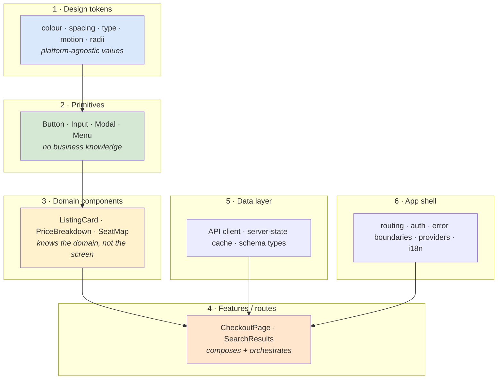
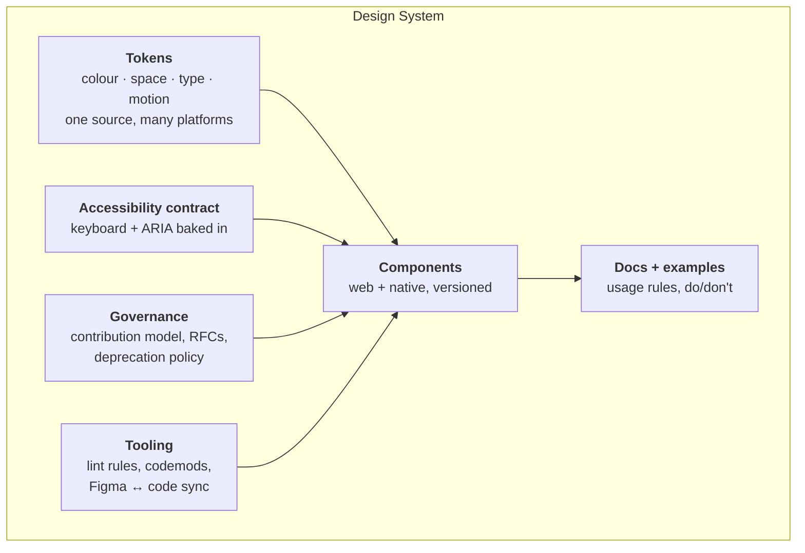
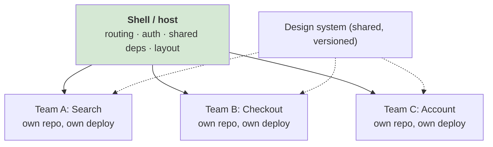
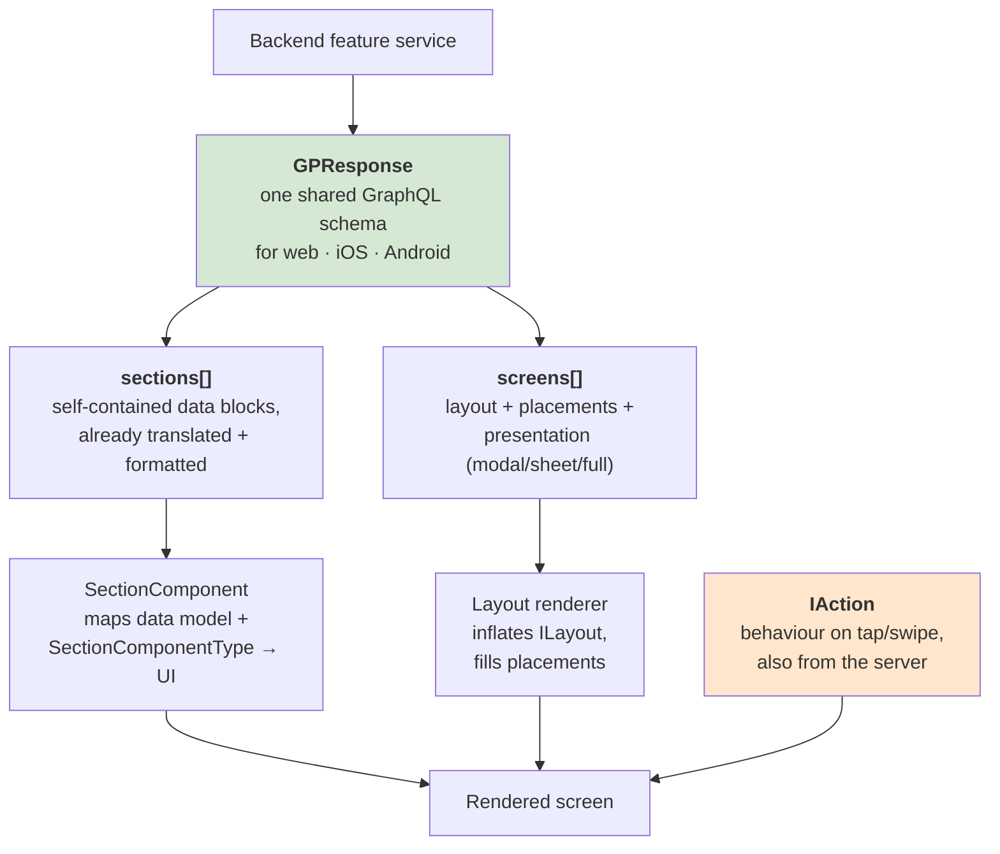
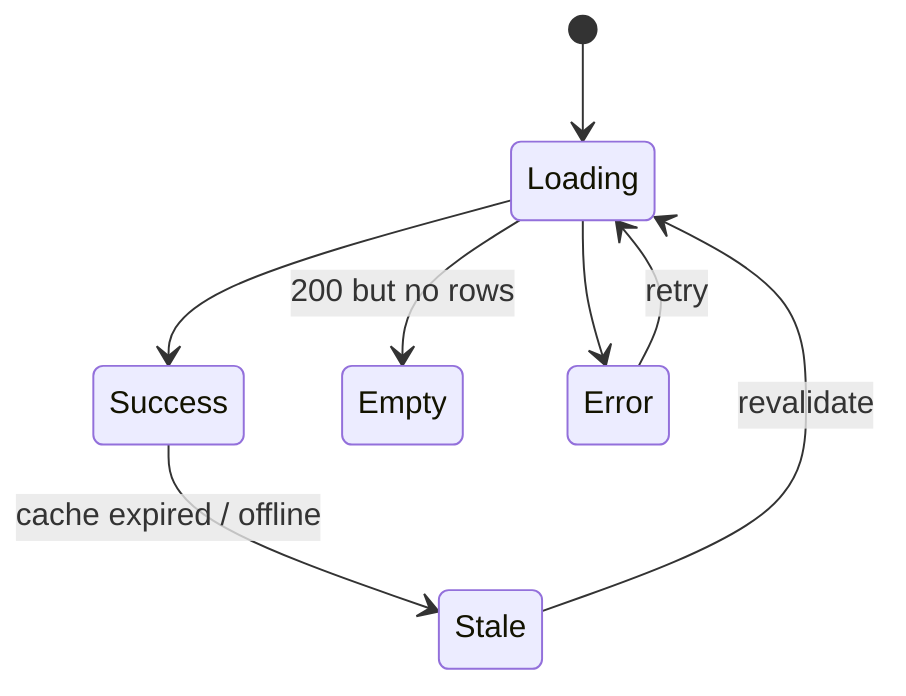

# 🏗️ Frontend Architecture

> **Components, design systems, micro-frontends, monorepos, server-driven UI, accessibility and i18n** — the structural decisions that outlive any framework.
>
> Part of [Track E — Frontend System Design](frontend-system-design.md).

---

## Syllabus Coverage Index

| # | Topic | Section |
|---|---|---|
| 1 | Layers: what goes where | [§1](#1-the-layered-frontend) |
| 2 | Component design: presentational · container · headless · compound | [§2](#2-component-design-patterns) |
| 3 | Designing a component API (props, events, slots) | [§3](#3-designing-a-component-api) |
| 4 | ⭐ **Design systems** — what they must ship beyond components | [§4](#4-design-systems) |
| 5 | Monorepo vs polyrepo | [§5](#5-monorepo-vs-polyrepo) |
| 6 | ⭐ **Micro-frontends** — the one good reason and four real costs | [§6](#6-micro-frontends) |
| 7 | ⭐ **Server-driven UI** (Airbnb's Ghost Platform) | [§7](#7-server-driven-ui) |
| 8 | Cross-platform: React Native, WebViews, code sharing | [§8](#8-cross-platform-strategy) |
| 9 | Resilience: error boundaries, degradation order, feature flags | [§9](#9-resilience-in-the-ui) |
| 10 | ⭐ **Accessibility** as an architectural concern | [§10](#10-accessibility) |
| 11 | **Internationalisation** & RTL | [§11](#11-internationalisation) |
| 12 | Observability & testing strategy for the front end | [§12](#12-observability--testing) |
| ★ | Rapid-fire Q&A | [§13](#13-rapid-fire-qa) |

---

## 1. The layered frontend



**The dependency rule:** arrows point one way. A `Button` must never import `useCheckout`. A domain component must never know which page it's on. Violating this is what turns a design system into a second application.

| Symptom | The layering violation behind it |
|---|---|
| "We can't reuse this card anywhere" | The card fetches its own data / reads route params |
| "Changing the button broke checkout" | The button grew a `variant="checkout"` special case |
| "The design system release blocks every team" | Domain logic leaked into primitives |
| "Nobody knows where to put this file" | No agreed layer boundaries at all |

---

## 2. Component design patterns

| Pattern | Shape | Use when |
|---|---|---|
| **Presentational** | Props in → JSX out. No fetching, no global reads | Everything you want to reuse or test cheaply |
| **Container** | Fetches, subscribes, orchestrates, renders a presentational child | The seam between data and UI |
| **Headless / hooks** | Behaviour + state + a11y wiring, **zero markup** (`useCombobox`, `useTable`) | Complex widgets that must be styled differently per product |
| **Compound** | `<Tabs><Tabs.List><Tabs.Tab/></Tabs.List></Tabs>` sharing implicit context | Multi-part components where the parent coordinates children |
| **Render prop / slots** | Consumer supplies the rendering for a part | Maximum flexibility; costs readability |
| **Provider** | Context supplying config to a subtree | Theme, locale, feature flags — **not** frequently changing data |

> ⭐ **The headless argument, worth making:** *"The hardest part of a combobox isn't the markup — it's the keyboard interaction model, focus management and ARIA relationships. If I ship that as a hook and let each product own the markup, teams get correct accessibility for free without fighting my styling opinions. That's why Radix/Headless UI/`use*` libraries won."*

### 2.1 Composition beats configuration

```jsx
// ❌ Configuration: every new need adds a prop, forever
<Card title="…" subtitle="…" image="…" showBadge badgeColor="red"
      footerButtonText="Book" onFooterButtonClick={…} compact />

// ✅ Composition: the consumer assembles what they need
<Card>
  <Card.Media src="…" />
  <Card.Header title="…" subtitle="…" />
  <Card.Badge tone="critical">New</Card.Badge>
  <Card.Footer><Button onClick={…}>Book</Button></Card.Footer>
</Card>
```

**The rule of thumb:** if a component has more than ~8 props, or any prop named `isX` that changes the *structure*, you wanted composition.

---

## 3. Designing a component API

In a system-design round, "Interface" (the **I** of [RADIO](frontend-system-design.md#1-radio--the-framework-to-run-every-question-through)) means **both** the network contract *and* the component contract. Show the component contract as a typed signature:

```ts
interface VirtualisedListProps<T> {
  items: T[];
  renderItem: (item: T, index: number) => React.ReactNode;
  estimatedItemHeight: number;
  overscan?: number;                       // default 3
  onEndReached?: () => void;               // infinite scroll hook
  endReachedThreshold?: number;            // in px, default 400
  getItemKey: (item: T, index: number) => string;   // stable identity
  emptyState?: React.ReactNode;
  'aria-label': string;                    // required, not optional
}
```

| Design rule | Why |
|---|---|
| **Controlled *and* uncontrolled** where sensible (`value` + `defaultValue`) | Simple cases stay simple; complex cases stay possible |
| **Events named `onX`, handlers receive semantic payloads** | `onSelect(item)` beats `onClick(event)` for a domain component |
| **Required a11y props are required in the type** | `aria-label` on an icon-only button shouldn't be optional |
| **No boolean explosion** | `variant: 'primary' \| 'ghost'` beats `isPrimary` + `isGhost` |
| **Forward `ref` and spread the rest** | Consumers will need `id`, `data-testid`, `aria-*` you didn't predict |
| **Stable identity for lists** | `getItemKey` rather than array index — index keys break reordering and animations |
| **Document the states** | loading / empty / error / partial are part of the API, not an afterthought |

---

## 4. Design systems

A design system is **not** a component library. A component library is one of its deliverables.



| Deliverable | Why it's non-optional |
|---|---|
| **Design tokens** | The only way one change lands on web, iOS and Android at once. Ship them as JSON → CSS vars / Swift / Kotlin |
| **Versioning + semver discipline** | Consumers must be able to upgrade on their own schedule |
| **Codemods for breaking changes** | Otherwise "please migrate" becomes a two-year migration nobody finishes |
| **Accessibility built in** | The system is the highest-leverage place to fix a11y once for everyone |
| **Escape hatches** | `className`/`style`/`asChild`. Without them, teams fork the component and you've lost |
| **Adoption metrics** | *"How to Measure a Design System at Scale"* is a real Uber post — measure % of surfaces using system components, and drift |

**The two failure modes:**

| Failure | Symptom | Fix |
|---|---|---|
| **Too rigid** | Teams fork components or wrap them in hacks | Escape hatches + a contribution path |
| **Too loose** | 14 button variants, no consistency | Governance, lint rules banning raw hex values, design review |

---

## 5. Monorepo vs polyrepo

| | **Monorepo** | **Polyrepo** |
|---|---|---|
| Atomic cross-package changes | ✅ One PR updates lib + all consumers | ❌ N PRs, version dance |
| Discoverability & code sharing | ✅ High | ❌ Duplication is the default |
| CI cost | ❌ Needs affected-graph tooling (Nx, Turborepo, Bazel) | ✅ Naturally scoped |
| Independent release cadence | ❌ Requires discipline/tooling | ✅ Free |
| Access control | ❌ Coarse | ✅ Per repo |
| Onboarding | ❌ Huge checkout | ✅ Small |

**If monorepo, you must have:** an affected-graph build (only test what changed), remote build caching, `CODEOWNERS`, and a dependency-boundary lint rule so `apps/checkout` can't import from `apps/admin/src/internal`.

> Uber published *[Continuous deployment for large monorepos](https://www.uber.com/in/en/blog/continuous-deployment/)* — the operational half of this decision is real work, not a config flag.

---

## 6. Micro-frontends

**Definition:** independently developed, tested and **deployed** front-end units composed into one experience.



| Composition strategy | How | Trade-off |
|---|---|---|
| **Build-time** (npm packages) | Host installs each MFE | Not independently deployable — you've just done a monorepo badly |
| **Run-time via Module Federation** | Host loads remotes at runtime, shares singletons (React, router) | The mainstream choice; version-skew risk on shared deps |
| **Server-side composition / SSI / edge includes** | Assemble fragments into one HTML document | Best performance; needs edge infrastructure |
| **iframes** | Hard isolation | Terrible UX: routing, sizing, focus, modals, a11y all break |
| **Web Components** | Framework-agnostic custom elements | Real isolation; awkward prop/event ergonomics and SSR story |

**The single good reason:** *"independent deployment across teams is our bottleneck."* That's an **organisational** answer ([Conway's Law](high-level-system-design-cocept.md#12-rapid-fire-qa)), not a technical one.

**The four real costs — name them all:**

| Cost | Detail |
|---|---|
| **Bundle duplication** | Two React versions, two date libraries. Shared-singleton config is fragile and silently breaks |
| **Performance regression** | More requests, more parse/compile, worse INP. Micro-frontends almost never make a page faster |
| **Consistency drift** | Different versions of the design system live on one screen |
| **Cross-cutting concerns get N implementations** | Auth, analytics, error handling, i18n, routing — each MFE reinvents them unless the shell owns them |

> ⭐ **Say this:** *"I'd push back on micro-frontends unless the constraint is organisational. For one or two teams, a modular monolith with strict module boundaries and route-level code splitting gives you the same separation with none of the runtime cost — the same argument as microservices versus a modular monolith on the backend."*

---

## 7. Server-driven UI

> **Source:** Airbnb — *[A deep dive into Airbnb's server-driven UI system](https://medium.com/airbnb-engineering/a-deep-dive-into-airbnbs-server-driven-ui-system-842244c5f5)* (Jun 2021).

**The problem it solves:** with web, iOS and Android each transforming the same data into UI, you get three implementations of the same business logic, three ways to drift, and — on mobile — a **release-cycle problem**: *"each time we need to add new features to our listing page, we need to release a new version of our mobile apps."*

**The inversion:** *"What if clients didn't need to know they were even displaying a listing? … we pass both the UI and the data together, and the client displays it agnostic of the data it contains."*



| Concept | Definition (from the post) |
|---|---|
| **Section** | *"The most primitive building block… describes the data of a cohesive group of UI components, containing the exact data to be displayed — already translated, localized, and formatted."* Crucially, **sections are independent of the screen and of each other** |
| **Screen** | Describes the **layout** and where sections appear (*placements*), plus presentation metadata (popover / modal / full screen) and logging |
| **`SectionComponentType`** | Controls *how* a section's data model is rendered — so one data model can render several ways (`TITLE` vs `PLUS_TITLE`) |
| **`ILayout`** | An interface with implementations like `SingleColumnLayout`; `LayoutsPerFormFactor` picks compact vs wide by breakpoint, density and rotation |
| **`IAction`** | Behaviour is server-defined too — *"we also can define actions taken when users interact with UI on the screen"*. Generic actions (navigate, scroll-to-section) are handled by the framework; features can add their own |

**The decision that made it scale:** *"The key decision that helped us make our server-driven UI system scalable was to use a **single, shared GraphQL schema** for Web, iOS, and Android apps."* Sections point to a shared `sections` array by ID rather than being inlined per layout, *"which shrinks response sizes by reusing sections across layout configurations."*

**Outcome:** *"a majority of Airbnb's most used features (e.g., search, listing pages, checkout) are built on GP."*

| ✅ SDUI buys | ❌ SDUI costs |
|---|---|
| Ship a UI change to all 3 platforms with **no app release** | The schema becomes a shared bottleneck across every team |
| Guaranteed parity across web/iOS/Android | Payloads get bigger; you now ship presentation over the wire |
| Business logic centralised on the backend | Weaker offline story — no server, no UI |
| Experiments and rollouts controlled server-side | Harder to do platform-idiomatic interactions and animations |
| Clients become thin renderers | *"Server-driven UI is complex. Countless hours have gone into creating a robust schema, client frameworks, and developer documentation"* |

> ⭐ **Say this:** *"SDUI is the right call when your bottleneck is shipping the same change three times and waiting on app-store releases. The design that makes it work is a single shared schema plus sections that are completely decoupled from the screen they're on — that decoupling is what makes sections reusable instead of becoming a second, worse component library. I'd be cautious about it for a web-only product, where you can already deploy in minutes."*

---

## 8. Cross-platform strategy

> **Source:** Shopify — *[Five years of React Native at Shopify](https://shopify.engineering/five-years-of-react-native-at-shopify)* (Jan 2025).

Three ways to serve web + iOS + Android:

| Strategy | Example | Trade-off |
|---|---|---|
| **Fully native per platform** | Best fidelity | Build everything twice; permanent feature-parity chase |
| **Shared runtime** (React Native / Flutter) | **Shopify** — all apps migrated to RN | Write once, one talent pool; framework upgrades and debugging get harder |
| **Server-driven UI** | **Airbnb** — Ghost Platform | Parity guaranteed; platform idiom and offline suffer |

**Shopify's stated reasons for RN:** (1) *write it once*, (2) *talent portability* — devs work across iOS, Android and Web, (3) *ship more value* instead of chasing parity.

**Their five-year results and lessons — quotable either way:**

| Finding | Detail |
|---|---|
| **Performance is achievable** | *"sub-500ms (P75) screen loads"* and *">99.9% crash-free sessions"*. Their framing: *"native doesn't automatically mean fast, and React Native doesn't automatically mean slow"* |
| **⭐ "100% React Native should be an anti-goal"** | Native is still better for device hardware, on-device AI, widgets/watch apps, and long-running background work. *"Instead of thinking native or React Native, think native **and** React Native"* |
| **Native expertise stays essential** | For build/release, performance across device models, and RN version upgrades |
| **Debugging is worse** | *"flakey and configuring it correctly in VSCode takes some work"* |
| **Upgrades are not seamless** | *"often requires restructuring the code base"* — mitigated by a rotating group who own it |
| **More third-party dependencies** | Which *"increases the surface area of supply chain attacks"* — mitigated with automated dependency updates and code scanning |
| **Shared foundations came later, deliberately** | Early on each team built its own way (speed over consistency); from 2023 they extracted identity, monitoring and performance measurement into shared libraries |

> ⭐ **Say this:** *"Cross-platform isn't a binary. Shopify migrated every app to React Native and still says 100% RN should be an anti-goal — they keep native for hardware access, widgets and background work. The realistic answer is a shared runtime for the 80% of screens that are lists, forms and navigation, and native modules for the parts where the platform is the product."*

---

## 9. Resilience in the UI

### 9.1 The four states every data-driven component owes you



Designing only the success state is the most common gap in a front-end interview. Say the four out loud: **loading (skeleton sized like the content), empty (with an action), error (with a retry), stale (with an honest indicator).**

### 9.2 Error boundaries & degradation order

| Level | Boundary | Fallback |
|---|---|---|
| **Widget** | Around each independent section | Hide or show a small inline error — the rest of the page survives |
| **Route** | Around the page | "Something went wrong" + retry + a link home |
| **App shell** | Root | Full-page error, report to telemetry, offer reload |

> **Decide the degradation order at design time.** Netflix without recommendations still plays video; a product page without reviews is still buyable. Rank your sections by criticality and let the low-ranked ones fail silently — the UI equivalent of [priority-aware load shedding](load-balancer.md#26-real-world-case-study--ubers-load-manager-static-rate-limits--priority-aware-shedding).

⚠️ React error boundaries do **not** catch errors in event handlers, async code, or SSR — wrap those explicitly.

### 9.3 Feature flags

| Use | Note |
|---|---|
| Decouple deploy from release | Ship dark, enable per cohort |
| Kill switch for a risky feature | The fastest rollback that exists |
| Experiments / A/B | Beware: flag evaluation on the client can cause **CLS** and flicker — evaluate server-side and render the final variant |
| Progressive rollout | 1% → 10% → 50% → 100% with metric gates |

**The debt:** every flag is a branch in your code and a combination in your test matrix. Give flags an owner and an expiry date, and delete them.

---

## 10. Accessibility

**Architectural, not cosmetic** — retrofitting a11y means auditing every component, which is exactly why it belongs in the design system.

| Principle | Concretely |
|---|---|
| **Semantic HTML first** | `<button>`, `<a href>`, `<nav>`, `<main>`, `<label>`. A `<div onClick>` has no role, no keyboard support, no focus — you then rebuild all three badly |
| **ARIA is a last resort** | *"No ARIA is better than bad ARIA."* Use it to describe things HTML can't express |
| **Keyboard operability** | Everything reachable with Tab, in a logical order; visible focus ring; Escape closes; arrow keys within composite widgets |
| **Focus management** | Move focus into a modal, **trap** it, restore it on close. On SPA route change, move focus to the new `<h1>` |
| **Live regions** | `aria-live="polite"` for async results ("12 results found"), `assertive` for errors |
| **Colour & contrast** | 4.5:1 for body text; never encode meaning in colour alone |
| **Motion** | Respect `prefers-reduced-motion` |
| **Forms** | Every input has a `<label>`; errors linked with `aria-describedby` + `aria-invalid` |
| **Images** | Meaningful `alt`, or `alt=""` for decorative |
| **Zoom/reflow** | Usable at 200% zoom and 320 px width |

**Testing pyramid for a11y:** ESLint (`jsx-a11y`) → automated axe checks in CI (catches ~30–40%) → **manual keyboard-only pass** → screen reader spot checks (NVDA/VoiceOver) → user testing.

> ⭐ **Say this:** *"I'd put accessibility in the design system rather than in a checklist. If the Modal component traps focus and restores it, and the Combobox ships the right ARIA relationships, every team gets it right by default. Automated tools catch maybe a third of issues — the rest is a keyboard-only pass, which is cheap and finds the worst bugs."*

**The two virtualisation/a11y interactions worth naming:** virtualised lists break screen-reader item counts (fix with `aria-setsize`/`aria-posinset`) and infinite scroll can trap keyboard users away from the footer (fix with a "Load more" button).

---

## 11. Internationalisation

| Concern | Approach |
|---|---|
| **Message catalogues** | Keys, not English strings, as identifiers; **code-split by locale** so a user downloads one language, not forty |
| **Pluralisation & gender** | ICU MessageFormat — English's "1 item / 2 items" doesn't generalise (Polish has three plural forms, Arabic six) |
| **Interpolation** | Never concatenate sentence fragments; word order differs per language |
| **Dates, numbers, currency** | `Intl.DateTimeFormat` / `Intl.NumberFormat` — built in, zero bundle cost, correct |
| **Relative time** | `Intl.RelativeTimeFormat` instead of a date library |
| **Text expansion** | German/Finnish run ~30% longer than English. Never fix widths to English text |
| **RTL** | CSS **logical properties** (`margin-inline-start`, `padding-block`) instead of `left`/`right`; `dir="rtl"` on `<html>`; mirror directional icons but **not** logos, media controls or clocks |
| **Locale detection** | `Accept-Language` for the first guess, an explicit switcher that persists, and a locale in the **URL** for SEO and shareability |
| **Content in the HTML** | Render the correct locale server-side; a flash of English before hydration is both a UX and an SEO problem |

> **Netflix's language switcher** was one of the components they rewrote in vanilla JS — *"under 300 lines"* — to cut client React from the signup homepage. i18n UI does not need a framework.

---

## 12. Observability & testing

### 12.1 What to instrument on the client

| Signal | Tool | Alert on |
|---|---|---|
| **Core Web Vitals (field)** | `web-vitals` → your telemetry pipeline | p75 per route × device class |
| **JS errors** | Sentry-style capture + source maps | New error signatures, error-rate spikes |
| **Failed API calls** | Fetch wrapper reporting status + latency | 5xx rate, p99 latency per endpoint |
| **Bundle size over time** | CI artifact | Regression per PR |
| **Feature-flag exposure** | Analytics | Exposure vs conversion per variant |
| **Long tasks** | `PerformanceObserver('longtask')` | Count and total blocking time per route |

**Correlate with the backend:** propagate a trace ID from the client fetch into backend traces, so a slow page can be attributed to a slow service rather than argued about ([distributed-systems.md §13](distributed-systems.md#13-observability)).

### 12.2 Testing strategy

| Layer | Scope | Keep it |
|---|---|---|
| **Unit** | Pure functions, hooks, reducers | Many, fast |
| **Component** | Rendered component + user interaction (Testing Library) | The bulk of the value — test behaviour, not implementation |
| **Contract / MSW** | Mock the network at the HTTP layer, not the fetch wrapper | Catches API-shape drift |
| **Visual regression** | Screenshot diffs on the design system | Cheap for a component library, noisy for whole pages |
| **E2E** | Critical user journeys only (login, checkout) | Few — they're slow and flaky |
| **A11y** | axe in component tests + a manual keyboard pass | Automated catches ~a third |

> Shopify published *[How we raised mobile end-to-end test stability to 98%](https://shopify.engineering/mobile-e2e-testing)* — E2E flakiness is a real engineering programme, not a config setting. Keep the suite small enough that fixing flakes stays affordable.

---

## 13. Rapid-fire Q&A

| Question | Answer |
|---|---|
| **How do you structure a large front-end codebase?** | Layers with a one-way dependency rule: tokens → primitives → domain components → features → app shell, with the data layer injected at the feature level. A primitive must never import domain logic. |
| **Presentational vs container?** | Presentational takes props and renders. Container fetches/subscribes and orchestrates. The split is what makes components testable and reusable. |
| **What's a headless component?** | Behaviour, state and accessibility wiring with no markup — you supply the UI. It's how you ship a correct combobox without imposing styling. |
| **When do you prefer composition over props?** | Once a component has ~8+ props or any boolean that changes its structure. `<Card><Card.Footer/></Card>` scales; `showFooter` doesn't. |
| **What does a design system need beyond components?** | Tokens, versioning + codemods, docs, a built-in accessibility contract, escape hatches, governance, and adoption metrics. |
| **Monorepo or polyrepo?** | Monorepo for atomic cross-package changes and shared code — but only with affected-graph CI, remote caching, CODEOWNERS and boundary lint rules. Otherwise the CI cost eats the benefit. |
| **When are micro-frontends justified?** | When independent deployment across teams is the actual bottleneck. It's an org answer. They cost you bundle duplication, performance, consistency and N copies of every cross-cutting concern. |
| **What is server-driven UI?** | The server returns the UI description (sections + layout + actions), not just data. Airbnb's Ghost Platform does this over one shared GraphQL schema for web, iOS and Android — so a UI change ships without an app release. |
| **What makes SDUI scale?** | A single shared schema across platforms, and sections that are completely decoupled from the screen and from each other so they can be reused and rearranged. |
| **React Native or native?** | Both. Shopify migrated everything to RN, hit sub-500 ms P75 screen loads, and still says 100% RN is an anti-goal — native stays for hardware, widgets and background work. |
| **What states must every data component handle?** | Loading, empty, error, and stale — plus a retry path. Designing only the success state is the most common interview gap. |
| **Where do you put error boundaries?** | Per widget, per route, and at the root — with a deliberate degradation order so non-critical sections fail without taking the page down. |
| **What's the cost of feature flags?** | Every flag is a permanent branch and a test-matrix combination. Give each one an owner and an expiry, and delete it after rollout. |
| **How do you make an SPA accessible?** | Semantic HTML first, ARIA only where HTML can't express it, full keyboard operability, focus moved to the new heading on route change, live regions for async updates, and the whole thing baked into the design system. |
| **What breaks in RTL?** | Anything using physical `left`/`right`. Use CSS logical properties, set `dir` on `<html>`, and mirror directional icons but not logos or media controls. |
| **How do you keep translations from bloating the bundle?** | Code-split catalogues per locale, use ICU for plurals, and use built-in `Intl` APIs for dates/numbers/currency instead of shipping a formatting library. |
| **What do you monitor in production?** | Field Core Web Vitals by route and device class, JS errors with source maps, API failure rate and latency, long tasks, and bundle size per release — with a trace ID linking client requests to backend traces. |
