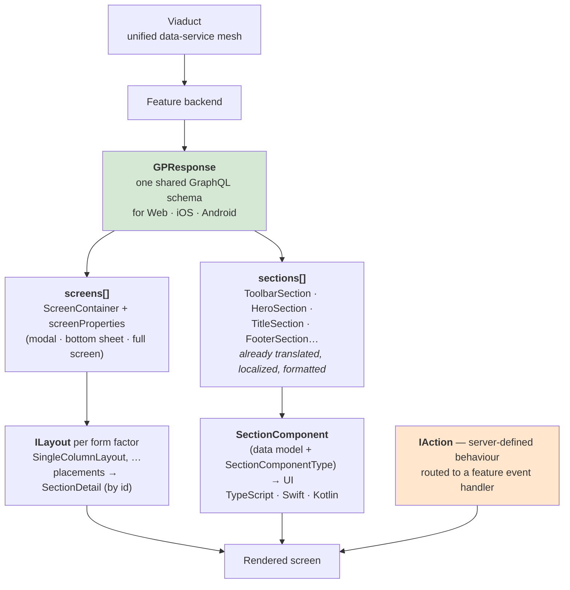

# 🏭 Frontend Engineering Blogs — Real Case Studies

> **Why this file exists:** front-end system design answers get dismissed as hand-waving because candidates have no numbers. This file gives you **six production case studies with published figures** you can quote, plus the wider source set to keep reading.
>
> Part of [Track E — Frontend System Design](frontend-system-design.md).
>
> ⚠️ Everything stated here is drawn from the linked posts. Where a post reports a limitation or a *rejected* approach, that's included too — knowing what a team decided **not** to ship is usually the more interesting half.

---

## Syllabus Coverage Index

| # | Case study | Company | Core lesson | Maps to |
|---|---|---|---|---|
| 1 | [Ghost Platform — server-driven UI](#1-airbnb--server-driven-ui-the-ghost-platform) | **Airbnb** | One schema drives web + iOS + Android; ship UI without an app release | [E4](frontend-architecture.md#7-server-driven-ui) |
| 2 | [Shipping less JavaScript](#2-netflix--shipping-less-javascript) | **Netflix** | −200 kB JS → **−50% TTI**; prefetch → **−30% TTI** on the next page | [E2](frontend-performance.md) · [E1](frontend-rendering.md) |
| 3 | [Five years of React Native](#3-shopify--one-codebase-three-platforms) | **Shopify** | <500 ms P75 screen loads — *and* "100% RN should be an anti-goal" | [E4](frontend-architecture.md#8-cross-platform-strategy) |
| 4 | [Multiplayer without OT or a true CRDT](#4-figma--multiplayer-without-ot-or-a-true-crdt) | **Figma** | Per-property LWW + fractional indexing; the hardest part is **undo** | [E5](frontend-realtime-collab.md#7-figmas-model-crdt-inspired-not-a-crdt) |
| 5 | [Cutting WebSocket traffic 40%](#5-discord--cutting-websocket-traffic-by-40) | **Discord** | Compress the **stream**; send **deltas** not snapshots | [E5](frontend-realtime-collab.md#6-bandwidth--the-discord-case-study) |
| 6 | [Partial prerendering](#6-vercel--partial-prerendering) | **Vercel** | Static shell from the edge + `<Suspense>`-shaped dynamic holes | [E1](frontend-rendering.md#9-partial-prerendering-ppr) |
| 7 | [The front-end slice of a backend blog](#7-uber--the-frontend-slice) | **Uber** | Large-list rendering, web-app rewrite, design-system measurement | [E2](frontend-performance.md) · [E4](frontend-architecture.md) |
| ★ | [The wider source set + how to read it](#8-the-wider-source-set) | — | GreatFrontEnd (RADIO), *frontend at scale*, and the rest | [E0](frontend-system-design.md) |
| ★ | [Cross-cutting themes](#9-cross-cutting-themes) | — | The six patterns that repeat across all of them | — |

---

## 1. Airbnb — server-driven UI (the Ghost Platform)

> **Source:** *[A deep dive into Airbnb's server-driven UI System](https://medium.com/airbnb-engineering/a-deep-dive-into-airbnbs-server-driven-ui-system-842244c5f5)* — Ryan Brooks, Jun 2021.

### The problem

With web, iOS and Android each turning listing *data* into *UI*, Airbnb had three implementations of the same logic:

| Problem | In their words |
|---|---|
| Duplicated logic | *"There's listing-specific logic built on each client to transform and render the listing data. This logic becomes complicated quickly and is inflexible."* |
| Drift | *"Each client has to maintain parity with each other… It's easy for clients to quickly diverge."* |
| **The release-cycle tax** | *"Each time we need to add new features to our listing page, we need to release a new version of our mobile apps for users to get the latest experience. Until users update, we have few ways to determine if users are using or responding well to these new features."* |

### The inversion

> *"What if clients didn't need to know they were even displaying a listing? … we pass both the UI and the data together, and the client displays it **agnostic of the data it contains**."*

Everything — *"the screen's layout, how sections are arranged in that layout, the data displayed in each section, and even the actions taken when users interact with sections"* — comes from **a single backend response** shared across all three platforms.

### The architecture

| Concept | Why it's designed that way |
|---|---|
| **Sections are independent** | *"Entirely independent of other sections and the screen on which they are displayed… we gain the ability to reuse and repurpose sections without worrying about a tight coupling of business logic to any specific feature."* |
| **`SectionComponentType`** | Lets **one data model render several ways** — `TITLE` and `PLUS_TITLE` share `TitleSection` but render with different branding. Flexibility without schema duplication |
| **Layouts reference sections by ID** | *"We point to section data models rather than including them inline. This shrinks response sizes by reusing sections across layout configurations"* |
| **`LayoutsPerFormFactor`** | Compact vs wide layouts chosen client-side from *"screen density, rotation, and other factors"* |
| **`IAction`** | Generic actions (navigate, scroll-to-section) handled by the framework; features register their own handlers for domain-specific behaviour |

### The decision that made it scale

> *"The key decision that helped us make our server-driven UI system scalable was to use a **single, shared GraphQL schema** for Web, iOS, and Android apps."*

### Outcome & honesty

- *"A majority of Airbnb's most used features (e.g., search, listing pages, checkout) are built on GP."*
- *"**Server-driven UI is complex.** Countless hours have gone into creating a robust schema, client frameworks, and developer documentation."*
- Roadmap: nested sections for composability, Figma integration for discoverability, and WYSIWYG section editing for no-code changes.

> ⭐ **Interview line:** *"When your bottleneck is shipping the same change three times and waiting on app-store review, server-driven UI is the structural fix. The two design choices that make Airbnb's work are a single shared schema across platforms and sections that are completely decoupled from the screen they appear on — that decoupling is what stops the section library becoming a second, worse component library. The cost is a schema that every team depends on, bigger payloads, and a weak offline story."*

---

## 2. Netflix — shipping less JavaScript

> **Source:** *[A Netflix Web Performance Case Study](https://medium.com/@NetflixTechBlog/a-netflix-web-performance-case-study-c0bcde26a9d9)* — Addy Osmani with Netflix UI Engineering, Nov 2018.

### Setup

The optimised page was the **logged-out homepage** — where users land to sign up or sign in. It shipped **300 kB of JavaScript**: React, client-side utilities like Lodash, and the context data used to hydrate React's state. On a throttled 3G connection it took **7 seconds** to load.

Every Netflix page is server-side rendered React, so *"it was important to keep the structure of the newly-optimized homepage similar to maintain a consistent developer experience."*

### The method — deliberately unglamorous

> *"By **turning off JavaScript in the browser** and observing which elements of the site still functioned, the developer team could determine if React was truly necessary for the logged-out homepage to function."*

Most of the page was already basic HTML. The genuinely interactive parts were rewritten in vanilla JS:

- Basic interactions (the tabs halfway down the page)
- The language switcher — *"rebuilt in vanilla JavaScript using **less than 300 lines of code**"*
- The cookie banner (non-US visitors)
- Client-side logging for analytics
- Performance measurement and logging
- Ad-attribution pixel bootstrap (sandboxed in an iframe for security)

### Results

| Change | Result |
|---|---|
| Removed client-side React, Lodash and the corresponding app code | **> 200 kB less JavaScript** |
| | **Over 50% reduction in Time-to-Interactive** |
| Lab verification | Desktop TTI **< 3.5 s** in Lighthouse |
| Field verification | First Input Delay was fast for **97% of desktop users** (Chrome UX Report) |
| Business signal | *"Reducing Time-to-Interactive on the client-side also caused users to click the sign-up button at a greater rate"* |

**React was still used on the server.** The trade was: SSR the landing page with React, ship no React to the client for *that page*, and **prefetch React for the next page**.

### Part two — prefetching

| Technique | Finding |
|---|---|
| `<link rel="prefetch">` | Simple, but *"it doesn't guarantee that the browser actually will prefetch"* and support was uneven |
| **XHR prefetching** | *"Produced a **95% success rate** when the Netflix team prompted the browser to cache a resource"* — used for the JS and CSS bundles (it can't prefetch HTML documents) |
| **Combined result** | **Time-to-Interactive reduced by 30%** for the next navigation — the SPA sign-up flow with the much larger bundle |
| Cost | *"Required no JavaScript to be rewritten and didn't negatively impact the performance of the logged-out homepage"* — a **very low-risk** win |

### The nuance to repeat

Netflix's landing page is *"their most heavily A/B tested page in the sign-up flow, with machine learning models used to customize messaging and imagery"* across almost 200 countries. So "just make it static" was never available — the page had to stay server-rendered and dynamic while shedding client JS.

They also considered and rejected **Preact**: *"for a simple page flow with low interactivity, using vanilla JavaScript was a simpler choice for their stack."*

> **The post's own tl;dr:** *"There are no silver bullets to web performance. Simple static pages benefit from being server-rendered with minimal JavaScript. Libraries can provide great value for complex pages when used with care."*

> ⭐ **Interview line:** *"The highest-leverage performance work is usually deletion, not optimisation. Netflix turned JavaScript off to find out which parts of the page genuinely needed a framework, rewrote those few in vanilla JS — the language switcher was under 300 lines — and cut over 200 kB and half their Time-to-Interactive. Then they used the time the user spends on that page to prefetch the framework for the next one, which bought another 30% for free. Two different levers: reduce cost, and move cost off the critical path."*

---

## 3. Shopify — one codebase, three platforms

> **Source:** *[Five years of React Native at Shopify](https://shopify.engineering/five-years-of-react-native-at-shopify)* — Mustafa Ali, Jan 2025.

### Why they moved

Three stated reasons: **write it once** (stop building every feature twice), **talent portability** (devs fluent across iOS, Android and Web), and **ship more value** instead of chasing feature parity.

They migrated **all** their apps, but *"instead of using a one-size-fits-all approach… each team chose when and how to migrate their app"* — incremental, not a flag day.

### Reported outcomes

| Metric | Result |
|---|---|
| Screen loads | **sub-500 ms (P75)** in the Shopify app, *"similar performance in all our apps"* |
| Stability | **> 99.9% crash-free sessions** |
| Parity | *"Maintaining feature parity between iOS and Android has become a non-issue"* |

> *"Native doesn't automatically mean fast, and React Native doesn't automatically mean slow… Just like native, you have to apply good patterns and techniques to eliminate performance bottlenecks."*

### The nine lessons — the honest ones matter most

| ✅ / ❌ | Lesson | Detail |
|---|---|---|
| ✅ | **RN apps are fast** | With deliberate performance work — they open-sourced **FlashList** for exactly this reason |
| ✅ | **Hot reloading is transformative** | With native, *"it took several minutes for even the most trivial changes to be compiled"* |
| ✅ | **TypeScript unlocks talent portability** | Web devs move to mobile and back; *"increases staffing flexibility and enables teams to accomplish more with the same number of developers"* |
| ⚠️ | **Native devs are crucial** | *"You can't build a good product without these experts"* — build/release, per-device performance, and managing RN version upgrades |
| ⭐ | **"100% React Native should be an anti-goal"** | Native stays for device hardware (2D/3D scanning, on-device AI), memory-constrained surfaces (widgets, Apple Watch, App Intents), and long-running background work — POS syncs offline data natively so it *"had no effect on app performance"* |
| ❌ | **Debugging is worse** | *"Flakey and configuring it correctly in VSCode takes some work"* |
| ❌ | **Upgrades are not seamless** | *"Often requires restructuring the code base"* — mitigated by a **rotating group** owning upgrades while others ship features |
| ❌ | **More third-party dependencies** | Which *"increases the surface area of supply chain attacks"* — mitigated with Dependabot and automated code scanning |
| ⚠️ | **Shared foundations came later, on purpose** | Early on, *"each team built things their own way… we optimized for speed over consistency."* From 2023 they extracted identity, real-time monitoring and performance measurement into shared libraries |

> ⭐ **Interview line:** *"The framing I'd steal from Shopify is 'native **and** React Native', not 'native **or** React Native'. They moved every app to RN and hit sub-500 ms P75 screen loads with 99.9% crash-free sessions, and they still call 100% RN an anti-goal — hardware access, widgets and background sync stay native. I'd also copy their sequencing: let teams migrate on their own schedule first and extract shared foundations later, because you can't design the right shared library before you have the expertise."*

**Also worth knowing from Shopify:** [FlashList](https://shopify.engineering/instant-performance-upgrade-flatlist-flashlist) (a faster `FlatList` replacement, [rewritten as v2](https://shopify.engineering/flashlist-v2) for RN's New Architecture), [Improving Shopify App's Performance](https://shopify.engineering/improving-shopify-app-s-performance), [Mobile Bridge: making WebViews feel native](https://shopify.engineering/mobilebridge-native-webviews), and [raising mobile E2E test stability to 98%](https://shopify.engineering/mobile-e2e-testing).

---

## 4. Figma — multiplayer without OT or a true CRDT

> **Source:** *[How Figma's multiplayer technology works](https://www.figma.com/blog/how-figmas-multiplayer-technology-works/)* — Evan Wallace, Oct 2019. Full breakdown in [frontend-realtime-collab.md §7](frontend-realtime-collab.md#7-figmas-model-crdt-inspired-not-a-crdt).

**Headlines to quote:**

| Decision | Reason |
|---|---|
| **Not OT** | *"Overkill… very complicated and hard to implement correctly. They result in a combinatorial explosion of possible states."* Figma isn't a text editor |
| **Not a true CRDT** | *"CRDTs are designed for decentralized systems where there is no single central authority… Since Figma is centralized, we can simplify our system by removing this extra overhead."* |
| **Per-property last-writer-wins** | *"Similar to a last-writer-wins register in CRDT literature except we don't need a timestamp because **the server can define the order of events**."* |
| **Accepted limitation** | Text `B` edited concurrently to `AB` and `BC` ends as `AB` or `BC`, *"but never ABC. That's ok with us because Figma is a design tool, not a text editor."* |
| **Parent as a property on the child** | Reparenting doesn't conflict with property edits and can't duplicate an object — but parent links are directed edges, so the **server rejects updates that would create a cycle** |
| **Fractional indexing** | Position is a fraction between neighbours; insert = average of two positions. Parent + position stored as **one atomic property** |
| **Deleted data lives in the deleter's undo buffer** | *"This helps keep long-lived documents from continuing to grow in size as they are edited"* |
| **The anti-flicker rule** | *"Discard incoming changes from the server that conflict with unacknowledged property changes"* — your own unsent change is your best prediction of the final value |
| **Undo is the hard part** | *"Undo in a multiplayer environment is inherently confusing."* Their principle: undo a lot, copy, redo back to the present → **the document must not change** |

**Process lesson:** before touching the real codebase they built *"a prototype environment… a web page that simulated three clients connecting to a server and visualized the whole state of the system"*, with scenarios for offline clients and bandwidth-limited connections. Their own takeaway: *"taking time to research and prototype in the beginning really paid off."*

> ⭐ **Interview line:** *"Figma's lesson is to relax the constraints you don't have. CRDTs solve merging **without** a central authority; if you have a server, you can use CRDT thinking and drop the coordination-free machinery — the server just defines the order. That gets you per-property last-writer-wins, which is simple enough to actually get right. And I'd say the accepted limitation out loud: two people can't concurrently merge edits into the same text value. Naming what you're choosing not to support is part of the design."*

---

## 5. Discord — cutting WebSocket traffic by 40%

> **Source:** *[How Discord Reduced Websocket Traffic by 40%](https://discord.com/blog/how-discord-reduced-websocket-traffic-by-40-percent)* — Austin Whyte, Sep 2024. Full breakdown in [frontend-realtime-collab.md §6](frontend-realtime-collab.md#6-bandwidth--the-discord-case-study).

### The two wins

| Change | Effect |
|---|---|
| **zlib streaming → zstd streaming** | `MESSAGE_CREATE` 270 → **166 bytes**; compression ratio ~6 → **~10**; compression time ~100 µs → **~45 µs** per byte |
| **`PASSIVE_UPDATE_V1` snapshots → `PASSIVE_UPDATE_V2` deltas** | That dispatch went from **35% → ~5%** of gateway bandwidth = a **20% cluster-wide reduction** on its own |
| **Combined** | **~40% less gateway bandwidth** for all clients on all platforms |

### The methodology worth copying

| Practice | Detail |
|---|---|
| **Dark launch** | Compress a small % of production traffic with *both* algorithms and discard the zstd output. *"Without this experiment, we would have to add zstandard support for our clients… about a month's lead time. A dark launch allowed us to iterate over days as opposed to weeks."* |
| **Measure bytes, not message counts** | The delta win was found only because they instrumented **actual dispatch sizes** — `PASSIVE_UPDATE_V1` was 35% of bandwidth but only ~2% of dispatches |
| **Ship behind an experiment** | *"A risky change with the potential to render Discord completely unusable"* — the flag allowed instant rollback, validated lab results in production, and watched baseline metrics |
| **Contribute upstream** | The Elixir zstd binding didn't support streaming, so they forked it, added streaming, and [merged it back](https://github.com/silviucpp/ezstd/pull/15) |

### The two things they *rejected*

| Attempt | Why it was dropped |
|---|---|
| **Zstd dictionaries** (trained on 120k anonymised messages, separate JSON and ETF dictionaries) | Excellent on tiny payloads (`TYPING_START` 466 → **187 bytes**) but negligible on `READY` (306,745 → 306,098 bytes) and **worse** on `MESSAGE_CREATE`. *"The slightly improved compression… was outweighed by the additional complexity."* |
| **Dynamic buffer upgrading off-peak** | BEAM allocator memory fragmentation made the feedback loop under-estimate free memory; upgrade ratio reached only ~30% vs an expected ~70%. *"The amount of effort needed to tweak the allocators combined with the overall additional complexity… outweighed any gains."* |

> ⭐ **Interview line:** *"Two structural moves for realtime bandwidth. Compress the stream rather than the message — small payloads have no internal redundancy, so all the compressible structure is the similarity across messages. And send deltas, not snapshots: Discord found one periodic snapshot message was 35% of their entire gateway bandwidth while being 2% of messages. The meta-lesson is instrumenting by bytes rather than by count, and dark-launching the experiment so they could iterate in days instead of waiting a month for client releases."*

---

## 6. Vercel — partial prerendering

> **Source:** *[Partial prerendering: Building towards a new default rendering model for web applications](https://vercel.com/blog/partial-prerendering-with-next-js-creating-a-new-default-rendering-model)* — Sebastian Markbåge & Malte Ubl, Nov 2023. Full breakdown in [frontend-rendering.md §9](frontend-rendering.md#9-partial-prerendering-ppr).

**The framing:** stop choosing static *or* dynamic for a whole page.

> *"When you build your application, Next.js will prerender a static **shell** for each page of your application, leaving **holes** for the dynamic content."*
>
> *"The fast static shell is served from the end-user's nearest region, allowing the user to start consuming the page, and the client and server to work in parallel. The client can start parsing scripts, stylesheets, fonts, and static markup while the server renders dynamic chunks."*

| Mechanism | Detail |
|---|---|
| **`<Suspense>` is the boundary** | *"Because PPR takes advantage of React `<Suspense>` boundary, **you** decide whether the boundary is static or dynamic."* The `fallback` is what gets prerendered into the shell |
| **Static by default** | Static optimisation *"covers all components until the app accesses incoming request information like headers or cookies, which is a clear signal that dynamic rendering is needed"* |
| **Minimal dynamic surface** | *"Next.js then changes the smallest possible section of the page to be dynamic while keeping static optimization for everything else"* |
| **It's ISR + SSR, unified** | *"The static shell retains the ability to be updated via Incremental Static Regeneration"* — on-demand, time-based and tag-based revalidation still apply |
| **One render tree** | *"Rendering happens in a single React render tree"* — not two separate static and dynamic pipelines |

Their own historical framing is worth borrowing: *"You may be thinking: 'We did this in the 90s with server-side includes'. That is true, but in that world static and dynamic were separated into completely different technology worlds and we didn't have incremental updates of static content."*

**The canonical example** — a product detail page where nearly everything is prerendered, and only the customer reviews, the cart count, the personalised delivery estimate and below-the-fold recommendations stream in dynamically.

> ⭐ **Interview line:** *"I'd resist framing a page as static or dynamic. Most pages are ~90% identical for every user with a few personalised fragments. Prerender the shell so it serves from the edge, wrap each personalised fragment in a Suspense boundary, and stream those per request. You get CDN-speed LCP with per-user correctness — and the personalised parts were exactly the parts that were never cacheable anyway."*

---

## 7. Uber — the front-end slice

Uber's engineering blog is overwhelmingly backend (749 engineering articles; **62** tagged Mobile, **16** tagged Web). The front-end-relevant reading list:

| Post | Topic |
|---|---|
| [Supercharge the Way You Render Large Lists in React](https://www.uber.com/in/en/blog/supercharge-the-way-you-render-large-lists-in-react/) (2023) | List virtualisation / windowing → [E2 §9](frontend-performance.md#9-list-virtualisation) |
| [Counting Calories: performance & DX of UberEats.com](https://www.uber.com/in/en/blog/uber-eats-com-web-app-rewrite/) (2020) | Web app rewrite, perf and developer experience |
| [Building Scalable, Real-Time Chat](https://www.uber.com/in/en/blog/building-scalable-real-time-chat/) (2024) | Realtime client architecture → [E5](frontend-realtime-collab.md) |
| [How to Measure a Design System at Scale](https://www.uber.com/in/en/blog/design-system-at-scale/) (2024) | Design-system adoption metrics → [E4 §4](frontend-architecture.md#4-design-systems) |
| [Developing the ActionCard Design Pattern](https://www.uber.com/in/en/blog/developing-the-actioncard-design-pattern/) (2023) | Component composition patterns |
| [Continuous deployment for large monorepos](https://www.uber.com/in/en/blog/continuous-deployment/) (2024) | Monorepo CI/CD → [E4 §5](frontend-architecture.md#5-monorepo-vs-polyrepo) |
| [How Uber Standardized Mobile Analytics](https://www.uber.com/in/en/blog/how-uber-standardized-mobile-analytics/) (2025) | Client telemetry → [E4 §12](frontend-architecture.md#12-observability--testing) |
| [Use Passkeys Wherever You Sign in to Uber](https://www.uber.com/in/en/blog/use-passkeys-wherever-you-sign-in-to-uber/) (2023) | Auth UX / WebAuthn |
| [Accelerating gRPC in OpenSearch](https://www.uber.com/in/en/blog/high-performance-grpc/) (2026) | Payload encoding — relevant to any high-volume client protocol → [restvsgraphqlVsRPC.md §19](restvsgraphqlVsRPC.md#19-real-world-case-study--uber-adds-native-grpc-to-opensearch) |

> **LinkedIn Engineering**, for comparison, is almost entirely AI/infrastructure. The closest front-end-adjacent posts are [Engineering the next generation of LinkedIn's Feed](https://www.linkedin.com/blog/engineering/feed/engineering-the-next-generation-of-linkedins-feed) and [Accelerating LinkedIn's My Network tab by reducing latency](https://www.linkedin.com/blog/engineering/infrastructure/accelerating-linkedins-my-network-tab) — and both are told mostly from the serving side. See [ai-company-engineering-blogs.md](ai-company-engineering-blogs.md) for the AI-side deep dives.

---

## 8. The wider source set

### 8.1 Interview-shaped material

| Source | What it gives you |
|---|---|
| **GreatFrontEnd** | The **RADIO** framework (Requirements → Architecture → Data model → Interface → Optimizations) — the de-facto structure for a front-end system design answer. Worked solutions for the classic prompts: news feed, autocomplete, e-commerce, chat, image carousel, poll widget, Google Docs. → [E0 §1](frontend-system-design.md#1-radio--the-framework-to-run-every-question-through) and [E7](frontend-interview-playbook.md) |
| ***frontend at scale*** (frontendatscale.com) | Architecture-thinking essays: modularity, coupling and cohesion, boundaries, and how front-end architecture decisions age. Read it for the *reasoning style*, not for recipes |
| **web.dev / Chrome DevRel** | The authoritative definitions and thresholds for LCP, INP, CLS, plus the diagnostic playbooks. If you quote a Core Web Vitals number, this is where it comes from |
| **patterns.dev** | Rendering patterns (islands, streaming, PRPL) and React patterns, with the trade-offs written out |
| **Josh Comeau / Kent C. Dodds / Dan Abramov (Overreacted)** | Mental models for React rendering, state and effects — useful when the interviewer drills into *why* a re-render happened |

### 8.2 Company blogs worth subscribing to

| Blog | Strongest for |
|---|---|
| [Airbnb Tech](https://medium.com/airbnb-engineering) | Server-driven UI, GraphQL at scale, cross-platform architecture |
| [Netflix TechBlog](https://netflixtechblog.com/) | Web performance, TV/device UIs, data-fetching architecture |
| [Shopify Engineering](https://shopify.engineering/) | React Native at scale, list performance, mobile E2E testing, design systems (Polaris) |
| [Figma Engineering](https://www.figma.com/blog/engineering/) | Multiplayer, WebGL/WASM rendering, performance of a browser-based editor |
| [Discord Engineering](https://discord.com/blog) | Realtime gateway, bandwidth, client performance across platforms |
| [Vercel](https://vercel.com/blog) | Rendering models (RSC, streaming, PPR, ISR), edge delivery |
| [Uber Engineering](https://www.uber.com/en-IN/blog/engineering/) | Large-list rendering, design-system measurement, monorepo CI |
| [Slack Engineering](https://slack.engineering/) | Client performance, desktop app architecture |
| [Spotify Engineering](https://engineering.atspotify.com/) | Design systems, cross-platform, experimentation |
| [Stripe](https://stripe.com/blog/engineering) | Payment UI correctness, idempotency, developer experience |

### 8.3 How to actually read an engineering blog for interview prep

1. **Extract the constraint, not the solution.** "Figma used LWW" is trivia. *"They had a central server, so they could drop the coordination-free part of a CRDT"* is a reusable move.
2. **Write down the number.** One quotable figure per case study is worth more than five vague summaries.
3. **Find what they rejected.** Discord dropped dictionaries; Netflix dropped Preact; Shopify keeps native code. Rejections show judgement.
4. **Map it to a topic file** so you can retrieve it under pressure — that's what the index at the top of this file is for.
5. **Rehearse the one-liner.** Each case study above ends with a ⭐ line sized to be said out loud in about 30 seconds.

---

## 9. Cross-cutting themes

Six patterns show up in every one of these posts:

| # | Theme | Evidence |
|---|---|---|
| **1** | **The biggest performance win is deletion.** | Netflix removed React from the client (−200 kB, −50% TTI). Discord removed redundant data from a payload (−20% cluster bandwidth). Neither was a clever algorithm |
| **2** | **Move work off the critical path rather than making it faster.** | Netflix prefetches the next page's bundle (−30% TTI). Vercel serves a prerendered shell while the dynamic parts render in parallel |
| **3** | **Relax the constraints you don't actually have.** | Figma dropped true-CRDT machinery because a central server exists. Vercel made static the default and dynamic the exception |
| **4** | **Decouple the unit so it can be reused and rearranged.** | Airbnb's sections know nothing about the screen. Vercel's holes are just Suspense boundaries. Northguard's segments, in the backend track, are the same idea |
| **5** | **Instrument the right dimension, then follow the data.** | Discord found a 35%-of-bandwidth message only by measuring bytes per dispatch type. Netflix validated in Lighthouse *and* CrUX field data |
| **6** | **Ship incrementally, behind a flag, with a rollback.** | Discord dark-launched compression and rolled out behind an experiment. Shopify let each team migrate to RN on its own schedule. Vercel and Uber both kept the old path running alongside the new one |

> ⭐ **The closing line for any front-end design round:** *"The pattern I see across all the public case studies is that the wins come from deleting work, moving work off the critical path, and being honest about which constraints you actually have — not from a cleverer framework. And every one of them shipped it incrementally behind a flag, because the client is the one environment where you can't roll back a bad deploy from the user's device."*
