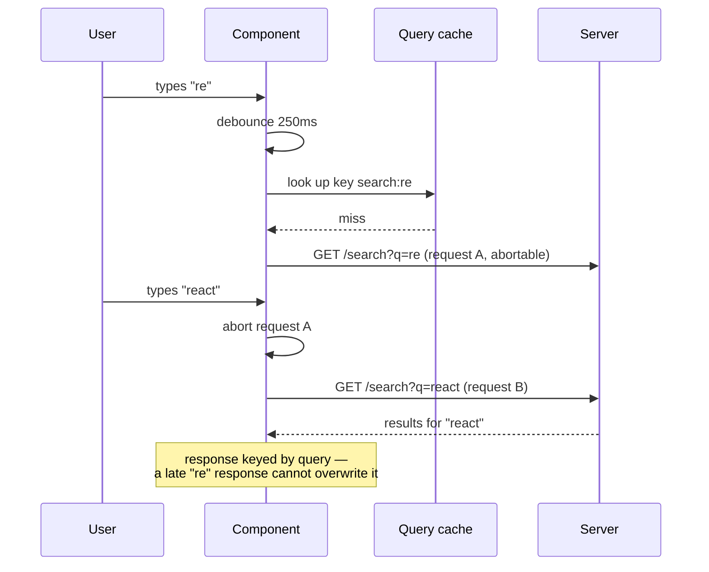
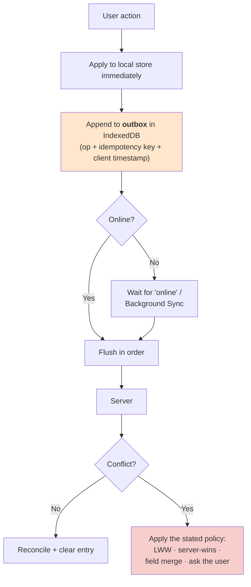

# 🎤 Frontend Interview Playbook

> **14 classic prompts, each run through [RADIO](frontend-system-design.md#1-radio--the-framework-to-run-every-question-through), each with the *twist* the interviewer is actually probing for.**
>
> Part of [Track E — Frontend System Design](frontend-system-design.md).

---

## Syllabus Coverage Index

| # | Topic | Section |
|---|---|---|
| 1 | The 45-minute clock | [§1](#1-the-45-minute-clock) |
| 2 | The reusable building blocks | [§2](#2-reusable-building-blocks-say-these-by-name) |
| 3 | **The problem bank — 14 prompts** | [§3](#3-the-problem-bank) |
| 4 | Weak vs strong answers, side by side | [§4](#4-weak-vs-strong) |
| 5 | Red flags & recovery lines | [§5](#5-red-flags--recovery-lines) |
| 6 | Level calibration | [§6](#6-level-calibration) |
| 7 | Questions to ask them | [§7](#7-questions-to-ask-them) |
| ★ | The 60-second closing summary template | [§8](#8-the-closing-summary-template) |

---

## 1. The 45-minute clock

```mermaid
gantt
    title A 45-minute frontend system design round (axis = minutes)
    dateFormat X
    axisFormat %M
    section Phases
    R - Requirements + scope       :done, r, 0, 420
    A - Architecture diagram       :active, a, 420, 600
    D - Data model                 :d, 1020, 360
    I - API + component interface  :i, 1380, 420
    O - Optimizations (the meat)   :crit, o, 1800, 720
    Wrap-up + questions            :w, 2520, 180
```

| Minute | Do | Say |
|---|---|---|
| **0–7** | Write functional + non-functional requirements on the board | *"Before I design anything — is this public and crawlable? What devices and networks? Does it need to work offline?"* |
| **7–17** | Draw the boxes: client → edge → BFF → services. Mark what's server-rendered | *"Here's the request path. I'm treating the backend services as a black box unless you want to go there."* |
| **17–23** | Client entities, server state vs client state, normalisation | *"This is a cache of server data, so it needs staleness and invalidation, not just a variable."* |
| **23–30** | The API contract **and** the top-level component props | *"One call shaped for this screen, cursor-paginated, with this error shape."* |
| **30–42** | **Optimisations** — perf, network, a11y, i18n, resilience, security | *"Let me go through this in the order that would actually move the metric."* |
| **42–45** | Summarise the three key trade-offs; ask your question | See [§8](#8-the-closing-summary-template) |

> ⚠️ **The most common time-management failure:** spending 25 minutes on architecture and 5 on optimisations. Optimisations are where front-end depth lives — protect that block.

---

## 2. Reusable building blocks (say these by name)

You will reuse the same dozen mechanisms across every prompt. Learning them once means you're never designing from scratch.

| Block | Where it comes up | Reference |
|---|---|---|
| **Cursor pagination + `IntersectionObserver` sentinel** | Any feed or infinite list | [E3 §6](frontend-state-data.md#6-pagination--infinite-scroll) |
| **List virtualisation + overscan + stable keys** | Feeds, chat, tables, comments | [E2 §9](frontend-performance.md#9-list-virtualisation) |
| **Debounce + `AbortController` + cache-keyed-by-query** | Any search / typeahead | [E3 §5](frontend-state-data.md#5-data-fetching-waterfalls-dedupe-and-races) |
| **Optimistic update + snapshot + rollback + idempotency key** | Likes, sends, toggles, drag-reorder | [E3 §7](frontend-state-data.md#7-optimistic-updates) |
| **Normalised entity cache** | Anything where one entity appears in several views | [E3 §3](frontend-state-data.md#3-normalisation) |
| **Skeleton sized to content** | Every loading state (and it's a CLS fix) | [E2 §1.3](frontend-performance.md#13-cls--the-fixes-are-almost-always-boring) |
| **SSR shell + streamed dynamic holes** | Anything public with personalised parts | [E1 §9](frontend-rendering.md#9-partial-prerendering-ppr) |
| **Route-level code splitting + prefetch on hover** | Every multi-route app | [E1 §11.2](frontend-rendering.md#112-prefetching--the-cheapest-perceived-performance-win) |
| **`srcset` + AVIF + `fetchpriority` on the LCP image** | Any image-heavy page | [E2 §6.1](frontend-performance.md#61-images--usually-the-majority-of-page-weight) |
| **WebSocket + heartbeat + jittered reconnect + resume cursor** | Chat, collaboration, live data | [E5 §4](frontend-realtime-collab.md#4-websocket) |
| **Per-property LWW + fractional indexing** | Collaborative editing, reorderable lists | [E5 §7](frontend-realtime-collab.md#7-figmas-model-crdt-inspired-not-a-crdt) · [§9](frontend-realtime-collab.md#9-fractional-indexing) |
| **Outbox in IndexedDB + service worker** | Offline support | [E3 §9](frontend-state-data.md#9-offline-first) |
| **Error boundary per widget + degradation order** | Every composed page | [E4 §9](frontend-architecture.md#9-resilience-in-the-ui) |
| **Focus management on route change + live regions** | Every SPA (this is the a11y answer) | [E4 §10](frontend-architecture.md#10-accessibility) |

---

## 3. The problem bank

### 3.1 Design a **news feed** (Facebook / Twitter / LinkedIn)

| RADIO | Key points |
|---|---|
| **R** | Infinite scroll, mixed media, likes/comments inline, real-time-ish new-post indicator. Mobile-first, 3G, public profile pages need SEO |
| **A** | SSR/stream the first page for LCP + SEO → hydrate → client fetches subsequent pages. Feed items are independent widgets with their own error boundaries |
| **D** | **Normalised**: `posts`, `users`, `comments` by ID; the feed query stores an **ordered list of IDs** + `nextCursor`. A like updates `posts[id]` once and every view re-renders |
| **I** | `GET /feed?cursor=&limit=20` → `{ items: [...], nextCursor }`. Field-limited: no comment bodies in the list payload, just counts |
| **O** | Virtualise past ~50 items · cursor pagination (offset causes duplicates) · lazy-load images below the fold with reserved aspect ratios · optimistic likes · prefetch page N+1 at 70% scroll · **persist scroll position and loaded pages for back-navigation** · `aria-live` for "5 new posts" · pause video when off-screen |

> ⭐ **The twist:** *why cursor pagination.* If you say "offset", the follow-up is "someone posts while the user scrolls — what happens?" Answer: items shift, so page 2 repeats an item from page 1 and skips another.

---

### 3.2 Design an **autocomplete / typeahead**

| RADIO | Key points |
|---|---|
| **R** | ≤100 ms perceived latency, keyboard navigable, mobile-friendly, tolerant of typos, handles zero results |
| **A** | Controlled input → debounce → cache lookup → network → dropdown listbox |
| **D** | `Map<query, results>` with an LRU cap; cache **negative** results too |
| **I** | `GET /suggest?q=&limit=8` returning `{ id, text, highlightRanges, type }` — let the server say what to bold |
| **O** | Debounce ~250 ms · **`AbortController` for races** · cache by query (so backspace is instant) · prefetch on first focus · min query length · **full ARIA combobox pattern**: `role="combobox"`, `aria-expanded`, `aria-activedescendant`, `aria-controls` · results announced in a live region · virtualise if the list can be long · never steal focus from the input · escape-close and outside-click-close |

> ⭐ **The twist:** *the race condition.* Almost everyone says "debounce". The correct answer is that debounce reduces frequency but doesn't prevent an old response landing last — cancellation and query-keyed caching do.

---

### 3.3 Design an **image carousel / gallery**

| RADIO | Key points |
|---|---|
| **R** | Thousands of images possible, swipe on touch, keyboard on desktop, must not shift layout |
| **A** | Fixed-size viewport + a track transformed with `translate3d`; render current ± 2 slides only |
| **D** | `images[]` with dimensions **from the server** so aspect ratio is known before load |
| **I** | `<Carousel items renderItem activeIndex onChange aria-label />` |
| **O** | `transform`-only animation (composite, no reflow) · preload next/previous · `srcset` for DPR · LQIP blur-up placeholder · `fetchpriority="high"` on the first image (it's the LCP) · `loading="lazy"` on the rest · **`prefers-reduced-motion` disables autoplay** · arrow-key navigation, `aria-roledescription="carousel"`, pause-on-hover/focus, and a visible pause control if it autoplays |

> ⭐ **The twist:** *accessibility of autoplay.* An auto-advancing carousel with no pause control is a WCAG failure. Say it before they ask.

---

### 3.4 Design a **chat application** (Slack / WhatsApp Web)

| RADIO | Key points |
|---|---|
| **R** | Realtime delivery, history scrollback, typing indicators, read receipts, offline send, multi-device |
| **A** | WebSocket for live messages + REST for history. One socket per *browser*, not per tab — leader election via Web Locks |
| **D** | `messages` normalised by ID, per-channel ordered ID list, `pendingMessages` outbox with client-generated IDs, ephemeral `presence` and `typing` maps with TTLs |
| **I** | Socket: `{type, seq, channelId, payload}`. REST: `GET /channels/:id/messages?before=<cursor>` |
| **O** | **Bidirectional virtualisation** — anchor to the bottom; when prepending history, adjust `scrollTop` by the inserted height or the view jumps · optimistic send with a client ID reconciled to the server ID · outbox flush on reconnect with idempotency keys · **resume from last event ID**, don't refetch everything · typing indicator = "start" with auto-expiry, never rely on "stop" · deduplicate on redelivery · unread divider that doesn't move under the user · `aria-live="polite"` for incoming messages, but not while the user is scrolled up |

> ⭐ **The twist:** *scroll anchoring.* Loading older messages above the viewport moves everything down. Handling that (and staying pinned to the bottom only when the user was already at the bottom) separates people who've built chat from people who've read about it.

---

### 3.5 Design **Google Docs / a collaborative editor**

| RADIO | Key points |
|---|---|
| **R** | Multiple concurrent editors, cursors/selections visible, offline editing, undo/redo, version history |
| **A** | WebSocket to a document-scoped server process (Figma's model: *"a separate process for each multiplayer document"*). Local changes apply immediately; server defines the order |
| **D** | Document as a tree of objects: `Map<ObjectID, Map<Property, Value>>`. Parent stored **as a property on the child**, together with a **fractional index** in one atomic field |
| **I** | `applyOps(ops[])` / `onRemoteOps(ops[])` / `presence(cursor)` on separate channels |
| **O** | Per-property **last-writer-wins** with the server ordering events (simplest correct model) · **discard incoming server changes that conflict with your unacknowledged local changes** to prevent flicker · fractional indexing for reordering · client-generated object IDs so creation works offline · server rejects parent updates that would create a cycle · presence throttled to ~10–20 Hz and interpolated · **undo must not overwrite other people's later edits** |

> ⭐ **The twist:** *undo.* Ask-them-first material: *"Should undo be per-user or global?"* Figma's stated principle — undo a lot, copy, redo to the present, and the document must be unchanged — is the sharpest thing you can quote here. Full detail: [E5 §7](frontend-realtime-collab.md#7-figmas-model-crdt-inspired-not-a-crdt).

---

### 3.6 Design an **e-commerce product page**

| RADIO | Key points |
|---|---|
| **R** | Public + SEO-critical, image-heavy, personalised price/delivery/cart, must convert on mobile |
| **A** | **Partial prerendering**: static shell (title, gallery, description, specs) from the edge; Suspense holes for cart count, personalised delivery estimate, reviews, recommendations |
| **D** | Product is server state with a long `staleTime`; cart is server state with a short one; selected variant is **URL state** so it's shareable |
| **I** | One BFF call shaped for the page; variant selection updates the URL and refetches only the price fragment |
| **O** | LCP is the hero image — in the initial HTML, `fetchpriority="high"`, never `loading="lazy"` · reserve space for every image and the review block to protect CLS · JSON-LD structured data · canonical URL for variant query params · **defer third-party scripts** (chat, reviews widget, tag manager) until after interaction · optimistic add-to-cart with rollback |

> ⭐ **The twist:** *personalisation vs cacheability.* If you personalise the HTML, you've made it uncacheable at the CDN. The whole point of PPR is keeping the document generic and streaming the personal bits.

---

### 3.7 Design an **analytics dashboard**

| RADIO | Key points |
|---|---|
| **R** | Many widgets, heavy datasets, date-range filters, export, no SEO, desktop-first, long-lived tab |
| **A** | CSR (behind login). Each widget is independently loaded and independently error-bounded |
| **D** | Query key = `[metric, dateRange, filters, granularity]`; results cached with a `staleTime` matched to the data's real refresh rate |
| **I** | `POST /metrics/query` with a batch of widget queries — one round trip instead of twelve |
| **O** | Downsample server-side (never ship 1M points to draw 800 pixels) · canvas/WebGL for large charts, SVG for small ones · Web Worker for aggregation so the main thread stays free · virtualised tables · **`AbortController` on filter change** · refetch on focus/reconnect · avoid memory leaks in a tab left open all day ([E2 §12](frontend-performance.md#12-memory-in-a-long-lived-spa)) · accessible charts need a data table alternative, not just a `title` |

> ⭐ **The twist:** *downsampling is the server's job.* Candidates who propose fetching raw events and aggregating in the browser get asked "how many points?" and unravel.

---

### 3.8 Design a **video streaming UI** (YouTube / Netflix player)

| RADIO | Key points |
|---|---|
| **R** | Adaptive quality, fast start, resume position, captions, keyboard + screen-reader controls, low-end devices |
| **A** | HTML5 `<video>` + **Media Source Extensions**; HLS/DASH manifest; ABR ladder chosen client-side |
| **D** | Player state machine: `idle → loading → buffering → playing → paused → ended → error` |
| **I** | `<Player src poster startTime onProgress onQualityChange textTracks />` |
| **O** | Start at a low bitrate and step up (fast first frame beats a perfect one) · preload only metadata for below-the-fold videos · throttle progress reporting to ~5 s · save resume position with `sendBeacon` on unload · buffer-health-based ABR, not just bandwidth · captions via `<track>` (also SEO and comprehension) · full keyboard map (space, arrows, `f`, `m`, `c`) · `prefers-reduced-motion` disables autoplay preview |

> ⭐ **The twist:** *ABR is a control loop.* Say that quality switching should react to **buffer health**, not just measured bandwidth — same reasoning as [PID-based load shedding](load-balancer.md#26-real-world-case-study--ubers-load-manager-static-rate-limits--priority-aware-shedding): reacting to the instantaneous signal overcorrects.

---

### 3.9 Design a **file uploader** (Drive / Dropbox)

| RADIO | Key points |
|---|---|
| **R** | Multi-GB files, drag-and-drop, folder upload, progress, pause/resume, flaky networks, background continuation |
| **A** | Chunked upload direct to object storage via presigned URLs — **the file never touches your API server** |
| **D** | Per-file: `{ id, name, size, chunks[{index, status, etag}], overallStatus }` persisted in IndexedDB so a refresh can resume |
| **I** | `POST /uploads` → `{uploadId, presignedUrls[]}`; `PUT` each chunk; `POST /uploads/:id/complete` with the chunk ETags |
| **O** | Parallelism of ~3–6 chunks, adaptive to observed throughput · retry a failed chunk, not the file · resume by asking which chunks already exist · hash chunks client-side in a **Web Worker** for dedupe and integrity · real progress from upload stream events · validate type/size client-side *and* server-side · `beforeunload` warning while uploads are in flight · queue and flush when offline |

> ⭐ **The twist:** *resumability requires server-side chunk state.* "I'll retry the upload" is a 4 GB answer. "I'll ask which chunk indexes are already stored and continue from there" is the right one.

---

### 3.10 Design a **Kanban board** (Trello / Jira / Linear)

| RADIO | Key points |
|---|---|
| **R** | Drag-and-drop across columns, multi-user, offline-tolerant, hundreds of cards |
| **A** | CSR app + WebSocket for live updates; drag handled locally, persisted as one field update |
| **D** | Card position = **fractional index** within a column; column ID stored on the card. Store `(columnId, position)` as one atomic value ([E5 §9](frontend-realtime-collab.md#9-fractional-indexing)) |
| **I** | `PATCH /cards/:id { columnId, position }` — one write, no reindexing of siblings |
| **O** | Optimistic move with rollback · fractional indexing means two users dragging into the same gap both succeed (tie-break by client ID) · periodic rebalance when precision degrades · virtualise long columns · **keyboard-accessible drag** (grab with space, move with arrows, drop with space) since native HTML5 DnD is not keyboard accessible · announce moves in a live region |

> ⭐ **The twist:** *keyboard drag-and-drop.* Mentioning it unprompted is one of the strongest accessibility signals available in this problem.

---

### 3.11 Design a **notification system** (client side)

| RADIO | Key points |
|---|---|
| **R** | In-app toasts + a notification centre + a badge count, synced across devices and tabs |
| **A** | SSE or WebSocket while the app is open; **Web Push via service worker** when it's closed; poll-on-focus as the fallback |
| **D** | `notifications` normalised by ID + `unreadCount` fetched authoritatively, never just incremented locally |
| **I** | `GET /notifications?cursor=`, `POST /notifications/read`, socket event `notification.created` |
| **O** | **Deduplicate by ID** (reconnect redelivers; push can double-deliver) · batch/coalesce related events · **reconcile the unread count on reconnect** rather than trusting a local counter · request push permission after a relevant action, never on page load · `BroadcastChannel` so marking read in one tab clears the others · toasts are `role="status"`, dismissible, and never auto-dismiss an error |

> ⭐ **The twist:** *the badge count is server truth.* Local increment/decrement drifts the moment a message is read on another device.

---

### 3.12 Design a **data table** (sortable, filterable, 100k rows)

| RADIO | Key points |
|---|---|
| **R** | Sort, filter, column resize/reorder, row selection, export, sticky header |
| **A** | Server-side sort/filter/pagination (never ship 100k rows) + client-side virtualisation of what you did fetch |
| **D** | Query key includes **every** sort/filter/page input; selection stored as a `Set` of IDs so it survives re-sorting |
| **I** | `GET /rows?sort=&filter=&cursor=&limit=` · `<DataTable columns rows getRowId onSelectionChange />` |
| **O** | Virtualise rows (and columns if there are many) · `content-visibility: auto` on off-screen groups · memoise cell renderers · debounce filter input · "select all" must mean *all matching rows*, not just the loaded ones — send the **filter**, not the ID list · a real `<table>` with `<th scope>` for screen readers, `aria-sort` on sorted columns, and a keyboard grid interaction model |

> ⭐ **The twist:** *"select all" across pagination.* The naive answer sends 100,000 IDs. The right one sends the query.

---

### 3.13 Design a **design system / component library**

| RADIO | Key points |
|---|---|
| **R** | N product teams, web + native, must not block consumers, must be accessible by default |
| **A** | Tokens → primitives → patterns, published as versioned packages from a monorepo |
| **D** | Design tokens as JSON, transformed into CSS custom properties, Swift and Kotlin |
| **I** | Every component: composable sub-components, `ref` forwarding, rest-prop spreading, required a11y props typed as required |
| **O** | Tree-shakeable exports (**no barrel files that defeat it**) · semver + codemods for breaking changes · visual regression tests · a11y baked into primitives · escape hatches (`className`, `asChild`) so teams don't fork · **adoption metrics** — % of surfaces on system components, and drift · a documented contribution and deprecation process |

> ⭐ **The twist:** *governance, not components.* The technical part is easy; the reason design systems fail is that nobody can upgrade and nobody can contribute. [E4 §4](frontend-architecture.md#4-design-systems).

---

### 3.14 Design an **offline-capable app** (email / notes / field tooling)

| RADIO | Key points |
|---|---|
| **R** | Full read + write offline, sync on reconnect, multi-device, honest about staleness |
| **A** | Service worker (cache-first assets, network-first data with cache fallback) + IndexedDB + ordered outbox |
| **D** | Entities carry a **version/updatedAt** so conflicts are detectable, not just overwritten |
| **I** | Every mutation carries an **idempotency key**; the server returns the canonical entity |
| **O** | Flush in order · retry with backoff · **state your conflict policy explicitly** · show a "last synced / working offline" indicator rather than silently lying · version the service worker and prompt for reload rather than serving a stale shell forever · cap local storage growth |

> ⭐ **The twist:** *conflict policy is a product decision.* The strong answer names a policy per data type — last-writer-wins for a toggle, field-merge for a record, surface-to-user for a document body.

---

## 4. Weak vs strong

| Prompt | ❌ Weak | ✅ Strong |
|---|---|---|
| "How would you make this fast?" | "Lazy load and use a CDN." | "Which metric is bad? If it's LCP I'd check whether the LCP element is discoverable in the initial HTML — lazy-loaded heroes and CSS backgrounds are the usual cause. If it's INP I'd look for long tasks from hydration or a big render." |
| "How do you manage state?" | "Redux." | "I'd split it. Server state goes in a request cache with staleness and invalidation; UI state stays local; anything shareable goes in the URL. Most Redux bloat is server state in the wrong tool." |
| "Handle 100k rows." | "Pagination." | "Server-side sort/filter/paginate, then virtualise what I fetched — and I'd name what virtualisation breaks: Ctrl+F, screen-reader counts, deep links and scroll restoration." |
| "Two users edit the same thing." | "Use a CRDT." | "Depends on the unit of conflict. For discrete properties, per-property last-writer-wins with the server ordering events is far simpler and is what Figma ships. I'd only reach for OT or a text CRDT for concurrent typing into one paragraph." |
| "Should we use micro-frontends?" | "Yes, they scale better." | "Only if independent deployment across teams is the bottleneck — it's an org answer. They cost bundle duplication, worse INP, consistency drift, and N copies of auth/analytics/i18n." |
| "Make it accessible." | "Add ARIA labels." | "Semantic HTML first — ARIA only where HTML can't express it. Then keyboard operability, focus moved to the new heading on route change, live regions for async results, and the whole thing enforced in the design system." |
| "How do you know it worked?" | "Lighthouse score went up." | "Field data. p75 Core Web Vitals from real users, segmented by device class and country, with a budget enforced in CI so it doesn't regress next sprint." |

---

## 5. Red flags & recovery lines

| Red flag | Recovery line |
|---|---|
| You drifted into database sharding | *"That's a backend concern — let me assume the API gives me a cursor-paginated feed and come back to the client."* |
| You named a library instead of a mechanism | *"To be concrete about what I mean rather than the library: I need request deduplication, staleness, and invalidation-by-tag."* |
| You forgot loading/error/empty states | *"Before I go further — let me define the four states for this component, because they're part of the design, not the polish."* |
| You said "it depends" and stopped | *"It depends on X. Let me assume X = mobile-first on 3G, because that's the harder case, and I'll note what changes if it isn't."* |
| You've been silent for 20 seconds | *"Let me think out loud: the options are A, B, C. A fails because…"* |
| You realise an earlier decision was wrong | *"I want to revise something I said — CSR won't work here because this page needs to be crawlable. Let me change that to a streamed SSR shell."* ← **This is a positive signal, not a negative one.** |
| You have no numbers | *"I don't have exact figures, but for scale: LCP should be under 2.5 s at p75, and Netflix cut Time-to-Interactive by half by removing 200 kB of client JS — that's the order of magnitude JavaScript costs."* |
| The interviewer keeps pushing on one area | They're probing depth. Go deeper rather than moving on; changing topic reads as avoidance. |

---

## 6. Level calibration

| Level | What the answer looks like |
|---|---|
| **Mid** | Correct component breakdown, knows CSR vs SSR, mentions lazy loading and memoisation, handles loading and error states when prompted |
| **Senior** | Picks rendering strategy **per route** with a reason · separates server and client state · names the metric before the fix · designs the API contract · raises a11y and i18n unprompted · states a cost for every choice |
| **Staff+** | Frames the problem in terms of **constraints and org structure** · designs the *degradation order* and blast radius · proposes how to measure and enforce it in CI and RUM · knows what to *not* build · can cite how real companies solved it and what they rejected · explicitly scopes what's out of scope and why |

**The three things that most reliably read as senior:**

1. **Naming the cost of your own choice** before the interviewer does.
2. **Designing the failure states** (loading / empty / error / stale / offline) as part of the design, not as an afterthought.
3. **Saying how you'd measure it** — and that the measurement must be field data, segmented, and enforced in CI.

---

## 7. Questions to ask them

- *"How do you currently measure front-end performance — is there RUM, and is it segmented by device class?"*
- *"Is there a shared design system, and how do teams upgrade it?"*
- *"Where does the boundary sit between front-end and backend here — do you run a BFF, or does the client talk to services directly?"*
- *"How is accessibility handled — is it in the component library, or per team?"*
- *"What's the deploy story for the client? Feature flags, canary, and how do you roll back a bad bundle?"*
- *"What's the hardest front-end problem your team has hit in the last six months?"*

---

## 8. The closing summary template

> *"To summarise: I'd [**rendering choice**] because [**the deciding constraint**]. State splits into [**server cache**] and [**client state**], with [**this**] in the URL so it's shareable. The one API call this screen needs is [**shape**], cursor-paginated. The three optimisations I'd do first are [**X, Y, Z**], in that order, because [**the metric they move**].*
>
> *The main trade-offs I'm accepting are: [**trade-off 1**] — which costs us [**cost**]; and [**trade-off 2**] — which I'd revisit if [**condition**].*
>
> *I'd validate all of it with field Core Web Vitals at p75, segmented by device class, with a bundle-size budget enforced in CI so it doesn't regress.*
>
> *If I had more time, I'd go deeper on [**the thing you deliberately deferred**]."*

That last sentence matters: naming what you deliberately left out shows you were **scoping**, not forgetting.
