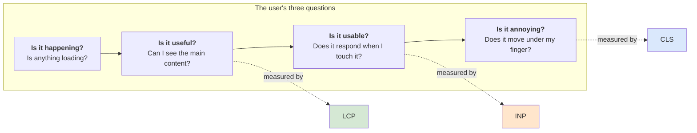
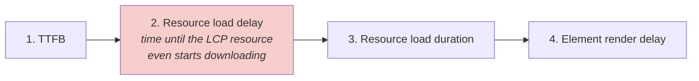
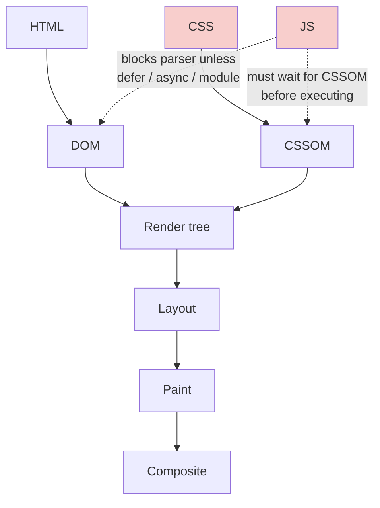
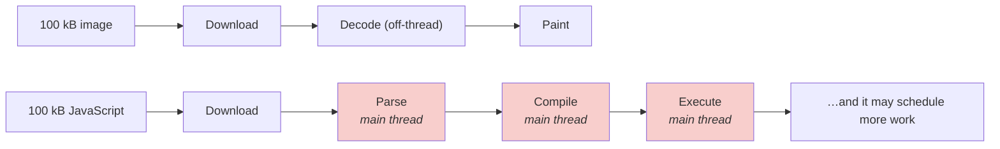
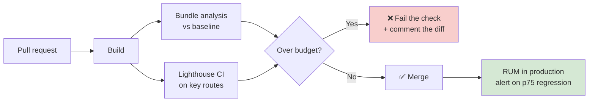
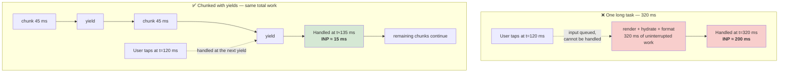
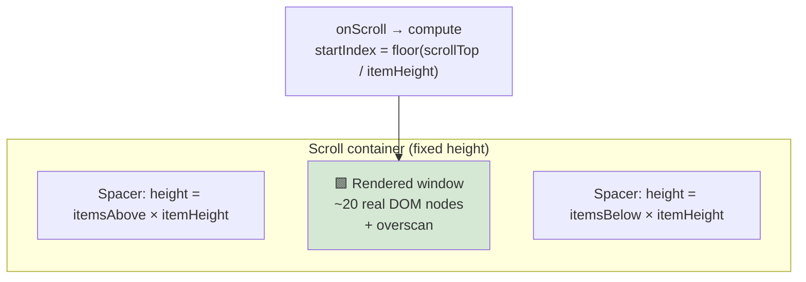
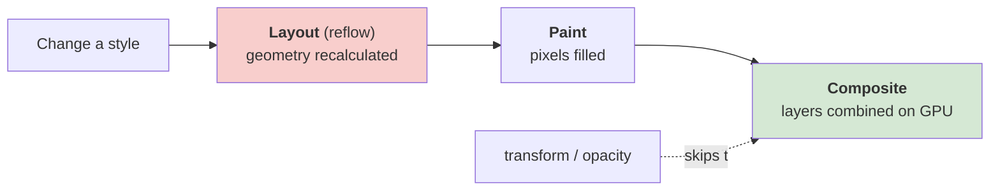

# ⚡ Frontend Performance

> **The rule:** name the *metric* before you name the *fix*. "I'd lazy-load" is a junior answer. "LCP is the problem and the LCP element is a hero image, so I'd preload it with `fetchpriority=high` and stop it being discovered by JavaScript" is a senior one.
>
> Part of [Track E — Frontend System Design](frontend-system-design.md).

---

## Syllabus Coverage Index

| # | Topic | Section |
|---|---|---|
| 1 | ⭐ **Core Web Vitals** — LCP, INP, CLS with thresholds | [§1](#1-core-web-vitals--the-only-three-numbers-that-matter) |
| 2 | The supporting metrics (TTFB, FCP, TBT, TTI) | [§2](#2-the-supporting-metrics) |
| 3 | Lab vs field data — and why you need both | [§3](#3-lab-vs-field--why-your-laptop-lies) |
| 4 | The critical rendering path | [§4](#4-the-critical-rendering-path) |
| 5 | **JavaScript** — the most expensive resource | [§5](#5-javascript--the-most-expensive-resource) |
| 6 | Images, fonts, CSS | [§6](#6-images-fonts-and-css) |
| 7 | Performance budgets & CI enforcement | [§7](#7-performance-budgets--ci-enforcement) |
| 8 | **Long tasks & the main thread** (the INP story) | [§8](#8-long-tasks--the-main-thread) |
| 9 | ⭐ **List virtualisation** | [§9](#9-list-virtualisation) |
| 10 | Rendering performance: reflow, repaint, compositing | [§10](#10-rendering-performance-reflow-repaint-composite) |
| 11 | Network: HTTP caching, compression, CDN | [§11](#11-network-level-wins) |
| 12 | Memory leaks in long-lived SPAs | [§12](#12-memory-in-a-long-lived-spa) |
| ★ | Rapid-fire Q&A | [§13](#13-rapid-fire-qa) |
| ★ | 🏭 Real-world: Netflix −200 kB, Shopify <500 ms, Uber lists | [frontend-company-case-studies.md](frontend-company-case-studies.md) |

---

## 1. Core Web Vitals — the only three numbers that matter



| Metric | Measures | Good | Needs work | Poor |
|---|---|---|---|---|
| **LCP** — Largest Contentful Paint | When the biggest above-the-fold element renders | **≤ 2.5 s** | ≤ 4.0 s | > 4.0 s |
| **INP** — Interaction to Next Paint | Worst-case responsiveness across the whole visit | **≤ 200 ms** | ≤ 500 ms | > 500 ms |
| **CLS** — Cumulative Layout Shift | How much visible content moves unexpectedly | **≤ 0.1** | ≤ 0.25 | > 0.25 |

> All three are measured at the **75th percentile of real users**, segmented by mobile and desktop. Your median is irrelevant — see [latency.md §3](latency.md#3-percentiles--why-the-average-lies).

### 1.1 LCP — the four sub-parts (this is how you actually debug it)



| Sub-part | Typical cause | Fix |
|---|---|---|
| **TTFB** | Slow origin, no edge caching | SSG/ISR, edge cache, stream early |
| **Load delay** ⚠️ | The LCP image is discovered only after JS runs (lazy-loaded hero, CSS `background-image`, client-rendered) | Put it in the initial HTML as ``, `preload` it, set `fetchpriority="high"`, and **never `loading="lazy"` the hero** |
| **Load duration** | Image too large / wrong format | Responsive `srcset`, AVIF/WebP, correct dimensions, CDN transform |
| **Render delay** | Main thread blocked by hydration, or a font blocking the text | Cut JS, `font-display: swap/optional` |

> ⭐ **The most common real-world LCP bug:** the hero image is `loading="lazy"` (someone applied it globally) or is a CSS background, so the browser can't discover it during preload scanning. It's a one-line fix that routinely takes seconds off LCP.

### 1.2 INP — why it replaced FID

**FID** only measured the *delay before* the first interaction was handled. **INP** measures the **whole interaction**, and reports roughly the worst one across the visit:

$$\text{INP} = \underbrace{\text{input delay}}_{\text{main thread busy}} + \underbrace{\text{processing time}}_{\text{your handler}} + \underbrace{\text{presentation delay}}_{\text{style, layout, paint}}$$

| Cause of bad INP | Fix |
|---|---|
| Long tasks blocking the main thread (usually hydration or a big render) | [§8](#8-long-tasks--the-main-thread) |
| A handler that does expensive work synchronously | Yield first, paint the visual feedback, then compute |
| A single state change re-rendering a huge tree | Memoisation, `useTransition`, virtualisation |
| Third-party scripts (tag managers, chat widgets, A/B tools) | Load them `async`, off the critical path, in a worker if possible, and **budget them** |

> ⭐ **Say this:** *"For INP the trick is to decouple *feedback* from *work*. Paint the pressed state or the optimistic result in the same frame, then yield and do the expensive part. The user's perception of speed is the first paint after their input, not the completion of the work."*

### 1.3 CLS — the fixes are almost always boring

| Cause | Fix |
|---|---|
| Images without dimensions | Always set `width`/`height` or `aspect-ratio` |
| Ads / embeds / iframes | Reserve a fixed slot; never collapse it when empty |
| Web fonts swapping metrics | `font-display: optional`, `size-adjust`, preload the font |
| Content injected above existing content (cookie banners, promo bars) | Reserve space, or overlay instead of pushing |
| Skeleton → real content of a different height | Make the skeleton the same size as the real thing |
| Animating `top`/`left`/`height` | Animate `transform`/`opacity` instead — they don't affect layout |

---

## 2. The supporting metrics

| Metric | Meaning | Why you still care |
|---|---|---|
| **TTFB** | First byte of the document | Everything downstream inherits it; it's the LCP floor |
| **FCP** | First pixel of any content | Tells the user "it's happening" |
| **TBT** | Total Blocking Time — main-thread blocking above 50 ms in the load window | The best **lab** proxy for INP (INP needs real interactions, so Lighthouse can't measure it) |
| **TTI** | Time to Interactive | Deprecated as a Core Web Vital, but still the clearest way to *explain* the "looks ready, isn't" problem — and the metric Netflix moved 50% |
| **Speed Index** | How quickly content is visually populated | Useful for progressive-rendering comparisons |

---

## 3. Lab vs field — why your laptop lies

| | **Lab (synthetic)** | **Field (RUM / CrUX)** |
|---|---|---|
| Source | Lighthouse, WebPageTest, CI | Real users, `web-vitals` library, Chrome UX Report |
| Good for | Reproducible regression detection, debugging | Truth |
| Blind to | Real devices, real networks, real cache states, real interactions | Root cause |
| Can measure INP? | No (needs real interactions) — use **TBT** as a proxy | Yes |

**Always segment field data by:**

- Device class (a low-end Android is ~4–6× slower than a dev laptop)
- Country / network
- Cold vs warm cache (first visit vs repeat)
- Route — your homepage p75 tells you nothing about checkout

> ⭐ **Say this:** *"I'd never ship a performance change without field data, because lab numbers on a fast laptop over Wi-Fi are best-case fiction. I'd collect Core Web Vitals with the `web-vitals` library, ship them to the same pipeline as the rest of our telemetry, and alert on the p75 per route and per device class."*

---

## 4. The critical rendering path



| Resource | Default behaviour | How to defuse it |
|---|---|---|
| **CSS** | **Render-blocking** — nothing paints until CSSOM is built | Inline critical CSS; load the rest with `media` / `preload`+`onload`; split per route |
| **Sync `<script>`** | **Parser-blocking** — DOM construction stops dead | `defer` (executes in order after parse) or `async` (executes whenever, order not guaranteed) |
| **Fonts** | Invisible or fallback text until loaded | `preload` + `font-display` |
| **Imports inside JS** | Sequential discovery | `modulepreload`, or move the fetch server-side |

**`defer` vs `async` — know the difference cold:**

| | `async` | `defer` |
|---|---|---|
| Downloads | In parallel | In parallel |
| Executes | The moment it arrives — interrupts parsing | After HTML parsing completes |
| Order preserved | ❌ No | ✅ Yes |
| Use for | Independent third-party (analytics) | Your app code that depends on the DOM or on other scripts |

---

## 5. JavaScript — the most expensive resource

**Why a kilobyte of JS costs more than a kilobyte of an image:** the image is decoded off the main thread; the JS must be **downloaded, parsed, compiled, and executed** — all main-thread work, all before the page responds.



### 5.1 The reduction ladder — in this order

| # | Lever | Typical win |
|---|---|---|
| **1** | **Delete it.** Do you need this library? A date library for one `toLocaleDateString`? A carousel library for three images? | Largest, always |
| **2** | **Replace it.** `date-fns`/`Temporal` over moment; native `Intl`; CSS scroll-snap over a carousel lib | Large |
| **3** | **Don't ship it to the client at all.** Server Components / server-side formatting | Large |
| **4** | **Route-level code splitting** | Large |
| **5** | **Component-level splitting** — modals, editors, charts, maps behind `import()` | Medium |
| **6** | **Tree shaking** — ESM, `sideEffects: false`, no barrel-file re-exports that defeat it | Medium |
| **7** | **Split vendor from app** so a dependency bump doesn't bust the whole cache | Caching win |
| **8** | Compression — **Brotli** over gzip | 15–20% over gzip |

> **Netflix's version of step 1–3:** their logged-out homepage shipped **300 kB** of JS. They kept React on the *server* and rewrote the handful of interactive bits (tabs, language switcher, cookie banner, logging) in vanilla JS — the language switcher took **under 300 lines**. Removing React + Lodash + app code from the client cut **over 200 kB** and improved **Time-to-Interactive by more than 50%**. Details in [frontend-company-case-studies.md](frontend-company-case-studies.md#2-netflix--shipping-less-javascript).

### 5.2 The two anti-patterns to name

| Anti-pattern | Why it hurts |
|---|---|
| **Barrel files** (`export * from './x'`) | Importing one icon can pull in the whole library because the bundler can't prove the rest is side-effect free |
| **Polyfilling for browsers nobody uses** | `differential serving` — ship a modern bundle to modern browsers via `type=module` / `nomodule`, and stop taxing 98% of users for 2% |

---

## 6. Images, fonts, and CSS

### 6.1 Images — usually the majority of page weight

| Technique | What it does |
|---|---|
| **Modern formats** — AVIF, then WebP, then JPEG fallback via `<picture>` | 30–50% smaller at the same quality |
| **`srcset` + `sizes`** | Ships the right resolution per device, instead of a 2000px image to a 375px phone |
| **`width`/`height` or `aspect-ratio`** | Prevents CLS |
| **`loading="lazy"`** on below-the-fold images | Saves bytes — ⚠️ **never** on the LCP element |
| **`fetchpriority="high"`** on the LCP image | Moves it up the browser's priority queue |
| **`decoding="async"`** | Keeps decode off the critical path |
| **A CDN with on-the-fly transforms** | One source image, per-device output, no build step |
| **Blur-up / LQIP placeholder** | Improves *perceived* speed without moving layout |

### 6.2 Fonts

| Strategy | Effect |
|---|---|
| `preload` the font actually used above the fold | Removes a discovery round trip |
| `font-display: swap` | Text visible immediately in a fallback, swaps when ready (a CLS risk) |
| `font-display: optional` | Uses the web font only if it's ready almost instantly — **best for CLS** |
| `size-adjust` / `ascent-override` on the fallback | Matches fallback metrics so the swap doesn't shift layout |
| Subset to the characters/scripts you use | Often a 60–80% size cut |
| Self-host rather than third-party | Removes an extra DNS+TLS handshake and a privacy/ownership dependency |
| Variable fonts | One file instead of 6 weights |

### 6.3 CSS

- **Inline the critical CSS** for above-the-fold, load the rest asynchronously.
- **Split by route** — a design system's full stylesheet on a login page is pure waste.
- Avoid `@import` in CSS — it serialises requests.
- Prefer `content-visibility: auto` for long off-screen sections: the browser skips their layout and paint entirely.
- Beware CSS-in-JS that computes styles at runtime on the main thread; zero-runtime/compiled variants avoid the INP tax.

---

## 7. Performance budgets & CI enforcement

A budget that isn't enforced is a wish.

| Budget type | Example | Enforced by |
|---|---|---|
| **Resource size** | "Initial JS ≤ 170 kB compressed" | `bundlesize`, `size-limit`, webpack `performance.maxAssetSize` |
| **Metric** | "LCP p75 ≤ 2.5 s on mobile" | Lighthouse CI with assertions, blocking the PR |
| **Count** | "≤ 3 third-party scripts on the critical path" | Custom CI check |
| **Regression delta** | "No PR may add > 5 kB to the initial bundle without sign-off" | Bundle-diff bot on the PR |



> ⭐ **Say this:** *"Performance is a ratchet, not a project. Without a budget enforced in CI, every sprint adds 5 kB and in a year you've undone a quarter's optimisation work with no one able to point at the commit that did it."*

---

## 8. Long tasks & the main thread

**A "long task" is any main-thread task over 50 ms.** During it, the browser cannot respond to input — that's directly your INP.



| Technique | Mechanism |
|---|---|
| **`scheduler.yield()`** | Yield to the browser mid-task and resume with priority — the modern answer |
| **`await new Promise(r => setTimeout(r, 0))`** | The universally supported fallback |
| **`isInputPending()`** | Yield only when input is actually waiting |
| **`requestIdleCallback`** | Run non-urgent work (analytics, prefetch, cache warming) when idle |
| **`useTransition` / `startTransition`** | Mark a state update as interruptible so urgent input can pre-empt it |
| **Web Worker** | Move genuinely heavy computation (parsing, diffing, crypto, image processing) off the main thread entirely |
| **`requestAnimationFrame`** | For anything visual, so work lands in the right frame |
| **Debounce / throttle** | Debounce for "when the user stops" (search input); throttle for "at most N per second" (scroll, resize, cursor broadcast) |

**Third-party scripts deserve their own paragraph.** They're the most common source of long tasks and the hardest to control. Load them `async`, sandbox them in an iframe where possible, delay non-essential ones until after interaction, monitor their cost separately, and be prepared to say "no" — a tag manager that adds 300 ms of blocking time is a product decision, not a technical one.

---

## 9. List virtualisation

**The problem:** 100,000 DOM nodes is 100,000 nodes to lay out, paint, and keep in memory. The browser does not care that only 20 are on screen.

**The fix:** render only the visible window plus a small overscan buffer, and fake the scrollbar with a spacer.



| Sub-problem | Approach |
|---|---|
| **Fixed-height rows** | Trivial: `startIndex = floor(scrollTop / rowHeight)` |
| **Variable-height rows** | Estimate, measure after render, cache measurements, correct the scroll offset |
| **Bidirectional / chat** | Anchor to the bottom; when prepending older messages, adjust `scrollTop` by the inserted height or the view jumps |
| **Grid / masonry** | 2-D windowing; recompute on resize |
| **Infinite scroll** | `IntersectionObserver` sentinel + **cursor** pagination ([frontend-state-data.md](frontend-state-data.md#6-pagination--infinite-scroll)) |

**What virtualisation breaks — say this unprompted:**

| Cost | Mitigation |
|---|---|
| Browser find-in-page (Ctrl+F) only sees rendered rows | Provide an in-app search |
| Screen readers lose the true list size | `aria-setsize` / `aria-posinset`, or an `aria-live` count |
| Anchor links / deep links to an item | Programmatic scroll-to-index |
| SEO can't see the content | Don't virtualise crawlable content — paginate instead |
| Scroll restoration on back-navigation | Persist and restore the scroll index yourself |

> **Real-world:** Uber published [Supercharge the Way You Render Large Lists in React](https://www.uber.com/in/en/blog/supercharge-the-way-you-render-large-lists-in-react/); Shopify open-sourced **FlashList** as a faster replacement for React Native's `FlatList` and rewrote it again (`FlashList v2`) for RN's New Architecture. Both exist because list rendering is *the* recurring performance problem in real products.

---

## 10. Rendering performance: reflow, repaint, composite



| Property changed | Triggers |
|---|---|
| `width`, `height`, `top`, `left`, `margin`, `font-size` | Layout → Paint → Composite (most expensive) |
| `color`, `background-color`, `box-shadow`, `visibility` | Paint → Composite |
| **`transform`, `opacity`** | **Composite only** — animate these |

**Layout thrashing** — the classic bug:

```js
// ❌ Forces a synchronous layout on every iteration
for (const el of items) {
  el.style.height = el.offsetHeight + 10 + 'px'; // read → write → read → write…
}

// ✅ Batch: read all, then write all
const heights = items.map(el => el.offsetHeight);
items.forEach((el, i) => { el.style.height = heights[i] + 10 + 'px'; });
```

Other levers: `will-change` (sparingly — each layer costs GPU memory), `content-visibility: auto` for off-screen sections, and `contain: layout paint` to bound the scope of a recalculation.

---

## 11. Network-level wins

### 11.1 HTTP caching — the two-bucket rule

| Bucket | Header | Why |
|---|---|---|
| **Immutable, content-hashed assets** (`app.4f2a1c.js`) | `Cache-Control: public, max-age=31536000, immutable` | The filename changes when the content changes, so it can be cached forever |
| **HTML and API responses** | `Cache-Control: no-cache` + `ETag` | Always revalidate; a 304 costs one small round trip and guarantees freshness |

Add `stale-while-revalidate` to serve instantly while refreshing in the background — the same idea as [ISR](frontend-rendering.md#5-ssg--isr--prerender-and-revalidate) and [cache-aside soft TTL](caching.md#9-ttl-time-to-live).

### 11.2 Connection & protocol

| Lever | Effect |
|---|---|
| **HTTP/2 / HTTP/3** | Multiplexing kills the old "concatenate everything" advice; HTTP/3 removes TCP head-of-line blocking ([networking.md §4](networking.md#4-http-evolution)) |
| **`preconnect`** to critical third-party origins | Saves DNS + TCP + TLS (~1–3 RTT) |
| **Brotli** | ~15–20% smaller than gzip for text |
| **CDN** | Cuts distance, which is the one latency you can't optimise away ([latency.md §2](latency.md#2-the-latency-numbers)) |
| **Fewer origins** | Each new origin costs a fresh handshake |

---

## 12. Memory in a long-lived SPA

A dashboard someone leaves open for eight hours will find every leak you have.

| Leak source | Fix |
|---|---|
| Event listeners not removed on unmount | Return a cleanup from every effect |
| Timers / intervals still running | `clearInterval` on unmount |
| `IntersectionObserver` / `ResizeObserver` not disconnected | `disconnect()` on unmount |
| WebSocket handlers on a reconnecting socket | Tear down and re-register, or use one shared client |
| Unbounded caches / arrays (chat history, logs) | Cap with an LRU or a ring buffer ([data-structure.md](data-structure.md)) |
| Closures capturing large objects | Null out references; avoid capturing DOM nodes in module scope |
| Detached DOM nodes still referenced in JS | Chrome DevTools → Memory → *Detached elements* |

**How to find them:** DevTools Memory panel → take a heap snapshot, do the suspicious action ten times, snapshot again, compare retained size. A staircase graph in the Performance monitor is a leak.

---

## 13. Rapid-fire Q&A

| Question | Answer |
|---|---|
| **What are the Core Web Vitals?** | LCP ≤ 2.5 s (loading), INP ≤ 200 ms (responsiveness), CLS ≤ 0.1 (visual stability) — all at the **p75 of real users**. |
| **Why did INP replace FID?** | FID only measured the delay before the *first* input was handled. INP measures input delay + processing + presentation for interactions across the whole visit. |
| **My LCP is bad. What do you check first?** | Whether the LCP element is discoverable in the initial HTML. Lazy-loaded heroes, CSS background images and client-rendered images all delay discovery — that's usually the biggest chunk. |
| **How do you fix CLS?** | Reserve space: dimensions/`aspect-ratio` on media, fixed ad slots, `font-display: optional` with `size-adjust`, skeletons the same size as the content, and animate `transform` not `top`. |
| **Why is JavaScript more expensive than an image of the same size?** | Images decode off the main thread. JS must be parsed, compiled and executed on the main thread — that's what delays interactivity. |
| **How do you reduce bundle size?** | Delete → replace with a lighter or native option → move it to the server → route split → component split → tree shake → split vendor → Brotli. In that order. |
| **What's a long task and why does it matter?** | Any main-thread task over 50 ms. Input can't be handled during it, so it directly degrades INP. Break work into chunks with `scheduler.yield()` or move it to a worker. |
| **`defer` vs `async`?** | Both download in parallel. `async` executes the moment it arrives and doesn't preserve order; `defer` executes after parsing, in order. Use `defer` for app code, `async` for independent third-party. |
| **How do you render 100,000 rows?** | Virtualise: render only the visible window plus overscan, with spacers to keep the scrollbar honest. Then handle the costs — find-in-page, screen-reader semantics, deep links and scroll restoration all break. |
| **What breaks if you virtualise?** | Ctrl+F, `aria` list sizing, anchor links, SEO, and back-button scroll restoration. Never virtualise content that must be crawlable. |
| **Which CSS properties are cheap to animate?** | `transform` and `opacity` — they skip layout and paint and run on the compositor. Animating `top`/`height` forces a reflow every frame. |
| **What is layout thrashing?** | Interleaving DOM reads and writes so the browser must recalculate layout synchronously each time. Batch all reads, then all writes. |
| **How should you cache static assets?** | Content-hash the filename and set `max-age=31536000, immutable`. HTML and API responses get `no-cache` + `ETag` so they always revalidate. |
| **Lab or field data?** | Both. Lab (Lighthouse/CI) catches regressions reproducibly; field (RUM/CrUX) is the only source of truth. Lighthouse can't measure INP — use TBT as the lab proxy. |
| **How do you stop performance regressing?** | Budgets enforced in CI — bundle-size diff on every PR plus Lighthouse assertions on key routes — and a p75 alert on production RUM. |
| **A third-party script is slowing us down. What do you do?** | Measure its isolated cost, load it `async` off the critical path, delay non-essential ones until after first interaction, sandbox in an iframe if possible, and escalate it as a product trade-off with the number attached. |
