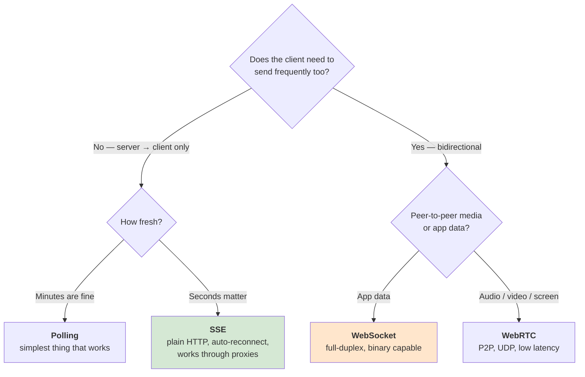
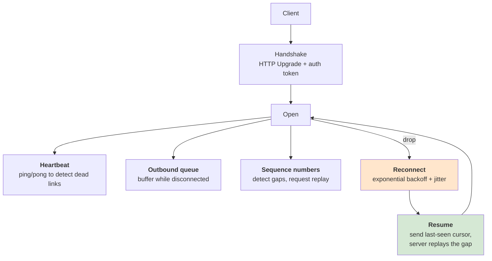
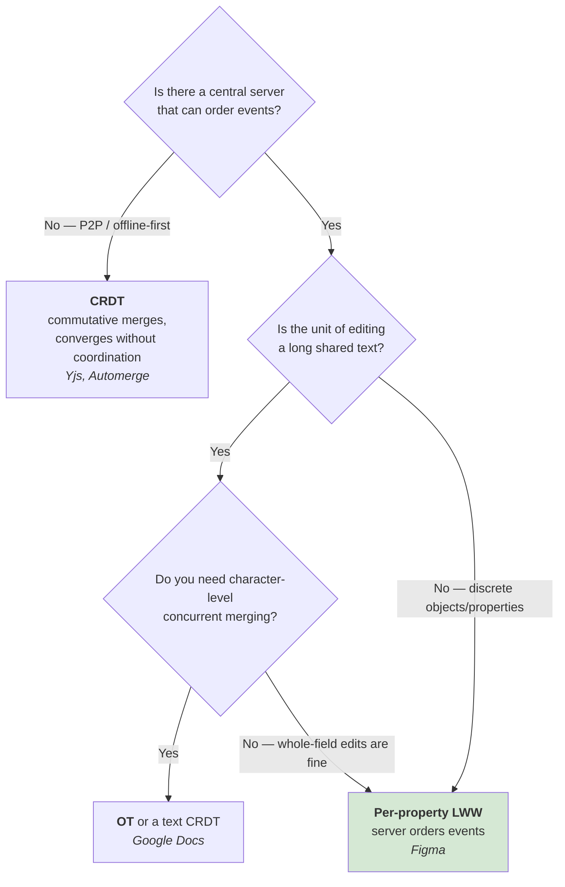
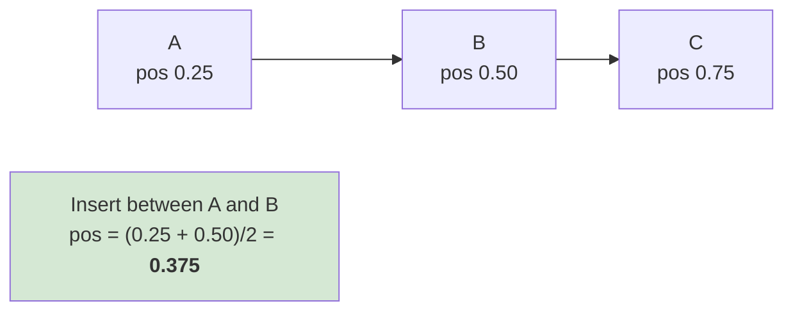
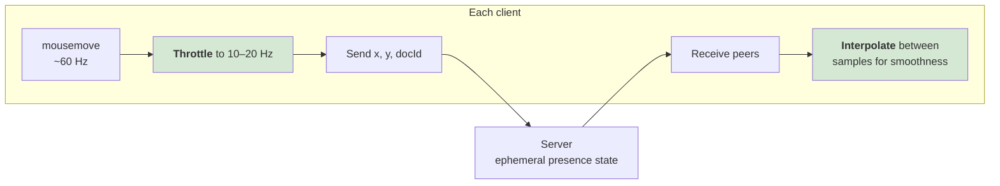

# 🔴 Frontend Realtime & Collaboration

> **Transports, presence, reconnection, bandwidth, and the hard part: what happens when two people change the same thing at the same time.**
>
> Part of [Track E — Frontend System Design](frontend-system-design.md).

---

## Syllabus Coverage Index

| # | Topic | Section |
|---|---|---|
| 1 | ⭐ The transport decision table | [§1](#1-the-transport-decision-table) |
| 2 | Polling · long polling | [§2](#2-polling--long-polling) |
| 3 | **Server-Sent Events (SSE)** | [§3](#3-server-sent-events-sse) |
| 4 | **WebSocket** — and everything you must build around it | [§4](#4-websocket) |
| 5 | WebRTC & WebTransport | [§5](#5-webrtc--webtransport) |
| 6 | ⭐ **Bandwidth**: deltas vs snapshots, compression (Discord) | [§6](#6-bandwidth--the-discord-case-study) |
| 7 | ⭐ **Figma's model** — CRDT-inspired, not a CRDT | [§7](#7-figmas-model-crdt-inspired-not-a-crdt) |
| 8 | OT vs CRDT vs LWW — choosing a conflict model | [§8](#8-ot-vs-crdt-vs-lww) |
| 9 | **Fractional indexing** — ordered lists without conflicts | [§9](#9-fractional-indexing) |
| 10 | Presence, cursors & typing indicators | [§10](#10-presence-cursors--typing-indicators) |
| 11 | Notifications & fan-out on the client | [§11](#11-notifications--client-side-fan-out) |
| ★ | Rapid-fire Q&A | [§12](#12-rapid-fire-qa) |

---

## 1. The transport decision table



| | Polling | Long polling | **SSE** | **WebSocket** | WebRTC |
|---|---|---|---|---|---|
| Direction | C→S then S→C | C→S then S→C | **S→C only** | **Bidirectional** | Bidirectional P2P |
| Protocol | HTTP | HTTP | HTTP (`text/event-stream`) | Upgraded TCP | UDP (usually) |
| Latency | Interval-bound | Near-real-time | Near-real-time | Lowest (of the TCP options) | Lowest overall |
| Auto-reconnect | N/A | Manual | ✅ **Built in**, with `Last-Event-ID` | ❌ You build it | ❌ You build it |
| Binary | Yes | Yes | ❌ Text only | ✅ Yes | ✅ Yes |
| Proxy / firewall friendly | ✅ | ✅ | ✅ | ⚠️ Mostly | ❌ Needs STUN/TURN |
| Works with HTTP/2 multiplexing | ✅ | ✅ | ✅ | ❌ Own connection | N/A |
| Per-connection server cost | Low | Medium (held request) | Medium | **High (long-lived, stateful)** | Low for server (P2P) |
| Best for | Dashboards refreshed on a timer | Legacy environments | Feeds, notifications, live prices, AI token streaming | Chat, collaboration, games, trading | Calls, screen share |

> ⭐ **Say this:** *"I'd start with the weakest transport that meets the freshness requirement. SSE is dramatically underrated — it's plain HTTP, it reconnects itself with a resume cursor, it survives corporate proxies, and it multiplexes over HTTP/2. I'd only take a WebSocket when the client genuinely needs to push frequently, because a WebSocket is a long-lived stateful connection and that changes how the backend scales and deploys."*

**The scaling consequence people miss:** long-lived connections break normal autoscaling. Discord says it plainly — *"due to the nature of gateway connections being long-lived, traditional autoscaling methods don't work well for our workload."* Sticky routing, connection draining on deploy, and jittered reconnect all become your problem ([load-balancer.md §20](load-balancer.md#20-case-study-b--websockets-the-question-that-separates-levels)).

---

## 2. Polling & long polling

**Short polling** — `setInterval(fetchData, 5000)`.

| ✅ | ❌ |
|---|---|
| Trivial; stateless; caches and retries work normally | Wastes requests when nothing changed |
| Fails gracefully | Latency is half the interval on average |
| Any infrastructure supports it | N clients × 1/interval requests, always |

**Make it less bad:** conditional requests with `ETag`/`If-None-Match` (a 304 is tiny), back off when the tab is hidden (`visibilitychange`), jitter intervals so clients don't synchronise into a stampede, and stop polling entirely when offline.

**Long polling** — the server holds the request open until there's data or a timeout, then the client immediately re-requests. Near-real-time over plain HTTP, but each client permanently occupies a connection/thread, and you must handle the gap between responses (use a cursor, not "since now", or you drop events).

---

## 3. Server-Sent Events (SSE)

```js
const es = new EventSource('/api/stream');
es.addEventListener('price', e => update(JSON.parse(e.data)));
es.onerror = () => {/* browser auto-reconnects; just surface the state */};
```

```
event: price
id: 1734
data: {"symbol":"ACME","price":41.2}

```

| Feature | Why it matters |
|---|---|
| **Automatic reconnection** | The browser retries with backoff. You didn't write it and you can't get it wrong |
| **`Last-Event-ID` header on reconnect** | The server resumes from where the client left off — **replay without gaps**, for free |
| **`retry:` field** | The server controls the client's reconnect delay |
| **Named events** | Multiple logical channels on one stream |
| **Plain HTTP** | Same auth, same CDN, same observability, same proxies |

**Limits:** text only (base64 for binary is 33% overhead), one-directional (the client sends via normal `POST`), and on HTTP/1.1 you hit the ~6-connections-per-origin cap — a non-issue on HTTP/2.

> **The obvious modern use case:** streaming LLM tokens. It's server→client, incremental, text, and needs resumption — SSE is the exact shape of that problem.

---

## 4. WebSocket

### 4.1 What you must build around it

A raw `new WebSocket(url)` is about 20% of the work.



| Concern | Requirement |
|---|---|
| **Auth** | Browsers can't set headers on a WS handshake — use a cookie, or a short-lived ticket in the query string, then re-authenticate on the socket. **Never put a long-lived JWT in the URL** (it lands in logs) |
| **Heartbeat** | A TCP connection can be dead while looking open (NAT timeout, sleeping laptop). Ping/pong with a timeout is the only reliable liveness check ([distributed-systems.md §2](distributed-systems.md#2-heartbeats--failure-detection)) |
| **Reconnect** | Exponential backoff **with jitter** — otherwise a server restart triggers a synchronised **thundering herd** from every client at once |
| **Resume, don't restart** | Send the last-processed event ID; the server replays the gap. Refetching everything on every reconnect is what makes flaky networks feel catastrophic |
| **Outbound queue** | Buffer user actions while disconnected, flush in order on reconnect, with idempotency keys |
| **Backpressure** | Watch `bufferedAmount`; if the client can't keep up, drop or coalesce low-value messages (cursor positions) rather than queueing forever |
| **Deploys** | Every deploy disconnects everyone. Drain gracefully and stagger restarts, or you DDoS yourself |
| **Multiple tabs** | Elect one leader tab to hold the socket ([frontend-state-data.md §10](frontend-state-data.md#10-multi-tab-sync)) |
| **Fallback** | If WS is blocked by a corporate proxy, degrade to SSE or polling rather than showing a broken app |

### 4.2 Message design

| Rule | Why |
|---|---|
| **Every message has a type and a version** | You will need to evolve the protocol without breaking old clients |
| **Every message has a monotonic sequence/ID** | Gap detection and resume depend on it |
| **Send deltas, not snapshots** | See [§6](#6-bandwidth--the-discord-case-study) |
| **Coalesce high-frequency events client-side** | Cursor moves at 60 Hz → throttle to ~20 Hz; nobody notices, and you cut traffic 3× |
| **Separate control from data channels** | Presence, acks and errors shouldn't be interleaved with a firehose |
| **Consider a binary encoding** | Protobuf/MessagePack/CBOR over JSON when volume is high — the same argument as [Uber's gRPC work](restvsgraphqlVsRPC.md#19-real-world-case-study--uber-adds-native-grpc-to-opensearch) |

---

## 5. WebRTC & WebTransport

**WebRTC** — peer-to-peer audio/video/data over UDP.

| Piece | Role |
|---|---|
| **Signalling** | *You* provide it (usually over WebSocket) — WebRTC doesn't specify how peers find each other |
| **STUN** | Discovers your public IP behind NAT |
| **TURN** | Relays traffic when P2P fails (~10–20% of connections). **Expensive — this is the real cost of WebRTC** |
| **SFU** | For group calls: a server that forwards streams. Mesh P2P collapses past ~4 participants |
| **Data channels** | Unordered/unreliable delivery available — right for game state and cursor positions where a late packet is worse than a lost one |

**WebTransport** — HTTP/3-based, gives you multiple streams and unreliable datagrams over a single connection, with no head-of-line blocking. It's the future replacement for "WebSocket, but I want UDP semantics"; browser support is still uneven, so name it as the direction rather than the default.

---

## 6. Bandwidth — the Discord case study

> **Source:** Discord — *[How Discord Reduced Websocket Traffic by 40%](https://discord.com/blog/how-discord-reduced-websocket-traffic-by-40-percent)* (Sep 2024).

This is the best public example of front-end/realtime bandwidth engineering, and it contains **two independent lessons**.

### 6.1 Lesson 1 — streaming compression beats per-message compression

Discord's gateway had compressed with **zlib streaming** since 2017. They tried **zstandard**, expecting a win, and initially got a *loss*:

| Payload | zlib (streaming) | zstd (per-message) |
|---|---|---|
| `MESSAGE_CREATE` average size | ~250 bytes | **over 750 bytes** |

The cause: *"most of our payloads are comparatively very small, only a few hundred bytes at most, which doesn't give zstandard much historical context to work with."* zlib was streaming — one context for the whole connection, learning from everything sent before — while zstd was starting fresh on every message.

They forked the Elixir bindings to add streaming support (and [contributed it upstream](https://github.com/silviucpp/ezstd/pull/15)). Results:

| Metric | zlib streaming | **zstd streaming** |
|---|---|---|
| `MESSAGE_CREATE` size | 270 bytes | **166 bytes** |
| Compression ratio | ~6 | **~10** |
| Compression time per byte | ~100 µs | **~45 µs** |

> ⭐ **The transferable point:** *"On a long-lived connection, compress the **stream**, not the message. Small payloads have no internal redundancy to exploit — all the compressible structure is in the fact that message #500 looks like messages #1–499. A per-message compressor throws that away."*

**They also tried, and rejected, two further optimisations** — which is the more valuable half of the story:

| Attempt | Outcome |
|---|---|
| **Zstd dictionaries** (trained on 120,000 anonymised messages, one each for JSON and ETF) | Big win on tiny payloads (`TYPING_START`: 466 → **187 bytes**), negligible on large ones (`READY`: 306,745 → 306,098 bytes), and *worse* on `MESSAGE_CREATE`. **Shipped: no** — *"the slightly improved compression… was outweighed by the additional complexity."* |
| **Dynamic buffer upgrading** during off-peak hours | Memory fragmentation in the BEAM allocator meant the feedback loop under-estimated available memory; upgrade ratio hit only ~30% vs an expected ~70%. **Shipped: no** — the tuning effort outweighed the gain |

> *"Data is a big driver of engineering at Discord, and the data speaks for itself: it wasn't worth investing more effort into."* Knowing when to stop optimising is a seniority signal.

### 6.2 Lesson 2 — send deltas, not snapshots (this was the bigger win)

Instrumentation for the compression experiment revealed something unrelated: `PASSIVE_UPDATE_V1` was **35% of all gateway bandwidth** while being only ~2% of dispatches.

Passive sessions exist so a user who isn't looking at a busy server doesn't receive its firehose. But the periodic sync sent *"all of the channels, members, or members in voice, **even if only a single element changed**."*

The fix — `PASSIVE_UPDATE_V2` sends **only the delta** since the last update:

| | Share of gateway bandwidth |
|---|---|
| `PASSIVE_UPDATE_V1` (snapshots) | **35%** |
| `PASSIVE_UPDATE_V2` (deltas) | **~5%** |

That single change was a **20% cluster-wide reduction**. Combined with zstd streaming: **~40% less gateway bandwidth**, rolled out to iOS, Android and Desktop behind an experiment flag over several months.

> ⭐ **Say this:** *"Two things I'd do for realtime bandwidth. First, compress the stream rather than each message — on a long-lived socket the redundancy is across messages, not inside them. Second, and bigger: audit what you're actually sending. Discord found one snapshot-style message was 35% of their entire gateway bandwidth despite being 2% of messages; switching it to deltas cut cluster bandwidth 20% on its own. The lesson is that instrumentation by **bytes**, not by **message count**, is what finds these."*

---

## 7. Figma's model: CRDT-inspired, not a CRDT

> **Source:** Figma — *[How Figma's multiplayer technology works](https://www.figma.com/blog/how-figmas-multiplayer-technology-works/)*, Evan Wallace (Oct 2019).

### 7.1 The setup

- **Client/server over WebSockets.** *"Our servers currently spin up a separate process for each multiplayer document which everyone editing that document connects to."*
- On open, the client **downloads the whole file**; from then on updates sync over the socket.
- **Offline is handled by restarting, not by merging streams:** *"the client downloads a fresh copy of the document, reapplies any offline edits on top of this latest state, and then continues syncing."* That deliberately keeps all the hard multiplayer logic in the "already connected" path.
- Comments, users, teams and projects live in **Postgres with a completely separate sync system** — different trade-offs around performance, offline and security.

### 7.2 Why not OT, and why not a true CRDT

| Approach | Figma's verdict |
|---|---|
| **OT** (Google Docs) | *"Overkill for what we wanted to achieve… very complicated and hard to implement correctly. They result in a combinatorial explosion of possible states."* Great for long text, wrong for a design tool |
| **True CRDT** | *"CRDTs are designed for decentralized systems where there is no single central authority… Since Figma is centralized (our server is the central authority), we can simplify our system by removing this extra overhead."* |
| **What they built** | *"Inspired by multiple separate CRDTs and uses them in combination"* — with the coordination-free requirements relaxed because a server exists |

> ⭐ **The reusable insight:** *"CRDT literature is worth reading even if you're not building a decentralised system — it gives you a well-studied foundation, and then you relax the constraints you don't need. Having a central server means you don't need commutativity or timestamps; the server defines the order."*

### 7.3 The data model

A Figma document is a tree of objects, *"similar to the HTML DOM"* — effectively `Map<ObjectID, Map<Property, Value>>`, or a table of `(ObjectID, Property, Value)` tuples. *"Adding new features to Figma usually just means adding new properties to objects."*

### 7.4 The four rules

| # | Rule | Consequence |
|---|---|---|
| **1** | **Per-property last-writer-wins.** The server keeps the latest value any client sent for a given property on a given object | Two clients editing *different* properties of the same object don't conflict. Two clients editing the *same* property → the last value the server received wins. *"Similar to a last-writer-wins register in CRDT literature except we don't need a timestamp because the server can define the order of events"* |
| **2** | **Atomicity is at the property-value boundary** | If text is `B` and one client makes it `AB` while another makes it `BC`, the result is `AB` or `BC` — **never `ABC`**. Figma accepts this: *"Figma is a design tool, not a text editor."* Naming an accepted limitation is a design skill |
| **3** | **Create/delete are explicit operations** | An object can't spring into existence by writing to an unknown ID. Deleting removes all its data from the server; the deleting client keeps the properties in its **undo buffer** and is responsible for restoring them on undo — *"this helps keep long-lived documents from continuing to grow in size."* Clients generate globally unique IDs (client ID + counter) so creation works offline |
| **4** | **Parent is a property on the child** | Reparenting doesn't conflict with property edits, and an object can never end up in two places. Cost: parent links are just directed edges, so **cycles are possible**. The server rejects any parent update that would create a cycle; a client can temporarily hold a cycle, and Figma's fix is to *"temporarily parent these objects to each other and remove them from the tree"* until the server rejects the change |

### 7.5 The "flickering" problem — the best UX detail in the post

Local changes apply **immediately** (never wait for the server), but the server also streams back acknowledged changes. Naively applying both means an *older acknowledged* value briefly overwrites your *newer unacknowledged* one — the UI flickers.

> **The fix:** *"discard incoming changes from the server that conflict with unacknowledged property changes."*
>
> The reasoning: your own unsent change is your **best prediction** of the eventually-consistent value, because it's the most recent change you know about.

This is exactly the same class of bug as [optimistic updates being clobbered by a stale refetch](frontend-state-data.md#7-optimistic-updates), and exactly the same class of fix as [Uber's timestamp-versioned cache writes](caching.md#243-invalidation--ttl-is-the-floor-cdc-is-the-answer).

### 7.6 Undo in multiplayer

> *"Undo history has a natural definition for single-player mode, but undo in a multiplayer environment is inherently confusing."*

Their guiding principle: **"if you undo a lot, copy something, and redo back to the present, the document should not change."** Naive redo means "put back what I did", which can overwrite what other people did in the meantime. So in Figma, *"an undo operation modifies redo history at the time of the undo, and likewise a redo operation modifies undo history at the time of the redo."*

> ⭐ Great answer to *"what's the hardest part of collaborative editing?"* — **it isn't merging, it's undo.**

---

## 8. OT vs CRDT vs LWW



| | **LWW (server-ordered)** | **OT** | **CRDT** |
|---|---|---|---|
| Needs a central server | ✅ Yes | ✅ Usually | ❌ No |
| Implementation complexity | **Low** | **High** — *"formal proofs are very complicated and error-prone"* | Medium–high |
| Memory / metadata overhead | Low | Low | Higher (tombstones, causal metadata) |
| Character-level text merge | ❌ | ✅ | ✅ |
| Offline for long periods | Limited | Hard | ✅ Natural |
| Used by | Figma | Google Docs | Yjs / Automerge, Linear, local-first apps |

> ⭐ **Say this:** *"I'd start by asking what the unit of conflict actually is. If it's discrete properties on objects — a design canvas, a kanban board, a settings page — per-property last-writer-wins with the server defining the order is dramatically simpler and is what Figma ships. I'd only reach for OT or a text CRDT if two people genuinely need to type into the same paragraph simultaneously."*

---

## 9. Fractional indexing

**The problem:** an ordered list where concurrent inserts must not conflict. Integer indices force everyone after the insertion point to shift — which is a conflict with every concurrent edit.

**The fix (Figma's):** store an object's position as a **fraction between 0 and 1**; order children by sorting on it. To insert between two items, take the average of their positions.



| Property | Consequence |
|---|---|
| Insert = **one** property write on **one** object | No other item is touched, so no false conflicts |
| Reorder = one write | Drag-and-drop becomes a single-field update |
| Concurrent inserts at the same spot | Both succeed with near-identical fractions; break ties by client ID |
| Precision drift | Repeated inserts in one gap exhaust float precision — use a base-62 string key rather than a float, and periodically rebalance |

⚠️ **Figma's gotcha, worth repeating:** the parent link and the position *"must both be stored as a single property so they update atomically. It doesn't make sense to continue to use the position from one parent when the parent is updated to point somewhere else."*

Use this for: kanban columns, playlist ordering, layer panels, reorderable to-do lists, and tab bars.

---

## 10. Presence, cursors & typing indicators



| Concern | Approach |
|---|---|
| **Frequency** | Throttle to 10–20 Hz and **interpolate on the receiving side**. Nobody can perceive the difference; you cut traffic ~3–6× |
| **Storage** | Presence is **ephemeral** — keep it in memory/Redis with a TTL, never in the durable document |
| **Disconnect detection** | Presence must expire on missed heartbeats; a "ghost user" who closed their laptop lid is the classic bug |
| **Typing indicators** | Send *start* and let it auto-expire after ~3–5 s rather than sending *stop* — a dropped "stop" leaves a permanent "Alice is typing…" |
| **Scale** | Above ~50 concurrent users, stop sending individual cursors; show a count and the most relevant few |
| **Channel separation** | Presence should never share a queue with document edits — it's high-volume and disposable, so it should be the first thing dropped under backpressure |
| **Privacy** | Presence leaks who is looking at what and when. Make it a product decision, not a default |

---

## 11. Notifications & client-side fan-out

| Delivery path | Use |
|---|---|
| **In-app, socket-delivered** | Live badge counts, toasts while the app is open |
| **SSE stream** | Same, cheaper, if the client never needs to push |
| **Web Push (service worker)** | Reaches the user when the tab is closed. Requires explicit permission — **never prompt on page load**, prompt after a relevant action |
| **Polling on focus** | The cheap fallback that covers 80% of cases |

**Client-side rules that matter:**

- **Deduplicate by notification ID** — the socket will redeliver on reconnect, and Web Push may deliver twice.
- **Reconcile on reconnect**, don't just resume: fetch the authoritative unread count rather than trusting an incremented local counter.
- **Batch and coalesce** — five reactions on one post is one notification, not five.
- **Sync read state across devices** — marking read on desktop must clear the mobile badge; that's a server-side truth, not a local one.
- **Respect focus** — don't toast something the user is currently looking at.

---

## 12. Rapid-fire Q&A

| Question | Answer |
|---|---|
| **How do you choose a realtime transport?** | Weakest transport that meets the freshness requirement: polling → SSE if it's server→client only → WebSocket if the client pushes frequently → WebRTC for media. |
| **Why is SSE underrated?** | It's plain HTTP, so auth/proxies/CDN/observability all just work; the browser reconnects automatically and resumes via `Last-Event-ID`. You get replay-without-gaps for free. |
| **When do you actually need a WebSocket?** | Bidirectional or high-frequency client→server traffic, or binary frames — chat, collaborative editing, games, trading. |
| **What must you build around a WebSocket?** | Auth on handshake, heartbeats, jittered reconnect, resume-from-cursor, an outbound queue, backpressure handling, graceful drain on deploy, and a degraded fallback. |
| **Why jitter the reconnect?** | A server restart disconnects everyone simultaneously; without jitter they all reconnect in the same millisecond and you DDoS yourself. |
| **How do you resume after a disconnect?** | Send the last-processed event ID and have the server replay the gap. Refetching everything on every blip is what makes flaky networks feel catastrophic. |
| **How do you cut realtime bandwidth?** | Compress the **stream** not the message, and send **deltas** not snapshots. Discord got ~40% from exactly those two changes. |
| **Why did per-message zstd lose to streaming zlib?** | Discord's payloads are a few hundred bytes — too small to have internal redundancy. Streaming compression exploits similarity *across* messages; per-message compression throws that away. |
| **How do you handle two users editing the same object?** | Cheapest correct model: per-property last-writer-wins with the server defining the order. That's Figma — CRDT-inspired, not a CRDT, because a central server removes the need for coordination-free merges. |
| **OT vs CRDT?** | OT transforms concurrent operations against each other — powerful, notoriously hard to prove correct. CRDTs merge commutatively without coordination — needed only when there's no central authority. Most apps need neither. |
| **What's the hardest part of collaborative editing?** | Undo. Redo naively means "put back what I did", which can overwrite what someone else did next. Figma's rule: undo-then-redo back to the present must leave the document unchanged. |
| **What's the flickering bug in optimistic multiplayer?** | Applying every server change on top of your own unacknowledged change lets an older acknowledged value overwrite your newer one. Fix: discard incoming changes that conflict with unacknowledged local changes. |
| **How do you order items in a collaborative list?** | Fractional indexing — position is a fraction between neighbours, so an insert is one write on one object and touches nothing else. Store parent + position as a single atomic property. |
| **How do you broadcast cursors without melting the socket?** | Throttle to 10–20 Hz, interpolate on the receiver, keep presence in an ephemeral TTL store on a separate channel, and drop it first under backpressure. |
| **Why do typing indicators get stuck?** | The "stop" message was dropped. Send "start" with a short auto-expiry instead of relying on an explicit stop. |
| **How do you handle N tabs with one socket?** | Elect a leader tab (Web Locks API) that owns the connection and fan out via `BroadcastChannel`. |
| **What breaks at deploy time with WebSockets?** | Everyone disconnects at once. Long-lived connections also break normal autoscaling — Discord says so explicitly. Drain connections, stagger restarts, jitter reconnects. |
