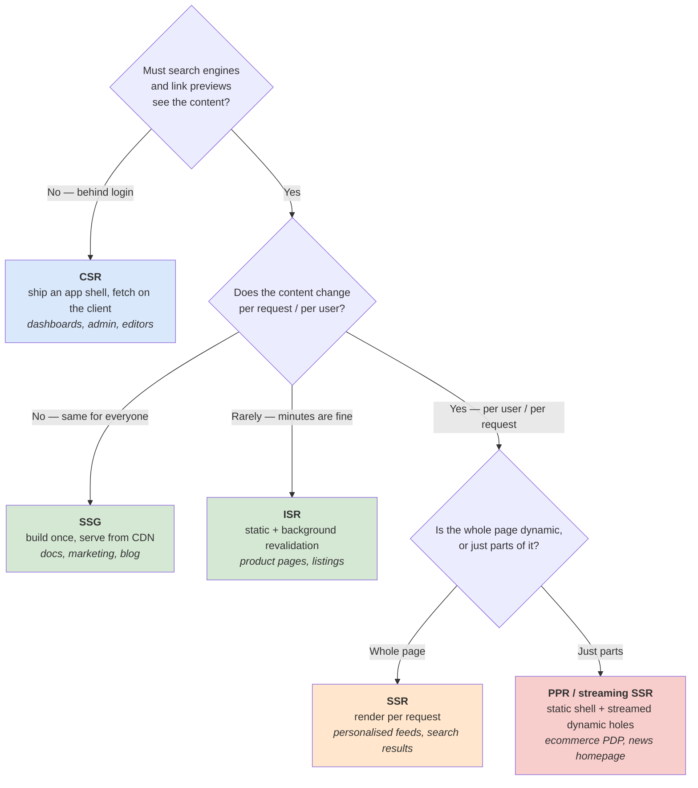
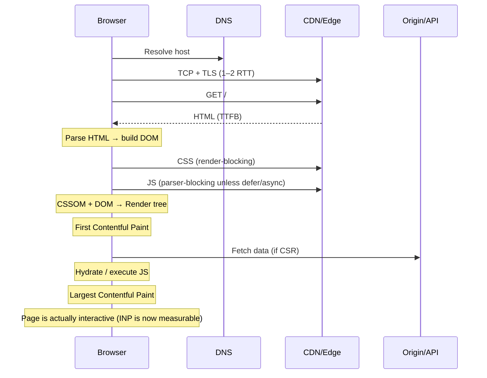
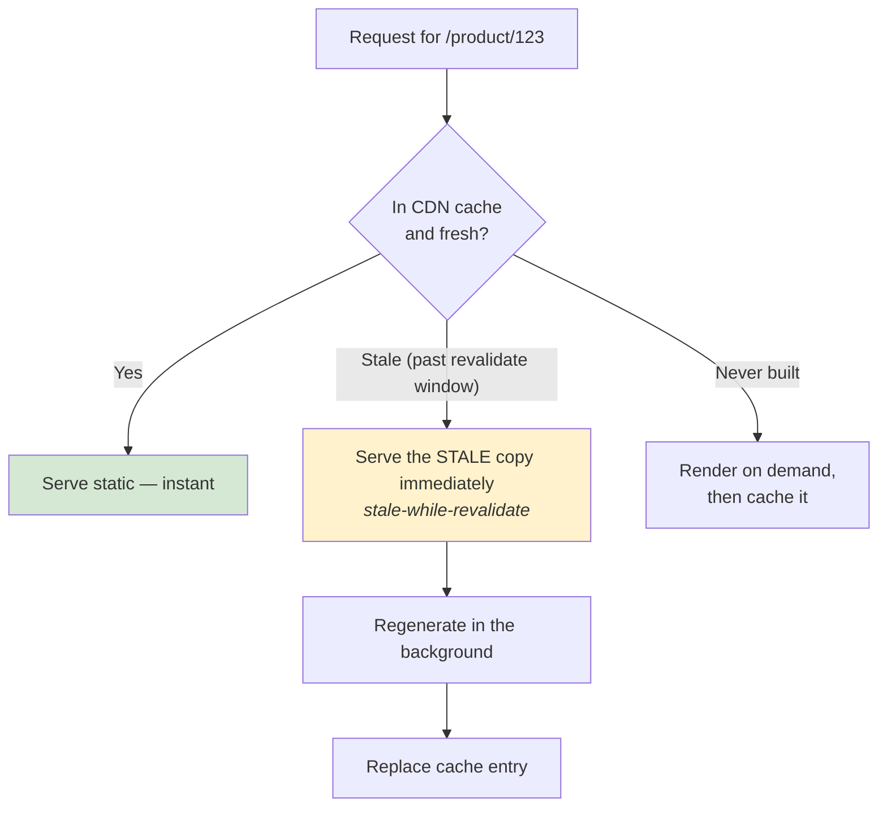
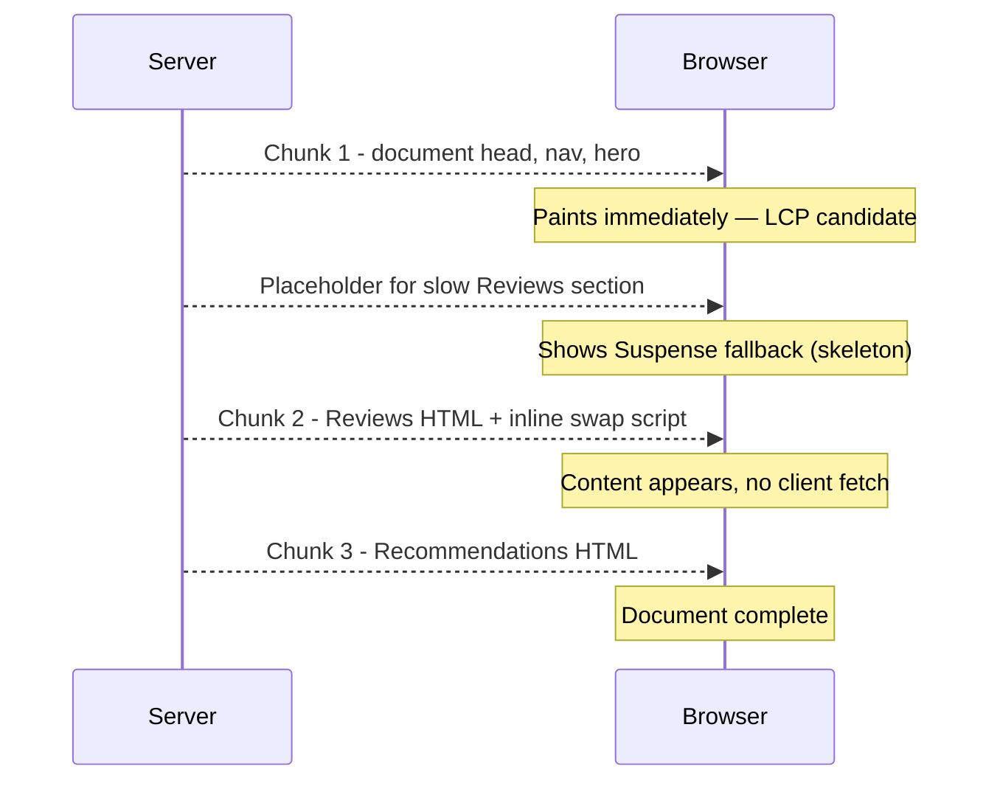
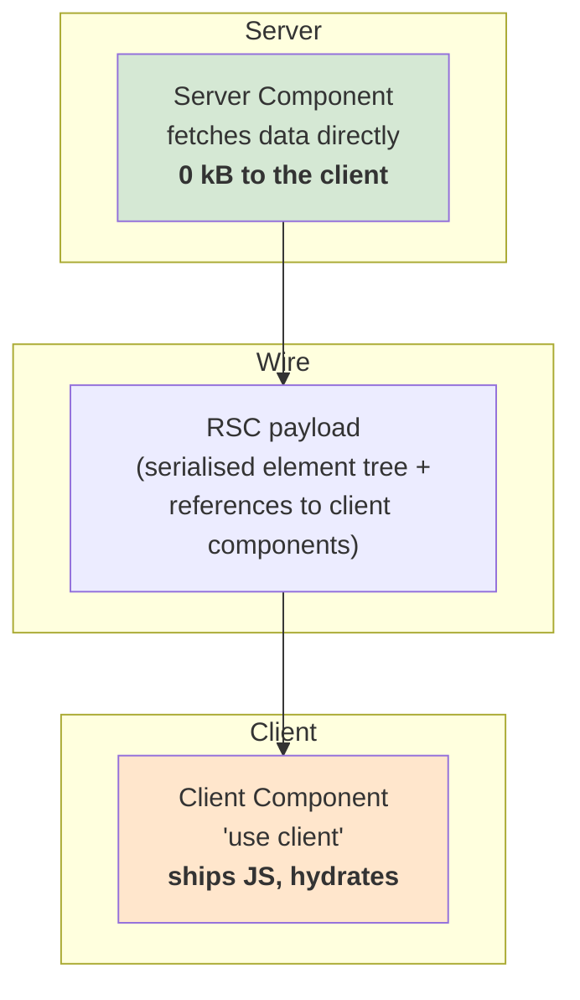
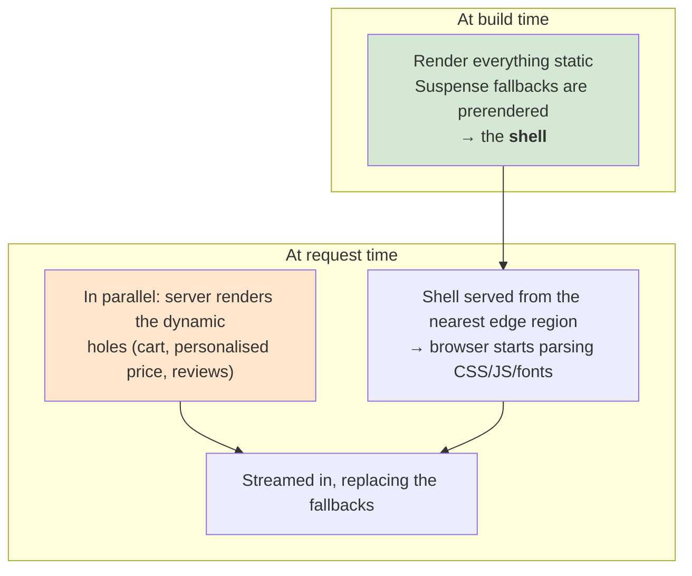
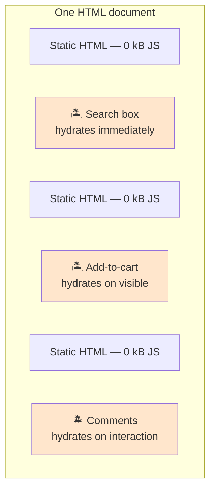

# 🎨 Frontend Rendering & Delivery

> **The single most consequential decision in a front-end design round.** Pick this wrong and every other answer inherits the mistake.
>
> Part of [Track E — Frontend System Design](frontend-system-design.md).

---

## Syllabus Coverage Index

| # | Topic | Section |
|---|---|---|
| 1 | The one decision tree | [§1](#1-the-decision-tree-draw-this-first) |
| 2 | What actually happens on a page load | [§2](#2-what-actually-happens-on-a-page-load) |
| 3 | **CSR** — client-side rendering | [§3](#3-csr--client-side-rendering) |
| 4 | **SSR** — server-side rendering | [§4](#4-ssr--server-side-rendering) |
| 5 | **SSG / ISR** — prerendered and incrementally revalidated | [§5](#5-ssg--isr--prerender-and-revalidate) |
| 6 | ⭐ **Hydration** — the expensive part nobody names | [§6](#6-hydration--the-expensive-part-nobody-names) |
| 7 | **Streaming SSR + Suspense** | [§7](#7-streaming-ssr--suspense) |
| 8 | **React Server Components** | [§8](#8-react-server-components-rsc) |
| 9 | **Partial prerendering (PPR)** — static shell + dynamic holes | [§9](#9-partial-prerendering-ppr) |
| 10 | **Islands** & progressive enhancement | [§10](#10-islands-architecture--progressive-enhancement) |
| 11 | SPA routing, prefetching & the CDN/edge layer | [§11](#11-routing-prefetching--the-edge) |
| 12 | SEO: what crawlers actually need | [§12](#12-seo--what-crawlers-actually-need) |
| ★ | Rapid-fire Q&A | [§13](#13-rapid-fire-qa) |
| ★ | 🏭 Real-world: Netflix, Vercel, Shopify | [frontend-company-case-studies.md](frontend-company-case-studies.md) |

---

## 1. The decision tree (draw this first)



> ⭐ **Say this:** *"This isn't an app-wide decision — it's per route. A marketing landing page, a logged-in dashboard, and a product page have three different right answers, and a modern framework lets me pick per route."*

### 1.1 The comparison table

| | **CSR** | **SSR** | **SSG** | **ISR** | **Streaming SSR / PPR** |
|---|---|---|---|---|---|
| **HTML generated** | In the browser | Per request, on a server | At build time | At build, refreshed in background | Shell at build, holes per request |
| **TTFB** | Fast (empty shell) | Slower (waits for data) | Fastest (CDN) | Fastest (CDN) | Fast (shell from CDN/edge) |
| **FCP / LCP** | Poor | Good | Best | Best | Best |
| **SEO** | Weak | Good | Best | Best | Good |
| **Personalisation** | Full | Full | None | None | Per-hole |
| **Server cost** | Lowest | Highest | Near zero | Low | Low–medium |
| **Data freshness** | Live | Live | Stale until rebuild | Bounded staleness | Live where it matters |
| **Cacheable at CDN** | The shell only | Hard | Trivially | Trivially | Shell yes, holes no |
| **Failure mode** | Blank screen if JS fails | Server load spike = slow everyone | Stale content | Stampede on revalidate | Complexity |

---

## 2. What actually happens on a page load

You must be able to narrate this. Most "why is it slow" answers are just *"which of these steps is on the critical path?"*



| Step | What blocks here | Lever |
|---|---|---|
| DNS + TCP + TLS | 1–3 RTTs before *any* byte | Preconnect, HTTP/2–3, fewer origins |
| **TTFB** | Server thinking time | Cache at the edge, stream early, SSG/ISR |
| CSS | **Render-blocking by default** | Inline critical CSS, `media` attribute, split by route |
| JS | Parser-blocking unless `defer`/`async`/`type=module` | Defer, split, delete |
| Data fetch | Waterfalls: JS → parse → fetch → render | Move the fetch to the server, or `preload`/parallelise |
| **Hydration** | Main thread blocked, page looks ready but isn't | Stream, defer, islands, RSC |

> ⚠️ **The waterfall trap in a CSR app:** HTML → JS bundle → parse → *then* the first data request even starts. That's three sequential round trips before the user sees content. Naming this is a strong signal.

---

## 3. CSR — client-side rendering

**Server sends a near-empty HTML shell; JavaScript builds the DOM.**

```html
<body>
  <div id="root"></div>
  <script src="/app.js"></script>
</body>
```

| ✅ Good for | ❌ Bad for |
|---|---|
| Apps behind a login (no SEO need) | Anything that must be crawled |
| Highly interactive tools — editors, dashboards, canvases | First-visit latency on slow devices |
| Sites where *subsequent navigation* speed dominates | Users on low-end Android / poor networks |
| Teams that want zero server render infrastructure | Pages where content **is** the product |

**Failure modes to name:**

- **Blank-screen dependency on JS** — one failed chunk (bad deploy, ad blocker, flaky network) = nothing renders. Mitigate with an error boundary at the root and a server-rendered fallback for critical pages.
- **The request waterfall** (§2).
- **Bundle growth is invisible** until someone measures it — add a CI budget ([frontend-performance.md](frontend-performance.md#7-performance-budgets--ci-enforcement)).

---

## 4. SSR — server-side rendering

**Server renders HTML per request; the browser paints immediately, then hydrates.**


| ✅ Buys you | ❌ Costs you |
|---|---|
| Fast FCP/LCP, crawlable HTML, rich link previews | A server (or edge runtime) you now have to run and scale |
| Personalised content in the first byte | **TTFB is now your server's latency + your API's latency** |
| Works with JS disabled/failed for read-only content | Two execution environments → `window is not defined` class of bugs |
| Data fetched server-side, closer to the API | Cannot be cached at the CDN without extra work |

**The three SSR-specific traps:**

1. **Hydration mismatch** — server HTML ≠ first client render (timestamps, `Math.random()`, `localStorage`, locale differences). React discards and re-renders, destroying the benefit. Fix: render deterministic markup; defer client-only bits to an effect.
2. **The "uncanny valley"** — the page *looks* done but nothing responds because hydration hasn't finished. This is the moment INP is worst. See [§6](#6-hydration--the-expensive-part-nobody-names).
3. **Origin becomes a bottleneck** — every request now costs CPU. A traffic spike that a CDN would have absorbed now hits your renderer. Mitigate with edge caching for anonymous traffic, and [load shedding](load-balancer.md#26-real-world-case-study--ubers-load-manager-static-rate-limits--priority-aware-shedding).

---

## 5. SSG / ISR — prerender and revalidate

**SSG:** render every page at **build time** → pure static files on a CDN. Fastest and cheapest thing on the web.

**Limit:** build time grows with page count, and content is frozen until the next deploy.

**ISR (Incremental Static Regeneration)** fixes both:



| Revalidation trigger | Use when |
|---|---|
| **Time-based** (`revalidate: 60`) | Content changes on a predictable cadence |
| **On-demand** (webhook from the CMS) | Editors need "publish now" semantics |
| **Tag-based** (invalidate everything tagged `product:123`) | One entity appears on many pages |

> ⭐ **Say this:** *"ISR is stale-while-revalidate applied to whole pages. The user never waits for a regeneration — they get the stale copy and the next visitor gets the fresh one. The trade is bounded staleness, which I'd size from how wrong the page can be before it hurts."*
>
> Same pattern as [soft TTL / hard TTL in caching.md](caching.md#9-ttl-time-to-live) — and the same failure mode: a **stampede** if many keys expire together. Jitter the revalidate windows.

---

## 6. Hydration — the expensive part nobody names

> **Hydration = the browser re-runs your entire component tree on top of server-rendered HTML to attach event handlers and rebuild client state.**

You pay for the UI **twice**: once as HTML bytes, once as JavaScript execution.


**Why it dominates INP on mid-range phones:** parse+compile+execute is CPU-bound, and a mid-range Android is roughly **4–6× slower** than a developer laptop. A bundle that hydrates in 300 ms on your machine can take 1.5 s+ on a real user's phone.

### The five ways to reduce it

| Technique | Mechanism | Trade-off |
|---|---|---|
| **Ship less JS** | Delete libraries; rewrite low-interactivity components in vanilla JS | Loses framework ergonomics — *this is exactly what Netflix did* |
| **Code split** | Only hydrate what's on screen / on this route | More requests; needs good boundaries |
| **Streaming + selective hydration** | React hydrates the parts the user interacts with first | Requires Suspense boundaries |
| **Islands** | Only interactive widgets hydrate; the rest stays static HTML | Cross-island state is awkward |
| **Server Components** | Non-interactive components **never ship JS at all** | New mental model, framework lock-in |

> ⭐ **The line that lands:** *"Server rendering doesn't remove the JavaScript cost — it moves the paint earlier and leaves the interactivity cost where it was. If I don't also cut hydration, I've just made the page look ready sooner while it's still frozen."*

---

## 7. Streaming SSR + Suspense

Instead of `renderToString` (wait for everything, send one blob), stream HTML in chunks as data resolves.



| Property | Effect |
|---|---|
| **TTFB decouples from the slowest query** | The shell ships before the data resolves |
| **Suspense boundary = a unit of streaming** | Whatever is inside can arrive late without blocking the rest |
| **Selective hydration** | React prioritises hydrating the component the user just clicked |
| **No client-side fetch waterfall** | The server does the fetching, adjacent to the API |

**Costs / gotchas:**

- You **cannot change HTTP status or headers** after the first byte is flushed — so error handling and redirects must happen *before* streaming starts.
- Some CDNs/proxies buffer responses and silently destroy streaming.
- A skeleton that shifts when real content lands is a **CLS** regression — reserve the space.

---

## 8. React Server Components (RSC)

**A component that runs only on the server and never ships its code to the browser.** Output is a serialised description of UI, not HTML and not a JS bundle.



| | Server Component | Client Component |
|---|---|---|
| Ships JS to the browser | **No** | Yes |
| Can use `useState` / effects / event handlers | No | Yes |
| Can query a DB / read secrets directly | Yes | No |
| Re-renders on interaction | No | Yes |
| Good for | Layout, content, data fetching, formatting | Anything the user touches |

**Why it matters for system design:** it changes the default. Instead of *"everything is client code, optimise some of it away"*, it becomes *"nothing is client code unless you opt in"*. Big dependencies used only for rendering (markdown parsers, date libraries, syntax highlighters) become **free** at the client.

**Costs to name:** a new serialisation boundary (props must be serialisable), framework coupling, harder debugging across two runtimes, and a genuinely different mental model for a whole team.

---

## 9. Partial prerendering (PPR)

> **Source:** Vercel — *[Partial prerendering: building towards a new default rendering model](https://vercel.com/blog/partial-prerendering-with-next-js-creating-a-new-default-rendering-model)* (Nov 2023).

The idea: stop choosing between static and dynamic **for the whole page**. Prerender a **static shell** with **holes**, serve the shell instantly from the edge, and stream the holes per request.



From the post:

> *"Next.js will prerender a static **shell** for each page of your application, leaving **holes** for the dynamic content… the client can start parsing scripts, stylesheets, fonts, and static markup while the server renders dynamic chunks."*

| Mechanism | Detail |
|---|---|
| **The boundary is `<Suspense>`** | *You* decide what's static by where you draw the boundary |
| **Static by default** | Everything is static until the code touches request data — cookies, headers — which is *"a clear signal that dynamic rendering is needed"* |
| **Minimal dynamic surface** | Next.js *"changes the smallest possible section of the page to be dynamic"* |
| **Shell is still ISR** | The static shell keeps on-demand, time-based and tag-based revalidation |

**The canonical example** — a product detail page where nearly everything is static, and only the cart count, personalised delivery estimate, reviews and below-the-fold recommendations stream in.

> ⭐ **Say this:** *"I'd avoid framing it as static *or* dynamic. Most pages are 90% the same for everyone with a few personalised fragments. I'd prerender the shell so it can be served from the edge, wrap each personalised fragment in a Suspense boundary, and stream those per request. That gives me CDN-speed LCP with per-user correctness — and the personalised parts are exactly the parts that shouldn't be cached anyway."*

---

## 10. Islands architecture & progressive enhancement

**Islands:** the page is static HTML; only specific interactive widgets ("islands") ship and hydrate JavaScript.



| Hydration strategy | When to use |
|---|---|
| `load` — immediately | Above-the-fold, always needed (search, nav) |
| `idle` — when the main thread is free | Nice-to-have interactions |
| `visible` — on `IntersectionObserver` | Below-the-fold widgets |
| `interaction` — on first hover/click | Heavy, rarely used widgets (comments, chat) |
| `media` — on a media query | Mobile-only or desktop-only components |

**Progressive enhancement is the underlying principle:** build the thing so it *works* as HTML + a form POST, then layer JS on top to make it nicer. It's not nostalgia — it's the cheapest possible resilience story, and it's why a `<form>` that works without JS is a genuinely senior answer to "what if the bundle fails to load?"

---

## 11. Routing, prefetching & the edge

### 11.1 Client-side routing

| Concern | What to say |
|---|---|
| **Why SPA routing** | No full document reload → preserved state, no re-parse of CSS/JS, instant transitions |
| **Cost** | You now own scroll restoration, focus management, `document.title`, and analytics page views — all of which the browser did for free |
| **A11y requirement** | On route change, **move focus to the new page's heading** and announce it in a live region. Without this, a screen-reader user has no idea anything happened |
| **Code splitting boundary** | The route is the natural split point |

### 11.2 Prefetching — the cheapest perceived-performance win

| Technique | Cost | Note |
|---|---|---|
| `<link rel="preconnect">` | ~0 | Warm DNS+TCP+TLS for a known third-party origin |
| `<link rel="preload">` | Bytes | For the **LCP image** or a critical font — high priority, use sparingly |
| `<link rel="prefetch">` | Bytes, idle priority | Next-page assets. *Hint only — the browser may ignore it* |
| Prefetch on **hover/viewport** | Bytes, well-targeted | The default in most modern routers |
| Speculation Rules API | Bytes + possible render | Prerender the next page entirely |

> **Netflix's measured result:** prefetching the HTML/CSS/JS for the *next* page while the user sat on the landing page reduced Time-to-Interactive for that next navigation by **30%** — with no rewrite of any JavaScript. See [frontend-company-case-studies.md](frontend-company-case-studies.md#2-netflix--shipping-less-javascript).

### 11.3 The edge layer

| Put at the edge | Keep at origin |
|---|---|
| Static assets, immutable + `max-age=31536000` | Anything needing a database transaction |
| Prerendered HTML shells | Long-running or memory-heavy rendering |
| Redirects, A/B bucketing, geo/locale routing | Secrets that can't live in edge config |
| Personalisation *headers* (not personalised HTML) | Anything requiring a warm connection pool |

**Cache-key discipline is the whole game:** if you personalise HTML, you have made it uncacheable. Either move personalisation into a streamed hole (§9) or into a client-side fetch, and keep the document cacheable.

---

## 12. SEO — what crawlers actually need

| Requirement | Mechanism |
|---|---|
| **Content in the initial HTML** | SSR/SSG/ISR. Modern crawlers do execute JS, but with a delay and a budget — don't gamble ranking on it |
| **Unique `<title>` + meta description per route** | Set them server-side, not in a `useEffect` |
| **Semantic structure** | One `<h1>`, meaningful heading order, real `<a href>` for links (not `onClick` on a `<div>`) |
| **Structured data** | JSON-LD in the document for rich results |
| **Canonical URLs** | Prevents duplicate-content dilution from query params |
| **`sitemap.xml` + `robots.txt`** | Discovery and crawl-budget control |
| **Social previews** | Open Graph / Twitter card tags — these crawlers usually **don't** run JS at all |
| **Core Web Vitals** | A ranking input — see [frontend-performance.md](frontend-performance.md) |

> ⚠️ **The honest caveat:** for a page behind authentication, none of this matters. Confirm SEO is a requirement before you let it drive your architecture — a candidate who SSRs an internal admin tool "for SEO" has revealed they're pattern-matching rather than reasoning.

---

## 13. Rapid-fire Q&A

| Question | Answer |
|---|---|
| **CSR vs SSR in one sentence each?** | CSR: the browser builds the DOM from JS — great for logged-in apps, bad for first paint and SEO. SSR: the server sends real HTML per request — great for first paint and SEO, costs you a server and a slower TTFB. |
| **Is SSR always faster?** | No. It improves FCP/LCP but **worsens TTFB** and doesn't reduce the JS you must still download and execute for interactivity. |
| **What is hydration?** | Re-running the component tree in the browser on top of server HTML to attach handlers and rebuild state. You pay for the UI twice. |
| **What causes a hydration mismatch?** | Non-deterministic render input: dates, random values, `localStorage`, `window`, locale/timezone differences. Fix by rendering deterministically and deferring client-only reads to an effect. |
| **What does streaming SSR buy you?** | TTFB stops depending on your slowest query; the shell paints while slow sections stream in behind Suspense boundaries, with no client fetch waterfall. |
| **What can you *not* do once streaming starts?** | Change the HTTP status code or headers — the first byte is already gone. Handle errors/redirects before flushing. |
| **What is ISR?** | Stale-while-revalidate for whole pages: serve the cached static page immediately, regenerate in the background, swap it in for the next visitor. |
| **How do you invalidate ISR precisely?** | Tag-based revalidation — invalidate everything tagged `product:123` rather than guessing time windows. |
| **What are React Server Components?** | Components that execute only on the server and ship **zero JavaScript**; they emit a serialised element tree that references client components for the interactive parts. |
| **What is partial prerendering?** | A prerendered static shell served from the edge with `<Suspense>`-shaped holes whose dynamic content streams in per request. Static by default, dynamic only where the code touches request data. |
| **What is islands architecture?** | Static HTML with independently hydrated interactive widgets, each with its own trigger (load/idle/visible/interaction). |
| **When is CSR the right answer?** | Behind a login, highly interactive, navigation speed matters more than first paint, and no crawler ever sees it. |
| **How do you make navigation feel instant?** | Prefetch the next route's assets on hover or viewport entry, keep the transition non-blocking, and render an optimistic/skeleton state. Netflix got 30% off TTI this way. |
| **What breaks when you adopt client-side routing?** | Scroll restoration, focus management, page titles and analytics — all of which the browser handled for you. Focus management is an accessibility bug, not a nicety. |
| **How do you keep a personalised page cacheable?** | Keep the document generic and move personalisation into a streamed hole or a client fetch. The moment the HTML varies per user, the CDN stops helping. |
