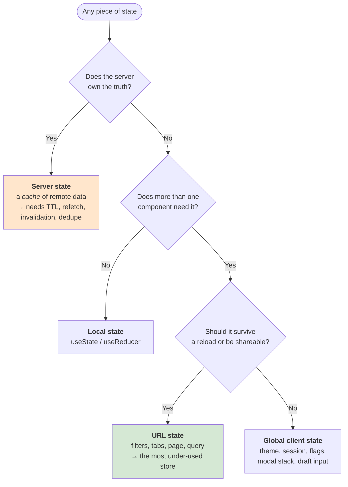
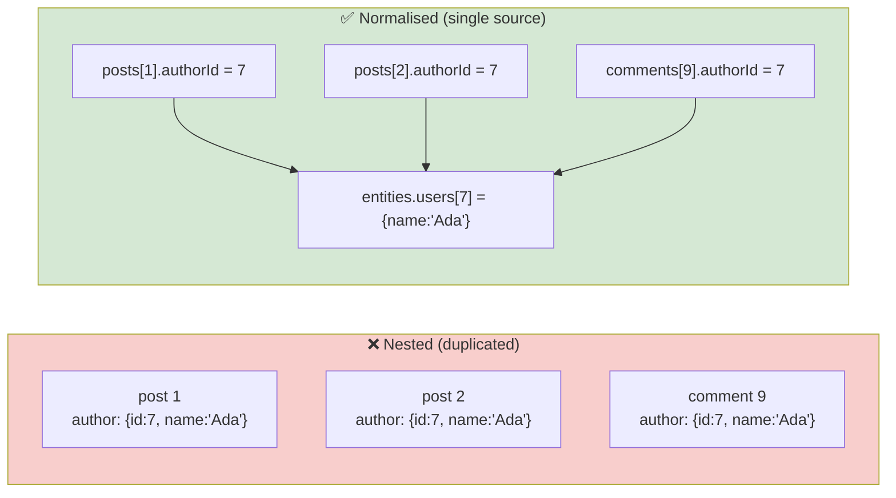
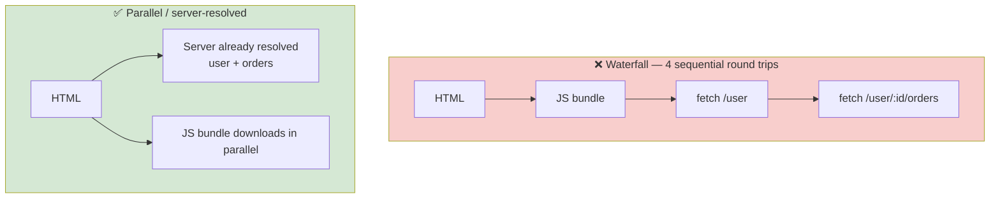
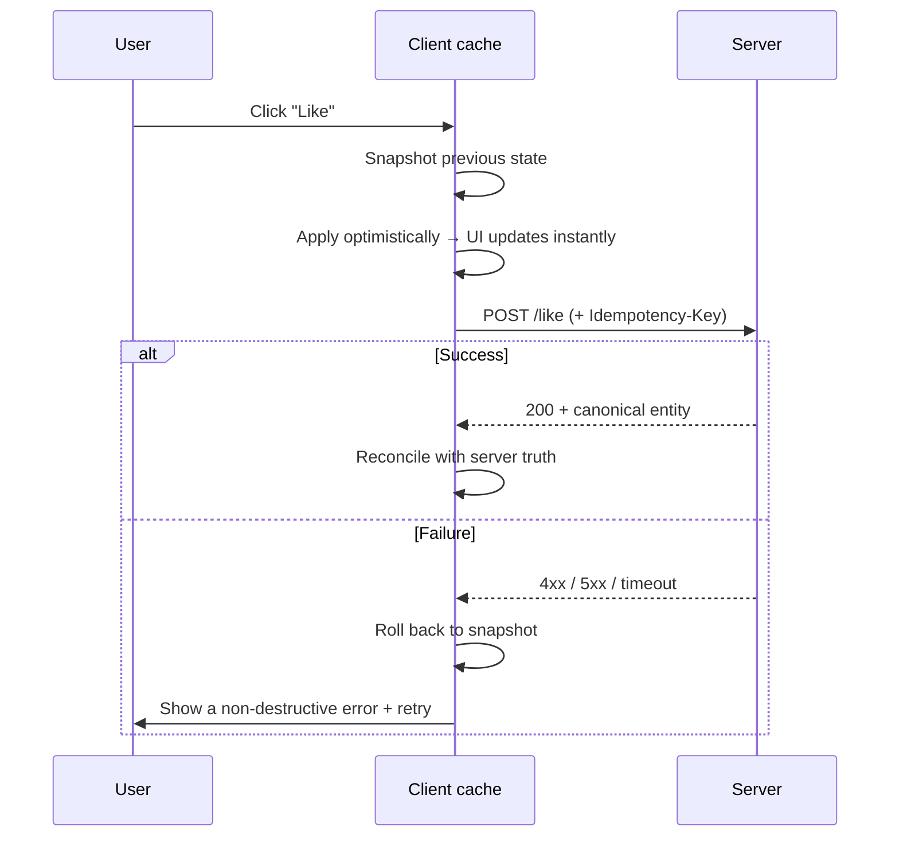
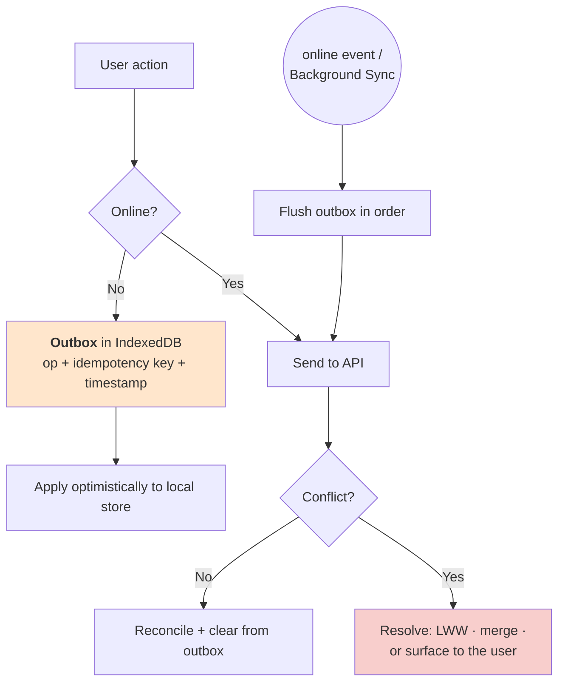

# 🗃️ Frontend State & Data

> **The one idea that reorganises everything:** most "state management" pain comes from treating **server state** (a cached copy of someone else's data) and **client state** (something only this browser knows) as the same problem. They are not.
>
> Part of [Track E — Frontend System Design](frontend-system-design.md).

---

## Syllabus Coverage Index

| # | Topic | Section |
|---|---|---|
| 1 | ⭐ **Server state vs client state** — the taxonomy | [§1](#1-the-state-taxonomy-say-this-before-you-name-a-library) |
| 2 | Where state should live (the placement ladder) | [§2](#2-where-should-this-state-live) |
| 3 | **Normalisation** — and the update anomaly that forces it | [§3](#3-normalisation) |
| 4 | Client-side caching & invalidation | [§4](#4-client-side-caching--invalidation) |
| 5 | Data fetching patterns, waterfalls & race conditions | [§5](#5-data-fetching-waterfalls-dedupe-and-races) |
| 6 | **Pagination & infinite scroll** | [§6](#6-pagination--infinite-scroll) |
| 7 | ⭐ **Optimistic updates** & rollback | [§7](#7-optimistic-updates) |
| 8 | Forms: controlled vs uncontrolled, validation, autosave | [§8](#8-forms) |
| 9 | **Offline-first**: service worker, IndexedDB, outbox | [§9](#9-offline-first) |
| 10 | Multi-tab & cross-context sync | [§10](#10-multi-tab-sync) |
| 11 | Storage choices & security | [§11](#11-storage-choices--security) |
| ★ | Rapid-fire Q&A | [§12](#12-rapid-fire-qa) |

---

## 1. The state taxonomy (say this before you name a library)



| Kind | Examples | Right tool | Wrong tool |
|---|---|---|---|
| **Server state** | Products, feed items, user profile, search results | A request cache: React Query / SWR / Apollo / RTK Query | Redux slices hand-written per endpoint |
| **URL state** | Page number, filters, sort, selected tab, search term | The router / `URLSearchParams` | A global store (breaks share, back, refresh) |
| **Global client state** | Theme, auth session, feature flags, toasts | Context / Zustand / Redux — **small** | Anything the server owns |
| **Local state** | Input value, hover, "is this accordion open" | `useState` | Lifting it to global "just in case" |
| **Derived state** | `total = items.reduce(...)`, filtered lists | **Compute it**, memoise if measured to be hot | Storing it (guaranteed to go stale) |
| **Ephemeral/transport state** | In-flight request, socket connection status | The data layer | Component state scattered everywhere |

> ⭐ **Say this:** *"Before picking a library I'd split the state. Most of what people put in Redux is server state — a cache of someone else's data — and it needs caching semantics: staleness, refetch, deduplication, invalidation. A dedicated server-cache library gives me those for free. What's left over is genuinely local UI state, and it's usually small enough that a global store is overkill."*

**The two biggest wins from this split:**

1. **Loading and error states stop being hand-rolled per screen.** They become a property of the cache entry.
2. **The "stale data on a second visit" bug disappears** — because staleness is now an explicit, configured concept rather than an accident.

---

## 2. Where should this state live?

Climb this ladder, and stop at the first rung that works:

| # | Location | Use when |
|---|---|---|
| 1 | **Derived — don't store it** | It's computable from something you already have |
| 2 | **Component local** | Only this component cares |
| 3 | **Lifted to nearest common parent** | Two siblings need it |
| 4 | **URL** | It should be shareable, bookmarkable, back-button-able |
| 5 | **Server-state cache** | The server owns it |
| 6 | **Global client store** | Genuinely cross-cutting and client-owned |
| 7 | **Persisted (localStorage / IndexedDB)** | It must survive a reload or work offline |

> ⚠️ **Prop drilling is not automatically a problem.** Three levels of props is fine and explicit. Reaching for Context at the first sign of drilling creates re-render storms, because **every consumer re-renders when any part of the context value changes**. Split contexts by update frequency, or use a store with selector-based subscriptions.

---

## 3. Normalisation

**The anomaly that motivates it:** the same `User` appears in a post, in a comment, and in a sidebar. Someone edits their name. In a nested cache you now have three copies and two of them are wrong.



```js
// Normalised shape
{
  entities: {
    users:    { 7: { id: 7, name: 'Ada' } },
    posts:    { 1: { id: 1, authorId: 7, body: '…', commentIds: [9] } },
    comments: { 9: { id: 9, authorId: 7, text: '…' } }
  },
  // Queries reference IDs, never embed objects
  queries: { 'feed:cursor=null': { ids: [1, 2], nextCursor: 'abc' } }
}
```

| Normalise when | Don't bother when |
|---|---|
| The same entity appears in multiple views | Each screen fetches an independent, disjoint blob |
| Mutations must reflect everywhere instantly | The list is read-only |
| You have realtime updates arriving by entity ID | The app is small and refetching is cheap |
| Memory matters (long-lived tabs, big lists) | You'd be adding a normaliser for three screens |

> **This is the client-side twin of database normalisation** ([databases.md §3](databases.md#3-sql-vs-nosql)) — and it has the same trade-off: writes get simpler and safer, reads need a join (a selector) to reassemble the view model.

---

## 4. Client-side caching & invalidation

Every technique in [caching.md](caching.md) applies here, just with a browser-shaped vocabulary.

| Concept | Browser equivalent |
|---|---|
| Cache key | The **query key**: `['products', { category, page }]` — serialise *all* inputs or you'll serve one filter's data for another |
| TTL / staleness | `staleTime` — how long before it's considered stale (still served) |
| Eviction | `gcTime` / `cacheTime` — how long an unused entry survives before removal |
| Stale-while-revalidate | Show cached data instantly, refetch in the background, swap in |
| Invalidation | After a mutation, invalidate by key or **tag** and refetch |
| Stampede | Request **deduplication** — N components asking for the same key produce one request |
| Negative caching | Cache the 404 so a broken ID doesn't hammer the API |
| Warm cache | Prefetch on hover/route-prefetch so the next screen is instant |

**Refetch triggers to configure deliberately:**

| Trigger | Good default |
|---|---|
| On mount | Yes, if stale |
| On window focus | Yes for dashboards, **no** for a form the user is filling in |
| On network reconnect | Almost always yes |
| On interval | Only for genuinely live data — and prefer a socket ([frontend-realtime-collab.md](frontend-realtime-collab.md)) |

**After a mutation — three strategies:**

| Strategy | Round trips | Correctness | Use when |
|---|---|---|---|
| **Invalidate + refetch** | 2 | Highest | Default. Simple and always right |
| **Write the server response into the cache** | 1 | High | The mutation returns the full updated entity |
| **Optimistic update** | 1 (+rollback path) | Needs care | The interaction must feel instant ([§7](#7-optimistic-updates)) |

---

## 5. Data fetching: waterfalls, dedupe, and races

### 5.1 The waterfall



| Fix | Mechanism |
|---|---|
| **Move fetching to the server** | SSR / RSC — the server is next to the API, so N hops cost microseconds not RTTs |
| **A BFF that returns one screen-shaped payload** | One round trip instead of five; also lets you drop fields the client never uses |
| **Render-as-you-fetch** | Start the request in the router *before* the component renders, not in an effect after it |
| **Parallelise independent requests** | `Promise.all`, or sibling Suspense boundaries |
| **`preload` / route prefetch** | Start the work during idle time on the previous screen |

> ⚠️ **Fetch-on-render is the default trap:** component mounts → effect runs → request starts. Every nesting level adds a round trip. Naming "render-as-you-fetch" as the fix is a strong signal.

### 5.2 Race conditions on fast input

The classic autocomplete bug: you type `re`, then `react`. The `re` response arrives **after** the `react` response and overwrites it.

| Fix | Note |
|---|---|
| **`AbortController`** — cancel the previous request | The correct fix; also stops wasted bandwidth |
| **Sequence/latest-request token** — ignore responses that aren't for the current query | Works when cancellation isn't available |
| **Key the cache by the query string** | The result for `re` simply isn't the result for `react`, so it can't overwrite it |
| **Debounce** (~200–300 ms) | Reduces how often the race can occur — but **is not** a correctness fix on its own |

**Debounce vs throttle — get this right:**

| | Debounce | Throttle |
|---|---|---|
| Behaviour | Wait until the user *stops* | At most once per N ms |
| Use for | Search-as-you-type, autosave, resize-complete | Scroll handlers, cursor broadcast, rate-limited APIs |

---

## 6. Pagination & infinite scroll

| | **Offset** (`?page=3&limit=20`) | **Cursor / keyset** (`?after=eyJpZCI6MTIzfQ`) |
|---|---|---|
| Backend cost | `OFFSET` still reads and discards skipped rows | Index seek — constant |
| Correctness while data changes | ❌ Items shift between pages → **duplicates and skips** | ✅ Stable |
| Jump to page 57 | ✅ Trivial | ❌ Not supported |
| Right for | Admin tables with page numbers | **Feeds and infinite scroll** |

> Same reasoning as [rest-api.md §5](rest-api.md#5-pagination-done-properly). The front-end-specific point: **infinite scroll on offset pagination is a guaranteed duplicate-items bug** the moment anyone posts while the user is scrolling.

**Infinite scroll implementation checklist:**

- `IntersectionObserver` sentinel below the last item — not a scroll handler
- Deduplicate by ID on append (the network will retry, and the server will occasionally overlap)
- Guard against firing while a page is already in flight
- Virtualise once the list exceeds a few hundred rows ([frontend-performance.md §9](frontend-performance.md#9-list-virtualisation))
- **Persist scroll position and the loaded pages** for back-navigation, or the user loses their place — the single most common infinite-scroll complaint
- Always provide a **"Load more" button fallback**: it's keyboard-accessible, it's testable, and it doesn't trap keyboard users away from the footer
- Give the footer somewhere to live — infinite scroll and a footer are mutually exclusive

---

## 7. Optimistic updates

**Apply the change locally before the server confirms; roll back if it fails.**



| Requirement | Why |
|---|---|
| **Snapshot before mutating** | You need something to roll back *to* |
| **Cancel in-flight refetches for that key** | Otherwise a stale server response overwrites your optimistic value |
| **Reconcile with the server's response** | The server may normalise, clamp, or enrich the value |
| **Idempotency key on the request** | A retry after a timeout must not double-apply — [rest-api.md §8](rest-api.md#8-idempotency-keys-the-most-important-api-pattern) |
| **A version on the entity** | Lets you detect that someone else changed it meanwhile |

**When *not* to be optimistic:**

| Case | Why |
|---|---|
| Payments, transfers, irreversible deletes | A rollback after the user believed it succeeded is worse than a spinner |
| The server applies non-trivial logic you can't replicate | Your prediction will visibly disagree |
| Failure is common (flaky endpoint, strict validation) | Constant flicker-and-revert destroys trust |

> ⭐ **Say this:** *"Optimistic UI is a bet that the server will agree with you. I'd take that bet for likes, toggles, reordering and drafts, where a rollback is cheap and rare. I wouldn't take it for anything the user would describe as 'money moved' — there a 400 ms spinner is a feature, not a flaw."*

**The multi-tab / concurrent-edit version of the same problem** is exactly what Figma solved: apply the local change immediately, but **discard incoming server changes that conflict with your own unacknowledged change** — otherwise the UI *flickers* as an older acknowledged value briefly overwrites your newer unacknowledged one. See [frontend-realtime-collab.md §7](frontend-realtime-collab.md#7-figmas-model-crdt-inspired-not-a-crdt).

---

## 8. Forms

| Decision | Guidance |
|---|---|
| **Controlled vs uncontrolled** | Controlled = React owns the value (easy validation, re-renders on every keystroke). Uncontrolled = the DOM owns it (fast, fewer renders). For big forms, uncontrolled + validate-on-submit is measurably faster |
| **Validation timing** | Validate on **blur**, revalidate on **change** *after* the first error. Validating on every keystroke from the start is hostile |
| **Client + server validation** | Client validation is UX. **Server validation is the security boundary** — never trust the client ([rest-api.md §13](rest-api.md#13-api-security-owasp)) |
| **Error presentation** | Inline, next to the field, tied by `aria-describedby`, with `aria-invalid`; move focus to the first error on submit and summarise in a live region |
| **Autosave** | Debounce ~1 s, show an explicit "Saving… / Saved / Failed" indicator, queue while offline |
| **Multi-step wizards** | Keep step state in the **URL** so refresh and back work; persist a draft to `localStorage` |
| **Double submission** | Disable on submit **and** send an idempotency key — the disable is UX, the key is correctness |
| **Unsaved-changes guard** | `beforeunload` for hard navigation + a router block for soft navigation |
| **File uploads** | Chunk large files, show real progress from `XMLHttpRequest`/`fetch` streams, support resume, validate type/size client-side *and* server-side |

---

## 9. Offline-first



| Layer | Role |
|---|---|
| **Service worker** | Intercepts requests. Cache-first for static assets, network-first (with cache fallback) for API data, and an offline fallback page |
| **Cache Storage API** | Stores the app shell and static responses |
| **IndexedDB** | Stores structured data and the outbox. It's the only browser store with real capacity and transactions |
| **Background Sync** | Lets the browser flush the outbox after the tab closes |
| **`navigator.onLine` + `online`/`offline` events** | Coarse signal — treat it as a hint, not truth; a failed request is the real signal |

**Conflict resolution — pick and *state* your policy:**

| Policy | When it's acceptable |
|---|---|
| **Last-writer-wins** | Independent fields, low collision probability, cheap to be wrong |
| **Server-wins** | Server holds authoritative business logic (pricing, inventory) |
| **Merge by field** | Different users touch different properties of the same object — Figma's model |
| **Surface to the user** | Genuinely irreconcilable and important (a document body, a booking) |

> ⚠️ **The three things people forget:** (1) a service worker can serve a stale app shell forever — version it and prompt for reload; (2) an outbox must be **ordered and idempotent** or replays corrupt state; (3) you must design what the UI looks like when data is *known stale* — a subtle banner beats silently lying.

---

## 10. Multi-tab sync

Three tabs of the same app is a tiny distributed system.

| Mechanism | Use for |
|---|---|
| **`BroadcastChannel`** | Post "the user logged out" / "invalidate key X" to all tabs |
| **`storage` event** | Fires in *other* tabs when `localStorage` changes — the legacy-compatible version |
| **Refetch on window focus** | Cheapest 80% solution: the tab you're looking at is the one that must be right |
| **Web Locks API** | Elect **one** leader tab to own the WebSocket / polling, and fan out to the others |
| **Shared Worker** | One connection shared by all tabs (limited Safari support) |

> ⭐ **Say this:** *"With N tabs open I don't want N WebSocket connections. I'd elect a leader tab with the Web Locks API, have it own the single connection, and broadcast updates to the other tabs over BroadcastChannel. The fallback if leader election isn't available is refetch-on-focus, which is good enough for most apps."*

---

## 11. Storage choices & security

| Store | Capacity | Persistence | Sync/async | Good for |
|---|---|---|---|---|
| **`localStorage`** | ~5 MB | Until cleared | **Synchronous — blocks the main thread** | Small prefs, feature flags |
| **`sessionStorage`** | ~5 MB | Per tab | Synchronous | Wizard step, one-off redirect state |
| **Cookies** | ~4 KB | Configurable | Sent with **every** request | Auth tokens (`HttpOnly`), server-readable prefs |
| **IndexedDB** | Large (quota-based) | Until cleared | Async, transactional | Offline data, outbox, big caches |
| **Cache Storage** | Large | Until cleared | Async | Service-worker managed HTTP responses |
| **In-memory** | RAM | Until reload | Sync | Everything that doesn't need to survive |

### 11.1 The auth-token question (this comes up constantly)

| Option | XSS risk | CSRF risk | Verdict |
|---|---|---|---|
| `localStorage` | ❌ **Readable by any injected script** | Low | Convenient, and the reason many token thefts happen |
| **`HttpOnly; Secure; SameSite=Lax/Strict` cookie** | ✅ Not readable by JS | Needs CSRF protection | **The safer default** |
| In-memory + refresh cookie | ✅ Best | Handled by the cookie flags | Best, most work |

> ⭐ **Say this:** *"I'd keep the access token in memory and the refresh token in an `HttpOnly`, `Secure`, `SameSite` cookie. Putting a token in `localStorage` means any successful XSS — including from a compromised npm dependency — is a full account takeover, and 'we'll just prevent XSS' isn't a control."*

> 📘 **Backend counterpart:** cookie attributes, session vs JWT, refresh-token rotation and the BFF pattern → [stateless-services-sessions-tokens.md](stateless-services-sessions-tokens.md)

### 11.2 The rest of the front-end security checklist

| Risk | Control |
|---|---|
| **XSS** | Never `dangerouslySetInnerHTML` with untrusted input; sanitise (DOMPurify) if you must; a strict **CSP** with nonces as defence-in-depth |
| **CSRF** | `SameSite` cookies + an anti-CSRF token for state-changing requests |
| **Clickjacking** | `X-Frame-Options` / `frame-ancestors` in CSP |
| **Dependency supply chain** | Lockfiles, `npm audit`/Dependabot, and *"more third-party libraries increases the surface area of supply chain attacks"* — [Shopify's own words](frontend-company-case-studies.md#3-shopify--one-codebase-three-platforms) |
| **Secrets in the bundle** | Anything in client JS is public. `NEXT_PUBLIC_`-style prefixes exist to make that explicit |
| **Sensitive data at rest** | Don't persist PII to `localStorage`/IndexedDB on shared devices |

---

## 12. Rapid-fire Q&A

| Question | Answer |
|---|---|
| **How do you decide where state lives?** | Derive it if you can; otherwise local → lifted → URL → server-state cache → global store → persisted. Stop at the first rung that works. |
| **Server state vs client state?** | Server state is a **cache** of data the server owns and needs TTL, refetch, dedupe and invalidation. Client state is owned by this browser. Using one tool for both is why Redux codebases get bloated. |
| **What belongs in the URL?** | Filters, sort, page, tab, search query — anything that should survive refresh, be shareable, and work with the back button. |
| **Why normalise the client cache?** | So one entity has one copy. Otherwise editing a user leaves stale duplicates in every list that embedded them. |
| **What's a good cache key?** | A serialisation of **every** input to the request. Miss one filter and you'll serve one query's results for another. |
| **What is stale-while-revalidate on the client?** | Render the cached value immediately, refetch in the background, swap in the fresh result. Instant UI with bounded staleness. |
| **How do you invalidate after a mutation?** | Invalidate by key or tag and refetch; or write the mutation's returned entity straight into the cache to save a round trip. |
| **What's a fetch waterfall and how do you fix it?** | Sequential dependent requests caused by fetch-on-render. Fix with render-as-you-fetch, parallel requests, a BFF that returns one screen-shaped payload, or server-side fetching. |
| **Autocomplete returns results out of order. Fix?** | `AbortController` to cancel superseded requests, plus keying the cache by the query so an old response can't overwrite a newer one. Debounce reduces frequency but isn't a correctness fix. |
| **Debounce vs throttle?** | Debounce fires after the user stops (search, autosave). Throttle fires at most once per interval (scroll, cursor broadcast). |
| **Offset or cursor pagination for a feed?** | Cursor. Offset shifts items when new content is inserted, producing duplicates and skips — fatal for infinite scroll. |
| **What does infinite scroll break?** | Back-navigation scroll position, the footer, keyboard access, and deep-linking. Always ship a "Load more" fallback and restore scroll state. |
| **How do optimistic updates work safely?** | Snapshot → apply → cancel competing refetches → send with an idempotency key → reconcile with the server response → roll back on failure. |
| **When would you avoid optimistic UI?** | Payments, irreversible actions, or any endpoint where failure is common — a rollback after apparent success is worse than a spinner. |
| **How do you build offline support?** | Service worker for assets + IndexedDB for data + an **ordered, idempotent outbox** flushed on reconnect, with an explicit conflict-resolution policy and a "stale data" indicator. |
| **How do you sync state across tabs?** | Refetch on focus for the simple case; `BroadcastChannel` for events like logout; Web Locks to elect a single leader tab that owns the WebSocket. |
| **Where do you store the auth token?** | Access token in memory, refresh token in an `HttpOnly; Secure; SameSite` cookie. `localStorage` turns any XSS into account takeover. |
| **Is client-side validation enough?** | No. It's UX only. The server is the security boundary and must revalidate everything. |
