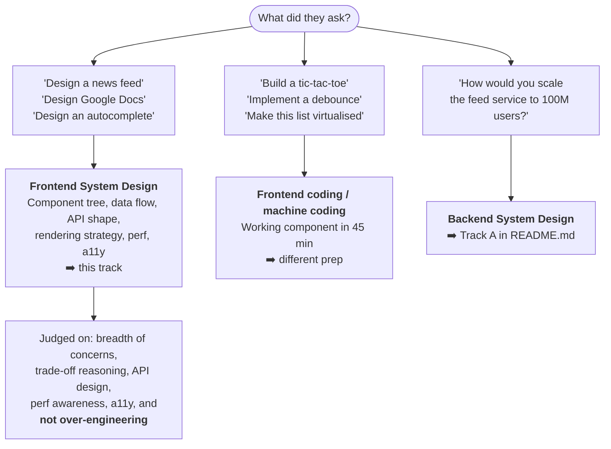
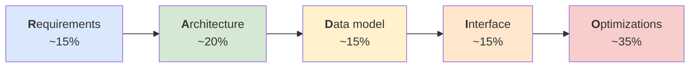
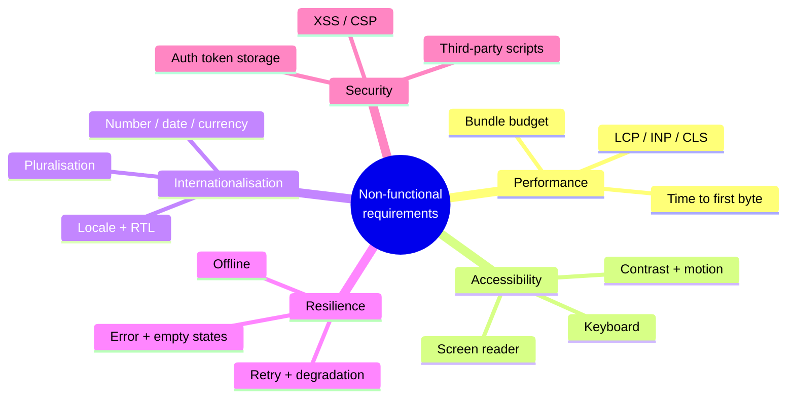
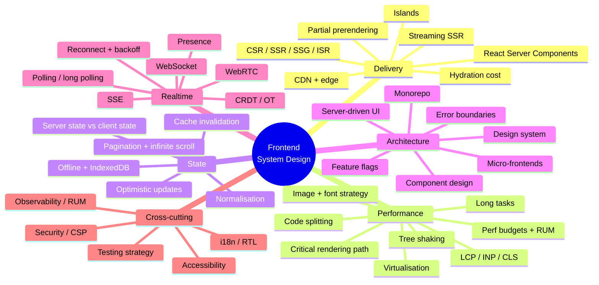
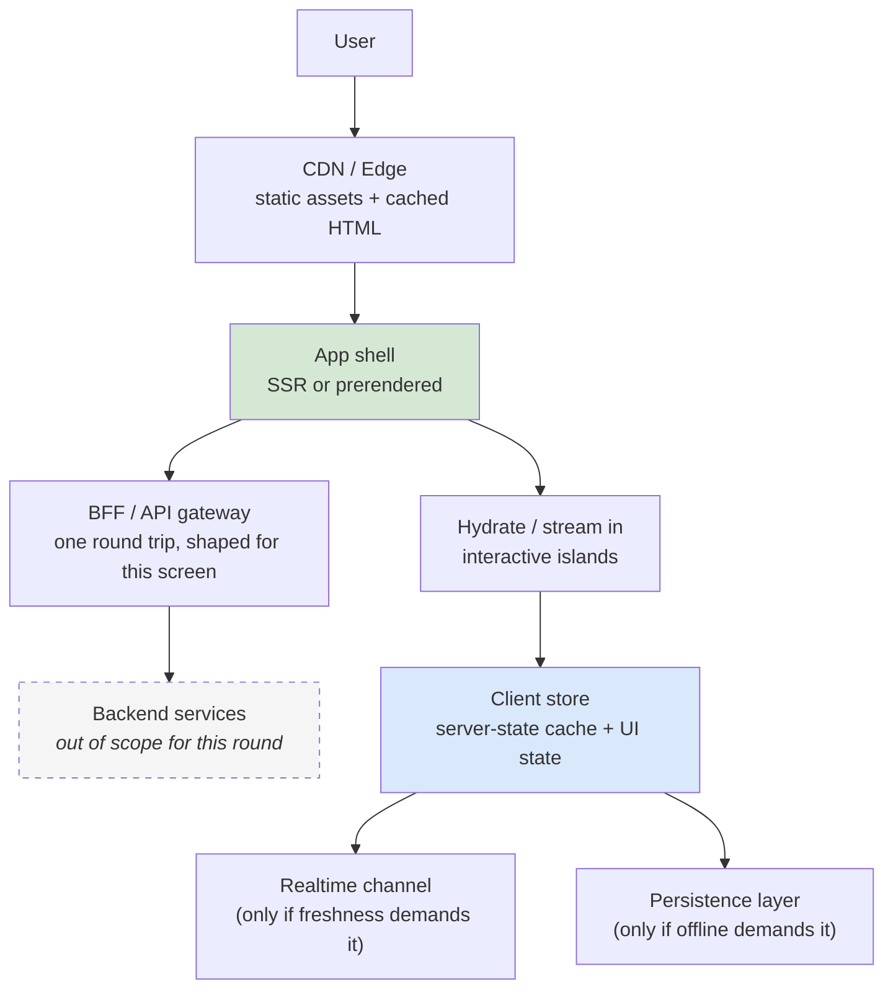

# 🖥️ Frontend System Design — Master Hub

> **What this is:** the front-end counterpart to [README.md](README.md). Backend system design asks *"how do we scale the servers?"*. Front-end system design asks *"how do we deliver, render, hydrate, cache, and keep in sync a UI that runs on someone else's phone, on a bad network, on a CPU we don't control?"*
>
> **House style, same as the rest of the repo:** *concept → diagram → concrete example → failure mode → what to say in the interview.*
>
> **Curated from real engineering blogs:** Airbnb · Netflix · Shopify · Figma · Discord · Vercel · Uber — plus the **RADIO** framework (GreatFrontEnd) and architecture-essay material in the *frontend at scale* tradition. All company claims are sourced in [frontend-company-case-studies.md](frontend-company-case-studies.md).

---

## Syllabus Coverage Index

| # | Topic | File |
|---|---|---|
| **E0** | **The framework (RADIO), scoring rubric, concept map, cheat sheet** | **this file** |
| **E1** | Rendering & delivery: CSR · SSR · SSG · ISR · streaming · RSC · PPR · islands · hydration | [frontend-rendering.md](frontend-rendering.md) |
| **E2** | Performance: Core Web Vitals, critical path, bundles, images, fonts, long tasks, budgets | [frontend-performance.md](frontend-performance.md) |
| **E3** | State & data: client vs server state, normalization, caching, optimistic UI, pagination, offline | [frontend-state-data.md](frontend-state-data.md) |
| **E4** | Architecture: components, design systems, micro-frontends, monorepos, SDUI, a11y, i18n | [frontend-architecture.md](frontend-architecture.md) |
| **E5** | Realtime & collaboration: polling → SSE → WebSocket → WebRTC, presence, CRDT/OT | [frontend-realtime-collab.md](frontend-realtime-collab.md) |
| **E6** | **Company case studies** — Airbnb, Netflix, Shopify, Figma, Discord, Vercel, Uber | [frontend-company-case-studies.md](frontend-company-case-studies.md) |
| **E7** | **The interview** — RADIO worked end-to-end on 14 classic problems | [frontend-interview-playbook.md](frontend-interview-playbook.md) |

---

## 0. Is this even a front-end system design round?

> ⚠️ **The #1 mistake:** treating it as a backend round. If you spend 20 minutes on database sharding in a *front-end* interview, you have failed the round — even if the sharding was correct. Your scope is **the browser, the network edge, and the API contract**.

---

## 1. RADIO — the framework to run every question through

> The de-facto standard front-end system design framework (popularised by **GreatFrontEnd**). Use it out loud; announce each letter as you move.

| Letter | You produce | Time (45-min round) | The question to ask |
|---|---|---|---|
| **R — Requirements** | Functional + non-functional scope, explicitly agreed | 5–8 min | *"Who uses this, on what device, on what network, and what must it do offline?"* |
| **A — Architecture** | A component diagram + where each responsibility lives | 8–10 min | *"What are the boxes, and which one owns the data?"* |
| **D — Data model** | Client-side entities: server state vs client state | 5–7 min | *"What is derived, what is stored, and what is normalised?"* |
| **I — Interface** | API contract (endpoint/GraphQL shape) **and** component props/events | 5–7 min | *"What crosses the network, and what crosses the component boundary?"* |
| **O — Optimizations** | Perf, network, a11y, i18n, security, error/empty states | **15+ min — the biggest bucket** | *"What breaks at 10× scale, on 3G, on a screen reader?"* |

> ⭐ **Say this at the start:** *"I'll use RADIO — requirements, architecture, data model, interface, then optimisations. I'll spend the most time on optimisations since that's where the front-end-specific depth is. Stop me if you'd rather go deeper somewhere else."*

### 1.1 The R checklist — never skip this

| Dimension | Ask |
|---|---|
| **Users & devices** | Mobile-first? Low-end Android? Desktop dashboard? TV? |
| **Network** | 3G/flaky? Offline capable? Data-cost sensitive markets? |
| **Scale of the UI** | 20 items or 200,000? Any infinite list? Any canvas? |
| **Freshness** | Realtime, near-real-time, or "refresh on navigate"? |
| **SEO** | Public + crawlable, or behind a login? *This single answer picks your rendering strategy.* |
| **i18n / RTL** | How many locales? Any right-to-left? |
| **Accessibility** | WCAG level? Keyboard-only? Screen readers? |
| **Browser support** | Evergreen only, or legacy? Changes your whole toolchain budget |
| **Team/org** | One team or twenty? *This is what decides micro-frontends, not "scale"* |

### 1.2 The non-functional five you should always name

---

## 2. The 30-concept map

---

## 3. Cheat sheet — pick the right tool

| If the interviewer says… | Reach for | Read |
|---|---|---|
| "it must rank on Google" | SSR or SSG + semantic HTML + metadata | [E1](frontend-rendering.md) |
| "the page feels slow to load" | Reduce JS, split bundles, SSR the shell, preload the LCP image | [E2](frontend-performance.md) · [E1](frontend-rendering.md) |
| "the page feels slow to **click**" | INP: break up long tasks, defer hydration, virtualise, `useTransition` | [E2](frontend-performance.md) |
| "the list has 100,000 rows" | **Windowing/virtualisation** + stable keys + fixed-height estimates | [E2](frontend-performance.md) |
| "layout jumps around" | CLS: reserve space, `aspect-ratio`, `font-display: optional`, no injected banners | [E2](frontend-performance.md) |
| "data is stale / duplicated everywhere" | Server-state cache (SWR/React Query) + **normalised** store | [E3](frontend-state-data.md) |
| "it must work on the subway" | Service worker + IndexedDB + outbox queue + conflict policy | [E3](frontend-state-data.md) |
| "typing must feel instant" | Optimistic update + debounce + request cancellation | [E3](frontend-state-data.md) · [E5](frontend-realtime-collab.md) |
| "20 teams ship to one page" | Module federation / micro-frontends — **and name the cost** | [E4](frontend-architecture.md) |
| "we ship web + iOS + Android" | **Server-driven UI** (Airbnb's Ghost Platform) or shared RN core (Shopify) | [E4](frontend-architecture.md) · [E6](frontend-company-case-studies.md) |
| "users must see each other's cursors" | WebSocket + presence channel + throttled cursor broadcast | [E5](frontend-realtime-collab.md) |
| "two people edit the same doc" | CRDT-inspired LWW + fractional indexing (Figma) or OT (Google Docs) | [E5](frontend-realtime-collab.md) |
| "our socket traffic is expensive" | Streaming compression + **send deltas, not snapshots** (Discord) | [E5](frontend-realtime-collab.md) · [E6](frontend-company-case-studies.md) |
| "it must be usable by everyone" | Semantic HTML → ARIA only when needed, focus management, live regions | [E4](frontend-architecture.md) |

---

## 4. The scoring rubric — what they're actually marking

| Signal | Junior answer | Senior answer |
|---|---|---|
| **Requirements** | Starts drawing immediately | Spends 5 minutes narrowing scope and *writes the non-functionals down* |
| **Rendering** | "I'll use React" | "SEO + first-visit latency matter, so SSR the shell and stream the rest; the dashboard behind login can stay CSR" |
| **Data** | One big `useState` blob | Separates **server cache state** from **client UI state**; normalises entities |
| **API** | "GET /feed" | Cursor pagination, field selection, error shape, cache headers, and *why* |
| **Perf** | "I'll lazy-load" | Names the *metric* first (LCP vs INP vs CLS), then the lever, then how they'd measure it in **RUM** |
| **Trade-offs** | Presents choices as free | Every choice gets a stated cost |
| **Failure** | Happy path only | Loading / empty / error / offline / partial-failure states designed up front |
| **A11y & i18n** | Not mentioned | Raised unprompted, with a concrete mechanism |
| **Scope discipline** | Drifts into DB sharding | Explicitly says *"that's a backend concern; I'd assume the API gives me X"* |

---

## 5. The 5-minute skeleton answer (works for almost any prompt)

Say it in this order every time:

1. **"Here's the request path"** — CDN → HTML → JS → data.
2. **"Here's what's server-rendered and what's client-rendered, and why."**
3. **"Here's the one API call this screen needs"** — shaped by a BFF so the client isn't doing N round trips.
4. **"Here's how state is split"** — server cache vs UI state.
5. **"Here's what I'd optimise first, and how I'd know it worked."**

---

## 6. Readiness checklist

<b>Rendering & delivery</b>

- [ ] CSR vs SSR vs SSG vs ISR — in one sentence each, with the *deciding question* for each
- [ ] Why hydration is the expensive part, and three ways to reduce it
- [ ] Streaming SSR + Suspense: what the user sees at each moment
- [ ] React Server Components: what actually crosses the wire
- [ ] Partial prerendering: static shell + dynamic holes
- [ ] Islands architecture, and when it beats a full SPA
- [ ] How SEO changes your rendering choice — and when it genuinely doesn't matter

<b>Performance</b>

- [ ] LCP, INP, CLS — what each measures and the *thresholds*
- [ ] The critical rendering path, and what blocks it
- [ ] Code splitting: route-level vs component-level vs vendor
- [ ] Why `` needs width/height, and what `fetchpriority` does
- [ ] Font loading strategies and the FOIT/FOUT trade
- [ ] Long tasks, the 50 ms rule, and `scheduler.yield` / `isInputPending`
- [ ] List virtualisation: what it fixes and what it breaks (Ctrl+F, a11y)
- [ ] Lab vs field data — and why you must have RUM

<b>State & data</b>

- [ ] Server state vs client state — and why one library shouldn't do both
- [ ] Normalised vs nested cache, with the update anomaly that motivates it
- [ ] Cache invalidation strategies on the client (TTL, tags, refetch-on-focus)
- [ ] Optimistic updates + rollback + reconciliation
- [ ] Offset vs cursor pagination, and why infinite scroll needs cursors
- [ ] Offline: service worker + IndexedDB + an outbox with idempotency keys
- [ ] Request deduplication, cancellation, and race conditions on fast typing

<b>Architecture</b>

- [ ] Presentational vs container vs headless components
- [ ] What a design system must provide beyond components (tokens, docs, a11y, versioning)
- [ ] Micro-frontends: the *one* good reason and the four real costs
- [ ] Monorepo vs polyrepo for front-end
- [ ] Server-driven UI: what it buys, what it costs
- [ ] Error boundaries, degradation order, and feature flags
- [ ] a11y: semantic HTML first, focus management, live regions
- [ ] i18n: bundle-splitting locales, RTL, ICU pluralisation

<b>Realtime</b>

- [ ] Polling vs long polling vs SSE vs WebSocket vs WebRTC — decision table
- [ ] Reconnection with jittered backoff and resume-from-cursor
- [ ] Presence and cursor broadcasting without melting the socket
- [ ] Deltas vs snapshots — and the bandwidth argument
- [ ] CRDT vs OT vs last-writer-wins, and when LWW is genuinely enough
- [ ] Fractional indexing for ordered lists

---

## 7. Rapid-fire Q&A

| Question | Answer |
|---|---|
| **What's different about front-end system design?** | The constraints are the user's device, the network, and the bundle — not servers. You optimise **delivery, interactivity and perceived speed**, and you own the API *contract* rather than the API implementation. |
| **What framework do you use to answer?** | **RADIO** — Requirements, Architecture, Data model, Interface, Optimizations, with the most time in Optimizations. |
| **First question you ask?** | *"Is this page public and crawlable?"* — it decides the rendering strategy, which decides almost everything else. |
| **CSR or SSR?** | SSR/SSG when first-visit latency or SEO matters; CSR when the app is behind a login and navigation-speed matters more than first paint. Most real apps are a mix per route. |
| **What's the most expensive thing on a page?** | JavaScript — because it's downloaded, parsed, compiled *and* executed on the main thread. Netflix cut 200 kB of client JS and halved Time-to-Interactive. |
| **How do you make a list of 100k items fast?** | Virtualise the window, keep item height predictable, use stable keys, and accept the costs: browser find-in-page and some a11y semantics break. |
| **Where does state live?** | Server state in a request cache keyed by query; UI state local to the component; only genuinely global things (theme, session, feature flags) in a global store. |
| **How do you keep a UI in sync across tabs?** | `BroadcastChannel` or a `storage` event, plus refetch-on-focus. Don't try to make the socket authoritative in every tab. |
| **Optimistic update — what can go wrong?** | The server rejects it. You need a rollback path, a versioned entity so you can reconcile, and an idempotency key so a retry doesn't double-apply. |
| **WebSocket or SSE?** | SSE if the traffic is server→client only — it's plain HTTP, auto-reconnects, and survives proxies. WebSocket when you need bidirectional or binary. |
| **How do you cut realtime bandwidth?** | Send **deltas instead of snapshots** and use **streaming** compression. Discord did both and cut gateway bandwidth ~40%. |
| **How do two people edit the same object?** | Cheapest correct answer: last-writer-wins per **property**, with the server ordering events. That's essentially what Figma does — CRDT-*inspired*, not a full CRDT. |
| **When are micro-frontends right?** | When independent deployment across **teams** is the bottleneck. Never for performance — they almost always make performance worse. |
| **How do you ship one UI to web + iOS + Android?** | Either a shared runtime (React Native, Shopify's route) or **server-driven UI** with a shared schema (Airbnb's Ghost Platform). Both trade flexibility for parity. |
| **How do you know any of this worked?** | Field data. Core Web Vitals from real users (CrUX/RUM), segmented by device class and country — lab numbers on your MacBook are marketing. |
