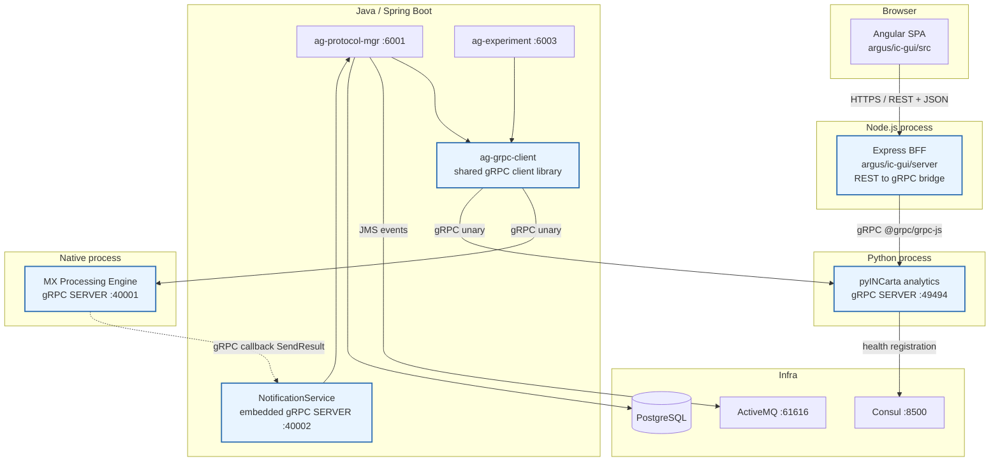
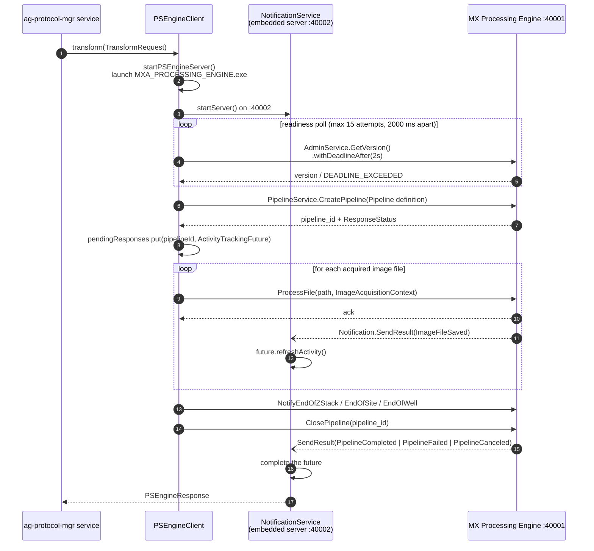
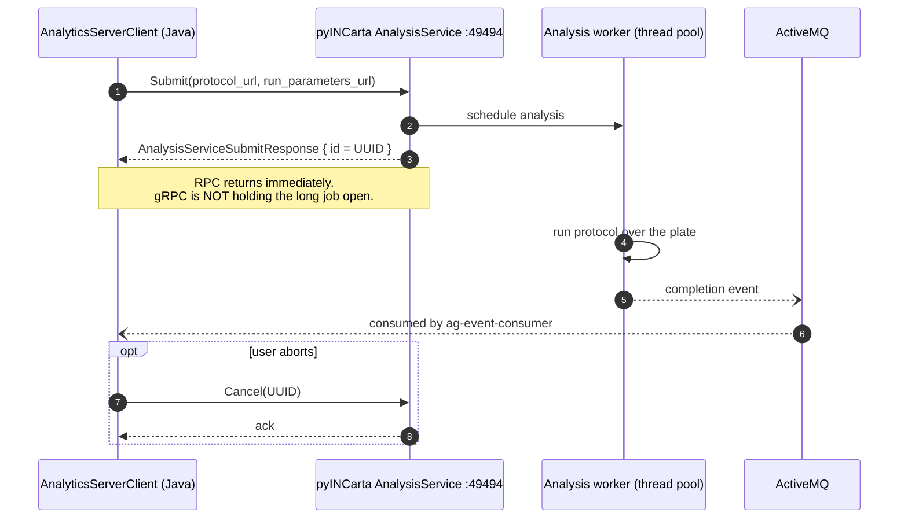
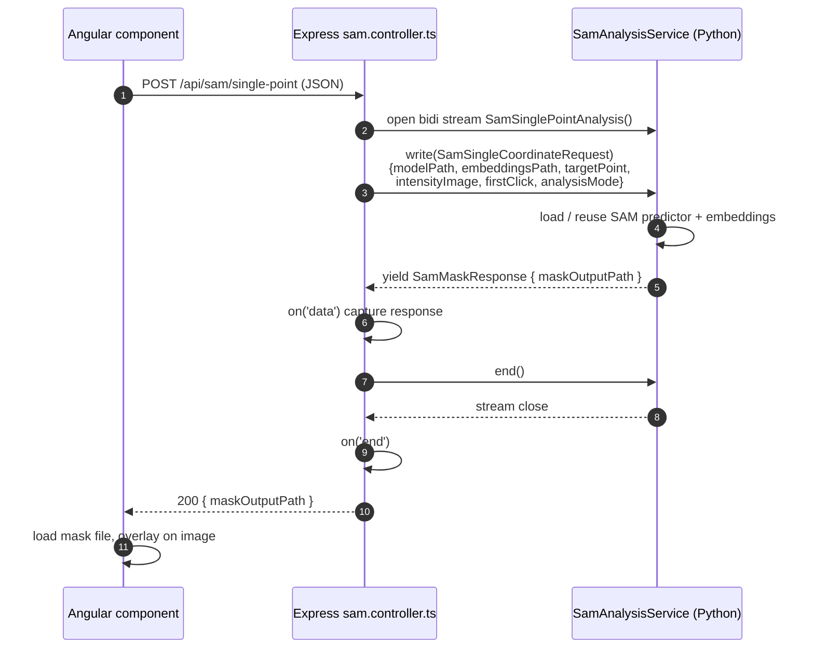
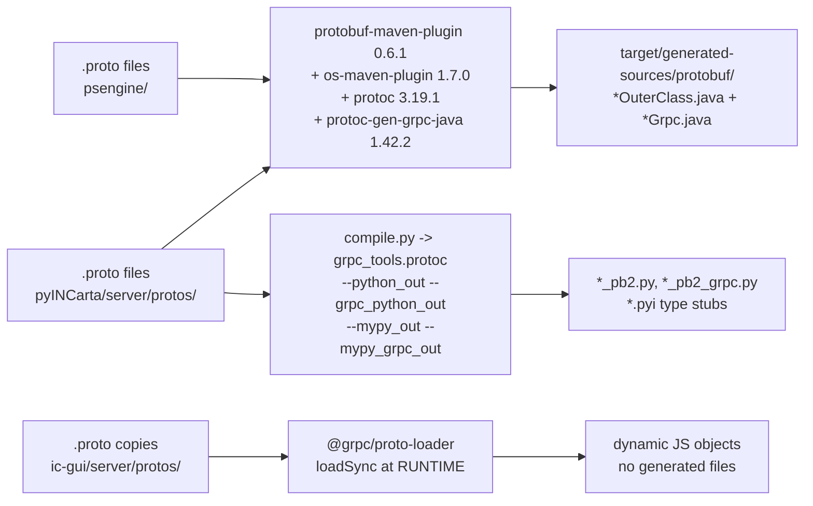
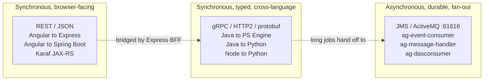

# gRPC in INCarta / Argus — End-to-End Architecture & KT Guide

**Audience:** New engineers joining the team.
**Goal:** After reading this you should be able to (a) explain *why* this product uses gRPC, (b) draw the full request path from a browser click to a Python image-analysis routine and back, and (c) add or change an RPC yourself.

Everything below is derived from the code in this repository. File paths are repo-relative.

---

## 0. The 60-second version

INCarta is a **polyglot desktop/on-prem imaging platform**. A single user action ("run this protocol") crosses **four runtimes on the same machine**:

| Runtime | Module | Language |
|---|---|---|
| Browser UI | `argus/ic-gui` (Angular) | TypeScript |
| BFF / web server | `argus/ic-gui/server` (Express) | TypeScript / Node |
| Business services | `argus/ic-core-services/*` (Spring Boot) | Java 11 |
| Image analysis | `argus/analytics/pyINCarta` | Python |
| Image transform engine | MX Processing Engine (`MXA_PROCESSING_ENGINE.exe`) | Native executable |

Those processes must exchange **large, strongly-typed, high-frequency messages** (per-image events, pipeline lifecycle events, interactive segmentation clicks). gRPC was chosen for **exactly these process-to-process hops**. REST is still used for browser↔server, and messaging (JMS/ActiveMQ) is still used for durable, fan-out events.

> **The one-line rule of thumb used in this codebase:**
> **Browser → server = REST. Server → server (across languages) = gRPC. Broadcast / durable events = messaging.**

---

# PART 1 — Why gRPC?

## 1.1 The forces that drove the decision

### Force 1: Four languages, one contract

Without gRPC, the same message (e.g. "a pipeline finished, here is its status and result file") would need to be hand-written **four times** — a Java POJO, a Python class, a TypeScript interface, and a C++ struct — and kept in sync by discipline alone.

With gRPC there is exactly **one** source of truth:

```
argus/ic-core-services/ag-grpc-client/src/main/java/com/argus/grpc/proto/psengine/*.proto
argus/analytics/pyINCarta/server/protos/*.proto
```

…and the compiler generates the Java stubs, the Python stubs (+ `.pyi` type hints), and the Node loader reads the same `.proto` at runtime. **A breaking change becomes a compile error, not a 3 a.m. production bug.** That is the single biggest reason.

### Force 2: The payloads are big and hot

This is a high-content imaging product. A single plate run produces **tens of thousands of image files**, and for each one the Java orchestrator emits a `ProcessFile` RPC plus end-of-Z-stack / end-of-site / end-of-well lifecycle RPCs.

* **JSON over HTTP/1.1**: text encoding, one TCP connection per in-flight request (or head-of-line blocking with pipelining), verbose headers repeated on every call.
* **Protobuf over HTTP/2**: compact binary encoding, **one multiplexed connection**, HPACK header compression.

At this call volume the difference is not cosmetic — it is the difference between the orchestrator being a bottleneck and not.

### Force 3: We genuinely need streaming, not just request/response

The SAM (Segment Anything Model) interactive-segmentation feature is **bidirectional streaming**:

```proto
// argus/analytics/pyINCarta/server/protos/sam.proto
service SamAnalysisService {
    rpc SamAnalysis(stream SamCoordinateRequest) returns (stream SamMaskResponse) {}
    rpc SamSinglePointAnalysis(stream SamSingleCoordinateRequest) returns (stream SamMaskResponse) {}
    rpc LoadPredictor(LoadPredictorRequest) returns (LoadPredictorResponse);
    rpc UnloadAllModels(UnloadAllModelsRequest) returns (UnloadAllModelsResponse);
}
```

The user clicks a point on a cell; the server keeps the **expensive ML model and image embeddings loaded in memory across the whole stream** and pushes masks back as they are computed. Doing this with REST means either polling or WebSockets *plus* a hand-rolled framing protocol. gRPC gives it to you as a language feature — `yield` in Python, an event emitter in Node.

### Force 4: Deadlines and health are first-class

Because the PS Engine is an **external process we launch ourselves**, we must answer "is it up yet?" and "has it hung?" robustly.

* gRPC deadlines: `PSEngineClient` calls `.withDeadlineAfter(...)` — the deadline propagates to the server, which can abandon work instead of computing a result nobody wants.
* The standard **`grpc.health.v1.Health`** service is registered by the Python server and used for Consul service discovery checks — no custom `/healthz` endpoint to invent.

### Force 5: Callbacks without polling

Image transforms are long-running. Rather than the Java side polling "are you done yet?", **the Java process hosts its own small gRPC server** and the PS Engine calls *back* into it (`Notification.SendResult`). Symmetric client/server roles are cheap in gRPC because the same generated code serves both directions.

---

## 1.2 What we considered, and why gRPC won *for these hops*

| Option | Why it lost (for server↔server) | Where we still use it |
|---|---|---|
| **REST/JSON** | No schema enforcement across 4 languages; text encoding at image-event volume; no native streaming; no deadline propagation | **Browser ↔ Express BFF**, and inter-service Karaf APIs |
| **Messaging (JMS/ActiveMQ)** | Adds a broker as a runtime dependency on a *single-workstation* install; request/response over a queue needs correlation IDs and reply queues; latency for an interactive click is unacceptable | **ActiveMQ** (`tcp://localhost:61616`) for durable, fan-out, fire-and-forget events (`ag-event-consumer`, `ag-message-handler`, `ag-dasconsumer`) |
| **Raw sockets / named pipes** | Exactly what we'd have to write by hand: framing, versioning, backpressure, timeouts, reconnect. gRPC is that, already debugged | A legacy TCP socket remains for the 3D Viewer (port `55885`) |
| **SOAP / CORBA / Thrift** | Heavier tooling, weaker multi-language momentum, no HTTP/2 | — |

### The honest trade-offs (say these out loud in interviews and design reviews)

1. **Browsers cannot speak gRPC.** HTTP/2 trailers aren't reachable from `fetch`/`XHR`. You need gRPC-Web + a proxy. **We deliberately did not do that** — the Express BFF translates REST→gRPC instead. Fewer moving parts, and the BFF was already there.
2. **Not human-readable on the wire.** You cannot `curl` a gRPC endpoint or read it in Fiddler. You need `grpcurl`, reflection, or logging. Debugging cost is real.
3. **Build complexity.** Codegen must run before compilation, and `protoc` is a platform-specific binary (hence `os-maven-plugin`). A fresher's first "it doesn't compile" is almost always "you didn't run codegen."
4. **Version skew risk.** Java is pinned to protobuf `3.19.1` / grpc-java `1.42.2`; Python is on `grpcio 1.76.0` / protobuf `6.33.4`. This works because the **proto3 wire format is stable**, but it means you must not use newer proto language features the old Java toolchain can't parse.
5. **Load balancing is harder.** gRPC connections are long-lived, so L4 load balancers pin traffic. Irrelevant here (everything is `127.0.0.1`), but it's why our config is `static://127.0.0.1:...`.

---

# PART 2 — The Architecture, End to End

## 2.1 System context



**Read the blue boxes as "gRPC lives here."** Note the two things freshers most often get wrong:

* The **Angular app never speaks gRPC.** Not gRPC-Web, not anything. It speaks REST to Express.
* The **Java side is both a gRPC client and a gRPC server.** It serves `Notification` on `:40002`.

---

## 2.2 Process & port topology

| Process | Role | Port | Config key (env var : default) | Transport |
|---|---|---|---|---|
| MX Processing Engine | gRPC **server** | 40001 | `MXA_PE_GRPC_SERVER_PORT:40001` | plaintext h2c |
| `ag-protocol-mgr` (`NotificationService`) | gRPC **server** (callback sink) | 40002 | `MXA_PE_NOTIFICATION_SERVER_PORT:40002` | plaintext h2c |
| pyINCarta analytics | gRPC **server** | 49494 | `GRPCSERVER_PORT:49494` | plaintext, **TLS optional** |
| `ag-protocol-mgr` | HTTP + gRPC **client** | 6001 | `server.port` | — |
| `ag-experiment` | HTTP + gRPC client | 6003 | `IC_EXPERIMENT_PORT` | — |
| Express BFF | HTTP + gRPC **client** | — | — | — |
| Consul | service discovery | 8500 | `IC_DISCOVERY_HTTP_PORT` | HTTP |

Source: `argus/ic-core-services/ag-protocol-mgr/src/main/resources/application.properties`, `argus/analytics/pyINCarta/server/config.py`, `argus/ic-gui/server/conf/application-config.ts`.

---

## 2.3 The contract inventory (all 12 `.proto` files)

### A. PS Engine contracts — `argus/ic-core-services/ag-grpc-client/src/main/java/com/argus/grpc/proto/psengine/`

Java package `protobuf`.

| File | Service | RPCs | Style |
|---|---|---|---|
| `api.proto` | `PipelineService` | `CreatePipeline`, `ProcessFile`, `NotifyEndOfZStack`, `NotifyEndOfYScan`, `NotifyEndOfYScanSeries`, `NotifyEndOfSite`, `NotifyEndOfSiteGroup`, `NotifyEndOfWell`, `ClosePipeline`, `CancelPipeline`, `GetPipelineStatus` | all unary |
| `admin.proto` | `AdminService` | `GetVersion`, `GetConfigFilePath`, `GetLogFilePaths`, `GetInfrastructureLogFilePaths`, `Shutdown` | all unary |
| `notification.proto` | `Notification` | `SendResult` | unary — **Java is the server here** |

Two design details worth internalising:

**1. Response status is an enum, not an exception.**
```proto
enum ResponseStatus { UNKNOWN = 0; SUCCESS = 200; FAILURE = 400; WARNING = 600; PYTHON_EXCEPTION = 800; }
```
Domain-level failure (e.g. "this pipeline definition is invalid") is a *successful RPC* carrying `FAILURE`. Only transport-level problems become `StatusRuntimeException`. **Do not conflate the two.** See §2.7.

**2. Pipeline parameters use `google.protobuf.Value` maps.** Pipeline node configuration is open-ended and changes per algorithm, so it is modelled as a dynamic `Struct`/`Value` map rather than a rigid message. That is why `ag-grpc-client` depends on `protobuf-java-util` (for `JsonFormat`) — it converts our JSON protocol definitions into protobuf `Struct`s.

### B. Analytics contracts — `argus/analytics/pyINCarta/server/protos/`

Proto package `pyINCarta.server.protos` (or `sam`).

| File | Service | RPCs | Style |
|---|---|---|---|
| `api.proto` + `analysis.proto` | `AnalysisService` | `Submit`, `Cancel` | unary |
| `api.proto` + `admin.proto` | `AdminService` | `Shutdown`, `ServerReady` | unary |
| `highres_image.proto` | `HighResImageService` | `GenerateHighResImage`, `GenerateHighResMovie`, `GetMovieProgress`, `CancelMovieExport` | unary |
| `sam.proto` | `SamAnalysisService` | `SamAnalysis`, `SamSinglePointAnalysis` | **bidirectional streaming** |
| `sam.proto` | `SamAnalysisService` | `LoadPredictor`, `UnloadAllModels` | unary |
| `training_set.proto` | `TrainingSetService` | `GenerateTrainingSetData` | unary |
| `phenoglyphs.proto` | `PhenoglyphsService` | `GeneratePhenoglyphsData` | unary |
| `montage_validation.proto` | `MontageValidationService` | `RunAlgorithm` | unary |
| `thumbnail.proto` | `ThumbnailService` | `CreateThumbnail`, `CancelThumbnail` | unary |

> **Key architectural idea:** notice that almost nothing ships pixel data over the wire. Requests carry **file paths and JSON blobs** (`intensityImage`, `embeddingsPath`, `maskOutputPath`, `protocol_url`, `json_input`). Because every process runs on the same workstation with shared storage, gRPC is used as a **control plane**, and the filesystem is the **data plane**. This is a deliberate, important decision — copying multi-gigabyte image stacks through protobuf would be wasteful. Remember this when someone proposes "just put the image in the message."

### C. Node copies — `argus/ic-gui/server/protos/`

`admin.proto`, `api.proto`, `analysis.proto`, `highres_image.proto`, `sam.proto`, `training_set.proto` — **duplicated copies** of the analytics protos, loaded at runtime by `@grpc/proto-loader`.

> ⚠️ **Known drift hazard.** These are physical copies, not symlinks or a build step. If you edit an analytics `.proto`, you must manually mirror the change here. This is the most likely source of a "works in Java, broken in the UI" bug.

---

## 2.4 Flow 1 — Image transform pipeline (Java ↔ PS Engine)

This is the most sophisticated flow in the system: **synchronous commands out, asynchronous notifications back, with an inactivity-based timeout.**



### The parts a fresher must understand

**The reverse channel.** `NotificationService` (`ag-grpc-client/.../impl/NotificationService.java`) extends the **generated** `NotificationGrpc.NotificationImplBase` and starts a real gRPC server:

```java
notificationServer = ServerBuilder.forPort( psEngineNotificationServerPort ).addService( this ).build();
notificationServer.start();
```

The PS Engine dials *back* into it. This inverts the usual client/server intuition, and it's why `ag-protocol-mgr` needs an inbound port.

**Correlation.** A `ConcurrentMap<Integer, ActivityTrackingFuture> pendingResponses` keyed by `pipelineId` bridges the async callback to the blocked caller. `sendResult()` looks up the future and either refreshes it or completes it.

**Inactivity timeout, not total timeout.** `psEngine.pipeline.completion.timeout.minutes=15` is **not** "the pipeline must finish in 15 minutes." Every notification calls `future.refreshActivity()`. The timer measures *silence*. A 6-hour plate run is fine as long as the engine keeps reporting progress; a hung engine is caught in 15 minutes. This distinction matters — expect it to be misread.

**Lifecycle ownership.** `@PreDestroy destroy()` stops the notification server, then kills the engine via `taskkill /F /IM MXA_PROCESSING_ENGINE.exe`.

**Terminal vs non-terminal statuses.** From `notification.proto`: `ImageFileSaved`, `JDCEFileSaved`, `EndOfWell`, … are progress pings; `PipelineCompleted`, `PipelineFailed`, `PipelineCanceled`, `PipelineError` complete the future.

---

## 2.5 Flow 2 — Analysis submit (Java → Python)



**Why this pattern?** A plate analysis can run for hours. Holding a gRPC stream open for hours is fragile (keepalive, restarts, memory). So we use **gRPC for the fast control operations** (submit/cancel — sub-second, needs a typed contract and an immediate answer) and **messaging for the slow completion event** (durable, survives a restart, fan-out to multiple consumers).

**This is the single most important "when to use what" lesson in the codebase.** Compare it with Flow 1, where the callback *is* gRPC — that's acceptable there because both processes are co-launched and co-terminated.

Java side (`ag-grpc-client/.../impl/AnalyticsServerClient.java`):
```java
@GrpcClient( "analysis-server" )
private AnalysisServiceGrpc.AnalysisServiceBlockingStub analysisServiceClient;

@GrpcClient( "analysis-server" )
private MontageValidationServiceGrpc.MontageValidationServiceBlockingStub montageValidationServiceClient;
```
Note `ag-grpc-client`'s `pom.xml` compiles **both** proto trees (`compile-local-protos` for PS Engine, `compile-analytics-protos` pointing at `../../analytics`), which is how Java gets stubs for the Python services.

---

## 2.6 Flow 3 — SAM interactive segmentation (Angular → Express → Python, bidi streaming)



Node client shape (`argus/ic-gui/server/controllers/sam.controller.ts`):

```typescript
const packageDefinition = protoLoader.loadSync('./server/protos/sam.proto', {
    keepCase: true, longs: String, enums: String, defaults: true, oneofs: true,
});
const proto = grpc.loadPackageDefinition(packageDefinition) as any;
const samAnalysisServiceStub =
    new proto.sam.SamAnalysisService(ANALYTICS_ENDPOINT, grpc.credentials.createInsecure());

const serviceCall = samAnalysisServiceStub.SamSinglePointAnalysis();
serviceCall.on('data',  (response) => { samAnalysisResponse = response; });
serviceCall.on('error', (error)    => { res.status(500).send(error); });
serviceCall.on('end',   ()         => { res.status(200).send(samAnalysisResponse); });
serviceCall.write(samSingleCoordinatePayload);
serviceCall.end();
```

Python server shape (`argus/analytics/pyINCarta/server/sam_analysis_service.py`) — a **generator over a request iterator**:

```python
def SamSinglePointAnalysis(self, request_iterator, context: grpc.ServicerContext):
    for request in request_iterator:
        # firstClick resets the session; analysisMode is "analyze" | "undo" | "redo"
        yield sam_pb2.SamMaskResponse(maskOutputPath=path, message='')
```

> `keepCase: true` in the loader is significant: it stops proto-loader from camel-casing field names, so JS field names match the `.proto` exactly. Change it and every field silently becomes `undefined`.

---

## 2.7 The codegen pipeline — three languages, three strategies



### Java — build-time, via Maven
`argus/ic-core-services/ag-grpc-client/pom.xml`:
* `os-maven-plugin` 1.7.0 resolves `${os.detected.classifier}` so Maven downloads the right **native** `protoc` and `protoc-gen-grpc-java` binaries for your OS.
* Two executions with `<clearOutputDirectory>false</clearOutputDirectory>` so the second doesn't wipe the first.
* Output: `target/generated-sources/protobuf/`. **Not in git.** If your IDE shows red errors on `protobuf.Api`, run `mvn generate-sources` and mark that folder as a source root.

### Python — explicit compile step
`argus/analytics/pyINCarta/server/compile.py`:
```bash
python -m pyINCarta.server.compile <proto_path> <python_path>
```
It shells into `grpc_tools.protoc` with `--python_out`, `--grpc_python_out`, **plus `--mypy_out` / `--mypy_grpc_out`** (mypy-protobuf 5.0.0) so the Python side gets real type checking on protobuf messages. Also passes `--experimental_allow_proto3_optional`.
The generated `*_pb2.py` files **are checked in** here (headers say `NO CHECKED-IN PROTOBUF GENCODE`, `Protobuf Python Version: 6.31.1` — i.e. they're regenerated, not hand-edited). Covered by `argus/analytics/pyINCartaPytest/server/test_server_compile.py`.

### Node — runtime, no codegen
`@grpc/proto-loader` parses the `.proto` when the process starts. Zero build step, but **zero compile-time safety** — a renamed field fails at runtime, not at build.

### Version matrix (memorise the mismatch)

| | Java | Python | Node |
|---|---|---|---|
| gRPC | grpc-java **1.42.2** | grpcio **1.76.0** | @grpc/grpc-js **1.10.10** |
| protobuf | **3.19.1** (+ util 3.25.3) | **6.33.4** | via proto-loader ^0.7.0 |
| Extras | net.devh starter 2.13.1.RELEASE, Spring Boot 2.7.18, Java 11 | grpcio-health-checking 1.76.0, mypy-protobuf 5.0.0 | — |

Interoperable because proto3 wire format is stable. **But:** don't introduce proto features newer than the Java toolchain can parse.

---

## 2.8 Server internals — Python analytics

`argus/analytics/pyINCarta/server/server.py`:

```python
def _init_server(server_config, security_config) -> grpc.Server:
    rpc_executor = futures.ThreadPoolExecutor()
    server = grpc.server(rpc_executor)
    server_address = _get_server_address(server_config)

    if security_config.is_ssl_enabled():
        server_credentials = grpc.ssl_server_credentials(
            [(security_config.key, security_config.certificate)],
            security_config.root_certificate, True)      # True = require client auth
        server.add_secure_port(server_address, server_credentials)
    else:
        server.add_insecure_port(server_address)
    return server
```

All eight servicers are registered on **one** server / one port — a single HTTP/2 listener multiplexes every service:

```python
admin_service.add_to_server(server, admin_context)
analysis_service.add_to_server(server, analysis_context)
thumbnail_pb2_grpc.add_ThumbnailServiceServicer_to_server(ThumbnailService(), server)
sam_pb2_grpc.add_SamAnalysisServiceServicer_to_server(SamAnalysisService(), server)
phenoglyphs_pb2_grpc.add_PhenoglyphsServiceServicer_to_server(PhenoglyphsService(), server)
training_set_pb2_grpc.add_TrainingSetServiceServicer_to_server(TrainingSetService(), server)
montage_validation_pb2_grpc.add_MontageValidationServiceServicer_to_server(MontageValidationService(), server)
highres_image_pb2_grpc.add_HighResImageServiceServicer_to_server(HighResImageService(), server)

health_servicer = health.HealthServicer()
health_servicer.set('', health_pb2.HealthCheckResponse.SERVING)
health_servicer.set('grpc.health.v1.Health', health_pb2.HealthCheckResponse.SERVING)
health_pb2_grpc.add_HealthServicer_to_server(health_servicer, server)
```

**Security config** (`config.py`): TLS is driven by a **PKCS12 keystore**. `is_ssl_enabled()` returns true iff `keystore_file` is set; key/cert are extracted to PEM at startup, password from the `security_config_password` env var. Optional `root_certificate_file` enables mutual TLS. **Default deployment is plaintext** because everything is loopback.

**Service discovery**: optional Consul registration (`is_service_discovery_enabled`, default `False`), using gRPC health checks with a TCP-check fallback, interval `consul_health_query_interval_secs` (default 10s).

**Readiness**: `context.server_ready` is flipped true only after all servicers are attached — that's what `AdminService.ServerReady` reports, and what the UI's spinner polls.

---

## 2.9 Client configuration

`argus/ic-core-services/ag-protocol-mgr/src/main/resources/application.properties`:

```properties
#grpc.client.analysis-server.address=discovery:///grpc-server
grpc.client.analysis-server.address=static://127.0.0.1:${GRPCSERVER_PORT:49494}
grpc.client.analysis-server.enableKeepAlive=true
grpc.client.analysis-server.keepAliveWithoutCalls=true
grpc.client.analysis-server.negotiationType=plaintext

grpc.client.ps-engine-server.address=static://127.0.0.1:${MXA_PE_GRPC_SERVER_PORT:40001}
grpc.client.ps-engine-server.enableKeepAlive=true
grpc.client.ps-engine-server.keepAliveWithoutCalls=true
grpc.client.ps-engine-server.negotiationType=plaintext

ps-engine.notification.server.port=${MXA_PE_NOTIFICATION_SERVER_PORT:40002}

psEngine.retry.maxAttempts=15
psEngine.retry.maxDelayInMilliseconds=2000
psEngine.pipeline.completion.timeout.minutes=15
```

Line by line:
* `static://` — no discovery, no load balancing. Everything is loopback. (The commented `discovery:///grpc-server` line shows Consul-based resolution was built and is available.)
* `enableKeepAlive` — HTTP/2 PING frames detect a dead peer that never sent a FIN.
* `keepAliveWithoutCalls` — ping even when idle, so a crashed PS Engine is noticed *before* the next request rather than during it.
* `negotiationType=plaintext` — h2c, no TLS. Acceptable **only** because this is loopback on a single workstation. If a service ever moves off-box, this must change.

The `@GrpcClient("ps-engine-server")` annotation name **must** match the `grpc.client.<name>.*` key. A typo yields a null stub / `NoSuchBeanDefinition` at startup — a classic first-day bug.

---

## 2.10 Cross-cutting concerns

### Deadlines
```java
Admin.GetVersionResponse response = adminServiceClient
    .withDeadlineAfter( PSEngineConstant.PS_ENGINE_RPC_DEADLINE_IN_SECONDS, TimeUnit.SECONDS )
    .getVersion( versionRequest );
```
`PS_ENGINE_RPC_DEADLINE_IN_SECONDS = 2`. Remember: a stub is **immutable**; `withDeadlineAfter` returns a *new* stub. Calling it and discarding the result is a silent no-op — watch for that in review.

### Retries
Application-level, not gRPC's built-in retry policy: 15 attempts × 2000 ms while polling PS Engine readiness at startup. Deliberate — retrying a *pipeline* is not safe, retrying a *version probe* is.

### Timeouts
Inactivity-based via `ActivityTrackingFuture` (§2.4). Distinct from the RPC deadline.

### Error handling — the two-layer model

| Layer | Mechanism | Meaning | Handle it by |
|---|---|---|---|
| Transport | `StatusRuntimeException` (`UNAVAILABLE`, `DEADLINE_EXCEEDED`, `INTERNAL`) | The call didn't complete | Wrap in `GRPCClientException`, log, propagate |
| Domain | `ResponseStatus` enum in the response body | The call completed; the *work* failed | Branch on the enum, surface to the user |

Java wraps everything in `com.argus.grpc.exception.GRPCClientException`. Python aborts with a status code:
```python
context.abort(grpc.StatusCode.INTERNAL, str(e))
```
Node uses `on('error')` for unary callbacks and stream events.

### Threading
* **Java clients are all blocking stubs** — the calling thread parks. Simple to reason about; means you must not call them from a thread you can't afford to block.
* **Python server uses an unbounded `ThreadPoolExecutor()`** — every RPC gets a thread. Fine at current concurrency; a scaling limit to be aware of.

### Not present (and that's a valid answer in a design discussion)
No client/server **interceptors**, no gRPC **reflection**, no **compression** config, no explicit **max message size** override (defaults to 4 MB — safe here only because we ship paths, not pixels), no service mesh, no gRPC-Web.

---

## 2.11 Where gRPC sits relative to everything else



**Decision guide for new work:**

| Need | Use |
|---|---|
| Browser must call it | REST (add a BFF route if the impl is gRPC) |
| Cross-language, needs an immediate typed answer | gRPC unary |
| Interactive, incremental results, shared expensive state | gRPC streaming |
| Long-running job, result later, may fan out, must survive restart | Kick off with gRPC unary → report via messaging |
| Bulk pixel/image data | **Filesystem**; pass the path over gRPC |

---

# PART 3 — Practical guide for the new joiner

## 3.1 First-day setup checklist

1. **Java:** `mvn clean install` in `argus/ic-core-services`. Codegen runs automatically. If your IDE can't resolve `protobuf.Api` / `PipelineServiceGrpc`, mark `ag-grpc-client/target/generated-sources/protobuf/java` and `.../grpc-java` as source roots.
2. **Python:** `pip install -r argus/analytics/requirements.txt`, then run `compile.py` to regenerate `*_pb2*.py`.
3. **Node:** `npm install` in `argus/ic-gui`. No codegen — protos load at runtime.
4. **Verify the analytics server is alive:** start it, then hit the BFF's status route, which calls `AdminService.ServerReady`. `{ ready: true }` means all eight servicers are attached.

## 3.2 How to add a new RPC end-to-end (the full loop)

1. **Edit the `.proto`** in `argus/analytics/pyINCarta/server/protos/`. Add the message *and* the `rpc` line. **Never renumber or reuse existing field numbers** — field numbers are the wire contract, names are not.
2. **Mirror the file** into `argus/ic-gui/server/protos/` if the UI needs it. (Manual copy — see §2.3C.)
3. **Regenerate Python** via `compile.py`. Commit the `*_pb2.py` / `*_pb2_grpc.py` / `.pyi`.
4. **Implement the servicer** method in `argus/analytics/pyINCarta/server/<your>_service.py` and register it in `server.py`'s `_start_server`.
5. **Java client (if needed):** rebuild `ag-grpc-client` — the analytics protos are already on its `protoSourceRoot`. Inject with `@GrpcClient("analysis-server")` and add a wrapper method + POJO in `com.argus.grpc.model`.
6. **Node client (if needed):** add a controller in `argus/ic-gui/server/controllers/`, load the proto, expose a REST route.
7. **Angular:** call the REST route. Never gRPC directly.
8. **Test:** `ag-grpc-client/src/test/java/com/argus/grpc/client/impl/*Test.java` shows the pattern using `io.grpc:grpc-testing` (in-process server). Python: see `argus/analytics/pyINCartaPytest/server/`.

## 3.3 Backwards-compatibility rules (protobuf 101)

| Safe | Unsafe |
|---|---|
| Add a new field with a **new** number | Change an existing field's number |
| Add a new `rpc` to a service | Change a field's type (except compatible int widenings) |
| Add a new enum value | Reuse the tag of a deleted field (use `reserved`) |
| Rename a field (wire uses numbers) | Rename a *service* or *rpc* (those are path strings!) |
| Delete a field **and** mark it `reserved` | Move a field into/out of a `oneof` |

⚠️ Renaming an `rpc` or a `service` **is** breaking — the HTTP/2 path is literally `/<package>.<Service>/<Method>`.

## 3.4 Debugging playbook

| Symptom | Likely cause |
|---|---|
| `UNAVAILABLE: io exception` | Target process not running, or wrong port. Check `MXA_PE_GRPC_SERVER_PORT` / `GRPCSERVER_PORT` and `netstat -ano \| findstr 49494`. |
| `DEADLINE_EXCEEDED` on `GetVersion` | PS Engine hasn't finished starting. The 2s deadline is tight by design; readiness polling should absorb it. |
| Java stub is `null` | `@GrpcClient("name")` doesn't match a `grpc.client.<name>.address` property. |
| Node fields all `undefined` | `keepCase` mismatch, or the `ic-gui/server/protos` copy is stale. |
| Compiles in Java, fails in UI | The two proto copies have drifted. |
| Pipeline hangs then times out at 15 min | The engine stopped sending notifications — check whether `:40002` is bound and reachable, and whether a firewall is blocking the loopback callback. |
| `UNIMPLEMENTED` | Servicer not registered in `server.py`, or the `rpc`/service name was renamed on one side only. |
| Java `ClassNotFound` on a `*Grpc` class | Codegen didn't run; `mvn generate-sources`. |

Useful: `grpcurl -plaintext localhost:49494 list` **will not work** — reflection isn't enabled. Use `-proto <file>` explicitly.

## 3.5 Questions to check your understanding

1. Why does the *Java* process run a gRPC **server**, and on which port?
2. `psEngine.pipeline.completion.timeout.minutes=15` — does a 40-minute pipeline fail? Why not?
3. A `ProcessFile` call returns `ResponseStatus.FAILURE`. Was the RPC successful?
4. Why doesn't the Angular app call the Python server directly?
5. Why do SAM requests carry `embeddingsPath` instead of the embeddings themselves?
6. `Submit` returns a UUID immediately — how does the caller ever learn the analysis finished?
7. You rename a proto field from `job_id` to `jobId`. Does the wire break? What if you rename the `rpc`?

*(Answers: §2.4 / §2.4 / §2.3A — no, it was successful at transport level / §1.2 note 1 + §2.6 / §2.3B control-plane vs data-plane / §2.5 via ActiveMQ / §3.3 — field rename is safe, rpc rename is breaking.)*

---

## Appendix A — Glossary

| Term | Meaning |
|---|---|
| **IDL** | Interface Definition Language — the `.proto` file |
| **Stub** | Generated client proxy. *Blocking* = synchronous; *async/future* = non-blocking. We use blocking everywhere in Java. |
| **`*ImplBase`** | Generated Java abstract server class you extend (e.g. `NotificationGrpc.NotificationImplBase`) |
| **Servicer** | Python equivalent — the generated `*Servicer` class you subclass |
| **`StreamObserver`** | Java callback interface for sending responses/streams |
| **Channel** | Long-lived, multiplexed HTTP/2 connection to a server |
| **Deadline** | Absolute point in time after which the RPC is abandoned; propagates to the server |
| **h2c / plaintext** | HTTP/2 without TLS |
| **Unary / server-stream / client-stream / bidi** | The four RPC shapes. This system uses **unary** and **bidi** (SAM only). |
| **BFF** | Backend-for-Frontend — here, the Express server |
| **PS Engine** | MX Processing Engine, the native image-transform executable |
| **SAM** | Segment Anything Model — ML segmentation |
| **JDCE / XDCE** | INCarta protocol/experiment definition file formats |

## Appendix B — Key files to read, in order

1. `argus/ic-core-services/ag-grpc-client/src/main/java/com/argus/grpc/proto/psengine/api.proto` — the core contract
2. `argus/ic-core-services/ag-grpc-client/src/main/java/com/argus/grpc/client/impl/PSEngineClient.java` — the orchestrator
3. `argus/ic-core-services/ag-grpc-client/src/main/java/com/argus/grpc/client/impl/NotificationService.java` — the reverse channel
4. `argus/analytics/pyINCarta/server/server.py` — the Python server bootstrap
5. `argus/analytics/pyINCarta/server/protos/sam.proto` — the streaming example
6. `argus/ic-gui/server/controllers/sam.controller.ts` — the REST↔gRPC bridge
7. `argus/ic-core-services/ag-protocol-mgr/src/main/resources/application.properties` — all the knobs
8. `argus/ic-core-services/ag-grpc-client/pom.xml` — the codegen wiring

## Appendix C — Known gaps / improvement backlog

1. **Duplicated protos** between `analytics/pyINCarta/server/protos` and `ic-gui/server/protos` — no automated sync. Candidate for a build step or a shared package.
2. **No interceptors** — no centralised request logging, correlation IDs, metrics, or auth on the gRPC layer.
3. **No reflection** — makes `grpcurl`-style ad-hoc debugging harder than it needs to be.
4. **Plaintext by default** — fine on loopback; a blocker for any distributed deployment.
5. **Large protobuf/grpc version gap** between Java (2021-era) and Python (current). Works today; constrains proto language features.
6. **Default 4 MB max message size** is unconfigured. Safe only because we pass file paths. Any future change that inlines data must revisit this.
7. **Unbounded Python thread pool** — no backpressure if request volume spikes.
