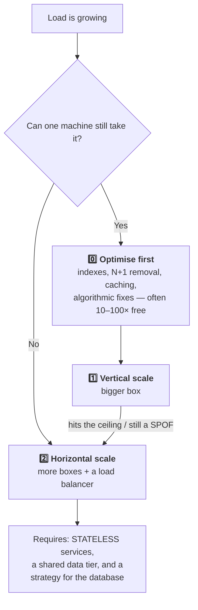
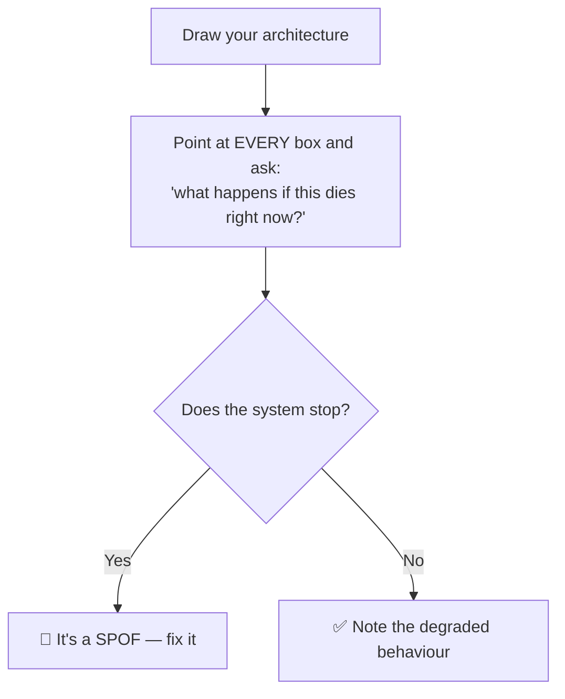
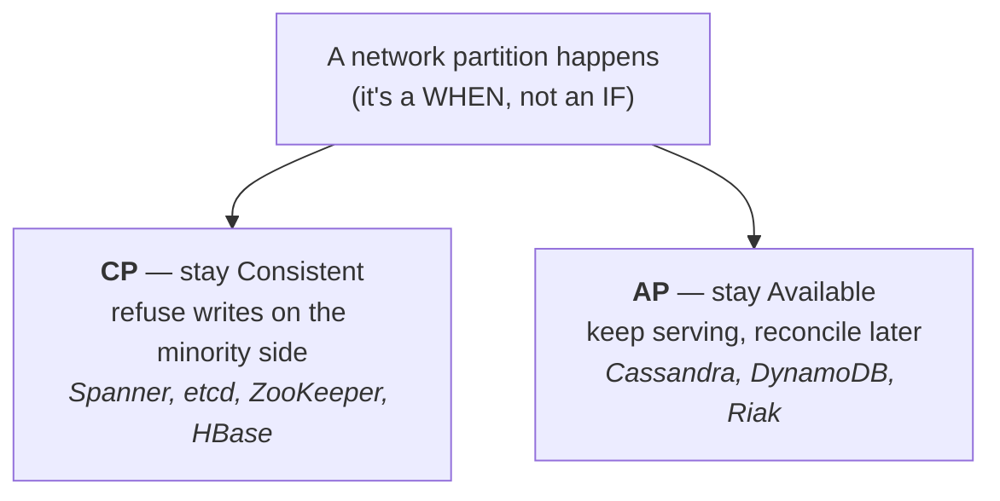
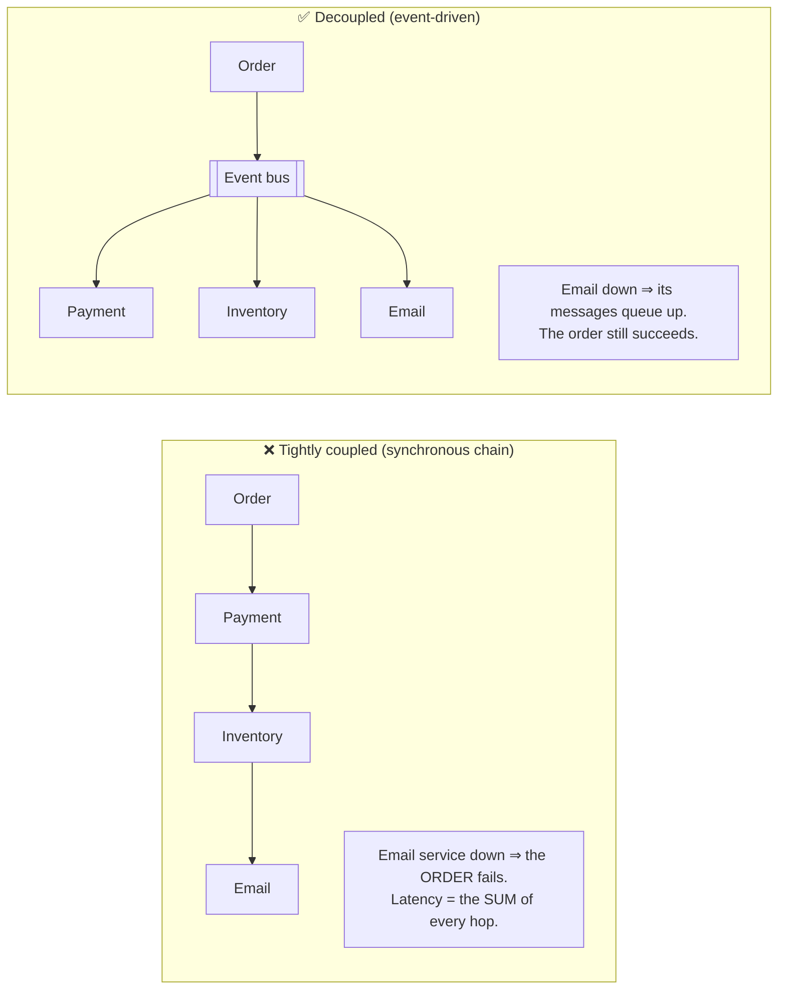
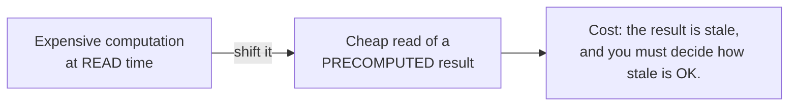
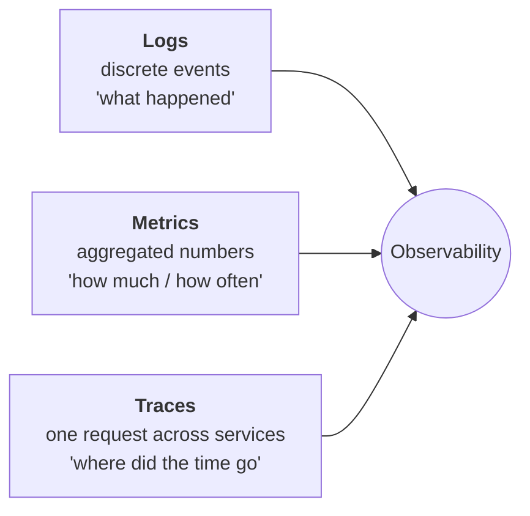
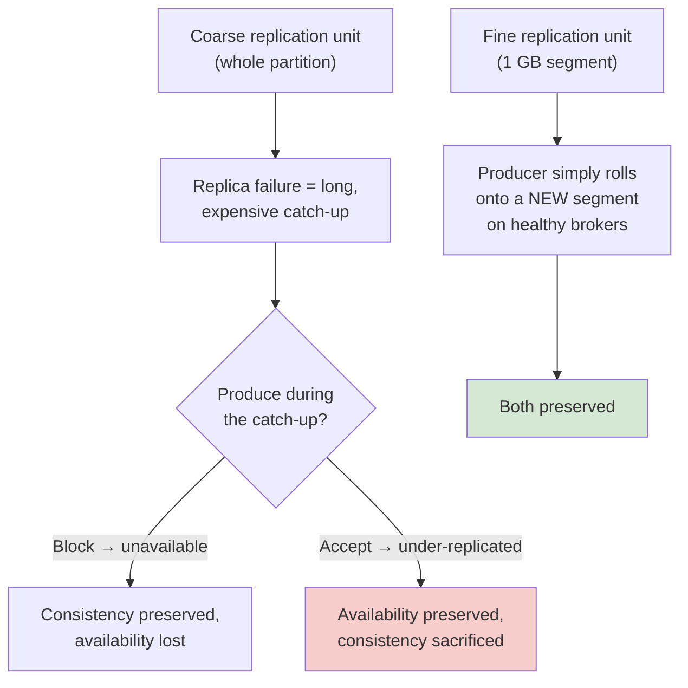

1. vertical scaling - optimise process and increase throughput using same resource
2. preprocessing and cron job - preparing before hand at non-pick hours
3. backup servers -> keep backup and avoid single point failure just like master slave server config
4. horizontal scaling -> acquire more resources to avoid failure
--- expansion of BE services ---
5. microservice architecture -> assign specific task related to specility
6. distributed system -> basically it behaves has backup of whole system it basically serves specific to region e.g. dominos pizza chain
7. load balancing -> it basically routes request to different servers (Routing can be depend upon requirement and different parameter)
8. Decoupling -> seperating out responbility
9. Logging and metrics calculation -> analytics, auditing, reporting and machine learning -> it analyse each and every step and log them
10. extensible

high level system design - how to deploy on servers, how two system are going to interact with each other
low level system design - its more about coding, how coding is going to happen

---

# Core System Design Concepts — Interview Deep Dive

> **Purpose:** the 10 points above are the right instincts. This section turns each into the vocabulary, math and trade-offs an interviewer expects.
> **Sources:** [awesome-system-design-resources](https://github.com/ashishps1/awesome-system-design-resources) · [30 System Design Concepts](https://blog.algomaster.io/p/30-system-design-concepts) · Designing Data-Intensive Applications · Google SRE Book
> **Companions:** [system-design-interview-playbook.md](system-design-interview-playbook.md) · [databases.md](databases.md) · [distributed-systems.md](distributed-systems.md) · [load-balancer.md](load-balancer.md) · [README.md](README.md)

---

## Index

| # | Topic | Section |
|---|---|---|
| 0 | Mapping your 10 points → the formal vocabulary | [§0](#0-your-notes-mapped-to-the-formal-vocabulary) |
| 1 | **Scalability** — vertical vs horizontal, stateless, autoscaling | [§1](#1-scalability) |
| 2 | **Availability** vs **Reliability** vs **Durability** | [§2](#2-availability-reliability--durability) |
| 3 | **SPOF** — how to find and remove every one | [§3](#3-single-point-of-failure-spof) |
| 4 | **CAP & PACELC** + consistency models | [§4](#4-cap-pacelc--consistency-models) |
| 5 | Redundancy, failover & fault tolerance | [§5](#5-redundancy-failover--fault-tolerance) |
| 6 | **Decoupling** — the four kinds | [§6](#6-decoupling-expanding-point-8) |
| 7 | Precomputation, batch vs stream (expanding point 2) | [§7](#7-precomputation-batch-vs-stream-expanding-point-2) |
| 8 | Architectural patterns: client-server, microservices, serverless, EDA, P2P | [§8](#8-architectural-patterns) |
| 9 | **Logging, metrics & tracing** (expanding point 9) | [§9](#9-observability-expanding-point-9) |
| 10 | **Extensibility & evolvability** (expanding point 10) | [§10](#10-extensibility-expanding-point-10) |
| 11 | The 20 core terms — one-line definitions | [§11](#11-the-glossary-you-should-be-able-to-recite) |
| ★ | Rapid-fire Q&A | [§12](#12-rapid-fire-qa) |
| ★ | 🏭 **Real-world: these concepts at Uber and LinkedIn scale** | [§13](#13-real-world-case-studies--the-core-concepts-at-uber-and-linkedin-scale) |

---

## 0. Your notes mapped to the formal vocabulary

| Your point | Formal name | Where it's covered |
|---|---|---|
| 1. Vertical scaling — optimise, same resource | **Vertical scaling / scale-up** | [§1](#1-scalability) |
| 2. Preprocessing & cron jobs | **Precomputation / batch processing / materialised views** | [§7](#7-precomputation-batch-vs-stream-expanding-point-2) |
| 3. Backup servers, master-slave | **Redundancy, replication, failover** | [§5](#5-redundancy-failover--fault-tolerance) · [databases.md](databases.md) §6 |
| 4. Horizontal scaling | **Scale-out** | [§1](#1-scalability) |
| 5. Microservice architecture | **Microservices** | [§8](#8-architectural-patterns) · [cloud-native.md](cloud-native.md) |
| 6. Distributed system, region-specific | **Geo-distribution / multi-region / CDN / GSLB** | [§5](#5-redundancy-failover--fault-tolerance) · [DNS.md](DNS.md) |
| 7. Load balancing | **L4/L7 load balancing** | [load-balancer.md](load-balancer.md) |
| 8. Decoupling | **Loose coupling, async messaging, event-driven** | [§6](#6-decoupling-expanding-point-8) |
| 9. Logging & metrics | **Observability: logs, metrics, traces, SLOs** | [§9](#9-observability-expanding-point-9) |
| 10. Extensible | **Evolvability / Open-Closed at architecture scale** | [§10](#10-extensibility-expanding-point-10) |

> ⭐ **Your instinct in point 1 is more sophisticated than it looks.** "Optimise the process and increase throughput using the same resource" is *efficiency* scaling — and it is genuinely the **first** thing to do. Adding servers to hide an N+1 query just buys you more places to be slow.

---

## 1. Scalability

> **Scalability = the ability to handle growth by adding resources, ideally linearly.**

| | **Vertical (scale up)** | **Horizontal (scale out)** |
|---|---|---|
| How | Bigger CPU/RAM/disk | More machines |
| Complexity | ✅ None — no code change | ❌ Distributed systems problems appear |
| Ceiling | ⚠️ **Hard physical limit** | Effectively unlimited |
| Cost curve | Superlinear (top-end hardware is disproportionately expensive) | Roughly linear, commodity hardware |
| Availability | ❌ **Still a single point of failure** | ✅ Redundancy comes for free |
| Downtime to scale | Usually yes (reboot) | No |
| Data tier fit | Databases scale up well | Databases scale out **hard** ([databases.md](databases.md) §5) |

> ⭐ **The nuanced answer:** *"Vertical scaling buys you time; horizontal scaling buys you a system. But I'd start vertical — modern hardware goes to 128 cores and terabytes of RAM, and a single Postgres box handles far more than most teams assume. I move horizontal when I hit the ceiling **or** when I need the redundancy, whichever comes first. And I'd note that the load balancer I add is itself a new single point of failure I now have to design away."*

### The prerequisite: stateless services

Horizontal scaling only works if any server can serve any request:

| ❌ Stateful | ✅ Stateless |
|---|---|
| Session in server memory | Session in Redis, or a signed token |
| Uploaded files on local disk | Object storage (S3) |
| In-memory job state | A database or queue |
| Sticky sessions required | Any server, any request |

⚠️ **Sticky sessions are a workaround, not a design.** They break autoscaling (scale-in kills sessions), skew load, and complicate deploys. → [load-balancer.md](load-balancer.md) §10

### Autoscaling

| Type | Detail |
|---|---|
| **Reactive** | Scale on CPU/memory/queue depth. ⚠️ Lags by the boot + warm-up time |
| **Scheduled** | You *know* the 9 a.m. spike — scale before it |
| **Predictive** | ML on historical patterns |
| ⚠️ **Cold start** | New instances need JIT warm-up, cache fill, connection pools. Use **slow start / connection ramping** at the LB so they aren't hammered immediately |
| ⚠️ **Scale on the right signal** | For a worker fleet, scale on **queue depth or message age**, not CPU — CPU stays low while the backlog grows |

---

## 2. Availability, Reliability & Durability

> These three are constantly conflated. Distinguishing them is a cheap, high-value signal.

| Term | Question | Example failure |
|---|---|---|
| **Availability** | Is it **up and responding** right now? | Site returns 503 |
| **Reliability** | Does it **behave correctly** over time? | Site is up but returns wrong prices |
| **Durability** | Will the **data survive**? | Disk dies and the order is gone |

> ⭐ *"A system can be highly available and unreliable — it responds to everything, with the wrong answer. It can be reliable and unavailable — perfectly correct when it works, but down half the time. And S3 famously targets **99.99% availability but 99.999999999% (11 nines) durability** — those are deliberately different numbers, because losing data is unrecoverable while being briefly unavailable is not."*

### The nines

| Nines | Downtime/year | Downtime/month | Requires |
|---|---|---|---|
| 99% | 3.65 days | 7.2 h | Single server |
| 99.9% | 8.76 h | 43.8 min | Redundancy + monitoring |
| **99.99%** | **52.6 min** | **4.4 min** | Multi-AZ + automated failover |
| 99.999% | 5.26 min | 26 s | Multi-region, no human in the loop |

$$\text{Availability} = \frac{MTBF}{MTBF + MTTR}$$

⭐ **MTTR is usually the cheaper lever.** Automated failover, fast rollback and good runbooks improve availability far more cheaply than trying to make software never fail.

**Dependencies multiply, redundancy divides:**

$$A_{series} = A_1 \times A_2 \times \dots \qquad A_{parallel} = 1 - (1-A)^n$$

Five dependencies at 99.9% each → **99.5%** (43 h/year). Two servers at 99% → **99.99%**.
⚠️ Parallel math only holds if failures are **independent** — three replicas in one AZ share a power domain. → [latency.md](latency.md) §8

---

## 3. Single Point of Failure (SPOF)

> Expanding point 3 of the original note. **A SPOF is any component whose failure takes down the whole system.**

| Common SPOF | Fix |
|---|---|
| Single app server | N servers behind a load balancer |
| **The load balancer itself** ⭐ | Active-passive with a floating VIP/VRRP, or active-active behind anycast/ECMP, or a managed LB across AZs |
| Single database | Replicas + automated failover; multi-AZ |
| Single cache node | Cluster with replicas; and **degrade to the DB with load shedding**, never a naive stampede |
| Single AZ / region | Multi-AZ minimum; multi-region for DR |
| DNS provider | Two DNS providers with the same zone |
| CI/CD pipeline | Not a runtime SPOF, but it blocks recovery — keep a manual deploy path |
| **Shared config service** | Cache config locally; **fail open** to the last-known-good |
| A single message broker | Clustered with replication |
| ⭐ **A person** | Bus factor: documentation, runbooks, shared on-call |

> ⭐ **The Principal-level version:** *"Redundancy removes the *component* SPOF but not the **correlated** one. Three replicas in one rack share a power supply; three AZs in one region share a control plane; every instance running the same buggy deploy shares the bug. That's why the real controls are **blast-radius reduction** — cells, shuffle sharding, staged rollouts and canaries — not just N+1."*

---

## 4. CAP, PACELC & Consistency Models

⚠️ **"CA" is not a real option.** Partitions happen whether you plan for them or not, so you only ever choose between C and A *during* one.

**PACELC** — the half everyone forgets:
> **If Partition → Availability or Consistency; Else → Latency or Consistency.**

Even with a perfectly healthy network, a quorum read costs latency. That trade-off never goes away.

### Consistency models, strongest → weakest

| Model | Guarantee | Cost |
|---|---|---|
| **Linearizable** | Every read sees the latest write, globally | Highest latency; needs consensus |
| **Sequential** | Everyone sees the same order (not necessarily real-time) | High |
| **Causal** | Causally-related operations are ordered | Medium |
| **Read-your-writes** ⭐ | You always see your own writes | Cheap and usually **sufficient** |
| **Monotonic reads** | You never see time go backwards | Cheap |
| **Eventual** | Replicas converge given no new writes | Cheapest |

> ⭐ **The answer that separates levels:** *"Consistency is a **per-operation** choice, not a per-system one. In one product I'd want the payment write linearizable, the inventory decrement strongly consistent, the feed eventually consistent, and the author's own posts read-your-writes. Modern databases are tunable, so the design question is really 'which operations can tolerate staleness, and how much?'"*

---

## 5. Redundancy, Failover & Fault Tolerance

> Expanding points 3 and 6 of the original note.

| Term | Meaning |
|---|---|
| **Redundancy** | Duplicate components standing by |
| **Failover** | Automatically switching to the standby when the primary fails |
| **Fault tolerance** | Continuing to operate correctly **through** a failure (no switch needed) |
| **Graceful degradation** ⭐ | Losing *features*, not the *service* |

### Redundancy topologies

| Topology | Standby state | RTO | Cost |
|---|---|---|---|
| **Cold standby** | Off; must be provisioned | Hours | 💰 |
| **Warm standby** | Running, scaled down, data replicating | Minutes | 💰💰 |
| **Hot standby (active-passive)** | Fully running, not serving | Seconds | 💰💰💰 |
| **Active-active** ⭐ | All nodes serving | ~0 | 💰💰💰💰 |

⚠️ **Failover itself is a source of outages.** Name these:
- **Split brain** — both nodes think they're primary. Fix: quorum + **fencing tokens** ([distributed-systems.md](distributed-systems.md) §4.3).
- **Flapping** — repeated failover/failback. Fix: hysteresis and cool-down periods.
- **Untested failover doesn't work.** Game days and chaos engineering exist precisely because standbys silently rot.
- **The thundering herd on recovery** — everything reconnects at once. Fix: jittered backoff.

### Graceful degradation, concretely

> *"Netflix without personalised rows still plays video. Amazon without recommendations still takes orders."*

⭐ **Decide the degradation order at design time**, not during the incident: which dependency is *soft* (can be skipped or served stale) and which is *hard* (must succeed)? Turning a hard dependency into a soft one is often the cheapest availability improvement available. → [distributed-systems.md](distributed-systems.md) §11

---

## 6. Decoupling (expanding point 8)

> Point 8 says "separating out responsibility". Here's the full taxonomy.

| Kind of coupling | Coupled version | Decoupled version |
|---|---|---|
| **Temporal** | Both services must be up at the same instant | ⭐ **Message queue** — the consumer can be down for an hour |
| **Spatial / location** | Hardcoded IPs and hostnames | Service discovery, DNS, load balancer |
| **Interface / data** | Sharing a database schema | A versioned API contract; database-per-service |
| **Deployment** | Everything ships together | Independent deployability + backward-compatible contracts |
| **Team** | Two teams must coordinate every release | Clear ownership boundaries (Conway's Law) |

⚠️ **The cost of decoupling:** eventual consistency, harder debugging (you need distributed tracing), duplicate delivery (you need idempotency), and no simple transaction across the boundary (you need sagas). **Say the cost** — that's what makes it a trade-off rather than a slogan.

---

## 7. Precomputation, batch vs stream (expanding point 2)

> Point 2 — "preparing beforehand at non-peak hours" — is the **precomputation** principle. It's one of the most powerful moves in system design.

**Where precomputation shows up:**

| System | Precomputed thing |
|---|---|
| Social feed | **Fan-out on write** — the feed list is built when you post, not when they read |
| Analytics dashboard | Nightly roll-ups / materialised views instead of live `GROUP BY` |
| Search | An inverted index built ahead of the query |
| Autocomplete | Top-k completions cached at each trie node |
| Recommendations | Batch ML scoring overnight, served from a cache |
| Reports/invoices | Generated on a schedule, served as a file |
| Thumbnails/transcodes | Generated on upload, not on view |

### Batch vs stream

| | **Batch** | **Stream** |
|---|---|---|
| Latency | Minutes–hours | Seconds–sub-second |
| Data | Bounded (a finished window) | Unbounded, continuous |
| Cost | Cheaper per record | Higher |
| Reprocessing | ✅ Easy — just re-run | ⚠️ Harder — needs replay from a retained log |
| Correctness | Sees complete data | Must handle **late/out-of-order events** (watermarks) |
| Tools | Spark, Hadoop, dbt, cron | Kafka Streams, Flink, Spark Streaming |
| Use for | Billing, reports, ML training, ETL | Fraud detection, live metrics, alerting, personalisation |

> ⭐ **The modern framing:** *"The old answer was Lambda architecture — run batch and stream side by side and merge. The problem is you maintain the same logic twice. The current answer is **Kappa**: keep everything as a replayable log and treat batch as 'stream reprocessing from offset 0'. Kafka's retention is what makes that possible."*

---

## 8. Architectural Patterns

| Pattern | Idea | Best for | Watch out |
|---|---|---|---|
| **Client-Server** | Clients request, servers respond | Almost everything | Server is the bottleneck and SPOF |
| **Layered / N-tier** | Presentation → business → data | Monoliths, enterprise apps | Layers can become ceremony |
| **Modular monolith** ⭐ | One deployable, strict internal module boundaries | **Small teams — the underrated default** | Boundaries erode without discipline |
| **Microservices** | Independently deployable services per domain | Multiple teams needing independent release cadence | Distributed-systems tax; see [cloud-native.md](cloud-native.md) |
| **Event-Driven (EDA)** | Services react to events on a bus | Loose coupling, fan-out, audit trails | Eventual consistency; hard to trace |
| **Serverless / FaaS** | Functions triggered by events, no servers managed | Spiky/unpredictable load, glue code, cron | ⚠️ **Cold starts**, vendor lock-in, execution time limits, hard local testing |
| **Peer-to-Peer** | No central server; peers share directly | File sharing, blockchain, WebRTC, CDN pre-positioning | Discovery, trust, NAT traversal |
| **CQRS** | Separate write model from read model(s) | Read and write shapes genuinely diverge | Two models to maintain |
| **Event Sourcing** | Store events; derive state by replay | Audit, time travel, financial ledgers | Heavy; event schema evolution is painful |
| **Cell-based** ⭐ | Independent full-stack "cells", each serving a slice of users | Blast-radius control at scale (AWS, Slack) | Routing layer + operational overhead |

> ⭐ **The judgement line:** *"Microservices trade code complexity for operational complexity. They pay off when independent deployability across teams is your bottleneck. For a small team, a **modular monolith** gives you the same design discipline with none of the distributed-systems tax — and it's far easier to split a clean monolith later than to merge microservices back."*

**Conway's Law:** *"Organisations design systems that mirror their communication structure."* ⭐ Mention it — architecture and team topology are the same decision, and a service boundary that cuts across a team boundary will always be painful.

---

## 9. Observability (expanding point 9)

> Point 9 lists logging, metrics, analytics, auditing, reporting and ML — all correct. Here's the formal structure.

| Pillar | Good for | Cost / trap |
|---|---|---|
| **Logs** | Debugging detail, audit trail, forensics | Expensive at volume — use **structured JSON**, sample, and set retention. ⚠️ **Never log tokens, passwords or PII** |
| **Metrics** | Dashboards, alerts, SLOs, capacity planning | Cheap and aggregatable — ⚠️ **cardinality explosion** (never tag with user ID) will kill your TSDB |
| **Traces** | Latency attribution across services | Needs context propagation everywhere; sample intelligently (tail-based keeps the slow ones) |

⭐ **The correlation ID ties them together:** generated at the edge, propagated on every hop (W3C `traceparent`), and attached to every log line. *"Without a correlation ID, debugging a microservice request is archaeology."* Standard: **OpenTelemetry**.

**What to measure:**
- **Four golden signals (SRE):** Latency · Traffic · Errors · Saturation
- **RED** (per service): Rate · Errors · Duration
- **USE** (per resource): Utilisation · Saturation · Errors
- **Business metrics** ⭐: orders/minute, signups, checkout conversion. *"The fastest outage detection I've seen is a business metric — orders per minute drops 40% before any technical alert fires."*

⚠️ **Alert on symptoms, not causes.** Page on "checkout error rate > 1%", not "CPU > 80%". Non-actionable pages train people to ignore pages. → [distributed-systems.md](distributed-systems.md) §13

---

## 10. Extensibility (expanding point 10)

> Point 10 — "extensible" — is the architecture-level version of the **Open/Closed Principle**. Adding a capability should mean **adding** components, not rewriting existing ones.

| Technique | What it buys |
|---|---|
| **Versioned API contracts** | Add fields without breaking clients; tolerant readers ignore unknowns → [rest-api.md](rest-api.md) §7 |
| **Event-driven** ⭐ | A new consumer subscribes to an existing event — **the producer never changes** |
| **Plugin / strategy points** | New payment provider, new notification channel = one new class registered → [design-patterns.md](design-patterns.md#strategy) |
| **Feature flags** | Ship dark, enable per cohort, roll back instantly without a deploy |
| **Database-per-service** | Schema evolves without cross-team coordination |
| **Backward + forward compatible schemas** | Protobuf field numbers, Avro schema registry → [grpc-architecture-kt.md](grpc-architecture-kt.md) §3.3 |
| **Anti-corruption layer** | A legacy or partner model can't leak into your domain |
| **Strangler fig** | Migrate off a system incrementally behind a routing proxy — no big-bang rewrite |

> ⭐ **The interview line:** *"The question I ask at design time isn't 'is this correct?' but **'what's the most likely next requirement, and where does the seam go so it costs one new class instead of a refactor?'** In practice that usually means: put the volatile business rule behind an interface, and publish an event rather than calling a service directly."*

⚠️ **Balance it against YAGNI.** Extensibility points have a cost — indirection, more code, harder debugging. Put seams where change is *likely*, not everywhere.

---

## 11. The glossary you should be able to recite

| Term | One line |
|---|---|
| **Scalability** | Handling growth by adding resources, ideally linearly |
| **Elasticity** | Scaling **both** up *and down* automatically with demand |
| **Availability** | % of time the system responds correctly |
| **Reliability** | Behaving correctly over time (correctness, not just uptime) |
| **Durability** | Data survives failures once committed |
| **Fault tolerance** | Continuing to operate correctly through a component failure |
| **Resilience** | Recovering quickly from failure |
| **SPOF** | A component whose failure takes down the whole system |
| **Blast radius** ⭐ | How much breaks when one thing breaks |
| **Throughput** | Requests handled per unit time |
| **Latency** | Time for a single request |
| **Backpressure** | Signalling upstream to slow down instead of collapsing |
| **Load shedding** | Deliberately rejecting work to protect the system |
| **Idempotency** | N identical calls have the same effect as one |
| **Eventual consistency** | Replicas converge given no new writes |
| **Quorum** | The minimum nodes that must agree — `⌊N/2⌋+1` for a majority |
| **Consistent hashing** | Key→node mapping where adding a node moves only ~1/N keys |
| **Sharding** | Splitting data horizontally across nodes |
| **Replication** | Keeping copies of data on multiple nodes |
| **CDC** | Streaming database changes to other systems from the WAL |
| **Saga** | A distributed transaction as local transactions + compensations |
| **Circuit breaker** | Fail fast on a dependency that's clearly down |
| **Bulkhead** | Isolated resource pools so one failure can't consume them all |
| **Error budget** | `100% − SLO` — the amount of failure you're allowed |
| **RTO / RPO** | Acceptable downtime / acceptable data loss |
| **Conway's Law** | System structure mirrors organisation structure |
| **Amdahl's Law** | Serial fraction `s` caps speedup at `1/s` |
| **Little's Law** | concurrency = arrival rate × latency |

---

## 12. Rapid-fire Q&A

| Question | Answer |
|---|---|
| **HLD vs LLD?** | HLD = services, data stores, protocols, scale, deployment. LLD = classes, interfaces, patterns inside one service. |
| **Vertical vs horizontal scaling?** | Vertical is a bigger box — simple, no code change, hard ceiling, still a SPOF. Horizontal is more boxes — unlimited and redundant, but introduces distributed-systems problems. |
| **What must be true to scale horizontally?** | The service must be **stateless**; state lives in a shared store or a signed token. |
| **What do you optimise before scaling at all?** | Queries, indexes, N+1s, caching, algorithms — often a 10–100× win for free. Adding servers to hide a bad query just buys more places to be slow. |
| **Availability vs reliability vs durability?** | Up and responding · behaving correctly · data survives. S3 targets 99.99% availability and 11 nines of durability — deliberately different. |
| **How much downtime is 99.99%?** | ~52 min/year, ~4.4 min/month. |
| **What does MTBF/MTTR tell you?** | `A = MTBF/(MTBF+MTTR)`. Lowering MTTR is usually the cheaper lever than raising MTBF. |
| **How do you find SPOFs?** | Point at every box and ask "what if this dies now?" Then ask the harder question: which failures are **correlated**? |
| **Isn't the load balancer a SPOF?** | Yes — that's why you run active-passive with a floating VIP, or active-active behind anycast/ECMP, or a managed multi-AZ LB. |
| **Explain CAP.** | Under a partition you must choose consistency or availability. "CA" isn't real because partitions happen regardless. And it's a **per-operation** choice. |
| **What does PACELC add?** | Even with no partition, you still trade **latency vs consistency**. |
| **Name the consistency models.** | Linearizable → sequential → causal → read-your-writes → monotonic reads → eventual. |
| **What is graceful degradation?** | Losing features instead of the service — Netflix without recommendations still plays video. Decide the degradation order at design time. |
| **What is split brain and how do you prevent it?** | Two nodes both act as primary. Prevent with majority quorum plus fencing tokens. |
| **Why decouple with a queue?** | It removes **temporal** coupling — the consumer can be down and the producer still succeeds — plus load levelling and durability. Cost: eventual consistency, dedupe, harder tracing. |
| **Batch vs stream?** | Batch for cheap, complete, easily reprocessed work. Stream for seconds-fresh reactions. Kappa (replayable log) beats maintaining both code paths. |
| **When should you NOT use microservices?** | Small team, single deployment cadence, no independent-scaling need. A modular monolith gives the design benefit without the operational tax. |
| **What are the three pillars of observability?** | Logs, metrics, traces — correlated by a propagated trace ID. |
| **What should you alert on?** | User-facing symptoms (error rate, p99 latency, business metrics), not causes like CPU. |
| **How do you make an architecture extensible?** | Versioned contracts, event-driven producers, plugin/strategy seams for volatile rules, feature flags, and backward-compatible schemas — placed where change is *likely*, not everywhere. |
| **What is Conway's Law and why does it matter?** | System structure mirrors org structure. A service boundary that cuts across a team boundary will always be painful, so design them together. |

---

## 13. Real-World Case Studies — the core concepts at Uber and LinkedIn scale

> **Sources:** Uber — *[CacheFront](https://www.uber.com/en-US/blog/how-uber-serves-over-40-million-reads-per-second-using-an-integrated-cache/)*, *[Intelligent load management](https://www.uber.com/in/en/blog/from-static-rate-limiting-to-intelligent-load-management/)* · LinkedIn — *[Northguard and Xinfra](https://www.linkedin.com/blog/engineering/infrastructure/introducing-northguard-and-xinfra)*.
>
> Every concept in this file shows up in these three posts. This section is the "here's what it looks like when it's real" layer.

### 13.1 Scalability isn't only about data — the control plane scales too

LinkedIn's Kafka fleet: **32 trillion records/day, 17 PB/day, 400K topics, 10,000+ machines, 150 clusters.** But read their actual problem statement:

> *"Onboarding more use cases not only resulted in more traffic, but also **more metadata**, and more machines to support the added traffic. **Metadata and cluster size bottlenecks** were getting harder to tackle and meant setting up more clusters."*
>
> *"We needed a system that scales well not just in terms of data, but also **in terms of its metadata and cluster size**."*

| Axis of scale | Kafka | Northguard |
|---|---|---|
| **Data** | A log is bounded by **one machine's** disk | A log is bounded by the **cluster's** disk |
| **Metadata / control plane** | **1** controller, **1** replicated state machine — stressed at millions of partition replicas | **128+** coordinators, **128+** sharded Raft state machines |
| **Metadata distribution** | Global topic metadata state on every broker | **Minimal** global state |
| **Membership** | Centralised heartbeating to the controller | Gossip (SWIM) |
| **Operations** | An external service (Cruise Control) to keep the cluster balanced | **Balanced by design**; adding a broker moves no existing data |

> ⭐ **Say this:** *"When people say 'it scales', they usually mean the data plane. The thing that actually caps a system is often the control plane — the one leader that owns cluster metadata, the config store everyone reads at startup, the service registry. I'd ask what happens to metadata volume and coordination cost at 10× before I ask about storage."*

This extends [§1](#1-scalability): horizontal scaling requires statelessness in the data path **and** a control plane that doesn't have a single coordinator.

### 13.2 Availability vs consistency — a real, named trade-off

The cleanest CAP/PACELC example you'll find, because LinkedIn states the mechanism, not the theory:

> Kafka: *"Availability — limited by **partitions being a heavyweight unit for replication**. Consistency — **was often traded off in favor of availability** due to the availability impact of partitions being the unit of replication."*
>
> Northguard: *"**Segments** as the unit of replication and log striping means that we **don't need to sacrifice consistency** in order to preserve produce availability when brokers start to fail."*

> ⭐ **The senior move:** they didn't *choose a side* of CAP — they **changed the granularity of the thing being replicated** so the choice stopped being forced. When you're stuck picking between two bad options, the question to ask is *"what design decision is creating this dilemma?"*

**Durability, expressed as a number** ([§2](#2-availability-reliability--durability)):

| System | Guarantee |
|---|---|
| Kafka at LinkedIn | **Lazy syncs** — 10 seconds / 20k records |
| Northguard | **`fsync` on all replicas before the produce ack** — 10 ms / 20k records / 10 MB |

### 13.3 Redundancy has a price tag — say the number

Uber's blunt line on why they cached instead of scaling Docstore:

> *"Costs are **multiplied 6×** to handle each of the 3 stateful nodes across both regions."*

| Choice | Multiplier |
|---|---|
| Replication factor 3 (leader + 2 followers, Raft) | **×3** |
| Active-active across 2 regions | **×2** |
| **Total** | **×6 on every unit of capacity you add** |

> ⭐ **Say this:** *"Redundancy is a multiplier on your cost base, not a line item. Before I add a region I'd want to know the RTO/RPO the business actually needs, because active-active doubles the price of every capacity decision I make afterwards — forever."* → [§5](#5-redundancy-failover--fault-tolerance)

### 13.4 Failover is only real if the standby is warm

Docstore runs **active-active across two regions**: *"requests can be issued and served in any region and all writes are replicated across regions. In case of a region failover, another region must be able to serve all requests."*

The failure mode they had to design around is the one most candidates forget:

> *"If [caches] are not [warm], a region fail-over will increase the number of requests to the database due to cache misses from the traffic originally served in the failed region. **This will prevent us from scaling down the storage engine and reclaiming any capacity, since the database load would be as high as it would have been without any caching.**"*

That sentence contains a trap worth internalising: **the moment you size your database on the assumption that a cache absorbs the load, the cold cache after failover becomes a capacity emergency.** Their fix is elegant:

| Naive fix | Their fix |
|---|---|
| Cross-region **Redis replication** | Tail the Redis write stream and replicate **keys, not values**, to the remote region. The remote region issues a *read* through its own query engine; the miss populates the cache from **its own local database**; the response is discarded |
| **Problem:** two independent replication mechanisms (Docstore's and Redis's) can disagree → cache/storage inconsistency | **Benefit:** each region's cache is by construction consistent with *its own* database, the same working set stays hot in both regions, and cross-region bandwidth stays small |

> ⭐ **Say this:** *"Untested failover doesn't work, and warm failover is a design requirement, not an operational one. If a cache is load-bearing, the standby region's cache is part of your capacity plan — I'd replicate cache **keys** rather than values so each region populates from its own source of truth and the two replication paths can't diverge."* → [§5](#5-redundancy-failover--fault-tolerance)

### 13.5 Graceful degradation, made concrete

[§5 graceful degradation](#5-redundancy-failover--fault-tolerance) usually gets a hand-wavy answer. Uber's load manager is what it looks like implemented:

| Tier | Traffic | Fate under overload |
|---|---|---|
| **t0** | A small set of critical infrastructure services | Protected |
| **t1** | The most important user-facing online traffic | Protected |
| … | … | … |
| **t5** | Pipelines, aggregators, internal garbage collection | **Shed first** |

> *"Many overloads stemmed from low-priority, asynchronous jobs… These shouldn't have the same survivability as ride requests or real-time pricing queries."*

**The degradation order is a design-time decision encoded in the request itself** — and requests without an explicit priority get a default derived from the calling service, so nothing is unclassified. Add **per-tenant concurrency caps** on top ("Scorecard") and you get **blast-radius control**: *"it isolates and caps misbehaving tenants without disrupting others… reduces blast radius during overload events."*

### 13.6 SPOFs hide in the thing you added to prevent failure

Uber's first overload-protection design put a quota counter in a central Redis, checked on every request:

> *"Every request required a Redis call, **introducing a new point of failure** and the overhead of an additional network hop."*

The protective mechanism became a **SPOF in the hot path of 100% of traffic** ([§3](#3-single-point-of-failure-spof)). Two structural fixes they landed on:

1. **Move the control next to the state** — *"overload management must live as close to the storage nodes as possible"*, so the decision needs no extra hop and has full context.
2. **Shard the dependency on a different key than the thing it protects** — CacheFront shards Redis by **partition key**, deliberately *not* Docstore's sharding scheme, so *"all requests from a failed Redis shard will be distributed among all database shards"* instead of concentrating on one. **Correlated failure is the thing that turns redundancy into theatre**, and this is a rare, concrete example of engineering *away* the correlation.

### 13.7 Decoupling via a log — one pipeline, many consumers

Uber's **Flux** tails the MySQL binlog of every Docstore cluster and publishes events. That single pipeline powers:

> CDC · cross-region replication · materialized views · data-lake ingestion · cross-node consistency validation · **cache invalidation**

That's [§6 decoupling](#6-decoupling-expanding-point-8) at its most economical: the producer (MySQL) knows nothing about any consumer, and adding a seventh derived system costs one new subscriber rather than one new write path in the application. It also removes an entire class of bug — because the log contains only **committed** transactions, *"we don't run the risk of letting uncommitted transactions pollute the cache."*

### 13.8 Extensibility, as actually built

[§10 extensibility](#10-extensibility-expanding-point-10) says put seams where change is *likely*. Three production examples:

| System | The seam | What it bought |
|---|---|---|
| Uber's load manager | **BYOS — "Bring Your Own Signal"**: a pluggable framework for new overload signals routed to the right control path | The next overload signal (e.g. follower commit lag) is a plug-in, not a redesign |
| Northguard | **Attributes + policies**: brokers carry arbitrary key/value attributes; storage and metadata policies contain constraint expressions over them | Northguard has *no native concept of racks or datacenters* — LinkedIn encodes that in policy, and gets rack-aware placement **and** constant-time safe deploys from the same abstraction |
| OpenSearch gRPC | An **SPI** so plugins can register their own Proto↔object converters and their own gRPC services | Plugins extend the transport without forking core |

> ⭐ Notice the pattern in all three: the seam is **data-driven configuration over a small generic mechanism**, not an inheritance hierarchy. That's the difference between extensibility and speculative abstraction.

### 13.9 The numbers to carry into an interview

| Fact | Number |
|---|---|
| LinkedIn members, 2010 → today | 90 M → **1.2 B+** |
| LinkedIn Kafka volume | **32 T records/day**, 17 PB/day, 400K topics, 150 clusters |
| Cluster count after Northguard | **80%+ fewer** |
| Uber Docstore scale | Tens of PB, tens of millions req/sec, thousands of clusters |
| Uber monthly active users | **170 M+** |
| Cost multiplier of RF3 × 2 regions | **6×** |
| CacheFront: DB cores vs cache cores for 6M RPS | ~60K → ~**3K** |
| Overload protection: PID shedder vs token bucket | **+80%** throughput, **−70%** p99, **−93%** goroutines |
