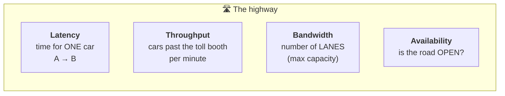
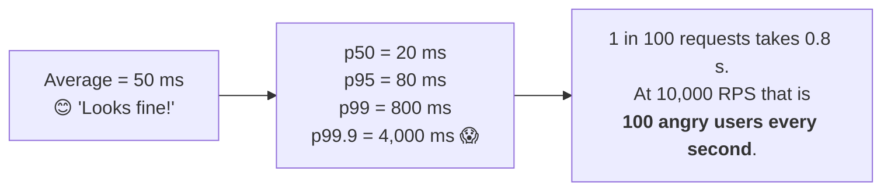
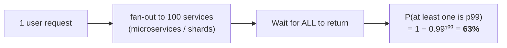
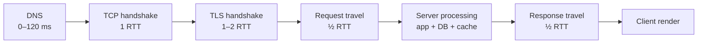
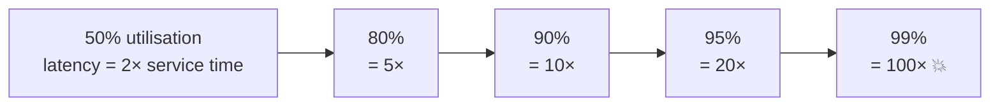
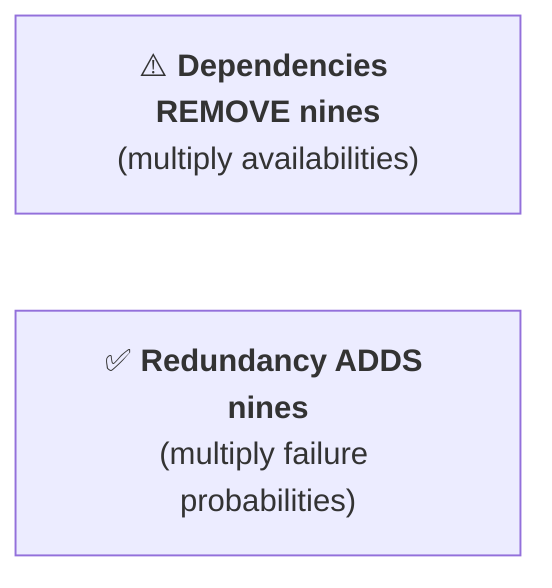

Here is a clear breakdown of these four fundamental performance and reliability metrics in system design:

1. Latency

Latency is the time it takes for a single request to travel from its source to its destination and return a response (often measured as Round Trip Time (RTT) or response time).

Unit of Measurement: Milliseconds (ms) or microseconds ($\mu$s).
Analogy: Think of latency as the time it takes for a single car to travel from Point A to Point B on a highway.
Key Considerations:

Percentiles matter: In system design, average latency can be misleading. Engineers look at p95 or p99 latency (the maximum response time experienced by 95% or 99% of requests) to account for slow tail latencies.
Common causes of high latency: Network distance (geography), disk I/O, heavy computation, or database locks.

2. Throughput

Throughput is the rate at which a system processes requests or processes data over a given unit of time.

Unit of Measurement:

Requests Per Second (RPS) or Queries Per Second (QPS) for web applications.
Operations Per Second (IOPS) for storage/databases.
Bits/Bytes Per Second (bps / Bps) for data pipelines.
Analogy: Continuing the highway analogy, throughput is the total number of cars passing through a toll booth per minute.
Key Difference from Latency: A system can have high throughput even with high latency by handling many requests concurrently/in parallel.

3. Bandwidth

Bandwidth is the maximum theoretical capacity of a communication channel or network link to transmit data over a unit of time.

Unit of Measurement: Megabits per second (Mbps) or Gigabits per second (Gbps).
Analogy: Bandwidth is the width of the highway (the number of lanes available). A 10-lane highway has higher bandwidth than a 2-lane highway.
Relationship with Latency & Throughput:

Bandwidth vs. Throughput: Bandwidth is the maximum potential capacity, whereas throughput is the actual rate of data being processed right now (throughput is bounded by bandwidth).
Bandwidth-Delay Product: Network performance is governed by both bandwidth (capacity) and latency (delay).

4. Availability

Availability measures the percentage of time a system remains operational, functional, and accessible to process requests when needed.

Unit of Measurement: Percentage (e.g., 99.9%, 99.99%), often described as "Nines" of availability.
The "Nines" Breakdown:

99% ("Two Nines"): ~3.65 days of downtime per year.
99.9% ("Three Nines"): ~8.76 hours of downtime per year.
99.99% ("Four Nines"): ~52.6 minutes of downtime per year.
99.999% ("Five Nines"): ~5.26 minutes of downtime per year.
Key Metrics:

MTBF (Mean Time Between Failures): Average operational time before a failure occurs.
MTTR (Mean Time to Repair): Average time required to recover from a failure.
$\text{Availability} = \frac{\text{MTBF}}{\text{MTBF} + \text{MTTR}}$

Summary Comparison

Metric

Focus

Key Question Answered

Latency

Speed / Delay

"How long does one request take?"

Throughput

Rate / Volume

"How many requests can we handle per second?"

Bandwidth

Capacity

"What is the maximum data pipeline width available?"

Availability

Reliability

"Is the system up and working right now?"

https://bytebytego.com/guides/top-5-strategies-to-reduce-latency/

---

# Latency, Throughput, Bandwidth & Availability — Interview Deep Dive

> **Purpose:** turn the four definitions above into the numbers, the math and the reasoning an interviewer actually probes.
> **Sources:** [awesome-system-design-resources](https://github.com/ashishps1/awesome-system-design-resources) · Jeff Dean's "Latency Numbers Every Programmer Should Know" · Google SRE Book · [ByteByteGo — Top 5 Strategies to Reduce Latency](https://bytebytego.com/guides/top-5-strategies-to-reduce-latency/)
> **Companions:** [caching.md](caching.md) · [load-balancer.md](load-balancer.md) · [networking.md](networking.md) · [system-design-interview-playbook.md](system-design-interview-playbook.md) · [README.md](README.md)

---

## Index

| # | Topic | Section |
|---|---|---|
| 1 | The highway analogy — all four metrics in one picture | [§1](#1-one-picture-for-all-four) |
| 2 | **Latency numbers to memorise** | [§2](#2-the-latency-numbers) |
| 3 | **Percentiles** — why the average lies | [§3](#3-percentiles-why-the-average-lies) |
| 4 | ⭐ **Tail latency amplification** | [§4](#4-tail-latency-amplification-the-senior-topic) |
| 5 | Where latency actually comes from — the budget | [§5](#5-the-latency-budget-where-the-time-goes) |
| 6 | **How to reduce latency** — the 10 levers | [§6](#6-the-ten-levers-for-reducing-latency) |
| 7 | Throughput, Little's Law and queueing | [§7](#7-throughput-littles-law--why-queues-explode) |
| 8 | Availability math: nines, series vs parallel, MTBF/MTTR | [§8](#8-availability-math) |
| 9 | SLI / SLO / SLA / error budget | [§9](#9-sli--slo--sla--error-budget) |
| ★ | Rapid-fire Q&A | [§10](#10-rapid-fire-qa) |

---

## 1. One picture for all four

| Metric | Question | Unit | Improve by |
|---|---|---|---|
| **Latency** | How long does **one** request take? | ms / µs | Shorter distance, less work, caching, fewer hops |
| **Throughput** | How many can we do **per second**? | RPS / QPS / IOPS | Parallelism, batching, more servers |
| **Bandwidth** | What's the **maximum** capacity? | Mbps / Gbps | Buy more pipe; compress to need less |
| **Availability** | Is it **working right now**? | % ("nines") | Redundancy, failover, removing SPOFs |

> ⭐ **The relationship that trips people up:** *"Latency and throughput are not the same axis, and improving one can hurt the other. **Batching** raises throughput and **raises** latency. **Parallelism** raises throughput without changing single-request latency. You can have a high-throughput system with terrible p99, and a low-latency system that falls over at 100 RPS."*

**Bandwidth-delay product** = bandwidth × RTT = the amount of data "in flight" on the wire. On a 1 Gbps link with 100 ms RTT that's **12.5 MB**. ⭐ **This is why a small TCP window destroys throughput on long-distance links regardless of how fat the pipe is** — and why CDNs beat bigger pipes.

---

## 2. The latency numbers

> **Memorise the orders of magnitude, not the digits.** The "human scale" column (1 ns → 1 second) is what makes them stick.

| Operation | Latency | If 1 ns = 1 second |
|---|---|---|
| L1 cache reference | 0.5 ns | 0.5 s |
| Branch mispredict | 5 ns | 5 s |
| L2 cache reference | 7 ns | 7 s |
| Mutex lock/unlock | 25 ns | 25 s |
| **Main memory (RAM) reference** | **100 ns** | 1.7 minutes |
| Compress 1 KB with Snappy | 3 µs | 50 minutes |
| Send 1 KB over a 1 Gbps network | 10 µs | 2.8 hours |
| **SSD random read** | **150 µs** | 1.7 days |
| Read 1 MB sequentially from memory | 250 µs | 2.9 days |
| **Round trip inside a datacenter** | **500 µs** | 5.8 days |
| Read 1 MB sequentially from SSD | 1 ms | 11.6 days |
| **HDD disk seek** | **10 ms** | 4 months |
| Read 1 MB sequentially from HDD | 20 ms | 7.8 months |
| **Round trip California → Netherlands** | **150 ms** | 4.8 years |

### The three ratios that justify entire architectures

| Comparison | Ratio | What it justifies |
|---|---|---|
| RAM (100 ns) vs SSD (150 µs) | **~1,500×** | **Caching** — [caching.md](caching.md) |
| SSD (150 µs) vs HDD seek (10 ms) | **~70×** | SSDs, and why random I/O patterns matter |
| Datacenter RTT (0.5 ms) vs cross-continent (150 ms) | **~300×** | **CDNs, edge compute, regional replicas** |

**Real-world network RTTs to quote:**

| Path | RTT |
|---|---|
| Same rack | ~0.1 ms |
| Same AZ | ~0.5 ms |
| Cross-AZ (same region) | **~1 ms** |
| Cross-region US East ↔ US West | ~60 ms |
| US ↔ Europe | ~80–100 ms |
| US ↔ India / Australia | ~200–300 ms |
| Mobile 4G (first byte) | ~50–100 ms |
| Satellite (geostationary) | ~600 ms |

⚠️ **The speed of light is a hard floor.** Light in fibre travels ~200,000 km/s. New York → London is ~5,600 km, so the *theoretical* minimum RTT is **~56 ms**. No amount of engineering beats physics — the only fix is **to not cross the ocean**, which is exactly what a CDN does.

### Human perception thresholds (useful for justifying targets)

| Delay | Feels like |
|---|---|
| < 100 ms | **Instantaneous** |
| 100–300 ms | Perceptible but responsive |
| 300 ms–1 s | Noticeable delay; attention starts to wander |
| > 1 s | Flow of thought interrupted |
| > 10 s | User gives up |

> ⭐ **Business framing that impresses:** *"Amazon found every 100 ms of latency cost about 1% in sales; Google found 500 ms extra cut traffic ~20%. So a latency budget isn't an engineering nicety — it's a revenue number, and that's how I'd justify the CDN spend."*

---

## 3. Percentiles — why the average lies

| Percentile | Meaning | Who feels it |
|---|---|---|
| **p50 (median)** | Half of requests are faster | The typical user |
| **p95** | 1 in 20 is slower | Noticeable |
| **p99** ⭐ | 1 in 100 is slower | **The standard SLO target** |
| **p99.9** | 1 in 1,000 | Your biggest, most valuable customers |
| **max** | The worst one | Usually a GC pause, a cold start, or a retry |

> ⭐ **The insight that separates levels:** *"**Your most valuable customers experience your worst latency.** A power user who makes 100 requests to render one page has roughly a 63% chance of hitting at least one p99 request — $1 - 0.99^{100} = 63\%$. So the average is meaningless; I'd set SLOs on p99 and alert on p99.9."*

⚠️ **Never average percentiles.** The mean of five servers' p99 values is not the fleet p99. You must aggregate the underlying histograms — which is exactly what t-digest / Prometheus histograms exist for. Saying this is a strong signal.

**What causes tail latency (the p99 checklist):**
GC pauses · cold caches / cold starts · lock contention · queueing behind a slow request · noisy neighbours · retries · connection setup (TCP + TLS handshake) · slow disks · **head-of-line blocking** · a single hot shard · a rehash or resize pause.

---

## 4. Tail latency amplification (the senior topic)

> **When one user request fans out to many backend calls, you don't get the average — you get close to the *worst*.**

$$P(\text{slow request}) = 1 - (1-p)^{N}$$

| Fan-out N | Chance of hitting at least one p99 |
|---|---|
| 1 | 1% |
| 10 | **9.6%** |
| 100 | **63%** |
| 1,000 | **99.99%** |

**The fixes — name at least three:**

| Technique | How it works |
|---|---|
| **Hedged / backup requests** ⭐ | If a response hasn't arrived by p95, fire a duplicate to another replica and take the first answer. Google reported cutting p99.9 dramatically for ~2% extra load |
| **Tied requests** | Send to two replicas; the first to *start* work cancels the other |
| **Reduce the fan-out** | Batch, denormalise, or precompute so one request touches fewer services |
| **Return partial results** | Answer with 95 of 100 shards after a deadline — Google Search does this |
| **Deadline propagation** | Pass the remaining budget down; a service that can't finish in time fails fast instead of wasting work |
| **Outlier ejection** | Remove consistently slow instances from the pool ([load-balancer.md](load-balancer.md)) |
| **Reduce head-of-line blocking** | HTTP/2 → HTTP/3, smaller work units, separate queues per priority |

---

## 5. The latency budget — where the time goes

**A concrete cold-start budget for a user in India hitting a US East server (~200 ms RTT):**

| Step | Cost |
|---|---|
| DNS (uncached) | ~80 ms |
| TCP handshake | 200 ms |
| TLS 1.3 handshake | 200 ms |
| Request + response | 200 ms |
| Server processing | 50 ms |
| **Total** | **~730 ms** — and only **50 ms** of it was your code |

> ⭐ **The conclusion that wins the point:** *"Seven-eighths of that is network round trips, so optimising my SQL query is nearly pointless. The wins are, in order: **terminate TLS at an edge PoP near the user** (kills 3 RTTs of 200 ms and replaces them with ~20 ms), **reuse connections**, and **cache at the edge**. Latency optimisation is mostly about removing round trips and distance, not about making code faster."*

---

## 6. The ten levers for reducing latency

| # | Lever | Typical win |
|---|---|---|
| 1 | **Cache** (browser → CDN → app → Redis → DB buffer) | 10–1000× on hits → [caching.md](caching.md) |
| 2 | **Move closer to the user** — CDN, edge compute, regional replicas | Removes 100s of ms of RTT |
| 3 | **Reduce round trips** — connection reuse/pooling, HTTP/2 multiplexing, TLS 1.3 0-RTT, batching | 1–3 RTT each |
| 4 | **Do less work per request** — index the query, remove N+1s, precompute | Often the biggest code-level win |
| 5 | **Do it asynchronously** — return `202` and finish in a worker | Turns 30 s into 20 ms |
| 6 | **Compress** — gzip/brotli, binary protocols (protobuf), smaller images (WebP/AVIF) | Less bytes = less transfer time |
| 7 | **Parallelise** the fan-out instead of chaining it | Sum → max |
| 8 | **Prefetch / preconnect / predict** | Hides latency entirely |
| 9 | **Right-size the pool** — avoid queueing (see Little's Law below) | Prevents the exponential blow-up |
| 10 | **Kill the tail** — hedged requests, outlier ejection, GC tuning, warm-up/slow start | p99 and p99.9 |

---

## 7. Throughput, Little's Law & why queues explode

### Little's Law — the one formula to know

$$L = \lambda \times W$$

**concurrency = arrival rate × response time**

**Worked example:** a service handles **1,000 RPS** with an average latency of **200 ms**.
$$L = 1000 \times 0.2 = 200 \text{ concurrent requests}$$
So you need **at least 200 threads/connections** in flight. If your pool is 100, requests queue, latency rises, and $W$ grows — which increases $L$ further. **That's the death spiral.**

> ⭐ **Use it in reverse to size things:** *"With a 50 ms target latency and 4,000 RPS, I need 200 concurrent slots. At 50 concurrent requests per instance that's 4 instances, plus headroom, plus multi-AZ redundancy — call it 8."*

### Why latency explodes near capacity

For an M/M/1 queue, the average wait is:

$$W = \frac{1}{\mu - \lambda}$$

> ⭐ **The operational rule this gives you:** *"Never run a latency-sensitive service above ~70% utilisation. The last 20% of capacity costs you 5× the latency. That's why autoscaling targets 60–70% CPU rather than 95% — you're buying **queueing headroom**, not wasting money."*

### Throughput ceilings

**Amdahl's Law:** if a fraction $s$ of the work is serial, maximum speedup is $1/s$. **5% serial work caps you at 20×, no matter how many cores.** In a system design this means: find the serial bottleneck (a single leader, a global lock, one hot shard) — adding servers past it does nothing.

**Universal Scalability Law** goes further: beyond a point, **added nodes make throughput *worse*** because of coordination/crosstalk. This is why "just add more servers" eventually stops working.

---

## 8. Availability math

| Nines | Downtime/year | Downtime/month | Downtime/week | What it takes |
|---|---|---|---|---|
| 90% | 36.5 days | 72 h | 16.8 h | — |
| 99% | 3.65 days | 7.2 h | 1.68 h | Single server |
| **99.9%** | **8.76 h** | **43.8 min** | 10.1 min | Redundancy + monitoring |
| **99.99%** | **52.6 min** | **4.4 min** | 1 min | Multi-AZ + automated failover |
| **99.999%** | **5.26 min** | **26 s** | 6 s | Multi-region, zero human in the loop |
| 99.9999% | 31.5 s | 2.6 s | 0.6 s | Very few systems genuinely need this |

$$\text{Availability} = \frac{MTBF}{MTBF + MTTR}$$

> ⭐ **The insight:** *"You can improve availability by making failures rarer (raise MTBF) or by **recovering faster** (lower MTTR). In practice **MTTR is far cheaper to improve** — automated failover, fast rollback, good runbooks and good alerting beat trying to make software never fail."*

### Series vs parallel — the math interviewers love

**In series (dependencies multiply):**
$$A_{total} = A_1 \times A_2 \times \dots \times A_n$$

5 components each at 99.9% → $0.999^5 = 99.5\%$ → **43 hours** of downtime a year, from components that individually looked great.

**In parallel (redundancy):**
$$A_{total} = 1 - (1 - A)^n$$

Two servers at 99% each → $1 - 0.01^2 = 99.99\%$. Three → 99.9999%.

> ⭐ **Say this:** *"Every synchronous dependency I add to the critical path lowers my ceiling. So I'd make the recommendation service **non-critical** — if it's down, the page renders without recommendations. Turning a hard dependency into a soft one is often the cheapest availability improvement available."*

⚠️ **Correlated failures break the parallel math.** Three replicas in the *same AZ* don't give you 99.9999% — one power event takes all three. Redundancy only multiplies if the failures are **independent**, which is the entire reason for multi-AZ and multi-region.

---

## 9. SLI / SLO / SLA / error budget

| Term | Meaning | Example |
|---|---|---|
| **SLI** | The measurement | "% of requests served in < 300 ms" |
| **SLO** | Your internal target | "99.9% over a rolling 28 days" |
| **SLA** | The external contract, with penalties | "99.5% or you get service credits" |
| **Error budget** ⭐ | `100% − SLO` — the failure you're *allowed* | 99.9% → **43 min/month** |

> ⭐ **The error-budget argument, verbatim:** *"The error budget converts reliability from an opinion into a number. Budget remaining → ship features and take risks. Budget exhausted → freeze feature work and fix reliability. And it says something counter-intuitive: if you're at 100% availability, you're **over**-invested in reliability and under-invested in shipping."*

⚠️ **Always set the SLA looser than the SLO.** If you promise customers 99.9% and target 99.9% internally, you breach the contract the first time you miss. Target 99.95% internally, promise 99.9%.

**Alert on symptoms, not causes:** page on "checkout p99 > 1 s" or "error rate > 1%", not "CPU > 80%". High CPU may be perfectly healthy, and non-actionable pages train people to ignore alerts.

---

## 10. Rapid-fire Q&A

| Question | Answer |
|---|---|
| **Latency vs throughput?** | Latency is time for one request; throughput is requests per second. Batching improves throughput and worsens latency; parallelism improves throughput without changing single-request latency. |
| **Throughput vs bandwidth?** | Bandwidth is the theoretical maximum capacity; throughput is the actual rate achieved. Throughput ≤ bandwidth. |
| **What is the bandwidth-delay product?** | bandwidth × RTT — the data in flight. It's why a small TCP window throttles throughput on long links regardless of pipe size. |
| **Why use p99 instead of the average?** | The average hides the tail. Averages look fine while 1 in 100 users has a terrible experience — and heavy users hit the tail almost every session. |
| **Can you average p99 across servers?** | **No.** You must aggregate the underlying histograms; averaging percentiles is mathematically meaningless. |
| **What is tail latency amplification?** | With fan-out N, the chance of hitting at least one slow call is $1-(1-p)^N$ — 63% at N=100 with a 1% p99. |
| **How do you fix tail latency?** | Hedged/backup requests, reduce fan-out, partial results, deadline propagation, outlier ejection, GC and warm-up tuning. |
| **What is Little's Law?** | concurrency = arrival rate × latency. Use it to size thread/connection pools and to spot the queueing death spiral. |
| **Why not run servers at 95% CPU?** | Queueing theory: wait time is $1/(\mu-\lambda)$, so latency explodes near saturation. ~70% is the practical ceiling for latency-sensitive services. |
| **What's the minimum possible latency NY → London?** | ~56 ms round trip, set by the speed of light in fibre. You can't optimise past physics — you relocate the compute instead. |
| **How much downtime is 99.99%?** | ~52 minutes a year, ~4.4 minutes a month. |
| **What does 5 dependencies at 99.9% give you?** | 99.5% — about 43 hours a year. Dependencies multiply and remove nines. |
| **How does redundancy help?** | Failure probabilities multiply: two 99% servers give 99.99% — **but only if the failures are independent**, which is why multi-AZ matters. |
| **MTBF vs MTTR — which do you optimise?** | Usually MTTR. Recovering fast is far cheaper than never failing, and it improves availability just as much. |
| **SLI vs SLO vs SLA?** | Measurement, internal target, external contract. `100% − SLO` is your error budget. |
| **How would you reduce latency for global users?** | CDN + edge TLS termination + regional replicas + connection reuse + caching. Removing round trips and distance beats optimising code. |
| **What are the top causes of p99 spikes?** | GC pauses, cold starts, lock contention, queueing, retries, connection setup, hot shards, noisy neighbours. |
