# Load Balancers, Reverse Proxies, L4/L7 Routing, Health Checks & Sticky Sessions — Principal Engineer Masterclass

> **Purpose:** Zero → Expert. Every section = *concept → flow chart → concrete example → failure mode → what a Principal Engineer says in the interview.*
>
> **Sources consolidated:**
> 1. [System Design Interview – An Insider's Guide, Ch.1 (Alex Xu)](https://medium.com/@iam-abdulmoiz/system-design-interview-an-insider-guide-by-alex-xu-chapter-1-7496adb09fb5) — scale-from-zero-to-millions narrative
> 2. [Hello Interview — Key Technologies](https://www.hellointerview.com/learn/system-design/in-a-hurry/key-technologies) — the L4-vs-L7 rule of thumb, interview delivery
> 3. [AlgoMaster — Design a Load Balancer](https://algomaster.io/learn/system-design-interviews/design-load-balancer) — full HLD, control/data plane split, capacity math
> 4. [GeeksforGeeks — Load Balancer Interview Question](https://www.geeksforgeeks.org/system-design/load-balancer-system-design-interview-question/) — 37 rapid-fire Q&A
> 5. [Nitiz Sharma — 30 Advanced LB Interview Questions](https://nitizsharma.com/load-balancer-interview-questions/) — enterprise/network-engineer angle
> 6. [CrackTheOffer — Load Balancing Interview Guide](https://www.cracktheoffer.com/system-design-load-balancing) — the 6-step framework + weak vs strong answer
> 7. [CrackLab — L4 vs L7, Algorithms, Health Checks](https://cracklab.in/system-design/load-balancing) — trade-offs and pitfalls
> 8. [Exponent — Load Balancers in System Design](https://www.tryexponent.com/blog/load-balancers-system-design-interview) — reverse proxy framing
> 9. [DevGenius — Layer 4 vs Layer 7 Load Balancers](https://blog.devgenius.io/layer-4-load-balancers-and-layer-7-load-balancers-4be18abfa47b)
> 10. [Medium — System Design **Mock Interview**: Load Balancing (Yash Marathe)](https://medium.com/system-design-interviews-simplified/system-design-mock-interview-load-balancing-0541de44f819) — the 8-round interview transcript, the "trick question" (sticky sessions vs auto-scaling), the restaurant analogy, and the design-pitfalls list
> 11. Production references: Google **Maglev** paper, Meta **Katran/Shiv**, Cloudflare **Unimog**, **Envoy** docs, **HAProxy/NGINX** docs, **Amazon Builders' Library — Implementing Health Checks**
>
> **Companion notes in this repo:** [caching.md](caching.md) · [DNS.md](DNS.md) · [latency.md](latency.md) · [rest-api.md](rest-api.md) · [high-level-system-design-cocept.md](high-level-system-design-cocept.md)

---

## Syllabus Coverage Index

| # | Topic | Section |
|---|---|---|
| **0** | The one rule · why "I'll add a load balancer" is not an answer | [§0](#0-the-one-rule) |
| **1** | Absolute beginner: what problem does an LB solve | [§1](#1-level-0--the-problem-before-the-solution) |
| | 🍽️ **The restaurant analogy** — the whole document, explained to someone who knows nothing | [§1.4](#14-the-restaurant-analogy--the-whole-document-in-one-story) |
| | The OSI model, only the parts that matter | [§2](#2-the-osi-refresher--the-only-4-layers-you-need) |
| | Proxy taxonomy: forward proxy · reverse proxy · LB · API gateway · ingress · sidecar | [§3](#3-the-proxy-family-tree--forward-vs-reverse-vs-lb-vs-gateway) |
| **2** | The full request path: DNS → anycast → GSLB → L4 → L7 → pod | [§4](#4-the-complete-request-path--the-diagram-you-should-draw) |
| | Every place an LB appears in one real architecture | [§4.2](#42-every-place-a-load-balancer-appears-in-one-architecture) |
| **3** | **L4 load balancing deep dive** — NAT, DSR, tunneling, flow tables | [§5](#5-layer-4-load-balancing--deep-dive) |
| | **L7 load balancing deep dive** — TLS, content routing, buffering, HTTP/2 | [§6](#6-layer-7-load-balancing--deep-dive) |
| | **L4 vs L7 decision flow chart + comparison table** | [§7](#7-l4-vs-l7--the-decision-flow-chart) |
| **4** | **Algorithms** with worked numeric examples · P2C · consistent hashing · Maglev | [§8](#8-load-balancing-algorithms--with-worked-numbers) |
| | Why "least connections" quietly breaks in an LB **fleet** | [§8.9](#89-the-distributed-least-connections-trap-principal-level) |
| **5** | **Health checks** — active/passive, liveness vs readiness, thresholds math | [§9](#9-health-checks--the-most-underrated-topic) |
| | Deep health checks → **fleet-wide outage** · fail-open · panic mode | [§9.5](#95-the-deep-health-check-outage--the-1-story-that-signals-seniority) |
| | Outlier detection, flapping, slow start, **connection draining** | [§9.6](#96-outlier-detection-passive-ejection)–[§9.9](#99-connection-draining--graceful-shutdown) |
| **6** | **Sticky sessions** — 3 mechanisms, failure modes, the stateless alternative | [§10](#10-sticky-sessions-session-affinity) |
| | Consistent hashing **with bounded loads** — the modern answer | [§10.6](#106-consistent-hashing-with-bounded-loads--the-modern-answer) |
| **7** | **Reverse proxies** — what they add beyond balancing; NGINX/HAProxy/Envoy | [§11](#11-reverse-proxies--the-other-half-of-the-question) |
| **8** | HA of the LB itself — VIP/VRRP, ECMP, anycast, cloud LB internals | [§12](#12-who-load-balances-the-load-balancer) |
| **9** | **Resilience** — retries, retry budgets, circuit breaking, load shedding | [§13](#13-overload--resilience-principal-engineer-territory) |
| **10** | Multi-AZ / multi-region · GSLB · zonal affinity · cross-zone cost | [§14](#14-multi-az-and-multi-region) |
| **11** | Client-side LB, gRPC, service mesh, xDS, east-west traffic | [§15](#15-client-side-load-balancing--service-mesh) |
| **12** | Security at the LB — XFF spoofing, request smuggling, TLS policy | [§16](#16-security-at-the-load-balancer-owasp-relevant) |
| **13** | Observability & SLOs | [§17](#17-observability--what-to-alert-on) |
| **14** | Real systems: Maglev · Katran · Unimog · AWS ALB/NLB internals | [§18](#18-how-the-giants-actually-do-it) |
| **★** | **Case study A** — design an LB for 1M RPS (full numbers) | [§19](#19-case-study-a--design-a-load-balancer-for-1m-rps) |
| **★** | **Case study B** — WebSocket / chat fan-out (the hard one) | [§20](#20-case-study-b--websockets-the-question-that-separates-levels) |
| **★** | Interview framework · weak vs strong answer · what to say when | [§21](#21-the-interview-framework) |
| **★** | **Full mock interview** — 8 rounds, baseline vs Principal answer | [§21.4](#214-the-full-mock-interview--8-rounds-baseline-vs-principal-answer) |
| **★** | **The trick question** — sticky sessions meet auto-scaling | [§21.5](#215-the-trick-question--sticky-sessions-meet-auto-scaling) |
| **★** | Rapid fire — 45 Q&A | [§22](#22-rapid-fire--45-interview-answers) |
| **★** | Anti-patterns & red flags | [§23](#23-anti-patterns--interview-red-flags) |
| **★** | Config cheat sheet — NGINX · HAProxy · Envoy · Kubernetes | [§24](#24-config-cheat-sheet) |
| **★** | Principal-engineer signal checklist | [§25](#25-the-principal-engineer-signal-checklist) |

---

## 0. The One Rule

> **"I'll put a load balancer in front" is NOT a design answer.**

Anyone can draw a box labelled `LB`. The design starts when you answer:

1. **Which layer** does it operate at, and *why* — L4 or L7?
2. **What does it do when a backend is slow** (not dead — *slow*)?
3. **What does it do when the load balancer itself dies?**
4. **What is the state** it holds, and what happens when that state is lost?
5. **Who load balances the load balancer?**

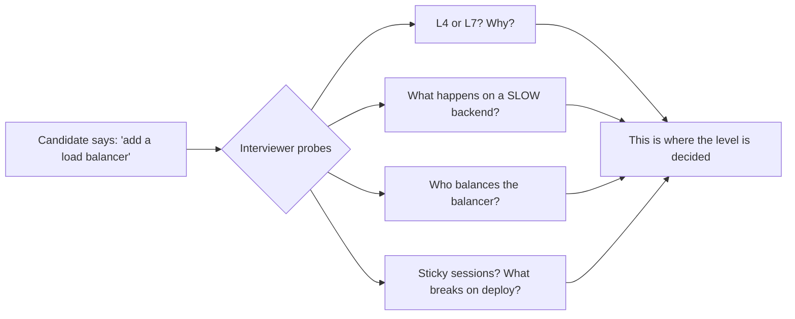

**Level calibration (what interviewers grade):**

| Level | Expected depth |
|---|---|
| Mid (L4/SDE2) | Knows an LB distributes traffic; names round robin; knows health checks exist |
| Senior (L5) | Chooses L4 vs L7 with reasons; picks an algorithm tied to traffic shape; handles LB HA; knows stickiness trade-offs |
| Staff (L6) | Discusses failure modes: retry storms, draining, flapping, hot shards; connection-level vs request-level balancing; capacity math |
| **Principal (L7+)** | **Reasons about the *control plane*, blast radius, fail-open semantics, cross-AZ cost, migration/rollout of LB config, and the organisational/operational cost of the choice** |

---

## 1. Level 0 — The Problem Before the Solution

### 1.1 One server, one problem

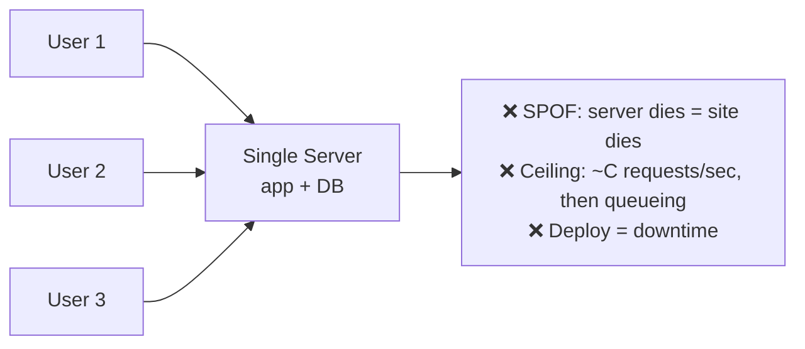

Two independent problems, often confused:

| Problem | Symptom | Fix |
|---|---|---|
| **Single point of failure** | Server dies → 100% outage | Redundancy: N servers |
| **Capacity ceiling** | Latency climbs, then timeouts | Horizontal scale: N servers |
| **Deploy downtime** | Restart = outage | Rolling deploy across N servers |

All three need **N servers** — and the moment you have N servers you need *something* to decide which one gets each request. That "something" is the load balancer.

### 1.2 Vertical vs horizontal scaling

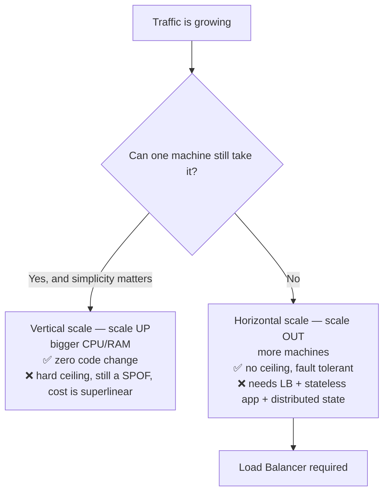

> **Interview line:** *"Vertical scaling buys you time; horizontal scaling buys you a system. The load balancer is the price of admission to horizontal scaling — and it's also the new single point of failure I now have to design away."*

### 1.3 What an LB actually buys you

| Benefit | Mechanism |
|---|---|
| **Availability** | Health checks remove dead backends; request never reaches them |
| **Scalability** | Add capacity by registering more backends; no client change |
| **Performance** | Spread load → lower queueing delay → lower p99 |
| **Zero-downtime deploys** | Drain → deploy → re-add, one instance at a time |
| **Abstraction / decoupling** | Clients know one stable VIP/DNS name, not N server IPs |
| **Security chokepoint** | TLS termination, WAF, rate limiting, DDoS scrubbing, hides backend IPs |
| **Operational lever** | Canary %, blue/green cutover, traffic mirroring, kill switch |

⚠️ **What an LB does NOT fix** (say this out loud — it earns credit):
> *"A load balancer distributes load; it does not reduce it. If my p99 is bad because of an N+1 query or a lock-contended code path, adding servers behind an LB just buys me more places to be slow. Balancing is not a substitute for fixing the workload."*

### 1.4 The restaurant analogy — the whole document in one story

If you know *nothing* about load balancing, start here. Every advanced concept in this file maps onto one restaurant.

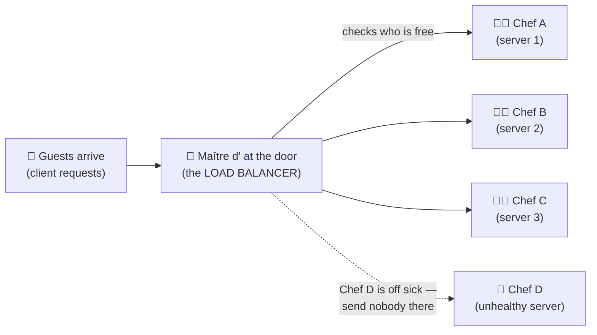

**Without a Maître d':** one chef, 100 guests rush in at 8 p.m. Food comes out slowly, people leave, and if that one chef gets sick the restaurant simply closes. That is a single server: a capacity ceiling *and* a single point of failure.

**With a Maître d':** guests only ever talk to the host. The host knows which chefs are free, applies a seating rule, and delivers the food back. Guests never see the kitchen — exactly like a reverse proxy hiding your backends.

| Restaurant | System | Covered in |
|---|---|---|
| The Maître d' at the door | **Load balancer / reverse proxy** | [§3](#3-the-proxy-family-tree--forward-vs-reverse-vs-lb-vs-gateway) |
| Guests only see the host, never the kitchen | Backends are hidden; clients hit one VIP/DNS name | [§11](#11-reverse-proxies--the-other-half-of-the-question) |
| "Next guest to Chef A, then B, then C" | **Round robin** | [§8.1](#81-round-robin) |
| "Chef A is our fastest, give him double" | **Weighted round robin** | [§8.2](#82-weighted-round-robin--and-smooth-wrr-the-detail-that-impresses) |
| "Chef C has the fewest open orders" | **Least connections** | [§8.3](#83-least-connections--least-outstanding-requests) |
| "Glance at two chefs, pick the less busy one" | **Power of two choices** | [§8.5](#85--power-of-two-choices-p2c--the-algorithm-that-separates-staff-from-senior) |
| "This table always gets Chef D" | **Sticky session / affinity** | [§10](#10-sticky-sessions-session-affinity) |
| Host peeks at the ticket: steak → grill, dessert → pastry | **L7 content-based routing** | [§6](#6-layer-7-load-balancing--deep-dive) |
| Host just counts heads and points at a door | **L4 connection routing** | [§5](#5-layer-4-load-balancing--deep-dive) |
| "Chef, are you standing up?" | **Shallow health check** ✅ correct for routing | [§9.2](#92-the-four-kinds-of-health-kubernetes-vocabulary-universally-applicable) |
| "Chef, did the fish delivery arrive?" — *every* chef says no, so the host declares the restaurant closed | **Deep health check outage** ❌ the classic disaster | [§9.5](#95-the-deep-health-check-outage--the-1-story-that-signals-seniority) |
| "More than half the kitchen looks unwell? Seat people anyway — a slow meal beats a locked door" | **Fail-open / panic mode** | [§9.5](#95-the-deep-health-check-outage--the-1-story-that-signals-seniority) |
| Chef finishing his last orders before his shift ends — no new tickets | **Connection draining** | [§9.9](#99-connection-draining--graceful-shutdown) |
| New chef starts on simple dishes for the first 30 minutes | **Slow start** | [§9.8](#98-slow-start-warm-up) |
| Kitchen is 40 min behind → turn people away at the door instead of seating them | **Load shedding** | [§13.3](#133-load-shedding--backpressure) |
| "We've stopped taking orders for the soufflé for now" | **Circuit breaker** | [§13.2](#132-circuit-breaking) |
| Every tab is on the central till, not memorised by one chef | **External session store** ⇒ no stickiness needed | [§10.4](#104-the-right-answer-dont-be-stateful) |
| One host, and he faints | **The LB is now the SPOF** | [§12](#12-who-load-balances-the-load-balancer) |
| Two hosts sharing the podium, one steps in instantly | **Active-active / VIP failover** | [§12](#12-who-load-balances-the-load-balancer) |
| Branches in five cities; you're sent to the nearest open one | **GSLB / anycast** | [§14](#14-multi-az-and-multi-region) |

> **Why this is worth memorising:** in a real interview you occasionally have to explain a concept to a non-specialist on the panel (a PM, an EM, a partner-team architect). Being able to switch registers — rigorous by default, plain-language on demand — is itself a Principal-level signal.

---

## 2. The OSI Refresher — The Only 4 Layers You Need

You cannot discuss "L4 vs L7" without being fluent here. Skip the memorised 7-layer list; internalise **what data is visible at each layer.**

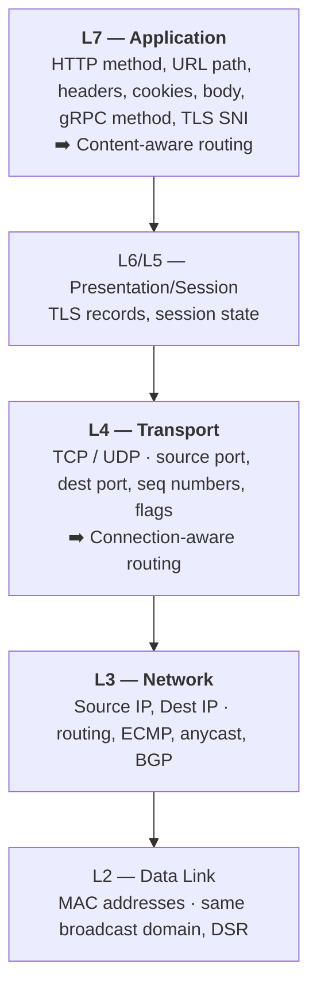

### 2.1 The 5-tuple — the atom of L4

A TCP "flow"/connection is identified by:

```
(protocol, source IP, source port, destination IP, destination port)
  TCP      203.0.113.9  51514        198.51.100.7        443
```

An **L4 load balancer's entire world is this 5-tuple.** It cannot see `GET /api/orders`. It cannot see a cookie. It cannot see anything inside TLS.

### 2.2 What is visible where — the table that answers 80% of L4/L7 questions

| Data | Visible at L3 | Visible at L4 | Visible at L7 (TLS terminated) | Visible at L7 (TLS passthrough) |
|---|---|---|---|---|
| Client IP | ✅ | ✅ | ✅ | ✅ |
| Destination port (443) | ❌ | ✅ | ✅ | ✅ |
| TLS **SNI** (hostname) | ❌ | ⚠️ only by peeking at the ClientHello | ✅ | ✅ (ClientHello is plaintext) |
| HTTP path `/api/v2/orders` | ❌ | ❌ | ✅ | ❌ |
| HTTP headers / cookies | ❌ | ❌ | ✅ | ❌ |
| Request body | ❌ | ❌ | ✅ | ❌ |
| Response status code | ❌ | ❌ | ✅ | ❌ |

> **Key nuance most candidates miss:** the TLS `ClientHello` — including **SNI** and **ALPN** — is sent *in the clear*. So an "L4" balancer can do **SNI-based routing** without terminating TLS. This is how multi-tenant TLS-passthrough ingress works. (And ECH / Encrypted Client Hello is now closing that door — a great forward-looking remark.)

---

## 3. The Proxy Family Tree — Forward vs Reverse vs LB vs Gateway

This is a *guaranteed* interview question ("what's the difference between a reverse proxy and a load balancer?"). Most candidates fumble it. Here is the crisp mental model.

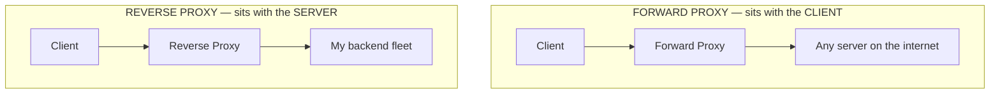

| | **Forward proxy** | **Reverse proxy** |
|---|---|---|
| Whose side | Client's | Server's |
| Who knows it exists | The client configured it | Nobody — client thinks it *is* the server |
| Hides | The **client** from the server | The **servers** from the client |
| Typical use | Corporate egress filtering, VPN, anonymity, caching for a campus | TLS termination, load balancing, caching, WAF, compression |
| Examples | Squid, corporate proxy, Tor | NGINX, HAProxy, Envoy, Cloudflare, ALB |

### 3.1 So is a load balancer a reverse proxy?

> **The answer that scores:** *"A load balancer is a **role**; a reverse proxy is an **architectural position**. Every L7 load balancer is a reverse proxy, but not every reverse proxy load-balances — a reverse proxy in front of a single origin doing TLS termination and caching is still a reverse proxy. And an L4 load balancer using Direct Server Return isn't a full proxy at all: it only touches the ingress packets and never sees the response."*

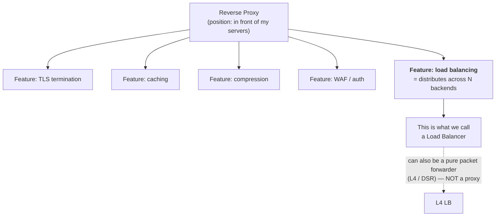

### 3.2 The full spectrum — LB vs API Gateway vs Ingress vs Service Mesh

| Component | Layer | Primary job | Also does | Interview trigger |
|---|---|---|---|---|
| **L4 LB** (NLB, Maglev, Katran, IPVS) | 4 | Spread *connections* | Static IP, extreme throughput, non-HTTP | "WebSockets", "millions of pps", "TCP/UDP", "preserve source IP" |
| **L7 LB / Reverse proxy** (ALB, NGINX, HAProxy, Envoy) | 7 | Spread *requests* | TLS, path routing, retries, compression | "route /api vs /static", "canary", "header-based routing" |
| **API Gateway** (Kong, Apigee, AWS API GW) | 7 | *Policy* enforcement per API | AuthN/AuthZ, rate limit, quota, API keys, request transform, monetisation, schema validation, aggregation | "microservices", "public API", "throttle per customer" |
| **Ingress Controller** (K8s) | 7 | Map external traffic → cluster Services | Usually *is* NGINX/Envoy/Traefik under the hood | "Kubernetes" |
| **Service Mesh sidecar** (Envoy/Istio, Linkerd) | 4+7 | Balance **east-west** (service↔service) | mTLS, retries, circuit breaking, tracing, per-request LB | "internal service calls", "zero trust", "gRPC" |
| **GSLB / DNS LB** (Route 53, NS1, Akamai) | DNS | Pick a **region/DC** | Geo, latency, weighted, failover routing | "multi-region", "disaster recovery" |
| **CDN** (CloudFront, Cloudflare) | 7 + edge | Serve/cache at the edge | Anycast, DDoS, TLS at edge, edge compute | "global users", "static assets" |

> **Principal-level framing:** *"These are not competing choices — they're layers of a funnel. In a mature system a single request can traverse: anycast edge → DDoS scrubbing → CDN → GSLB decision → regional L4 LB → L7 LB/ingress → sidecar → process. Each layer exists because it owns a different failure domain and a different unit of decision: DNS picks a region, L4 picks a machine, L7 picks a request handler, the mesh picks a peer. Collapsing layers reduces latency and cost but couples failure domains."*

### 3.3 API Gateway vs Load Balancer — the clean one-liner

> *"A load balancer answers **'which instance?'**. An API gateway answers **'is this call allowed, and in what shape?'**. You need both; you often deploy the gateway *behind* an LB because the gateway itself is horizontally scaled."*

---

## 4. The Complete Request Path — The Diagram You Should Draw

This is the single diagram that demonstrates you understand where every component fits. Learn to draw it in 60 seconds.

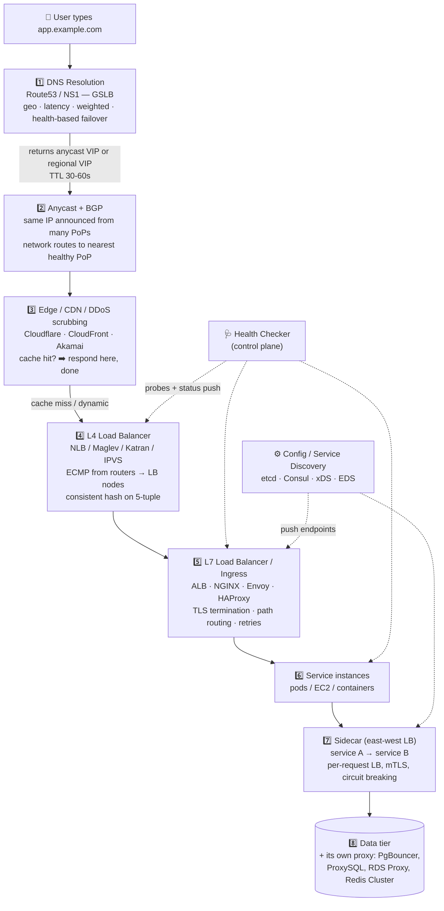

### 4.1 Why the L4 → L7 sandwich exists (a top-tier talking point)

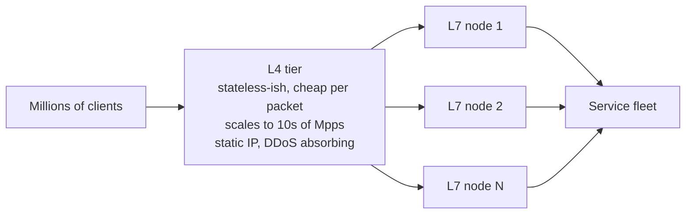

> *"L7 proxies are expensive per request — TLS handshakes, HTTP parsing, buffering. So you can't have just one. But if you have N of them, something must spread traffic across them, and that something has to be cheap and highly available. That's the L4 tier. The L4 tier is the load balancer for the load balancers. Above it, ECMP in the routers is the load balancer for the L4 tier, and above that anycast+BGP is the load balancer for the PoPs. **It's turtles all the way down, but each turtle is cheaper and dumber than the one below it.**"*

### 4.2 Every place a load balancer appears in one architecture

A common interview question is *"where in a real system does load balancing actually happen?"* — the expected answer is more than "in front of the web servers."

| # | Placement | What you'd use | Why / the nuance |
|---|---|---|---|
| 1 | **Edge — internet → web/API tier** (north-south) | **L7** (ALB, NGINX, Envoy), often behind an L4 tier | TLS termination, `/users` → user-svc, `/products` → product-svc, WAF, rate limiting, canary weights |
| 2 | **Service → service** (east-west) | Internal L4/L7 LB, or **client-side LB** | At scale this traffic is 5–10× north-south. A central proxy here adds a hop and a SPOF | 
| 3 | **Service mesh sidecar** | Envoy + xDS (Istio, Consul, Linkerd) | Per-request balancing, mTLS, retries, circuit breaking — pushed into the pod, not a shared appliance ([§15](#15-client-side-load-balancing--service-mesh)) |
| 4 | **Database read replicas** | ⚠️ **Not** a generic L4 LB — use a protocol-aware proxy: ProxySQL, PgBouncer, RDS Proxy, Vitess, MaxScale | A plain L4 LB can't split reads from writes, can't pool connections, and can't route around **replica lag**. Writes still go to the primary ([§11.4](#114-the-proxy-at-the-data-tier-often-forgotten--mention-it)) |
| 5 | **Cache tier** | **Consistent hashing** in the client or a proxy (Twemproxy, Redis Cluster, Envoy Redis filter) | Locality is the point — round robin would destroy the hit rate ([§8.7](#87-consistent-hashing--virtual-nodes)) |
| 6 | **Queue workers** | 🚫 **No load balancer at all** | Workers **pull** from the queue (competing consumers). Pull is *self-balancing*: a slow worker simply takes fewer messages. Pushing work at workers through an LB re-introduces the overload problem the queue existed to solve |
| 7 | **Global / multi-region** | **GSLB / GeoDNS** (Route 53, NS1) + **anycast** | Sends users to the nearest healthy region; also the disaster-recovery lever ([§14](#14-multi-az-and-multi-region)) |
| 8 | **CDN / edge PoPs** | Anycast + edge LB (Cloudflare Unimog, CloudFront) | Most requests should never reach your origin at all |

> **Two upgrades that score here.**
> **(a) The queue correction:** *"I'd push back gently on 'load balance the workers' — with a queue the workers pull, so distribution is emergent and naturally backpressured. The load balancing question for a worker fleet isn't 'which worker?', it's 'how many workers?' — that's an autoscaling problem keyed on queue depth or age, not an LB problem."*
> **(b) The database correction:** *"Putting a generic L4 LB in front of read replicas works until you hit read-your-writes: a user writes to the primary, the LB sends their next read to a lagging replica, and their own change has vanished. That's a routing-policy problem — pin post-write reads to the primary for a lag window, or route by a consistency token — and a generic LB has no vocabulary for it."*

---

## 5. Layer 4 Load Balancing — Deep Dive

### 5.1 What it is

An L4 LB makes its decision **once per connection**, using only the 5-tuple, then forwards every subsequent packet of that flow to the same backend.

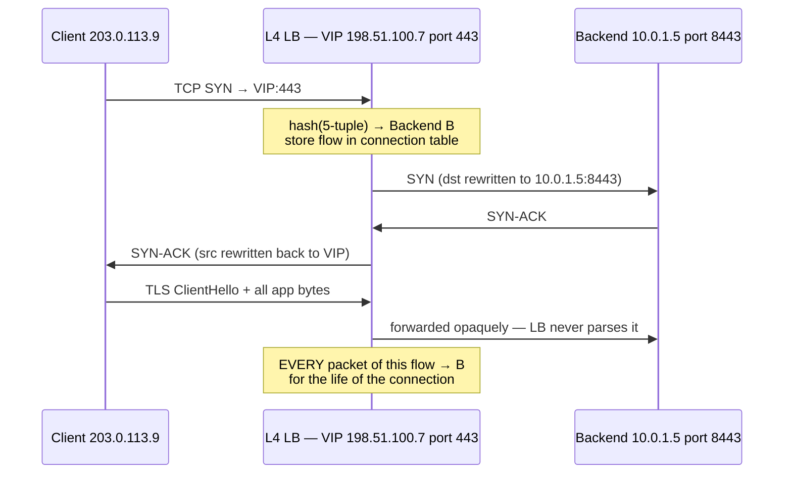

**Key property:** the LB does not understand HTTP. If the client sends 10,000 HTTP requests over one keep-alive connection, **all 10,000 go to backend B.** This is the single most important consequence of L4 and the root of most L4 gotchas.

### 5.2 The three L4 forwarding modes (this is where seniority shows)

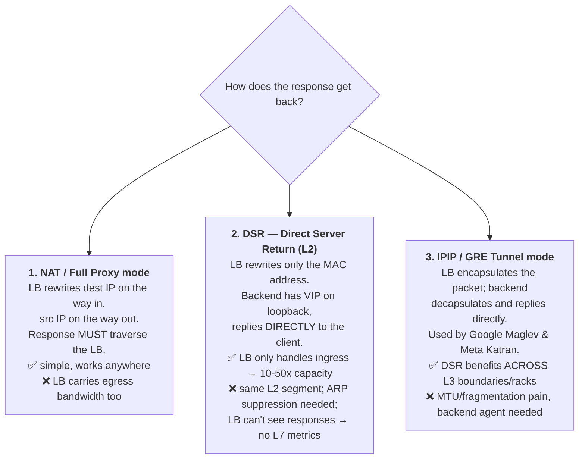

**Worked example — why DSR matters for video:**

> Netflix-style traffic: request `GET /segment.ts` is **~500 bytes**; response is **~5 MB**. Ratio 1:10,000.
> - **NAT mode:** LB must carry 500 B + 5 MB = **5.0005 MB per request.**
> - **DSR mode:** LB carries **500 bytes.** Responses go straight from server → client.
>
> At 20,000 requests/sec: NAT needs ~**800 Gbps** through the LB tier; DSR needs ~**80 Mbps**. Same hardware, four orders of magnitude difference.
>
> *"That's why CDNs, video, and game traffic use DSR or tunnelling L4 balancers, and why AWS NLB is architecturally closer to a flow router than a proxy."*

### 5.3 The connection table — L4's dirty secret

An L4 LB in NAT mode must remember `(5-tuple) → backend` for every live flow.

| Consequence | Detail |
|---|---|
| **Memory** | ~200–500 bytes/flow. 500K flows ≈ 100–250 MB. Cheap. |
| **Stateful failover** | If the LB node dies, the table dies → **every in-flight connection resets.** |
| **The fix** | Make the mapping *derivable*, not *stored*: **consistent hashing on the 5-tuple**, so any LB node computes the same answer. Then the table is only an optimisation. **This is exactly Google Maglev's design.** |
| **Idle timeouts** | Flows are evicted after an idle timeout (AWS NLB: **350 s**, non-configurable). Long-idle TCP/WebSocket connections silently die → **must enable TCP keepalive < 350 s.** A classic production bug. |

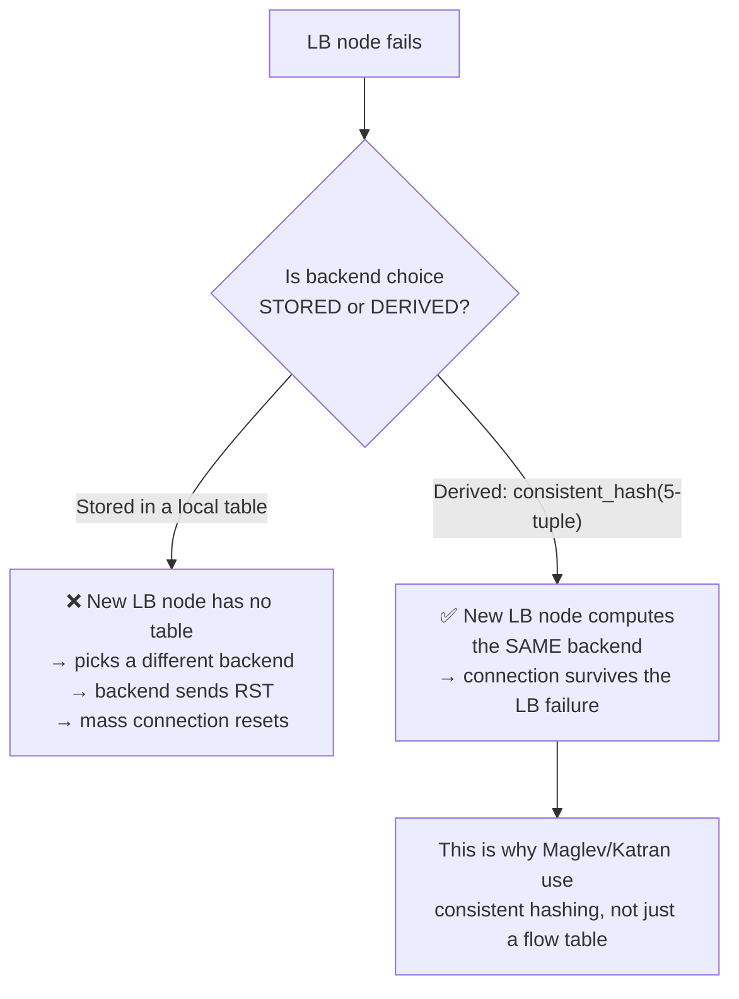

### 5.4 Preserving the client IP through L4 — the PROXY protocol

If the LB does NAT/SNAT, the backend sees the **LB's IP**, not the client's. That breaks rate limiting, geo, fraud, and audit logs.

| Option | How | Trade-off |
|---|---|---|
| **PROXY protocol (v1/v2)** | LB prepends a small header on the TCP stream: `PROXY TCP4 203.0.113.9 198.51.100.7 51514 443` | Backend **must** be configured to expect it — otherwise it parses it as garbage and breaks. ⚠️ Must only be accepted from trusted sources or a client can **spoof any IP**. |
| **Preserve client IP (DSR / NLB target-type `ip`)** | No SNAT at all | Requires routing/security-group awareness |
| **`X-Forwarded-For` (L7 only)** | LB appends client IP as an HTTP header | Only works if the LB parses HTTP → not available at L4 |
| **TOA / TCP option** | Client IP smuggled in a TCP option | Kernel module needed; niche |

> **Security callout (OWASP A01 – Broken Access Control):** never trust `X-Forwarded-For` or PROXY protocol from an untrusted network. Configure a *trusted proxy count / trusted CIDR* and **strip inbound `X-Forwarded-*` headers at the edge**, then append your own.

### 5.5 When to choose L4

✅ Use L4 when:
- Non-HTTP protocols: **MySQL, Postgres, Redis, Kafka, MQTT, SMTP, DNS, RTP, game UDP, QUIC**
- You need **extreme throughput / low latency** (µs-level added latency, Mpps scale)
- You need **end-to-end TLS** (regulatory / mTLS to the app) — passthrough
- You need a **static IP** for allow-listing (AWS NLB gives one static IP per AZ)
- **Long-lived connections** where per-request routing is pointless (WebSocket, gRPC streaming)
- You're building the tier *in front of* your L7 tier

❌ Avoid L4 when you need path routing, cookies, header rewriting, per-request retries, response caching, or compression.

---

## 6. Layer 7 Load Balancing — Deep Dive

### 6.1 What it is

An L7 LB **terminates** the client connection, **parses** the application protocol, decides **per request**, and forwards over a **separate** (usually pooled, reused) connection to the backend.

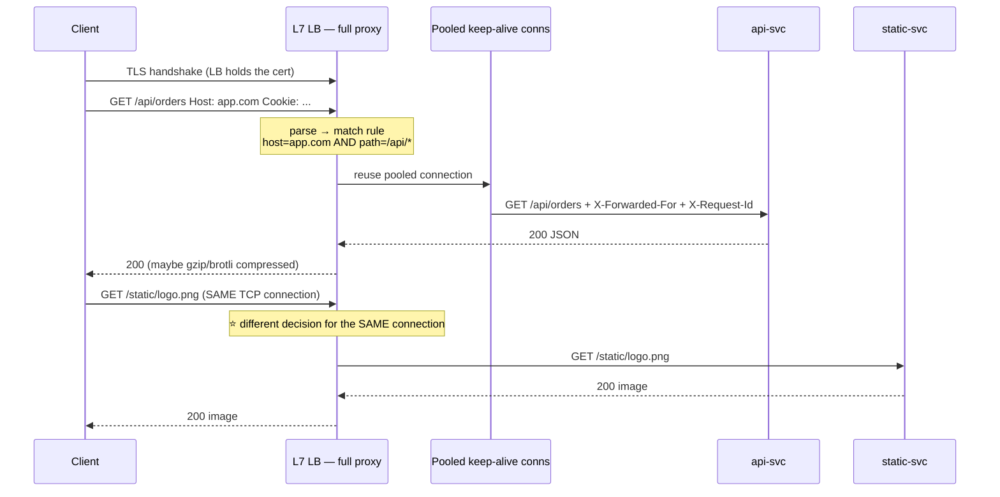

⭐ **The defining difference:** two requests on one TCP connection can go to **two different backends**. An L4 LB physically cannot do this.

### 6.2 What L7 unlocks

| Capability | Concrete example |
|---|---|
| **Path routing** | `/api/*` → api-fleet · `/static/*` → S3/CDN · `/graphql` → gql-fleet |
| **Host routing** | `api.example.com` vs `admin.example.com` on one IP |
| **Header/cookie routing** | `X-Beta: true` → canary fleet; `Accept-Language` → regional content |
| **Method/gRPC routing** | `POST /v1/Checkout/Submit` → checkout service |
| **Weighted / canary** | 1% → v2, 99% → v1; shift over hours; instant rollback |
| **TLS termination + SNI** | One LB, hundreds of certs, ACME auto-renewal |
| **Header manipulation** | Inject `X-Request-Id`, `X-Forwarded-For`, `X-Forwarded-Proto`; strip internal headers |
| **Per-request retries** | Retry idempotent `GET` on another backend after a 503 |
| **Compression / caching** | gzip/brotli; micro-cache hot GETs for 1 s |
| **Rate limiting / WAF / auth** | Reject before it costs backend CPU |
| **Observability** | Status codes, per-route p50/p99, upstream latency, retry counts |
| **Protocol translation** | HTTP/3 or HTTP/2 outside → HTTP/1.1 inside; gRPC-Web → gRPC |
| **Traffic mirroring / shadowing** | Copy 5% of prod traffic to a new version, discard responses |

### 6.3 The connection multiplexing superpower (frequently missed)

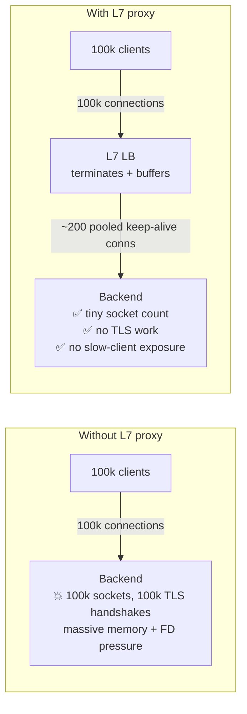

Three wins in one:
1. **Connection amplification collapse** — 100k → 200. Hello Interview's exact phrasing: *"an L7 load balancer minimises the connection load downstream."*
2. **Slow-client isolation (Slowloris defence)** — a full proxy **buffers** the request. The backend thread is occupied only for the milliseconds of actual work, not for the 30 seconds the mobile client spent on 2G. This alone can be worth 10× effective backend capacity.
3. **Protocol upgrade decoupling** — you get HTTP/3 + TLS 1.3 at the edge without touching a single service.

### 6.4 ⚠️ The HTTP/2 + gRPC imbalance trap (a *classic* Staff/Principal question)

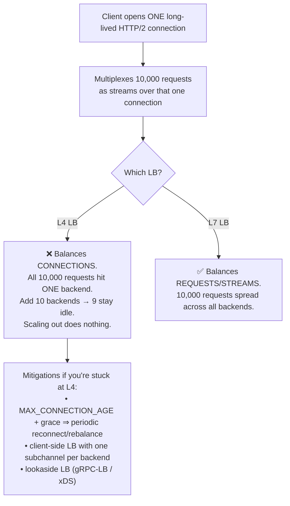

> **Say this:** *"For gRPC or HTTP/2, an L4 load balancer is effectively a no-op — it balances connections and gRPC uses one. Either use an L7 proxy that understands HTTP/2 streams, or push balancing into the client with xDS/EDS. If you must keep L4, set `MAX_CONNECTION_AGE` with jitter so connections churn and re-hash — but that's a mitigation, not a design."*

### 6.5 The cost of L7

| Cost | Number (order of magnitude) |
|---|---|
| Added latency | **~0.5–2 ms** per hop (vs ~10–100 µs for L4) |
| Throughput | L4: **10M+ pps/node**. L7: **50k–300k RPS/node** — roughly 10–50× lower |
| TLS handshakes | ECDSA P-256: **~2–5k handshakes/s/core**. RSA-2048: ~5–10× slower. Session resumption is essential. |
| Memory | Buffers per in-flight request; big uploads/downloads need tuning |
| Trust boundary | The LB now holds your private keys and sees plaintext |

> **Nuance to state:** *"L7 costs a millisecond, but it can *save* tens of milliseconds by keeping backend connections warm, compressing responses, and shielding backends from slow clients. Measure end-to-end p99, not proxy overhead in isolation."*

---

## 7. L4 vs L7 — The Decision Flow Chart

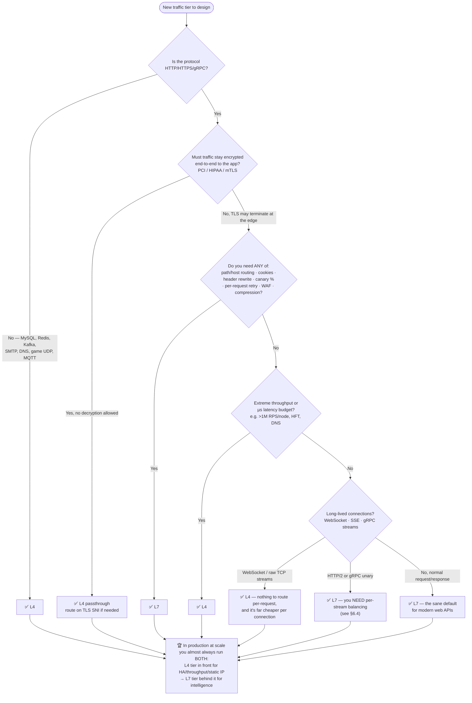

### 7.1 Full comparison table

| Dimension | **Layer 4** | **Layer 7** |
|---|---|---|
| OSI layer | Transport (TCP/UDP) | Application (HTTP/gRPC) |
| Decision unit | **Per connection** | **Per request / per stream** |
| Sees | 5-tuple (+ TLS SNI by peeking) | Everything: method, path, headers, cookies, body |
| Added latency | ~10–100 µs | ~0.5–2 ms |
| Throughput/node | Millions of pps | Tens–hundreds of k RPS |
| TLS | Passthrough (or terminate, e.g. NLB-TLS) | Terminate, inspect, re-encrypt |
| Sticky sessions | Source IP / 5-tuple hash only | Cookie, header, URL param, JWT claim — precise |
| Content routing | ❌ | ✅ |
| Header manipulation | ❌ | ✅ |
| Per-request retry | ❌ (connection-level only) | ✅ |
| Caching / compression | ❌ | ✅ |
| Health check depth | TCP connect, sometimes app-level probe | Full HTTP with status/body assertions |
| Client IP preservation | PROXY protocol / DSR / preserve-client-ip | `X-Forwarded-For` |
| Protocol support | Any TCP/UDP | HTTP/1.1, HTTP/2, HTTP/3, gRPC, WebSocket |
| DDoS absorption | ✅ excellent (cheap per packet) | ⚠️ expensive per request |
| AWS product | **NLB** (also GWLB for appliances) | **ALB** (also CloudFront at edge) |
| OSS | IPVS, Maglev, Katran, HAProxy `mode tcp`, NGINX `stream` | NGINX, HAProxy `mode http`, Envoy, Traefik, Caddy |
| Cost per request | Low | Higher (CPU + licence + ops) |

### 7.2 The one-sentence answers to memorise

- **L4 vs L7 in one sentence:** *"L4 balances connections using the 5-tuple and can't see inside; L7 balances individual requests because it parses the application protocol."*
- **Hello Interview's rule of thumb:** *"If you have persistent connections like WebSockets, lean L4. Otherwise L7, because it gives routing flexibility while minimising connection load downstream."*
- **The nuance that beats the rule of thumb:** *"…except for HTTP/2 and gRPC, which are also persistent connections but need L7 precisely because a single connection carries thousands of requests."*

---

## 8. Load Balancing Algorithms — With Worked Numbers

> **Framing that scores:** *"The algorithm is a policy for answering 'who gets the next unit of work'. The right choice falls out of three questions: (1) are backends homogeneous? (2) is request cost uniform? (3) is the connection short or long lived? Everything else is a variation."*

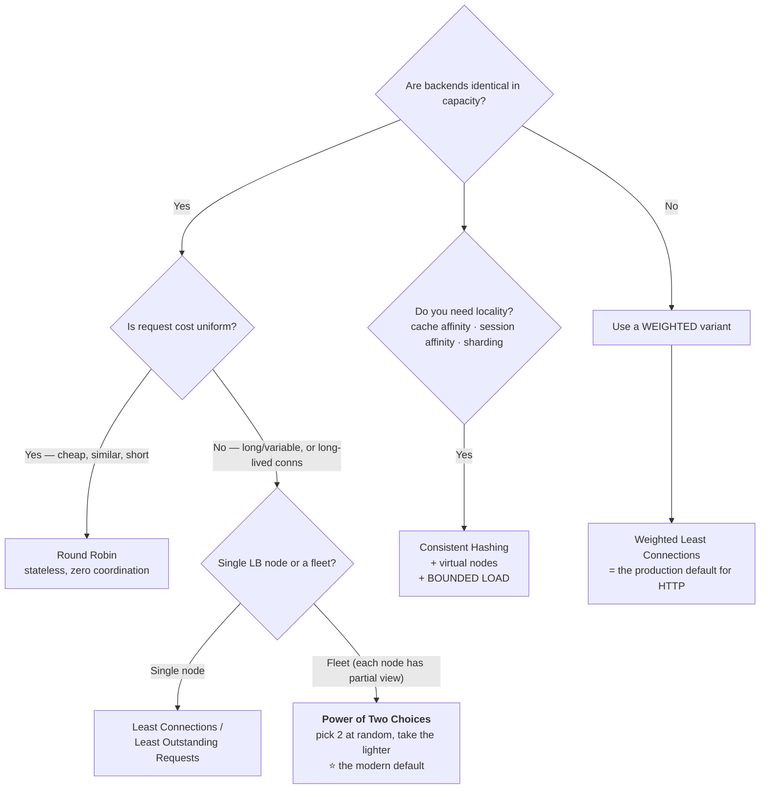

### 8.1 Round Robin

**Rule:** `backend = pool[counter++ % N]`

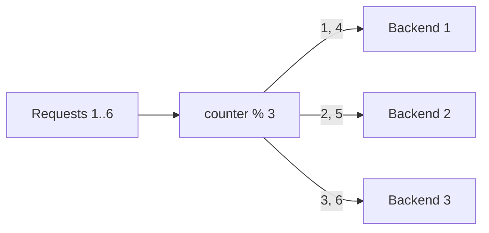

| ✅ | ❌ |
|---|---|
| Stateless (one integer), zero coordination cost | Blind to load — a backend in a 3-second GC pause keeps getting traffic |
| Perfectly fair *in count* | Blind to cost — one backend may get three 10-second reports in a row |
| Trivially correct across an LB fleet | Blind to capacity — a 4-core box gets the same share as a 64-core box |

**Best for:** identical stateless API servers with short, uniform requests. Also the safest default when your LB fleet has no shared state.

### 8.2 Weighted Round Robin — and *smooth* WRR (the detail that impresses)

Naïve WRR with weights `A=5, B=1, C=1` produces `A A A A A B C` — five requests slam A in a burst, then it idles. NGINX/Envoy use **Smooth WRR**:

```
for each pick:
    for each server s:  s.current += s.weight
    winner = server with max current
    winner.current -= total_weight
```

**Worked trace (A=5, B=1, C=1, total=7):**

| Pick | current after `+= weight` | Winner | current after `-= 7` |
|---|---|---|---|
| 1 | A=5, B=1, C=1 | **A** | A=-2, B=1, C=1 |
| 2 | A=3, B=2, C=2 | **A** | A=-4, B=2, C=2 |
| 3 | A=1, B=3, C=3 | **B** | A=1, B=-4, C=3 |
| 4 | A=6, B=-3, C=4 | **A** | A=-1, B=-3, C=4 |
| 5 | A=4, B=-2, C=5 | **C** | A=4, B=-2, C=-2 |
| 6 | A=9, B=-1, C=-1 | **A** | A=2, B=-1, C=-1 |
| 7 | A=7, B=0, C=0 | **A** | A=0, B=0, C=0 ← cycle resets |

Result: `A A B A C A A` → exactly 5:1:1, but **interleaved**, not bursty.

**Where weights come from:**
- Instance size (c5.9xlarge = 4× c5.2xlarge)
- **Canary rollout:** v2 weight 1, v1 weight 99 → shift over hours
- **Zone preference:** same-AZ weight 9, cross-AZ weight 1 (saves cross-AZ $ and ~1 ms)
- **Slow start:** a freshly added backend ramps 0→full weight over 30–60 s

⚠️ Weights are **static**. They don't know that A is currently in a GC pause.

### 8.3 Least Connections / Least Outstanding Requests

**Rule:** send to the backend with the fewest in-flight connections (L4) or outstanding requests (L7 — AWS ALB calls this **LOR**).

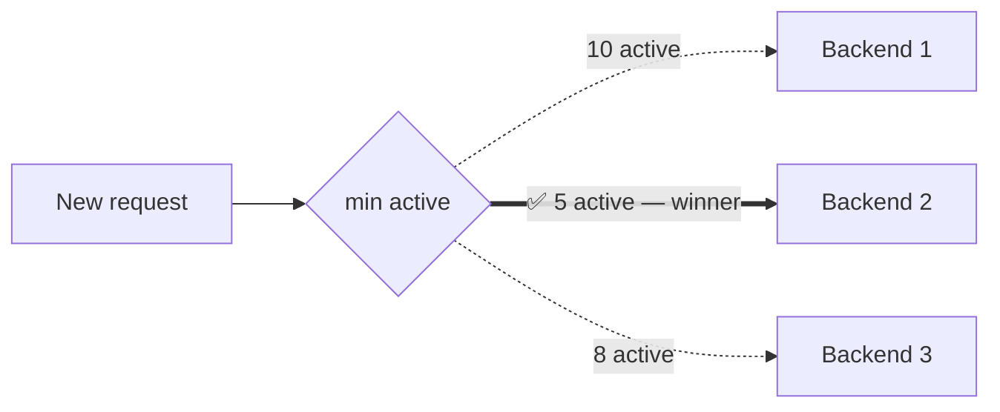

**Why it self-heals:** a struggling backend accumulates in-flight requests → automatically receives fewer new ones. It adapts to GC pauses, noisy neighbours, cold caches, and heterogeneous request cost **without any configuration**.

**Weighted Least Connections** — the production default:

```
score = active_connections / weight   → pick min score
```

| Backend | Active | Weight | Score | |
|---|---|---|---|---|
| B1 | 10 | 5 | 2.0 | tie |
| B2 | 6 | 2 | 3.0 | |
| B3 | 4 | 2 | 2.0 | tie |

B1 has *more* connections than B3 but the same relative utilisation — both are equally loaded **relative to capacity**. That's the point.

### 8.4 Least Response Time / PEWMA

Rank by `active_connections × avg_response_time`, or by an exponentially-weighted moving average of latency (Envoy/Finagle style: **P**eak **EWMA**).

- ✅ Directly optimises the metric users feel (latency), catches "up but slow" backends
- ❌ Feedback loop risk: a fast backend gets more traffic → gets slower → traffic shifts away → **oscillation**. Needs damping/decay tuning.
- ❌ Cold-start bias: a brand-new backend has no samples and looks infinitely fast → gets hammered. Pair with **slow start**.

### 8.5 ⭐ Power of Two Choices (P2C) — the algorithm that separates Staff from Senior

**Rule:** pick **2 backends uniformly at random**, send to whichever has fewer in-flight requests.

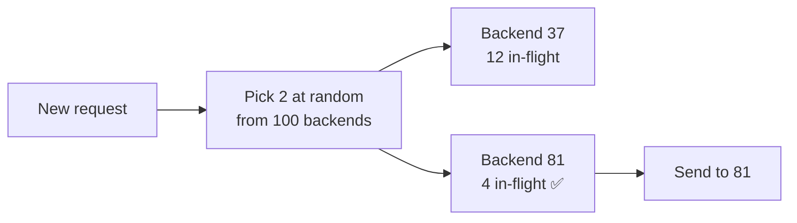

**Why it's remarkable (Mitzenmacher, *The Power of Two Choices*):** throwing $n$ balls into $n$ bins,

$$\text{max load} = \begin{cases} \Theta\!\left(\dfrac{\log n}{\log\log n}\right) & \text{pure random (1 choice)}\\[8pt] \Theta\!\left(\dfrac{\log\log n}{\log 2}\right) & \text{2 choices} \end{cases}$$

For $n = 100$: pure random gives a busiest bin of ~**5**; two choices gives ~**2**. **One extra random sample turns an exponential imbalance into a doubly-logarithmic one.**

**Why it matters for load balancers specifically:**

| Property | Round Robin | Global Least-Conn | **P2C** |
|---|---|---|---|
| Needs shared/global state | No | **Yes** | **No** |
| Adapts to slow backends | ❌ | ✅ | ✅ |
| Safe with an LB *fleet* | ✅ | ❌ (herding) | ✅ |
| Cost per decision | O(1) | O(N) scan | O(1) |

> **This is the default `LEAST_REQUEST` policy in Envoy and the basis of NGINX's `random two least_conn`.** Naming it, and explaining *why* (no global state, no herding), is a strong Principal signal.

### 8.6 IP Hash / Source Hash

**Rule:** `backend = pool[hash(client_ip) % N]`

✅ Stateless session affinity — every LB node computes the same answer, no shared store.
❌ Three serious problems:
1. **NAT/CGNAT collapse** — 50,000 employees behind one corporate egress IP all land on one backend. Same for mobile carrier CGNAT.
2. **Uneven distribution** — hashing is only uniform in expectation; with small N you get real skew.
3. **`% N` catastrophe** — see next section.

### 8.7 Consistent Hashing (+ virtual nodes)

**The problem it solves.** With `hash % N`, changing N remaps almost everything:

| Change | Fraction of keys remapped with `% N` | With consistent hashing |
|---|---|---|
| 3 → 4 backends | ~**75%** | ~**25%** (`1/4`) |
| 4 → 5 backends | ~**80%** | ~**20%** (`1/5`) |
| 100 → 101 backends | ~**99%** | ~**1%** |

For a cache tier that's the difference between a 1% blip and a **total cache flush + database meltdown**.

```mermaid
flowchart TD
    subgraph RING["Hash ring: 0 → 2³²−1"]
        direction LR
        A["Backend A @ 1000"] --> B["Backend B @ 3000"] --> C["Backend C @ 6000"] --> A
    end
    K1["key hash=500 → walk clockwise → A"]
    K2["key hash=2500 → B"]
    K3["key hash=5000 → C"]
    RM["Remove B ⇒ only B's arc (2500) moves to C.<br/>A's and C's keys are untouched."]
```

**Virtual nodes (vnodes):** place each backend **100–200 times** on the ring under different hash seeds. Without vnodes, 3 randomly-placed backends can own arcs of 60% / 30% / 10%. With 200 vnodes each, arc sizes converge to within a few percent.

**Use when:** cache fleets (Memcached/Redis), sharded stores, session affinity with autoscaling, sticky routing for stateful streams. **Skip when** backends are stable and you don't need locality — it's needless complexity.

**Maglev hashing** (Google's variant): instead of a ring, build a fixed **lookup table** of prime size (e.g. 65537). Each backend proposes a permutation; the table is filled round-robin from those permutations. Result: **table entries per backend differ by at most 1** (better balance than ring hashing), **O(1) lookup**, and only ~1/N of entries move when a backend changes. Trade-off: slightly *more* disruption than ideal consistent hashing, in exchange for near-perfect balance and speed.

### 8.8 ⭐ Consistent Hashing with **Bounded Loads**

Plain consistent hashing has a fatal flaw: **it respects the key distribution, not the load distribution.** One celebrity key or one huge tenant → one melted backend.

**The fix (Google, 2016 — used by HAProxy, Vimeo, Envoy `MAGLEV`/`RING_HASH` with `hash_balance_factor`):** cap every backend at

$$\text{cap} = \left\lceil \frac{\text{total in-flight}}{N} \times (1+\varepsilon) \right\rceil$$

If the hashed target is at capacity, walk clockwise to the next one that isn't.

```mermaid
flowchart TD
    K["Request for key K"] --> H["target = ring.lookup(K)"]
    H --> F{"is target.inflight under cap?"}
    F -->|Yes| S["✅ Route to target — locality preserved"]
    F -->|"No — overloaded"| N["Walk ring → next backend"]
    N --> F
    R["ε = 0.25 ⇒ no backend exceeds 125% of average.<br/>You get ~95%+ locality AND a hard load ceiling."]
```

> **Interview gold:** *"Sticky routing and even load are in direct tension. Bounded-load consistent hashing is how you buy 95% of the affinity benefit while capping the damage from a hot key. It's the answer to 'what if one user is 100× bigger than the rest?'"*

### 8.9 The distributed least-connections trap (Principal level)

```mermaid
flowchart TD
    subgraph "10 LB nodes, each with a LOCAL view"
        L1["LB 1: 'B7 looks least loaded'"] --> B7
        L2["LB 2: 'B7 looks least loaded'"] --> B7
        L3["LB 3: 'B7 looks least loaded'"] --> B7
        LN["LB 10: 'B7 looks least loaded'"] --> B7
    end
    B7["💥 Backend 7 — HERD.<br/>Every LB independently made the<br/>same 'correct' decision at the same instant."]
    B7 --> FIX["Fixes:<br/>1️⃣ P2C — randomness breaks the herd<br/>2️⃣ Backends report load (ORCA / xDS LRS) with jitter<br/>3️⃣ Add randomised tie-breaking + decay<br/>4️⃣ Bounded-load / max-connections caps per backend"]
```

The same pathology hits **"least response time"** (everyone piles onto the freshly-recovered, currently-idle backend) and **newly-added instances** (cold JIT, cold cache, empty connection pool get slammed → they fail → they're ejected → they come back → repeat). **Slow start** is the fix.

### 8.10 Algorithm selection cheat sheet

| Algorithm | State | Adapts to load | Affinity | Choose it when |
|---|---|---|---|---|
| Round Robin | none | ❌ | ❌ | Identical backends, uniform short requests |
| Weighted RR | none | ❌ | ❌ | Known capacity differences, canary weights |
| Random | none | ❌ | ❌ | Massive fleets where even RR coordination costs |
| **Least Connections** | per-node counters | ✅ | ❌ | Variable request cost, long-lived conns, **single LB** |
| **Weighted Least Conn** | per-node counters | ✅ | ❌ | 🏆 Production default for HTTP with mixed instances |
| Least Response Time / PEWMA | latency EWMA | ✅✅ | ❌ | Latency-critical; needs damping |
| **Power of Two Choices** | per-node counters | ✅ | ❌ | 🏆 Default for an **LB fleet** / service mesh |
| IP Hash | none | ❌ | weak | Only when cookies are impossible |
| Consistent Hash + vnodes | none | ❌ | ✅ | Cache locality, sharding, autoscaling pools |
| **CH + bounded load** | in-flight counts | ✅ | ✅ | 🏆 Affinity **and** hot-key protection |
| Maglev hash | none | ❌ | ✅ | L4 at massive scale, needs O(1) + near-perfect balance |

---

## 9. Health Checks — The Most Underrated Topic

> *"Load balancing algorithms get the airtime, but in production **90% of load balancer incidents are health check incidents**: checks that were too shallow, too deep, too fast, too slow, or that took down the whole fleet at once."*

### 9.1 Active vs passive

```mermaid
flowchart TD
    subgraph AC["ACTIVE — synthetic probes"]
        HC["Health Checker"] -->|"GET /health every 5s"| S1["Backend 1 → 200 ✅"]
        HC -->|"GET /health every 5s"| S2["Backend 2 → timeout ❌"]
        HC -->|"GET /health every 5s"| S3["Backend 3 → 200 ✅"]
        HC --> RT["Routing table: {B1, B3}"]
    end
    subgraph PA["PASSIVE — observe real traffic"]
        T["Real user requests"] --> OB["Observe: 5xx rate, timeouts,<br/>connection refused, latency outliers"]
        OB --> EJ["Eject B2 for 30s<br/>(exponential backoff on repeat)"]
    end
```

| | **Active** | **Passive** (outlier detection / `max_fails`) |
|---|---|---|
| Mechanism | Synthetic probe on a timer | Watch real request outcomes |
| Detects failure | Even with zero traffic | Only where traffic flows |
| Overhead | Extra QPS to every backend | **Zero** |
| Detection speed | Deterministic (interval × threshold) | Can be instant under load |
| Blind spot | The probe path may not exercise the real code path | Needs traffic; **users pay for the detection** |
| Real answer | **Use both.** Active for baseline liveness, passive to catch "up but broken for real requests". |

### 9.2 The four kinds of "health" (Kubernetes vocabulary, universally applicable)

| Probe | Question | On failure | Endpoint should check |
|---|---|---|---|
| **Startup** | "Has it finished booting?" | Keep waiting; don't kill yet | Warmup complete, caches primed, migrations done |
| **Liveness** | "Is the process wedged?" | **Restart the container** | Only *local* deadlock/self-state. **Never dependencies.** |
| **Readiness** | "Can it serve traffic *right now*?" | **Remove from LB** (don't restart) | Local + *critical* deps, connection pool available, not shedding |
| **Deep / dependency** | "Is the whole system OK?" | **Alarm a human** — do NOT gate the LB | DB reachable, downstream reachable, disk, cert expiry |

```mermaid
flowchart TD
    A["Health endpoint design"] --> L["/livez → 200 unless the process is unrecoverable<br/>❗ never checks the DB"]
    A --> R["/readyz → 200 if THIS instance can serve<br/>local state + own thread pool + shedding flag"]
    A --> D["/healthz-deep → full dependency report<br/>consumed by MONITORING, not by the LB"]
    L --> W1["Wrong: liveness checks the DB.<br/>DB blips ⇒ Kubernetes restarts every pod ⇒ total outage."]
    R --> W2["Wrong: readiness returns 200 unconditionally.<br/>LB happily routes to a broken instance."]
```

⚠️ **The two classic mistakes, verbatim:**
1. **A health endpoint that always returns 200** tells you nothing — it only proves the HTTP listener is alive.
2. **A liveness probe that checks the database** turns a transient DB hiccup into a **fleet-wide restart storm**.

### 9.3 Types of probe, weakest → strongest

| Type | What it proves | Blind to |
|---|---|---|
| **ICMP ping** | The host has a network stack | The app being dead |
| **TCP connect** | Something is `listen()`ing on the port | A hung worker that accepts but never responds |
| **HTTP GET `/health` → 2xx** | The HTTP server routes and responds | Business logic being broken |
| **HTTP + body/JSON assertion** | The app executed real code and reported state | Deep dependency failures |
| **Synthetic transaction** | An actual user journey works | Cost/complexity; can mutate state |
| **Agent check** (HAProxy `agent-check`) | Backend *self-reports* a weight/`drain`/`maint` | Requires app cooperation — but it's the most honest signal |

> **Best-practice statement:** *"The backend knows its own health better than the load balancer ever will. The strongest design is agent-based: the instance reports 'ready / draining / degraded at 40% capacity' and the LB adjusts weight, instead of the LB guessing from a binary probe."*

### 9.4 The threshold math — and the trade-off you must name

```
worst-case detection time ≈ (unhealthy_threshold × interval) + timeout
```

| interval | timeout | unhealthy_threshold | Worst-case detection | Requests lost @ 1000 RPS across 10 backends |
|---|---|---|---|---|
| 30 s | 5 s | 3 | **95 s** | ~9,500 |
| 10 s | 5 s | 3 | **35 s** | ~3,500 |
| **5 s** | **3 s** | **3** | **18 s** | ~1,800 |
| 2 s | 1 s | 2 | **5 s** | ~500 |
| 1 s | 1 s | 2 | **3 s** | ~300 |

```mermaid
flowchart LR
    F["Aggressive: short interval,<br/>low threshold"] --> P1["✅ Fast failure detection"]
    F --> P2["❌ False positives — a GC pause or<br/>network blip ejects a healthy node"]
    F --> P3["❌ Probe load: N backends × M LB nodes ÷ interval"]
    S["Conservative: long interval,<br/>high threshold"] --> Q1["✅ Stable, no flapping"]
    S --> Q2["❌ Users eat errors for a minute+"]
    ANS["🎯 Answer: ASYMMETRIC thresholds<br/>fail FAST (2 failures) · recover SLOW (5 successes)<br/>+ combine with passive ejection for instant detection"]
```

⚠️ **Probe amplification (a real production trap):** with **50 LB nodes × 2,000 backends ÷ 2 s interval = 50,000 health checks/sec** hitting your fleet — potentially more than your user traffic. Fixes: centralise health checking in the control plane and *push* results; use Envoy's **health check subsetting**; or lengthen the active interval and lean on passive ejection.

### 9.5 The deep health check outage — the #1 story that signals seniority

```mermaid
flowchart TD
    A["/health on every instance also checks the DB<br/>('deep health check' — sounds thorough!)"] --> B["Database has a 20-second blip<br/>or hits a connection limit"]
    B --> C["ALL 500 instances fail their health check<br/>SIMULTANEOUSLY — they share the dependency"]
    C --> D["LB marks 100% of the fleet unhealthy"]
    D --> E["💥 LB has zero targets → returns 503 to everyone<br/>A 20-second DB blip became a TOTAL OUTAGE<br/>and it does NOT recover when the DB does,<br/>because the herd of reconnects re-kills the DB"]
    E --> F["🛡️ Mitigations"]
    F --> F1["<b>FAIL OPEN / panic mode</b>: if more than X% of hosts<br/>are unhealthy, ignore health and route to ALL.<br/>Envoy default panic threshold = 50%."]
    F --> F2["Keep LB checks SHALLOW (local only);<br/>put deep checks behind alarms, not routing"]
    F --> F3["Priority levels: fail over to a degraded/<br/>read-only pool instead of to nothing"]
    F --> F4["Cap ejections: max_ejection_percent = 10%"]
    F --> F5["Graceful degradation in the app:<br/>serve stale cache and stay 'ready'"]
```

> **Say this and you sound like you've been on-call:** *"The scariest health check failure mode isn't 'the check missed a bad host' — it's 'the check correctly failed every host at once because they all share one dependency.' That's why load balancers implement fail-open: below a health quorum, routing to a possibly-degraded host beats routing to nothing. Amazon's Builders' Library calls this out explicitly, and Envoy ships it as the panic threshold."*

### 9.6 Outlier detection (passive ejection)

Envoy's model, worth quoting precisely:

| Setting | Typical | Meaning |
|---|---|---|
| `consecutive_5xx` | 5 | N consecutive 5xx → eject |
| `consecutive_gateway_failure` | 5 | 502/503/504 or connect failure |
| `success_rate_stdev_factor` | 1.9 | Eject hosts statistically worse than the fleet mean |
| `interval` | 10 s | Analysis sweep |
| `base_ejection_time` | 30 s | Ejection duration; **multiplied by the number of times ejected** (exponential backoff) |
| `max_ejection_percent` | **10%** | 🛡️ Never eject more than this — the anti-cascade guardrail |

> **The statistical variant is the sophisticated one:** don't eject on an absolute threshold; eject hosts whose success rate is a statistical outlier *relative to their peers*. If everyone is at 50% success, the problem is downstream, not the host — ejecting doesn't help and removing capacity makes it worse.

### 9.7 Flapping and hysteresis

```mermaid
stateDiagram-v2
    [*] --> Unknown: registered
    Unknown --> Healthy: first probe passes
    Unknown --> Unhealthy: first probe fails
    Healthy --> Suspect: 1 failure
    Suspect --> Healthy: 1 success (reset counter)
    Suspect --> Unhealthy: N consecutive failures (fail FAST, N=2)
    Unhealthy --> Recovering: 1 success
    Recovering --> Unhealthy: any failure (reset)
    Recovering --> SlowStart: M consecutive successes (recover SLOW, M=5)
    SlowStart --> Healthy: weight ramped 0 to 100 percent over 30s
    Healthy --> Draining: operator removes / scale-in / deploy
    Draining --> [*]: in-flight complete or timeout
    note right of Suspect
        Asymmetric thresholds are the
        anti-flapping mechanism.
    end note
    note right of SlowStart
        Prevents the "recovered node
        gets hammered and dies again" loop.
    end note
```

Also **jitter the probe schedule**: if 50 LB nodes probe on the same 5-second boundary, you create a synchronised spike every 5 seconds and can trigger the very failure you're testing for.

### 9.8 Slow start (warm-up)

A brand-new or just-recovered backend has: cold CPU caches, un-JIT-compiled code, empty connection pools, empty local caches, unwarmed TLS session cache. Sending it a full share instantly makes it the **slowest** node — and if you're running least-connections/least-latency, it may instead look *idle* and get **hammered**.

| Proxy | Directive |
|---|---|
| HAProxy | `server web1 10.0.1.5:80 check slowstart 60s` |
| NGINX Plus | `server 10.0.1.5:80 slow_start=30s` |
| Envoy | `slow_start_config: { slow_start_window: 60s, aggression: 2.0 }` |
| AWS ALB | Target group attribute `slow_start.duration_seconds` (30–900) |

### 9.9 Connection draining / graceful shutdown

**The rule: stop *new* work, finish *existing* work, then exit.**

```mermaid
sequenceDiagram
    participant OP as Deploy / Autoscaler
    participant LB as Load Balancer
    participant P as Instance
    participant U as In-flight users

    OP->>P: "prepare to stop"
    P->>P: 1️⃣ flip readiness to FAIL (still serving!)
    LB->>P: readiness probe → 503
    LB->>LB: 2️⃣ remove from routing table (takes 1 probe interval + propagation)
    Note over P: 3️⃣ ⏳ MUST wait here — the LB has not<br/>finished propagating the removal yet
    LB-->>P: (last few requests may still arrive)
    P->>U: 4️⃣ finish in-flight requests
    P->>P: 5️⃣ send Connection: close / GOAWAY on keep-alives
    OP->>P: 6️⃣ SIGTERM
    P->>P: 7️⃣ close pools, flush logs/metrics, exit 0
    Note over OP,P: If in-flight work exceeds the drain timeout,<br/>connections are force-closed (AWS: deregistration_delay, default 300s)
```

⚠️ **The Kubernetes race condition — a top-tier war story:**
> *"On pod deletion, Kubernetes sends `SIGTERM` and removes the Endpoint **at the same time**, and those propagate through kube-proxy/ingress asynchronously. If the app exits immediately on `SIGTERM`, the LB is still sending it traffic → **502s on every single deploy**. The fix is a `preStop: sleep 5-15s` hook (or an app that fails readiness first and then sleeps), so the app keeps serving while the removal propagates. Combine it with `terminationGracePeriodSeconds` > (preStop + max request duration)."*

**Where draining matters:** rolling deploys, autoscale-in, spot/preemptible reclamation (2-minute warning), instance retirement, AZ evacuation, scaling a StatefulSet.

---

## 10. Sticky Sessions (Session Affinity)

### 10.1 The problem

```mermaid
sequenceDiagram
    participant U as User
    participant LB as LB using round robin
    participant S1 as Server 1
    participant S2 as Server 2
    U->>LB: POST /login
    LB->>S1: forward
    S1->>S1: create session in LOCAL memory
    S1-->>U: 200 + JSESSIONID
    U->>LB: GET /cart
    LB->>S2: round robin sends it elsewhere
    S2->>S2: 🔍 no such session in MY memory
    S2-->>U: 302 → /login  ❌ "Why did it log me out?"
```

**Root cause:** the server is **stateful**. Stickiness is a *workaround* for statefulness — it treats the symptom.

### 10.2 The three mechanisms

```mermaid
flowchart TD
    A{How do we identify<br/>'the same client'?} --> IP & LBC & APPC
    IP["<b>1. Source IP hash</b><br/>hash(client IP) → backend<br/>Layer 4 · zero state · zero cooperation"]
    LBC["<b>2. LB-inserted cookie</b> ⭐<br/>LB sets its own cookie naming the backend<br/>Layer 7 · app needs no changes<br/>AWS: AWSALB · HAProxy: cookie SRV insert"]
    APPC["<b>3. Application cookie</b><br/>LB keys off the app's own cookie<br/>(JSESSIONID / PHPSESSID)<br/>App controls lifetime · AWS: AWSALBAPP"]
```

#### Mechanism 2 in detail (the one to describe)

```mermaid
sequenceDiagram
    participant C as Browser
    participant LB as L7 LB
    participant B1 as Backend 1
    C->>LB: GET /login  (no sticky cookie)
    LB->>LB: normal algorithm → Backend 1
    LB->>B1: GET /login
    B1-->>LB: 200
    LB-->>C: 200 + Set-Cookie AWSALB=signed-B1-id; HttpOnly; Secure; SameSite=Lax
    C->>LB: GET /cart with Cookie AWSALB=signed-B1-id
    LB->>LB: decode+verify cookie → B1; is B1 healthy?
    LB->>B1: GET /cart ✅
    Note over LB,B1: If B1 is UNHEALTHY: fall back to the algorithm,<br/>pick B2, and REWRITE the cookie.<br/>That user's session is gone unless state is shared.
```

**Critical detail:** the cookie value must be **opaque and integrity-protected** (encrypted or HMAC-signed). If it's a plain server ID, an attacker can enumerate and **pin traffic to a chosen backend** — a targeted-DoS and side-channel vector. Also set `HttpOnly`, `Secure`, `SameSite`.

**HAProxy's three cookie modes** (a nice depth flex):
- `insert` — HAProxy adds its own cookie
- `prefix` — HAProxy prefixes the server ID onto the app's existing cookie (no extra cookie)
- `rewrite` — the app emits the cookie, HAProxy overwrites the value
- plus `indirect` (strip it before the backend sees it) and `nocache` (avoid a shared proxy caching a `Set-Cookie`)

**Duration-based vs application-controlled stickiness:**

| | Duration-based (`AWSALB`) | Application-controlled (`AWSALBAPP`) |
|---|---|---|
| Who decides expiry | The LB (fixed TTL, e.g. 1 h) | The **app** — LB's cookie expiry follows the app's cookie |
| Risk | LB stickiness outlives the app session, or dies mid-session | Aligned lifetimes |
| Use when | You can't modify the app | You can — this is the better option |

### 10.3 Failure modes — the table that wins the follow-up

| Failure | Consequence | Mitigation |
|---|---|---|
| **Backend dies** | Every session pinned to it is **lost** — carts, uploads, logins | Externalise session state; then affinity is only an optimisation |
| **Rolling deploy** | You replace every instance → **all sessions break at once** | Externalise state; or drain + long deregistration; or accept re-login |
| **NAT / CGNAT** (IP affinity) | 50k corporate or mobile users → one backend | Use cookies, not IP |
| **Mobile IP churn** (IP affinity) | Wi-Fi→LTE handoff changes IP → session lost | Use cookies |
| **Uneven load** | Backends with "heavy" users saturate while others idle | Bounded-load consistent hashing; monitor per-target utilisation |
| **Autoscale-in** | Removing an instance strands its sessions | Drain + external state |
| **Autoscale-out** | New instances get **no traffic** (existing users stay pinned) → you scaled and nothing improved | Cap affinity TTL; use bounded load; rebalance |
| **Cookie blocked / stripped** | Privacy tooling, `SameSite`, some corporate proxies | Fall back gracefully; never *require* stickiness for correctness |
| **Hot key** | One tenant is 100× the rest | Bounded-load CH; per-tenant shard |

⚠️ **The autoscaling paradox — a great thing to raise unprompted:**
> *"With aggressive stickiness, scaling out during a spike does almost nothing: the existing overloaded instances keep serving their pinned users, and the new instances only receive brand-new sessions. Your dashboards show new capacity; your p99 doesn't move. That's the moment engineers usually discover their affinity TTL is too long."*

### 10.4 The right answer: don't be stateful

```mermaid
flowchart TD
    A["User session state"] --> B{Where does it live?}
    B -->|Server RAM| C["❌ Requires stickiness<br/>❌ Lost on crash/deploy<br/>❌ Blocks elastic scaling"]
    B -->|"External store (Redis / DynamoDB / Memcached)"| D["✅ Any instance serves any request<br/>✅ Pure round robin / least-conn<br/>✅ Survives instance death<br/>⚠️ +1 network hop (~0.5-1ms)<br/>⚠️ Store becomes a critical dependency"]
    B -->|"Client-side token (JWT / signed cookie)"| E["✅ Zero server state, zero lookup<br/>⚠️ Hard to revoke before expiry<br/>⚠️ Size limits, must verify signature<br/>⚠️ Cannot store secrets client-side"]
    D --> F["🏆 Default for most systems"]
    E --> G["🏆 Default for auth identity<br/>(short TTL + refresh token + revocation list)"]
```

> **The line to deliver:** *"Sticky sessions are a compatibility feature for stateful applications, not a scaling strategy. My default is stateless services with session state in Redis and identity in a short-lived signed token; then the load balancer is free to optimise purely for load, and instance death costs a retry instead of a logout."*

### 10.5 …but sometimes affinity is genuinely correct

Don't be dogmatic. Name the legitimate cases:

| Case | Why affinity is right |
|---|---|
| **WebSocket / SSE / long-poll** | The connection *is* the session; it physically lives on one process. (Note: this is inherent connection affinity, not cookie stickiness.) |
| **In-memory cache locality** | Routing a user/tenant to the same node gives 90%+ local cache hit rate — a legitimate, huge latency win |
| **Multipart / resumable uploads** | Chunks must reach the node holding the partial file (unless you use S3 multipart) |
| **Stateful stream processing** | A partition/key is owned by one worker (Kafka consumer, Flink keyed state) |
| **Expensive per-session warm state** | ML model loaded in GPU memory, a warm DB cursor, a game-room in RAM |
| **Legacy apps you cannot modify** | Vendor software with in-process sessions |

For these, **prefer consistent hashing over cookie affinity** — it degrades gracefully when the pool changes.

### 10.6 Consistent hashing with bounded loads — the modern answer

> **This is the answer to *"How would you design load balancing for a stateful service where session state cannot be shared?"*** (a literal interview question from the sources).

```mermaid
flowchart TD
    R["Request with session key K<br/>user id / room id / tenant id"] --> H["ring.lookup(K) → node"]
    H --> CHK{"is node.inflight under cap = avg × 1.25?"}
    CHK -->|Yes| GO["✅ Route there — warm cache, warm state"]
    CHK -->|No| NEXT["Walk the ring to the next node"]
    NEXT --> CHK
    GO --> HEALTH{"node healthy?"}
    HEALTH -->|No| REB["Failover: next node on ring<br/>rebuild state from the durable store<br/>(state is CACHED locally, SOURCED remotely)"]
```

**The full production pattern — say all four parts:**
1. **Consistent hashing on the session key** (not the IP) → affinity that survives scaling
2. **Bounded load (ε ≈ 0.25)** → no hot node, even with a celebrity tenant
3. **Local state is a *cache*, durable state lives in Redis/Dynamo** → failover costs a cache miss, not a lost session
4. **Client reconnect/retry with jittered backoff** → a node loss becomes a blip, not an outage

---

## 11. Reverse Proxies — The Other Half of the Question

### 11.1 The reverse proxy feature set (everything beyond balancing)

```mermaid
flowchart LR
    C[Clients] --> RP["Reverse Proxy"]
    RP --> F1["🔐 TLS termination + SNI + cert mgmt (ACME)"]
    RP --> F2["🛡️ WAF, bot mgmt, rate limit, IP allow/deny, DDoS"]
    RP --> F3["🗜️ gzip/brotli compression, image optimisation"]
    RP --> F4["💾 Response cache / micro-cache / stale-while-revalidate"]
    RP --> F5["✏️ Header rewrite, URL rewrite, redirects"]
    RP --> F6["🔀 Protocol translation: HTTP/3 ⇄ HTTP/1.1, gRPC-Web ⇄ gRPC"]
    RP --> F7["🕵️ Central access logs, tracing headers, request IDs"]
    RP --> F8["🚪 AuthN offload: OIDC, JWT verify, mTLS client certs"]
    RP --> F9["⚖️ Load balancing across backends"]
    RP --> F10["🙈 Hides backend topology & private IPs"]
    RP --> F11["🐢 Slow-client buffering (Slowloris defence)"]
    RP --> F12["🔁 Retries, timeouts, circuit breaking, mirroring"]
```

### 11.2 Reverse proxy vs load balancer — the answer table

| | **Reverse proxy** | **Load balancer** |
|---|---|---|
| Definition | Intermediary that receives client requests **on behalf of servers** | Component that **distributes** traffic across multiple servers |
| Minimum backends | **1** | **2+** (otherwise there's nothing to balance) |
| Primary goal | Security, offload, caching, routing, abstraction | Availability, scalability, even utilisation |
| Relationship | **Superset of position** | **A feature/role** commonly implemented by a reverse proxy |
| Can exist without the other? | Yes — NGINX in front of one origin for TLS + caching | Yes — an L4/DSR balancer that forwards packets and is not a proxy at all |
| Example | Cloudflare in front of your site | AWS NLB spraying packets to an ASG |

> **The precise interview answer:** *"They overlap but answer different questions. 'Reverse proxy' describes **where it sits** — in front of my servers, hiding them. 'Load balancer' describes **what it decides** — which of N servers gets this work. Most L7 products are both. The clean counter-example is a pure L4 balancer using direct server return: it balances but never proxies, because it never sees the response."*

### 11.3 Product comparison

| | **NGINX** | **HAProxy** | **Envoy** | **Traefik** | **AWS ALB/NLB** |
|---|---|---|---|---|---|
| Sweet spot | Web server + reverse proxy + LB | Pure LB, extremely battle-tested | Modern service mesh / dynamic infra | Cloud-native, auto-discovery | Managed, zero-ops |
| Config model | Static file + reload | Static file + seamless reload | **Dynamic xDS API** — no reload needed | Dynamic from labels/CRDs | Console/API |
| L4 | `stream` module | `mode tcp` | ✅ | limited | NLB |
| L7 | ✅ | `mode http` | ✅ (best HTTP/2, gRPC, HTTP/3) | ✅ | ALB |
| Active health checks | **NGINX Plus only** (OSS = passive `max_fails`) | ✅ OSS (`check inter/fall/rise`, `agent-check`) | ✅ active **+ outlier detection** | ✅ | ✅ |
| Observability | Basic OSS / rich in Plus | Rich stats socket + Prometheus | **Best-in-class** stats + tracing | Good | CloudWatch |
| Killer feature | Caching + static file serving | Rock-solid TCP LB, ACLs, stick tables | xDS, retry budgets, panic mode, mirroring | Zero-config discovery | Managed HA + autoscaling |
| Weakness | Active HC behind a paywall | Weaker HTTP/2/gRPC story historically | Heavier memory/CPU, steep learning curve | Less mature at extreme scale | Vendor lock-in, less control |

### 11.4 The proxy at the data tier (often forgotten — mention it)

Load balancing isn't only for stateless web tiers:

| Proxy | Purpose |
|---|---|
| **PgBouncer / RDS Proxy** | Connection **pooling** for Postgres — 10k app connections → 100 DB connections. Without it, `max_connections` becomes your real scaling limit. |
| **ProxySQL / Vitess / MaxScale** | MySQL read/write **splitting** — writes → primary, reads → replicas; query routing, sharding |
| **Redis Cluster / Twemproxy / Envoy Redis filter** | Key-space sharding via consistent hashing |
| **Kafka** | The *client* balances — partition leaders are discovered, no proxy on the hot path |

> *"An LB in front of a database is a different problem from an LB in front of a web tier: connections are expensive and long-lived, reads and writes have different destinations, and 'least connections' is meaningless when the bottleneck is a single primary. That's why the data tier uses purpose-built proxies rather than a generic L7 LB."*

---

## 12. Who Load Balances the Load Balancer?

You added an LB to remove a single point of failure and **created a new one**. Every interviewer asks this. Here are the four answers, in order of scale.

```mermaid
flowchart TD
    Q["The LB is now the SPOF.<br/>How do you remove it?"] --> A1 & A2 & A3 & A4
    A1["<b>1. Active-Passive + VIP (VRRP/keepalived)</b><br/>Two LBs share a Virtual IP.<br/>Standby heartbeats every ~1s; on 3 misses it<br/>claims the VIP via gratuitous ARP.<br/>Failover: 1-3 s · Utilisation: 50%"]
    A2["<b>2. Active-Active + DNS</b><br/>DNS returns multiple A records.<br/>Failover: bounded by TTL (30-60 s+)<br/>and by resolvers/JVMs that ignore TTL.<br/>Utilisation: 100% · works cross-DC"]
    A3["<b>3. ECMP (equal-cost multi-path)</b><br/>Routers hash the 5-tuple across N LB nodes<br/>all announcing the same VIP.<br/>Failover: seconds (BGP/BFD withdrawal)<br/>⚠️ A node change RE-HASHES existing flows<br/>⇒ pair with consistent hashing (Maglev)"]
    A4["<b>4. Anycast + BGP</b><br/>Same IP announced from many PoPs worldwide.<br/>The internet routes to the nearest healthy one.<br/>Failover: BGP convergence · absorbs DDoS<br/>Used by Cloudflare, Google, AWS Global Accelerator"]
```

### 12.1 Comparison

| | Active-Passive (VRRP) | Active-Active (DNS) | ECMP | Anycast |
|---|---|---|---|---|
| Failover time | 1–3 s | **TTL-bound (30 s – minutes)** | seconds | seconds (BGP) |
| Resource utilisation | 50% | 100% | 100% | 100% |
| Scope | Same L2 segment | Global | Same L3 fabric | Global |
| Complexity | Low | Low | Medium | **High (needs BGP/ASN)** |
| Handles a *slow* LB? | ❌ only hard failure | ❌ | ❌ | ❌ |
| Existing connections on failover | **Reset** | Reset | Reset unless consistent-hashed | Reset unless consistent-hashed |

### 12.2 Two truths to state out loud

**(a) DNS is a bad failover mechanism.**
> *"DNS-based failover looks free but its floor is the TTL, and in practice it's worse: browsers pin, JVMs historically cached forever, corporate resolvers ignore low TTLs, and stub resolvers hold connections open. Design DNS for *steering* (region selection, weighted rollout) and design something faster for *failover* — a VIP, anycast, or client-side retry to a second endpoint."*

**(b) Existing connections do not survive an LB failure.**
> *"There is no practical way to migrate an established TCP connection between machines. So my target isn't 'no connection is ever reset' — that's a fantasy at reasonable cost. My target is: fail over in seconds, make clients retry idempotent requests with jittered backoff, keep session state off the LB, and make sure a reset costs one retry rather than a lost user journey."*

### 12.3 How AWS actually does it (useful concrete grounding)

| | **NLB (L4)** | **ALB (L7)** |
|---|---|---|
| What you get | One **static IP per AZ**, backed by a fleet of hypervisor-level flow routers | A **DNS name** resolving to a fleet of proxy nodes that **scale automatically** |
| Scaling | Effectively instant, huge | Scales in the background — a sudden 10× spike can 503 until it warms up (**pre-warming / gradual ramp**) |
| Algorithm | Flow hash on the 5-tuple (+ TCP sequence number) | Round robin or **Least Outstanding Requests** |
| Stickiness | Inherent per flow; optional source-IP affinity | `AWSALB` (duration) / `AWSALBAPP` (app-controlled) cookies |
| Cross-zone LB | **Off by default** (and charged) | **On by default**, free |
| Idle timeout | **350 s, not configurable** → enable TCP keepalive | 60 s default, configurable 1–4000 s |
| Draining | Deregistration delay (default **300 s**) | Same |
| Health checks | TCP/HTTP/HTTPS | HTTP/HTTPS with matcher on status codes |

⚠️ **Cross-zone gotcha worth naming:** with cross-zone LB **disabled**, each AZ's LB node only sends to targets in **its own AZ**. If AZ-a has 2 targets and AZ-b has 8, and DNS sends 50% of traffic to each AZ node, the 2 targets in AZ-a get **4× the load** of the 8 in AZ-b. Either keep target counts balanced per AZ or enable cross-zone (and pay the cross-AZ data transfer).

---

## 13. Overload & Resilience (Principal Engineer Territory)

> *"Balancing decides where a request goes when the system is healthy. Resilience decides what happens when it isn't. Most outages are caused by the resilience layer, not the balancing layer."*

### 13.1 Retry storms — the #1 way a small failure becomes an outage

```mermaid
flowchart TD
    A["One backend of 10 gets slow"] --> B["LB times out, retries elsewhere"]
    B --> C["Retried requests add load to the 9 healthy backends"]
    C --> D["Now 3 backends are slow"]
    D --> E["More retries → more load"]
    E --> F["💥 METASTABLE FAILURE:<br/>the system stays down even after the original<br/>trigger is gone, because retries alone sustain it"]
    F --> G["🛡️ Controls"]
    G --> G1["<b>Retry budget</b>: retries ≤ 10-20% of active requests.<br/>Beyond that, fail fast. (Envoy retry_budget)"]
    G --> G2["<b>Exponential backoff + FULL JITTER</b>.<br/>Backoff without jitter just re-synchronises the herd."]
    G --> G3["<b>Retry only idempotent + retriable</b>:<br/>GET/PUT/DELETE, connect-failure, 503 with Retry-After.<br/>NEVER blind-retry POST without an idempotency key."]
    G --> G4["<b>Don't retry at every layer.</b> 3 layers × 3 retries<br/>= 27× amplification. Retry at ONE layer."]
    G --> G5["<b>Circuit breaker</b>: after N failures, stop calling<br/>for T seconds, then probe with one request (half-open)."]
```

**Retry amplification math — show it:**

| Layer | Retries | Cumulative multiplier |
|---|---|---|
| Browser/SDK | 3 | 3× |
| API gateway | 3 | 9× |
| Service mesh sidecar | 3 | **27×** |

> *"A 5% backend failure rate combined with 27× amplification is a self-inflicted DDoS. Pick exactly one layer to own retries — usually the one closest to the failure that still has enough context to know the call is idempotent."*

### 13.2 Circuit breaking

```mermaid
stateDiagram-v2
    [*] --> Closed
    Closed --> Open: failure rate > threshold in window
    Open --> HalfOpen: after cool-down (e.g. 30s, exponential)
    HalfOpen --> Closed: probe request succeeds
    HalfOpen --> Open: probe fails (reset, longer cool-down)
    note right of Open
        Fail FAST. Do not queue,
        do not consume threads.
        Return a fallback or 503 in microseconds.
    end note
```

Envoy also enforces **hard circuit breakers** as resource caps per upstream cluster: `max_connections`, `max_pending_requests`, `max_requests`, `max_retries`. These are cheaper and more predictable than error-rate breakers — they bound the blast radius by construction.

### 13.3 Load shedding & backpressure

```mermaid
flowchart TD
    A["Incoming rate > service capacity"] --> B{What does the LB do?}
    B -->|"❌ Queue everything"| C["Queues grow → latency explodes →<br/>clients time out and RETRY →<br/>server does 100% wasted work<br/>(<b>goodput collapses to zero</b>)"]
    B -->|"✅ Shed load"| D["Reject the excess IMMEDIATELY with 503<br/>+ Retry-After. Protects the requests you DO accept.<br/>Latency stays flat; goodput stays at capacity."]
    D --> E["Shed intelligently, not randomly:"]
    E --> E1["Priority: health checks > paying customers ><br/>logged-in > anonymous > bots/crawlers"]
    E --> E2["Per-tenant quotas so one tenant can't<br/>consume the whole budget"]
    E --> E3["Adaptive concurrency limits (Netflix<br/>concurrency-limits / gradient): infer capacity<br/>from latency, no manual tuning"]
    E --> E4["<b>CoDel queue + LIFO</b>: if the queue is old,<br/>drop. Serve NEWEST first — old requests are<br/>likely already abandoned by the client."]
```

**The goodput graph you should describe:**

```mermaid
flowchart LR
    subgraph "Without shedding"
        A1["Load ↑"] --> A2["Goodput rises, peaks, then<br/>💥 COLLAPSES toward zero"]
    end
    subgraph "With shedding"
        B1["Load ↑"] --> B2["Goodput rises, then<br/>PLATEAUS at capacity and stays there"]
    end
```

> *"Under overload, an unshed system doesn't degrade — it collapses, because every unit of work it completes is for a client that has already given up. Shedding converts a collapse into a plateau. That's why I'd rather serve 60% of users perfectly than 100% of users a timeout."*

### 13.4 Timeouts and hedged requests

| Control | Guidance |
|---|---|
| **Timeout budget** | Timeouts must **decrease** as you go deeper: client 10 s → gateway 8 s → service 5 s → DB 2 s. Propagate the remaining budget (`grpc-timeout`, `x-envoy-expected-rq-timeout-ms`) so downstream doesn't work on something already abandoned. |
| **Connect vs request timeout** | Separate them: connect should be short (100–500 ms, retry is safe); request timeout depends on the operation. |
| **Hedged requests** | At p95 latency, send a duplicate to a second backend and take the first response. Cuts tail latency dramatically (Dean & Barroso, *The Tail at Scale*). ⚠️ Only for idempotent reads; cap hedges at ~5% of traffic or you've added 5% load for nothing. |
| **Deadline propagation** | Without it, a cancelled user request keeps consuming DB capacity all the way down. |

### 13.5 The thundering herd on failover

```mermaid
flowchart TD
    A["An LB node / AZ / gateway dies"] --> B["Every client reconnects AT THE SAME INSTANT"]
    B --> C["Surviving nodes get 2× steady-state traffic<br/>PLUS a spike of TLS handshakes<br/>PLUS cold caches"]
    C --> D["💥 Survivors fall over → the whole tier cascades"]
    D --> E["🛡️ Design for it"]
    E --> E1["Provision N+2, not N+1. With 3 AZs and a<br/>1-AZ-loss requirement, run each AZ ≤ 66%<br/>⇒ provision ~1.5× peak."]
    E --> E2["Jittered reconnect: sleep rand(0, 30s)"]
    E --> E3["Connection rate limiting at the LB<br/>(accept queue caps, per-source limits)"]
    E --> E4["Slow start on recovered nodes"]
    E --> E5["Run a GameDay: kill an AZ in prod-like<br/>load and measure the survivors"]
```

---

## 14. Multi-AZ and Multi-Region

```mermaid
flowchart TD
    U["Users worldwide"] --> GSLB["<b>GSLB / DNS</b> — Route53, NS1, Akamai<br/>Policies: latency · geolocation · geoproximity ·<br/>weighted · failover · multivalue<br/>+ health checks"]
    GSLB -->|"us-east-1"| R1
    GSLB -->|"eu-west-1"| R2
    subgraph R1["Region: us-east-1"]
        E1["Regional L4 VIP"] --> Z1["AZ-a: L7 + services"]
        E1 --> Z2["AZ-b: L7 + services"]
        E1 --> Z3["AZ-c: L7 + services"]
    end
    subgraph R2["Region: eu-west-1"]
        E2["Regional L4 VIP"] --> Z4["AZ-a"] 
        E2 --> Z5["AZ-b"]
    end
```

### 14.1 Zonal affinity vs cross-zone balancing — the trade-off nobody expects

| | **Zone-local (zonal affinity)** | **Cross-zone** |
|---|---|---|
| Latency | ✅ ~0.3–1 ms lower (no inter-AZ hop) | ❌ +~0.5–1 ms |
| **Cost** | ✅ **No cross-AZ data transfer charges** (~$0.01–0.02/GB *each way* — this is a real seven-figure line item at scale) | ❌ Pays for every cross-AZ byte |
| Load evenness | ❌ Skewed if AZ target counts differ | ✅ Even |
| Blast radius | ✅ An unhealthy AZ is contained | ❌ A bad AZ can absorb traffic from all AZs |
| Failure behaviour | ⚠️ Losing an AZ means its share must shift — needs headroom | ✅ Automatic |
| Modern answer | **Zone-local with spillover**: prefer local, overflow to remote only when local capacity/health degrades (Envoy *zone-aware routing* / *locality-weighted LB*, GCP `localityLbPolicy`) | |

> *"Cross-AZ data transfer cost is the load balancing decision that shows up on the CFO's desk. At 10 GB/s of cross-AZ traffic you're spending roughly $0.02/GB × 10 GB/s × 2.6M s/month ≈ hundreds of thousands of dollars a month to move bytes across a fibre in the same metro. Zone-aware routing with spillover buys back most of that without giving up the failover property."*

### 14.2 GSLB routing policies

| Policy | Mechanism | Use for |
|---|---|---|
| **Latency-based** | Resolver's measured RTT to each region | Default for global apps |
| **Geolocation** | Resolver IP → country/continent | Data residency, GDPR, licensed content |
| **Geoproximity + bias** | Great-circle distance with a manual shift | Gradual regional cutover |
| **Weighted** | Fixed % per endpoint | Blue/green, region migration, capacity-aware split |
| **Failover** | Primary; secondary only if the primary health check fails | Active-passive DR |
| **Multivalue** | Return several healthy A records | Poor man's client-side balancing |

⚠️ **The GSLB blind spot:** DNS resolves against the **resolver's** IP, not the user's — so a user on `8.8.8.8` may be geolocated to the wrong continent (EDNS Client Subnet helps, partially). And DNS-level health checks cannot see *"the region is up but returning 500s for one API"*. That's why big shops layer **anycast + real-time traffic steering** (Cloudflare Unimog, AWS Global Accelerator) on top of DNS.

### 14.3 Failover units — the concept that separates architects

```mermaid
flowchart LR
    A["Failure domain hierarchy"] --> B["Process / container"] --> C["Host"] --> D["Rack"] --> E["Availability Zone"] --> F["Region"] --> G["Provider"]
    H["Each LB layer should map to<br/>exactly ONE failure domain."]
```

> *"Cell-based architecture is the mature version of this: instead of one giant balanced pool, you shard users into independent **cells**, each with its own LB, services, and datastore. The LB's job becomes routing a user to their cell. A poison-pill request or a bad deploy then blows up 1/N of users instead of 100%. That's the difference between 'balanced' and 'blast-radius-bounded' — and it's why AWS builds most services this way."*

---

## 15. Client-Side Load Balancing & Service Mesh

### 15.1 North-south vs east-west

```mermaid
flowchart TD
    subgraph NS["NORTH-SOUTH — external traffic"]
        I[Internet] --> LB1["Edge LB / Ingress"] --> S1[Service A]
    end
    subgraph EW["EAST-WEST — internal service-to-service"]
        SA["Service A"] --> SC1["Sidecar A (Envoy)"]
        SC1 --> SC2["Sidecar B"] --> SB["Service B"]
        SC1 -.->|"endpoints + policy via xDS"| CP["Control plane<br/>Istio / Consul / gRPC xDS"]
    end
```

At scale, **east-west traffic is 5–10× north-south volume**. A central LB for internal calls adds a hop, a SPOF, and a cost centre — so it moves into the client.

### 15.2 Proxy-based vs client-side (lookaside) LB

| | Central proxy LB | **Client-side LB** |
|---|---|---|
| Extra network hop | Yes | **No** — direct connection |
| Latency | +0.5–2 ms | ~0 |
| Failure domain | The LB | Distributed; no shared SPOF |
| Language support | Any | Needs a library per language (**or a sidecar**, which is why sidecars exist) |
| Load view | Global-ish | Local → needs P2C or backend load reports (**ORCA**, xDS **LRS**) |
| Config distribution | Central | Needs a control plane pushing endpoints (**EDS/xDS**) |
| Works for HTTP/2 & gRPC | Needs an L7 proxy | ✅ Natural — one subchannel per backend |

> **The gRPC answer:** *"gRPC's recommended model is client-side balancing: the client resolves the service name to a full endpoint list, opens a subchannel per endpoint, and applies `round_robin` or `weighted_round_robin` **per RPC**. That side-steps the HTTP/2-over-L4 imbalance entirely. The sidecar (Envoy + xDS) is the polyglot version of the same idea — you get client-side balancing semantics without writing the library N times."*

### 15.3 Service discovery is the other half

```mermaid
flowchart LR
    R["New instance boots"] --> REG["Registers with discovery<br/>Consul / etcd / Eureka / K8s Endpoints"]
    REG --> WATCH["LBs / sidecars WATCH for changes<br/>(push, not poll)"]
    WATCH --> UPD["Routing table updated in ~1s"]
    UPD --> HC["Health checker begins probing"]
    HC --> SS["Slow start ramps weight 0 → 100%"]
```

> *"A load balancer is only as good as its view of the world. The control plane — discovery + health + config push — is where the interesting engineering lives, and it must be designed to **fail static**: if the control plane dies, every data-plane proxy should keep serving with its last-known-good config rather than emptying its routing table. 'Static stability' is the property that keeps you up during a control-plane outage."*

---

## 16. Security at the Load Balancer (OWASP-Relevant)

The LB is your outermost trust boundary. Name these:

| Risk | Attack | Mitigation at the LB |
|---|---|---|
| **`X-Forwarded-For` spoofing** (A01 Broken Access Control) | Client sends `X-Forwarded-For: 127.0.0.1` to bypass IP allow-lists or rate limits | **Strip inbound `X-Forwarded-*` at the edge**, then append. Configure a trusted-proxy count/CIDR; parse from the **right**, not the left |
| **HTTP Request Smuggling** (CL.TE / TE.CL desync) | LB and backend disagree on where a request ends → attacker prepends a request to another user's connection | Normalise: reject requests with both `Content-Length` and `Transfer-Encoding`; use HTTP/2 to backends; keep proxy and backend parsers aligned/patched |
| **TLS downgrade / weak ciphers** (A02 Crypto Failures) | Force TLS 1.0, RC4, export ciphers | Enforce **TLS 1.2+ (prefer 1.3)**, ECDHE for forward secrecy, AEAD ciphers, HSTS, OCSP stapling, automated cert rotation |
| **Host header injection / open redirect** | Poisoned absolute URLs, cache poisoning, password-reset link hijack | Validate `Host` against an allow-list; never build absolute URLs from the raw `Host` |
| **Slowloris / slow POST** | Thousands of half-open, trickling requests exhaust backend workers | Full-proxy **buffering** + `client_header_timeout` / `client_body_timeout` + connection caps per source |
| **DDoS (L3/4 and L7)** | Volumetric floods; expensive-endpoint floods | Anycast absorption, SYN cookies, connection-rate limits, per-IP/per-token rate limits, WAF, CAPTCHA/JS challenge for L7 |
| **Sticky-cookie tampering** | Attacker pins traffic to one backend, or enumerates topology | **Encrypt/HMAC** the affinity cookie; `HttpOnly` + `Secure` + `SameSite` |
| **Header leakage** | `Server:`, `X-Powered-By`, internal IPs in error pages | Strip response headers; serve generic error pages from the LB |
| **Hop-by-hop header abuse** | Smuggling `Connection: X-Internal-Auth` to strip a trusted header | Sanitise hop-by-hop headers; never trust internal auth headers from outside |
| **Trust boundary after TLS termination** (A02/A04) | Plaintext on the internal network | Re-encrypt to backends (mTLS) for regulated data; or segment the network and document the boundary explicitly |

> **The compliance answer:** *"TLS termination at the LB is the default because it centralises certificate management and offloads CPU. But it moves my private keys and plaintext into the LB tier. For PCI/HIPAA workloads I'd choose **re-encryption** — terminate for L7 features, then mTLS to the backend — accepting roughly double the crypto cost, or **passthrough with SNI routing** if no L7 inspection is needed at all."*

---

## 17. Observability — What to Alert On

### 17.1 The metrics

| Category | Metric | Why |
|---|---|---|
| **Traffic** | RPS, new connections/s, active connections | Capacity + spike detection |
| **Latency** | **p50 / p95 / p99 / p99.9**, split into *LB-added* vs *upstream* | Isolates "the LB is slow" from "the backend is slow" |
| **Errors** | 4xx vs **5xx**, split **LB-generated (502/503/504)** vs backend-generated | 502/503 from the LB = *no healthy targets* or *connect failure* — a totally different incident from an app 500 |
| **Backend health** | Healthy host count, **healthy host *ratio***, ejection count, flap rate | 🔔 The single most important LB alert |
| **Distribution** | **Requests/sec per target · max/min ratio · Gini coefficient** | Detects hot spots and broken affinity |
| **Saturation** | Surge queue depth, rejected connections, LB CPU, ephemeral port exhaustion, **TLS handshakes/s** | Predicts collapse before it happens |
| **Retries** | Retry rate, retry budget exhaustion | Early warning of a retry storm |
| **TLS** | Handshake rate, **resumption ratio**, cert days-to-expiry | Expired certs are a top-5 outage cause |

### 17.2 What to actually page on

| Alert | Condition | Severity |
|---|---|---|
| **Healthy host ratio** | `< 60%` for 2 min | 🔴 Page — you're near fail-open/panic mode |
| **No healthy hosts** | `= 0` | 🔴🔴 Page immediately |
| **LB 5xx rate** | `5xx/total > 1%` for 5 min | 🔴 Page |
| **p99 latency** | `> SLO` for 10 min | 🟠 Ticket → page if sustained |
| **Load imbalance** | `max_target_rps / min_target_rps > 3` | 🟠 Ticket — affinity or health bug |
| **Surge queue / rejections** | `> 0` | 🔴 Page — you are dropping traffic |
| **Cert expiry** | `< 21 days` | 🟠 Ticket |
| **Flap rate** | A target transitions health `> 5×/hour` | 🟠 Ticket — thresholds are wrong |

> **The dashboard nobody builds but everybody needs:** *requests-per-second **per target**, as a heatmap.* Averages hide everything; the heatmap makes hot shards, broken stickiness, and cross-zone skew visible in one glance.

---

## 18. How the Giants Actually Do It

| System | What it is | The key idea worth quoting |
|---|---|---|
| **Google Maglev** | Software L4 network LB running on commodity servers | ECMP from routers spreads *packets* across Maglev machines; each machine uses **Maglev consistent hashing** + a local flow table + **IPIP encapsulation for DSR**. Because the hash is deterministic, a Maglev machine can fail and connections still land on the same backend. ~10 Mpps per machine. |
| **Meta Katran** | L4 LB as an **XDP/eBPF** program in the kernel driver path | Processes packets *before* the kernel networking stack → enormous pps per core. Consistent hashing + IPIP. Runs on the same hosts as other workloads. |
| **Cloudflare Unimog** | eBPF-based edge LB where **every server is a load balancer** | Any server can receive any packet from anycast and forward it to the right server. Load is measured and steered continuously — "no dedicated LB tier at all." |
| **Envoy + xDS** | The universal data plane | Config is a **streaming API** (LDS/RDS/CDS/EDS), not a file. Enables mesh, canary, mirroring, retry budgets, outlier detection, and **panic mode** as first-class primitives. |
| **AWS ALB / NLB** | Managed L7 / L4 | ALB scales its own proxy fleet; NLB is implemented in the hypervisor/AWS Hyperplane as a distributed flow router — which is why it has a 350 s flow timeout and static IPs. |
| **Netflix Zuul / Ribbon** | Edge gateway + client-side LB | Popularised **adaptive concurrency limits** and client-side balancing at scale; Zuul 2 moved to async to handle connection-heavy loads. |
| **HAProxy stick tables** | In-memory, replicable key→value tables | Powers rate limiting, affinity, and abuse detection *inside* the LB, synchronised peer-to-peer across LB nodes. |

> **The unifying insight to voice:** *"Every one of these systems converged on the same two ideas: (1) make the backend choice **derivable** via consistent hashing so LB nodes are interchangeable and stateless, and (2) push the balancing decision **as close to the packet as possible** — into the kernel with eBPF, or into the client with xDS. The centralised, stateful, appliance-style load balancer is the thing they were all designed to escape."*

---

## 19. Case Study A — Design a Load Balancer for 1M RPS

### 19.1 Requirements (clarify these out loud first)

**Functional:** traffic distribution with configurable algorithms · health checking · session persistence (configurable) · TLS termination · both L4 and L7 modes.
**Non-functional:** **99.99%** availability (≤ 52.6 min/year) · **< 1 ms** added latency · **1M RPS peak** · horizontally scalable · no SPOF.

### 19.2 Back-of-the-envelope (do this on the whiteboard)

| Quantity | Derivation | Result |
|---|---|---|
| Peak RPS | given | **1,000,000** |
| Average RPS | ~⅓ of peak | ~330,000 |
| **Concurrent connections** | Little's Law: $L = \lambda W$ = 1M × 0.5 s | **~500,000** |
| **Bandwidth** | 1M × (2 KB req + 10 KB resp) = 12 GB/s | **~96 Gbps** → 100 GbE NICs, or spread across nodes |
| Flow-table memory | 500 B × 500K | **250 MB** ← *not* the bottleneck |
| TLS handshakes/s | 1M RPS ÷ 100 requests-per-connection | **10,000/s** |
| TLS CPU | 10k/s ÷ ~3k ECDSA-P256 handshakes/core/s | **~3–4 cores**, less with ~80% session resumption |
| Health-check load | 1,000 backends ÷ 5 s interval | **200 checks/s** ← negligible |
| **L7 node count** | 1M ÷ ~50k RPS per node | **20 nodes** |
| L7 nodes with AZ-loss headroom | 20 ÷ 0.66, rounded up, spread over 3 AZs | **~30 nodes (10/AZ)** |
| **L4 node count** | 96 Gbps / ~40 Gbps usable per node, N+2 | **4–6 nodes** |

**Conclusions the numbers hand you:**
1. **Bandwidth is the constraint**, not CPU or memory → multiple nodes are mandatory, and DSR is worth considering.
2. **Memory is irrelevant** — don't waste interview time on it.
3. **Health checks are free** — don't waste interview time on their cost, spend it on their *semantics*.
4. **You must design for horizontal LB scaling from minute one.**

### 19.3 Architecture

```mermaid
flowchart TD
    subgraph DP["⚡ DATA PLANE — fast, in-memory, no disk, no sync RPC"]
        VIP["Anycast VIP + ECMP from routers"]
        VIP --> L4A["L4 node 1<br/>Maglev hash + flow table"]
        VIP --> L4B["L4 node 2"]
        VIP --> L4C["L4 node N"]
        L4A & L4B & L4C --> L7["L7 proxy fleet · 10 per AZ<br/>TLS term · routing · retries · P2C"]
    end
    subgraph CP["🎛️ CONTROL PLANE — slow, consistent, small"]
        API["Config API<br/>POST /backends · PUT /config/algorithm"]
        CFG[("Config store — etcd / Consul<br/>versioned, watchable")]
        HCK["Health Checker fleet"]
        API --> CFG
    end
    CFG -->|"watch + PUSH"| L7
    HCK -->|"health deltas"| L7
    L7 --> B1["Backend pool AZ-a"]
    L7 --> B2["Backend pool AZ-b"]
    L7 --> B3["Backend pool AZ-c"]
    HCK -.->|"probe"| B1 & B2 & B3
    L7 --> RED[("Redis — sticky-session map<br/>+ shared rate-limit counters")]
    RED --> L7
    L7 -.-> OBS["Metrics / tracing / access logs"]
```

**The split that scores points:**

| | **Data plane** | **Control plane** |
|---|---|---|
| Frequency | Every packet / request | Seconds to minutes |
| Latency budget | Microseconds | Seconds |
| State | In-memory only | Durable, versioned |
| On control-plane failure | **Keeps serving with last-known-good config (static stability)** | — |
| Scaling | Horizontal, stateless | Small, quorum-based |

> *"The single most important architectural property is that the data plane never makes a synchronous call to the control plane. Config and health are **pushed** and cached. If etcd is down for an hour, traffic still flows — I just can't change anything. Designing the reverse (data plane queries the control plane per request) is how you turn a control-plane blip into a total outage."*

### 19.4 Where the data lives

| Data | Location | Why |
|---|---|---|
| Active flows/connections | **In-memory, per LB node** | Must be nanosecond-fast; node-local by nature |
| Backend health status | **In-memory, pushed** from the health checker | Read on every request |
| Connection counters (least-conn/P2C) | **In-memory, per node** | Local view + P2C is good enough — see §8.9 |
| Sticky-session map | **Redis cluster** (or make it derivable via consistent hashing — better) | Shared across active-active LB nodes |
| Backend/pool config | **etcd / Consul** | Durable, versioned, watchable, survives restart |
| Metrics & access logs | Prometheus / S3 + Athena | Historical analysis, off the hot path |

### 19.5 Meeting 99.99%

```
99.99% = 52.6 minutes of downtime per year = 4.4 minutes/month
```

| Mechanism | Contribution |
|---|---|
| Anycast + ECMP across ≥ 4 L4 nodes | Single-node loss = zero downtime, seconds of flow reset |
| 3 AZs, each ≤ 66% utilised | Full AZ loss without capacity loss |
| Consistent hashing in the L4 tier | LB node loss does not remap surviving flows |
| Fail-open below a health quorum | A dependency blip cannot zero out the pool |
| Static stability of the data plane | Control-plane outage ≠ traffic outage |
| Progressive config rollout (1 node → 1 AZ → all, with automatic rollback) | **Bad config is the #1 cause of LB outages** — this is the control that matters most |

> **The Principal-level closer:** *"At 99.99%, the dominant failure cause isn't hardware — it's **change**. Almost every large LB outage in public postmortems is a config push or a cert rotation, not a dead machine. So the highest-leverage design work is in the control plane: config validation, canary rollout per node then per AZ, automatic rollback on error-rate regression, and a break-glass path that bypasses the control plane entirely."*

---

## 20. Case Study B — WebSockets: The Question That Separates Levels

**Prompt:** *10 million concurrent WebSocket connections, 100k messages/sec, chat-style fan-out.*

### 20.1 Why this is hard

```mermaid
flowchart TD
    A["WebSocket = ONE long-lived TCP connection<br/>upgraded from HTTP, alive for hours"] --> B["Consequence 1:<br/>Connection affinity is INHERENT.<br/>You cannot 'balance' an open socket."]
    A --> C["Consequence 2:<br/>Balancing CONNECTIONS ≠ balancing LOAD.<br/>10k idle sockets ≪ 100 chatty sockets."]
    A --> D["Consequence 3:<br/>Deploys are brutal — restarting a node<br/>drops 50k sockets that all reconnect at once."]
    A --> E["Consequence 4:<br/>Delivery requires knowing WHICH node<br/>holds the recipient's socket."]
```

### 20.2 Design

```mermaid
flowchart TD
    C["10M clients"] --> NLB["<b>L4 LB (NLB)</b><br/>WebSocket upgrade is opaque after the handshake,<br/>so there is nothing to route per-request.<br/>L4 is ~10× cheaper per connection.<br/>⚠️ 350 s idle timeout → app-level PING every 30 s"]
    NLB --> G1["WS Gateway 1<br/>~50k sockets"]
    NLB --> G2["WS Gateway 2"]
    NLB --> GN["WS Gateway 200"]
    G1 & G2 & GN --> REG[("Connection registry<br/>userId → gatewayId<br/>Redis, TTL + heartbeat refresh")]
    G1 & G2 & GN --> BUS["Pub/Sub bus<br/>Redis Pub/Sub · Kafka · NATS<br/>topic per room / per gateway"]
    BUS --> G1 & G2 & GN
    APP["Chat service"] --> BUS
    APP --> REG
```

**Message delivery path:** `sender → gateway → chat service → registry lookup (or room topic) → pub/sub → recipient's gateway → socket`.

### 20.3 The decisions and their justifications

| Decision | Choice | Why |
|---|---|---|
| L4 or L7? | **L4** | Post-upgrade there is nothing to route per request; L4 handles far more concurrent sockets per node and adds ~no latency. *(L7 is fine if you need path routing on the upgrade request or per-connection auth.)* |
| Algorithm | **Least connections** (or P2C on connection count) | Round robin ignores that nodes hold connections for hours; after any restart RR leaves permanent skew |
| Better metric | **Weighted by node's *active* connections + message rate**, self-reported | Connection count is a poor proxy for load — 100 chatty users cost more than 10k idle ones |
| Sticky sessions | **Not needed** — affinity is inherent | But **reconnect affinity** via consistent hashing on `userId` preserves warm room state |
| Capacity | 10M ÷ 50k per node = **200 gateways**; +50% headroom → **300** | A node holds ~50k sockets (file descriptors, ~10–50 KB memory each → ~1–2 GB) |
| Idle timeout | **App-level ping/pong every 30 s** | NLB's 350 s flow timeout silently kills idle sockets |
| Deploys | **Slow rolling**, one node at a time, with `GOAWAY`-style close + jittered client reconnect | Restarting 200 nodes at once = 10M simultaneous reconnects |
| Thundering herd | Client backoff `rand(0, 30 s)` + LB connection-rate limit + gateway accept throttle | Prevents the reconnect storm from killing the survivors |
| Fan-out | Pub/sub topic per room, **not** per user | 1 message to a 10k-member room = 1 publish, not 10k registry lookups |
| Cross-AZ | Keep the socket zone-local; route messages across AZs on the bus (small payloads) | Sockets are the expensive thing to move; messages are cheap |

> **The line that lands:** *"For WebSockets the load balancer's job is almost over after the handshake. The real load balancing problem moves one layer up: it becomes **connection placement** at connect time and **message routing** at delivery time. If I only talk about the LB algorithm here, I've answered the wrong question."*

---

## 21. The Interview Framework

### 21.1 The 6 steps (adapted from CrackTheOffer, hardened for Principal)

```mermaid
flowchart TD
    S1["1️⃣ <b>Place it and name the tier</b><br/>Edge? Internal? Data tier?<br/>L4 or L7 — and WHY"] --> S2
    S2["2️⃣ <b>Define what 'balanced' means</b><br/>Even request count? Even CPU?<br/>Stable p99? Cost? Blast radius?<br/>⭐ 'Even request count' is rarely the real goal"] --> S3
    S3["3️⃣ <b>Pick the algorithm from traffic shape</b><br/>Uniform+short ⇒ RR · Variable/long ⇒ least-conn/P2C<br/>Mixed capacity ⇒ weighted · Locality ⇒ CH+bounded load"] --> S4
    S4["4️⃣ <b>Failure and overload</b><br/>Health checks — active+passive, thresholds, FAIL OPEN<br/>Retries + budget · circuit breaker · load shedding · draining"] --> S5
    S5["5️⃣ <b>State</b><br/>Stateless + Redis/JWT by default.<br/>Stickiness only with a named reason and its cost."] --> S6
    S6["6️⃣ <b>Validate + operate</b><br/>Walk a spike, an AZ loss, and a BAD DEPLOY.<br/>Name the metrics, the alerts, and the rollback."]
```

### 21.2 Weak vs strong answer (memorise the shape)

**❌ Weak:**
> *"I'll put a load balancer in front and use round robin. It spreads traffic evenly, so it should be fine. We can add more servers if needed."*

**✅ Strong:**
> *"I'll use an **L7 load balancer** at the edge so I can do path-based routing — `/api` to the API fleet, `/static` to the CDN — plus TLS termination, per-route metrics, and rate limiting before requests cost backend CPU. Behind it I'd put an **L4 tier** for a static IP and DDoS absorption.
>
> For the HTTP API, requests are short and fairly uniform, so **weighted round robin** is fine — weights let me run mixed instance types and do canary rollouts. But we also serve **WebSockets** for real-time updates; those are long-lived and vary hugely per user, so for that target group I'd use **least-outstanding-requests**, ideally **power-of-two-choices** since I'll be running a *fleet* of LB nodes and a naive least-connections across a fleet causes herding.
>
> **Health checks:** active HTTP on a shallow `/readyz` every 5 s, 2 failures to eject, 5 successes to restore, plus **passive outlier detection** to catch backends that are up-but-broken. Critically, the LB health check must **not** check the database — otherwise a DB blip fails 100% of the fleet at once. I'd also cap ejections at 10% and rely on **fail-open below a health quorum**.
>
> **State:** the API is stateless with sessions in Redis and identity in a short-lived signed token, so I don't need sticky sessions at all. If I did — say for warm in-memory room state — I'd use **consistent hashing with bounded loads** on the user ID rather than cookie affinity, so scaling events don't reshuffle everyone and one heavy tenant can't melt a node.
>
> **Overload:** retry budget at 10% with jittered backoff at exactly one layer, circuit breakers per upstream, and **load shedding with priority** so health checks and paying customers survive a spike.
>
> **Failure walk:** if an AZ dies, the health checker ejects its targets in ~15 s, DNS/anycast steers away, and the remaining two AZs absorb it because I've provisioned each at 66%. I'd watch healthy-host ratio, per-target RPS spread, LB-generated 5xx, and p99 split into LB-added vs upstream time."*

### 21.3 When to bring load balancing up — and when to shut up about it

| Situation | What to do |
|---|---|
| Drawing the initial HLD | **One** LB box at the edge, one sentence, move on. Don't draw an LB in front of every service — it's noise. |
| Interviewer says "traffic is growing 10×" | Now go deep: algorithm, health, autoscaling interaction, capacity |
| Interviewer mentions WebSockets / real-time / gRPC | 🚨 This is a **deliberate** prompt for L4 vs L7. Take it. |
| Interviewer says "a server is returning errors" | Health checks + outlier detection + circuit breaking + draining |
| Interviewer says "how do you deploy this?" | Draining, slow start, canary weights, blue/green, rollback |
| Interviewer asks about cost | Cross-AZ transfer, DSR, L4-vs-L7 CPU, LB pricing per LCU/hour |
| You're 15 min in and haven't covered core data flow | **Stop.** LB depth is a *deep-dive* topic, not an *opening* topic. |

### 21.4 The full mock interview — 8 rounds, baseline vs Principal answer

> Structure adapted from the [Medium mock-interview walkthrough](https://medium.com/system-design-interviews-simplified/system-design-mock-interview-load-balancing-0541de44f819). The 🟡 column is the answer that gets you to Senior; the ✅ column is the delta that gets you past it. **Read the ✅ column as your actual script.**

**Opening prompt:**
> *"Your e-commerce site goes viral during a holiday sale. Your single server can't cope — responses slow down, then users start seeing errors. What do you introduce, and what is its primary goal?"*

---

**Round 1 — "What is load balancing?"**

| 🟡 Baseline | ✅ The upgrade |
|---|---|
| "Distributing incoming traffic across a pool of backend servers so no single one becomes a bottleneck. It improves scalability, availability, performance and resource utilisation, and it's what makes horizontal scaling possible." | "…and I'd add that a load balancer is a **control point**, not just a splitter. It's where I get zero-downtime rolling deploys, canary percentages, an instant kill switch, centralised TLS/cert management, and my first line of DDoS defence. I'd also state the limit up front: **it distributes load, it doesn't reduce it** — if p99 is bad because of an N+1 query, more instances behind an LB just gives me more places to be slow." |

**Round 2 — "What problems does it solve beyond 'one server is overwhelmed'?"**

| 🟡 Baseline | ✅ The upgrade |
|---|---|
| SPOF elimination · resource bottlenecks · uneven utilisation · **maintenance without downtime** · absorbing traffic spikes with auto-scaling · geographic latency via GSLB · **TLS/SSL offload** | "I'd separate two problems people conflate: the **availability** problem (one machine dying takes everything down) and the **capacity** problem (one machine can't do the work). Both need N machines, so both need an LB — but they have different success criteria. And in practice the benefit I use *daily* isn't spike absorption, it's **operational**: drain one instance, deploy, re-add. Finally, I'd name the cost honestly — I've removed one SPOF and introduced a new one, plus a new failure domain: **LB configuration changes**." |

**Round 3 — "How does it sit in the network path?"**

| 🟡 Baseline | ✅ The upgrade |
|---|---|
| Client hits the LB's VIP/DNS name → LB intercepts → consults health status → applies the algorithm → forwards to a healthy backend → backend responds → LB returns the response. The client never talks to a backend directly. | Three corrections that show you've operated one: **(a)** health checks are a **background loop**, not a per-request action — probing on every request would cost more than the request. **(b)** "The response always comes back through the LB" is only true for a **full proxy**. In **DSR / tunnel mode** the backend replies straight to the client and the LB never sees the response — which is why it can carry 100× the traffic ([§5.2](#52-the-three-l4-forwarding-modes-this-is-where-seniority-shows)). **(c)** At L7 the LB **terminates** the client connection and uses a *separate, pooled* connection to the backend — that decoupling is where the connection-amplification win comes from ([§6.3](#63-the-connection-multiplexing-superpower-frequently-missed)). |

**Round 4 — "Which algorithm, and why?"**

| 🟡 Baseline | ✅ The upgrade |
|---|---|
| Round robin (identical servers, uniform requests) · Weighted RR (different capacities) · Least connections (long-lived/variable work) · Least response time (latency-critical) · IP hash (affinity without cookies) | "I'd pick from the **traffic shape**, not from a list. Short uniform HTTP → weighted RR, and I'd mention NGINX/Envoy use **smooth** WRR so a weight-5 server gets interleaved traffic rather than a burst. Variable or long-lived → least-outstanding-requests. But the key point: **least-connections is subtly wrong once you run a *fleet* of LB nodes** — each node has a partial view and they all independently pick the same 'least loaded' backend, which herds. The fix is **power-of-two-choices**: sample two at random and take the lighter. Near-least-connections quality with zero shared state. If I need locality — cache affinity or a stateful shard — **consistent hashing with bounded loads**." |

**Round 5 — "L4 vs L7?"**

| 🟡 Baseline | ✅ The upgrade |
|---|---|
| L4 = transport layer, routes on IP/port, very fast, protocol-agnostic, can't see content. L7 = application layer, sees URL/headers/cookies, enables content routing, TLS termination, cookie stickiness — but is more CPU-intensive. | "I'd frame it as **what data is visible**, and as **the decision unit**: L4 decides once **per connection**, L7 decides **per request**. Two nuances: the TLS ClientHello is **plaintext**, so an 'L4' balancer can route on **SNI** without terminating TLS. And the trap — **HTTP/2 and gRPC multiplex thousands of requests over one connection**, so an L4 LB pins all of them to a single backend and scaling out does nothing. That's the case where the 'persistent connections → L4' rule of thumb is exactly wrong. In production I'd run **both tiers**: L4 in front for the static IP, throughput and DDoS absorption; L7 behind it for the intelligence." |

**Round 6 — "Where does load balancing show up in a real architecture?"**

| 🟡 Baseline | ✅ The upgrade |
|---|---|
| Edge (L7) · service-to-service · service mesh sidecars · in front of DB read replicas · distributing jobs to worker pools · GSLB across regions | Two corrections (see [§4.2](#42-every-place-a-load-balancer-appears-in-one-architecture)): **(a)** *"I'd push back on load-balancing queue workers — workers **pull**, so distribution is emergent and naturally backpressured. The question there isn't 'which worker?' but 'how many workers?', which is autoscaling on queue depth."* **(b)** *"A generic L4 LB in front of read replicas breaks on **read-your-writes** — a user writes to the primary and their next read hits a lagging replica. That needs a protocol-aware proxy (ProxySQL / PgBouncer / Vitess) that can split reads from writes and pin post-write reads."* |

**Round 7 — "The trick question"** → see [§21.5](#215-the-trick-question--sticky-sessions-meet-auto-scaling)

**Round 8 — "What are the common pitfalls?"**

| 🟡 Baseline | ✅ The upgrade |
|---|---|
| The LB becomes the SPOF · health checks too lenient (ping-only) or too aggressive (false ejections) · sticky sessions limiting scale · TLS still costs CPU and centralises certs · cost/complexity of HW vs SW vs cloud LBs · poor LB-level monitoring · DNS caching undermining GSLB · **non-idempotent requests being retried** | "I'd rank them by how often they actually cause postmortems: **1) a configuration or certificate change** — not hardware; **2) health-check semantics** — specifically a *deep* check that fails every host at once because they share one dependency, which is why fail-open exists; **3) retry amplification** — three layers × three retries is 27×, which turns a 5% error rate into a self-inflicted DDoS and a **metastable failure** that doesn't recover when the trigger goes away; **4) idempotency** — an LB retrying a `POST` after a timeout can double-charge a customer, so retries must be gated on method plus an idempotency key. Sticky sessions and cost are real, but they're chronic, not acute." |

---

### 21.5 The trick question — sticky sessions meet auto-scaling

> **Prompt:** *"You're running an older application that relies on sticky sessions — a user must always return to the same backend once their session starts. The instances live in an auto-scaling group, and traffic spikes mean instances are added and removed constantly. What challenges does this create, and how would you solve it while minimising complexity and keeping high availability?"*

**Step 1 — name the conflict in one sentence.**
> *"This is a direct collision between a **stateful application** and **ephemeral infrastructure**. Auto-scaling's whole value proposition is that instances are disposable; sticky sessions declare that they aren't. Nothing I do at the load balancer resolves that — it can only soften it."*

```mermaid
flowchart TD
    A["Sticky session pins user → instance i"] --> B{"What happens to instance i?"}
    B -->|"Scale-in removes it"| C["❌ Every pinned user loses their cart/login"]
    B -->|"Rolling deploy replaces it"| D["❌ ALL sessions break at once"]
    B -->|"It stays, but scale-OUT adds new instances"| E["⚠️ New instances get only NEW users.<br/>The hot instances stay hot.<br/>You added capacity and p99 didn't move."]
    B -->|"Health check is slightly too aggressive"| F["❌ A GC pause ejects an instance holding<br/>thousands of live sessions"]
    C & D & E & F --> G["Root cause: session state lives in ONE process's RAM"]
```

**Step 2 — the four concrete challenges.**

| Challenge | Why it hurts |
|---|---|
| **Scale-in / instance replacement destroys sessions** | Removing an instance strands every user pinned to it — logged out mid-checkout |
| **Uneven load** | A heavy user, a bot, or one big tenant hammers one instance while others idle — negating the LB's purpose |
| **Health-check tuning becomes fraught** | Too aggressive and a transient blip evicts an instance holding live sessions; too lenient and users are pinned to a broken box |
| **Scale-out is nearly useless during a spike** | Existing users stay pinned; only new sessions land on the new capacity ([§10.3](#103-failure-modes--the-table-that-wins-the-follow-up)) |

**Step 3 — answer in three tiers. Say all three; the tiering *is* the answer.**

| Tier | Action | Effect |
|---|---|---|
| **Now** (hours, no app change) | **L7 cookie-based stickiness** instead of source-IP (survives NAT and mobile IP changes) · **connection draining / deregistration delay** on scale-in so in-flight sessions finish · **asymmetric health thresholds** (fail fast, recover slow) · **cap the affinity TTL** so the pool rebalances · **scale-out earlier** to compensate for stickiness lag | Stops the bleeding. Sessions are still lost when an instance genuinely dies — this is mitigation, not a fix. |
| **Next** (weeks, small app change) | **Externalise session state** to Redis / DynamoDB, keeping the local copy as a *cache*. Keep affinity purely as a **performance optimisation** — a cache hit, not a correctness requirement | Instance death now costs a cache miss instead of a logout. Draining and deploys become boring. |
| **Right** (the target state) | **Stateless services**: identity in a short-lived signed token, session data in a shared store. Turn stickiness **off**; let the LB optimise purely for load. If some locality is still valuable — warm in-memory state, a loaded model — use **consistent hashing with bounded loads on the session key**, not cookie affinity | Seamless horizontal scaling, effortless rolling deploys, zero-downtime maintenance, and no hot instance |

**Step 4 — the closing line.**
> *"A load balancer can **manage** sticky sessions, but it can't **fix** them, because the problem isn't in the load balancer — it's that session state lives in one process's memory. So I'd ship the mitigations this week to stop the paging, and put externalising session state on the roadmap as the actual fix. And I'd pick **consistent hashing with bounded loads over cookie affinity** even in the interim, because it degrades gracefully when the pool changes instead of reshuffling every user — which is exactly what an auto-scaling group does all day."*

---

## 22. Rapid Fire — 45 Interview Answers

**Basics**

1. **What is a load balancer?** A component that distributes incoming requests across multiple backends to improve availability, scalability, and latency, and to enable zero-downtime operations.
2. **What breaks without one?** SPOF (one server dies = full outage), a hard capacity ceiling, and deploy downtime.
3. **Vertical vs horizontal scaling?** Up = bigger box, no code change, hard ceiling, still a SPOF. Out = more boxes, unbounded, needs an LB and stateless services.
4. **Where are LBs placed?** Edge (client→web), web→app, app→cache, app→DB (via a purpose-built proxy), and service→service (sidecar).
5. **Software vs hardware vs cloud LB?** Software (NGINX/HAProxy/Envoy) = flexible, cheap, automatable. Hardware (F5) = predictable line-rate performance, expensive, rigid. Cloud (ALB/NLB) = managed HA and autoscaling, less control, lock-in.

**L4 / L7**

6. **L4 vs L7 in one sentence?** L4 routes connections using the 5-tuple and can't see inside; L7 parses the application protocol and routes individual requests.
7. **When L4?** Non-HTTP protocols, extreme throughput, µs latency, end-to-end TLS, static IPs, long-lived raw connections.
8. **When L7?** Path/host/header routing, TLS termination, cookies, canary %, per-request retries, compression, caching, WAF.
9. **Can an L4 LB route on hostname?** Yes — by peeking at the **TLS SNI** in the plaintext ClientHello, without terminating TLS. (ECH will eventually break this.)
10. **Why is L4+L7 together so common?** L7 is expensive per request so you need many nodes; the cheap, ultra-available L4 tier spreads traffic across them and provides the static IP and DDoS absorption.
11. **Why does an L4 LB break gRPC balancing?** gRPC multiplexes thousands of requests over one HTTP/2 connection; L4 pins the connection to one backend, so all requests land there. Use an L7 proxy or client-side/xDS balancing.
12. **Can an LB handle UDP?** Yes, at L4 (games, DNS, QUIC, RTP). L7 LBs are generally HTTP-family only.
13. **What is DSR and why use it?** Direct Server Return: the LB forwards only the ingress packets and backends reply straight to the client. Ingress-only means 10–1000× more effective capacity for response-heavy traffic like video.
14. **How do backends see the real client IP?** L7: `X-Forwarded-For`. L4: PROXY protocol, DSR, or preserve-client-IP. Never trust either from untrusted networks.

**Algorithms**

15. **Round robin — when is it wrong?** When backends differ in capacity, requests differ in cost, or connections are long-lived — it's blind to all three.
16. **Least connections — what's the catch?** It needs per-node state, and across an LB *fleet* each node's partial view causes herding onto the same "least loaded" backend.
17. **What is power-of-two-choices and why is it the modern default?** Pick two backends at random, take the less loaded. It gets near-least-connections quality with **zero global state**, and the randomness breaks herding. Max load drops from $\Theta(\log n/\log\log n)$ to $\Theta(\log\log n)$.
18. **Why consistent hashing over `hash % N`?** `% N` remaps ~(N−1)/N of keys when N changes; consistent hashing remaps ~1/N. For a cache tier that's a blip vs a full flush.
19. **Why virtual nodes?** Few physical nodes land unevenly on the ring; 100–200 vnodes per backend makes arc sizes converge.
20. **What is bounded-load consistent hashing?** Cap each backend at `(1+ε) × average` in-flight; overflow walks the ring. You keep ~95% locality while guaranteeing no hot node.
21. **What is Maglev hashing?** A fixed-size lookup table built from per-backend permutations: O(1) lookup, near-perfect balance (±1 entry), minimal disruption on membership change.
22. **Least response time — risk?** Feedback oscillation and cold-start bias (a new node looks infinitely fast). Needs damping and slow start.
23. **Which algorithm for mixed instance types?** Weighted least connections — it normalises by capacity.

**Health checks**

24. **Active vs passive?** Active = synthetic probes on a timer; detects failures with zero traffic but costs QPS. Passive = observe real request outcomes; free and instant, but users pay for detection. Use both.
25. **How fast is failure detected?** ≈ `unhealthy_threshold × interval + timeout`. Typical 5 s/3 s/3 → ~18 s worst case.
26. **Why not check every request?** Overhead and latency. Periodic checks plus passive ejection give you the same outcome far more cheaply.
27. **Liveness vs readiness?** Liveness failure ⇒ **restart the process**; readiness failure ⇒ **remove from the LB**. Liveness must never check external dependencies.
28. **Why is a deep health check dangerous?** All instances share the dependency, so a dependency blip marks **100%** of the fleet unhealthy at once and the LB has nothing to route to. Keep LB checks shallow; alarm on deep checks.
29. **What is fail-open / panic mode?** Below a healthy-host quorum (Envoy default 50%), ignore health status and route to everything — a possibly-degraded host beats zero hosts.
30. **What is outlier detection?** Passive ejection based on real traffic: N consecutive 5xx or statistical success-rate deviation → eject for an exponentially increasing period, capped at `max_ejection_percent` (10%).
31. **How do you stop flapping?** Asymmetric thresholds (fail fast, recover slow), jittered probe schedules, and slow start on recovery.
32. **What is slow start?** Ramp a new/recovered backend's weight 0→100% over 30–60 s so cold caches and un-JIT'd code don't make it the slowest — or, under least-conn, the most-hammered — node.
33. **What is connection draining?** Stop new requests, let in-flight ones finish (bounded by a timeout), then remove. Essential for deploys, scale-in, and spot reclamation.
34. **Why do Kubernetes deploys cause 502s?** `SIGTERM` and Endpoint removal race. Fix with a `preStop` sleep, fail readiness before exiting, and `terminationGracePeriodSeconds` > drain time.

**Sticky sessions**

35. **What are sticky sessions and why do they exist?** Pinning a client to one backend, because that backend holds session state in local memory.
36. **Which mechanism is best?** LB-inserted cookie (or app-controlled cookie) — precise, survives IP changes. Source-IP affinity is a last resort: NAT and mobile IP churn break it.
37. **What happens when the sticky backend dies?** That session is lost unless state is externalised. This is the whole argument against stickiness.
38. **What's the deploy problem?** A rolling deploy replaces every instance, so **all** sticky sessions break at once.
39. **What's the autoscaling problem?** Existing users stay pinned, so scaling out adds capacity that receives almost no traffic — your p99 doesn't move.
40. **What's the right alternative?** Stateless services + external session store (Redis/DynamoDB) or a signed client token. Then the LB is free to optimise purely for load.
41. **When is affinity legitimately correct?** WebSockets/SSE, in-memory cache locality, resumable uploads, keyed stream processing, expensive warm state (loaded ML models), and unmodifiable legacy apps.
42. **Design LB for a stateful service where state can't be shared?** Consistent hashing on the session key + bounded loads + local state as a *cache* over durable storage + jittered client reconnect on failover.

**Architecture & operations**

43. **Reverse proxy vs load balancer?** "Reverse proxy" is a position (in front of my servers, hiding them); "load balancer" is a decision (which of N servers). Most L7 products are both; a DSR L4 balancer is a balancer that isn't a proxy.
44. **API gateway vs load balancer?** The LB answers "which instance?"; the gateway answers "is this call authorised, rate-limited, and well-formed?" Gateways usually sit *behind* an LB because they're horizontally scaled too.
45. **Is the LB a SPOF, and how do you fix it?** Yes. Fix with active-passive VIP/VRRP (1–3 s failover), active-active behind DNS, ECMP across nodes announcing one VIP, or anycast+BGP. Accept that existing TCP connections reset, and make clients retry.

---

## 23. Anti-Patterns & Interview Red Flags

| 🚩 Red flag | ✅ What to say instead |
|---|---|
| "I'll add a load balancer" and moving on | Name the layer, the algorithm, and the health check semantics |
| Round robin with no stated assumptions | "Round robin, because these backends are identical and requests are short and uniform — if request cost varies I'd move to least-outstanding-requests" |
| Choosing L7 "because it's smarter" | Choose based on whether you actually need per-request routing; L7 costs latency and CPU |
| Ignoring the LB as a SPOF | Active-active + anycast/ECMP + a failover story |
| Sticky sessions as the *default* | Stateless + external session store; stickiness only with a named reason |
| Health checks that hit the database | Shallow readiness for routing; deep checks for alarming; fail-open below quorum |
| A health endpoint that always returns 200 | It only proves the socket is open — assert real internal state |
| Retries everywhere, no budget | One retry layer, exponential backoff with **full jitter**, retry budget ≤ 20% |
| Letting the LB retry a `POST` after a timeout | **Idempotency.** A timeout doesn't mean the request failed — it may have succeeded and the response was lost. Retry only idempotent methods, or require an idempotency key. Otherwise you double-charge the customer |
| "The response always comes back through the load balancer" | Only for a **full proxy**. In DSR/tunnel mode the backend replies directly to the client — which is exactly why that mode carries orders of magnitude more traffic |
| Putting a load balancer in front of queue workers | Workers **pull**; distribution is emergent and self-backpressuring. The question is "how many workers?", not "which worker?" |
| "Autoscaling will handle it" | Autoscaling adds capacity; it doesn't fix distribution, and it's minutes-slow vs a seconds-fast spike |
| Only discussing *dead* backends | The hard case is a backend that is **up but slow** — that's what outlier detection and P2C are for |
| Forgetting draining | Deploys and scale-in drop requests without it |
| No mention of multi-AZ | State zonal affinity, cross-zone cost, and AZ-loss headroom |
| Treating DNS as fast failover | DNS is for steering; use anycast/VIP/client retry for failover |
| No numbers | Little's Law for concurrency, RPS ÷ per-node capacity for node count, detection-time formula for health |

---

## 24. Config Cheat Sheet

### NGINX (L7)

```nginx
upstream api_backend {
    least_conn;                          # or: random two least_conn;  (= power of two choices)
    # hash $cookie_sessionid consistent; # consistent hashing for affinity
    server 10.0.1.10:8080 weight=5 max_fails=3 fail_timeout=10s;  # passive health check
    server 10.0.1.11:8080 weight=1 max_fails=3 fail_timeout=10s;
    server 10.0.1.12:8080 backup;        # only used when all primaries are down
    keepalive 64;                        # pooled upstream connections — the big win
}

server {
    listen 443 ssl http2;
    ssl_protocols TLSv1.2 TLSv1.3;
    ssl_session_cache shared:SSL:50m;    # resumption: avoids full handshakes
    ssl_stapling on;

    client_header_timeout 10s;           # Slowloris defence
    client_body_timeout   30s;

    location /api/ {
        proxy_pass http://api_backend;
        proxy_http_version 1.1;
        proxy_set_header Connection "";                       # required for keepalive
        proxy_set_header Host              $host;
        proxy_set_header X-Real-IP         $remote_addr;
        proxy_set_header X-Forwarded-For   $proxy_add_x_forwarded_for;
        proxy_set_header X-Forwarded-Proto $scheme;

        proxy_connect_timeout 2s;
        proxy_read_timeout   10s;
        proxy_next_upstream error timeout http_502 http_503;  # retry conditions
        proxy_next_upstream_tries 2;                          # bound the retries
    }
}
```
> ⚠️ `set_real_ip_from` + `real_ip_header` must be configured (with trusted CIDRs) before `X-Forwarded-For` can be trusted.
> ⚠️ **Active** health checks (`health_check`) and `slow_start` are **NGINX Plus** only; OSS gets passive checks via `max_fails`/`fail_timeout`.

### HAProxy (L4 + L7)

```haproxy
defaults
    timeout connect 2s
    timeout client 30s
    timeout server 30s
    option redispatch                 # retry on a DIFFERENT server if the chosen one fails
    retries 2

frontend fe_https
    bind :443 ssl crt /etc/certs/ alpn h2,http/1.1
    http-request del-header X-Forwarded-For        # strip client-supplied value first!
    option forwardfor                              # then set our own
    default_backend be_api

backend be_api
    balance leastconn                              # or: roundrobin | random(2) | hash-type consistent
    option httpchk GET /readyz
    http-check expect status 200
    default-server check inter 5s fall 2 rise 5 slowstart 60s
    cookie SRV insert indirect nocache httponly secure   # LB-inserted sticky cookie
    server web1 10.0.1.10:8080 cookie w1 weight 100 maxconn 200
    server web2 10.0.1.11:8080 cookie w2 weight 100 maxconn 200
```
Key: `inter` = interval, `fall` = failures to eject (**fail fast**), `rise` = successes to restore (**recover slow**), `slowstart` = weight ramp, `maxconn` = per-server hard cap (a circuit breaker).

### Envoy (the modern feature set)

```yaml
clusters:
- name: api
  connect_timeout: 2s
  lb_policy: LEAST_REQUEST          # power-of-two-choices when weights are equal
  # lb_policy: MAGLEV / RING_HASH   # for consistent hashing
  # common_lb_config:
  #   healthy_panic_threshold: { value: 50 }        # FAIL OPEN below 50% healthy
  #   zone_aware_lb_config: { min_cluster_size: 6 } # prefer same-AZ, spill over
  health_checks:
  - timeout: 3s
    interval: 5s
    unhealthy_threshold: 2          # fail fast
    healthy_threshold: 5            # recover slow
    interval_jitter: 1s             # de-synchronise probes
    http_health_check: { path: /readyz }
  outlier_detection:                # PASSIVE ejection
    consecutive_5xx: 5
    interval: 10s
    base_ejection_time: 30s         # × times ejected (exponential)
    max_ejection_percent: 10        # anti-cascade guardrail
  circuit_breakers:
    thresholds:
    - max_connections: 1024
      max_pending_requests: 256
      max_requests: 2048
      max_retries: 3
  slow_start_config: { slow_start_window: 60s, aggression: { default_value: 2.0 } }

# route-level
retry_policy:
  retry_on: 5xx,reset,connect-failure
  num_retries: 2
  per_try_timeout: 2s
  retry_back_off: { base_interval: 25ms, max_interval: 250ms }
  retry_budget: { budget_percent: { value: 20 }, min_retry_concurrency: 3 }
```

### Kubernetes (draining done right)

```yaml
spec:
  terminationGracePeriodSeconds: 60        # must exceed preStop + longest request
  containers:
  - name: api
    readinessProbe:                        # controls LB membership
      httpGet: { path: /readyz, port: 8080 }
      periodSeconds: 5
      failureThreshold: 2
    livenessProbe:                         # controls RESTART — keep it shallow!
      httpGet: { path: /livez, port: 8080 }
      periodSeconds: 10
      failureThreshold: 3
    startupProbe:
      httpGet: { path: /livez, port: 8080 }
      failureThreshold: 30
      periodSeconds: 5
    lifecycle:
      preStop:
        exec: { command: ["sh","-c","sleep 15"] }   # 🔑 let Endpoint removal propagate
```

### AWS ALB target group — the settings that matter

| Setting | Recommended | Why |
|---|---|---|
| `deregistration_delay.timeout_seconds` | 30–60 (default 300) | Drain time; 300 s makes deploys glacial |
| `stickiness.enabled` | `false` by default | Only enable with a named reason |
| `stickiness.type` | `app_cookie` if you must | Aligns LB affinity with app session lifetime |
| `slow_start.duration_seconds` | 30–120 | Warm-up protection |
| `load_balancing.algorithm.type` | `least_outstanding_requests` | Better than round robin for variable cost |
| `HealthCheckIntervalSeconds` / `HealthyThresholdCount` / `UnhealthyThresholdCount` | 5 / 5 / 2 | Fail fast, recover slow |
| ALB `idle_timeout.timeout_seconds` | ≥ backend keep-alive timeout | Otherwise the LB reuses a connection the backend just closed → sporadic **502s** |

> ⚠️ **The 502 nobody can debug:** if the backend's keep-alive timeout is *shorter* than the LB's idle timeout, there's a race where the LB sends a request onto a connection the backend is closing. **Always set backend keep-alive > LB idle timeout.** This is a genuine production war story and a great detail to drop.

---

## 25. The Principal Engineer Signal Checklist

Tick these off during the interview — each one is a distinct seniority signal.

**Depth of mechanism**
- [ ] Explained L4 vs L7 in terms of **what data is visible**, not memorised bullet points
- [ ] Named the **HTTP/2 + gRPC over L4 imbalance** problem
- [ ] Mentioned **DSR / tunnelling** and why response-heavy traffic changes the architecture
- [ ] Explained why **consistent hashing makes LB nodes interchangeable** (derivable, not stored, state)
- [ ] Named **power-of-two-choices** and *why* (no global state, breaks herding)
- [ ] Named **bounded-load consistent hashing** as the answer to affinity vs hot keys

**Failure thinking**
- [ ] Distinguished a **dead** backend from a **slow** backend
- [ ] Explained the **deep health check → fleet-wide outage** and **fail-open / panic mode**
- [ ] Named **retry amplification** and a **retry budget**
- [ ] Explained **load shedding vs queueing** in terms of **goodput collapse**
- [ ] Covered **connection draining** and the **Kubernetes SIGTERM race**
- [ ] Covered **slow start** and **flapping / asymmetric thresholds**
- [ ] Covered the **thundering herd on failover** and jittered reconnect

**Architecture judgement**
- [ ] Split **data plane vs control plane** and asserted **static stability**
- [ ] Stated that **change (config/certs), not hardware, causes most LB outages** — and designed progressive rollout + auto-rollback
- [ ] Discussed **blast radius / cell-based architecture**, not just "balanced"
- [ ] Discussed **cross-AZ cost** as a first-class design input
- [ ] Chose **stateless + external session store** by default, and justified any exception
- [ ] Recognised when to use **client-side / xDS balancing** instead of a proxy

**Numbers & operations**
- [ ] Used **Little's Law** to derive concurrency from RPS × latency
- [ ] Derived **node count** from per-node capacity, with **AZ-loss headroom** (~1.5×)
- [ ] Gave a **detection-time formula** for health checks and its trade-off
- [ ] Named the **alerts** (healthy-host ratio, LB-generated 5xx, per-target RPS spread)
- [ ] Mentioned **TLS handshake cost** and session resumption

**Communication**
- [ ] Kept the LB to one box in the initial HLD and went deep only when prompted
- [ ] Stated **assumptions** before choosing an algorithm
- [ ] Named a **trade-off** for every choice — never presented an option as free
- [ ] Walked a concrete failure scenario end-to-end (AZ loss, bad deploy, traffic spike)

---

> **Final one-liner to leave the interviewer with:**
> *"A load balancer is not a box that spreads requests — it's the **control point where availability, latency, cost, and blast radius are traded against each other**. The algorithm is the least interesting part; the health semantics, the failure behaviour, and the safety of changing its configuration are what decide whether the system stays up."*
