# Low Level Design (LLD) / Object-Oriented Design — Interview Masterclass

> **Purpose:** Zero → interview-ready for LLD / OOD / machine-coding rounds.
> **Sources:** [awesome-low-level-design](https://github.com/ashishps1/awesome-low-level-design) · Head First Design Patterns · Clean Code · Refactoring (Fowler) · Effective Java
> **Companions:** [design-patterns.md](design-patterns.md) (all 23 GoF patterns) · [cache-aside-lld.md](cache-aside-lld.md) (a complete worked LLD) · [concurrency.md](concurrency.md) · [README.md](README.md)

---

## Syllabus Coverage Index

| # | Topic | Section |
|---|---|---|
| 0 | HLD vs LLD · what the interviewer is actually grading | [§0](#0-what-lld-actually-is) |
| 1 | Classes, objects, enums, interfaces, abstract classes | [§1](#1-oop-fundamentals) |
| 2 | The 4 pillars: encapsulation, abstraction, inheritance, polymorphism | [§2](#2-the-four-pillars) |
| 3 | Class relationships: association, aggregation, composition, dependency, inheritance | [§3](#3-class-relationships-the-uml-arrows) |
| 4 | **SOLID** — each principle with smell → fix | [§4](#4-solid-principles) |
| 5 | DRY · KISS · YAGNI · Law of Demeter · composition over inheritance | [§5](#5-the-other-principles-that-get-asked) |
| 6 | UML: class · use case · sequence · activity · state diagrams | [§6](#6-uml-only-what-you-need) |
| 7 | **The 7-step LLD interview framework** | [§7](#7-the-lld-interview-framework) |
| 8 | Worked example: **Parking Lot**, end to end | [§8](#8-worked-example--parking-lot-end-to-end) |
| 9 | Worked example: **Elevator System** (state + strategy + observer) | [§9](#9-worked-example--elevator-system) |
| 10 | Problem bank — easy / medium / hard + the pattern each one wants | [§10](#10-problem-bank--and-the-pattern-each-one-is-testing) |
| 11 | Code smells & refactorings | [§11](#11-code-smells--refactorings) |
| 12 | Anti-patterns and interview red flags | [§12](#12-anti-patterns--red-flags) |
| ★ | Rapid-fire Q&A | [§13](#13-rapid-fire-qa) |

---

## 0. What LLD actually is

> **HLD** answers *"which services, which databases, how do they talk, will it scale?"*
> **LLD** answers *"inside one service, what are the classes, what does each own, and how do I extend it without rewriting it?"*

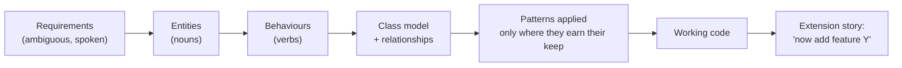

### What you are graded on

| Signal | Bad answer | Good answer |
|---|---|---|
| **Requirement clarity** | Starts coding immediately | Asks 3–5 scoping questions, states assumptions, agrees on scope |
| **Abstraction quality** | One `ParkingLotManager` doing everything | Small classes with one reason to change each |
| **Extensibility** ⭐ | `if (type == "CAR") … else if (type == "BIKE") …` | Polymorphism / Strategy — new type = new class, zero edits |
| **Correct pattern use** | Bolting on Singleton + Factory + Observer to look clever | Uses a pattern *because a specific force demanded it*, and can name the force |
| **Concurrency awareness** | Ignores it | Names the shared mutable state and how it's guarded |
| **Testability** | `new Database()` inside a constructor | Dependencies injected → mockable |

> ⭐ **The single strongest LLD signal:** the interviewer says *"now support motorbikes / a new payment method / a second logging destination"* and your answer is **"add one class, register it, nothing else changes."**

---

## 1. OOP Fundamentals

### 1.1 Class vs object

| Term | Meaning |
|---|---|
| **Class** | The blueprint — fields (state) + methods (behaviour) |
| **Object / instance** | A concrete thing built from that blueprint, with its own state |
| **Static member** | Belongs to the class, shared by every instance |

### 1.2 Interface vs abstract class — the question that decides levels

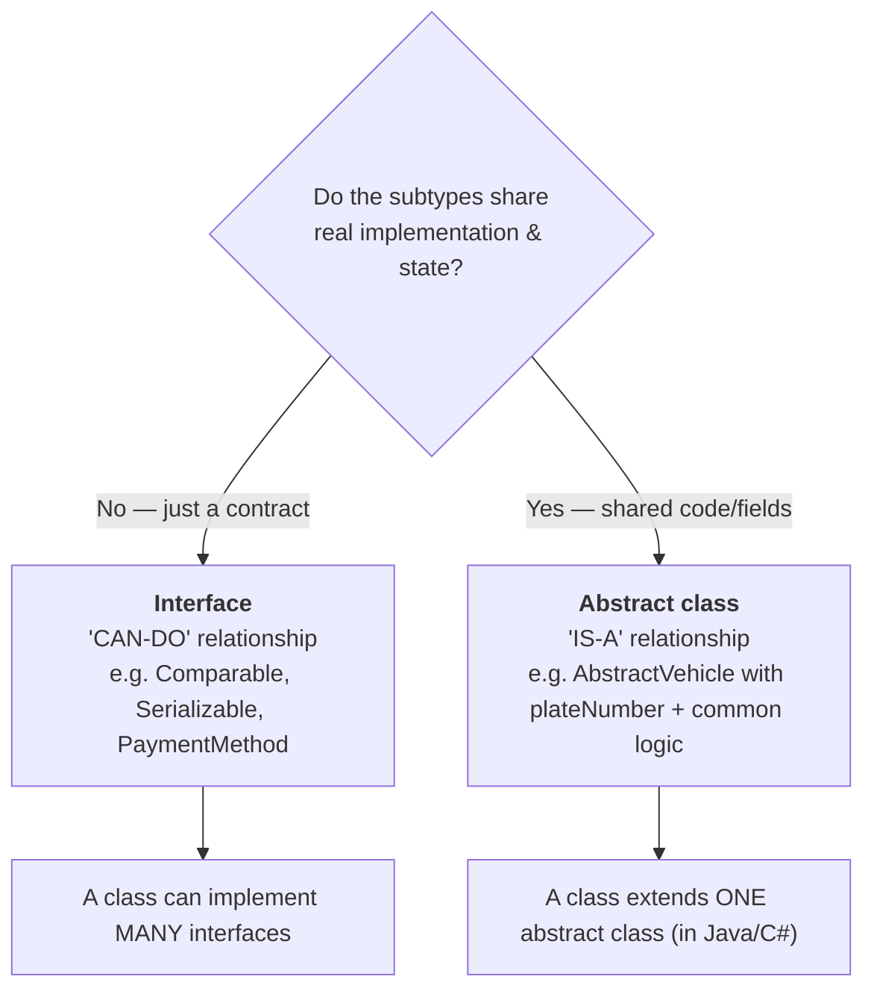

| | Interface | Abstract class |
|---|---|---|
| Holds state (fields) | ❌ (constants only) | ✅ |
| Constructor | ❌ | ✅ |
| Multiple inheritance | ✅ | ❌ |
| Default method bodies | ✅ (Java 8+ `default`) | ✅ |
| Semantics | *capability* | *identity / partial implementation* |
| Use when | Many unrelated classes need the same capability | Related classes share code and a common lifecycle |

> **Interview line:** *"I default to interfaces because they keep the coupling to a contract instead of a hierarchy. I reach for an abstract class only when there's genuinely shared state or a template algorithm the subclasses fill in."*

### 1.3 Enums — underused, high signal

```java
// ❌ Stringly typed - typos compile fine, no behaviour possible
if (vehicle.getType().equals("MOTORCYCLE")) { spotSize = 1; }

// ✅ Enum with behaviour and data - exhaustive, typo-proof, extensible
public enum VehicleType {
    MOTORCYCLE(1, 10.0),
    CAR(1, 20.0),
    TRUCK(2, 35.0);

    private final int spotsRequired;
    private final double hourlyRate;

    VehicleType(int spotsRequired, double hourlyRate) {
        this.spotsRequired = spotsRequired;
        this.hourlyRate = hourlyRate;
    }
    public int spotsRequired() { return spotsRequired; }
    public double hourlyRate()  { return hourlyRate; }
}
```

> ⭐ **Say this:** *"Enums in Java/C# are full classes — they can carry fields, implement interfaces, and even hold per-constant behaviour. That turns a `switch` into a lookup, which is one of the cheapest ways to satisfy Open/Closed."*

---

## 2. The Four Pillars

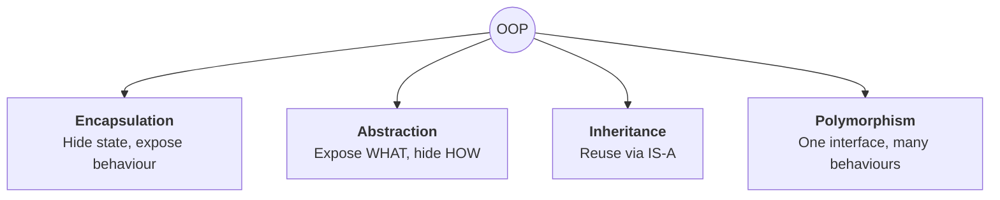

### 2.1 Encapsulation — bundle state + the rules that protect it

```java
// ❌ Anaemic: the invariant "balance >= 0" is enforced NOWHERE
public class Account { public double balance; }
account.balance -= 500;              // anyone can break it

// ✅ Encapsulated: the invariant lives with the data
public class Account {
    private double balance;
    public void withdraw(double amount) {
        if (amount <= 0)        throw new IllegalArgumentException("amount must be positive");
        if (amount > balance)   throw new InsufficientFundsException(id, amount, balance);
        balance -= amount;
    }
    public double getBalance() { return balance; }
}
```

> **The point of encapsulation is not getters and setters.** A class with a public getter and setter for every field is just a struct with extra typing. Encapsulation means **the class is the only thing that can put itself into an invalid state**.

### 2.2 Abstraction — the caller shouldn't know the mechanism

```java
public interface PaymentGateway { PaymentResult charge(Money amount, Card card); }
// Callers never learn whether it's Stripe, Razorpay or a mock.
```

**Abstraction vs encapsulation** (a classic trick question):

| Abstraction | Encapsulation |
|---|---|
| A **design**-time concern | An **implementation**-time concern |
| Hides **complexity** | Hides **data** |
| "What can this do?" | "Who is allowed to touch this?" |
| Achieved with interfaces / abstract classes | Achieved with access modifiers + invariants |

### 2.3 Inheritance — and why you should be suspicious of it

```java
// ❌ The classic violation - a Square IS-NOT-A Rectangle behaviourally
class Rectangle { void setWidth(int w); void setHeight(int h); }
class Square extends Rectangle {            // breaks Liskov
    void setWidth(int w)  { super.setWidth(w); super.setHeight(w); }   // surprise!
}
```

> ⭐ **Composition over inheritance.** Inheritance couples you to the parent's *implementation* forever; composition couples you to a *contract*. Prefer `has-a` unless the subtype is genuinely substitutable everywhere the parent is used.

### 2.4 Polymorphism

| Kind | Also called | Resolved | Example |
|---|---|---|---|
| **Runtime** | Dynamic dispatch, method **overriding** | Runtime, by object type | `Shape.area()` → `Circle.area()` |
| **Compile-time** | Method **overloading** | Compile time, by signature | `print(int)` vs `print(String)` |
| **Parametric** | Generics | Compile time | `List<T>` |

```java
// This loop never changes when you add a 12th shape. THAT is the win.
for (Shape s : shapes) total += s.area();
```

> **Interview line:** *"Every `if (type == …)` chain is a polymorphism opportunity I haven't taken yet."*

---

## 3. Class Relationships (the UML arrows)

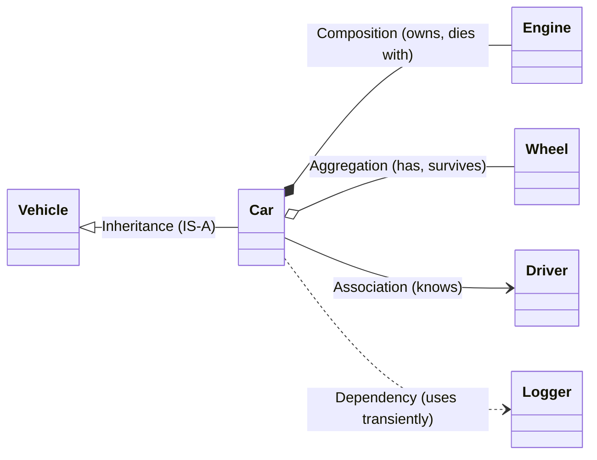

| Relationship | UML arrow | Meaning | Lifetime | Example |
|---|---|---|---|---|
| **Inheritance** | `<|--` hollow triangle | IS-A | — | `Car` is a `Vehicle` |
| **Composition** | `*--` filled diamond | **Owns**; part cannot exist alone | Part **dies with** the whole | `House` ↔ `Room`; `Order` ↔ `OrderLine` |
| **Aggregation** | `o--` hollow diamond | **Has**; part exists independently | Part **survives** the whole | `Team` ↔ `Player`; `Playlist` ↔ `Song` |
| **Association** | `-->` plain arrow | Knows about, long-lived reference | Independent | `Student` ↔ `Course` |
| **Dependency** | `..>` dashed | Uses temporarily (parameter / local / return) | Transient | `ReportService` uses `PdfWriter` |

### The one-line test

> **Composition:** *"If I delete the whole, does the part become meaningless?"* Yes → composition.
> **Aggregation:** *"Can the part be handed to a different whole tomorrow?"* Yes → aggregation.

```java
// COMPOSITION - Engine is created and owned by Car; no one else has a reference
class Car {
    private final Engine engine;
    Car(EngineSpec spec) { this.engine = new Engine(spec); }   // created inside
}

// AGGREGATION - Players are passed in and outlive the Team
class Team {
    private final List<Player> players;
    Team(List<Player> players) { this.players = players; }     // injected
}
```

> ⚠️ **Common mistake:** calling every `has-a` "composition". Interviewers listen for the lifetime distinction.

---

## 4. SOLID Principles

> **Memorise the acronym, but be able to give a smell → fix for each.** Reciting definitions scores nothing.

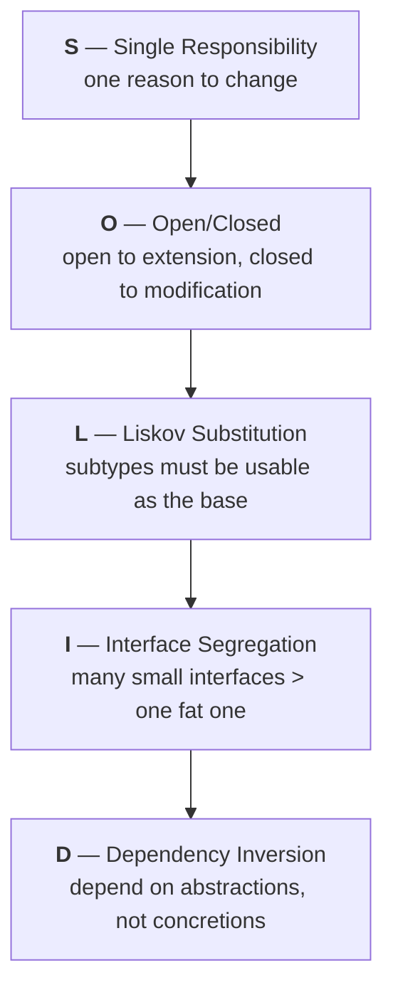

### 4.1 S — Single Responsibility Principle (SRP)

> *A class should have one, and only one, reason to change.*

```java
// ❌ Three reasons to change: report format, tax rules, storage
class Employee {
    double calculatePay()  { ... }   // changes when finance changes the rules
    String generateReport(){ ... }   // changes when HR wants a new format
    void   save()          { ... }   // changes when we move to Postgres
}

// ✅ Split by ACTOR, not by "one method per class"
class Employee { /* data + invariants */ }
class PayCalculator   { Money calculate(Employee e); }
class EmployeeReport  { String render(Employee e);   }
class EmployeeRepository { void save(Employee e);    }
```

**Smell:** the word "and" in the class description. **"It manages users *and* sends emails."**
⚠️ **Don't over-apply it** — 200 one-method classes is worse than 20 cohesive ones. The unit is *a reason to change*, i.e. *an actor who requests changes*.

### 4.2 O — Open/Closed Principle (OCP)

> *Open for extension, closed for modification.* Adding a feature should mean **adding** code, not **editing** existing tested code.

```java
// ❌ Every new shape edits (and risks breaking) this method
double area(Shape s) {
    if (s instanceof Circle)    return PI * r * r;
    if (s instanceof Rectangle) return w * h;
    // ...and again, and again
}

// ✅ New shape = new class. This method never changes again.
interface Shape { double area(); }
record Circle(double r)             implements Shape { public double area(){ return Math.PI*r*r; } }
record Rectangle(double w,double h) implements Shape { public double area(){ return w*h; } }
```

**Smell:** a `switch` or `if/else if` chain over a *type* or *enum of behaviours* that grows every sprint.
**Fix toolkit:** polymorphism · [Strategy](design-patterns.md#strategy) · [Factory](design-patterns.md#factory-method) · [Decorator](design-patterns.md#decorator) · [Chain of Responsibility](design-patterns.md#chain-of-responsibility).

### 4.3 L — Liskov Substitution Principle (LSP)

> *Anywhere the base type works, every subtype must work — without the caller knowing.*

```java
// ❌ Violates LSP: callers of Bird.fly() break on Penguin
class Bird     { void fly() { ... } }
class Penguin extends Bird { void fly() { throw new UnsupportedOperationException(); } }

// ✅ Model the capability, not the taxonomy
interface Bird     { void eat(); }
interface Flyable  { void fly(); }
class Sparrow implements Bird, Flyable { }
class Penguin implements Bird          { }
```

**The three LSP rules a subtype must obey:**
1. **Preconditions may not be strengthened** (don't demand more from the caller).
2. **Postconditions may not be weakened** (don't return less than promised).
3. **Invariants must be preserved** (and don't throw new exception types the base never declared).

**Smell:** `throw new UnsupportedOperationException()`, or a method that silently does nothing in a subclass, or callers doing `instanceof` before calling.

### 4.4 I — Interface Segregation Principle (ISP)

> *No client should be forced to depend on methods it does not use.*

```java
// ❌ A fat interface forces empty implementations
interface Worker { void work(); void eat(); void attendMeeting(); }
class Robot implements Worker {
    public void work() { ... }
    public void eat()  { }                 // meaningless
    public void attendMeeting() { }        // meaningless
}

// ✅ Role interfaces
interface Workable  { void work(); }
interface Feedable  { void eat();  }
class Robot  implements Workable { }
class Human  implements Workable, Feedable { }
```

**Smell:** empty method bodies, or `// not applicable` comments.

### 4.5 D — Dependency Inversion Principle (DIP)

> *High-level modules should not depend on low-level modules. Both should depend on abstractions.*

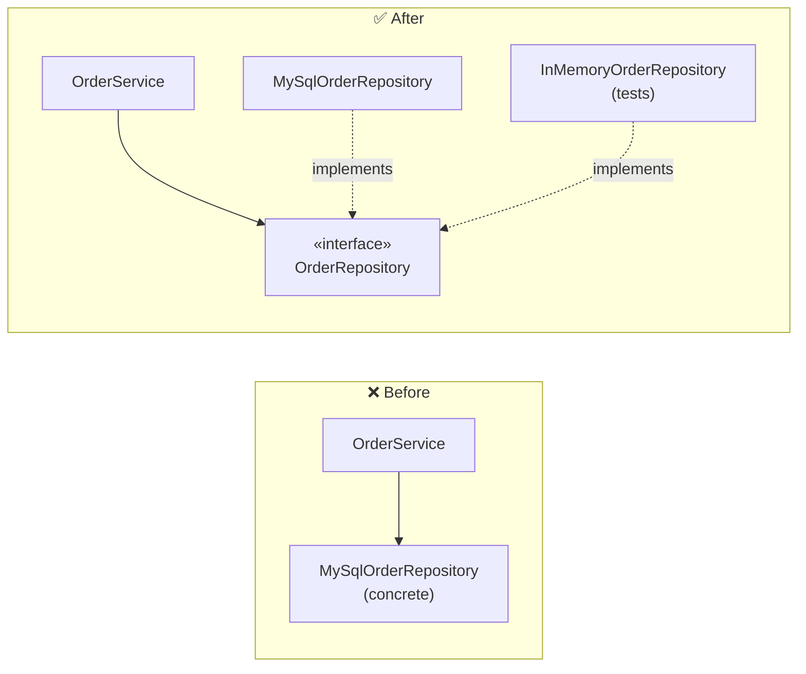

```java
// ❌ untestable, unswappable
class OrderService {
    private final MySqlOrderRepository repo = new MySqlOrderRepository();
}

// ✅ injected abstraction
class OrderService {
    private final OrderRepository repo;
    OrderService(OrderRepository repo) { this.repo = repo; }   // constructor injection
}
```

> ⭐ **The interview-winning line:** *"DIP is what makes the design testable. If I can't construct the class in a unit test without a database, I haven't inverted the dependency."*

**DI vs DIP vs IoC** (asked more than you'd think):
| Term | Meaning |
|---|---|
| **DIP** | The *principle*: depend on abstractions |
| **Dependency Injection** | A *technique*: pass dependencies in (constructor / setter / method) |
| **Inversion of Control** | The broader *idea*: the framework calls you, you don't call the framework |
| **IoC container** | Spring/Guice — a tool that wires the graph for you |

---

## 5. The Other Principles That Get Asked

| Principle | Meaning | Trap |
|---|---|---|
| **DRY** — Don't Repeat Yourself | Every piece of *knowledge* has one authoritative representation | ⚠️ DRY is about **knowledge**, not text. Two identical lines that change for *different reasons* should stay duplicated. Premature DRY creates the wrong abstraction, which is worse than duplication |
| **KISS** — Keep It Simple | The simplest thing that satisfies the requirement | Cleverness is a cost paid by every future reader |
| **YAGNI** — You Aren't Gonna Need It | Don't build for a requirement nobody asked for | The #1 cause of pattern-soup in interviews |
| **Law of Demeter** | Talk only to your immediate friends: `a.getB().getC().doThing()` is a smell | Chained getters expose internal structure — one refactor breaks 40 call sites |
| **Composition over Inheritance** | Prefer `has-a` to `is-a` | Deep hierarchies are rigid; composition is swappable at runtime |
| **Tell, Don't Ask** | `order.applyDiscount(d)` not `if (order.getTotal() > 100) order.setTotal(...)` | Asking for data and deciding outside = logic leaking out of the class |
| **Favour immutability** | Make fields `final`/`readonly`; return copies | Immutable objects are automatically thread-safe — half your concurrency problems vanish |

> **Balanced statement for the interview:** *"SOLID and DRY are heuristics, not laws. I apply them where change is likely and skip them where the code is stable and simple — over-abstraction has a real cost."*

---

## 6. UML — only what you need

### 6.1 Class diagram (the one you WILL draw)

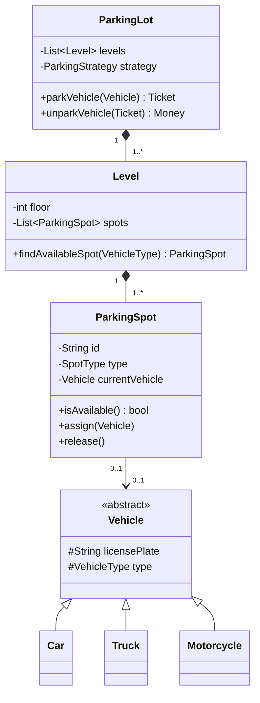

**Notation cheat sheet:**

| Symbol | Meaning |
|---|---|
| `+` | public · `-` private · `#` protected · `~` package |
| `<<interface>>` `<<abstract>>` `<<enumeration>>` | Stereotypes |
| `1`, `0..1`, `1..*`, `*` | Multiplicity |
| _underlined_ | static member |
| *italic* | abstract member |

### 6.2 The other four, in one line each

| Diagram | Answers | Draw it when |
|---|---|---|
| **Use case** | *Who* can do *what*? | Clarifying scope at the start |
| **Sequence** | In what *order* do objects message each other? | Explaining a flow (booking, payment, retry) |
| **Activity** | What's the *workflow*, including branches and parallelism? | Business processes / algorithms |
| **State machine** | What *states* can one object be in, and what triggers transitions? | Order, elevator, vending machine, ticket lifecycle |

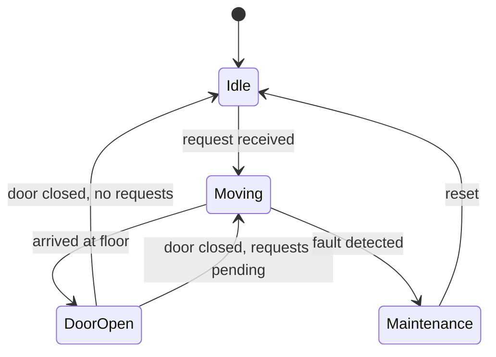

> ⭐ **Drawing a state diagram unprompted for a stateful problem (elevator, vending machine, order) is a strong senior signal** — it proves you found the states before you found the classes.

---

## 7. The LLD Interview Framework

> **45 minutes. Budget your time.** The most common failure is spending 30 minutes on requirements and having no code.

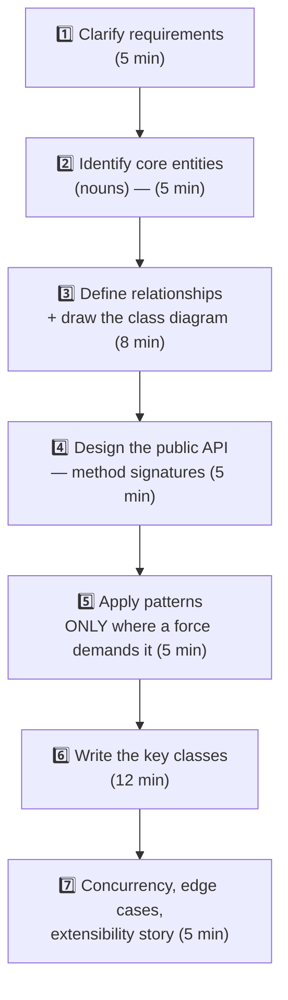

### Step 1 — Clarify (never skip)

Ask about **scope**, **scale**, and **the future**:

| Category | Questions to ask |
|---|---|
| **Scope** | "Single location or multiple? Do I need payments, or just the parking logic?" |
| **Actors** | "Who uses this — customer, admin, attendant? Do I need auth?" |
| **Scale** | "In-memory for one process, or does this need to be distributed?" |
| **Persistence** | "Should I assume a repository interface and not implement storage?" |
| **Concurrency** | "Multiple threads / simultaneous users?" |
| **Future** | "What's likely to be added later?" ← ⭐ this tells you where to put the seams |

Then **state your assumptions out loud** and write them down. *"I'll assume single lot, in-memory, thread-safe, no payment gateway integration — tell me if you'd rather I include it."*

### Step 2 — Entities: underline the nouns

> Write the requirement as a sentence and literally underline the nouns.
> *"A **customer** parks a **vehicle** in a **spot** on a **level** of a **parking lot** and receives a **ticket**; on exit a **fee** is calculated and a **payment** is made."*
> → `Customer, Vehicle, ParkingSpot, Level, ParkingLot, Ticket, Fee/PricingStrategy, Payment`

Then the **verbs** become methods: *park, unpark, calculate, pay, findAvailable*.

### Step 3 — Relationships

For each pair ask: *inheritance, composition, aggregation, association, or nothing?* Draw the diagram. **Add multiplicity** — it catches missing collections.

### Step 4 — Public API first

```java
public interface ParkingLotService {
    Ticket  park(Vehicle vehicle) throws NoSpotAvailableException;
    Receipt unpark(String ticketId) throws InvalidTicketException;
    int     availableSpots(VehicleType type);
}
```
Designing the API before the internals forces you to think from the caller's perspective and gives the interviewer something to react to early.

### Step 5 — Patterns, with justification

**Say the force, then the pattern.** Never the reverse.

| Force you notice | Pattern | Say |
|---|---|---|
| "Fee rules will change / vary by lot" | **Strategy** | *"Pricing is volatile, so I'll inject a `PricingStrategy` rather than branch on lot type."* |
| "Object's behaviour depends on its mode" | **State** | *"The elevator behaves differently when idle vs moving, so I'll model states as classes."* |
| "Creation logic is branchy" | **Factory** | *"`VehicleFactory` keeps the `switch` in one place instead of at every call site."* |
| "Many parties react to one event" | **Observer** | *"Display boards and the billing service both need spot-freed events."* |
| "Building an object with 10 optional fields" | **Builder** | *"Telescoping constructors would be unreadable."* |
| "Must be exactly one, globally" | **Singleton** ⚠️ | *"I'd usually prefer a single instance wired by DI — a true Singleton hurts testability."* |

See [design-patterns.md](design-patterns.md) for all 23 with code.

### Step 6 — Code the core

Write the **2–3 most interesting classes fully** and stub the rest. Interviewers care about the interesting ones. Say *"I'll stub the repository — the interface is what matters here."*

### Step 7 — Close strong

- **Concurrency:** name the shared mutable state and how you guard it (see [§8.5](#85-concurrency-the-part-most-candidates-skip)).
- **Edge cases:** lot full, invalid ticket, double unpark, payment failure mid-flow, clock skew.
- **Extensibility:** *"To add EV charging spots I add an enum value and a `ChargingSpot` subclass — no existing class changes."* ⭐
- **Testing:** *"Every dependency is injected, so I can unit test `park()` with an in-memory repository and a fixed clock."*

---

## 8. Worked Example — Parking Lot, end to end

> The most-asked LLD problem. Learn this one properly and 60% of the others become variations.

### 8.1 Requirements (after clarification)

**Functional**
- Multiple levels, each with multiple spots.
- Spot types: motorcycle, compact, large, handicapped, EV.
- Vehicle types: motorcycle, car, truck — each fits certain spot types.
- Park → issue ticket. Unpark → compute fee → take payment → free the spot.
- Show available count per type.

**Non-functional**
- Thread-safe: many entry gates park simultaneously.
- Pricing strategy must be swappable (hourly, flat, tiered, weekend).
- Storage abstracted behind a repository.

### 8.2 Class diagram

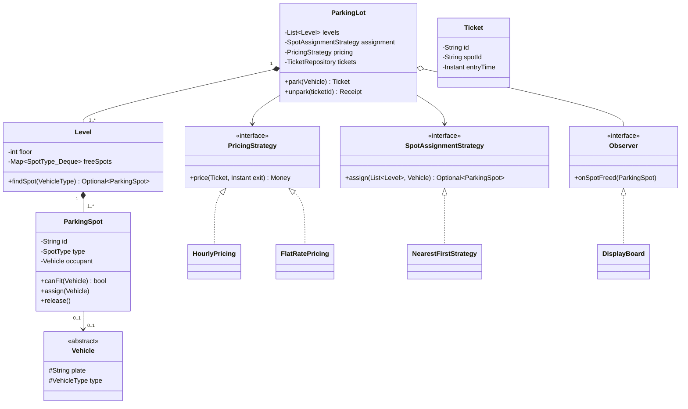

### 8.3 The code that matters

```java
public enum VehicleType { MOTORCYCLE, CAR, TRUCK }

public enum SpotType {
    MOTORCYCLE(EnumSet.of(VehicleType.MOTORCYCLE)),
    COMPACT   (EnumSet.of(VehicleType.MOTORCYCLE, VehicleType.CAR)),
    LARGE     (EnumSet.of(VehicleType.MOTORCYCLE, VehicleType.CAR, VehicleType.TRUCK)),
    EV        (EnumSet.of(VehicleType.CAR));

    private final Set<VehicleType> accepts;
    SpotType(Set<VehicleType> accepts) { this.accepts = accepts; }

    // The fit rules live in ONE place. Adding a vehicle type touches only this enum.
    public boolean accepts(VehicleType v) { return accepts.contains(v); }
}
```

```java
public abstract class Vehicle {
    private final String plate;
    private final VehicleType type;
    protected Vehicle(String plate, VehicleType type) {
        this.plate = Objects.requireNonNull(plate);
        this.type  = Objects.requireNonNull(type);
    }
    public String plate()     { return plate; }
    public VehicleType type() { return type;  }
}
public final class Car        extends Vehicle { public Car(String p){ super(p, VehicleType.CAR); } }
public final class Truck      extends Vehicle { public Truck(String p){ super(p, VehicleType.TRUCK); } }
public final class Motorcycle extends Vehicle { public Motorcycle(String p){ super(p, VehicleType.MOTORCYCLE); } }
```

```java
public final class ParkingSpot {
    private final String id;
    private final SpotType type;
    private Vehicle occupant;                 // guarded by the owning Level's lock

    public boolean isFree()              { return occupant == null; }
    public boolean canFit(Vehicle v)     { return isFree() && type.accepts(v.type()); }

    void assign(Vehicle v) {
        if (!canFit(v)) throw new IllegalStateException("spot " + id + " cannot take " + v.type());
        this.occupant = v;
    }
    void release() { this.occupant = null; }
}
```

```java
// STRATEGY: pricing is the most volatile rule in the system, so it is injected.
public interface PricingStrategy { Money price(Ticket ticket, Instant exitTime); }

public final class HourlyPricing implements PricingStrategy {
    private final Map<VehicleType, BigDecimal> ratePerHour;

    @Override public Money price(Ticket t, Instant exit) {
        long hours = Math.max(1, Duration.between(t.entryTime(), exit).toHours());
        return Money.of(ratePerHour.get(t.vehicleType()).multiply(BigDecimal.valueOf(hours)));
    }
}

public final class TieredPricing implements PricingStrategy {   // first hour free, then escalating
    @Override public Money price(Ticket t, Instant exit) { /* ... */ }
}
```

```java
public final class ParkingLot {
    private final List<Level> levels;
    private final SpotAssignmentStrategy assignment;
    private final PricingStrategy pricing;
    private final TicketRepository tickets;
    private final Clock clock;                          // injected => testable time
    private final List<SpotObserver> observers = new CopyOnWriteArrayList<>();

    public Ticket park(Vehicle vehicle) {
        ParkingSpot spot = assignment.assign(levels, vehicle)
            .orElseThrow(() -> new NoSpotAvailableException(vehicle.type()));

        Ticket ticket = new Ticket(UUID.randomUUID().toString(),
                                   spot.id(), vehicle.plate(), vehicle.type(),
                                   clock.instant());
        tickets.save(ticket);
        return ticket;
    }

    public Receipt unpark(String ticketId) {
        Ticket ticket = tickets.findById(ticketId)
            .orElseThrow(() -> new InvalidTicketException(ticketId));
        if (ticket.isClosed()) throw new TicketAlreadyClosedException(ticketId);

        Instant now = clock.instant();
        Money fee   = pricing.price(ticket, now);

        ParkingSpot spot = locate(ticket.spotId());
        spot.release();
        ticket.close(now, fee);
        tickets.save(ticket);

        observers.forEach(o -> o.onSpotFreed(spot));
        return new Receipt(ticket.id(), fee, now);
    }
}
```

### 8.4 What each SOLID principle bought here

| Principle | Where it shows up |
|---|---|
| **S** | `PricingStrategy` computes money; `ParkingLot` orchestrates; `TicketRepository` persists — three actors, three classes |
| **O** | New vehicle type = new `Vehicle` subclass + one `SpotType` entry. `ParkingLot` is untouched |
| **L** | Every `Vehicle` subclass is fully substitutable — none throws "unsupported" |
| **I** | `SpotObserver` has exactly one method; display boards don't implement parking logic |
| **D** | `ParkingLot` depends on `PricingStrategy`, `TicketRepository`, `Clock` — all interfaces, all injected |

### 8.5 Concurrency: the part most candidates skip

> ⭐ **This is the highest-value 90 seconds in the whole interview.**

**The race:** two gates call `park()` at the same instant, both see spot A-12 as free, both assign it.

```java
// ❌ check-then-act across two statements is NOT atomic
if (spot.isFree()) { spot.assign(vehicle); }
```

Three escalating fixes — name them all and pick one:

| Option | How | Trade-off |
|---|---|---|
| **1. Coarse lock** | `synchronized` on the whole `ParkingLot` | Simple and obviously correct. Serialises every gate — fine for one lot, bad for 20 levels |
| **2. Per-level lock** ⭐ | A `ReentrantLock` per `Level`; contention only between gates targeting the same floor | Best balance. Say: *"lock granularity should match the contention domain"* |
| **3. Lock-free queue** | `ConcurrentLinkedDeque<ParkingSpot>` of free spots per type; `poll()` is atomic — whoever gets it, owns it | Highest throughput, no locks; ordering ("nearest spot") becomes approximate |

```java
final class Level {
    private final Map<SpotType, ConcurrentLinkedDeque<ParkingSpot>> free;

    Optional<ParkingSpot> claim(VehicleType type) {
        for (SpotType st : SpotType.orderedFor(type)) {
            ParkingSpot spot = free.get(st).poll();   // atomic claim - no lock needed
            if (spot != null) { spot.assign(...); return Optional.of(spot); }
        }
        return Optional.empty();
    }
    void release(ParkingSpot spot) { spot.release(); free.get(spot.type()).offer(spot); }
}
```

Also mention: **idempotent unpark** (a retried `unpark` must not double-charge — check `ticket.isClosed()`), and **money must be `BigDecimal`/minor units, never `double`**.

### 8.6 Extension story (say this before they ask)

> *"To add EV charging: add `SpotType.EV` (already there), a `ChargingSpot extends ParkingSpot` with a `startCharging()` method, and an `EvPricingDecorator implements PricingStrategy` that wraps the base strategy and adds the energy charge. `ParkingLot` doesn't change. To add a second lot, `ParkingLot` becomes a member of a `ParkingLotManager` — the classes below it are untouched."*

---

## 9. Worked Example — Elevator System

> The best problem for demonstrating **State + Strategy + Observer** together, and the classic *"draw the state machine"* opportunity.

### 9.1 The states

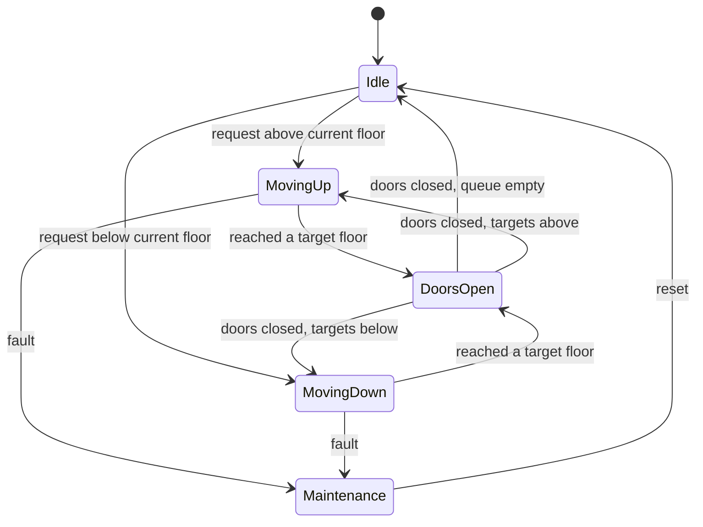

### 9.2 Design

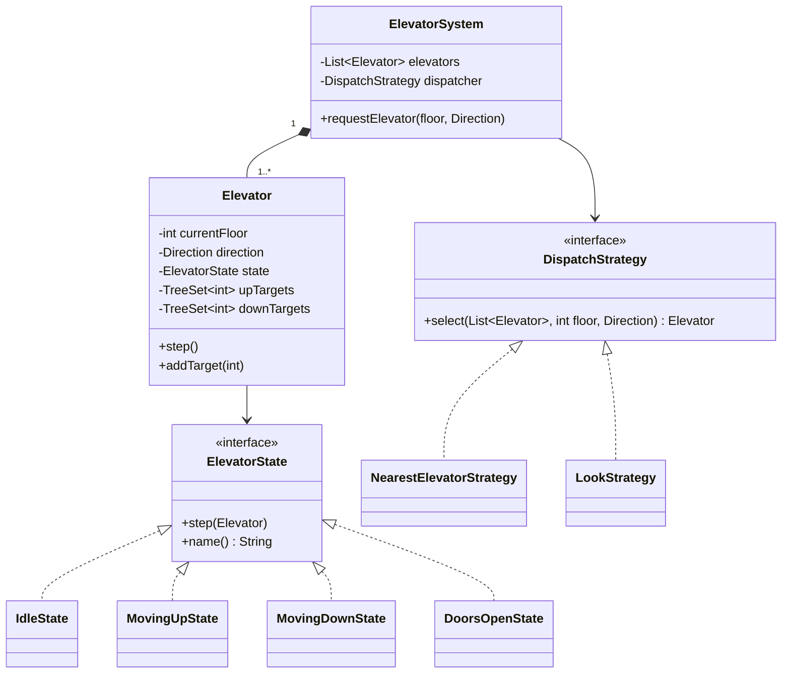

```java
// STATE: behaviour differs per mode, and transitions are explicit instead of a switch.
public interface ElevatorState {
    void step(Elevator e);
    Direction direction();
}

public final class MovingUpState implements ElevatorState {
    @Override public void step(Elevator e) {
        e.setCurrentFloor(e.currentFloor() + 1);
        if (e.upTargets().contains(e.currentFloor())) {
            e.upTargets().remove(e.currentFloor());
            e.setState(new DoorsOpenState());
        } else if (e.upTargets().isEmpty()) {
            e.setState(e.downTargets().isEmpty() ? new IdleState() : new MovingDownState());
        }
    }
    @Override public Direction direction() { return Direction.UP; }
}
```

**Why two sorted sets (`upTargets`, `downTargets`)?** That is the **SCAN / LOOK** disk-scheduling algorithm applied to elevators: serve everything in the current direction before reversing. Naming that algorithm is a strong signal.

> ⭐ **The dispatch question:** *"Which elevator do I send?"* is a **Strategy** — nearest-idle, same-direction-first, or minimise-total-wait. Say: *"Dispatch policy is exactly the kind of rule product will change monthly, so it must be injectable and A/B-testable."*

---

## 10. Problem Bank — and the pattern each one is testing

> Source list: [awesome-low-level-design](https://github.com/ashishps1/awesome-low-level-design). The right-hand column is what the interviewer is really probing.

### 🟢 Easy

| Problem | Really testing | Patterns that fit |
|---|---|---|
| **Parking Lot** | Entity modelling, enums, extensibility | Strategy, Factory, Singleton(⚠), Observer |
| **Vending Machine** | State machine discipline | **State**, Strategy (payment) |
| **Coffee Vending Machine** | Recipes + ingredient inventory | Factory, Builder, Template Method |
| **Stack Overflow** | Rich domain relationships, voting/reputation rules | Observer, Composite (comments), Strategy |
| **Logging Framework** | Levels, appenders, chaining | **Chain of Responsibility**, Strategy, Singleton, Decorator |
| **Traffic Signal** | Timed state transitions | **State**, Observer |
| **Task Management** | CRUD + filtering + notifications | Observer, Builder, Strategy (sorting) |

### 🟡 Medium

| Problem | Really testing | Patterns that fit |
|---|---|---|
| **ATM** | State machine + transaction integrity + cash dispensing | **State**, **Chain of Responsibility** (note denominations), Strategy |
| **LRU Cache** | Data-structure fluency: HashMap + doubly linked list, O(1) | — (algorithmic; see [data-structure.md](data-structure.md)) |
| **Elevator System** | Concurrency + scheduling + state | **State**, **Strategy**, Observer, Command |
| **Tic Tac Toe / Chess** | Board modelling, rule validation, win detection | **Strategy** (win rules), **Factory** (pieces), Command (undo), Memento |
| **Pub-Sub System** | Decoupling, topics, delivery semantics | **Observer**, Mediator |
| **Car Rental / Hotel / Airline** | Search + booking + inventory + double-booking prevention | Strategy (pricing), Builder (search criteria), State (booking) |
| **Digital Wallet** | Money handling, idempotency, transaction log | Command, State, Strategy |
| **Online Auction** | Bid rules + real-time notification + concurrency | **Observer**, State, Strategy |
| **Library Management** | Membership rules, fines, availability | Strategy (fines), Observer (holds), State |

### 🔴 Hard

| Problem | Really testing | Patterns that fit |
|---|---|---|
| **Splitwise** | Expense split algorithms + debt simplification graph | **Strategy** (equal/exact/percent), Observer |
| **Ride Sharing (Uber)** | Matching, geo-indexing, driver state, surge | **State**, **Strategy**, Observer, Factory |
| **Movie / Concert Booking** | **Seat locking under concurrency** ⭐ | State, **Proxy/lock**, Strategy, Observer |
| **Online Shopping (Amazon)** | Cart, inventory, order saga, payment | Builder, State, Strategy, Command, Facade |
| **Music Streaming (Spotify)** | Playlists, recommendation hooks, playback state | Composite, State, Strategy, Iterator |
| **Food Delivery (Swiggy)** | Three-party matching + live tracking | Observer, State, Strategy, Mediator |
| **CricInfo** | Live score modelling + derived stats | Observer, Builder, Composite |
| **Stock Brokerage** | Order types, matching engine, portfolio | **Strategy** (order types), Command, Observer, State |

> ⭐ **The concurrency question hides in the booking problems.** For Movie/Concert booking, the interviewer wants: *"Seats must be **locked** (not booked) for N minutes at selection time, with an expiry sweeper; the lock acquisition must be atomic — a DB row-level lock, a `SELECT … FOR UPDATE`, or a distributed lock with a TTL. Booking is then idempotent on a request ID."* Say that and the round is essentially over.

---

## 11. Code Smells → Refactorings

| Smell | Why it hurts | Refactoring |
|---|---|---|
| **God class** (`Manager`, `Helper`, `Util` with 40 methods) | No cohesion, everything depends on it | Extract Class along actor boundaries |
| **Long method** (> ~30 lines) | Can't be named, can't be tested | Extract Method until each does one thing |
| **Long parameter list** (> 3–4) | Callers pass args in the wrong order | Introduce Parameter Object / Builder |
| **`switch`/`if` on type** | Every new type edits it (violates OCP) | Replace Conditional with Polymorphism / Strategy |
| **Feature envy** (method uses another class's data more than its own) | Logic in the wrong place | Move Method |
| **Primitive obsession** (`String email`, `double money`) | No validation, no behaviour | Replace with Value Object (`Email`, `Money`) |
| **Train wreck** `a.b().c().d()` | Violates Law of Demeter | Hide Delegate / Tell-Don't-Ask |
| **Temporal coupling** (`init()` must be called before `use()`) | Silent bugs | Do the work in the constructor, or use a Builder |
| **Anaemic domain model** (all data, no behaviour) | Rules scatter into services | Move behaviour onto the entity |
| **Boolean flag parameter** `save(true)` | Unreadable; usually two methods in one | Split into two named methods |
| **Shotgun surgery** (one change edits 8 files) | Missing abstraction | Introduce the abstraction those 8 files want |

---

## 12. Anti-patterns & Red Flags

| ❌ Red flag | Why it costs you | ✅ Instead |
|---|---|---|
| Coding before asking a single question | Signals you'll build the wrong thing at work | 3–5 scoping questions first |
| Applying 6 patterns to a 4-class problem | Pattern soup = YAGNI violation | Name the *force*, then the pattern |
| `Singleton` everywhere | Global mutable state; untestable; hidden dependency | Single instance via DI container |
| Everything `public` | No encapsulation | Smallest visibility that works |
| `double` for money | Floating point rounding errors on currency | `BigDecimal` or integer minor units |
| No interfaces at all | Untestable, unswappable | Inject abstractions at the seams |
| An interface for *every* class | Ceremony with no benefit | Interfaces where variation is real |
| Ignoring thread safety | The most common senior-level gap | Name the shared state + the guard |
| Deep inheritance (4+ levels) | Fragile base class, rigid | Composition + Strategy |
| `catch (Exception e) {}` | Swallowed failures | Catch specific, or let it propagate |
| Not asking "what changes next?" | Design has no seams | Put the seam where change is expected |

---

## 13. Rapid-fire Q&A

| Question | Answer |
|---|---|
| **HLD vs LLD?** | HLD = services, data stores, protocols, scale. LLD = classes, interfaces, relationships, patterns inside one service. |
| **4 pillars of OOP?** | Encapsulation (hide state), abstraction (hide complexity), inheritance (reuse via IS-A), polymorphism (one interface, many behaviours). |
| **Abstraction vs encapsulation?** | Abstraction is design-time — *what* is exposed. Encapsulation is implementation-time — *who* can touch the data. |
| **Interface vs abstract class?** | Interface = capability contract, multiple inheritance, no state. Abstract class = partial implementation with shared state, single inheritance. |
| **Overloading vs overriding?** | Overloading = same name, different signature, resolved at **compile** time. Overriding = subclass replaces a base method, resolved at **runtime**. |
| **Aggregation vs composition?** | Both are HAS-A. Composition = part dies with the whole (`Order`→`OrderLine`). Aggregation = part survives (`Team`→`Player`). |
| **Association vs dependency?** | Association = a stored, long-lived reference (a field). Dependency = transient use (parameter, local, return type). |
| **Why composition over inheritance?** | Inheritance binds you to the parent's implementation permanently and is fixed at compile time; composition binds you to a contract and can be swapped at runtime. |
| **Explain SOLID in 30 seconds.** | One reason to change · extend without editing · subtypes fully substitutable · small role interfaces · depend on abstractions. |
| **Which SOLID principle is most violated?** | Open/Closed — every growing `if/else` chain over a type is a violation. |
| **What breaks Liskov?** | Strengthened preconditions, weakened postconditions, new unexpected exceptions, `UnsupportedOperationException`, callers doing `instanceof`. |
| **DRY gone wrong?** | Deduplicating two things that *look* alike but change for different reasons — you couple two independent rules. Duplication is cheaper than the wrong abstraction. |
| **Strategy vs State?** | Same structure, different intent. **Strategy** is chosen by the *client* and doesn't change itself. **State** is chosen by the *object's own condition* and transitions itself to the next state. |
| **Factory Method vs Abstract Factory?** | Factory Method = one product, subclass decides which. Abstract Factory = a *family* of related products from one interface. |
| **When would you refuse Singleton?** | Almost always: it's global mutable state, hides dependencies, breaks unit tests, and is a concurrency hazard. I'd use one DI-managed instance instead. |
| **How do you make a design testable?** | Inject every dependency (repo, clock, gateway) behind an interface; keep constructors free of I/O; avoid statics and `new` inside business logic. |
| **How do you handle concurrency in LLD?** | Name the shared mutable state; prefer immutability; then the smallest lock that covers the contention domain; use atomic/concurrent collections where possible; make retries idempotent. |
| **What's the first thing you do in an LLD round?** | Clarify scope, actors, scale and — crucially — *what's likely to be added later*, because that tells me where the seams go. |
| **How do you decide to use a pattern?** | I name the force first ("pricing changes per lot"). If no force exists, no pattern. YAGNI beats cleverness. |
| **What is a value object?** | An immutable object with no identity, compared by value — `Money`, `Email`, `Coordinate`. It kills primitive obsession and carries its own validation. |
