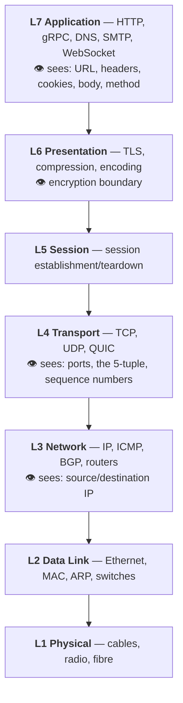
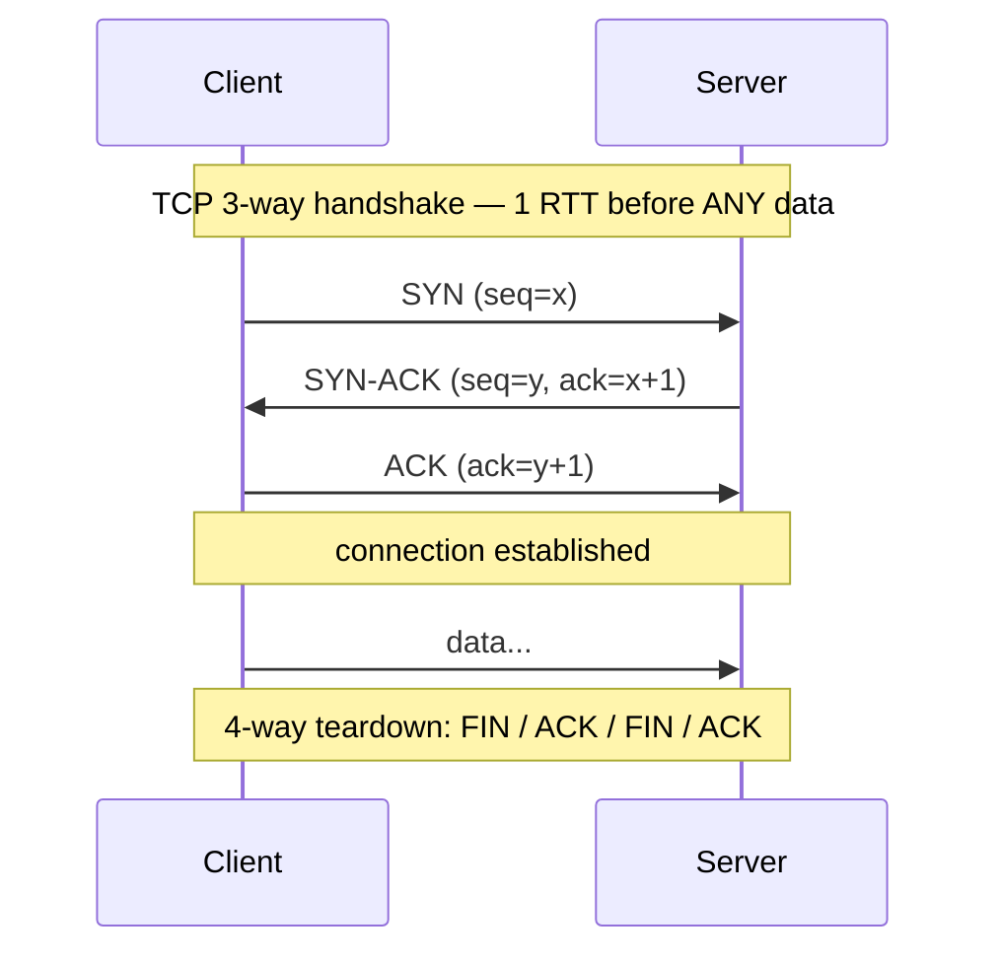
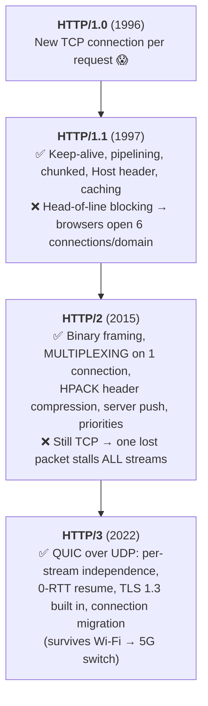
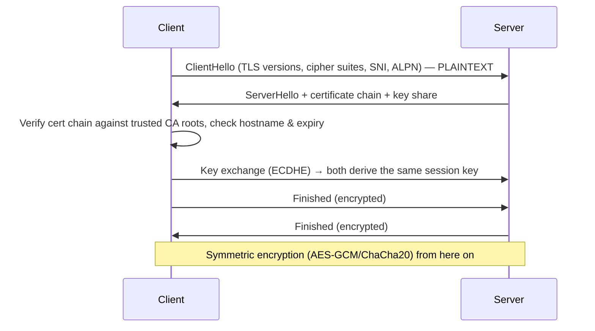
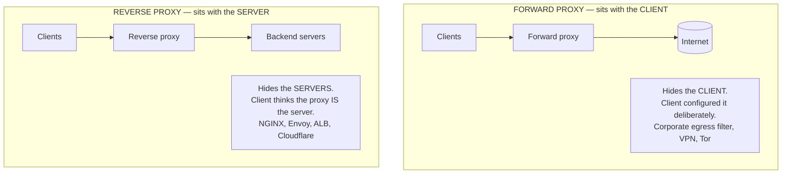
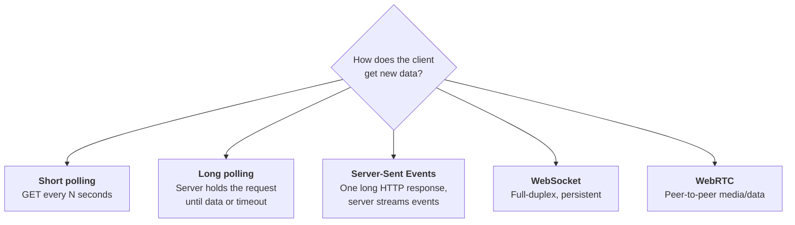
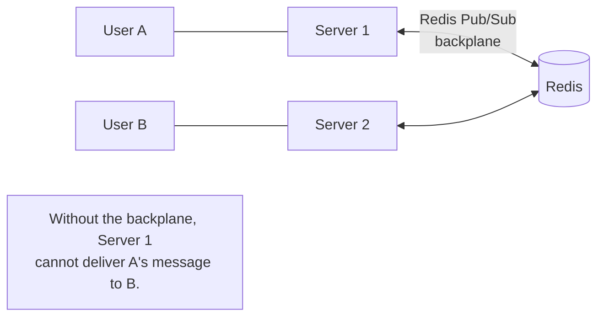
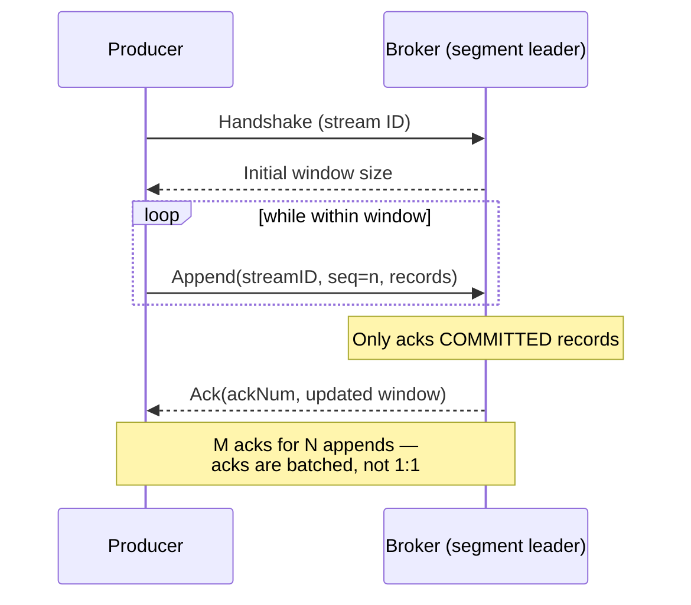

# Networking Fundamentals for System Design

> **Purpose:** the network knowledge that actually shows up in system-design and backend interviews — no more, no less.
> **Sources:** [awesome-system-design-resources](https://github.com/ashishps1/awesome-system-design-resources) · High Performance Browser Networking (Grigorik) · Cloudflare Learning Center · RFCs
> **Companions:** [DNS.md](DNS.md) · [load-balancer.md](load-balancer.md) · [rest-api.md](rest-api.md) · [latency.md](latency.md) · [README.md](README.md)

---

## Syllabus Coverage Index

| # | Topic | Section |
|---|---|---|
| 1 | OSI & TCP/IP models — what's visible at each layer | [§1](#1-the-osi-model-only-what-matters) |
| 2 | IP addressing, CIDR, NAT, public vs private, IPv4 vs IPv6 | [§2](#2-ip-addressing) |
| 3 | **TCP vs UDP** + the handshake, flow control, congestion control | [§3](#3-tcp-vs-udp) |
| 4 | **HTTP/1.1 → HTTP/2 → HTTP/3** and what each fixed | [§4](#4-http-evolution) |
| 5 | HTTPS / TLS handshake, mTLS, certificates, SNI | [§5](#5-https--tls) |
| 6 | Proxy vs reverse proxy vs NAT vs VPN vs CDN | [§6](#6-proxy-vs-reverse-proxy) |
| 7 | **Real-time**: polling vs long polling vs SSE vs WebSocket vs WebRTC | [§7](#7-real-time-communication--the-decision-table) |
| 8 | Checksums, CRC, hashing, retransmission | [§8](#8-checksums--data-integrity) |
| 9 | Sockets, ports, connection limits, keep-alive, connection pooling | [§9](#9-sockets-ports--connection-management) |
| 10 | Network failure modes an architect must plan for | [§10](#10-network-failure-modes) |
| ★ | Rapid-fire Q&A | [§11](#11-rapid-fire-qa) |
| ★ | 🏭 **Real-world: HTTP/2+Protobuf vs HTTP/1.1+JSON measured · app-level windowing · SWIM** | [§12](#12-real-world-case-studies--protocols-in-production) |

---

## 1. The OSI Model (only what matters)

**TCP/IP model** collapses this into 4 layers: Application (7+6+5) · Transport (4) · Internet (3) · Link (2+1). Most engineers speak the OSI numbers but think in the TCP/IP model.

### The only table you need to memorise

| Data | L3 | L4 | L7 (TLS terminated) | L7 (TLS passthrough) |
|---|---|---|---|---|
| Client IP | ✅ | ✅ | ✅ | ✅ |
| Destination port | ❌ | ✅ | ✅ | ✅ |
| **TLS SNI (hostname)** | ❌ | ⚠️ by peeking at the ClientHello | ✅ | ✅ |
| HTTP path / headers / cookies | ❌ | ❌ | ✅ | ❌ |
| Request body | ❌ | ❌ | ✅ | ❌ |

> ⭐ **The nuance that impresses:** the TLS `ClientHello` — including **SNI** and **ALPN** — travels **in plaintext**. So an "L4" device can route by hostname without terminating TLS. (**ECH / Encrypted Client Hello** is now closing that door — a good forward-looking remark.)

**The mental model:** *"Each layer adds a header and treats the layer above as opaque payload. That's why an L4 load balancer physically cannot route on a URL — the URL is inside a payload it never parses."* → [load-balancer.md](load-balancer.md)

---

## 2. IP Addressing

| Concept | Detail |
|---|---|
| **IPv4** | 32-bit, `192.168.1.1`, ~4.3 billion addresses — **exhausted** |
| **IPv6** | 128-bit, `2001:db8::1`, 3.4×10³⁸ addresses; no NAT needed |
| **CIDR** | `10.0.0.0/16` = the first 16 bits are the network → 65,536 addresses. Smaller number = bigger block |
| **Private ranges** (RFC 1918) | `10.0.0.0/8` · `172.16.0.0/12` · `192.168.0.0/16` — not routable on the internet |
| **NAT** | Many private IPs share one public IP by rewriting ports. ⚠️ Why **IP-hash load balancing collapses** — a whole office/carrier looks like one client |
| **Loopback** | `127.0.0.1` / `::1` |
| **Anycast** ⭐ | One IP advertised from many locations; BGP routes you to the nearest. Powers DNS root servers, CDNs, DDoS absorption |
| **Ephemeral ports** | Client-side source ports, typically 32768–60999 — **the reason one host can only hold ~28k concurrent connections to a single destination** |

> ⭐ **Subnet design in a VPC answer:** *"Public subnets hold the load balancer and NAT gateway; private subnets hold the app servers; isolated subnets hold the database with no route to the internet. Security groups are stateful allow-lists at the instance; NACLs are stateless at the subnet."*

---

## 3. TCP vs UDP

| | **TCP** | **UDP** |
|---|---|---|
| Connection | Connection-oriented (handshake) | Connectionless — just send |
| Reliability | ✅ Acks + retransmission | ❌ Fire and forget |
| Ordering | ✅ Guaranteed | ❌ Packets may arrive out of order |
| Flow control | ✅ Receiver window | ❌ |
| Congestion control | ✅ (slow start, AIMD, CUBIC/BBR) | ❌ (you must build it) |
| Header | 20+ bytes | **8 bytes** |
| Speed | Slower — setup + acks | **Faster**, lower latency |
| Broadcast/multicast | ❌ | ✅ |
| Used by | HTTP, HTTPS, SSH, SMTP, FTP, most databases | DNS, DHCP, NTP, VoIP, video streaming, gaming, **QUIC/HTTP/3** |

### When to actually pick UDP

> **The rule:** *"Use UDP when a **late** packet is worse than a **lost** packet."*

- **Live video / VoIP** — a frame that arrives 400 ms late is useless; drop it and move on.
- **Gaming** — the next position update supersedes the lost one anyway.
- **Metrics / logs (StatsD)** — losing 0.1% of samples is fine; blocking the app is not.
- **DNS** — a single small request/response; retrying is cheaper than a handshake.

⚠️ **DNS uses UDP/53 but falls back to TCP** when the response exceeds 512 bytes (DNSSEC, large record sets) or for zone transfers. → [DNS.md](DNS.md)

### TCP concepts that get asked

| Concept | What to say |
|---|---|
| **Head-of-line blocking** | TCP delivers in order, so **one lost packet stalls everything behind it** — the flaw HTTP/2 couldn't fix and HTTP/3 solved by moving to UDP |
| **Slow start & congestion window** | TCP starts cautiously and ramps up. ⭐ **This is why the first request on a new connection is slow and why connection reuse matters so much** |
| **Nagle's algorithm** | Batches small writes to avoid tiny packets; adds latency. Disable with `TCP_NODELAY` for chatty interactive protocols |
| **TIME_WAIT** | A closed socket lingers ~2×MSL (~60 s) to catch stray packets. Thousands of them exhaust ephemeral ports on a busy proxy |
| **Keep-alive** | Periodic probes detect a peer that vanished without a FIN. ⭐ Essential behind NAT/load balancers with idle timeouts (AWS NLB drops idle flows at **350 s**) |
| **Backlog queue** | `listen(backlog)` bounds pending connections; overflow = connection refused/dropped |

---

## 4. HTTP Evolution

| Feature | HTTP/1.1 | HTTP/2 | HTTP/3 |
|---|---|---|---|
| Transport | TCP | TCP | **QUIC over UDP** |
| Format | Text | Binary frames | Binary frames |
| Concurrency | 6 parallel connections (workaround) | Multiplexed streams | Multiplexed **independent** streams |
| Head-of-line blocking | At the **request** level | Fixed at HTTP level, remains at **TCP** level | ✅ Eliminated |
| Header compression | ❌ (repeated every request) | HPACK | QPACK |
| Encryption | Optional | Effectively mandatory in browsers | **Built in** (TLS 1.3) |
| Handshake RTTs | 1 (TCP) + 2 (TLS 1.2) | same | **1, or 0 on resume** |

> ⭐ **The HTTP/2 + load balancer trap:** *"HTTP/2 and gRPC multiplex thousands of requests over **one** long-lived connection. An L4 load balancer balances **connections**, so it sends all of them to one backend — the fleet goes completely lopsided. You need an L7 proxy that understands streams, or client-side load balancing via xDS."* → [load-balancer.md](load-balancer.md) §6.4

**HTTP methods & idempotency** (see [rest-api.md](rest-api.md)):

| Method | Safe | Idempotent | Cacheable |
|---|---|---|---|
| GET / HEAD | ✅ | ✅ | ✅ |
| PUT | ❌ | ✅ | ❌ |
| DELETE | ❌ | ✅ | ❌ |
| POST | ❌ | ❌ | ⚠️ rarely |
| PATCH | ❌ | ❌ (unless designed to be) | ❌ |

---

## 5. HTTPS & TLS

| Concept | Detail |
|---|---|
| **Asymmetric → symmetric** | Public-key crypto is used only to agree a **session key**; the bulk data uses fast symmetric encryption |
| **Certificate chain** | Leaf → intermediate → root CA in the OS/browser trust store |
| **TLS 1.3** | 1-RTT handshake (0-RTT on resume), removed all legacy weak ciphers. ⭐ Prefer it |
| **Forward secrecy** | Ephemeral keys (ECDHE) mean a stolen private key can't decrypt *past* traffic |
| **SNI** | The hostname sent in plaintext so one IP can host many certificates |
| **mTLS** | **Both** sides present certificates — the standard for service-to-service zero-trust |
| **Session resumption** | Session tickets / PSK avoid a full handshake — a big win at scale |
| **HSTS** | `Strict-Transport-Security` forces HTTPS and blocks downgrade attacks |

**Where do you terminate TLS?**

| Option | Trade-off |
|---|---|
| **At the edge / LB** ⭐ | Central certs, offloads CPU, enables L7 routing and caching. But traffic inside is plaintext — acceptable only in a trusted network |
| **Re-encrypt** | Terminate at the LB, then open a fresh TLS connection to the backend. Best of both; costs CPU twice |
| **End-to-end passthrough** | Required for compliance/mTLS. ❌ You lose all L7 features |

---

## 6. Proxy vs Reverse Proxy

| | Forward proxy | Reverse proxy |
|---|---|---|
| Whose side | Client's | Server's |
| Hides | The client | The servers |
| Use | Egress control, caching, anonymity | TLS termination, load balancing, caching, WAF, compression |

**The wider family:**

| Component | Job |
|---|---|
| **Load balancer** | Spread traffic across backends → [load-balancer.md](load-balancer.md) |
| **API gateway** | Per-API policy: authN/Z, rate limiting, quotas, transformation → [rest-api.md](rest-api.md) |
| **CDN** | Cache and serve at the edge, close to users |
| **NAT gateway** | Address translation for outbound traffic from private subnets |
| **VPN** | Encrypted tunnel joining two networks |
| **Service mesh sidecar** | Per-pod L4/L7 proxy for **east-west** traffic: mTLS, retries, tracing |

> **One-liner:** *"A reverse proxy is an architectural **position**; a load balancer is a **role** it usually plays. Every L7 load balancer is a reverse proxy, but a reverse proxy in front of a single origin doing TLS and caching is still a reverse proxy."*

---

## 7. Real-time Communication — the decision table

| | Short polling | Long polling | SSE | WebSocket | WebRTC |
|---|---|---|---|---|---|
| Direction | Client → Server | Client → Server | **Server → Client** | **Bidirectional** | Peer ↔ Peer |
| Protocol | HTTP | HTTP | HTTP | `ws://` after HTTP Upgrade | UDP/SRTP |
| Latency | Poor (up to the interval) | Good | Good | **Best** | **Best** |
| Server cost | ❌ Wasteful (mostly empty responses) | Holds a connection per client | One connection per client | One connection per client | Minimal (P2P) |
| Auto-reconnect | n/a | Manual | ✅ Built in (`Last-Event-ID`) | Manual | Manual |
| Works through proxies/firewalls | ✅ Everywhere | ✅ | ✅ | ⚠️ Usually | ⚠️ Needs STUN/TURN |
| Binary | ✅ | ✅ | ❌ Text only | ✅ | ✅ |
| Use for | Low-frequency status checks | Legacy fallback | **Notifications, live feeds, stock tickers, LLM token streaming** ⭐ | **Chat, multiplayer, collaborative editing, trading** | **Video/voice calls, screen share** |

> ⭐ **The answer that scores:** *"I'd default to **SSE** when updates are one-directional — it's just HTTP, so it works with every proxy, reconnects automatically, and needs no special infrastructure. I'd move to **WebSocket** only when the client also needs to push at high frequency. And I'd note that WebSockets are stateful, so they force sticky routing, complicate deploys (every reconnect is a thundering herd), and need a **pub/sub backplane like Redis** so any server can reach any connected user."*

**The WebSocket scaling problem, in one diagram:**

---

## 8. Checksums & Data Integrity

| Mechanism | Purpose | Note |
|---|---|---|
| **TCP/IP checksum** | Detect accidental corruption in transit | Weak (16-bit) — not cryptographic |
| **CRC32** | Detect corruption in storage/frames (Ethernet, ZIP, Kafka records) | Fast, non-cryptographic |
| **MD5 / SHA-1** | Legacy content fingerprints | ⚠️ **Cryptographically broken** — never use for security |
| **SHA-256** | Integrity + signatures + content addressing | The default |
| **HMAC** | Integrity **and authenticity** (keyed) | ⭐ How **webhook signatures** work — `X-Hub-Signature-256` |
| **ETag** | HTTP cache validator | → [caching.md](caching.md) |

> ⭐ **Where this shows up in design:** *"For a file-upload service I'd have the client send a SHA-256 of each chunk. The server verifies it, which gives idempotent retries (same hash = same chunk, skip it) and dedupe (content-addressed storage). That's how Dropbox and Git both work."*

---

## 9. Sockets, Ports & Connection Management

| Concept | Detail |
|---|---|
| **Socket** | The endpoint: `(protocol, local IP, local port, remote IP, remote port)` — the **5-tuple** |
| **Well-known ports** | 80 HTTP · 443 HTTPS · 22 SSH · 53 DNS · 5432 Postgres · 3306 MySQL · 6379 Redis · 9092 Kafka · 27017 MongoDB |
| **Server connection limit** | ⭐ **Not 65,535.** A server socket is identified by the full 5-tuple, so one listening port can hold *millions* of connections — the real limits are file descriptors, memory (~4–10 KB/conn) and CPU |
| **Client connection limit** | ⚠️ ~28,000 to a **single** destination IP:port, bounded by ephemeral ports |
| **C10K / C10M** | The classic problem: serving 10k+ concurrent connections. Solved by event loops (epoll/kqueue/io_uring) instead of thread-per-connection |
| **Connection pooling** ⭐ | Reuse TCP+TLS connections. Avoids handshake RTTs *and* TCP slow start. **The single cheapest latency win in most services** |
| **Keep-alive tuning** | Idle timeout must be **shorter** than any NAT/LB idle timeout, or you'll send on a dead connection and see mysterious resets |

> ⭐ **A great thing to mention:** *"An L7 proxy collapses connection count dramatically — 100,000 client connections become ~200 pooled backend connections. That's a 500× reduction in the memory and file descriptors the app servers must carry, and it shields them from slow clients."* → [load-balancer.md](load-balancer.md) §6.3

---

## 10. Network Failure Modes

> **The 8 fallacies of distributed computing** — every one is a wrong assumption people still make:
> 1. The network is reliable · 2. Latency is zero · 3. Bandwidth is infinite · 4. The network is secure · 5. Topology doesn't change · 6. There is one administrator · 7. Transport cost is zero · 8. The network is homogeneous.

| Failure | Symptom | Design response |
|---|---|---|
| **Packet loss** | Retransmits, latency spikes | TCP handles it; for UDP, build FEC or accept loss |
| **Partition / split brain** | Both halves think they're primary | Quorum, fencing tokens, CAP decision ([databases.md](databases.md)) |
| **Grey failure** ⭐ | Not down — just *slow*. Health checks pass, users suffer | **Latency-based** health checks, outlier ejection, circuit breakers |
| **Retry storm** | One slow service → everyone retries → it dies harder | **Retry budgets**, exponential backoff **+ jitter**, circuit breakers |
| **Cascading failure** | One saturated dependency exhausts every caller's threads | **Bulkheads**, timeouts on *every* remote call, load shedding |
| **DNS TTL surprise** | Failover takes 30 minutes because a client cached the record | Short TTLs for failover records; don't rely on DNS as your only failover ([DNS.md](DNS.md)) |
| **Idle connection reaped** | Silent hang on a long-lived connection | TCP keep-alive shorter than the LB idle timeout |
| **Clock skew** | Ordering and expiry logic breaks | NTP; use logical clocks / server timestamps; never trust client time |

> ⭐ **Always set a timeout.** *"An unbounded remote call is a thread leak with extra steps. Every network call in my design has a timeout shorter than my caller's timeout, so the failure surfaces at the right layer instead of exhausting the pool."*

---

## 11. Rapid-fire Q&A

| Question | Answer |
|---|---|
| **TCP vs UDP in one sentence?** | TCP is reliable, ordered and congestion-controlled with a handshake; UDP is fire-and-forget with an 8-byte header. |
| **When would you choose UDP?** | When a late packet is worse than a lost one: live video, VoIP, gaming, metrics, DNS. |
| **Why does DNS use UDP?** | One small request/response — a handshake would cost more than a retry. It falls back to TCP above 512 bytes. |
| **What's the TCP 3-way handshake?** | SYN → SYN-ACK → ACK. One RTT before any data, which is why connection reuse matters. |
| **What is head-of-line blocking?** | One lost/slow item stalls everything behind it. At the request level in HTTP/1.1, at the TCP level in HTTP/2, eliminated in HTTP/3. |
| **What did HTTP/2 add?** | Binary framing, stream multiplexing over one connection, HPACK header compression, prioritisation, server push. |
| **Why HTTP/3 over UDP?** | To escape TCP's in-order delivery, get 0-RTT resumption, and support connection migration across network changes. |
| **Why does HTTP/2 break L4 load balancing?** | Thousands of requests ride one connection, so connection-level balancing sends them all to one backend. |
| **Explain the TLS handshake.** | Negotiate version/cipher, verify the certificate chain, agree a session key with ECDHE, then switch to symmetric encryption. |
| **What is SNI and why does it matter?** | The hostname sent in plaintext in the ClientHello so one IP can serve many certificates — and so L4 devices can route by host without decrypting. |
| **What is mTLS?** | Both client and server present certificates — the zero-trust default for service-to-service traffic. |
| **Forward proxy vs reverse proxy?** | Forward hides the client and is configured by the client; reverse hides the servers and is invisible to the client. |
| **Polling vs long polling vs SSE vs WebSocket?** | Polling wastes requests; long polling holds the request; SSE is one-way server push over plain HTTP with auto-reconnect; WebSocket is full-duplex and persistent. |
| **How do you scale WebSockets?** | Sticky/L4 routing, a **Redis pub/sub backplane** so any server can reach any user, connection draining on deploy, and reconnect with jittered backoff. |
| **How many connections can a server hold?** | Not limited by 65,535 — a connection is a 5-tuple. The real limits are file descriptors, memory per connection and CPU. |
| **Why is connection pooling important?** | It amortises the TCP + TLS handshake **and** avoids restarting TCP slow start on every request. |
| **What is anycast?** | One IP advertised from many locations; BGP routes each user to the nearest. Used by CDNs, DNS roots and DDoS scrubbing. |
| **Why does IP-hash load balancing fail?** | NAT/CGNAT makes thousands of users share one source IP, so they all land on one backend. |
| **What's a grey failure?** | A dependency that's *slow*, not down. Health checks pass while users time out. Detect with latency-based checks and eject outliers. |
| **How do you stop a retry storm?** | Exponential backoff **with jitter**, a retry budget (e.g. retries ≤ 10% of requests), circuit breakers, and never retrying non-idempotent calls blindly. |

---

## 12. Real-World Case Studies — protocols in production

> **Sources:** Uber — *[High-performance gRPC in OpenSearch](https://www.uber.com/in/en/blog/high-performance-grpc/)* (Apr 2026) · LinkedIn — *[Northguard and Xinfra](https://www.linkedin.com/blog/engineering/infrastructure/introducing-northguard-and-xinfra)* (Jun 2025).

### 12.1 HTTP/1.1 + JSON vs HTTP/2 + Protobuf — measured

Uber's OpenSearch clusters spoke only **REST/JSON over HTTP/1.1**, while the rest of Uber speaks **gRPC/Protobuf over HTTP/2**. The gateway in between transpiled Protobuf→JSON and back on every request. Adding a native gRPC transport to OpenSearch removed that adaptor. The results isolate exactly what [§4](#4-http-evolution) claims about HTTP/2 and binary framing:

| Workload | Metric | REST/JSON → gRPC | Change |
|---|---|---|---|
| Metrics ingest (Bulk) | p99 write latency | 34.1 ms → 13.6 ms | **≈ −60%** |
| Metrics ingest (Bulk) | p50 write latency | 15.8 ms → 10.5 ms | **≈ −34%** |
| Vector search | p50 | 83 ms → 38 ms | **≈ −53%** |
| Vector search | p99 | 205 ms → 176 ms | **≈ −14%** |

**Where the bytes went** — a 1,572-dimension vector query body:

| Encoding | Request size |
|---|---|
| REST / JSON | **40,523 B** |
| gRPC / Protobuf | **4,590 B** (**−88.7%**) |

A `float32` is 4 bytes packed in Protobuf; as JSON text it's a dozen-plus characters that must also be parsed. Multiply by 1,572.

**Two independent axes — say them separately.** Uber also benchmarked **SMILE** (binary JSON) across both transports:

| Comparison | gRPC + SMILE is… |
|---|---|
| vs REST + JSON | **30% faster** |
| vs gRPC + JSON | **45% faster** |
| vs REST + SMILE | **47% faster** |

> ⭐ **Say this:** *"'gRPC is faster' conflates two things. The **transport** wins from HTTP/2 — binary framing, multiplexing over one connection, header compression, no per-request handshake. The **encoding** wins separately from Protobuf vs JSON, and that win scales with payload size. Uber's data shows both: gRPC+SMILE beat gRPC+JSON by 45%, which is purely encoding, and beat REST+SMILE by 47%, which is purely transport."*

**Uber's own summary of when the transport wins:** large request sizes · higher throughput at larger RPS · binary document formats. Their p99 search improved only 14% *"due to long-tail large queries"* — a reminder that serialization gains are proportional to payload size and don't fix a slow backend.

**Deployment shape worth copying:** the gRPC transport ships as a **module on a different set of ports**, running alongside REST. *"Only the client-server layer differs between the REST and gRPC transports, while the internal node-to-node logic remains shared."* Two listeners, one core — so teams migrate incrementally instead of by flag day.

### 12.2 Application-level flow control — reinventing the TCP window on purpose

Northguard's wire protocols are a beautiful, compact illustration of everything in [§3](#3-tcp-vs-udp) and [§4](#4-http-evolution), because LinkedIn deliberately chose a different protocol shape for each traffic class:

| Traffic | Protocol shape | Why |
|---|---|---|
| **Metadata** (`CreateTopic`, `TopicMetadata`, `SegmentMetadata`) | **Unary** — one request, one response | Low volume, request/response semantics, needs routing to a specific leader |
| **Produce / consume / replication** | **Sessionized streaming** with **pipelining** and **windowing** | High volume, continuous, must not pay per-message protocol overhead |

> *"We sessionize state to the stream to avoid protocol overhead. These protocols use **pipelining** to keep data moving and **windowing** to control how much can be pipelined at any time."*

Look at what that is: **a sliding window with cumulative, batched acknowledgements over an already-reliable transport.** It's TCP's design, re-implemented one layer up — because TCP's window governs *bytes on the wire*, not *records the application has durably committed*. Only the application knows when a record has been `fsync`'d on all replicas, so only the application can safely ack it.

| Detail | Networking concept it mirrors |
|---|---|
| Handshake establishes a stream ID and initial window | Connection setup + receive window advertisement |
| Producer sends `Append`s with **sequence numbers** while within the window | Pipelining / in-flight bytes bounded by the window |
| Broker sends **M acks for N appends**, each carrying an updated window | Cumulative ACK + window update ([§3](#3-tcp-vs-udp)) |
| Consume stream is the mirror image with the **client** choosing the window | Receiver-driven flow control — the consumer sets its own backpressure |
| Sealed-segment replication **is literally the consume protocol between two brokers** | Protocol reuse — one implementation, three uses |

> ⭐ **Say this:** *"Reliable transport is not the same as application-level flow control. TCP guarantees the bytes arrive; it can't tell the sender that the receiver has durably committed them, or slow the sender down when the receiver's disk is the bottleneck. That's why every serious streaming protocol — gRPC, HTTP/2, Kafka, Northguard — re-implements windowing above the transport."*

### 12.3 Failure detection over the network — SWIM instead of centralised heartbeats

Kafka's brokers heartbeat to a **single controller**; that's a centralised membership design whose cost grows with cluster size ([§10](#10-network-failure-modes)). Northguard uses **SWIM** gossip instead:

| SWIM component | Behaviour |
|---|---|
| **Failure detection** | **Random probing** — each node periodically probes a random peer, with indirect probes through other members before declaring it dead |
| **Dissemination** | **Infection-style** (epidemic) broadcast of membership changes — converges without a coordinator |
| **Payload kept deliberately tiny** | Only broker host, port and attributes, plus each metadata shard's hash-ring boundaries, leader, term and replicas |

Why the small payload matters: gossip cost is a function of message size × fanout × frequency. Keeping *"minimal global state"* is what lets the protocol scale to thousands of nodes — and it's still enough to **route a client request to the correct leader**, since any broker can act as a proxy using its gossipped view.

### 12.4 Kernel bypass at the storage layer — Direct I/O

Northguard's storage engine uses **Direct I/O** rather than relying on the OS page cache:

| Benefit | Explanation |
|---|---|
| **No double buffering** | Data isn't held in both the page cache and the application's own buffers |
| **Application-level caching that actually knows the access pattern** | The broker knows which **consume streams** are active, so it caches what will genuinely be read next — the kernel can only guess |
| **Consistent state across `fsync` failures** | Improves durability, because a failed `fsync` doesn't leave dirty pages in an ambiguous state |
| **No page-cache pollution** | Replicas nobody is consuming from, and long historical catch-up reads, no longer evict hot data |

This is the same class of argument as **connection pooling** or **TLS session resumption**: the generic OS/protocol default is tuned for the average case, and a system that knows its own access pattern can beat it — but only if it's willing to own the complexity.

> ⭐ **Say this:** *"Bypassing a generic layer — the page cache, the kernel network stack, a managed load balancer — is only justified when you have information the generic layer doesn't. Northguard bypasses the page cache because it knows which consume streams are active; that's a real information advantage. Bypassing without that advantage just means reimplementing something worse."*
