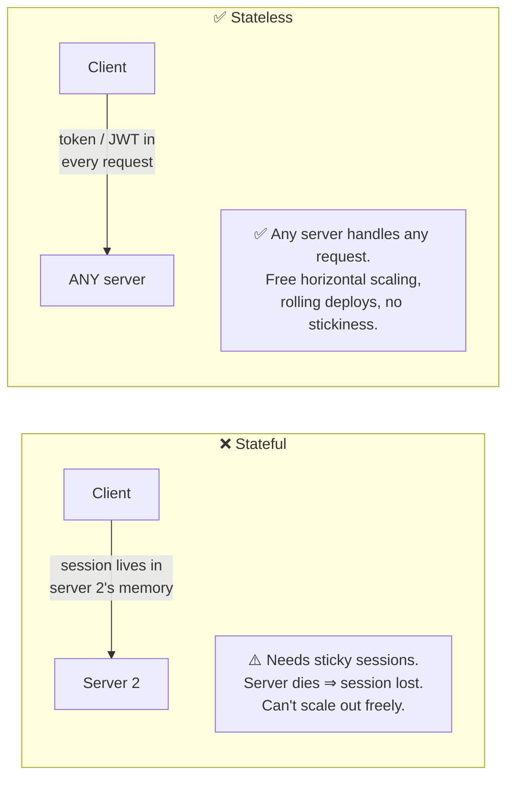
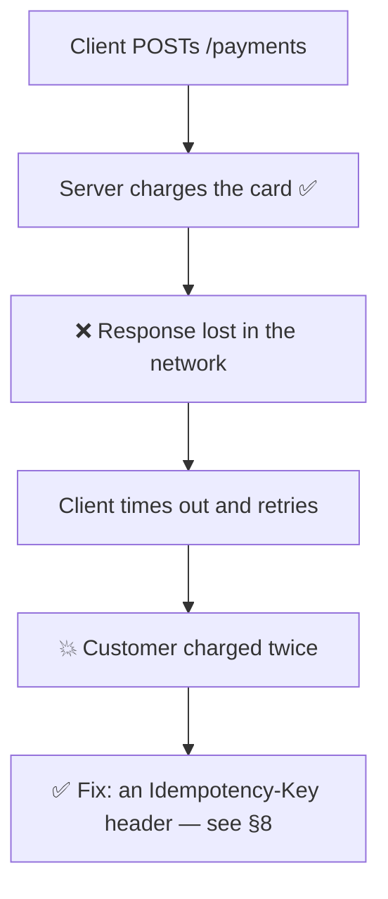
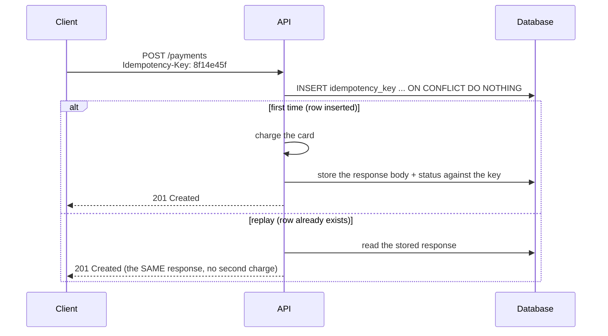
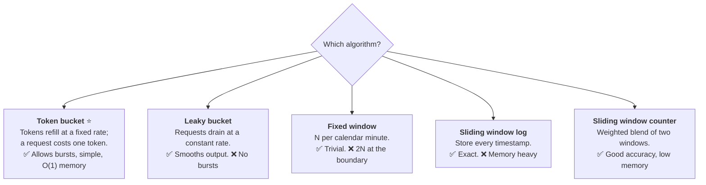
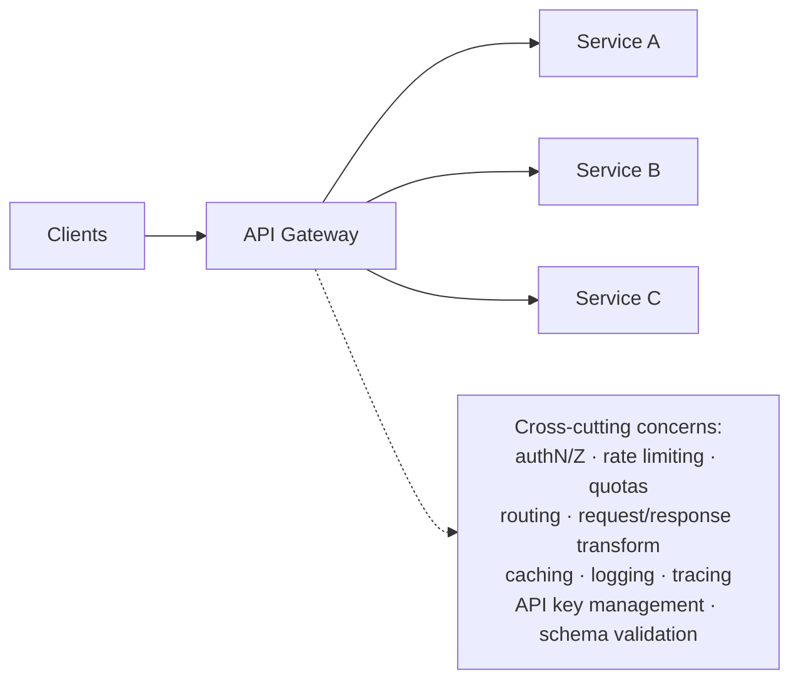
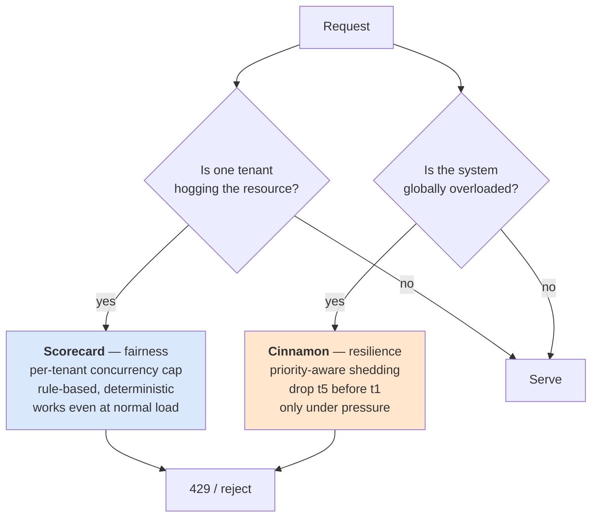

REST APIs
1. these api organizes resources into set of unique URIs
2. resources should be grouped by noun and not verb e.g. /product (correct) /getAllProducts (incrroect)
3. POST - create (not idempotent), GET- Read, PUT-update, DELETE-delete (idempotent)
4. 200 - success, 400 level - something wrong with our request, 500 level-something wrong at server level
5. its stateless, dont need to store any info either at client or server level
6. use pagination if we have huge data
7. versioning should be there like v1/products or v2/products

---

# REST API Design — Interview-Ready Deep Dive

> **Purpose:** expand the seven rules above into a design guide you can defend line by line, plus the API-platform topics interviewers pair with REST — idempotency, rate limiting, gateways, auth and security.
> **Sources:** [awesome-system-design-resources](https://github.com/ashishps1/awesome-system-design-resources) · Stripe / GitHub / Google API design guides · Richardson Maturity Model · OWASP API Security Top 10
> **Companions:** [restvsgraphqlVsRPC.md](restvsgraphqlVsRPC.md) · [networking.md](networking.md) · [system-design-course-fcc.md](system-design-course-fcc.md) · [databases.md](databases.md) · [README.md](README.md)

---

## Index

| # | Topic | Section |
|---|---|---|
| 1 | The 6 REST constraints + Richardson Maturity Model | [§1](#1-what-rest-actually-requires) |
| 2 | **Resource naming** — the full rule set | [§2](#2-resource-naming-rules) |
| 3 | Methods, **idempotency & safety** | [§3](#3-methods-safety--idempotency) |
| 4 | **Status codes** — the ones that matter | [§4](#4-status-codes-that-matter) |
| 5 | **Pagination** — offset vs cursor vs keyset | [§5](#5-pagination-done-properly) |
| 6 | Filtering, sorting, sparse fieldsets, search | [§6](#6-filtering-sorting--sparse-fieldsets) |
| 7 | **Versioning** — 4 strategies + evolution rules | [§7](#7-versioning) |
| 8 | ⭐ **Idempotency keys** — the payment answer | [§8](#8-idempotency-keys-the-most-important-api-pattern) |
| 9 | Error format, partial failure, long-running jobs | [§9](#9-errors-async-jobs--bulk-operations) |
| 10 | **Rate limiting** — 4 algorithms with code | [§10](#10-rate-limiting) |
| 11 | Caching & conditional requests (ETag, 304) | [§11](#11-caching--conditional-requests) |
| 12 | AuthN / AuthZ · API keys · OAuth2 · JWT | [§12](#12-authentication--authorization) |
| 13 | **API security** — OWASP API Top 10 | [§13](#13-api-security-owasp) |
| 14 | API gateway · webhooks · docs · deprecation | [§14](#14-api-gateway-webhooks--lifecycle) |
| ★ | Design checklist + Rapid-fire Q&A | [§15](#15-api-design-checklist) · [§16](#16-rapid-fire-qa) |
| ★ | 🏭 **Real-world: why Uber's quota-based rate limiter failed** | [§17](#17-real-world-case-study--why-ubers-quota-based-rate-limiter-failed) |

---

## 1. What REST actually requires

REST is an **architectural style** (Roy Fielding, 2000), not a protocol. Its six constraints:

| Constraint | Meaning |
|---|---|
| **Client–Server** | Separate UI concerns from data concerns; they evolve independently |
| **Stateless** ⭐ | Every request carries everything needed. The server keeps **no session state** |
| **Cacheable** | Responses declare whether and how long they may be cached |
| **Uniform interface** | Resources identified by URI, manipulated via representations, self-descriptive messages, HATEOAS |
| **Layered system** | The client can't tell whether it's talking to the origin, a proxy, or a CDN |
| **Code on demand** *(optional)* | The server may ship executable code (rarely used) |

### Why statelessness matters (expanding rule 5 above)



> ⭐ **Say this:** *"Stateless doesn't mean the **system** has no state — it means the **server instance** doesn't. State goes into a shared store (Redis, the DB) or is carried by the client in a signed token. That's what lets me put N identical servers behind a load balancer and lose any of them without losing a user's session."* → [load-balancer.md](load-balancer.md) §10 · full treatment in [stateless-services-sessions-tokens.md](stateless-services-sessions-tokens.md)

### Richardson Maturity Model

| Level | What you have |
|---|---|
| **0** | One endpoint, RPC-over-HTTP (`POST /api` with an action in the body) |
| **1** | **Resources** — `/products`, `/orders` |
| **2** ⭐ | **HTTP verbs + status codes** used correctly — *this is what "REST" means in practice, and where 95% of real APIs sit* |
| **3** | **HATEOAS** — responses contain links to the next available actions |

> **On HATEOAS:** know what it is, and be honest — *"Almost nobody implements level 3, because clients are written against documentation, not discovered links. I'd mention it for completeness but I wouldn't build it unless there's a specific reason."* That honesty scores better than pretending.

---

## 2. Resource naming rules

> Expanding rule 2 of the original note. **The URL identifies a *thing*; the HTTP method says what you're doing to it.**

| ✅ Do | ❌ Don't |
|---|---|
| `/products` | `/getAllProducts` |
| `/products/42` | `/getProductById?id=42` |
| `DELETE /products/42` | `/deleteProduct/42` |
| **Plural** nouns consistently | Mixing `/product` and `/orders` |
| **lowercase-with-hyphens**: `/order-items` | `/orderItems`, `/order_items` |
| Nest to show ownership: `/users/42/orders` | Nesting more than 2 levels: `/users/42/orders/7/items/3/tax` |
| Query params for filtering: `/orders?status=paid` | Putting filters in the path: `/orders/status/paid` |
| No trailing slash | `/products/` |
| No file extensions — use `Accept` | `/products.json` |
| Version at the root: `/v1/products` | Version per resource inconsistently |

**The pragmatic exception — actions that aren't CRUD:**

```http
POST /orders/42/cancel          ✅ pragmatic and readable
POST /users/42/verify-email     ✅
POST /videos/42/transcode       ✅
```
> ⭐ *"Purists would model cancellation as `PATCH /orders/42 {status:'cancelled'}`, but a sub-resource action is clearer, easier to authorise separately, and easier to audit. I'd rather have an honest, readable API than a doctrinally pure one."*

**Deep nesting:** `/users/42/orders` is fine to *list* a user's orders, but a single order should be addressable directly at `/orders/7` — don't force `/users/42/orders/7`.

---

## 3. Methods, safety & idempotency

> Expanding rule 3 of the original note.

| Method | Purpose | **Safe** (no side effects) | **Idempotent** (N calls = 1 call) | Cacheable | Body |
|---|---|---|---|---|---|
| **GET** | Read | ✅ | ✅ | ✅ | ❌ |
| **HEAD** | Headers only | ✅ | ✅ | ✅ | ❌ |
| **OPTIONS** | Capabilities / CORS preflight | ✅ | ✅ | ❌ | ❌ |
| **POST** | Create / non-idempotent action | ❌ | ❌ ⚠️ | rarely | ✅ |
| **PUT** | Replace the **whole** resource | ❌ | ✅ | ❌ | ✅ |
| **PATCH** | Partial update | ❌ | ❌ (unless you design it to be) | ❌ | ✅ |
| **DELETE** | Remove | ❌ | ✅ | ❌ | optional |

### Why idempotency matters more than the definition



**Why `DELETE` is idempotent even though the second call 404s:** idempotency is about the **state of the server**, not the response code. After the first delete the resource is gone; deleting again leaves it gone. *(Many APIs return `204` both times to keep clients simple — that's a defensible choice.)*

**Making PATCH idempotent:** use `PUT`-like absolute values (`{"status": "shipped"}`) rather than relative operations (`{"increment_quantity": 1}`), or require an `If-Match: <etag>` precondition so a replay fails with `412`.

---

## 4. Status codes that matter

> Expanding rule 4 of the original note.

### 2xx — Success

| Code | When |
|---|---|
| **200 OK** | Successful GET/PUT/PATCH, or POST returning a body |
| **201 Created** | ⭐ Resource created — **include a `Location:` header** with its URL |
| **202 Accepted** | ⭐ Accepted for **async** processing; include a job ID / status URL |
| **204 No Content** | Success, nothing to return (a typical DELETE or PUT) |
| **206 Partial Content** | Range request (video seeking, resumable downloads) |

### 4xx — The client's fault

| Code | When | ⚠️ Trap |
|---|---|---|
| **400 Bad Request** | Malformed syntax or invalid input | Don't use it as a catch-all |
| **401 Unauthorized** | **Not authenticated** — missing/invalid credentials | ⭐ Misnamed: it means *unauthenticated* |
| **403 Forbidden** | Authenticated but **not allowed** | ⚠️ For hidden resources, return **404** instead — a 403 confirms the resource exists |
| **404 Not Found** | Resource doesn't exist (or you're hiding it) | |
| **405 Method Not Allowed** | Wrong verb for this URL | Include an `Allow:` header |
| **409 Conflict** | State conflict — duplicate email, version mismatch, already cancelled | ⭐ Very underused |
| **410 Gone** | Existed, deliberately removed permanently | Better than 404 for deprecated resources |
| **412 Precondition Failed** | `If-Match` / `If-Unmodified-Since` failed | ⭐ Optimistic concurrency over HTTP |
| **415 Unsupported Media Type** | Wrong `Content-Type` | |
| **422 Unprocessable Entity** | Syntactically valid but **semantically** wrong (business-rule failure) | The right code for validation errors |
| **429 Too Many Requests** | Rate limited | ⭐ **Always include `Retry-After`** |

### 5xx — Your fault

| Code | When |
|---|---|
| **500 Internal Server Error** | Unhandled exception. ⚠️ **Never leak a stack trace** — log it with a trace ID and return the ID |
| **502 Bad Gateway** | An upstream returned garbage |
| **503 Service Unavailable** | Overloaded or in maintenance. ⭐ **Include `Retry-After`** — this is your load-shedding response |
| **504 Gateway Timeout** | Upstream didn't respond in time |

> ⭐ **The rule that matters:** *"4xx means don't retry without changing something; 5xx and 429 mean retry with backoff and jitter. Clients build their retry logic on that distinction, so returning 500 for a validation error causes retry storms against a request that can never succeed."*

---

## 5. Pagination done properly

> Expanding rule 6 of the original note. **"Use pagination" is right; *which* pagination is the interview question.**

| Strategy | Request | ✅ | ❌ |
|---|---|---|---|
| **Offset / limit** | `?offset=1000&limit=20` | Simple; jump to any page; total count easy | ⚠️ **`OFFSET 100000` scans and discards 100,000 rows**; ⚠️ **items shift** between pages when data is inserted/deleted → duplicates and skips |
| **Keyset / seek** | `?after_id=1042&limit=20` | **O(log n)** via the index, consistent under writes | Can't jump to page 57; needs a stable sort key |
| **Cursor (opaque)** ⭐ | `?cursor=eyJpZCI6MTA0Mn0&limit=20` | Keyset benefits + you can change the internals without breaking clients | Opaque to humans; no random page access |
| **Time-based** | `?since=2026-01-01T00:00:00Z` | Natural for feeds, logs, sync | Ties are tricky; needs a tiebreaker |

```json
// The response shape to use
{
  "data": [ /* ... */ ],
  "pagination": {
    "next_cursor": "eyJpZCI6MTA2Mn0",
    "has_more": true
  }
}
```

> ⭐ **The answer:** *"Cursor-based pagination. Offset pagination breaks in exactly the situation you have a large dataset — the database still reads and throws away every skipped row, and any insert shifts every subsequent page. I'd encode `(sort_key, id)` into an opaque base64 cursor so the tiebreaker is included and I can change the encoding later without a breaking change."*

⚠️ **Don't return a total count by default** on large collections — `COUNT(*)` over millions of rows is expensive. Offer it behind an explicit flag, or return an approximate count.

---

## 6. Filtering, sorting & sparse fieldsets

```http
GET /orders?status=paid&created_after=2026-01-01     # filter
GET /orders?sort=-created_at,total                    # sort ( - = descending )
GET /orders?fields=id,total,status                    # sparse fieldset (saves bandwidth)
GET /orders?expand=customer,items                     # expand relations (avoid N+1 client calls)
GET /orders?q=urgent+refund                           # free-text search
```

⚠️ **Security & performance guardrails on every one of these:**
- **Allow-list** the filterable and sortable fields. Passing user input into `ORDER BY` or a query builder is an **injection vector**.
- Every filterable/sortable field must be **indexed**, or you've handed users a way to table-scan your database.
- **Cap `limit`** (e.g. max 100) and cap `expand` depth — otherwise one request can fan out unboundedly. *(This is the same danger GraphQL has — see [restvsgraphqlVsRPC.md](restvsgraphqlVsRPC.md) §5.3.)*

---

## 7. Versioning

> Expanding rule 7 of the original note.

| Strategy | Example | Verdict |
|---|---|---|
| **URI path** ⭐ | `/v1/products` | **Most common.** Explicit, cache-friendly, trivially routable at the gateway. Purists object that the resource didn't change — ignore them |
| **Header** | `Accept: application/vnd.api.v2+json` | Cleaner URLs; ⚠️ harder to test, harder to cache, invisible in logs/browsers |
| **Query param** | `/products?version=2` | Easy but pollutes caching and gets dropped accidentally |
| **Date-based** | `Stripe-Version: 2026-03-01` | ⭐ **Stripe's model** — each account is pinned to the version it was created with, upgrading is opt-in. Best for long-lived public APIs |

### The rule that makes versioning rare

> ⭐ **Version only for *breaking* changes. Prefer to evolve additively.**

| ✅ Non-breaking (no new version) | ❌ Breaking (new version) |
|---|---|
| Adding a new **optional** field to a response | Removing or renaming a field |
| Adding a new endpoint | Changing a field's type or format |
| Adding an **optional** request parameter | Making an optional parameter required |
| Adding a new enum value ⚠️ *(only if clients tolerate unknowns)* | Changing status-code semantics |
| Relaxing a validation rule | Tightening a validation rule |
| | Changing default behaviour or pagination style |

**Tolerant reader principle:** clients must **ignore unknown fields**. Say this — it's why additive evolution works and why "adding a field" isn't a breaking change.

**Deprecation process:** announce → `Deprecation` and `Sunset` headers → measure who's still calling → email the top users → brownouts (deliberate short outages to surface remaining callers) → remove. Support **at most 2 versions** concurrently.

---

## 8. Idempotency keys (the most important API pattern)



**The rules:**
1. Client generates the key (a UUID) and **reuses it on every retry of the same logical operation**.
2. Server stores `key → (status, response body, request fingerprint)` with a TTL (24 h is standard).
3. ⭐ **Hash the request body too.** If the same key arrives with a *different* body, return **422** — that's a client bug, not a retry.
4. Handle the in-flight case: if the key exists but no response is stored yet, return **409** so the client backs off rather than racing.
5. A **unique constraint in the database is the real backstop** — application logic alone loses to a race.

> ⭐ **Say this in every payment, booking or order question:** *"Networks retry. Without an idempotency key you will double-charge someone. This is the single cheapest correctness control in a distributed system."* → [databases.md](databases.md) §11.4

---

## 9. Errors, async jobs & bulk operations

### A consistent error body (RFC 9457 / Problem Details)

```json
{
  "type": "https://api.example.com/errors/insufficient-funds",
  "title": "Insufficient funds",
  "status": 422,
  "detail": "Account balance 45.00 is less than the requested 100.00",
  "instance": "/accounts/42/withdrawals",
  "trace_id": "4bf92f3577b34da6a3ce929d0e0e4736",
  "errors": [
    { "field": "amount", "code": "exceeds_balance", "message": "must be <= 45.00" }
  ]
}
```

⚠️ **Never leak internals.** No stack traces, no SQL, no internal hostnames. Return a **trace ID** the user can quote to support — that's the whole value of correlation IDs. → [distributed-systems.md](distributed-systems.md) §13

### Long-running operations

```http
POST /videos/42/transcode          → 202 Accepted
                                     Location: /jobs/9f2b
                                     { "job_id": "9f2b", "status": "queued" }

GET  /jobs/9f2b                    → 200 { "status": "running", "progress": 0.42 }
GET  /jobs/9f2b                    → 200 { "status": "succeeded", "result_url": "..." }
```
> ⭐ *"Anything that can exceed a couple of seconds returns `202` with a job resource. Holding an HTTP connection open for 30 seconds burns a server slot, hits proxy timeouts you don't control, and gives the client no way to recover from a dropped connection. Offer a webhook as well so the client doesn't have to poll."*

### Bulk operations & partial failure

```http
POST /orders/bulk    → 207 Multi-Status
{
  "results": [
    { "index": 0, "status": 201, "id": "ord_1" },
    { "index": 1, "status": 422, "error": { "code": "invalid_sku" } }
  ]
}
```
Decide and **document** whether the batch is all-or-nothing (transactional) or best-effort (partial success). Ambiguity here is a real production bug source.

---

## 10. Rate limiting



```lua
-- Distributed token bucket in Redis. The Lua script makes it ATOMIC -
-- a GET-then-SET from the application would be a classic check-then-act race.
local tokens = tonumber(redis.call('HGET', KEYS[1], 'tokens') or ARGV[1])
local last   = tonumber(redis.call('HGET', KEYS[1], 'ts')     or ARGV[4])
local delta  = math.max(0, ARGV[4] - last)
tokens = math.min(ARGV[1], tokens + delta * ARGV[2])       -- capacity, refill rate
if tokens < 1 then return 0 end
redis.call('HSET', KEYS[1], 'tokens', tokens - 1, 'ts', ARGV[4])
redis.call('EXPIRE', KEYS[1], ARGV[3])
return 1
```

**Response headers to return (and read):**
```http
429 Too Many Requests
Retry-After: 30
X-RateLimit-Limit: 1000
X-RateLimit-Remaining: 0
X-RateLimit-Reset: 1772582400
```

| Decision | Answer |
|---|---|
| **Limit by what?** | API key / user ID first; IP only for anonymous traffic (⚠️ NAT means many users share an IP) |
| **Where?** | At the **API gateway/edge** — reject before it costs backend CPU. A per-service limit is a second line of defence |
| **Tiered limits?** | Yes — free/pro/enterprise. It's also a product feature, not just protection |
| **Fail open or closed?** ⭐ | If Redis is down, **fail open**. A rate limiter that takes your API down has caused a worse outage than the abuse it prevented |
| **Different limits per endpoint?** | Yes — a search endpoint costs 100× a health check. Consider **cost-based** limiting (weighted tokens) |

**Rate limiting vs load shedding:** rate limiting is *per-client* and about **fairness**; load shedding is *server-side* and about **survival** under overload. You need both. → [distributed-systems.md](distributed-systems.md) §11.5

---

## 11. Caching & conditional requests

```http
GET /products/42
→ 200 OK
  Cache-Control: public, max-age=300, stale-while-revalidate=60
  ETag: "v3-a1b2c3"

GET /products/42
  If-None-Match: "v3-a1b2c3"
→ 304 Not Modified          ⭐ headers only, NO body — saves bandwidth
```

| Header | Use |
|---|---|
| `Cache-Control: public / private` | `private` for per-user responses — ⚠️ **`public` on a personalised response is a data leak through the CDN** |
| `Cache-Control: no-store` | Auth tokens, PII, banking |
| `ETag` + `If-None-Match` | Revalidation, and **optimistic concurrency** via `If-Match` on writes |
| `Vary: Accept-Encoding, Authorization` | Which request headers form part of the cache key |
| `stale-while-revalidate` | Serve stale while refreshing in the background |

**ETag as optimistic locking:**
```http
PUT /products/42
If-Match: "v3-a1b2c3"
→ 412 Precondition Failed     # someone else updated it first; re-read and retry
```
⭐ That's lost-update prevention over plain HTTP, with no locks. Full treatment of caching layers: [caching.md](caching.md).

---

## 12. Authentication & Authorization

| Mechanism | Use | Watch out |
|---|---|---|
| **API key** | Server-to-server, simple identification | ⚠️ Not an identity; rotate them; never in a URL (URLs land in logs) |
| **HTTP Basic** | Legacy/internal only | Credentials on every request; HTTPS mandatory |
| **Bearer token (opaque)** | Session tokens | Requires a lookup per request — but is **instantly revocable** |
| **JWT** ⭐ | Stateless auth across services | See below |
| **OAuth 2.0 + OIDC** | Third-party delegated access, SSO | The standard for "Login with X" |
| **mTLS** | Zero-trust service-to-service | Certificate lifecycle management |
| **HMAC signature** | Webhooks, financial APIs | Sign body + timestamp; reject old timestamps (replay defence) |

### JWT — the trade-off you must state

```
header.payload.signature      e.g. { "sub": "42", "exp": 1772582400, "scope": "orders:read" }
```

| ✅ | ❌ |
|---|---|
| Stateless — any server can verify it without a DB lookup | ⚠️ **Cannot be revoked before expiry** |
| Carries claims (roles, tenant, scopes) | Payload is **base64, not encrypted** — readable by anyone |
| Works across services and domains | Grows with claims → bigger every request |

> ⭐ **The answer:** *"Short-lived access tokens (5–15 min) plus a long-lived, **revocable, rotating refresh token** stored server-side. That gives me stateless verification on the hot path and a real revocation story on logout or compromise. For the small window where a stolen access token still works, I'd keep a denylist of revoked JTIs in Redis for high-value operations."*

⚠️ **JWT security musts:** reject `alg: none`; pin the expected algorithm (never trust the header's `alg`); validate `iss`, `aud` and `exp`; use asymmetric signing (RS256/ES256) so verifiers don't hold the signing key.

**Authorization models:** RBAC (roles) → ABAC (attributes: department, region, time) → ReBAC (relationships — Google Zanzibar/OpenFGA style, "is this user an editor of *this* document?").

---

## 13. API Security (OWASP)

> **OWASP API Security Top 10** — the risks specific to APIs.

| # | Risk | Concrete example | Fix |
|---|---|---|---|
| **1** | **Broken Object Level Authorization (BOLA/IDOR)** ⭐ | `GET /orders/1043` returns someone else's order | ⭐ **Authorize every object access against the caller**, on every endpoint. The #1 API vulnerability by a wide margin |
| **2** | Broken authentication | Weak tokens, no expiry, credential stuffing | MFA, short TTLs, lockout, strong token entropy |
| **3** | Broken object **property** level auth | Mass assignment: `PATCH /users/42 {"role":"admin"}` | **Allow-list** writable fields; never bind a request body straight to a model |
| **4** | Unrestricted resource consumption | `?limit=1000000`, unbounded `expand`, huge uploads | Cap limits, body size, timeouts, rate limits, query cost |
| **5** | Broken function level auth | A normal user can call `DELETE /admin/users/7` | Deny by default; check roles at the gateway **and** the service |
| **6** | Unrestricted access to sensitive business flows | Bots buying all the concert tickets | Rate limits, CAPTCHA, device fingerprinting, queueing |
| **7** | **SSRF** | `POST /fetch {"url":"http://169.254.169.254/..."}` steals cloud credentials | Allow-list destinations; block link-local, private and metadata ranges; no redirects |
| **8** | Security misconfiguration | Debug mode on, permissive CORS (`*` with credentials), verbose errors | Harden defaults; scan configs in CI |
| **9** | Improper inventory management | Forgotten `/v1` and `staging.` endpoints still live | API inventory, gateway-enforced registration, kill old versions |
| **10** | Unsafe consumption of third-party APIs | Trusting a partner's response blindly | Validate and sanitise **everything** you receive, including from partners |

**Baseline controls for every API:**
HTTPS/TLS 1.2+ only with HSTS · validate and allow-list all input · parameterised queries (no string-concatenated SQL) · least privilege · secrets in a vault, never in code or URLs · security headers (`X-Content-Type-Options`, `Content-Security-Policy`, `X-Frame-Options`) · explicit CORS origin allow-list (never `*` with credentials) · audit logging with a trace ID · **never log tokens, passwords or PII**.

> ⭐ **The senior version of this list:** a guideline that every developer must remember is not a scalable control. Push each of these into the **framework** so the vulnerable form is impossible to express — `TrustedSqlString` for injection, `SafeHtml` for XSS, an RPC interceptor for authN/authZ/audit, a single debug flag that deployment automation guarantees is off in production. See [secure-reliable-systems.md §10](secure-reliable-systems.md#10-writing-and-testing-code), and [§5.3](secure-reliable-systems.md#53-trusted-computing-base-tcb-and-security-boundaries) for why splitting services *and* web origins is what actually contains BOLA/IDOR blast radius.

---

## 14. API Gateway, webhooks & lifecycle

### API Gateway



> ⭐ **One-liner:** *"A load balancer answers **'which instance?'**. An API gateway answers **'is this call allowed, and in what shape?'**. You usually run the gateway **behind** a load balancer, because the gateway itself is horizontally scaled."*

⚠️ **Anti-pattern:** putting business logic in the gateway. It becomes a shared deployment bottleneck and a distributed monolith's control point.

### Webhooks (the reverse API)

| Requirement | Implementation |
|---|---|
| **Authenticity** | ⭐ **HMAC-SHA256 over `timestamp + body`** in a signature header; the receiver recomputes it |
| **Replay protection** | Include and validate a timestamp; reject anything older than ~5 minutes |
| **Reliability** | Retry with exponential backoff; give up after N attempts; expose a **replay/redelivery** endpoint |
| **Idempotency** | Send an event ID; consumers **must** dedupe — delivery is at-least-once |
| **Ordering** | ⚠️ **Not guaranteed.** Include a sequence number or a version so consumers can discard stale events |
| **Security (receiver side)** | Verify the signature **before** parsing; treat the payload as untrusted input |

### Documentation & lifecycle

**OpenAPI/Swagger spec** — ideally generated from code or used to generate code, so it can't drift. Provide examples, error catalogues, a sandbox, and SDKs. **Contract testing** (Pact) catches breaking changes in CI before consumers do.

---

## 15. API Design Checklist

Run through this before you say "done" in an interview:

- [ ] Resources are **plural nouns**; verbs live in the HTTP method
- [ ] Correct method **and** correct status code for every operation
- [ ] **Stateless** — no server-side session affinity required
- [ ] **Cursor pagination** with a capped `limit`
- [ ] Filter/sort fields are **allow-listed and indexed**
- [ ] **Versioned** at the path; additive changes don't bump the version
- [ ] ⭐ **Idempotency keys** on all non-idempotent writes
- [ ] Consistent **error envelope** with a `trace_id`; no internals leaked
- [ ] **Rate limiting** with `429` + `Retry-After` + `X-RateLimit-*`
- [ ] `ETag` / `Cache-Control` on cacheable reads; `no-store` on sensitive ones
- [ ] AuthN (short-lived tokens) **and** AuthZ (checked per object — BOLA)
- [ ] Input validation and allow-listed field binding (no mass assignment)
- [ ] **Timeouts** and bounded payload sizes on every endpoint
- [ ] Long operations return **202** + a job resource
- [ ] HTTPS only, security headers set, CORS explicitly scoped
- [ ] OpenAPI spec, examples, and a documented deprecation policy

---

## 16. Rapid-fire Q&A

| Question | Answer |
|---|---|
| **What makes an API RESTful?** | Client-server, **stateless**, cacheable, uniform interface, layered, optional code-on-demand. In practice: resources as nouns + correct verbs + correct status codes (Richardson level 2). |
| **Why does statelessness matter?** | Any server can handle any request, so you scale horizontally, deploy with rolling restarts, and lose an instance without losing sessions. |
| **PUT vs PATCH vs POST?** | PUT replaces the whole resource (idempotent), PATCH updates part of it (not inherently idempotent), POST creates or performs a non-idempotent action. |
| **Is DELETE idempotent if the second call 404s?** | Yes — idempotency is about **server state**, not the response code. |
| **How do you make POST safe to retry?** | An `Idempotency-Key` header: store the key with the response, replay returns the stored response, backed by a unique constraint in the DB. |
| **401 vs 403?** | 401 = not authenticated. 403 = authenticated but not allowed. Return **404** instead of 403 when even the existence of the resource is sensitive. |
| **When do you use 409 vs 422?** | 409 for a state conflict (duplicate, version mismatch); 422 for a syntactically valid request that violates a business rule. |
| **Why is offset pagination bad?** | The DB still reads and discards skipped rows (O(offset)), and concurrent inserts shift items across pages causing duplicates and skips. |
| **How do cursors work?** | Encode the last-seen sort key + tiebreaker into an opaque token; the next query is `WHERE (sort_key, id) > (…)` — an index seek. |
| **How do you version an API?** | Path versioning for breaking changes only; evolve additively otherwise. Stripe-style date versioning is best for long-lived public APIs. |
| **What is a breaking change?** | Removing/renaming a field, changing a type, making an optional param required, changing status-code semantics or defaults. Adding optional fields is not. |
| **Which rate-limiting algorithm and why?** | Token bucket — O(1) memory, allows controlled bursts, easy to distribute atomically in Redis via Lua. |
| **Should a rate limiter fail open or closed?** | **Open.** A limiter outage must not become an API outage. |
| **JWT vs session tokens?** | JWT is stateless and fast but not revocable before expiry; sessions require a lookup but are instantly revocable. Use short-lived JWTs + revocable refresh tokens. |
| **Biggest API vulnerability?** | **BOLA/IDOR** — failing to check that the caller owns the object referenced by the ID. Authorize every object access. |
| **What is mass assignment?** | Binding a request body directly to a model so a client can set `role: admin`. Fix with an explicit allow-list of writable fields. |
| **How do you secure a webhook?** | HMAC signature over timestamp + body, reject stale timestamps, treat the payload as untrusted, dedupe on event ID, and don't assume ordering. |
| **How do you handle a 30-second operation?** | `202 Accepted` + a job resource to poll, plus an optional webhook on completion. Never hold the HTTP connection open. |
| **Load balancer vs API gateway?** | LB picks the instance; gateway enforces policy (auth, quotas, transformation, routing). Gateway usually sits behind the LB. |
| **REST vs GraphQL vs gRPC?** | REST/GraphQL at the edge for compatibility and caching; gRPC internally for speed and strict contracts → [restvsgraphqlVsRPC.md](restvsgraphqlVsRPC.md) |

---

## 17. Real-World Case Study — why Uber's quota-based rate limiter failed

> **Source:** Uber Engineering — *[How Uber Conquered Database Overload: The Journey from Static Rate-Limiting to Intelligent Load Management](https://www.uber.com/in/en/blog/from-static-rate-limiting-to-intelligent-load-management/)* (Apr 2026).
>
> [§10](#10-rate-limiting) tells you how token buckets and 429s work. This tells you **why the textbook design breaks in production** — which is the more interesting half of the conversation.

### 17.1 The design that failed — and it's the one everyone proposes

Uber's first attempt at protecting Docstore/Schemaless was pure §10:

1. Assign every read and write a **capacity-unit cost** based on bytes processed.
2. Give each tenant a **fixed quota**.
3. Return **`429 Too Many Requests`** when the quota is exceeded.
4. Because the routing layer is stateless, keep the counters in a **central Redis**.

*"While conceptually sound, this approach didn't hold up in production."* Four reasons:

| # | Failure | The lesson for your API |
|---|---|---|
| **1** | **A Redis round trip on every request** — *"introducing a new point of failure and the overhead of an additional network hop"* | Your rate limiter sits in the hot path of 100% of traffic. It must be cheaper and more available than the thing it protects. This is the concrete reason a limiter should **fail open** ([§10](#10-rate-limiting)) — and the reason to prefer local counters with periodic reconciliation over a synchronous central check |
| **2** | **The gateway doesn't know who's actually hurting** — to shed for an overloaded backend shard, the stateless tier would need realtime health for *thousands* of partitions | A limiter at the edge protects a **number**, not a **resource**. If the bottleneck is downstream and uneven, edge quotas can't see it |
| **3** | **The cost model was wrong** — in MySQL, *"a query that performs a full table scan but returns a single row was assigned the same capacity cost as a query that only reads a single row"* | **Bytes returned ≠ work done.** Any "cost-weighted quota" is only as good as its cost function, and request-shape metrics are usually a poor proxy for server work |
| **4** | **Static quotas** — *"resulting in frequent requests from stakeholders to adjust their quotas, making them ineffective in multitenant environments"* | A hard-coded limit is stale the day you ship it. It generates a permanent stream of support tickets and gets raised until it means nothing |

> ⭐ **The conclusion they drew, worth quoting verbatim:** *"Overload management must live as close to the storage nodes as possible."*

### 17.2 Rate limiting vs load shedding — the distinction to make explicit

The rebuilt system runs **both, in parallel**, because they solve different problems:



| | **Rate limiting / fairness** | **Load shedding / resilience** |
|---|---|---|
| Question it answers | *"Is this **caller** taking more than its share?"* | *"Is the **system** about to fall over?"* |
| Active when | **Always** — including at normal load | **Only under pressure** |
| Scope | Per tenant / per caller | Global, by request priority |
| Real value | **Blast-radius containment** — *"isolates and caps misbehaving tenants without disrupting others"*, and pinpoints the culprit during an incident | Keeps critical traffic alive by dropping the rest |

> ⭐ **Say this:** *"Rate limiting and load shedding are not the same control and I'd implement both. Rate limiting is about fairness between callers and runs all the time; load shedding is about survival and only runs under pressure. If you only build rate limiting, a legitimate global traffic spike takes you down. If you only build shedding, one noisy tenant degrades everyone."*

### 17.3 Request priority — the API design decision nobody makes early enough

Uber's shedder ranks every request by a **priority tier**:

| Tier | Traffic |
|---|---|
| **t0** | A small set of critical infrastructure services |
| **t1** | **The most important user-facing online traffic** — the thing you're actually protecting |
| … | … |
| **t5** | Least important: pipelines, aggregators, internal garbage-collection flows |

Two implementation details worth copying into an API design:

- **Priority is carried on the request** — and *"if no explicit priority is present, Cinnamon assigns a default based on the calling service."* So legacy callers still get sensible treatment without a code change. That's the same defaulting discipline as API versioning ([§7](#7-versioning)).
- Once priority exists, **you stop needing separate queues per workload type.** Background scans and replication simply carry a low tier instead of living in a dedicated "slow" queue.

The reason this matters: *"many overloads stemmed from low-priority, asynchronous jobs: pipelines, aggregators, and internal garbage collection flows. These shouldn't have the same survivability as ride requests or real-time pricing queries."*

> ⭐ **Design implication:** add a criticality/priority dimension to your internal API contract **early**. Retrofitting it means auditing every caller. A header (`X-Request-Priority`) plus a per-caller default in the gateway is enough to start.

### 17.4 The 429 problem — retries make overload worse

Their v1 shed after a **fixed** queue wait. The consequence:

> *"The fixed, static wait times in CoDel led to a **thundering herd** problem. When requests were eventually rejected, they'd all retry at once, triggering repeated cycles of overload and rejection."*

This is the API-design half of the story, and it maps directly onto §10 and §14:

| Fix | Why |
|---|---|
| **Always send `Retry-After`** on a 429/503 | Without it, every client picks its own retry moment — and popular HTTP libraries default to nearly the same one |
| **Require jittered backoff** in your client SDK | Deterministic backoff just re-synchronises the herd at a later timestamp |
| **Publish a retry budget** (retries ≤ ~10% of traffic) | Caps amplification at the source |
| **Shed *smoothly*, not as a step function** | Uber replaced fixed thresholds with a **PID controller**: *"Without PID regulation, shedding acts like a hammer: reactive and abrupt. With it, it's more like a dimmer switch."* The payoff was **fewer 429s** overall, because premature shedding (which caused the retries that caused the overload) largely disappeared |
| **Fail fast, don't block** | *"Rejecting early is almost always better than holding requests in memory until they expire. It reduces wasted work, keeps latencies predictable, prevents OOMs."* A 429 in 2 ms is a better citizen than a 200 in 30 s |

**The measured result of moving from token-bucket limiting to PID-based priority-aware shedding:**

| Metric | Before | After |
|---|---|---|
| Throughput under overload | 3,000 QPS | **5,400 QPS (+80%)** |
| p99 latency (upsert) | 3.1 s | **1.0 s (−70%)** |
| Goroutines at peak | 150,000 | **10,000 (−93%)** |
| Heap | 5–6 GB spikes | **1 GB max (−60%)** |

### 17.5 What to say in an interview

> *"For the API surface I'd still do the standard thing — token bucket, `429` with `Retry-After` and `X-RateLimit-*` headers, fail open if the limiter itself is down. But I'd be explicit that an edge rate limiter protects a number, not a resource. Uber tried exactly that design in front of their databases and abandoned it: a Redis call per request added a SPOF in the hot path, the stateless tier couldn't track health for thousands of backend partitions, their byte-based cost model billed a full table scan the same as a single-row read, and static quotas just became a ticket queue. What replaced it was admission control **next to the state**, shedding on **in-flight concurrency** rather than QPS, with **per-request priority tiers** so background jobs get dropped before user-facing traffic. The API-level lesson I'd carry forward is to put a priority dimension in the contract from day one, and to make retry behaviour — jitter, budget, `Retry-After` — part of the published client contract rather than each caller's guess."*
