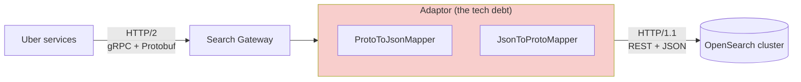

# REST vs GraphQL vs RPC/gRPC

> **Sources**
> 1. freeCodeCamp — *System Design Course* (`C842vFY5kRo`, 0:31:01 · 1:04:22 · 1:19:04) — API styles overview
> 2. **Arpit Bhayani** — *Introduction to RPC – Remote Procedure Calls* (`eRndYq8iTio`) — RPC internals, stubs, IDL
> 3. **PedroTech** — *Learn GraphQL in 7 Minutes For Beginners* (`Zg4XIpnLWQg`) — GraphQL schema & resolvers
> 4. **ByteByteGo** — *What Is GraphQL? REST vs. GraphQL* (`yWzKJPw_VzM`) — GraphQL trade-offs at scale
>
> Full course notes: [system-design-course-fcc.md](system-design-course-fcc.md)
>
> **Related notes in this repo:** [rest-api.md](rest-api.md) (REST design, idempotency, rate limiting, security) · [networking.md](networking.md) (HTTP/1.1→3, TLS, WebSockets) · [grpc-architecture-kt.md](grpc-architecture-kt.md) (gRPC in a real polyglot product) · [README.md](README.md)

---

## 1. One-line definitions

| Style | Full name | Core idea |
|---|---|---|
| **REST** | REpresentational State Transfer | Model the domain as **resources** (nouns) and act on them with **standard HTTP methods**. |
| **GraphQL** | Graph Query Language | **One endpoint**; the **client declares the exact shape** of the data it wants. |
| **RPC** | Remote Procedure Call | Make a **network call look exactly like a local function call**, hiding serialization, transport and failures. |
| **gRPC** | Google Remote Procedure Call | The dominant RPC implementation: **Protocol Buffers over HTTP/2**. |

> ⚠️ **RPC ≠ gRPC.** RPC is the *concept/pattern*; gRPC is Google's *implementation* of it. Other RPCs: Apache Thrift, Cap'n Proto, JSON-RPC, XML-RPC, Sun RPC.

---

## 2. Side-by-side comparison

| Aspect | **REST** | **GraphQL** | **gRPC** |
|---|---|---|---|
| Paradigm | Resource-oriented | Query/schema-oriented | Function/RPC-oriented |
| Endpoints | Many (`/users`, `/users/1/posts`) | **One** (`/graphql`) | Service methods in a `.proto` |
| Transport | HTTP/1.1 or HTTP/2 | HTTP (POST) | **HTTP/2 only** |
| Payload format | JSON (text) | JSON (text) | **Protocol Buffers (binary)** |
| Schema / contract | Optional (OpenAPI/Swagger) | **Mandatory, strongly typed SDL** | **Mandatory `.proto`** |
| Operations | `GET` `POST` `PUT` `PATCH` `DELETE` | `query` · `mutation` · `subscription` | unary · server-stream · client-stream · **bidirectional** |
| Response shape | **Fixed** by the server | **Defined by the client** | Fixed by the `.proto` |
| Over-/under-fetching | Common problem | **Solved by design** | Not an issue (purpose-built methods) |
| Round trips for related data | Often **N requests** | **1 request** | 1 per call, but calls are cheap |
| Error signalling | **HTTP status codes** (400/401/404/500) | **Always HTTP 200** + `errors[]` array | gRPC status codes (`NOT_FOUND`, `PERMISSION_DENIED`, …) |
| Caching | ✅ **Free HTTP/CDN caching** via headers + ETag | ⚠️ **Application-level** (Apollo/Relay normalised cache, persisted queries) | ⚠️ Manual / interceptors |
| Versioning | **Explicit** — `/api/v1`, `/api/v2` | **Schema evolution**, `@deprecated`, or field-level (`followersV2`) | Field numbers + `reserved` keep it backward compatible |
| Statelessness | Stateless | Stateless | Stateless |
| Browser support | ✅ Universal | ✅ Universal | ❌ **Not directly** (needs gRPC-Web + proxy) |
| Streaming | ❌ (needs SSE/WebSocket) | Subscriptions (over WebSocket) | ✅ **Native, bidirectional** |
| Tooling / discoverability | Swagger/Postman | **GraphiQL, introspection** (best-in-class DX) | Codegen for ~11 languages |
| Learning curve | Low | Medium | Medium–High |
| Created by | Roy Fielding (2000, dissertation) | **Meta / Facebook** (2012, open-sourced 2015) | **Google** (2016); RPC concept dates to the 1980s |
| Popularity | **#1** | #2 | #3 |

---

## 3. The concrete example — three ways to fetch the same data

### The problem — REST needs 3 round trips

```http
GET /api/v1/users/123              → { id, name, email, avatar, bio, createdAt, ... }  ← over-fetch
GET /api/v1/users/123/posts        → [ { id, title, content, images, ... } ]          ← over-fetch
GET /api/v1/users/123/followers    → [ { id, name, avatar, bio, ... } ]               ← over-fetch
```
The page can't render until **all three** resolve → latency stacks. Each response also carries fields the screen never displays.

### GraphQL — 1 round trip, exact shape

```graphql
POST /graphql

query {
  user(id: "123") {
    name
    posts     { title content }
    followers { name }
  }
}
```
One request. No wasted bytes. This is why **Facebook created it**.

### gRPC — binary, server-to-server

```protobuf
service UserService {
  rpc GetUserProfile (UserId) returns (UserProfile);
  rpc StreamPosts    (UserId) returns (stream Post);   // native streaming
}
```
Generated stubs mean the call looks like `userService.GetUserProfile(id)` in your language of choice. Payload is a compact binary blob, not JSON text.

---

# PART A — GraphQL Deep Dive

## 4. What GraphQL actually *is* (and is not)

> **PedroTech's key point:** beginners get scared of GraphQL because they learn REST first, and GraphQL *challenges their whole notion of how to structure an API*. The problems it solves aren't familiar to beginners, so they wonder what the point is.

### 4.1 The definition beginners get wrong

> **GraphQL is a query language that describes an API request.**

❌ **GraphQL is NOT:** a technology, a library, a framework, or a database.
✅ **GraphQL IS:** a **query language** + **type system** that lives as a **layer between your frontend and your backend**.

```
┌──────────┐                ┌───────────────┐                ┌──────────┐
│ FRONTEND │◄──────────────►│   GraphQL     │◄──────────────►│ BACKEND  │
│          │   queries /    │   API layer   │   resolvers    │ (DB, REST│
│          │   mutations    │ (schema sets  │                │  APIs,   │
└──────────┘                │ the standard) │                │  gRPC…)  │
                            └───────────────┘                └──────────┘
```

**The decoupling win:** the frontend always talks to GraphQL; the backend always talks to GraphQL.
→ **The frontend doesn't need to know much about the backend, and vice versa.** The schema is the contract that binds them.

**ByteByteGo's framing:** GraphQL *sits between clients and backend services* and can **aggregate multiple resource requests into a single query**. It provides a **schema of the data** and gives clients the power to ask for **exactly what they need**.

### 4.2 Anatomy of a GraphQL API — Schema + Resolvers

```
GraphQL API
├── SCHEMA     → describes WHAT the API can do (types, queries, mutations)   [declaration]
└── RESOLVERS  → the backend functions that actually FETCH/WRITE the data    [implementation]
```

⚠️ **A GraphQL schema is NOT a database schema.** **GraphQL is completely independent of your database.** The schema only describes:
- what data the API will **receive**,
- what data it will **send**,
- what data it will **mutate**.

The schema is also where you declare **all the types** in your API. If you want users in your app and want to add/delete/change them, you create a `User` type and put it in the schema.

> **ByteByteGo's parallel point:** types describe the *kinds of data available* — they **do not specify how the data is retrieved**. To do that you define a `Query`. Retrieval is the resolver's job.

### 4.3 The two required types

**Every GraphQL schema must have two root types:**

| Root type | Purpose | REST equivalent |
|---|---|---|
| **`Query`** | **Fetching / reading** data | `GET` |
| **`Mutation`** | **Creating, updating, deleting** data | `POST` / `PUT` / `PATCH` / `DELETE` |

When a schema has **both**, your app supports full **CRUD**.

A third, optional root type:

| **`Subscription`** | **Real-time notifications** on data modifications (pushed over WebSocket) | WebSocket / SSE |
|---|---|---|

### 4.4 Building a schema step by step (PedroTech's walkthrough)

**Step 1 — declare the root types**
```graphql
type Query { }
type Mutation { }
```

**Step 2 — create the `User` type with fields**
GraphQL ships with basic **scalar** types: `String`, `Int`, `Float`, `Boolean`, `ID`.
```graphql
type User {
  id: ID!
  name: String!
  age: Int
  email: String
}
```
> **`!` = required (non-nullable).** Add it to the end of a return type to force the field to always be present.

**Step 3 — nest a custom type inside another type**
You aren't limited to scalars — declare another type and reference it.
```graphql
type Job {
  jobName:  String!
  position: String!
  salary:   Int!
}

type User {
  id:   ID!
  name: String!
  job:  Job          # ← return type is a custom type
}
```
Setting `job`'s return type to `Job` tells GraphQL that **when a client asks for a user's job, return everything defined in the `Job` type**.

> **Why declare all this so rigidly?** So GraphQL can be **very strict about the format of the data it handles**. That strictness is what powers introspection, autocomplete, and compile-time validation.

**Step 4 — add query fields**
```graphql
type Query {
  getAllUsers: [User!]!            # [ ] = a LIST of users
  getUser(id: ID!): User           # needs an ARGUMENT — the id
}
```
- **Square brackets `[ ]` = a list** of that type.
- To fetch **one** user you need its `id`, so you **pass an argument** to the query. *(PedroTech calls arguments "a very important functionality in GraphQL".)*

**Step 5 — add mutations with `input` types**
```graphql
input CreateUserInput {
  name:  String!
  email: String!
  age:   Int
}
input UpdateUserInput {
  id:    ID!
  name:  String
  email: String
}

type Mutation {
  createUser(input: CreateUserInput!): User!
  updateUser(input: UpdateUserInput!): User!
  deleteUser(id: ID!): Boolean!
}
```
Each mutation **requires a different piece of information** to execute. To create a user you need user data from the frontend, so you declare an **`input` type** specifying exactly what the frontend must pass. Do the same for every mutation, per its needs.

**Step 6 — write the resolvers (backend)**
The schema alone does nothing. GraphQL is *just a layer*; you now write **resolver functions in your backend layer**.

> 🔑 **PedroTech's mental model: treat every query and mutation almost as if it were an endpoint in a normal REST API.**

```js
const resolvers = {
  Query: {
    getAllUsers: ()          => db.users.findAll(),
    getUser:     (_, { id }) => db.users.findById(id),
  },
  User: {
    job: (user) => db.jobs.findByUserId(user.id),   // resolves the nested type
  },
  Mutation: {
    createUser: (_, { input }) => db.users.create(input),
    deleteUser: (_, { id })    => db.users.delete(id),
  },
};
```
Libraries that make this easy: Apollo Server, GraphQL Yoga, Nexus, Hot Chocolate (.NET), graphene (Python).

### 4.5 Querying it from the client

```graphql
query {
  getUser(id: "1") {
    name
    job { jobName salary }     # ← client decides the depth and the fields
  }
}
```
```graphql
mutation {
  createUser(input: { name: "John", email: "john@x.com" }) {
    id
    name                        # ← client also decides what comes BACK from a write
  }
}
```

---

## 5. REST vs GraphQL — the ByteByteGo breakdown

### 5.1 What is the *same*

> In practice, **both GraphQL and REST send HTTP requests and receive HTTP responses.**

| Both… |
|---|
| Use **HTTP** as the transport |
| Make the request via a **URL** |
| Can return a **JSON response in the same shape** |

This matters: GraphQL is **not** a different network protocol. It is a different *contract style* riding on the same HTTP.

### 5.2 What is *different* — the bookstore example

**REST — centred on resources, each identified by a URL**
```http
GET /books/1
```
```json
{
  "id": 1, "title": "Designing Data-Intensive Applications", "isbn": "978-1449373320",
  "authors": [ { "id": 7, "name": "Martin Kleppmann" } ]
}
```
⚠️ **The `authors` field is implementation-specific.** The **API implementer decided for you** that authors come embedded. A different REST implementation might **break them out into a separate REST call** (`GET /books/1/authors`) — and you'd have no say.

**GraphQL — define types, then a query**
```graphql
# 1. Types describe the kinds of data available.
#    They do NOT specify how the data is retrieved.
type Book   { id: ID!  title: String!  isbn: String  authors: [Author!]! }
type Author { id: ID!  name: String!   books: [Book!]! }

# 2. A Query says how you get in.
type Query  { book(id: ID!): Book }
```
```graphql
# 3. Client asks for exactly what it needs
query {
  book(id: 1) {
    title
    authors { name }        # ← THE CLIENT decides authors are included
  }
}
```

**The three real differences**

| # | Difference |
|---|---|
| 1 | With GraphQL the client specifies the **exact resources AND the exact fields**. In REST the **API implementer** made that decision. |
| 2 | GraphQL **doesn't use URLs to describe available resources — it uses a schema.** You can send one complex query that walks **relationships defined in the schema**. |
| 3 | Doing the same in REST means **multiple client-side requests** — the classic **N+1 query problem**. |

**The N+1 problem, concretely:**
```
GET /books                     → 1 request  (returns 20 books)
GET /books/1/authors           ┐
GET /books/2/authors           │ 20 more requests
...                            ┘
= 1 + N requests for one screen
```

### 5.3 ⭐ The three real drawbacks of GraphQL (the part interviewers love)

Most people can list GraphQL's benefits. Naming its costs is what separates a senior answer.

#### ❌ 1. Heavier tooling → sizable upfront investment
> "The beauty of REST is that we don't need special libraries to consume someone else's API. Requests can simply be sent using common tools like **cURL or simply a web browser**."

GraphQL requires real tooling support **on both the client and the server**.
**This upfront cost may not be worth it — especially for very simple CRUD APIs.**

#### ❌ 2. Caching is genuinely hard

| | REST | GraphQL |
|---|---|---|
| Method | **HTTP `GET`** | **HTTP `POST`** by default |
| Entry points | Many distinct URLs | **A single entry point** (`/graphql`) |
| Result | `GET` has **well-defined caching behaviour** leveraged by **browsers, CDNs, proxies and web servers** — free | **Prevents full use of HTTP caching** |

GraphQL *can* be configured to leverage HTTP caching (GET + persisted queries, APQ, `@cacheControl`), but **"the detail is very nuanced… it is extra work, and getting it right is not trivial."**

#### ❌ 3. ⚠️ Client-driven queries are a *production danger*
> The single most important GraphQL warning:

```
A mobile app ships a new feature.
      ↓
Its new GraphQL query triggers an UNEXPECTED TABLE SCAN
on a critical database table of a backend service.
      ↓
The database goes down AS SOON AS THE NEW APP GOES LIVE. 💥
```
The freedom that makes GraphQL powerful — clients querying for just what they need — also means **a client can author a query the backend team never load-tested**. And you can't roll back a shipped mobile app.

**Mitigations (each adding complexity):** query **depth limits** · **query cost/complexity analysis** · **persisted/allowlisted queries** · **DataLoader batching** · per-field timeouts + rate limits · query allowlist enforced in CI.

> **"The cost to safeguard risks like this must be factored in when considering GraphQL."**

### 5.4 So… should you use GraphQL?

> **"Software engineering is about tradeoffs. There is no one right answer."**

| Signal | Lean |
|---|---|
| Simple CRUD, small team, public API | **REST** |
| One backend, one client | **REST** |
| Caching/CDN is critical to your cost model | **REST** |
| Many client types each needing different fields | **GraphQL** |
| Deeply nested, relationship-heavy data | **GraphQL** |
| Aggregating many backends behind one contract | **GraphQL** |
| You can't afford the safeguarding effort | **REST** |

---

# PART B — RPC Deep Dive

> Based on Arpit Bhayani's *Introduction to RPC*. RPC is a 1980s idea that **revived itself after a decade** and is now the default for **inter-service communication over the network**.

## 6. The problem RPC solves

### 6.1 Setup — auth service must tell notification service to send an OTP

```
┌────────────────────┐                    ┌──────────────────────┐
│ Authentication svc │ ── send OTP ─────► │ Notification service │
│    (Golang)        │                    │       (Java)         │
└────────────────────┘                    └──────────────────────┘
```

You want to write this:
```python
def login(email, password):
    # ...validate, generate access token...
    notification_otp(email)      # ← how is THIS implemented?
```

### 6.2 The REST way — and why it hurts

```python
import requests

def notification_otp(email):
    return requests.post(
        "http://notification.abc.internal/email/otp",
        json={"email": email}
    )
```

Looks fine — until you scale. **Four compounding problems:**

| # | Problem |
|---|---|
| 1 | **Repetition.** This isn't one API call. Your service may talk to **50 other services**, and you write the same HTTP plumbing **again and again**. |
| 2 | **Failure handling everywhere.** The network is unreliable. Every call site must handle **request failures, retries, exponential backoff, server-down, error messaging**. And this is *just* login→notification. `recommendation → notification` must redo **all of it**. |
| 3 | **No standardisation across languages.** Go uses `net/http`, Java uses something else, Python uses `requests`. **Every language has its own way of talking HTTP** → no common contract. |
| 4 | **Manual (de)serialization.** You send JSON, get JSON back, and hand-convert it into native objects at every boundary. |

> **The question that births RPC:** *"Why is there no standardised way to establish communication between two services? Why must every single one write everything from scratch?"*

### 6.3 What if we abstracted the mundane parts?

Things that should NOT be your business logic's problem:

- **Communication protocol** choice — TCP? UDP? HTTP/1.0? HTTP/1.1? *So many choices.*
- **Object creation** / marshalling / unmarshalling
- **Failures and retries**
- **Payload compression**
- **Streaming** — uploading a >1 GB file should stream, not fire individual HTTP requests

> **"Why can't there be one solution that abstracts these things out and lets developers focus on writing the actual business logic?"** ← **This is how RPC was conceptualised.**

---

## 7. What RPC actually is

> **RPC standardises communication between services — no matter the language, the invocation style, or the ecosystem. It's all uniform.**

```python
def login(email, password):
    # ...generate access token...
    notification_otp(email)     # ← LOOKS like a local function call
                                #    IS a network call to another service
```

**The core magic:** it makes a **remote procedure call appear local**. Your IDE autocompletes it like a native object. Behind the scenes it handles marshalling, network packet movement, retries, and performance optimisation.

### ⚠️ The one danger of that abstraction

> **An RPC call is *magnitudes* slower than a local procedure call — but it doesn't *feel* like it.**

If a developer doesn't know a call is remote and invokes it bluntly (say, inside a loop), **response time explodes**. **You must stay aware of which calls are RPC and which are local.** Naming conventions, linters, and code review help.

---

## 8. Stubs — the heart of RPC

> "Stub" is odd terminology, but it's what the CS researchers went with.

### 8.1 What a stub does

`login()` lives on the auth service. `notification_otp()` lives on the notification service. **Something must translate between them — in both directions.**

> **The stub converts the method name, the request type, and the response type into the form the RPC system uses — for the request *and* the response.**

### 8.2 The full round trip

```
 AUTH SERVICE (Golang)                          NOTIFICATION SERVICE (Java)
 ┌──────────────────────┐                       ┌──────────────────────────┐
 │ notification_otp(   ) │                       │  SendNotification(req)   │
 │         │             │                       │         ▲                │
 │         ▼             │                       │         │                │
 │  ┌─────────────┐      │   compressed wire     │  ┌──────────────┐        │
 │  │ CLIENT STUB │──────┼──────format──────────►│  │ SERVER STUB  │        │
 │  │  (marshal)  │      │                       │  │ (unmarshal)  │        │
 │  └─────────────┘      │                       │  └──────────────┘        │
 │         ▲             │                       │         │                │
 │  ┌─────────────┐      │                       │  ┌──────────────┐        │
 │  │ CLIENT STUB │◄─────┼───────────────────────┼──│ SERVER STUB  │        │
 │  │ (unmarshal) │      │      response         │  │  (marshal)   │        │
 │  └─────────────┘      │                       │  └──────────────┘        │
 │  Golang struct ◄──────┼───────────────────────┼──── Java class            │
 └──────────────────────┘                       └──────────────────────────┘
```

**Step by step:**
1. Auth service invokes `notification_otp(email)` → hits the **client stub**.
2. Client stub sees the method + arguments and **marshals them into a compact wire format**.
3. Sends over the network to the notification service.
4. **Server stub** receives it and **converts it into a native Java object** — the **Golang struct becomes a Java class**.
5. Notification service runs its business logic (calls the 3rd-party API, sends the OTP).
6. It builds a response object → **server stub marshals** it → sends back.
7. **Client stub unmarshals** → hands back a native **Golang struct**.

> 🔑 **The payoff:** *"You don't have to think 'now I got a JSON payload, now I want to convert it into an object'. That is all abstracted out from you."*

You define `SendNotificationRequest` / `SendNotificationResponse` **once**, and get a Go struct on one side and a Java class on the other — used exactly like ordinary native objects.

---

## 9. IDL + stub generators — how stubs are created

### 9.1 Interface Definition Language (IDL)

Every RPC implementation gives you an **IDL** — a **language-neutral place to define the types and methods**, because `SendNotificationRequest` must exist **as a Go struct AND as a Java class**.

**gRPC — the most famous implementation — uses Protocol Buffers (`.proto`).**

```protobuf
syntax = "proto3";

service NotificationService {
  rpc SendNotification (SendNotificationRequest) returns (SendNotificationResponse);
}

message SendNotificationRequest {
  string email   = 1;
  string otp     = 2;
  string channel = 3;
}

message SendNotificationResponse {
  bool   success    = 1;
  string message_id = 2;
}
```

> Think of a `message` as a **class definition — but written in a common, language-neutral format** instead of in one specific language. It's **human-readable and simple**, and it is **pure declaration**: it declares the interface both services expose and implement. It says *nothing* about what should be done.

### 9.2 The stub-generator workflow

```
         ┌─────────────────────┐
         │  notification.proto │   ← 1. write the interface definition ONCE
         └──────────┬──────────┘
                    │  2. run the STUB GENERATOR (protoc)
        ┌───────────┴───────────┐
        ▼                       ▼
┌────────────────┐      ┌────────────────┐
│ Generated Go   │      │ Generated Java │   ← 3. auto-generated plumbing:
│  client stub   │      │  server stub   │      marshalling, network calls,
└───────┬────────┘      └───────┬────────┘      retries, failure handling
        │                       │
        ▼                       ▼
  Auth service            Notification service   ← 4. you write ONLY the
   (calls it)              (implements it)          business logic
```

1. **Write the interface definition** in your RPC's format (`.proto` for gRPC).
2. **Run the generator.** It reads the proto and emits a large file of code that handles **making the network call, retries, marshalling — everything except business logic**.
3. **Implement only the unimplemented functions** — e.g. `SendNotification`. That's your business logic and nothing else.
4. **Point the generator at a different language** and it emits Go, Java, C++, Python… from **the same proto**.

> **The beauty:** the proto is common. `--go_out` produces working Go, `--java_out` produces working Java. Both sides get native structs/classes that you use like ordinary local objects, while the call seamlessly becomes remote.

---

## 10. ⭐ The biggest RPC myth: "HTTP means REST"

> **"HTTP and REST are NOT synonyms."**

RPC is *just a network call* between two machines, so **RPC can use any protocol it wants**:

| Layer | Options RPC can use |
|---|---|
| **Transport (L4)** | TCP, UDP |
| **Application (L7)** | HTTP/1.0, HTTP/1.1, **HTTP/2**, WebSockets, raw TCP |

- **There is no restriction.** Making an HTTP call does **not** make something REST.
- Each RPC runtime picks its own preference: **gRPC mandates HTTP/2** as its transport.
- Nothing stops you from writing your own RPC over **WebSockets** or **raw TCP**.

> **Transport is completely separate from — and abstracted by — the RPC layer.**

---

## 11. Why RPC? — the advantages

| # | Advantage | Detail |
|---|---|---|
| 1 | **Feels like a local call** | A remote invocation reads exactly like a local one, with native generated classes and full IDE autocomplete. |
| 2 | **Strong API contract** ⭐ | With REST, someone adds a field to a response and you must **explicitly handle** the JSON→object conversion, every time, forever. With RPC you **know exactly what you send and exactly what you get**, no matter how many iterations happen. |
| 3 | **Massive developer productivity** | No `requests.post(url, …)` plumbing at 50 call sites. Ship faster, more efficiently. |
| 4 | **Polyglot code generation** | One proto → Go, Java, C++, Python, C#… **Most modern RPC frameworks support all modern languages.** No hand-written per-language clients. |
| 5 | **Mundane tasks abstracted** | Failures, retries, payload↔native-object conversion, network protocol selection, multiplexing — **the RPC system handles all of it**. |
| 6 | **Performance out of the box** | **Payload compression** · **connection pooling** (raw TCP connections to the service) · **multiplexing** · **streaming** · a **highly compressed wire format** (protobuf). |
| 7 | **Security is a plug-in** | Configure encryption/TLS **once at the RPC level** instead of on every individual HTTP request. |
| 8 | **No hand-written client libraries** ⭐ | The proto generates **client libraries for every language**. Change the definition → regenerate. |
| 9 | **Seamless multi-language communication** | Go structs ↔ Java classes without writing common JSON serialize/deserialize glue. |

### 💡 Real-world proof: Slack's API
> **Slack's APIs are RPC-based.** They are exposed as HTTP endpoints, but RPC sits behind them — which is *why Slack's endpoint naming looks unusual* compared to typical REST (`chat.postMessage`, `users.list` — method names, not resources).
> Consequence: every Slack client library in Go, Python, Java is **auto-generated** from the definitions. Slack doesn't spend time writing client code, and every change propagates automatically.

---

## 12. RPC concerns — the disadvantages

| # | Concern | Detail |
|---|---|---|
| 1 | **Stubs must be regenerated on every signature change** | Change the proto → both services must regenerate **and redeploy**. Manageable (the generator does the work), but it's coordination overhead. |
| 2 | **Testing is non-trivial** | Not *difficult*, but **not intuitive**. You must stay conscious that it's a remote call and cover the edge cases. Moving from REST to RPC "feels a little weird" day-to-day. |
| 3 | **Getting started is challenging** | REST: start an HTTP server, expose resource endpoints, done. RPC: write the IDL → generate stubs → integrate → implement. That takes time. |
| 4 | **Limited browser support** ⭐ | Not all browsers support RPC, so **JavaScript↔server communication happens over plain HTTP**. You can put an RPC server behind it, but it won't be *pure* RPC — so you **don't get RPC's benefits at the browser edge**. RPC shines for **inter-service** communication. |
| 5 | **Hidden latency** | Because it looks local, developers can accidentally make expensive remote calls in tight loops. |
| 6 | **Not human-readable** | Binary protobuf can't be inspected with `curl` or a browser; you need `grpcurl`/reflection. |

> **"This does not mean you always have to use RPC. You have to pick your battles."** If your team has the expertise, use it. If not, skip it.

---

# PART C — Choosing

## 13. Decision matrix — when to pick what

### ✅ Choose **REST** when
- Building a **public API** consumed by third parties (lowest barrier to entry — **`curl` or a browser is enough**).
- Simple **CRUD** over well-defined resources.
- You want **free HTTP caching / CDN caching** — a huge, underrated win driven purely by `GET` semantics.
- Broad **client compatibility** matters (any language, any browser, no special libraries).
- Team familiarity and tooling maturity matter more than payload efficiency.
- **You can't afford the upfront tooling investment** GraphQL or RPC demand.

### ✅ Choose **GraphQL** when
- The UI is **complex** and different screens need **different slices** of nested data.
- **Multiple client types** (web + iOS + Android) each need different fields from the same backend.
- Frontend teams iterate fast and shouldn't need a backend change for every new view.
- You're **aggregating several backends/microservices** behind one graph (BFF pattern).
- Mobile clients on poor networks — round trips are expensive.
- You want the **frontend and backend decoupled by a schema contract**.
- ❌ **Not** when the API is simple CRUD, or when you can't fund query-safety guardrails.

### ✅ Choose **RPC / gRPC** when
- **Internal microservice ↔ microservice** communication (**the sweet spot**).
- You need **maximum throughput / minimum latency / small payloads**.
- You want a **strict, code-generated contract** across **polyglot** services (Go ↔ Java ↔ Python).
- You'd otherwise **hand-write client libraries** for many languages.
- You need **streaming** or **bidirectional** communication.
- You're tired of re-implementing **retries, backoff, pooling and (de)serialization** at every call site.
- ❌ **Not** for browser-facing APIs — browser support is limited, so you'd lose the benefits anyway.
- ❌ **Not** if the team lacks the expertise — *"pick your battles."*

---

## 14. Trade-offs to name out loud in an interview

### REST
| ✅ Strengths | ❌ Weaknesses |
|---|---|
| Universal, simple, well understood | **Over-fetching / under-fetching** |
| **HTTP caching for free** (browser, CDN, proxy) | **N+1 round trips** for related data |
| Rich status-code semantics | Endpoint proliferation as needs grow |
| Stateless, layered, scales trivially | Explicit versioning burden (`/v1` → `/v2`) |

### GraphQL
| ✅ Strengths | ❌ Weaknesses |
|---|---|
| Exactly the data you ask for | ⚠️ **HTTP caching is lost** — single entry point + `POST` by default |
| Single round trip for nested data (**kills the N+1 client problem**) | ⚠️ **N+1 *database* problem** moves into resolvers → needs **DataLoader** batching |
| Strong typing + introspection + great tooling | ⚠️ **Heavier tooling on BOTH client and server** → sizable upfront investment; not worth it for simple CRUD |
| Schema evolves without version bumps | ⚠️ **A client query can table-scan a critical table and take the DB down on release day** ⭐ |
| Decouples frontend from backend (schema is the contract) | ⚠️ Errors always return **200**, so clients must parse `errors[]` |
| One graph aggregating many backends | ⚠️ Harder rate limiting (one endpoint, wildly variable query cost) |
| Can't consume it with plain `curl`/browser as easily as REST | ⚠️ Needs depth limits, cost analysis, persisted queries to be production-safe |

### RPC / gRPC
| ✅ Strengths | ❌ Weaknesses |
|---|---|
| **Remote call looks local** — huge dev productivity | ❌ **No native browser support** → can't get pure RPC at the edge |
| **Strong, generated API contract** — no manual JSON↔object glue | ❌ **Stubs must be regenerated + both services redeployed** on signature change |
| **Fastest** — binary protobuf, ~5–10× smaller than JSON | ❌ **Not human-readable** — no `curl`/browser debugging |
| **One IDL → clients in every language** (no hand-written SDKs) | ❌ **Getting started is heavy**: IDL → generate → integrate → implement |
| Failures, retries, multiplexing, compression, pooling **abstracted** | ❌ **Testing is non-intuitive**; must remember it's remote |
| HTTP/2: multiplexing, header compression, no head-of-line blocking | ❌ **Hidden latency** — a "local-looking" call in a loop can wreck p99 |
| **Native bidirectional streaming** | ❌ Steeper learning curve; less ubiquitous tooling |
| Security configured once at the RPC layer | ❌ Tight coupling to the `.proto` (manageable via field numbers + `reserved`) |

---

## 15. Protocol pairing

> "Your protocol choice fundamentally shapes your API design options."

| API style | Protocol | Why |
|---|---|---|
| **REST** | **HTTP/HTTPS** | Verbs map perfectly to CRUD; status codes and cache headers come free |
| **GraphQL** | **HTTP/HTTPS** (POST) | Standard request/response; subscriptions ride **WebSocket** |
| **gRPC** | **HTTP/2** | Needed for multiplexing + streaming |
| Real-time (chat, live feeds) | **WebSocket** | Persistent, bidirectional, server can push |
| Async / fire-and-forget | **AMQP** (RabbitMQ) | Queues, guaranteed delivery, back-pressure |

---

## 16. They are not mutually exclusive

A realistic production architecture uses all three:

```
┌────────────┐
│  Browser   │──REST/GraphQL──►┌──────────────┐
│  Mobile    │                  │ API Gateway  │
└────────────┘                  │  / BFF       │
                                └──────┬───────┘
                                       │ gRPC (internal, fast, binary)
                     ┌─────────────────┼─────────────────┐
                     ▼                 ▼                 ▼
              ┌───────────┐     ┌───────────┐     ┌───────────┐
              │ User svc  │     │ Order svc │     │ Search svc│
              └───────────┘     └───────────┘     └───────────┘
```

**The senior answer:** *"REST or GraphQL at the edge for client compatibility and caching; gRPC internally for speed and strict contracts; WebSockets for anything real-time; AMQP/Kafka for async work."*

This is exactly why **browser support is RPC's weak spot and REST/GraphQL's strength** — and why gRPC dominates behind the gateway.

---

## 17. Rapid-fire interview Q&A

| Question | Answer |
|---|---|
| Is GraphQL a database / library? | **No.** It's a **query language + type system** that sits as a **layer between frontend and backend**. It is completely **independent of your database**. |
| Is a GraphQL schema a database schema? | **No.** It only describes what the API receives, sends and mutates. |
| What are the two parts of a GraphQL API? | **Schema** (declaration) + **Resolvers** (backend implementation). |
| Which root types must every schema have? | **`Query`** (read) and **`Mutation`** (write). Both present = full CRUD. `Subscription` adds real-time. |
| What does `!` mean? What does `[ ]` mean? | `!` = **required / non-nullable**. `[Type]` = a **list**. |
| Why `input` types for mutations? | They declare exactly what the frontend must send to fulfil the mutation, instead of a long argument list. |
| How is GraphQL like REST? | **Both use HTTP**, both request via a URL, both can return **JSON of the same shape**. |
| Biggest structural difference? | REST exposes **resources via URLs**; GraphQL exposes a **schema** and lets the **client** choose resources *and* fields. |
| Why is GraphQL harder to cache? | REST uses **`GET`** — well-defined caching used by browsers, CDNs, proxies. GraphQL uses **one entry point + `POST` by default**, blocking full HTTP caching. Configurable, but nuanced and non-trivial. |
| Scariest GraphQL production risk? | A **client-authored query causing an unexpected table scan** that **takes the DB down the moment the mobile release goes live** — and you can't roll back a shipped app. |
| When is GraphQL NOT worth it? | **Very simple CRUD APIs** — the tooling investment on client + server outweighs the benefit. |
| What is RPC in one line? | A way to make a **network call look exactly like a local function call**, abstracting serialization, transport, retries and failures. |
| RPC vs gRPC? | RPC = the **concept**. gRPC = **Google's implementation** (protobuf + HTTP/2). |
| What problem does RPC solve? | Repeating HTTP plumbing + retry/backoff logic in **every service, in every language**, with **no standardisation** and manual JSON↔object conversion. |
| What is a stub? | The generated code that **marshals the method + request into a wire format and unmarshals the response back into a native object** — on **both** client and server. |
| What is an IDL? | The **language-neutral interface definition** (e.g. a `.proto`) declaring services, methods and message types. **Pure declaration**, no logic. |
| What does the stub generator produce? | All the **plumbing** — network calls, retries, marshalling — in your target language. **You write only the business logic.** |
| Does HTTP mean REST? | ⭐ **No — HTTP and REST are not synonyms.** RPC can run over TCP, UDP, HTTP/1, **HTTP/2** (gRPC's choice), or WebSockets. |
| Why can't browsers do pure RPC? | Limited browser support for the required HTTP/2 primitives — so browser↔server stays plain HTTP (gRPC-Web + proxy is the workaround). |
| Biggest hidden RPC danger? | It **looks like a local call but is magnitudes slower**. Calling it blindly (e.g. in a loop) blows up response time. |
| Give a real RPC-in-production example. | **Slack's API** — HTTP endpoints backed by RPC, which is why endpoints are named `chat.postMessage` (methods) rather than REST resources. All its client libraries are auto-generated. |
| Top RPC drawbacks? | Stub regeneration + redeploy on signature change · non-intuitive testing · heavy setup · limited browser support · not human-readable. |

---

## 18. 30-second interview answer

> "REST models the domain as resources identified by URLs and acts on them with HTTP verbs. It's the default because it's simple, universally consumable — you can hit it with `curl` or a browser — and it gets HTTP caching for free from browsers, CDNs and proxies. Its costs are over-fetching and N+1 round trips, because the *API implementer* decides what each response contains.
>
> GraphQL flips that: one endpoint, a strongly typed schema, and the *client* declares exactly which resources and fields it wants, walking relationships defined in the schema. That's ideal for complex UIs and multiple client types. But it's a genuine trade-off — you lose easy HTTP caching because it's a single entry point over POST, you need heavy tooling on both sides, and a client can author a query that table-scans a critical table and takes your database down on release day. So it's usually not worth it for simple CRUD.
>
> RPC takes a different angle entirely — instead of modelling resources, it makes a remote call *look like a local function call*. You define the contract once in an IDL like protobuf, a stub generator emits client and server code in every language, and marshalling, retries, compression and multiplexing are all abstracted away. That gives you a very strong contract and big productivity wins, at the cost of stub regeneration on every signature change and limited browser support.
>
> In practice: REST or GraphQL at the edge for client compatibility and caching, gRPC between microservices for speed and strict contracts, WebSockets for real-time, and a message queue for async work."

---

## 19. Real-World Case Study — Uber adds native gRPC to OpenSearch

> **Source:** Uber Engineering — *[Accelerating Search and Ingestion with High-Performance gRPC in OpenSearch](https://www.uber.com/in/en/blog/high-performance-grpc/)* (Apr 2026).
>
> This is the rare blog post that puts **hard numbers** on "REST/JSON vs gRPC/Protobuf" for the same workload, on the same system, in production. It's the best possible evidence for [§13 Decision matrix](#13-decision-matrix--when-to-pick-what) and [§14 Trade-offs](#14-trade-offs-to-name-out-loud-in-an-interview).

### 19.1 The problem — a translation layer nobody wanted

Uber's internal fleet already speaks **gRPC + Protobuf**: strongly typed contracts, binary serialization, streaming-friendly transport. But **OpenSearch historically exposed only REST/JSON**.

So Uber's **Search Gateway** — the service that proxies every OpenSearch search and ingest request to add security, observability, rate limiting and auditing — had to run an in-house adaptor:



Every request was **transpiled Protobuf → JSON** on the way in and **JSON → Protobuf** on the way back. *"This added both latency and overhead to each customer's OpenSearch request."*

> ⭐ **The generalisable lesson:** when two halves of your stack speak different protocols, the adaptor between them is not free — you pay serialization cost **twice per request**, plus the maintenance cost of keeping two schemas in sync. That's the real argument for standardising a protocol across an organisation.

Rather than fork OpenSearch or keep the adaptor, Uber contributed a **native gRPC transport upstream**.

### 19.2 The design — gRPC and REST as co-equal transports

| Decision | Detail |
|---|---|
| **Both, not either** | The gRPC transport ships as a **module** running on a **different set of ports** alongside REST. Both are first-class |
| **Only the edge differs** | *"Only the client-server layer differs between the REST and gRPC transports, while the internal node-to-node logic remains shared."* |
| **Extensible** | The transport publishes an **SPI** so plugins (e.g. k-NN) can register their own Proto↔POJO converters and even expose their own gRPC services |
| **Scoped to what matters** | They shipped **Search** and **Bulk** first — the two most latency-sensitive APIs |
| **Migration path** | *"We did this while preserving REST compatibility, enabling teams to migrate incrementally rather than all at once."* |

**Keeping two API surfaces in sync — the hard part.** They built an automated **OpenAPI spec → Protobuf** pipeline with three stages:

| Stage | Job |
|---|---|
| **Preprocessing** | Resolve semantic mismatches. REST leans on method-and-path semantics, query parameters and status-code-driven behaviour; Protobuf needs **explicit, strongly typed request/response messages**. The pipeline normalises the OpenAPI spec and makes those implicit behaviours explicit |
| **Core conversion** | OpenAPI Generator had no robust JSON→Protobuf support, so Uber **derived and contributed a set of conversion rules upstream** |
| **Postprocessing** | Enforce **wire compatibility**. *"Unlike REST, Protobuf APIs can't tolerate changes such as field renumbering without breaking existing clients."* Every change is checked against previously generated Protobufs |

> ⭐ This is the concrete version of the §12 complaint about RPC — *"stub regeneration on every signature change"*. The mature answer isn't "avoid gRPC", it's **"automate spec→IDL generation and gate every change on a backward-compatibility check in CI."**

### 19.3 The numbers — this is what you quote

**Ingestion (Bulk API), M3 metrics platform:**

| Metric | REST/JSON | gRPC | Change |
|---|---|---|---|
| **p99** index write latency | 34.1 ms | 13.6 ms | **≈ −60%** |
| **p50** index write latency | 15.8 ms | 10.5 ms | **≈ −34%** |
| Max indexing delay @ 600 RPS | — | — | **−33%** |
| Max indexing delay @ 800 RPS | — | — | **−20%** |
| Spark batch indexing job runtime | — | — | **−20–35%** |

Note the failover detail: max indexing delay is *"a top-line business-impacting metric, especially critical during failovers"* — and the REST/gRPC gap **widened as RPS increased**. gRPC's advantage grows precisely when you need it most.

**Search — Uber Eats delivery shopping lists (vector search):**

| Percentile | REST/JSON | gRPC | Change |
|---|---|---|---|
| p50 | 83 ms | 38 ms | **≈ −53%** |
| p95 | 114 ms | 64 ms | **≈ −43%** |
| p99 | 205 ms | 176 ms | **≈ −14%** |

**Why vectors gain the most — payload size:**

| Vector dimensions | REST/JSON request | gRPC/Protobuf request | Saving |
|---|---|---|---|
| 1,572 | 40,523 B | 4,590 B | **88.7%** |
| 512 | 14,531 B | 2,500 B | **82.8%** |
| 256 | 7,954 B | 1,500 B | **81.1%** |

> *"Vectors are very inefficiently serialized in JSON, as opposed to using a packed encoding format for a repeated float type in Protobuf."*
>
> A `float32` costs 4 bytes packed in Protobuf. As JSON text — `-0.03847261,` — it costs a dozen-plus **characters**, plus parsing. Multiply by 1,572 dimensions per query.

**Transport vs format are separate axes** — a subtlety most candidates miss. Uber also tested **SMILE** (a binary representation of JSON):

| Comparison | gRPC + SMILE is… |
|---|---|
| vs REST + JSON | **30% faster** |
| vs gRPC + JSON | **45% faster** |
| vs REST + SMILE | **47% faster** |

So you get *two independent* wins: one from the **transport** (HTTP/2, binary framing, multiplexing, no per-request header overhead) and one from the **serialization format**. Naming both separately is a strong signal.

### 19.4 When gRPC actually wins — Uber's own summary

> *"gRPC offers better performance for: workloads with **large request sizes**; **higher throughput at larger RPS**; documents represented with **binary document formats**."*

Which inverts cleanly into the honest counter-position:

| gRPC's edge is **small** when… | Because |
|---|---|
| Payloads are small | Serialization was never the bottleneck; you're measuring RTT |
| Traffic is low | HTTP/2 multiplexing has nothing to multiplex |
| The consumer is a browser | You need grpc-web + a proxy, and you lose `curl`-ability |
| You need HTTP caching at a CDN | POST-over-HTTP/2 to one endpoint isn't cacheable by intermediaries ([§5](#5-rest-vs-graphql--the-bytebytego-breakdown)) |
| Your bottleneck is the database | You've optimised the wrong layer |

### 19.5 The takeaway line

> *"One of our biggest takeaways is that **API representation is not a surface-level choice**. At scale, it shapes system evolution, performance ceilings, and developer velocity."*

> ⭐ **Say this when asked "REST or gRPC?":**
> *"It depends on payload shape and who the client is, and I'd want to name the two axes separately — transport and encoding. Uber published the cleanest data I know of: adding native gRPC to OpenSearch cut p99 ingest latency 60% and p50 vector-search latency 53%, and the vector request bodies shrank ~85% because JSON encodes floats as text while Protobuf packs them. But their p99 search only improved 14%, because the tail was dominated by genuinely large queries rather than serialization — so the win is proportional to payload size, not universal. The design choice I'd copy is that they **kept REST**: gRPC ran as a module on separate ports sharing all the internal logic, which let teams migrate incrementally. And they automated OpenAPI→Protobuf generation with a wire-compatibility gate in CI, which is the real answer to the 'IDL drift and stub regeneration' objection to RPC."*
