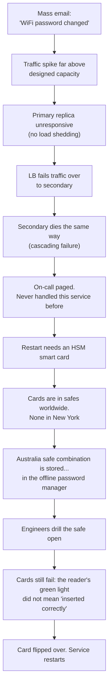
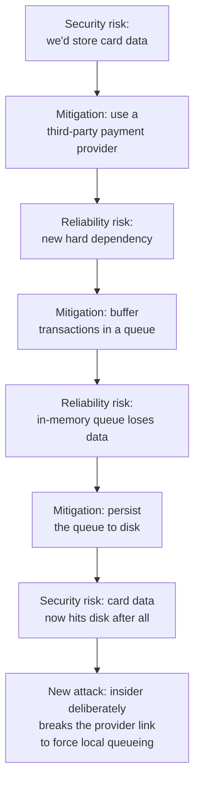
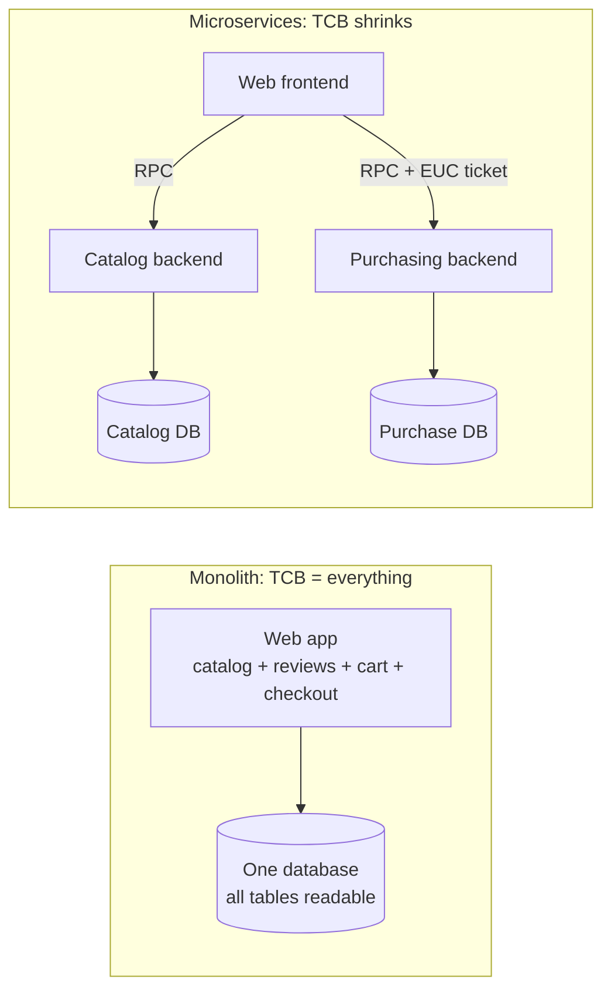
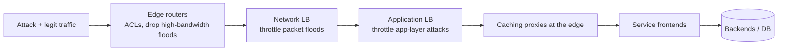
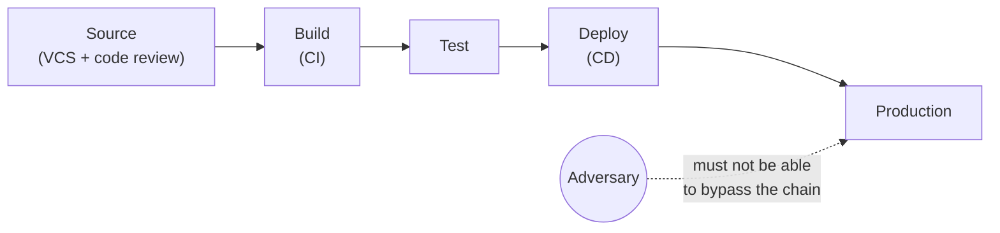
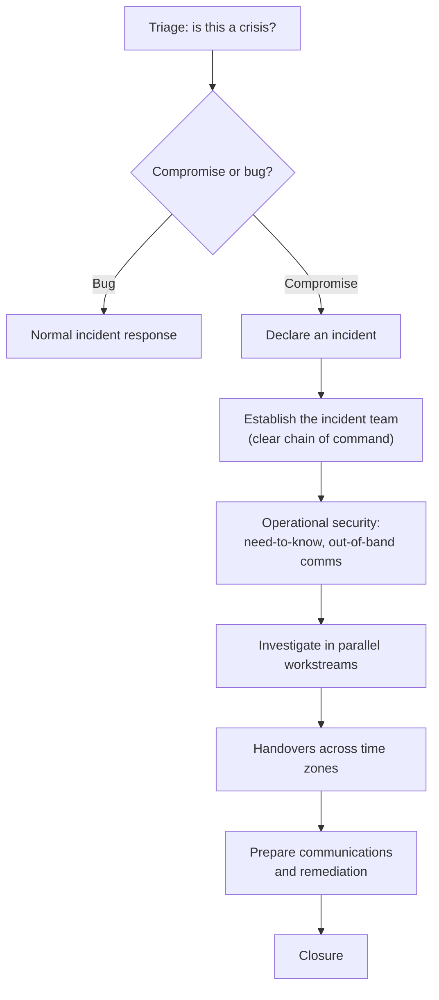
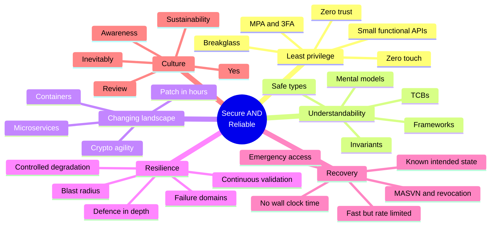

# Building Secure & Reliable Systems — Google's SRS Book, Distilled

> **Source:** [*Building Secure and Reliable Systems*](https://google.github.io/building-secure-and-reliable-systems/raw/toc.html) — Adkins, Beyer, Blankinship, Lewandowski, Oprea, Stubblefield (O'Reilly / Google, free online). 21 chapters in 5 parts. This note is a working distillation of the whole book, mapped onto the rest of this repo.
>
> **Purpose:** every other note in this repo answers *"how do I make it fast and scalable?"*. This one answers the question that separates a senior from a staff answer: **"what happens when something — or someone — actively tries to break it?"** The book's central claim is that **security and reliability are the same engineering problem, differing only by the presence of an adversary**, and that both are *emergent properties* you cannot bolt on later.
>
> **Covers:** the security ⇄ reliability tension · adversaries & threat modelling · design tradeoffs · least privilege & zero trust · understandability & TCBs · resilience, degradation & blast radius · recovery, rollback & revocation · DoS mitigation · safe-by-construction code · software supply chain · logging & investigation · disaster planning & crisis management · culture.
>
> **Companions:** [high-level-system-design-cocept.md](high-level-system-design-cocept.md) (availability, SPOF, CAP) · [distributed-systems.md](distributed-systems.md) (circuit breakers, retries, failure isolation) · [load-balancer.md](load-balancer.md) (the traffic chokepoint) · [cdn-edge.md](cdn-edge.md) (edge defence) · [rest-api.md](rest-api.md) §13 (OWASP API Top 10) · [stateless-services-sessions-tokens.md](stateless-services-sessions-tokens.md) (authN/authZ, revocation) · [cloud-native.md](cloud-native.md) (CI/CD, containers) · [low-level-design.md](low-level-design.md) · [design-patterns.md](design-patterns.md) · [README.md](README.md)

---

## Index

| # | Topic | Book ch. | Section |
|---|---|---|---|
| 1 | **The thesis** — one adversary apart; CIA through two lenses; the five commonalities | 1 | [§1](#1-the-thesis-security-and-reliability-are-one-adversary-apart) |
| 2 | **Understanding adversaries** — motivations, profiles, insider risk, kill chain, TTPs | 2 | [§2](#2-understanding-adversaries) |
| 3 | **Design tradeoffs** — emergent properties, the payment worked example, initial vs sustained velocity | 4 | [§3](#3-design-tradeoffs) |
| 4 | **Least privilege** — zero trust, zero touch, small functional APIs, breakglass, MPA/3FA | 3, 5 | [§4](#4-design-for-least-privilege) |
| 5 | **Understandability** — invariants, mental models, TCBs & security boundaries, safe types | 6 | [§5](#5-design-for-understandability) |
| 6 | **A changing landscape** — zero-day → posture → external demand; Heartbleed | 7 | [§6](#6-design-for-a-changing-landscape) |
| 7 | **Resilience** — defence in depth, controlled degradation, blast radius, failure domains, validation | 8 | [§7](#7-design-for-resilience) |
| 8 | **Recovery** — go fast guarded by policy, no wall-clock time, rollback tradeoff, revocation, intended state | 9 | [§8](#8-design-for-recovery) |
| 9 | **DoS mitigation** — the economics, layered defence, anycast, fail static, self-inflicted attacks | 10 | [§9](#9-mitigating-denial-of-service) |
| 10 | **Writing & testing code** — frameworks, `TrustedSqlString`, `SafeHtml`, strong types, fuzzing | 11–13 | [§10](#10-writing-and-testing-code) |
| 11 | **Deploying code** — supply chain threat model, binary provenance, verifiable builds, chokepoints | 14 | [§11](#11-deploying-code--the-software-supply-chain) |
| 12 | **Investigating systems** — debugging vs investigation, immutable logs, the logging budget | 15 | [§12](#12-investigating-systems--logging) |
| 13 | **Disaster, crisis, aftermath** — IMAG, DiRT, red teams, OpSec, handovers, postmortems | 16–18 | [§13](#13-disaster-planning-crisis-management-and-aftermath) |
| 14 | **Organisation & culture** — Chrome case study, roles, culture of review/awareness/yes | 19–21 | [§14](#14-organisation-and-culture) |
| ★ | **The master tradeoff table** — 12 places security and reliability pull apart | all | [§15](#15-the-master-tradeoff-table) |
| ★ | **Failure-mode catalogue** | all | [§16](#16-failure-mode-catalogue) |
| ★ | **What to say in the interview** | — | [§17](#17-what-to-say-in-the-interview) |
| ★ | **Rapid-fire Q&A** | — | [§18](#18-rapid-fire-qa) |
| ★ | **Summary + the memory trick** | — | [§19](#19-summary--the-memory-trick) |

---

## 1. The Thesis: Security and Reliability Are One Adversary Apart

### 1.1 The opening story — passwords and a power drill

Google, 27 September 2012. A company-wide email announced the bus WiFi password had changed. The traffic spike overwhelmed the internal password manager — a service built years earlier for a handful of admins.



Every lesson in the book is in this one incident:

| What went wrong | Book's name for it | Chapter |
|---|---|---|
| No load shedding; LB drained one dead replica into another | Uncontrolled degradation → cascading failure | 8 |
| Best-effort service with a real dependency on it | Failure domains / criticality classification | 8 |
| On-call had never exercised the recovery path | Continuous validation of recovery | 8, 9 |
| Recovery secret locked behind the thing that was down | **Circular dependency in emergency access** | 9 |
| A security control (HSM cards) blocked recovery | Security ⇄ reliability tradeoff | 1 |
| Ambiguous hardware UX under stress | Understandability | 6 |

> ⭐ **The line to say:** *"Reliability failures and security failures are the same failure viewed from different sides. Here the outage was caused by a reliability bug and prolonged by security controls. That's not a coincidence — it's the normal case."*

### 1.2 CIA through two lenses

The **CIA triad** — Confidentiality, Integrity, Availability — belongs to security. The book's move is to show each one also has a *non-adversarial* failure mode:

| Property | Reliability failure (no adversary) | Security failure (adversary) |
|---|---|---|
| **Confidentiality** | A stuck push-to-talk mike broadcasts cockpit conversation; a buggy chat service misdelivers messages | Attacker reads data they shouldn't |
| **Integrity** | Google SREs (2015) found failing cryptographic integrity checks — uncorrectable memory errors causing **single-bit flips**; they brute-forced every 1-bit variant to recover the data | Attacker tampers with data |
| **Availability** | A 2018 software update made Google Home/Chromecast devices generate synchronised traffic spikes at the central time service | Classic DDoS botnet |

⚠️ **DoS straddles both.** *From the victim's point of view a malicious attack may be indistinguishable from a design flaw or a legitimate spike.* When a magnitude-4.5 earthquake hit the Bay Area at night on 14 October 2019, Google's Bay-Area-serving infrastructure took a flood of queries that looked exactly like an application-level DDoS.

### 1.3 The one real difference: fail safe vs fail secure

| | Optimise for **reliability** | Optimise for **security** |
|---|---|---|
| Name | Fail **safe** / fail **open** | Fail **secure** / fail **closed** |
| Physical analogy | Electronic door lock opens on power loss so people can escape | Door stays locked on power loss so nobody walks in |
| ACLs fail to load | Assume `allow all` — keep serving | Assume `deny all` — protect the data |
| Risk | A power cut becomes a break-in | A power cut becomes an outage |

> 🎯 **How to resolve it:** *"Define the organisation's minimal non-negotiable security posture first. Everything above that line can degrade; nothing below it can. Then engineer the reliability of the security-critical path — tag security RPCs with a QoS class that never gets dropped, give the auth server a scheduler class that can't be CPU-starved."*

Google's own DoS mitigation control plane does neither: it **fails static** — the last known policy stays in force ([§9.4](#94-a-dos-mitigation-system-and-fail-static)).

### 1.4 The five commonalities (why the book exists)

Both security and reliability are **emergent properties of the whole design** — there is no `--enable_high_reliability_mode` flag and no "security module".

| # | Commonality | What it means |
|---|---|---|
| 1 | **Invisibility** | Both are invisible when working, so they look like costs you can defer. Cited consequences: reported **$350M** cut from Verizon's price for Yahoo! after the breaches; a Delta power failure cancelling ~**700 flights** and cutting daily throughput ~**60%** |
| 2 | **Assessment** | Reliability composes — you can assume independent component failures and budget error budgets. Security doesn't: you need design review + adversarial testing |
| 3 | **Simplicity** | A simpler design shrinks the attack surface *and* shortens MTTR |
| 4 | **Evolution** | Complexity accrues until a tiny change tips the system over. Two canonical examples: the **Debian OpenSSL** bug (two lines removed to silence a Valgrind warning left the PRNG seeded only by a PID in 1–32,768 → keys brute-forceable) and **YouTube's 2018 global outage** from a logging-granularity change that passed review and all tests, then OOM-crashed servers under production load and cascaded |
| 5 | **Resilience** | Defence in depth + distinct failure domains. *Defence in depth is N+1 redundancy for your defences.* You don't trust all your network capacity to one router — so why trust one firewall? |

---

## 2. Understanding Adversaries

> Ch. 2 opens with Cliff Stoll's 1986 hunt for a spy at Lawrence Berkeley ("Stalking the Wily Hacker", *The Cuckoo's Egg*) — and with a cat that chewed an external power supply at a Belgian Google datacentre in 2012, causing cascading power failures and data corruption. **Wily Hacker and Curious Cat are both adversaries.**

### 2.1 Motivations (eight)

Fun · Fame · Activism · Financial gain · Coercion · Manipulation (misinformation) · Espionage · Destruction.

⚠️ One person can be several at once. The 2018 US indictment of Park Jin Hyok alleges the same actor built **WannaCry** (financial), compromised **Sony Pictures** (coercion + destruction) and attacked electric utilities (espionage/destruction).

### 2.2 Profiles

| Profile | Motive | How you handle them |
|---|---|---|
| **Hobbyists** | Curiosity | Often allies; don't criminalise curiosity |
| **Vulnerability researchers** | Make systems better, bounties | Run a **VRP/bug bounty**; publish disclosure norms |
| **Red teams / pentesters** | Authorised attack | Internal or hired; see [§13.3](#133-red-teams-and-tabletops) |
| **Governments / law enforcement** | Intelligence, military, policing | Stuxnet; RSA SecurID seed theft → Lockheed Martin; Operation Aurora hit **~20+** orgs across finance, tech, media, chemicals |
| **Activists / hacktivists** | Publicity | Defacement, DDoS. Usually *claim credit* |
| **Criminal actors** | Money | Ransomware, stalkerware, insider-trading data theft, hired DDoS |
| **Automation / AI** | Scale | DARPA's 2016 **Cyber Grand Challenge** produced a fully autonomous find-exploit-patch system |
| **Insiders** | Everything, including *nothing* | See below — the most important row |

### 2.3 Insider risk — the row that matters for system design

Three categories: **first-party** (employees, interns, execs, board) · **third-party** (OSS contributors, contractors, vendors, API partners, auditors) · **related** (family, roommates — the laptop unlocked on the kitchen table).

The book's brainstorming model — pick one from each column:

| Role | Motivation | Action | Target |
|---|---|---|---|
| Engineering | Accidental | Data access | User data |
| Operations | Negligent | Exfiltration | Source code |
| Sales | Compromised | Deletion | Documents |
| Legal | Financial | Modification | Logs |
| Marketing | Ideological | Injection | Infrastructure |
| Executives | Retaliatory | Leak to press | Services |
| | Vanity | | Financials |

> 🔑 **The key insight:** *"When designing systems, the mitigation for a malicious insider and for a compromised employee account is the same — because whoever holds the credential can do whatever the credential allows."* Google's internal analysis of 2015–2018 outages found a meaningful fraction came from **a unilateral human action with no engineering or procedural safety check**.

And the "/" story: for ~40 minutes on 31 January 2009, Google Search flagged *every* result with "This site may harm your computer" — a `/` had been added to the malware-site list, matching every URL on the planet. **An automated check on the config would have prevented it.**

Six mitigations that cover both malicious and accidental insiders: **least privilege · zero trust · multi-party authorisation · business justifications · auditing & detection · recoverability.**

### 2.4 Attacker methods

**Threat intelligence** comes in three shapes: written reports (progression & intent) · **IOCs** (IPs, SHA-256 hashes — machine-consumable, e.g. STIX/TAXII) · malware reverse-engineering reports.

**Cyber Kill Chain** (Lockheed Martin, simplified by the book to five stages), each with a defence:

| Stage | Example | Defence |
|---|---|---|
| Reconnaissance | Search engine harvest of employee emails | Employee education; monitor for port/app scans and look-alike DNS registrations |
| Entry | Phishing → creds → VPN login | **2FA with security keys**; only allow managed devices |
| Lateral movement | Reusing creds on other hosts | Employees log in only to their own systems |
| Persistence | Backdoor installed | Application allow-listing |
| Goals | Exfiltrate documents | Least privilege + account monitoring |

**MITRE ATT&CK** expands each stage into hundreds of concrete techniques — use it as the checklist your threat model is scored against.

### 2.5 Four risk-assessment rules

1. **You may not realise you're a target.** Adobe (2012) was breached specifically to sign *other people's* malware with Adobe's code-signing certificate. Strava's public heatmap revealed secret military base locations because troops tracked their runs.
2. **Sophistication is not a predictor of success.** Attackers pick the cheapest method that works — usually phishing. *Do 2FA before you worry about firmware backdoors.*
3. **Don't underestimate your adversary** (or their budget).
4. **Attribution is hard.** NotPetya wore Petya's clothes. **Focus on TTPs, not identity.**

---

## 3. Design Tradeoffs

### 3.1 Feature requirements vs emergent properties

| | Feature requirement | Security / reliability requirement |
|---|---|---|
| Expressed as | User story, user journey | SLO, access policy, invariant |
| Implementation | Specific types, UI, handlers, tables | **No single module** |
| Validation | Integration test that walks the story | Design review, adversarial testing, load testing, fuzzing |
| Can you add it later? | Yes | ❌ *"It's usually difficult to bolt on security and reliability to an existing system that wasn't designed from the outset with these concerns in mind."* |

Reliability emerges from: service decomposition · dependency availability · RPC/queue/routing/LB/load-shedding choices · the testing & PRR workflow · monitoring quality.
Security emerges from: decomposition + trust relationships · language/platform/framework choice · where reviews and security testing sit in the workflow · what your responders can see.

### 3.2 Google's design-doc template (steal this)

The reliability/security sections a Google design doc must answer:

- **Scalability** — data growth *and* traffic growth; what initial resources; plan for high utilisation without blocking expansion.
- **Redundancy & reliability** — local data loss and transient errors; what's backed up, how it's restored, and *what happens between loss and restore*; can you serve on partial loss; can you restore only the missing portion?
- **Dependency considerations** — what if a dependency is down; which services must run for you to *start*; **any dependency cycles?** (don't forget DNS and the local clock).
- **Data integrity** — how do you find out about corruption; which loss sources are detected; how long to notice; the recovery plan per source.
- **SLA requirements** — auditing/monitoring of the guarantee.
- **Security & privacy** — worst-case impact of relevant attacks + countermeasures; known vulnerable dependencies. *If you think you have none, say so explicitly and say why.*

> ⭐ Use this as your checklist in a system design interview. Working through "what happens between data loss and restore?" out loud is a staff-level signal.

### 3.3 The payment worked example — a tradeoff loop

The book walks a "sell widgets online" service through a chain where each fix creates the next problem:



> *"You end up encountering a security risk that arose from your attempt to mitigate a reliability risk, which in turn arose because you were trying to mitigate a security risk."*

Other branches of the same example worth naming: a second provider for redundancy doubles API surface and bug exposure; a vendor JS library **runs with full privileges in your web origin** (mitigate by sandboxing it in a separate origin or iframe — which then needs a secure cross-origin channel…).

### 3.4 Initial velocity vs sustained velocity

| | Initial velocity | Sustained velocity |
|---|---|---|
| Argument | "We'll add security after we have customers" | Retrofitting costs more, and invasive late changes *introduce new flaws* |
| Evidence | — | The internet itself: IP/TCP/UDP have no origin authentication. ~50 years in, and a substantial fraction of web traffic still isn't HTTPS |
| Analogy | Ship without tests, deploy by copying tarballs | Agile needs mature unit/integration tests + real CI to work at all |

> 🎯 **The cheap version:** *"The low-cost move is not a security programme — it's picking a framework and workflow that are **secure by construction**. Then the ongoing cost is just staying inside the framework's constraints."*

---

## 4. Design for Least Privilege

> *"Hope is not a strategy."* — the chapter's SRE maxim. The thought exercise it opens with: **what's the worst thing you could do to your organisation if you wanted to? Would you be detected? Could you cover your tracks?** Then: **what's the worst mistake you could make by accident?**

### 4.1 The three terms

| Term | Definition | Google's implementation |
|---|---|---|
| **Least privilege** | Minimum access needed for the task — humans, automation *and* machines. Reject **ambient authority** (e.g. the ability to be root) | — |
| **Zero trust networking** | *Network location grants no privilege.* A conference-room port is no better than the open internet. Access = user credential **×** device credential | **BeyondCorp** |
| **Zero touch** | Remove direct human access to production; humans act *through* tooling and automation that makes predictable, controlled changes | **ZTP** (Zero Touch Prod), **ZTN** (Zero Touch Networking), safe proxies (ch. 3) |

### 4.2 Classify access by risk first

You cannot protect everything equally. Classify, then apply controls:

| Classification | Who | Read | Write | Admin |
|---|---|---|---|---|
| **Public** | Anyone in the company | Low risk | Low risk | High risk |
| **Sensitive** | Groups with a business purpose | Medium/high | Medium | High |
| **Highly sensitive** | **No permanent access** | High | High | High |

⚠️ **Don't only think about write access.** *"From a security perspective, reading sensitive data can be just as damaging: overly broad read permissions can lead to a mass data breach."*

### 4.3 Small functional APIs — the load-bearing practice

> *"Make each program do one thing well."* — McIlroy, Pinson & Tague, 1978. The book's update: **"Make each API endpoint do one thing well."**

The worked example — **push a config file to a fleet of web servers**:

| Approach | API surface | Complexity | Scales? | Auditability | Expresses least privilege? |
|---|---|---|---|---|---|
| **POSIX via OpenSSH** (interactive/scripted) | **Large** | High | Moderate | ❌ Poor | ❌ Poor |
| **Software update API** (e.g. `.deb` + `apt-get` from cron) | Various | High | Moderate, **reusable** | ✅ Good | Various |
| **OpenSSH `ForceCommand`** (read config on stdin → validate → restart) | **Small** | Low | ❌ Hard to scale to many actions | ✅ Good | ✅ Good |
| **Custom HTTP/gRPC receiver — sidecar** | **Small** | Medium | Moderate | ✅ Good | ✅ Good |
| **Custom HTTP receiver — in-process** | **Small** | Medium | Moderate | ✅ Good | ✅ Good |

Why the POSIX option is dangerous even though it's the default everyone reaches for:

- the automation role can stop the server permanently, swap the binary, read anything it can read;
- a **bug** in the automation implicitly has enough access to cause a coordinated fleet-wide outage;
- compromise of the automation's credentials **≡** compromise of every web server.

> ⚠️ **"Can't I just audit the interactive session?"** No. `bash` history is bypassed by `vim`'s `:!/bin/evilcmd`; `script(1)` transcripts are polluted by ncurses control characters and need replaying to be readable; SSH multiplexing interleaves state. Session logging *only keeps honest people honest.*

Two extra refinements from the same example:
- **Sign the config independently of the automation that pushes it** — so compromising the pusher doesn't let you push arbitrary config.
- **Put the rate limiter in its own tiny, heavily unit-tested service** that issues a short-lived bearer token per host. A bug in the rollout automation then can't also disable the safety brake — and the limiter is reusable for binary rollouts, reboots, anything.

### 4.4 Authentication vs authorization, and the policy framework

> **authentication** = verifying *who* is connecting. **authorization** = deciding whether *this authenticated party* may do *this thing*.

An authorization decision can consider: the action (URL / command / gRPC method) · the arguments · the source (IP, client cert metadata) · metadata about the role (geography, legal jurisdiction, ML risk score) · **server-side context** (rate of similar requests, available capacity).

Put that logic in **one widely used framework** (AWS IAM / GCP IAM / Istio AuthorizationPolicy shapes), not in each service:

- add MFA/MPA support to every endpoint with **one library change**;
- turn it on for a percentage of actions with **one config change**;
- require MPA on any potentially unsafe action — improving *reliability* as much as security.

⚠️ Pitfalls: a policy language too simplistic leaves half the decisions in app code; too general and nobody can reason about it. And think hard about **how the policy ships** — it's one of your most security-sensitive configs and you probably want to update it independently of the binary.

### 4.5 Advanced controls — the "maybe" escape valve

| Control | What it defends against | Watch out for |
|---|---|---|
| **Multi-party authorization (MPA)** | Unilateral insider action; compromise of one workstation. Also catches honest mistakes, and is a *customer-trust* story ("no single person can do this") | Approvers must have enough context to say no — show the actual config params and targets. **Social pressure**: make it culturally safe to reject a senior's request; allow post-hoc escalation to a security team |
| **Three-factor authorization (3FA)** | Broad compromise of the *fleet of workstations* — approve the RPC from a separately hardened **mobile** platform | 3FA ≠ 2FA: it authorises a **specific request**, it doesn't authenticate a user. Alone it gives **no** insider protection |
| **Business justifications** | Ties access to a ticket/case/bug ID so logs can be verified programmatically | Generic justifications ("team foo needed access") should **trip an alarm** |
| **Temporary access** | Reduces ambient authority; gives a natural audit point and data on what to automate away | Expiry during an incident (see [§8.2](#82-the-six-design-principles)) |
| **Proxies / bastions** | When fine-grained control doesn't exist yet: per-command peer approval, restricted target machines, no internet on the admin box, heavy logging | Operational cost |

**3FA + MPA together** is the strong combination: 3FA blunts mass workstation compromise, MPA blunts the insider — *"with relatively little organisational overhead."*

### 4.6 Breakglass, denials and graceful failure

**Breakglass** = bypass the authorization system entirely in an emergency. Rules:

- highly restricted — generally only the SRE team that owns the SLA;
- for zero-trust networking, only from **panic rooms** (specific physical locations with extra physical access control — yes, this is trusting location again, deliberately, with compensating controls);
- **every use closely monitored**;
- **tested regularly**, or it won't work when you need it.

**Diagnosing access denials** — graduate the information by the caller's privilege:

| Caller | What they get |
|---|---|
| No / very limited privilege | A blind `403`. Details would leak policy structure |
| Minimal privilege | A **denial token** to hand to the policy team or to invoke an advanced control |
| Privileged | Token **+ remediation hint** ("you need to be in group X") so they can self-serve |

> ⚠️ Expose too much and clients can reverse-engineer the policy. *"In the early stages of implementing zero trust, use tokens and have all clients invoke the support channel."*

**Auditing** works only if the API is small: *"pushed a config with hash 123DEAD…BEEF456"* is auditable; *"opened an interactive session"* is not. Pick the auditor for **context** (a teammate spots a disguised action) *and* **objectivity**. Google splits it: **team-level review of breakglass events** (weekly, as peer social pressure — and as a signal that the admin API is missing something), plus a **central team** for breach detection, which alone has the cross-team view to connect an attacker hopping between teams. Structured justifications make log verification programmatic.

**Testing** has two halves: *testing **of** least privilege* (does each user profile have exactly enough?) and *testing **with** least privilege* (does the test infra itself have only what it needs?).

> ⚠️ **If you don't provide an adequate test framework, people will test in production** — circumventing every control you built. Start small: separate credentials, limited access types, anonymised datasets.

### 4.7 The costs (say these out loud — it's what makes the answer credible)

Increased security complexity (you must always be able to answer *"does user U have access to resource R?"* and *"who has access to R?"*) · impact on collaboration (broad source-code access has real upside: learning, drive-by fixes, and it makes malicious code harder to hide) · **quality of the data that feeds decisions** (bad group membership data ⇒ wrong security decisions) · user productivity (*"the best security posture is one your end users don't notice"*) · developer complexity (non-security-savvy devs must be able to consume it; third-party software may need wrapping).

---

## 5. Design for Understandability

> **Understandability** = the extent to which a person with the right background can accurately and confidently reason about (a) the system's operational behaviour and (b) its **invariants**, including security and availability.

### 5.1 Invariants — write yours down

A **system invariant** is a property that holds *no matter how the environment misbehaves*. Examples from the book:

- Only authenticated and properly authorised users can reach the persistent data store.
- Every operation on sensitive data is audit-logged per policy.
- All values crossing the trust boundary are validated/encoded before reaching injection-prone APIs.
- **Backend query count scales relative to frontend query count.**
- If a backend doesn't respond in time, the frontend degrades gracefully instead of retrying hot.
- Under overload, a component serves **overload errors rather than crashing**.
- A system only receives RPCs from, and sends RPCs to, a designated set of systems.

> ⚠️ *"If your system allows behaviour that violates a desired security property — in other words, if the stated property isn't actually an invariant — then the system has a weakness or vulnerability."* Violating invariant #4 is **self-inflicted DoS**.

How hard should you work to prove one? A spectrum: read the code + run some tests (low confidence — *absence of evidence is not evidence of absence*) → … → full formal verification (the seL4 microkernel proof took **~20 person-years**). The book's practical middle: **design for understandability so that informal but principled arguments are trustworthy.**

### 5.2 Mental models

Engineers build simplified models and reason with them. The danger: models built from normal operation **stop predicting** in exactly the conditions security and reliability care about. Example: a system whose throughput rises smoothly with load until memory pressure causes **thrashing**, after which more load ⇒ *less* throughput.

> ✅ **Design so the model stays valid.** Run production servers with **no swap** — then an out-of-memory condition produces a fast, predictable error (or a clean crash you can attribute) instead of a mysterious slow death.

### 5.3 Trusted Computing Base (TCB) and security boundaries

> **TCB** = the set of components (hardware, software, *humans*) whose correct functioning is sufficient to enforce the security policy — *whose failure could cause a breach*. The interface between the TCB and everything else is the **security boundary**.

TCBs are **relative to a specific policy**. Worked example — "only a user can read their own shipping address":



- **Monolith:** a SQL injection in *catalog search* can read shipping addresses. TCB = whole app + DB + OS kernel.
- **Microservices:** the catalog backend cannot reach payment data at all. TCB shrinks to the purchasing backend + its DB.
- ⚠️ **But drawing a dashed line isn't enough.** If the purchasing backend will return *any* user's address to the frontend, the frontend is back inside the TCB. Fix: require an **end-user context ticket (EUC)** — a short-lived internal ticket minted by a central auth service in exchange for the user's cookie/OAuth token. Now a compromised frontend can at worst harvest users who are *actively* using the app during the attack.
- ⚠️ **And the web platform has its own TCB.** Serving catalog UI and checkout UI from the same origin means an XSS in the catalog UI owns checkout. Fix: `https://widgets.example.com` and `https://checkout.example.com` as separate origins — *and configure the server so checkout isn't also reachable at `widgets.example.com/checkout`.*

> ⭐ A TCB is usually also a **failure domain**, so shrinking it improves reliability too.

### 5.4 Understandable identities

| Property an identifier must have | Why |
|---|---|
| **Human-understandable** | `widget-store-frontend-prod` ≫ `24245223`. You spot a wrong ACL entry; you spot a look-alike |
| **Robust against spoofing** | Bearer token over clear text is trivially spoofed; a TPM-backed cert in a TLS session is not |
| **Non-reusable** | If ACLs key on email addresses and a new hire inherits a departed admin's address, they inherit their privileges |

⚠️ **IP addresses are a bad identity** in a microservices world: unstable, spoofable, multiple services per host, ports reusable/arbitrary, one service spread over many hosts.

Google's production identity model has four kinds of active entity — **administrators, machines, workloads, customers** — with workload identity distinct from machine identity, and transport security (**ALTS**, the analogue of Istio's model) handled by infrastructure so app developers never choose a cipher.

> 🎯 *"If every application developer picks their own credentials and cipher, auditing the fleet means reading every line of every app. That doesn't scale, so some of it will be wrong."*

### 5.5 Interfaces, data flows and safe types

**Interfaces:** prefer narrow, typed IDLs (gRPC/Thrift/OpenAPI) over free-form JSON — they enable cross-referencing, conformance checks, and safe evolution (`reserved` field numbers; OpenAPI versioning). Prefer a **common object model** (Kubernetes-style) so one mental model covers many resource types. Pay attention to **idempotency**: if an operation is idempotent, a responder can just retry until it succeeds instead of reasoning about when it started. Make it idempotent by requiring a client-supplied UUID on mutations. *(Cross-ref: [rest-api.md](rest-api.md) idempotency keys.)*

**Complex data flows → use types, not strings.** A `String` carries no promise. `Url.parse(String)` returns a `Url` whose *constructor* guarantees well-formedness, so downstream code needs no knowledge of its callers. Same trick for injection: `SafeSql`, `SafeHtml`, `TrustedResourceUrl` — see [§10.2](#102-two-canonical-safe-types).

> ⚠️ **Honest caveat from the book:** in most languages, module/type encapsulation is *not* a security boundary — reflection and casts can reach inside. Types uphold invariants against **honest mistakes**, not against malicious code in your own repo. That gap is closed by repo ACLs, code review and audit trails.

**Centralise cross-cutting requirements.** If every service implements its own auth + audit logging + deadline handling, nobody can verify the property holds. Move it into an **application framework** ("full-stack", "batteries-included") that provides a canonical, mutually compatible set of sub-frameworks with safe defaults — request dispatch & **deadline propagation**, input sanitisation, authN/authZ/audit, logging, health & diagnostics, quota, LB & traffic management, deploys, testing, dashboards & alerting, capacity planning. *A reviewer then reads one place, and a developer cannot forget.*

**API usability is a security property.** Google's **Tink** crypto library exists because *"using crypto correctly is just really, really hard"* — it's secure by default (e.g. won't let you reuse a GCM nonce), readable/auditable, agile (built-in key rotation, deprecation of broken schemes), and **won't accept raw key material** — it pushes you to a KMS. ⚠️ It still can't stop a *design*-level mistake like hashing credit-card numbers (a small enough space to brute force) instead of encrypting them.

---

## 6. Design for a Changing Landscape

Security changes arrive on three clocks, and your architecture decides whether you can meet them:

| Horizon | Example | What it demands |
|---|---|---|
| **Short — zero-day** | Shellshock, Heartbleed | Ability to patch and roll the whole fleet *today* |
| **Medium — posture improvement** | Adopt FIDO security keys as a second factor | Migration plan, dual-running, measurement |
| **Long — external demand** | Regulation, deprecating a cipher suite, a new compliance regime | Abstractions that let you swap primitives (crypto agility) |

Four architecture decisions that make all three cheaper: **keep dependencies up to date and rebuild frequently** · **release frequently using automated testing** · **use containers** (immutable, rebuildable images) · **use microservices** (smaller blast radius, independent rollout).

⚠️ **Heartbleed is the "growing scope" story:** what starts as "patch OpenSSL" becomes patch → **rotate every key and certificate that was ever in that process's memory** → revoke the old ones → re-audit. *Plan for the scope of an incident to grow after you've committed to a response.*

> 🎯 **Interview line:** *"How fast can you ship a one-line fix to 100% of production, with confidence? That number is your real security posture. Everything else is theory."*

---

## 7. Design for Resilience

> **Resilience** = delaying or withstanding breakage (ch. 8). **Recovery** = fixing it after it breaks (ch. 9). You need both.

Six design principles: make **each layer** independently resilient · **prioritise features and cost them** so you know what to keep and what to shed · **compartmentalise** along clear boundaries · use **compartment redundancy**, and let some compartments have *different* reliability/security properties · **automate** responses to cut reaction time · **validate** continuously.

### 7.1 Defence in depth

The Trojan Horse, read as a four-stage attack with a defence at each stage:

| Stage | Trojan version | Modern defence |
|---|---|---|
| 1. Threat modelling / recon | "How are the gates defended?" | Monitor for port & app scans; watch for look-alike DNS registrations; threat intel |
| 2. Deployment | Build and deliver the horse | Traffic inspection, malware detection, software execution control, sandboxes |
| 3. Execution | Soldiers emerge, open the gates | **Limit blast radius** — box the horse into a courtyard = sandboxing |
| 4. Compromise | Greeks in your bedroom | Detection + response speed decides how long you stay owned |

**Google App Engine** is the worked modern example — running arbitrary untrusted third-party code inside the same production infrastructure:

1. Remove the built-in network and filesystem I/O APIs from the runtimes; replace them with "safe" versions that call cloud infrastructure.
2. Forbid user-supplied compiled bytecode and shared libraries (so users can't reintroduce what you removed).
3. Audit runtime base object implementations for memory-corruption-prone code (produced upstream fixes).
4. **Assume all of the above fails**: compile the Python runtime to **Native Client (NaCl)** bitcode to block memory-corruption and control-flow-subversion classes.
5. **Assume that fails too**: add a `ptrace` sandbox that alerts on unexpected syscalls and kills the runtime.

> ⭐ *"Each layer anticipates the weak points of the previous one. As defences activate deeper in, the signal that this is a real compromise gets stronger"* — which is exactly how you avoid drowning in alerts.

### 7.2 Controlling degradation

Choose your breakpoints in advance, or the system breaks where it is weakest rather than where it is safest.

**Cost a failure along three axes:** compute resources consumed before failing (fail early and cheaply — validate before allocating; **SYN cookies** avoid allocating memory for spoofed connections; CAPTCHA protects the most expensive operations) · **user experience** (an ideal degraded mode tells users what's broken and lets them use what isn't; explicitly disable features that are no longer safe; ⚠️ an anti-pattern is a mobile app that *only* shows fresh content, so cached data is invisible when the network is off) · **speed of mitigation** (never put a critical failure point in a client you can't update quickly).

**Two automated response mechanisms:**

| | **Load shedding** | **Throttling** |
|---|---|---|
| Mechanism | Return errors instead of serving | Delay the response to slow the client's *next* request |
| Goal | Stabilise the component at max load; never crash | Reduce incoming rate, free resources during the wait |
| Needs | Request **priority** and request **cost**, comparable to CPU/memory utilisation | Same |

⚠️ **Why crashing is the worst outcome:** crashing removes *all* of a server's capacity, not just the excess — and the load shifts elsewhere, cascading. *(Cross-ref: [load-balancer.md §26](load-balancer.md) — Uber's Cinnamon does exactly this with a PID controller.)*

**Automate responsibly:**

- ✅ Servers can self-degrade into full load-shedding mode. **Self-contained detection is desirable** — you don't want an external signal an attacker could forge to push a whole fleet into an outage.
- ✅ Keep a **foothold for humans**: never let automation disable the services responders use to recover. *A SYN flood must not stop a responder opening an SSH connection.*
- ✅ Use a **change budget**: when automation exhausts it, a human must raise it or make the call. Automation stays in charge; humans supervise.
- ⚠️ Free capacity by dropping *cheaper* work: e.g. disable RSA and keep ECC when resource-constrained — comparable security, cheaper private-key operations. Gmail's "simple HTML mode" is the canonical UI version.
- ⚠️ Security-critical operations must **not fail open** — otherwise an attacker downgrades your security with a DoS alone. If they must degrade, degrade to an alternative with *stronger* controls, so attacking it is counterproductive.

### 7.3 Controlling the blast radius — three separations

| Separation | Idea | Concrete |
|---|---|---|
| **Role** | Different jobs run as different service accounts | Photos service and chat service as different roles, even if one team owns both — compromising one job ⇏ compromising the other |
| **Location** | Region/datacentre-scoped identity, keys and ACLs | One job-control system **per location**, each annotating certs with location metadata; per-location roots of trust distributed fleet-wide so spoofing across locations is detectable and a location's identity is **revocable**. Deploy a **per-datacentre certificate**, not one shared cert — then a physical compromise means "drain and revoke one DC", not "re-key the world" |
| **Time** | Rotate and expire keys/credentials | Forces an attacker to *maintain* presence to re-steal, giving you more chances to detect — and closes the hole when you patch during normal hygiene ⚠️ but wall-clock expiry is itself a reliability risk ([§8.2 ②](#82-the-six-design-principles)) |

⚠️ **Location does not imply trust.** Google's red team once left a wireless device plugged into a datacentre rack; a conscientious technician found the untidy cabling **and zip-tied it neatly**, assuming it was legitimate. Hence: per-machine credentials, 802.1x, untrusted guest VLAN by default.

**How big should a compartment be?** The balanced answer: **one compartment per RPC method** — aligned with logical application boundaries, and the count grows linearly with features. Finer (per-parameter-value) explodes with the number of clients; coarser (per-server) is easy but nearly worthless. ✅ *Imperfect compartments still pay*: finding the edge cases may make the attacker slip and reveal themselves, and every minute they spend escaping is a minute your responders gain.

### 7.4 Failure domains and the three component types

A **failure domain** is functional isolation: N equivalent but completely independent copies, each looking like the whole system to clients.

- **Functional isolation** — any partition can take over, at a fraction of capacity.
- **Data isolation** — each domain gets its **own data copy**, and new data enters only after validation. ⚠️ The classic: a bug or a human generating an **empty ACL** (denies everyone) or an attacker appending a "permit all" clause. Google rate-limits global changes with per-application quotas and prohibits actions that change many applications at once or change capacity too fast. Also: **write last-known-good config to local disk** so a server survives losing its config API.
- **Practical minimum:** even **two** domains buys A/B regression capability (one is the canary; policy forbids updating both at once), natural-disaster isolation, and the ability to run different software versions so one bug can't corrupt everything.

Then the reliability ladder:

| Type | What it is | Cost | Example moves |
|---|---|---|---|
| **High capacity** | The normal serving fleet. Absorbs spikes and DoS until mitigation kicks in | Baseline | Standard capacity planning, rollouts |
| **High availability** | Copies with **fewer dependencies and a slower rate of change** — provably lower outage probability | Resource cost scales with fleet | Serve from local cached data instead of a remote DB; run **older, proven** code/config |
| **Low dependency** | An alternative implementation whose dependency set is as small as the business can bear. **There is nothing below this** | Expensive, rarely used | A home security panel with a *local* server implementing the same write-log / emergency-number-lookup API, plus a hidden landline. At business scale: a deliberately minimal backup network sharing **no** links, switches, routers, routing domains or SDN software with the main one |

⚠️ Two pitfalls: people start *relying* on the alternative for normal operation (then it's overloaded in the real emergency); or it's never used and **rots**. Also: don't let automation silently fail *back* — a drained system might be quarantined for a security compromise.

### 7.5 Continuous validation

> Validation ≠ chaos engineering. Chaos engineering is **exploratory**; validation **confirms specific properties** you claimed. Maintenance loop: discover a new failure → write a validator → run all validators repeatedly → retire validators when the behaviour is gone.

Five Google practices worth naming:

1. **Inject anticipated behaviour changes** — server libraries that add arbitrary delay or failure to any RPC. Ramp latency as a *step function* toward a full outage and watch the propagation; if error rates spike disproportionately at a step, stop and investigate. ⚠️ Always have a fast, safe cancel — and if anything fails during an experiment, **abort first, analyse second**.
2. **Exercise emergency components in normal workflows** — Google's on-call engineers use the low-dependency systems *as part of on-call duty*, so the emergency path is muscle memory.
3. **Mirror requests** to validate high-availability copies: send the same request to the high-capacity and the high-availability component, diff the responses, alert when discrepancies exceed expectations, and use the high-capacity answer unless it errors.
4. **Split traffic when you can't mirror** — aim experiments at a single failure domain (lower capacity ⇒ less load needed to elicit a resilient response), and quantify by comparing the other domains' signals.
5. **Measure key rotation cycles.** Rotate keys *even when you don't have to*, and measure two things: **rotation latency** (does every consumer actually update? how long?) and **verified loss of access** (does the old key genuinely stop working?). This is also how you get **crypto agility**.

### 7.6 Where to begin (the book's cost-ordered list)

1. **Failure domains + blast radius controls** — cheapest, largely static, big payoff, and they make it *structurally harder* to build fragile coupled systems later.
2. **High-availability copies** — next most cost-effective; also cheap to abandon if they don't pay.
3. **Load shedding + throttling** — if your scale or risk aversion justifies active automation. *Bonus: they cut the resources you must keep provisioned.*
4. **Evaluate your DoS defences** ([§9](#9-mitigating-denial-of-service)).
5. **Low dependency** — expensive, rarely used. Justify it by asking *how long would it take to bring up all dependencies of our business-critical services from zero?*

> ⚠️ *"The benefit from investing in validation is locking in, for the long term, the compounding value of all your other resilience investments."* Don't cost-cut the validation.

---

## 8. Design for Recovery

### 8.1 What are we recovering from? (four classes)

| Class | Source | Notes |
|---|---|---|
| **Random** | Hardware, environment | Total failure is the *easy* case. Bit flips and a single failing instruction on one core of a multicore CPU are the nasty ones — **especially when silent** |
| **Accidental** | Humans with good intent | Error rate rises with task complexity (see Human Reliability Analysis). *A meaningful fraction of Google's 2015–2018 outages were a unilateral human action with no safety check* |
| **Software** | Bugs | *"A special, delayed case of accidental errors."* Automation lacking a safety check can mimic a malicious actor |
| **Malicious** | Insiders and external attackers | ⚠️ The mitigation is identical whether it's an insider or a stolen credential |

### 8.2 The six design principles

**① Go as fast as you possibly can — then constrain with policy.**
Build the rollout system to run as fast as you could ever need, then add a **separate** rate-limiting control. Decoupling means a change in release policy doesn't require refactoring the rollout system — and **your emergency push system is just your normal push system turned up to maximum**, which means you exercise it constantly.

> 🔑 **The corollary worth memorising:** *"Untested emergency practices won't work when you need them"* — and its inverse, *"if you have a methodology that works in an emergency (often because it's low-dependency), make that your standard methodology."*

Google's own evolution: monthly "golden image" for the whole fleet → per-package release units + a clean API specifying the exact package set per machine → decoupled *rollout rate*, *config store* and *rollout actuator*. Emergency releases became "adjust a rate limit and approve one package".

**② Limit dependencies on external notions of time.**

> *"Tying events to wall-clock time is often an anti-pattern."* A fixed date or offset in code is a **code smell indicating a time bomb.**

| Instead of wall-clock | Use |
|---|---|
| Certificate `notAfter` | **Rates**, **epoch/version numbers** that ratchet forward, **validity/revocation lists** |
| — | Google's **ALTS** certificates have **no expiration time**; they rely on a revocation list of valid-vs-revoked serial-number ranges, pushed periodically to create "time compartments" |

Why: replaying signed transactions during recovery fails if certificates expired; a clock skew makes old certs valid again *or* good certs invalid; correlating logs across systems with bad clocks adds a layer of indirection that breeds mistakes. And when your cert validation is epoch-based, you'll never be tempted to **disable validation entirely** to get the system back — you just stop epoch advancement. ⚠️ Guard the epoch itself: a 64-bit counter with a hardcoded backstop of **one increment per second** can't be rolled over by an attacker (that's billions of years) and costs nothing.

**③ Rollbacks are a security ⇄ reliability tradeoff.**

Two extremes, both wrong: *allow arbitrary rollback* (an attacker "unzips" you back to a known vulnerability) and *never allow rollback* (a bad patch is now unfixable without a new build). Three practical middles, best combined:

| Mechanism | How it works | Weakness |
|---|---|---|
| **Deny lists** | Refuse to install listed versions. Store the list in `ComponentState` *outside* the component so it survives up/downgrades; each release unions in the most comprehensive list known at its build time | Grows without bound (GC problem); removing an entry reopens unzipping |
| **MASVN** (Minimum Acceptable Security Version Number) | Each release carries `Release[SVN]` and `Release[MASVN]`; on first run `ComponentState[MASVN] = max(self[MASVN], ComponentState[MASVN])`; updates require `Release[SVN] >= ComponentState[MASVN]`. **A compact integer that replaces a growing list** | Needs care on OTP/fuse-backed hardware |
| **Signing-key rotation** | Introduce key *k+1* alongside *k*, accept either, then drop *k* — old releases become unverifiable. Also the best practice you want exercised anyway | ⚠️ Spare parts sitting in inventory for years have ancient firmware signed by retired keys. Fix: walk devices through a version that trusts both keys, or carry **multiple signatures** per release |

⭐ **The timing rule for MASVN:** release *i* fixes a vulnerability and bumps `Release[SVN]` — but **not** `Release[MASVN]`, *because even security patches can have bugs*. Only once release *i* is proven stable does release *i+1* raise the MASVN, making the patch mandatory.

**④ Use an explicit revocation mechanism.**

| Design question | The book's answer |
|---|---|
| Central certificate-validity database? | Works, but it becomes a hard dependency — and the temptation to **fail open** when it's down is enormous. ⚠️ A simple DoS on the time/epoch service the DB depends on could make **revoked credentials valid again** |
| Better shape | Distribute a **revocation list** that nodes cache locally and use as their best understanding of the world |
| Manage `authorized_keys` / `known_hosts` directly? | ❌ Smears ground truth across the fleet; impossible to prove a key is gone |
| ⚠️ **Revocation at scale is a weapon** | An attacker with partial access could push a KRL revoking *every* credential you own. **Mitigation: have each server refuse any revocation update that revokes its own credentials.** A KRL revoking all hosts is then ignored by all hosts, and an attacker's best play only takes out half your fleet — *much easier to recover half than all* |
| "Emergency revocation list"? | ❌ Rarely used ⇒ won't work when needed. ✅ Instead **shard the normal list** so emergency updates touch one shard — same mechanism, always exercised |
| "Special" accounts for senior staff that bypass revocation? | ❌ The most attractive target in your company |

**⑤ Know your intended state, down to the bytes.**

> **State** includes everything the system needs to function — even a "stateless" REST service has a code version, a listening port, and an autostart setting.

Google's model at every layer:

- **Hosts:** each machine continuously maps every file on its filesystem to a **cryptographic checksum**; a central service compares that to the assigned package set (the *intended* state) and records **deviations**. One mechanism repairs a cosmic-ray bit flip, a bad rollout that clobbered another component's file, and a human (or attacker) editing config outside the tooling. Each package has an idempotent `post_install` (e.g. restart sshd) and a `pre_rm` so **in-memory** state is repaired too.
- **Firmware:** track the version *and every setting* (boot order preferring SATA over USB so nobody boots your server from a thumb drive; the DB of keys allowed to sign BIOS updates). ⚠️ Cover the **inactive** image too: *"recovery is a bad time to start figuring out what bugs reside in an inactive image."*
- **Global services:** support **multiple instances from day one**, even if you'll only ever run one — otherwise you can't rebuild. Capture how the service is *created*, not just its data. Then ask the uncomfortable questions: do you have the spare machines/disk/network — or the cloud **quota** — to stand up a second copy on short notice? Has anything grown a circular dependency that blocks a cold start?
- **Persistent data:** *"No one cares about backups; they only care about restores."* Backups need the **same integrity protection as primary storage** — and signatures are useless if the restore tooling doesn't verify them. **Compartmentalise** so you can restore 0.01% of the data by validating only that chunk. ✅ Reuse the same infrastructure for data migrations, so every routine migration exercises your restore path. ⚠️ And make sure restore can't resurrect data you were legally required to delete — know the difference between destroying **encrypted data** and destroying the **key**.

**⑥ Design for testing and continuous validation** — recovery processes do unusual things under unfamiliar conditions. Test the *readability* of the recovery instructions too; unit tests cannot check human skills.

### 8.3 Emergency access — where there are no layers left

> *"Emergency access is an extreme example where we can't overstate the importance of both reliability and security — there are no more layers to absorb failure."*

| Concern | The design |
|---|---|
| **Access control** | The normal zero-trust stack (device trust assessment, SSO, 2FA, MPA) must not be a SPOF for responders. Google provisions **offline alternate credentials** with alternate authN/authZ algorithms — *matching security strength, dramatically fewer dependencies* — restricted to the people who must act immediately while everyone else waits |
| **Credential lifetime** | ⚠️ A nasty tradeoff: short-lived credentials are best practice, but become **a time bomb if the outage outlasts them** — and proactively issuing on a fixed schedule means an outage can start just as they expire |
| **Topology** | Self-contained critical services on **geographically distributed racks**, so during a global outage each rack is reachable by *some* responders, who fix what they can reach and expand radially |
| **Communications** | Pick the lowest-dependency channel that's good enough. ⚠️ Gmail/Docs may be *the thing that's down* — Google keeps backup communication methods and out-of-band playbook storage. Consider whether your chat provider is eavesdropped by the attacker |
| **Responder habits** | *"Humans, rather than technology, may render breakglass tools ineffective."* Minimise the difference between normal and emergency processes so responders run on habit; enforce a minimum interval between practice exercises; keep architecture diagrams and how-to guides current |

---

## 9. Mitigating Denial of Service

### 9.1 It's economics, not combat

> *"The adversary attempts to cause the **demand** for a service to exceed the **supply** of that service's capacity."*

The attacker must beat *some* link in the chain: **DNS → network → frontends → backends**. A novice floods requests; a sophisticated attacker generates **expensive** requests (abusing your search endpoint). One machine rarely suffices, so they either build a **botnet** or use **amplification**.

**Amplification:** spoof the victim's IP in small requests to thousands of open servers; the large responses land on the victim. Abusable protocols include **DNS, NTP and memcache**. ✅ *Good news*: amplified traffic arrives from well-known source ports, so **network ACLs that throttle UDP from abusable protocols** are a cheap, effective defence.

The book's vocabulary split: **DoS** = sourceable from one host ⇒ defend at the **application layer**. **DDoS** = only effective because it's distributed ⇒ defend with **filtering in the infrastructure**.

⚠️ **Don't prioritise by yesterday's outage** (recency bias). Use a threat model, and compare threats by *how many machines an attacker would need to control to cause user-visible disruption*.

### 9.2 Defendable architecture



- **Layer the defences** — you only need to capacity-plan an inner layer for what breaches the outer one. Dropping traffic at the edge saves internal bandwidth *and* processing.
- ⚠️ **Stateful firewalls are the wrong first line** for inbound production traffic — a **state exhaustion attack** fills the connection-tracking table. Use router ACLs restricting ports instead. (Stateful firewalls are for protecting servers that *originate* outbound traffic.)
- **Economy of scale:** shared defences amortise. Google's **Project Shield** shows an attack that dwarfs one site's normal traffic but is routine for the shared LB fleet.
- **Anycast** is the structural defence: announce one IP from many locations, so a distributed attack is **dispersed across the world** and can't focus on one datacentre — *no reactive system required*. *(Cross-ref: [DNS.md §GSLB/anycast](DNS.md) · [cdn-edge.md §5](cdn-edge.md#5-geo-performance).)*

### 9.3 Defendable services (design choices that are also cost savings)

| Move | Effect |
|---|---|
| **Use caching proxies** (`Cache-Control` etc.) | Repeated requests never reach the backend — often including the home page |
| **Avoid unnecessary requests** (spriting, bundling) | Fewer requests per real user ⇒ *fewer false positives when identifying bots*. Google's rounded-corner example: fetching 4 corner images → download one circle and split it client-side saved **10M requests/day** |
| **Minimise egress bandwidth** | An attack can saturate you by *requesting* something huge. Resize images; rate-limit or deprioritise unavoidably large responses |

### 9.4 A DoS mitigation system, and "fail static"

Two components: **detection** (statistical sampling at all endpoints, aggregated to a central controller that finds anomalies, working with LBs that know real service capacity) and **response** (e.g. supply a set of IPs to block).

⚠️ **False positives are unavoidable**, especially per-IP blocking behind NAT. Mitigate collateral damage with a **CAPTCHA bypass**. Google's exemption cookie contains: a pseudo-anonymous identifier (to detect abuse and revoke) · which challenge type was solved (so harder challenges can be demanded later) · the solve timestamp (expiry) · **the IP that solved it** (so a botnet can't share one exemption) · a signature.

**Alerting rule:** *page only when demand exceeds capacity and the automated defences have engaged.* If an attack causes no user-facing harm, absorb it silently. Synfloods are usually absorbable but may warrant an alert **when syncookies engage**; bandwidth attacks are page-worthy **when a link saturates**.

**Failure mode of the mitigation system itself:**

| Option | Consequence |
|---|---|
| Fail **closed** | Blocks all traffic → self-inflicted outage |
| Fail **open** | Lets the ongoing attack through |
| ✅ **Fail static** | **The policy simply doesn't change.** The controller can die mid-attack (*"which has actually happened at Google!"*) without causing an outage — which means the DoS engine doesn't need to be as highly available as the frontends, lowering its cost |

⚠️ The mitigation system must avoid depending on the production infrastructure it protects — *and so must the responders' tools and comms.*
⚠️ Responses must land in **seconds**, which fights the "roll out changes slowly" rule. Google's compromise: **canary every change including automated responses — sometimes for as little as 1 second.**

### 9.5 Strategic response

> The attack arrived with `User-Agent: I AM BOTNET`.

❌ Dropping traffic on that string teaches the adversary to send `Chrome` next time. ✅ Google **enumerated the IPs sending it and CAPTCHA-challenged all of their requests for a period** — which blocks the botnet even after it changes its User-Agent, and denies the attacker clean A/B feedback about how they were detected.

Read the attack for capability: a small amplification attack suggests a single spoofing-capable server; a repeated HTTP fetch of the same page suggests a botnet. And *"sometimes the attack is unintentional — your adversary may simply be scraping your website at an unsustainable rate. The best solution may be to make the site harder to scrape."*

### 9.6 Self-inflicted attacks (the ones you'll actually meet)

**User behaviour synchronises.** The 2019 Bay Area earthquake spike. And the book's favourite: a burst of German-language searches all sharing a prefix, from German IPs, with a normal browser distribution — *a TV game show* where contestants completed a word prefix to maximise Google result counts, with viewers playing along. **Google fixed it with a product change: autocomplete suggestions as you type.**

**Client retry behaviour** is the big one:

- ✅ **Exponential backoff** — but on its own it's insufficient, because an outage **synchronises** all clients into repeated bursts.
- ✅ Add **jitter**: each client waits a random duration. Google implements *exponential backoff with jitter* in most client software.
- ⚠️ **When you don't control the client:** authoritative DNS operators see roughly **30× normal traffic** from legitimate recursive resolvers retrying during an outage — which masks the root cause and makes operators think a DDoS caused the outage rather than the outage causing the "DDoS". **The right move is to answer as many requests as you can while keeping the server healthy via upstream throttling** — every successful response releases one client from its retry loop.

> *(Cross-ref: [distributed-systems.md](distributed-systems.md) retry budgets + circuit breakers · [load-balancer.md §26](load-balancer.md) overload control · [latency.md](latency.md) tail latency.)*

**Closing framing for the chapter:** a WAF that filters known malicious requests lets the security team focus on novel threats — and lets **capacity planning target real user demand** instead of "absorb the largest possible attack at every layer".

---

## 10. Writing and Testing Code

### 10.1 Frameworks beat guidelines

> ❌ "Establish a guideline that everyone uses prepared statements" is **not a scalable security process** — you'd have to educate every developer and review every line forever.
> ✅ Make the vulnerable thing **impossible to express**.

Manual review has real value (it builds a culture where code is *structured to be reviewable*) but reviewers can't hold global context — to know if a parameter is user-controlled you'd have to know every transitive caller.

An **RPC backend framework** with `Before`/`After` **interceptors** handles logging, authentication, authorization and throttling once. Properties that fall out for free:

- if authorization fails, the RPC body never runs, but the "permission denied" **is still logged** because the already-run interceptors' `After` stages execute in reverse order;
- the shared context object carries validated caller info, so no service re-implements certificate handling;
- the framework tracks the deadline and **cancels early** if the request can't finish in time — faster failure, fewer wasted resources;
- dependencies registered as **hard vs soft**: on hard-dependency unavailability the framework can stop the service, report unavailable, and let traffic be redirected;
- retries with **exponential backoff** are a call option (`WithAttemptCount(3)`), not something each caller reinvents.

### 10.2 Two canonical safe types

**SQL injection → `TrustedSqlString`.** The vulnerable shape:

```text
db.query("UPDATE users SET pw_hash = '" + req["pw_hash"] +
         "' WHERE reset_token = '" + req.params["reset_token"] + "'")
```

A crafted `reset_token` such as `' or username='admin` resets the **admin's** password. Bound parameters fix the instance; a **type** fixes the class:

| Language | Mechanism that restricts a builder to compile-time string literals |
|---|---|
| Go | A **package-private type alias** (`type stringLiteral string`) — outside code can't name it, but literals implicitly convert |
| Java | Error Prone's `@CompileTimeConstant` parameter annotation |
| C++ | A template constructor depending on each character of the string |

⚠️ **Always provide a reviewed escape hatch.** Google keeps a separate `unsafequery` package exporting `unsafequery.String`; only a small fraction of queries use it, and **one rotating engineer part-time** reviews new uses **for hundreds-to-thousands of developers**. Exemptions double as a feedback channel: repeated requests for the same pattern tell you what to build next.

**XSS → `SafeHtml` / `SafeUrl` / `TrustedResourceUrl`.** HTML has no bound parameters, and the correct escaping **depends on context** (an attacker-controlled URL executes code via the `javascript:` scheme). A **strict contextual auto-escaping template system** parses the partial HTML, determines the context at each substitution point, and then either demands the correct type or escapes correctly. Reported result: Google applications built on a framework with safe HTML types had **~two orders of magnitude fewer reported XSS vulnerabilities** than applications without them — and the few that appeared came from components that bypassed the types.

**Rollout strategy for existing code** (this is the part people skip):
1. Add an overload `doQuery(TrustedSqlString)` alongside `doQuery(String)`.
2. Annotate every existing caller as legacy-allowed; block **new** callers via commit hooks or visibility allowlists requiring security approval.
3. The codebase drifts to the safe API on its own; manually clean up the tail.
4. Funnel all exemptions through **one obvious legacy-conversion function per type** — far fewer of those than there are unsafe APIs.

> ⭐ **Why compile-time beats lint-time:** *"Compiler errors provide immediate and actionable feedback."* Finding out at code-review time that you need to re-architect is demoralising; fixing a type error while you're writing the line is routine. The book explicitly argues this beats chasing low false-positive rates in whole-program static analysis — *"understanding a finding takes as much work as tracking down a bug in GDB."*

### 10.3 Simplicity, tools and types

| Practice | Why |
|---|---|
| **Avoid multilevel nesting** | The book's example has swapped "wrong encoding" and "unauthorized" errors — invisible when nested, obvious when each error returns early. Unit tests rarely cover error paths, so the bug ships |
| **Eliminate YAGNI smells** | A `Mammal::Sleep(bool hibernate)` that only `Human` implements forces every caller to handle a `hibernate=true` case that never happens and a status that is always `OK`. Generalise *after* you have several real classes |
| **Repay technical debt** | Dashboards for coverage, TODO count/age, cyclomatic complexity, maintainability index; alerts when metrics drop; **fixit weeks**; recognition for code health work |
| **Refactor** | ⭐ *"Never mix refactoring and functional changes in a single commit."* Raise coverage first — and remember 100% coverage of meaningless tests proves nothing (hence fuzzing) |
| **Memory-safe languages** | Microsoft (2019): ~**70%** of all security vulnerabilities are memory-safety issues, stable for 12 years. Android (2016): **85%** of bugs were memory management errors |
| **Strong typing + static checking** | `Add(User("alice"), Group("root-users"))` · `Rectangle(Width(3.14), Height(5.67))` · `Circle(Radius(1.23))`. Unit confusion is not theoretical: the **Gimli Glider** (pounds vs kilograms) and the **$125M Mars Climate Orbiter** (imperial vs metric). Make single-argument constructors `explicit`. Retrofit with Pytype / TypeScript |
| **Sanitize** | C++: Valgrind (+Helgrind for lock-order/data races) or **Google Sanitizers** — ASan, LSan, MSan, TSan, UBSan — up to **10× faster** than Valgrind. Go: the **race detector** |

### 10.4 Testing code (ch. 13)

| Layer | What it buys | Security angle |
|---|---|---|
| **Unit tests** | Fast feedback; writing them **reshapes the code** toward testable seams | Cheap to test the error/denial paths that ship broken |
| **Integration tests** | Real interactions between components | Catches "the two services interpret this payload differently" |
| **Dynamic analysis** | Sanitizers at runtime | Memory & concurrency bug classes |
| **Fuzzing** | Explores a far larger fraction of possible behaviours than hand-written tests — which is the whole game when your claim is "for **all** inputs" | Write good **fuzz drivers**; run **continuous fuzzing**, not a one-off |
| **Static analysis** | Automated code inspection integrated **in the developer workflow**, abstract interpretation | Earlier = cheaper; see §10.2 on why compile-time wins |
| **Formal methods** | Proof | Feasible for microkernels and crypto (seL4: ~20 person-years; Amazon's s2n), *not* for large application codebases |

**Ch. 11 (the publicly trusted CA case study)** is the "all of this at once" chapter: build-vs-buy, programming language choice, complexity vs understandability, securing third-party/OSS components, testing, **resiliency for the CA key material**, and data validation.

---

## 11. Deploying Code — The Software Supply Chain

> **The question:** *"Is the code running in your production environment the code you assume it is?"*



Definitions the book pins down: a **build** is any transformation of input artifacts to output artifacts; a **test** is a build whose output is pass/fail; a **deployment** is any assignment of an artifact to an environment — *including* running a schema-changing SQL command, flipping a Kubernetes command-line flag, uploading a `.deb`, pushing a Docker image, or publishing an APK.

### 11.1 Threat model (three adversaries, one list)

Benign insiders who make mistakes · malicious insiders · external attackers using a compromised insider account.

Sample threats: an accidental vulnerability is submitted · a deliberate backdoor is submitted · someone builds from a **locally modified** tree · a harmful config enables **debug features in production** · a modified binary exfiltrates credentials · a bucket ACL is changed to allow exfiltration · **the signing key is stolen** · an **old version with a known vulnerability** is deployed · the CI is misconfigured to build from arbitrary repositories · a custom build script **exfiltrates the signing key** · the CD system is tricked into using a **backdoored compiler**.

### 11.2 The four best practices

| Practice | Detail |
|---|---|
| **Require code reviews** | Code review **is a form of multi-party authorization** — nobody can submit alone. ⚠️ It must be *mandatory* (an adversary who can opt out is undeterred) and *comprehensive* (otherwise it's rubber-stamping). Configure GitHub/GitLab/Bitbucket to require N approvals, or use Gerrit/Phabricator with a repo that only accepts pushes from the review system |
| **Rely on automation** | Script or automate **every** build/test/deploy step; require **peer review of the CI/CD's own configuration**; lock the automation down so admins can't change behaviour without review (think about every path — pipeline config, SSH to the box). *"Automation is a win-win: less toil and more security."* Make automation a policy for **new** projects — retrofitting is hard |
| **Verify artifacts, not just people** | ❌ Verifying *who* initiated a deployment is not enough — they may be mistaken or malicious. ✅ Deployment environments require **proof that each automated step ran**. E.g. GKE **Binary Authorization** accepts only images signed by your CI/CD, and you monitor the cluster audit log for breakglass deployments |
| **Treat configuration as code** | Config is as critical as code. *"If someone pointed your production frontend at a testing backend, you'd have a major security and reliability problem."* ⚠️ Even orgs that do config-as-code rarely apply **code-level rigour** — engineers who'd never build a prod binary from a local diff will happily deploy an unreviewed YAML |

> 🔒 **And never check in secrets.** Store them in a secret manager or encrypt with a KMS. Grant *services* access, not humans — *"if a human needs access to a secret, it's probably a password, not an application secret."*

**Third-party / OSS code:** apply the same rigour you apply to first-party code, proportional to your trust in the maintainers — up to keeping an internal mirror and reviewing every upstream patch. **Regardless of trust, monitor dependencies for vulnerability reports and patch fast.**

### 11.3 Advanced: binary provenance and verifiable builds

**Binary provenance** = a signed statement describing exactly how a binary was built. Fields:

| Field | Contents |
|---|---|
| **Authenticity** (required) | Cryptographic signature over everything else |
| **Outputs** (required) | Content hash of each output artifact |
| **Inputs** | **Sources** (e.g. "Git commit `270f…ce6d` from `github.com/mysql/mysql-server`") and **dependencies** (libraries, build tools, **compilers**) |
| **Command** | Ideally structured: `{"bazel": {"command":"build","target":"//main:hello_world"}}` |
| **Environment** | Architecture, env vars — anything needed to reproduce |
| Input metadata · debug info · versioning | Source commit timestamp; build machine; format version (so you can invalidate old builds without rollback exposure) |

⚠️ **Mind the attack surface:** anything the build system doesn't check and the sources don't cover must be verified downstream. If the requester can pass arbitrary compiler flags, the verifier must validate them — **GCC's `-D` can overwrite arbitrary symbols and completely change a binary's behaviour.** Good real-world reference: Debian's `deb-buildinfo`.

⚠️ **Code signing alone has limited value.** If you accept *any* valid Authenticode signature, an attacker can buy or steal a certificate for a few hundred to a few thousand dollars. ✅ Explicitly list accepted signers, lock down the keys, and harden the signing environment — **treat "obtaining a valid signature" as a deployment**.

**Provenance-based deployment policies** beat pure signature checks: one signing key per *build step* instead of one per *deployment environment*, and each service's policy states its requirements **in one readable place**. Three verification steps, always: (1) the provenance is authentic; (2) it actually applies to *this* artifact (hash match); (3) it satisfies the rules. Example rules: source was submitted to VCS and peer-reviewed · source came from an approved repo · built by the official pipeline · tests passed · binary explicitly allowed in *this* environment (no "test" binaries in prod) · version is **sufficiently recent** · a recent security scan found no known vulnerabilities. Standard to look at: **in-toto**.

**Hermetic / reproducible / verifiable** — three different words:

| Term | Definition | Buys you |
|---|---|---|
| **Hermetic** | All inputs — including compilers and build tools — fully specified up front by version or hash | Build-input analysis (CVE scanning, licence compliance, banning known-bad libraries) · integrity of third-party imports · **cherry-picking** a patch without dragging in an unrelated compiler change. Examples: Bazel sandboxed, npm with `package-lock.json` |
| **Reproducible** | Same commands + same inputs ⇒ **bit-identical** outputs. Almost always requires hermeticity | Independent verification · non-reproducibility is an early warning of non-hermeticity · better build caching |
| **Verifiable** | You can determine an artifact's provenance **in a trustworthy manner** | The actual goal |

Three verifiable-build architectures: **trusted build service** (what Google uses internally — build once, no reproducibility needed) · **rebuild it yourself** (appealing but ❌ unscalable: builds take minutes-to-hours, deployment decisions take milliseconds) · **rebuilding service** — a quorum of independent rebuilders attest to the provenance (what Debian does when a central authority is undesirable).

⚠️ **Two risks inside the build system itself:**
- **Untrusted inputs** — `Jenkinsfile`, `.travis.yml`, `Makefile`, `BUILD` all let non-admins define commands. *"From a security perspective this is effectively remote code execution by design."* A malicious build command could steal the signing key, falsify provenance, poison subsequent builds, or tamper with a **parallel** build. ✅ **Privilege separation**: a trusted orchestrator sets up known-good state, fetches inputs, starts the build in a sandbox with **no access to the signing key**, and signs the provenance afterwards.
- **Unauthenticated inputs** — a dependency fetched over plain HTTP is a MITM opportunity. ✅ Hermetic builds: declare everything up front and let only the orchestrator fetch it.

### 11.4 Chokepoints, post-deployment verification, and the practical lessons

A **chokepoint** is a point through which all deployment requests must flow. In Kubernetes the control plane is the natural one — **provided worker nodes are configured to accept requests only from the control plane**. Ideally the chokepoint makes the policy decision itself (K8s **Admission Controller** webhook; GKE Binary Authorization), or you front it with a proxy that everything else is barred from bypassing.

**Always do post-deployment verification too**, because: policies change and existing deployments must be re-evaluated · the decision service may have been unavailable and the request **failed open** · someone used breakglass · users need to **dry-run** a policy change before committing it · investigators need the data after an incident. ⚠️ Log enough state to re-evaluate the policy later — Google had to join **three** log sources (jobs, allocs, packages) to reconstruct a Borg decision.

Five hard-won practical lessons:

1. **One step at a time** — bugs in these controls cost engineering productivity and, worst case, cause an outage.
2. **Actionable error messages.** ❌ "Does not meet policy". ✅ "The source URI was X, but the policy requires Y." Google abandoned an expressive early policy language *specifically because* it couldn't produce good errors.
3. **Unambiguous provenance.** Google originally uploaded provenance asynchronously to a database keyed by artifact hash. Then: **millions of provenance records for the hash of the empty file** (many builds emit an empty file). Errors became *"none of these 497,129 records met the policy"*, and verification time was linear in record count — **blowing a 100 ms latency SLO by orders of magnitude**. ✅ **Propagate provenance inline with the artifact** (e.g. a K8s annotation passed to the admission webhook).
4. **Unambiguous policies** — exactly one policy per deployment; express org-wide rules as a **meta-policy** over the individual policies.
5. **Include a deployment breakglass** — and because adversaries will use it, **every breakglass deploy must alarm and be audited quickly**. That only works if breakglass events are genuinely rare.

---

## 12. Investigating Systems & Logging

**Debugging vs investigation:** debugging asks *"why is my system misbehaving?"* and benefits from many perspectives; a security investigation asks *"is there an adversary, what did they touch, and are they still here?"* — and runs on **need-to-know**.

Logging principles:

| Principle | Why |
|---|---|
| **Collect appropriate and useful logs** | Granularity determines what you can assert. "Pushed config with hash 123DEAD…" is evidence; "opened a session" is not |
| **Design logging to be immutable** | An attacker's first move after compromise is to edit the logs |
| **Take privacy into consideration** | ⚠️ *Logs typically should not contain credentials or PII, lest the logs themselves become attractive targets.* **Never log tokens, passwords or PII** |
| **Decide retention deliberately** | Security investigations need long windows; privacy law and cost push the other way |
| **Budget for logging** | At scale, log volume is a real cost — and analysing it effectively gets harder. ⚠️ Logging can itself cause outages: **the YouTube 2018 global outage came from a logging-granularity change** |
| **Robust, secure debugging access** | The access responders need is exactly the access an attacker wants. Same tension as [§8.3](#83-emergency-access--where-there-are-no-layers-left) |

---

## 13. Disaster Planning, Crisis Management and Aftermath

### 13.1 Disaster planning (ch. 16)

- **Define "disaster"** for your org, then do a **disaster risk analysis** (the book ships an appendix: *A Disaster Risk Assessment Matrix*).
- **Set up an incident response team**: identify members and roles · write a **team charter** · establish **severity and priority models** · define the operating parameters for engaging IR (when do you page them?).
- **Develop response plans** with **detailed playbooks**, and ensure the **access and update mechanisms** for those playbooks work when everything else is down.
- **Prestage before an incident**: configure systems, train people, agree processes.

### 13.2 Crisis management (ch. 17)



Google codified this as **IMAG — Incident Management at Google** — a single, consistent way to handle *every* incident from a system outage to a natural disaster. It is modelled on the US government's **Incident Command System (ICS)**. ⭐ **Google uses IMAG even for small incidents**, precisely so the emergency tools and processes get exercised constantly (same principle as [§8.2 ①](#82-the-six-design-principles)).

Things the chapter insists on: *don't panic* · a clear chain of command · checklists and playbooks · **parallelise** the incident into workstreams · explicit **handovers** · watch **morale** on long incidents · manage **communications** deliberately (misunderstandings, hedging, meeting discipline, "the right people informed at the right level of detail").

⚠️ **Operational security is the security-specific twist:** telling everyone tips off the adversary, and premature cleanup warns them they've been discovered. But **you can trade good OpSec for the greater good** when the wider benefit outweighs the tip-off. The other tension: the impulse to involve everyone, versus legal/regulatory constraints on information sharing.

⚠️ **Speed matters absolutely.** In 2014, an attacker took over the admin tooling of **Code Spaces** and deleted all its data *including all backups* — putting the company out of business **in hours**.

### 13.3 Red teams and tabletops

Four escalating validation levels: **audit automated systems** · **non-intrusive tabletop exercises** · **test response in production** · **red team testing**. Google's **DiRT (Disaster Recovery Testing)** programme regularly simulates internal system failures and forces teams to cope — including a DiRT exercise that specifically tested **emergency access**, and tests with global impact. Then **evaluate the responses** — the exercise is worthless if nothing changes.

### 13.4 Recovery and aftermath (ch. 18)

| Phase | Key moves |
|---|---|
| **Plan & scope** | Build a recovery timeline and **recovery checklists**. Scope it before you start — partial recovery of a still-compromised system is worse than none |
| **Initiate** | **Isolate assets (quarantine)** · rebuild systems and upgrade software · **data sanitization** · restore from **recovery data** you've verified · **credential and secret rotation** |
| **After** | **Postmortems.** The book's worked examples: compromised cloud instances · a large-scale phishing attack · a targeted attack requiring complex recovery |

> ⭐ Recovery is where [§7.3](#73-controlling-the-blast-radius--three-separations) pays off: *compartments create natural boundaries for replacement and repair — a compartment may be jettisoned to save the remainder of the system*, and some compartments can be **frozen for forensics** while others are recovered.

---

## 14. Organisation and Culture

**Ch. 19 — the Chrome Security Team case study.** Five principles: *security is a team responsibility* · *help users safely navigate the web* · **speed matters** · *design for defence in depth* · *be transparent and engage the community*.

**Ch. 20 — roles and responsibilities.** Who owns security and reliability (everyone), what specialists add, how to think about certifications and academia, **embedding** security specialists in product teams, **blue and red teams**, and **external researchers** (run a VRP).

**Ch. 21 — culture.** Six cultures to build:

| Culture | Meaning |
|---|---|
| **…of security and reliability by default** | The safe path is the default path, not the disciplined path |
| **…of review** | Reviewers understand the change or ask — reviews aren't rubber stamps |
| **…of awareness** | People know what the threats actually are |
| **…of yes** | Security that only says no gets routed around |
| **…of inevitably** | Assume compromise and failure will happen; plan for them |
| **…of sustainability** | Don't burn the team down; error budgets and fixit weeks are culture tools |

Six ways to change culture through practice: **align project goals and participant incentives** · **reduce fear with risk-reduction mechanisms** · **make safety nets the norm** · **increase productivity and usability** · **overcommunicate and be transparent** · **build empathy**. And to convince leadership: understand the decision-making process · build a case for change · **pick your battles** · know the escalation path.

> ⚠️ The culture warning from ch. 5: *"Without cultural reinforcement, audits become rubber stamps and breakglass use becomes an everyday occurrence, losing its sense of importance."* Every technical control in this book decays into theatre without the culture around it.

---

## 15. The Master Tradeoff Table

The twelve places where security and reliability actively pull in opposite directions. **Naming one of these unprompted is the strongest signal you can give in a design review.**

| # | Tradeoff | Reliability wants | Security wants | How to resolve |
|---|---|---|---|---|
| 1 | **Failure behaviour** | Fail **open** — keep serving | Fail **closed** — lock down | Define the minimum non-negotiable security posture; engineer *reliability* for that path. For control planes: **fail static** |
| 2 | **Redundancy** | More paths, more replicas | Every path is attack surface | Compartmentalise redundancy — different roles, locations, keys per replica |
| 3 | **Incident response** | Many responders, many perspectives | Fewest people who can fix it, need-to-know | Two modes with a declared trigger; OpSec by default for compromises |
| 4 | **Logging** | Log everything — it shortens MTTR | Logs full of PII/credentials are a target; volume is a cost; logging caused YouTube's outage | Structured logs, no secrets, explicit retention, immutability, a logging budget |
| 5 | **Rollback** | Always be able to roll back | Never roll back into a known vulnerability | Deny lists + **MASVN** + key rotation. Bump the MASVN **one release after** the patch proves stable |
| 6 | **Credential lifetime** | Long-lived, so nothing expires mid-outage | Short-lived, to limit a stolen credential | Epochs/revocation lists instead of wall-clock expiry; **measure rotation latency** |
| 7 | **Patch speed** | Slow rollouts, more testing | Ship the fix before it's exploited | One rollout system with an adjustable rate limit; canary even emergency changes |
| 8 | **Breakglass** | Responders must be able to fix anything | Breakglass bypasses every control | Highly restricted, panic-room-only, alarmed, audited by peers, **and regularly tested** |
| 9 | **Test environments** | Test with real production data to be realistic | Analysts shouldn't hold prod write access | Separate env + credentials, anonymised datasets, read-only/temporary access. ⚠️ No usable test framework ⇒ people test in prod |
| 10 | **Access denials** | Tell the caller how to fix it | Don't leak the policy | Graduated disclosure: blind 403 → denial token → token + remediation hint |
| 11 | **Alternative components** | High-availability copies run old, proven code | Old code misses the newest security patch | Explicitly decide per incident; consider a faster key-rotation cadence as compensation |
| 12 | **Third-party dependency** | One more thing that can be down | One less pile of sensitive data you hold | See the payment loop in [§3.3](#33-the-payment-worked-example--a-tradeoff-loop) — there is no free answer, only a documented one |

---

## 16. Failure-Mode Catalogue

| # | Failure | Why it happens | The fix |
|---|---|---|---|
| 1 | **Cascading failure from load-balanced retry** | LB drains a dead replica's traffic onto the next one | Load shedding + throttling + **lame-duck mode**; priority-aware shedding |
| 2 | **Circular dependency in emergency access** | The recovery secret lives inside the thing that's down | Offline alternate credentials; map startup dependencies in the design doc |
| 3 | **Retry storm / thundering herd** | Tight retry loops, or backoff without jitter | Exponential backoff **with jitter**; retry budgets; if you don't own the client, answer as many as you can with upstream throttling |
| 4 | **Self-inflicted DoS from the frontend** | Backend request count doesn't scale with frontend request count (an invariant violation) | Deadline propagation, request cancellation, centralised retry policy in the framework |
| 5 | **Amplification DDoS** | Spoofed source IPs against open DNS/NTP/memcache | Network ACLs throttling UDP from abusable protocols; anycast to disperse |
| 6 | **State exhaustion** | Stateful firewall in front of inbound production traffic | Router ACLs restricting ports, not connection tracking |
| 7 | **Empty ACL / "permit all" ACL** | A bug or a human generates a degenerate ACL and it propagates globally | Validate data entering each failure domain; **rate-limit global changes**; ACLs must fail **closed** |
| 8 | **Mass revocation as a weapon** | Attacker pushes a KRL revoking every credential | Each server refuses an update that revokes **its own** credentials; shard the revocation list |
| 9 | **Unzipping attack** | Attacker rolls you back one version at a time to a known vulnerability | MASVN low-water mark, external to the component |
| 10 | **Certificate expiry during recovery** | Wall-clock-based validity + an outage longer than the credential | Epoch/version advancement + revocation lists instead of `notAfter` |
| 11 | **Signing key theft via the build** | User-defined build steps run in the privileged environment | Privilege separation — orchestrator signs, sandbox builds |
| 12 | **Backdoored compiler / dependency** | Build fetched an unpinned or plain-HTTP dependency | Hermetic builds; the toolchain is declared in reviewed source |
| 13 | **Deploy bypassing the pipeline** | Worker nodes accept requests from anywhere | Deployment **chokepoint** + admission control + provenance policy |
| 14 | **Unreviewed config change** | Config isn't treated as code | Config-as-code with the same review gate; alarm on manual overrides |
| 15 | **Provenance ambiguity** | Async provenance DB keyed by artifact hash; millions of records for the empty file | Propagate provenance **inline** with the artifact |
| 16 | **Stored XSS through the backend** | Untrusted input reaches an HTML sink via persistent storage | `SafeHtml` types + contextual auto-escaping templates |
| 17 | **SQL injection in an "unrelated" feature** | Monolith TCB — catalog search can read payment data | Split services **and** databases; EUC tickets; separate web origins |
| 18 | **Breakglass as an everyday tool** | No cultural reinforcement; the admin API is missing something | Weekly team review of breakglass events; treat frequent use as an API gap |
| 19 | **Rotten failover path** | The low-dependency system is never exercised | On-call uses it as part of normal duty; mirror or split traffic |
| 20 | **Silent data corruption** | Bit flips, failing cores — no end-to-end integrity check | End-to-end checksums; continuous filesystem-vs-intended-state comparison |

---

## 17. What to Say in the Interview

**The one-liner:** *"Security and reliability are the same problem with and without an adversary. Both are emergent properties of the whole design, so both have to be in the design from day one — and every place they conflict, I want that conflict named, not averaged away."*

**Five moves that change the room:**

1. **Name the adversary, then the blast radius.** *"Before I talk about scale — who's attacking this, and what's the worst thing a compromised frontend can reach? I'd split the payment path into its own service, its own database, its own web origin, and require an end-user context ticket, so a bug in catalog search can't read shipping addresses."* → [§5.3](#53-trusted-computing-base-tcb-and-security-boundaries)
2. **Degrade on purpose.** *"Under overload I'd shed by priority rather than crash — crashing loses all the capacity, not just the excess, and the load just moves. Security-critical calls get the top priority tier, because failing open under a DoS means an attacker can downgrade my security with traffic alone."* → [§7.2](#72-controlling-degradation)
3. **Make the emergency path the normal path.** *"I'd build the rollout system to go as fast as it ever needs to, then rate-limit it by policy. That way the emergency push is the normal push with the limit raised — so it's exercised daily and I actually trust it at 3 a.m."* → [§8.2 ①](#82-the-six-design-principles)
4. **Verify artifacts, not people.** *"Production should refuse anything that can't prove it came through the pipeline: built by CI from an approved repo, peer-reviewed, tests passed, scanned recently. Checking *who* pushed isn't enough — they might be wrong, or compromised."* → [§11.2](#112-the-four-best-practices)
5. **Say the tradeoff out loud.** *"Rolling back fixes the outage but may reintroduce the vulnerability. I'd use a security version number with a minimum-acceptable floor, and I'd raise the floor one release **after** the patch proves stable — because security patches have bugs too."* → [§8.2 ③](#82-the-six-design-principles)

**Where this note plugs into the rest of the repo:**

| Book idea | Repo note |
|---|---|
| Load shedding, throttling, priority tiers | [load-balancer.md](load-balancer.md) §26 (Uber Cinnamon) · [distributed-systems.md](distributed-systems.md) |
| Blast radius, failure domains, compartments | [distributed-systems.md](distributed-systems.md) · [high-level-system-design-cocept.md](high-level-system-design-cocept.md) |
| DoS defence at the edge, anycast | [cdn-edge.md](cdn-edge.md) · [DNS.md](DNS.md) · [load-balancer.md](load-balancer.md) §16 |
| Retries with jitter, circuit breakers, deadlines | [distributed-systems.md](distributed-systems.md) · [latency.md](latency.md) |
| AuthN/AuthZ, revocation, token lifetimes | [stateless-services-sessions-tokens.md](stateless-services-sessions-tokens.md) · [rest-api.md](rest-api.md) §12–13 |
| OWASP Top 10 mitigations at framework level | [rest-api.md](rest-api.md) §13 · [system-design-course-fcc.md](system-design-course-fcc.md) §14 |
| Safe-by-construction types, YAGNI, refactoring | [low-level-design.md](low-level-design.md) · [design-patterns.md](design-patterns.md) |
| CI/CD, containers, supply chain | [cloud-native.md](cloud-native.md) |
| Sanitizers, race detection, TOCTOU | [concurrency.md](concurrency.md) |
| Idempotency keys, API design | [rest-api.md](rest-api.md) · [restvsgraphqlVsRPC.md](restvsgraphqlVsRPC.md) |

---

## 18. Rapid-Fire Q&A

| Question | Answer |
|---|---|
| The book's one-sentence thesis? | Security and reliability are the same engineering problem, separated only by the presence of an adversary — and both are emergent properties of the whole design. |
| Fail safe vs fail secure? | Fail safe/open keeps serving (reliability); fail secure/closed locks down (security). Decide per component against a declared minimum security posture. |
| What does "fail static" mean? | The policy simply doesn't change when the control plane dies. Google's DoS engine does this, so it needn't be as available as the frontends. |
| What's a system invariant? | A property that holds no matter how the environment misbehaves. If it doesn't actually hold, you have a vulnerability. |
| What's a TCB? | The set of components whose correct functioning is sufficient to enforce a given security policy. It's **relative to the policy**, and you want it small. |
| Why is a monolith bad for security? | Every component shares one TCB — SQL injection in catalog search can read payment data. |
| What's an EUC ticket? | An end-user context ticket: a short-lived internal credential minted from the user's external credential, so a compromised frontend can't request arbitrary users' data. |
| Zero trust vs zero touch? | Zero trust: network location grants no privilege. Zero touch: humans don't touch production directly — they act through automation and safe proxies. |
| Why are small functional APIs a security control? | You can only grant, audit and multi-party-approve what you can name. Exposing POSIX over SSH means "log that a session happened" is your entire audit trail. |
| What does breakglass need to be safe? | Restricted to SRE, restricted to panic rooms, monitored, audited by peers, and **tested regularly**. |
| MPA vs 3FA? | MPA defends against a unilateral insider and a single compromised workstation; 3FA defends against broad workstation compromise but gives **no** insider protection alone. Use both. |
| Why does the book prefer types over lint? | Compiler errors are immediate and actionable; lint/review feedback arrives after the code is written and works, when re-architecting is painful. |
| What did safe HTML types buy Google? | ~**two orders of magnitude** fewer reported XSS bugs than apps without them. |
| Three blast-radius separations? | Role, location, time. |
| Three component reliability tiers? | High capacity, high availability (fewer dependencies, slower change), low dependency (the floor — nothing below it). |
| Validation vs chaos engineering? | Chaos engineering explores; validation confirms specific properties you claimed. |
| Why rotate keys you don't need to rotate? | To measure rotation latency, prove loss of access, and keep crypto agility — so an emergency rotation actually works. |
| Why avoid wall-clock time? | Expiry can fire mid-outage; clock skew revalidates old certs; a hardcoded date is a time bomb. Use rates, epochs, and revocation lists. |
| What's MASVN? | Minimum Acceptable Security Version Number — an integer low-water mark stored outside the component that blocks rollback to vulnerable releases without an unbounded deny list. |
| When do you raise the MASVN? | In release *i+1*, **after** the security patch in release *i* has proven stable. |
| How do you stop mass-revocation abuse? | Servers ignore any revocation list that revokes their own credentials; shard the list so emergency updates use the normal path. |
| Backups vs restores? | *"No one cares about backups; they only care about restores."* Backups need primary-grade integrity protection, and the restore tooling must verify signatures. |
| The four DoS defence layers? | Edge routers → network LB → application LB → caching proxies, each protecting the one behind it. Plus anycast to prevent focusing. |
| Why not block on the attacker's signature? | You teach them to change it. Enumerate the source IPs and challenge everything from them for a while instead. |
| The single biggest self-inflicted DoS? | Client retry loops without jitter. Authoritative DNS operators see ~**30×** normal load during an outage. |
| Hermetic vs reproducible vs verifiable? | Hermetic = all inputs pinned. Reproducible = bit-identical output (usually needs hermetic). Verifiable = you can trust the provenance — the actual goal. |
| Why is code review a security control? | It's multi-party authorization for source. It must be mandatory and non-rubber-stamped to count. |
| Verify people or artifacts? | **Artifacts.** The person may be mistaken or compromised; production should demand proof the pipeline ran. |
| What's a deployment chokepoint? | A point all deployments must pass through, with everything else configured to refuse direct requests — e.g. the K8s control plane plus an admission controller. |
| What is IMAG modelled on? | The US Incident Command System (ICS). Google runs it even for small incidents so the process stays exercised. |
| What is DiRT? | Google's Disaster Recovery Testing programme — regularly simulated failures, including a test of emergency access. |
| Why was Code Spaces cited? | An attacker took over its admin tooling and deleted all data **including backups**, ending the business in hours. |
| The cheapest resilience investments, in order? | Failure domains and blast-radius controls → high-availability copies → load shedding/throttling → DoS defences → low-dependency systems. |

---

## 19. Summary + The Memory Trick

**One line:** *reliability is what happens when the universe is careless; security is what happens when someone is deliberate — and you build for both with the same six moves.*

**The six moves, in the order the book teaches them:**



**The mnemonic — a medieval city, which is how the book itself thinks:**

| City | System |
|---|---|
| Nobody carries the master key; the gatekeeper opens one gate for one purpose | **Least privilege + small functional APIs** |
| Being inside the walls proves nothing — you still show papers at every door | **Zero trust** |
| The map on the wall is accurate, and everyone reads the same map | **Understandability, invariants, one identity system** |
| The treasury is its own vault inside the keep, with its own guards | **TCB + security boundary** |
| Outer wall, inner wall, courtyard, portcullis — and you inspect the horse | **Defence in depth** |
| During a siege the market closes but the water supply and the watch keep running | **Controlled degradation with a priority order** |
| Each quarter can be sealed off and burned without losing the city | **Blast radius + failure domains** |
| The fire drill runs every month, so when the fire comes, hands move on their own | **Continuous validation + IMAG on small incidents** |
| You can reopen the old gate — but never the one the enemy came through last time | **Rollback, guarded by a MASVN** |
| There's a hidden postern, only the watch captain knows it, and it is checked weekly | **Breakglass** |
