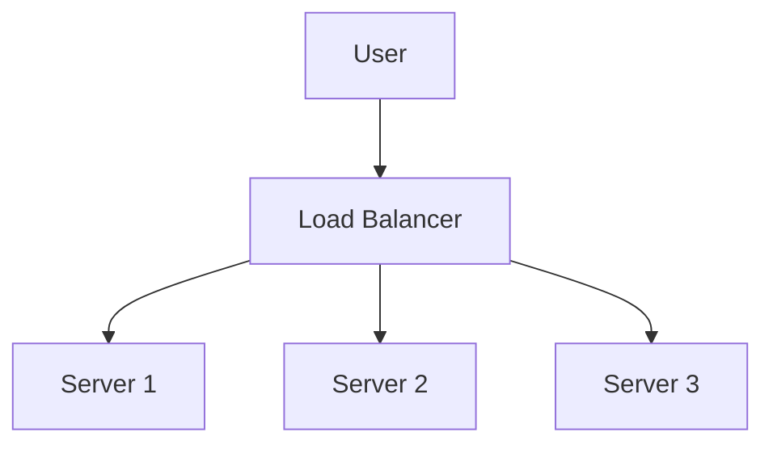
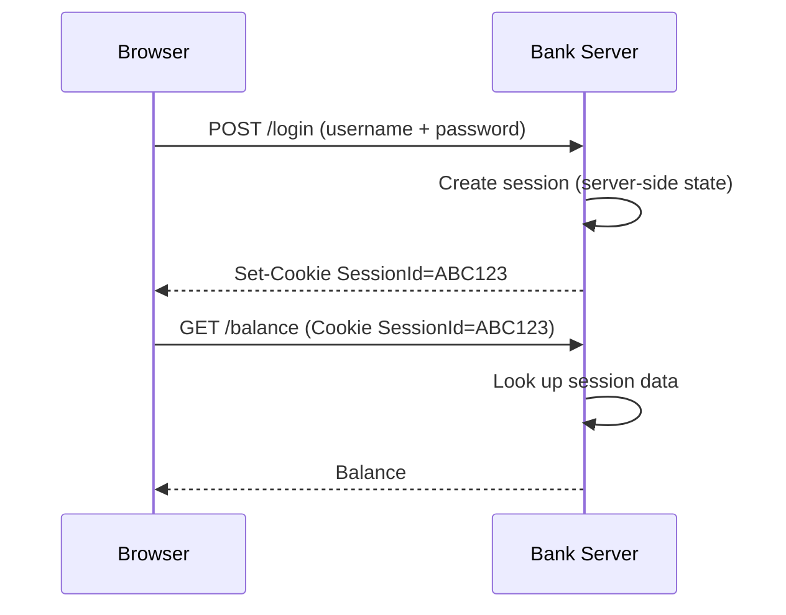

# Stateless Services, Cookies / Sessions / Tokens, and Where State Lives

These concepts are closely related and are fundamental to how web applications **scale** and **remember users**.

## The mental model in four lines

| Term | One-line meaning |
|---|---|
| **State** | Memory about a user or an operation. |
| **Stateless service** | A service that forgets everything after responding. |
| **Session / Cookie / Token** | Mechanisms used to remember *who* the user is. |
| **Server-side vs client-side state** | *Where* that memory is stored. |

---

## 1. Stateless Services

### Simple definition

A stateless service **does not remember anything about previous requests**.

Every request must carry all the information needed to process it.

> Think of it as talking to someone with zero memory.

### Example

You ask:

> What's my account balance?

The server verifies you and replies.

Five seconds later:

> Show my last transactions.

The server does not remember the previous balance request — it treats the new request as completely independent.

### Banking example — ATM balance inquiry

You insert your card and enter your PIN.

**Request**

```text
Get balance for Account 123
```

**Response**

```text
₹50,000
```

A minute later you request a mini statement. The system does not rely on the earlier balance request.

Each request independently identifies:

- card
- account
- customer

This allows thousands of ATM transactions to be processed independently.

### Life sciences example — digital pathology image retrieval

A researcher opens a slide:

```text
Slide ID: S12345
```

| # | Request |
|---|---|
| 1 | `Get thumbnail` |
| 2 | `Get full-resolution image` |
| 3 | `Run cell detection` |

Each request contains the slide ID, so the image service doesn't need to remember previous requests.

### Everyday example — Google Search

You search:

```text
best pizza near me
```

One second later:

```text
weather today
```

Google processes each search separately. It doesn't require memory of the previous search to answer the next one.

### Why stateless is popular

- ✅ Easier scaling
- ✅ Easier load balancing
- ✅ Easier failover
- ✅ Better cloud deployment



Any request can go to any server, because no server-specific memory is required.

---

## 2. Cookies, Sessions, and Tokens

These three are often confused. Their purpose is the same:

> **"How do we know this request belongs to the same user?"**

### 2.1 Cookies

**Simple definition** — a cookie is a small piece of data stored in the browser. The browser automatically sends it back to the server on future requests.

**Example** — after login the server sets:

```http
Cookie: user=mahesh
```

The browser stores it, and future requests automatically include it.

**Banking example** — an online banking portal issues after login:

```http
SessionCookie=ABC123
```

Every page request sends that cookie back, so the bank knows it is the same customer.

**Life sciences example** — in a Laboratory Information System (LIMS), the researcher logs in and the browser stores:

```http
user-session=XYZ
```

Opening experiment data automatically includes that cookie.

**Everyday example** — Amazon uses cookies to remember:

- language preference
- shopping cart
- recently viewed items

### 2.2 Sessions

**Simple definition** — a session is user state stored **on the server**. The browser usually stores only a session-ID cookie.

**Example** — the server stores:

```json
// Session ABC123
{
  "user": "Mahesh",
  "role": "Admin",
  "loggedIn": true
}
```

The browser stores only `ABC123`.

**Banking example** — after customer login the server creates:

```json
// Session 4567
{
  "customer": "John",
  "account": "Savings",
  "authenticated": true
}
```

The browser sends `SessionId=4567`; the sensitive information stays on the bank's servers.

**Life sciences example** — a research platform session:

```json
{
  "user": "Researcher1",
  "study": "Cancer Trial",
  "permissions": "ReadOnly"
}
```

The browser holds only the session identifier.

**Everyday example** — a movie ticket booking site keeps in your session:

- selected theater
- selected seats
- payment stage

…until checkout completes.

### 2.3 Tokens

**Simple definition** — a token is a **signed** piece of information sent by the client with every request. Unlike sessions, the server often doesn't need to look anything up: the token itself carries the user information.

A common example is a **JWT (JSON Web Token)**.

**Simplified token payload**

```json
{
  "user": "Mahesh",
  "role": "Admin"
}
```

…signed by the server.

**Banking example** — a mobile banking API. Login returns an access token, and every API call sends:

```http
Authorization: Bearer token123
```

The API validates the token and processes the request — no session lookup may be required.

**Life sciences example** — a cloud-based image analysis system returns:

```http
Authorization: Bearer xyz
```

with permissions embedded in the token:

```json
{
  "role": "Scientist",
  "project": "BreastCancerStudy"
}
```

Every API call carries that token.

**Everyday example** — Microsoft 365 or Google Workspace. After login your browser receives tokens, and opening Mail, Calendar, or Drive uses those tokens to prove your identity.

### 2.4 Cookie vs Session vs Token — the hotel analogy

| Mechanism | Hotel equivalent | What it means |
|---|---|---|
| **Cookie** | A paper slip that says `Room Number 205`, which you carry. | Small data the client holds and re-sends. |
| **Session** | Reception stores `Room 205 · Guest Mahesh · Check-out tomorrow`. | The server remembers; the client holds only an ID. |
| **Token** | A digitally signed VIP pass: `Guest Mahesh · Gold Member`. | Any staff member can verify it without calling reception. |

---

## 3. Server-Side vs Client-Side State

This is about **where the application's memory lives**.

### 3.1 Server-side state

State is stored on the server — sessions, shopping carts, workflow progress. The browser only stores an identifier.

**Banking example** — an online loan application. The server stores:

```json
{
  "user": "Customer123",
  "step": "Document Verification"
}
```

The browser stores only the session ID. If the user logs in from another device, the server still knows the progress.

**Life sciences example** — a long-running image analysis job:

```json
{
  "job": "Analysis123",
  "status": "Running"
}
```

The researcher can close the browser and return later; the state remains on the server.

**Everyday example** — a food delivery app. The server stores the current order, driver location, and delivery progress, so closing the app doesn't delete the order.

### 3.2 Client-side state

State is stored on the user's device — cookies, browser local storage, JWT tokens, UI preferences.

**Banking example** — the banking app stores locally on the phone:

```json
{
  "preferredLanguage": "English"
}
```

No server lookup needed.

**Life sciences example** — an image viewer stores locally:

```json
{
  "zoom": 300,
  "lastTool": "Measurement"
}
```

The user's viewing preferences stay in the browser.

**Everyday example** — an e-commerce site remembers dark mode, preferred currency, and page layout inside browser storage.

### 3.3 Side by side — Netflix

| | Server-side state | Client-side state |
|---|---|---|
| **Stores** | subscription · watch history · payment status | theme · playback volume · subtitle preferences |
| **Lives on** | Netflix servers | your device |
| **Nature** | critical business data | user preferences |

---

## 4. Putting everything together — online banking



1. **Login** — the customer enters username + password.
2. **Server creates a session** — this is *server-side state*:

   ```json
   {
     "customer": "Mahesh",
     "authenticated": true
   }
   ```

3. **Browser receives a cookie** — this is the *cookie*:

   ```http
   SessionId=ABC123
   ```

4. **Future requests** carry it automatically:

   ```http
   GET /balance
   Cookie: SessionId=ABC123
   ```

   The server finds the session data.

### Alternative modern approach

Instead of a session, the browser sends a token:

```http
Authorization: Bearer eyJhb...
```

The service remains largely **stateless**, because it can validate the token without storing session data.

---

## 5. Quick memory trick — the airport

| Concept | Airport equivalent |
|---|---|
| **Stateless service** | Every checkpoint makes you show your boarding pass again. |
| **Cookie** | A small claim ticket you carry. |
| **Session** | The airport database remembers your status. |
| **Token** | A digitally signed boarding pass proving who you are. |
| **Server-side state** | The airport keeps your information. |
| **Client-side state** | You carry the information yourself. |

---

## 6. One-line summary

| Concept | Summary |
|---|---|
| **Stateless service** | Remembers nothing between requests. |
| **Cookie** | Small data stored in the browser. |
| **Session** | User state stored on the server. |
| **Token** | Portable proof of identity carried by the client. |
| **Server-side state** | Application memory lives on servers. |
| **Client-side state** | Application memory lives on the user's device. |
