# Stateless Services, Cookies / Sessions / Tokens & Where State Lives — Interview-Ready Deep Dive

> **Purpose:** "keep the services stateless" is the single most repeated sentence in system design interviews — and the least examined. This note takes it apart: *what* state actually is, *where* each kind of state is allowed to live, and the three mechanisms (cookie, server session, signed token) every real system uses to carry identity across a stateless fleet.
>
> **Covers:** HTTP's statelessness · stateless vs stateful services · application state vs resource state in REST · cookies (attributes, `SameSite`, prefixes) · server-side sessions · JWT internals and attacks · session vs JWT (with code) · access + refresh tokens and rotation · browser storage & the XSS/CSRF matrix · OAuth 2.0 / OIDC / SSO · server-side vs client-side state beyond auth · the genuinely stateful services · capacity math.
>
> **Companions:** [high-level-system-design-cocept.md](high-level-system-design-cocept.md) (statelessness as the prerequisite for horizontal scaling) · [load-balancer.md](load-balancer.md) §10 (sticky sessions) · [rest-api.md](rest-api.md) §12 (AuthN/AuthZ in APIs) · [system-design-course-fcc.md](system-design-course-fcc.md) §12–14 (auth methods, authorization, API security) · [secure-reliable-systems.md](secure-reliable-systems.md) §4 & §8 (least privilege, zero trust, and why wall-clock token expiry is a recovery hazard — use epochs and revocation lists) · [frontend-state-data.md](frontend-state-data.md) (the browser half of this story) · [caching.md](caching.md) (session store = a cache with durability requirements) · [README.md](README.md)

### Source videos this note is distilled from

| # | Video | Author | The one thing it nails |
|---|---|---|---|
| V1 | [Session vs Token Authentication in 100 Seconds](https://www.youtube.com/watch?v=UBUNrFtufWo) | Fireship | The 100-second contrast: server *remembers* vs server *verifies* |
| V2 | [Difference between cookies, session and tokens](https://www.youtube.com/watch?v=GhrvZ5nUWNg) | Valentin Despa | Cookies are a **transport**, sessions and tokens are **strategies** — they are not alternatives to each other |
| V3 | [Token vs Session Authentication](https://www.youtube.com/watch?v=QzntvHz23tw) | Piyush Garg | Walks the actual request/response headers end to end |
| V4 | [Session Vs JWT: The Differences You May Not Know](https://www.youtube.com/watch?v=fyTxwIa-1U0) | ByteByteGo | The revocation problem, and why "JWT scales better" is oversold |
| V5 | [OAuth 2 Explained In Simple Terms](https://www.youtube.com/watch?v=ZV5yTm4pT8g) | ByteByteGo | The four roles and the authorization-code flow |
| V6 | [What is JWT token and JWT vs Sessions](https://www.youtube.com/watch?v=xrj3zzaqODw) | Chai aur Code | Signature ≠ encryption; the payload is readable by anyone |
| V7 | [Authentication Explained: Basic, Bearer, OAuth2, JWT & SSO](https://www.youtube.com/watch?v=9JPnN1Z_iSY) | Hayk Simonyan | The selection matrix across schemes |
| V8 | [Stateless vs Stateful Services — System Design](https://www.youtube.com/watch?v=pVgGz3pkS0A) | SimplifiedByRajat | The scaling consequence of each |
| V9 | [JWT in System Design: Refresh Tokens & Security](https://www.youtube.com/watch?v=8-sQton2Lto) | Mohit Chhabra | Refresh-token rotation and reuse detection |

### Written sources

| # | Source | The one thing it adds |
|---|---|---|
| W1 | [MDN — HTTP](https://developer.mozilla.org/en-US/docs/Web/HTTP) · [Using HTTP cookies](https://developer.mozilla.org/en-US/docs/Web/HTTP/Guides/Cookies) | The normative statement: HTTP keeps no session data between requests; **cookies were the later addition that put state back** |
| W2 | [StacKnowledge — Web Sessions: state management](https://stacknowledge.in/blogs/web-sessions-stateless-stateful/) | The "HTTP has amnesia" framing + the coat-check analogy + scaling ladder (sticky → Redis → JWT) |
| W3 | [codefarm — Client-Server: REST, statelessness, HTTP methods](https://codefarm.in/guides/system-design/01-foundations/client-server) | Stateless **protocol** vs stateful protocol (HTTP vs TCP), and the 6 REST constraints |
| W4 | [Stack Overflow — If REST is stateless, how do you manage sessions?](https://stackoverflow.com/questions/3105296/if-rest-applications-are-supposed-to-be-stateless-how-do-you-manage-sessions) | ⭐ **Application/session state vs resource state** — the distinction that resolves the apparent paradox |
| W5 | [Security StackExchange — Are cookie/token mechanisms stateful or stateless?](https://security.stackexchange.com/questions/225723/token-and-cookie-based-mechanisms-stateful-or-stateless-session-or-nonsession) | Transport and statefulness are **orthogonal axes** → the 2×2 matrix in §1.8 |
| W6 | [Sohail Saifi — Session Management: Cookies vs Tokens vs Server-Side Sessions](https://medium.com/@sohail_saifi/session-management-cookies-vs-tokens-vs-server-side-sessions-192b7486ef1e) | "Every request is like meeting someone for the first time" |
| W7 | [Elijah Echekwu — Session cookies vs JWT tokens](https://medium.com/@elijahechekwu/server-side-session-management-session-cookies-vs-jwt-tokens-02f9415bdf7f) | Side-by-side Express implementations (`express-session` + `connect-redis` vs `jsonwebtoken`) → §5.4 |
| W8 | [Sushant Gaurav — Stateful vs stateless, authN/authZ in Node.js](https://dev.to/imsushant12/securing-web-applications-stateful-vs-stateless-systems-authentication-and-authorization-in-nodejs-b1m) | The **three session-ID transports** (cookie, URL param, hidden field) and why cookies won → §2.5 |
| W9 | [GeeksforGeeks — Stateful vs stateless architecture](https://www.geeksforgeeks.org/system-design/stateful-vs-stateless-architecture/) · [levelup — HTTP is a stateless protocol](https://levelup.gitconnected.com/the-http-protocol-is-a-stateless-protocol-that-is-every-time-the-server-receives-a-request-b9c4f31bfbb3) | The architecture-level framing → §1.2 |

---

## Index

| # | Topic | Section |
|---|---|---|
| 1 | The mental model — HTTP's amnesia, protocol vs service vs architecture, **REST's application state vs resource state** | [§1](#1-the-mental-model--stateless-does-not-mean-no-state) |
| 2 | **Cookies** — attributes, `SameSite`, prefixes, size budget, the transports that lost | [§2](#2-cookies--the-transport-layer-for-identity) |
| 3 | **Server-side sessions** — flow, stores, revocation, failure modes | [§3](#3-server-side-sessions) |
| 4 | **Tokens & JWT** — anatomy, claims, verification, the classic attacks | [§4](#4-tokens--jwt) |
| 5 | **Session vs JWT** — the honest comparison, the decision tree, and **both in code** | [§5](#5-session-vs-jwt--the-decision) |
| 6 | **Access + refresh tokens**, rotation, reuse detection | [§6](#6-access-tokens-refresh-tokens--rotation) |
| 7 | **Browser storage** — the XSS/CSRF matrix and the BFF pattern | [§7](#7-where-to-store-the-token-in-a-browser) |
| 8 | **OAuth 2.0 & OIDC** — roles, PKCE, scopes vs claims, SSO | [§8](#8-oauth-20--oidc) |
| 9 | Choosing an auth scheme — Basic · Bearer · API key · mTLS · OAuth | [§9](#9-choosing-an-auth-scheme) |
| 10 | **Server-side vs client-side state beyond auth** — carts, wizards, flags | [§10](#10-server-side-vs-client-side-state-beyond-auth) |
| 11 | When you genuinely need a **stateful** service | [§11](#11-when-you-genuinely-need-a-stateful-service) |
| 12 | Capacity math — session store sizing, the JWT bandwidth tax | [§12](#12-capacity-math) |
| 13 | Failure-mode catalogue | [§13](#13-failure-mode-catalogue) |
| ★ | What to say in the interview | [§14](#14-what-to-say-in-the-interview) |
| ★ | Rapid-fire Q&A | [§15](#15-rapid-fire-qa) |
| ★ | Summary + the memory trick | [§16](#16-summary--the-memory-trick) |

---

## 1. The Mental Model — Stateless Does Not Mean No State

### 1.1 The root cause: HTTP has amnesia

Before any of this is a *design* question, it is a *protocol* fact. **HTTP is stateless by specification** — the server keeps nothing between two requests. Every request arrives as if from a stranger.

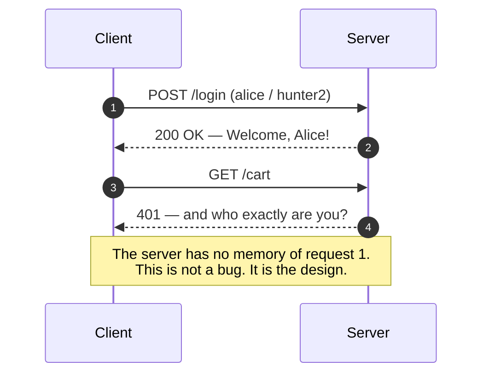

Without something bolted on top: you'd re-enter your password on every page, your cart would empty on the way to checkout, and the web would be unusable. Every technique in this note exists to **simulate a stateful conversation over a stateless protocol**.

> 📖 **MDN's wording, worth quoting verbatim:** *"HTTP is a stateless protocol, meaning that the server does not keep any session data between two requests, although the later addition of **cookies** adds state to some client–server interactions."* ([MDN — HTTP](https://developer.mozilla.org/en-US/docs/Web/HTTP))

That "later addition" is literal history: cookies were invented at Netscape in 1994 specifically to give a stateless protocol a memory, and are standardised today in **RFC 6265** (with `SameSite` and the `__Host-`/`__Secure-` prefixes arriving in 6265bis).

⭐ **Why the protocol was made stateless on purpose:** any server can answer any request, requests are independently cacheable and retryable, a failed request corrupts nothing, and intermediaries (proxies, CDNs, load balancers) can sit in the middle without understanding your application. Statelessness is what made the web scale — session management is the tax you pay to get usability back.

### 1.2 Stateless *protocol* ≠ stateless *service* ≠ stateless *architecture*

Three different levels, routinely conflated. Being precise here is a cheap senior signal.

| Level | Question it answers | Examples |
|---|---|---|
| **Protocol** | Does the wire format require memory of previous messages? | ❌ Stateless: HTTP, DNS(UDP), REST. ✅ Stateful: TCP (sequence numbers, window), TLS (session keys), FTP (working directory), WebSocket, SSH |
| **Service / instance** | Can any replica serve any request? | ✅ Stateless: a REST app server reading from Redis. ❌ Stateful: an app keeping sessions in process memory, a Kafka Streams task with local RocksDB |
| **Architecture / system** | Where does the system as a whole keep its truth? | Always stateful *somewhere* — the database. The design question is only *which layer* is allowed to hold it |

⚠️ **The trap:** "HTTP is stateless" and "my service is stateless" are unrelated claims. You can build a hopelessly stateful service on HTTP (sessions in RAM), and you can build a perfectly stateless service on a stateful protocol (a gRPC service over HTTP/2 that stores nothing per connection).

> ⭐ **Say this:** *"TCP is stateful, TLS is stateful, HTTP/2 keeps an HPACK table per connection — so the transport underneath me has plenty of state. What's stateless is the **application semantics**: request N+1 doesn't depend on the server remembering request N. That's the property that lets a load balancer send them to different machines."*

### 1.3 The word "session" means four different things

| "Session" | What it actually is | Lifetime |
|---|---|---|
| **TCP/TLS session** | Connection + negotiated keys (and TLS session resumption tickets) | Seconds to minutes |
| **HTTP session** (MDN's sense) | One connection's request/response exchanges; keep-alive reuses it | Per connection |
| **User session** ⭐ | The logical "you are logged in" period — what this note is about | Minutes to weeks |
| **Session cookie** | A cookie with *no* `Max-Age`/`Expires`, dropped when the browser closes | Browser lifetime |

Ask which one the interviewer means if it's ambiguous — it usually isn't, but noticing the ambiguity reads well.

### 1.4 Statelessness in REST — application state vs resource state

*"If REST must be stateless, how do you have logged-in users at all?"* is a classic, and the answer is a distinction Fielding drew explicitly.

| | **Application (session) state** | **Resource state** |
|---|---|---|
| What it is | Where *this client* is in *this conversation* — wizard step 3, "the cart I'm building", last search results | The data the system owns — users, orders, products |
| Who may hold it | ⭐ **The client.** The server must not need it between requests | ✅ **The server** — that's what the database is for |
| Violates REST if server-side? | ✅ Yes | ❌ No — completely fine |

So: storing a user's **orders** in Postgres is resource state and perfectly RESTful. Storing "this client is currently on page 3 of a multi-step form, in server memory keyed by connection" is application state and breaks the constraint.

⚠️ **And the nuance everyone gets wrong:** *authentication is not session state*. A request carrying credentials — Basic, a bearer token, or even a session cookie — is still self-contained: it brings everything needed to process it. The server doing a **lookup** to validate it (checking a password hash, or a session row) is no different from any other database read. What breaks statelessness is the server needing to *remember what happened last time*, not the server needing to *look something up*.

> ⭐ **The line:** *"REST's stateless constraint is about **session** state, not all state. The server can hold as much resource state as it likes in a database. What it can't do is require memory of the previous request — because then the next request has to land on the same machine."* → [rest-api.md](rest-api.md)

### 1.5 The definition that scores

A service is **stateless** when *any* instance can serve *any* request, because **nothing needed to process the request lives only in that instance's memory or local disk**.

> ⭐ **Say this:** *"Stateless doesn't mean the **system** has no state — every interesting system has state. It means the **instance** has none. State moves to a shared store, or it is carried by the client in a form the server can verify. That's exactly what lets me put N identical servers behind a load balancer and lose any one of them at the cost of a retry, not a logout."*

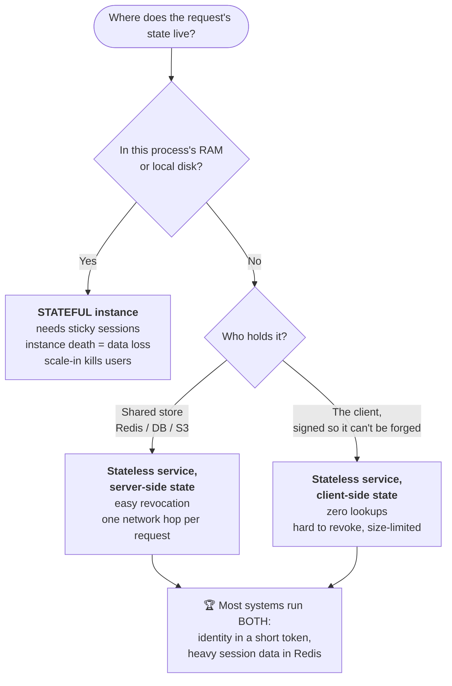

### 1.6 The four places state can live

| Where | Examples | Survives instance death? | Cost of reading it | Trust model |
|---|---|---|---|---|
| **Instance memory / local disk** | in-process session map, uploaded file in `/tmp`, in-memory job queue | ❌ No | Free (ns) | Fully trusted |
| **Shared data store** | Redis session store, Postgres, DynamoDB | ✅ Yes | 1 network hop (~0.2–2 ms) | Fully trusted |
| **Object storage / durable log** | S3, Kafka, event store | ✅ Yes | 10–100 ms | Fully trusted |
| **The client** | cookie, JWT, `localStorage`, URL param, hidden form field | ✅ Yes (per device) | Free — it arrives with the request | ⚠️ **Untrusted unless signed** |

⚠️ **The rule that separates seniors from juniors:** *anything you put on the client, the user can read and edit.* You may store it there only if (a) you don't mind them reading it, **and** (b) you either don't mind them editing it or you **sign it and verify the signature**.

### 1.7 Stateful vs stateless — the scaling consequence

| | ❌ Stateful service | ✅ Stateless service |
|---|---|---|
| Add a server | New server is useless until users are routed to it *and* their state migrates | Instantly useful |
| Remove a server (scale-in, spot reclaim, deploy) | Users on it lose their session/cart/upload | A retry lands elsewhere; user notices nothing |
| Load balancing | Constrained — must honour affinity | Free to optimise purely for load ([load-balancer.md](load-balancer.md) §10) |
| Deploys | Rolling deploy = rolling logouts | Rolling deploy is invisible |
| Autoscaling | Fights with affinity | Works |
| Caching / CDN | Responses are per-instance, poorly cacheable | Cacheable ([cdn-edge.md](cdn-edge.md)) |
| Debugging | "It only fails on box 7" | Reproducible anywhere |

**The migration in one line:** session in RAM → session in Redis; file on local disk → S3; in-memory job state → a queue + a database row; cron on one box → a distributed scheduler with a lock.

### 1.8 Cookies vs sessions vs tokens — they are not three options

This is the single most common confusion (V2), and correcting it early in an interview is a strong signal.

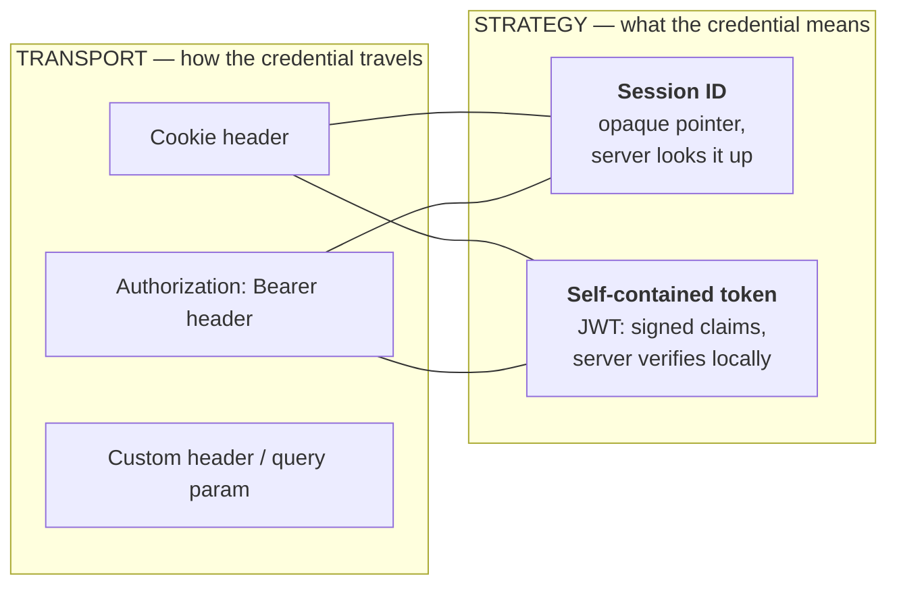

| Term | What it actually is |
|---|---|
| **Cookie** | A *transport mechanism*. A small key–value pair the browser stores per origin and **automatically attaches** to matching requests. It can carry a session ID, a JWT, a theme preference, or an A/B bucket. |
| **Session** | A *server-side strategy*. The server stores the real data and gives the client an opaque **pointer** (session ID). |
| **Token** | A *client-side strategy*. The server gives the client the **data itself**, signed so it cannot be tampered with. |

Because transport and strategy are independent, all four combinations exist and all four ship in production:

| | **Reference credential** (opaque → server looks it up — *stateful*) | **Self-contained credential** (signed claims — *stateless*) |
|---|---|---|
| **In a cookie** (browser attaches it) | 🏆 Classic session ID. The default for first-party web apps | JWT in an `HttpOnly` cookie. Stateless *and* XSS-resistant — but now CSRF applies |
| **In an `Authorization` header** (client attaches it) | Opaque OAuth access token, validated by **introspection** (RFC 7662) at the auth server | 🏆 Classic Bearer JWT. The default for mobile and service-to-service |

> ⭐ **Say this:** *"Cookie is the envelope; session ID and JWT are two different things you can put inside the envelope. 'Cookies vs tokens' is a category error — the real axes are **where it travels** and **whether it's a pointer or the data itself**. You can absolutely put a JWT in an `HttpOnly` cookie, and for browser apps that's usually the best design."*

⚠️ A corollary worth stating: **"token-based" does not imply "stateless."** An opaque OAuth access token is a bearer token *and* a database lookup. Only a *self-contained, signed* token is stateless.

---

## 2. Cookies — The Transport Layer for Identity

### 2.1 The mechanics

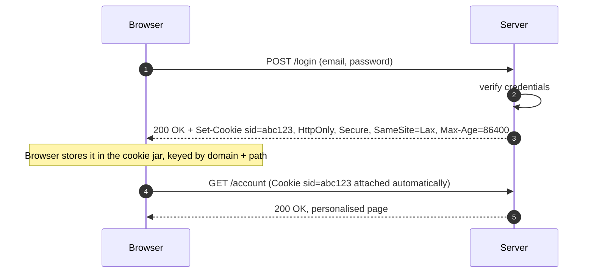

The browser does the attaching. That automation is simultaneously the cookie's biggest feature (nothing to remember in JS) and its biggest risk (**CSRF** — see §7).

### 2.2 The attributes that matter

| Attribute | What it does | Interview-grade note |
|---|---|---|
| `HttpOnly` | Hides the cookie from `document.cookie` | ⭐ The single most valuable flag. XSS can no longer *read* the credential |
| `Secure` | Only sent over HTTPS | Non-negotiable in production |
| `SameSite=Strict` | Never sent on cross-site requests | Kills CSRF — but the user arriving from a Google link appears logged out |
| `SameSite=Lax` | Sent on top-level **GET** navigations only | **The browser default today.** Best balance for most apps |
| `SameSite=None` | Sent on all cross-site requests | **Requires `Secure`.** Needed for genuine third-party/embedded scenarios |
| `Domain` | Which hosts receive it | Omit it to get a **host-only** cookie. Setting `Domain=example.com` leaks it to *every* subdomain — including that forgotten marketing subdomain |
| `Path` | Which paths receive it | Weak isolation; not a security boundary |
| `Max-Age` / `Expires` | Persistent cookie lifetime | Omit both → **session cookie**, dropped when the browser closes (though "session restore" often resurrects it) |
| `Partitioned` (CHIPS) | Third-party cookie keyed by top-level site too | The post-third-party-cookie world for embeds |
| `__Secure-` prefix | Browser refuses it unless `Secure` | Free defence-in-depth |
| `__Host-` prefix | Requires `Secure`, `Path=/`, **no** `Domain` | ⭐ The strongest cookie you can set — cannot be planted by a subdomain |

**A production-grade session cookie:**

```
Set-Cookie: __Host-sid=8f4c...; HttpOnly; Secure; SameSite=Lax; Path=/; Max-Age=1209600
```

### 2.3 The size budget — a cookie is a tax on every request

| Limit | Value |
|---|---|
| Max size per cookie | **~4 KB** (name + value + attributes) |
| Cookies per domain | ~50 (browser-dependent) |
| Total per domain | ~4 KB × count, but proxies often cap **total request headers at 8–16 KB** |

⚠️ **The failure mode nobody expects:** you keep adding claims to a JWT stored in a cookie until the request header crosses the proxy limit, and users start getting **`431 Request Header Fields Too Large`** or an nginx **`400`** — only after login, only for users with many roles. Cookies are sent on *every* request to that origin, including images and static assets, unless you serve assets from a cookieless domain or a CDN.

> ⭐ **Say this:** *"A cookie is bandwidth you pay on every single request. A 4 KB cookie on a page with 60 subresources is 240 KB of pure upload overhead before any payload — and upload is the slow direction on mobile. That's a real argument for an opaque 32-byte session ID over a fat JWT."*

### 2.4 Cookie vs `localStorage` vs `sessionStorage` vs memory

| | Cookie | `localStorage` | `sessionStorage` | JS memory |
|---|---|---|---|---|
| Sent automatically | ✅ Yes | ❌ No | ❌ No | ❌ No |
| Readable by JS | ❌ if `HttpOnly` | ✅ Always | ✅ Always | ✅ Always |
| Survives tab close | If persistent | ✅ Yes | ❌ No | ❌ No |
| Survives page reload | ✅ | ✅ | ✅ | ❌ |
| Shared across tabs | ✅ | ✅ | ❌ | ❌ |
| Size | ~4 KB | ~5–10 MB | ~5–10 MB | RAM |
| Vulnerable to XSS | Mitigated by `HttpOnly` | ☠️ **Fully** | ☠️ **Fully** | Partially (harder to exfiltrate silently) |
| Vulnerable to CSRF | ⚠️ **Yes** — needs `SameSite`/token | ❌ No | ❌ No | ❌ No |

→ deeper treatment on the browser side: [frontend-state-data.md](frontend-state-data.md) §11.

### 2.5 The other ways to carry a session ID — and why they lost

Cookies won, but interviewers like asking what else exists.

| Transport | Example | Why it's inferior |
|---|---|---|
| **Cookie** 🏆 | `Cookie: sid=8f4c...` | Automatic, `HttpOnly`-protectable, scoped to origin. Cost: CSRF exposure |
| **URL / query parameter** | `/cart;jsessionid=8f4c...` or `?sid=8f4c...` | ☠️ Leaks into browser history, the `Referer` header sent to third parties, server and proxy **access logs**, bookmarks, analytics, and anything the user pastes into chat. A pasted link becomes a login |
| **Hidden form field** | `<input type="hidden" name="sid">` | Only works for form POSTs — breaks every `GET` navigation. Survives as a *CSRF token* carrier, not a session carrier |
| **Custom header** | `X-Session-Id: 8f4c...` | Fine for APIs, but JS must attach it — so it can't be `HttpOnly`, and it doesn't survive a page navigation |
| **`Authorization` header** | `Authorization: Bearer ...` | 🏆 For non-browser clients. Immune to CSRF *because* nothing is automatic |

> ⚠️ **The rule:** *credentials never go in a URL.* Same reason password-reset links must be single-use and short-lived — URLs are logged, shared and cached in ways headers and cookies are not.

---

## 3. Server-Side Sessions

### 3.1 The flow

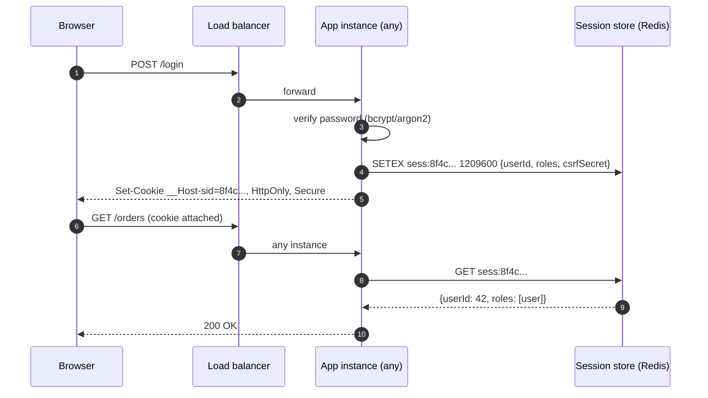

The cookie value is an **opaque, high-entropy random string** (≥128 bits, from a CSPRNG). It means nothing by itself — it is a pointer. Guessing it must be infeasible.

### 3.2 Where the session store lives

| Option | Verdict |
|---|---|
| **In-process memory** | ❌ Forces sticky sessions, loses everything on deploy. Fine for a single-box demo only |
| **Sticky sessions at the LB** | ⚠️ A *compatibility* feature, not a scaling strategy. Breaks on scale-in and rolling deploys → [load-balancer.md](load-balancer.md) §10 |
| **Redis / Memcached** | 🏆 The default. Sub-ms, native TTL, easy revocation. Needs a persistence/replication decision |
| **Relational DB** | ✅ Simple and durable; a hot, high-write table — every request becomes a DB read unless cached |
| **DynamoDB / Cassandra with TTL** | ✅ Great for multi-region, managed expiry |
| **Signed cookie holding the whole session** | This *is* the token strategy (§4) — no store, but all its trade-offs |

⚠️ **The session store is now a tier-0 dependency.** If Redis is down, *nobody can log in or stay logged in*. Plan it like a database: replication, failover, and a documented degradation (read-only mode? extend TTLs? fail open on a cached copy for N minutes?). And note the correlated-failure trap: a cold session store after a failover logs out **100% of users simultaneously**, who all then hammer your login path and identity provider.

### 3.3 What sessions are genuinely better at

| Capability | Why sessions win |
|---|---|
| **Instant revocation** | `DEL sess:abc` — logged out on the next request. This is the headline advantage (V4) |
| **"Log out all other devices"** | Delete every session whose `userId = 42` |
| **Mutable state mid-session** | Change a role, downgrade a plan, accept new terms — takes effect on the next request |
| **Privacy** | Nothing sensitive leaves your servers; the client holds an opaque string |
| **Small requests** | 32 bytes on the wire, not 800 |
| **Admin visibility** | You can *list* active sessions, show "signed in on 3 devices", show last-seen IP |

### 3.4 Failure modes

| Failure | Cause | Fix |
|---|---|---|
| Users randomly logged out | Sticky sessions + autoscale-in or rolling deploy | External session store |
| Session fixation | Reusing the pre-login session ID after authentication | ⭐ **Regenerate the session ID on every privilege change** (login, logout, role elevation) |
| Session hijacking | ID stolen over HTTP / via XSS / in logs | `Secure` + `HttpOnly` + HSTS; never log cookies or full URLs with tokens |
| Session store overload | Every request is a lookup | Local in-process cache with a very short TTL (1–5 s) in front of Redis; accept the staleness window explicitly |
| Sessions never expire | No TTL, or sliding expiry with no absolute cap | **Two clocks:** idle timeout (e.g. 30 min) **and** absolute lifetime (e.g. 14 days) |
| Memory blowup | Storing the user's whole profile/cart in the session | Session holds IDs and a few flags; fetch the rest |

---

## 4. Tokens & JWT

### 4.1 Anatomy

A JWT is three base64url segments joined by dots: `header.payload.signature`.

```
eyJhbGciOiJSUzI1NiIsInR5cCI6IkpXVCIsImtpZCI6IjIwMjYtMDkifQ
.eyJpc3MiOiJodHRwczovL2F1dGguZXhhbXBsZS5jb20iLCJzdWIiOiI0MiJ9
.MEUCIQD...signature...
```

```json
// header
{ "alg": "RS256", "typ": "JWT", "kid": "2026-09" }

// payload (claims)
{
  "iss": "https://auth.example.com",
  "sub": "42",
  "aud": "https://api.example.com",
  "exp": 1757936400,
  "iat": 1757935500,
  "jti": "b1f0-...",
  "scope": "orders:read orders:write",
  "roles": ["user"]
}
```

⚠️ **Base64url is encoding, not encryption (V6).** Anyone holding the token can paste it into jwt.io and read every claim. **Never put a secret, a password, a PII-heavy blob, or an internal-only flag in a JWT payload.** The signature guarantees *integrity and authenticity*, not *confidentiality*. If you truly need confidentiality, that's JWE — and at that point ask whether an opaque token would be simpler.

### 4.2 Registered claims worth knowing

| Claim | Meaning | Must you validate it? |
|---|---|---|
| `iss` | Issuer | ✅ Yes — pin it |
| `sub` | Subject (the user/principal ID) | ✅ Use it, don't trust a `userId` you invented instead |
| `aud` | Intended audience | ✅ **Yes** — stops Service A's token being replayed at Service B |
| `exp` | Expiry | ✅ Yes |
| `nbf` | Not before | ✅ If present |
| `iat` | Issued at | Useful for "reject tokens issued before password change" |
| `jti` | Unique token ID | Needed for a denylist and for replay detection |
| `kid` (header) | Which key signed it | ✅ Enables key rotation via JWKS |

### 4.3 Signing algorithms

| Family | Example | Key model | Use when |
|---|---|---|---|
| **HMAC** | `HS256` | One **shared secret** signs and verifies | Single service, or a tightly controlled pair. ⚠️ Every verifier can also *forge* |
| **RSA** | `RS256` | Private key signs, **public** key verifies | 🏆 Many services verify, one issues. Public keys distributed via **JWKS** (`/.well-known/jwks.json`) |
| **ECDSA / EdDSA** | `ES256`, `EdDSA` | Same asymmetric model, smaller and faster | Modern default when your stack supports it |

> ⭐ **Say this:** *"I'd use RS256 or EdDSA rather than HS256 as soon as more than one service verifies tokens — with HMAC, every verifier holds a key that can also mint tokens, so a single leaked config in your least-important service becomes a full identity compromise."*

### 4.4 The verification checklist (the part people skip)

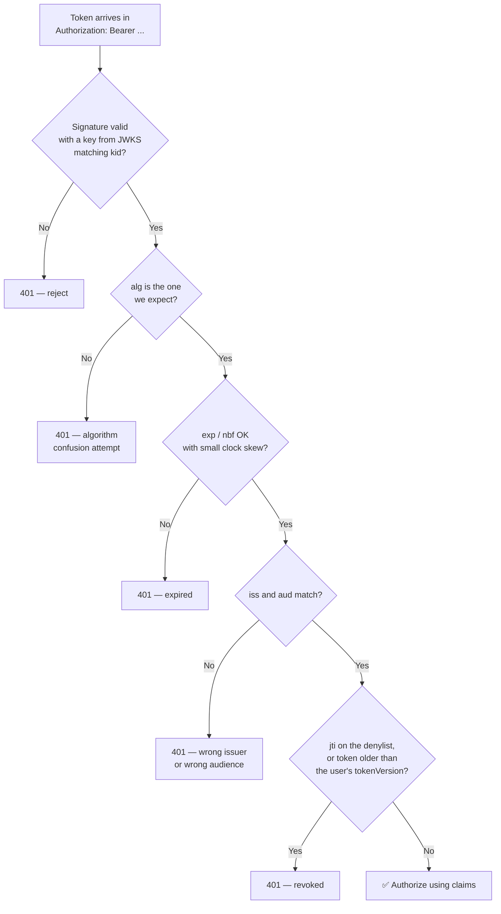

### 4.5 The three classic JWT attacks

| Attack | How it works | Defence |
|---|---|---|
| **`alg: none`** | Attacker sets the header to `{"alg":"none"}` and strips the signature; a naive library accepts it | **Pin the expected algorithm** in your verify call; never let the token choose |
| **Algorithm confusion (RS256 → HS256)** | Attacker switches `alg` to `HS256` and signs with your *public* key as the HMAC secret; a library that picks the algorithm from the header validates it | Same fix: pin the algorithm, and use a library API that takes the alg explicitly |
| **Missing `aud` / `exp` checks** | A long-lived token for a low-privilege service is replayed at a high-privilege one | Validate **all** of `iss`, `aud`, `exp` — signature-valid ≠ authorized |

Also: **no revocation by default**, and **key rotation** must be planned from day one (`kid` + JWKS with an overlap window where both old and new keys verify).

### 4.6 The revocation problem, and the four real answers

A JWT is valid until it expires. If a user is banned, a laptop is stolen, or a role is revoked, an already-issued token keeps working.

| Strategy | How | Cost |
|---|---|---|
| **Short TTL + refresh token** | Access token lives 5–15 min; damage window is bounded | 🏆 Standard. Needs §6 |
| **Denylist by `jti`** | Redis set of revoked IDs, TTL = remaining token lifetime | Reintroduces a lookup — but only a *small* one, and it can fail open |
| **`tokenVersion` / `sid` claim** | Store one integer per user; bump it to invalidate every token; verify against a cached value | One cheap read, invalidates *all* devices at once |
| **Rotate the signing key** | Nuclear option — invalidates every token from every user | Emergency use only |

> ⭐ **The senior line:** *"The moment you add a denylist to make JWTs revocable, you've reinvented sessions with extra steps — but with one real difference: the lookup can **fail open** and is only consulted for the small set of revoked tokens, whereas a session lookup is mandatory on every request. That's the actual trade-off, not 'stateless is faster'."*

---

## 5. Session vs JWT — The Decision

### 5.1 The comparison

| Dimension | Server-side session | JWT / self-contained token |
|---|---|---|
| Where the truth lives | Server store | Inside the token |
| Per-request cost | 1 store lookup (~0.2–2 ms) | Signature verify (~10–100 µs), zero I/O |
| Revocation | ✅ Instant, trivial | ❌ Hard — needs TTL/denylist/version |
| Payload on the wire | ~32–64 bytes | ~300–1000+ bytes, **every request** |
| Horizontal scaling | Needs a shared store (which must itself scale) | Nothing shared to scale |
| Cross-domain / mobile / third-party API | Awkward (cookies are origin-bound) | 🏆 Natural — just a header |
| Microservices | Every service needs store access, or an auth service call | 🏆 Each service verifies locally with a public key |
| Mutating state mid-session | ✅ Easy | ❌ Stale until the token refreshes |
| Privacy | 🏆 Nothing leaves the server | ⚠️ Claims are readable by the client and anyone who steals it |
| Operational failure mode | Store down = total auth outage | Issuer down = no *new* logins, existing tokens still work |
| Complexity to get right | Low | ⚠️ High — alg pinning, key rotation, clock skew, refresh rotation |

### 5.2 The decision tree

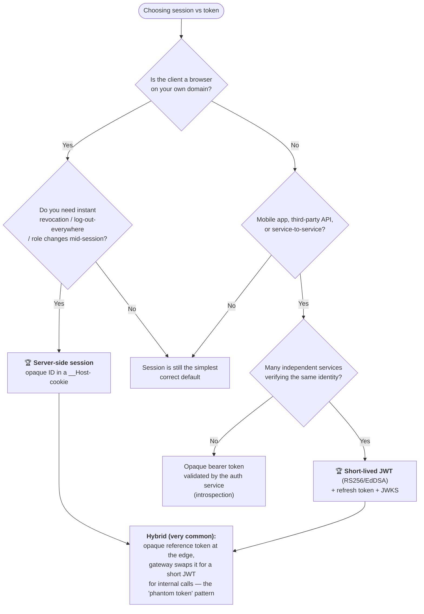

> ⭐ **The contrarian point that lands well:** *"JWTs are the default in tutorials and the wrong default in a lot of products. For a first-party web app, a session ID in an `HttpOnly` cookie is smaller, revocable, private and far harder to get wrong. I reach for JWTs when identity has to cross a trust boundary — mobile clients, third-party APIs, or many services that shouldn't all talk to one session store."* (V4)

### 5.3 The hybrid most large systems actually run

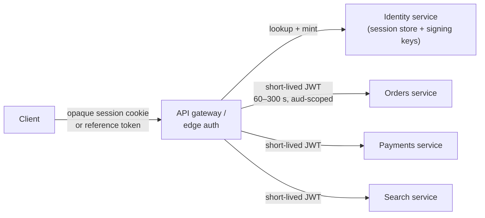

Client gets revocability and a tiny cookie; internal services get stateless, locally-verifiable identity with no shared session store. The token that crosses the internet is opaque; the token that crosses your mesh is a JWT with a 60-second life.

### 5.4 Both, in code (Express) — so you can talk about the details

**Session-based, backed by Redis:**

```js
import express from "express";
import session from "express-session";
import { RedisStore } from "connect-redis";
import { Redis } from "ioredis";

const app = express();

app.use(session({
  store: new RedisStore({ client: new Redis(process.env.REDIS_URL) }),
  secret: process.env.SESSION_SECRET,   // signs the cookie so the ID can't be swapped
  name: "__Host-sid",                   // strongest cookie prefix
  resave: false,                        // ⚠️ true = a Redis write on EVERY request
  saveUninitialized: false,             // ⚠️ true = a session row for every bot/crawler
  rolling: true,                        // sliding idle window
  cookie: { httpOnly: true, secure: true, sameSite: "lax", path: "/", maxAge: 30 * 60_000 },
}));

app.post("/login", async (req, res) => {
  const user = await verifyPassword(req.body);           // argon2/bcrypt
  await new Promise((r) => req.session.regenerate(r));   // ⭐ kills session fixation
  req.session.userId = user.id;
  res.json({ ok: true });
});

app.post("/logout", (req, res) => req.session.destroy(() => res.json({ ok: true })));
```

⚠️ **Three defaults that bite in production:** `express-session` falls back to an **in-memory store** if you omit `store` (it warns, then silently leaks memory and breaks multi-instance); `resave: true` turns every request into a Redis write; `saveUninitialized: true` creates a session for every unauthenticated crawler, which is how session stores quietly reach millions of junk keys.

**Token-based, RS256 with rotation:**

```js
import jwt from "jsonwebtoken";

// Issue — short access token, opaque refresh token persisted server-side
const accessToken = jwt.sign(
  { sub: user.id, roles: user.roles },
  privateKey,
  { algorithm: "RS256", expiresIn: "10m", issuer: ISS, audience: AUD, keyid: KID }
);
const refreshToken = crypto.randomBytes(32).toString("base64url");
await db.refreshTokens.insert({ hash: sha256(refreshToken), familyId, userId: user.id, used: false });

res.cookie("__Host-rt", refreshToken, { httpOnly: true, secure: true, sameSite: "strict", path: "/auth/refresh" });
res.json({ accessToken });     // access token stays in JS memory, never in localStorage

// Verify — pin everything; never let the token choose
const claims = jwt.verify(token, publicKeyFor(header.kid), {
  algorithms: ["RS256"],       // ⭐ blocks alg:none and RS256→HS256 confusion
  issuer: ISS,
  audience: AUD,               // ⭐ blocks cross-service replay
  clockTolerance: 60,
});
```

> ⭐ **The detail that reads as experience:** *"`jwt.verify(token, key)` without the `algorithms` option is the single most common JWT vulnerability in the wild — the library will honour whatever `alg` the attacker put in the header. I always pin the algorithm, the issuer and the audience."*

---

## 6. Access Tokens, Refresh Tokens & Rotation

### 6.1 Why two tokens

| | Access token | Refresh token |
|---|---|---|
| Purpose | Call APIs | Get a new access token |
| Lifetime | **5–15 minutes** | **Days to months** |
| Sent to | Every resource server | **Only** the auth server's `/token` endpoint |
| Format | Usually JWT | Usually opaque + stored server-side |
| Stored where | Memory (SPA) / secure storage (mobile) | `HttpOnly` cookie / OS keychain |
| Revocable | Not directly | ✅ Yes — it's a database row |

This is the trick that makes stateless auth acceptable: the *frequently used* credential is short-lived (small damage window), and the *long-lived* credential is rarely transmitted and is stateful, so it **is** revocable.

### 6.2 Rotation + reuse detection (V9)

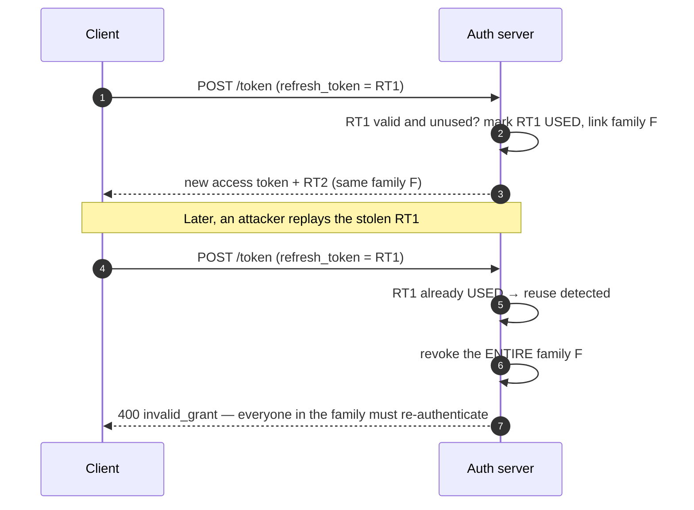

**Rules:**
1. Each refresh issues a **new** refresh token and invalidates the old one.
2. Track tokens as a **family** (one per login session).
3. A reused token means either the legitimate client or an attacker has a copy → **kill the whole family** and force re-auth. You cannot tell which party is the attacker, so you must assume compromise.
4. Handle the benign race: two tabs refreshing simultaneously. Give a short grace window (a few seconds) where the immediately-previous token returns the same new pair, or serialise refresh through a mutex/`BroadcastChannel` in the client.

### 6.3 Sliding vs absolute expiry

Both, always: a **sliding** idle window (each use extends it) *and* an **absolute** maximum lifetime that no amount of activity extends. Without the absolute cap, an active stolen token lives forever.

---

## 7. Where to Store the Token in a Browser

### 7.1 The threat matrix

| Storage | XSS steals it? | CSRF risk? | Verdict |
|---|---|---|---|
| `localStorage` | ☠️ Trivially — one line of JS | ❌ No | ❌ Avoid for credentials |
| `sessionStorage` | ☠️ Same | ❌ No | ❌ Same problem, shorter life |
| **JS memory (a module variable)** | ⚠️ Harder — no persistence to scrape, but a live XSS can still read it and make requests | ❌ No | ✅ Good for the **access** token |
| **`HttpOnly` cookie** | ✅ Cannot be *read* | ⚠️ **Yes** — needs `SameSite` and/or a CSRF token | 🏆 Best for the **refresh** token / session ID |

> ⭐ **Say this:** *"There is no XSS-safe browser storage. `HttpOnly` cookies don't make XSS harmless — an attacker can still *use* the cookie by making requests from the page — but they stop silent exfiltration of a long-lived credential to an attacker's server. So: access token in memory, refresh token in an `HttpOnly`, `Secure`, `SameSite` cookie, and a strict CSP as the actual XSS control."* (see [frontend-state-data.md](frontend-state-data.md) §11)

### 7.2 CSRF, precisely

CSRF exists **only** because the browser attaches cookies automatically. If the credential travels in an `Authorization` header that JS must add, there is nothing to forge.

| Defence | How it works |
|---|---|
| `SameSite=Lax` / `Strict` | Browser simply doesn't attach the cookie cross-site. First line of defence |
| **Synchroniser token** | Server-generated random token in the form/header, compared against the session |
| **Double-submit cookie** | Same random value in a JS-readable cookie *and* a header; attacker can't read the cookie to set the header |
| **Origin / Referer check** | Reject state-changing requests whose `Origin` isn't yours |
| Never mutate on `GET` | `GET` must be safe and idempotent — see [rest-api.md](rest-api.md) |

### 7.3 The BFF pattern (the modern recommendation)

For SPAs, the OAuth security best practice has moved toward **Backend-For-Frontend**: the browser never holds an OAuth token at all.

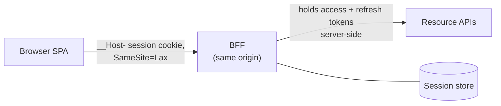

The browser gets a plain old session cookie; the BFF holds the tokens. You get cookie-grade XSS resistance *and* OAuth-grade API access. Cost: the BFF is now stateful-ish (it needs the session store) and is another hop.

---

## 8. OAuth 2.0 & OIDC

### 8.1 What each thing actually is (V5, V7)

| Thing | What it is | What it is **not** |
|---|---|---|
| **OAuth 2.0** | An **authorization** framework for *delegated access* — "let App X read my Google Calendar without giving it my password" | ❌ Not an authentication protocol |
| **OIDC** | An identity layer **on top of** OAuth 2.0; adds the **ID token** (a JWT about *who the user is*) and `/userinfo` | ❌ Not a replacement for OAuth |
| **JWT** | A token **format** | ❌ Not a protocol, not "an auth method" |
| **Bearer** | An authorization *scheme*: whoever holds the token gets access | ❌ Not a synonym for JWT |
| **SAML** | The older XML-based SSO protocol, still dominant in enterprise | — |
| **SSO** | The *outcome* (one login, many apps), achieved via OIDC or SAML | ❌ Not a protocol itself |

### 8.2 The four roles

| Role | Example |
|---|---|
| **Resource owner** | You, the user |
| **Client** | The third-party app that wants access |
| **Authorization server** | Google/Okta/Auth0 — authenticates the user, issues tokens |
| **Resource server** | The API holding the data (Google Calendar API) |

### 8.3 Authorization code flow with PKCE

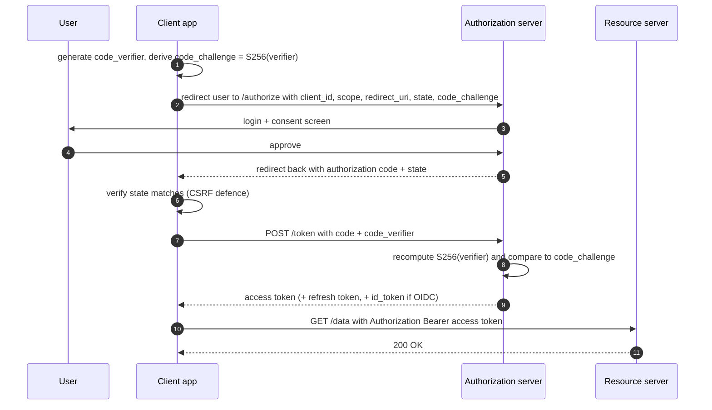

**Why each guard exists:**

| Guard | Stops |
|---|---|
| `state` | CSRF on the redirect — an attacker injecting their own code |
| **PKCE** (`code_verifier`/`code_challenge`) | A malicious app on the device intercepting the redirect and redeeming the code |
| Exact `redirect_uri` match | Open-redirect token theft |
| Short-lived, single-use code | Replay |

⚠️ **Dead patterns you should name as dead:** the **implicit flow** (token in the URL fragment — leaks via history, referrer, logs) and the **resource owner password credentials** grant (the app sees the password — defeats the entire point). OAuth 2.1 removes both and makes PKCE mandatory.

### 8.4 Scopes vs claims vs roles

| Concept | Answers | Lives in |
|---|---|---|
| **Scope** | *What may this **application** do on the user's behalf?* (`calendar.read`) | Access token |
| **Claim** | *What is true about this subject?* (`email`, `sub`, `tenant_id`) | ID token / access token |
| **Role / permission** | *What is this **user** allowed to do in **my** system?* | ⭐ Usually best resolved **server-side** at request time, not baked into a long-lived token — otherwise revoking a permission takes until the token expires |

> ⚠️ **The classic mistake:** sending the **ID token** to your API as the credential. The ID token's audience is the *client*, not the API. Use the **access token** for API calls; the API validates `aud` and rejects anything else.

---

## 9. Choosing an Auth Scheme

| Scheme | How it travels | Use when | Avoid when |
|---|---|---|---|
| **Basic** | `Authorization: Basic base64(user:pass)` | Internal tools behind TLS, quick scripts | Anything public — credentials are replayed on every request |
| **API key** | Header or query param | Server-to-server, identifying an *application*, usage metering | You need per-user identity or fine-grained expiry — keys carry no claims, so every check is a DB lookup |
| **Session cookie** | `Cookie:` | First-party browser apps 🏆 | Mobile, cross-domain, third-party |
| **Bearer JWT** | `Authorization: Bearer <jwt>` | Mobile, SPAs via BFF, service-to-service, many verifiers | You need instant revocation with no extra machinery |
| **OAuth 2.0 + OIDC** | Bearer, after a redirect flow | Third-party access, "Sign in with X", enterprise SSO | A single first-party app with its own user table — it's a lot of moving parts |
| **mTLS** | TLS client certificate | Service-to-service inside a mesh, high-assurance B2B | Consumer clients — certificate distribution is the hard part |
| **SSO (SAML/OIDC)** | Redirect + assertion | Enterprise customers who demand it | Small consumer products |

---

## 10. Server-Side vs Client-Side State Beyond Auth

Auth is the loudest example, but the interviewer is really testing a general instinct.

### 10.1 The taxonomy

| Kind of state | Example | Belongs | Why |
|---|---|---|---|
| **Identity / session** | who you are, roles | Server (or signed token) | Security-critical, must be revocable |
| **UI state** | sidebar open, active tab, scroll position | **Client** | Per-device, worthless to persist centrally |
| **Ephemeral form state** | half-typed comment | Client (+ `localStorage` draft) | Losing it on a server restart would be absurd |
| **Preferences** | theme, locale | **Both** — cookie for instant first paint, server row for cross-device | Cookie avoids a flash of wrong theme during SSR |
| **A/B bucket, feature flag** | `variant=B` | Cookie (signed) + server ruleset | Must be *sticky per user* and readable at the edge |
| **Shopping cart** | items, quantities | ⭐ Depends — see below | The canonical interview question |
| **Server cache of shared data** | product catalogue | Server + CDN | Shared across users; caching it once is the whole point |
| **Money, inventory, entitlements** | balance, stock, "is premium" | **Server, always** | ☠️ Never trust the client with anything a user would profit from editing |
| **Long-running job progress** | export 40% done | Server (DB row + queue) | Must survive instance death |

### 10.2 The shopping cart, worked

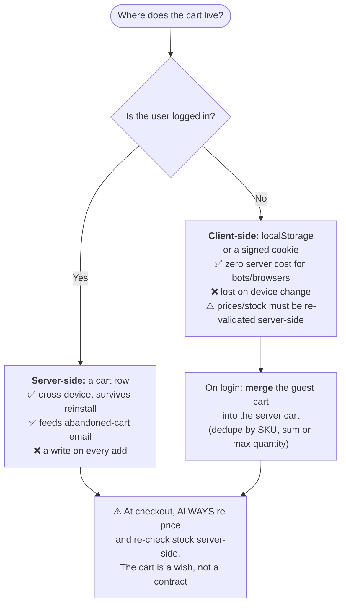

> ⭐ **The line:** *"Client-side cart for guests, server-side cart once you know who they are, merge on login — and regardless of where it lives, the price and stock are recomputed server-side at checkout. Client state is an **input** to a server decision, never the decision itself."*

### 10.3 Idempotency — the stateless system's memory

A stateless service still needs to not double-charge someone on a retry. The answer isn't session state; it's an **idempotency key** stored in a shared store: the client sends `Idempotency-Key: <uuid>`, the server records the key → response mapping, and a replay returns the stored response instead of re-executing. → [rest-api.md](rest-api.md).

---

## 11. When You Genuinely Need a Stateful Service

"Everything stateless" is a slogan too. Some systems are *inherently* stateful, and the senior answer is how you **contain** the statefulness rather than pretend it away.

| Stateful thing | Why it can't be stateless | How you scale it anyway |
|---|---|---|
| **WebSocket / SSE gateway** | The TCP connection *is* the state | Sticky by connection (trivially — it's one connection), a pub/sub fan-out layer behind it, and a **resume token** so reconnects restore position → [frontend-realtime-collab.md](frontend-realtime-collab.md) |
| **Databases** | State is the product | Sharding + replication + consensus → [databases.md](databases.md) |
| **Stream processors** (Flink/Kafka Streams) | Windowed aggregates in local RocksDB | Partition by key, **checkpoint** to durable storage, restore on failover |
| **Game servers / video calls** | Low-latency shared simulation | Room-to-server mapping via consistent hashing; a session directory |
| **Long-running uploads** | Bytes are on one box | Resumable protocols (`tus`, S3 multipart) — the *client* holds the offset |
| **Caches** | Data in RAM by definition | Consistent hashing; treat loss as a perf event, not a correctness one → [caching.md](caching.md) |

**The containment pattern:** push the statefulness into as few, as well-understood components as possible, make the mapping from key → instance **derivable** (consistent hashing, not a lookup table), and checkpoint anything you can't afford to recompute.

---

## 12. Capacity Math

### 12.1 Session store sizing

Assume **50 M DAU**, an average session lifetime of 14 days, 2 devices per user.

$$\text{sessions} = 50\text{M} \times 2 = 100\text{M}$$

At **500 bytes** per session record (user ID, roles, CSRF secret, device info, timestamps) plus Redis overhead (~100 B/key):

$$100\text{M} \times 600\,\text{B} \approx 60\ \text{GB}$$

That's a modest Redis cluster — say 6 shards × 16 GB with a replica each. Now the lookup rate: if those users generate **100 K RPS** at peak, that's 100 K Redis GETs/sec — comfortably one shard's worth of work, spread over six.

> ⭐ *"60 GB and 100 K lookups/sec is not scary — a single Redis node does 100 K+ ops/sec. The reason people abandon sessions is rarely capacity; it's cross-domain clients and not wanting every microservice to depend on one store."*

### 12.2 The JWT bandwidth tax

| | Opaque session cookie | JWT with roles + scopes |
|---|---|---|
| Size on the wire | ~64 B | ~800 B |
| At 100 K RPS | $100\text{K} \times 64\,\text{B} = 6.4$ MB/s ≈ **51 Mbps** | $100\text{K} \times 800\,\text{B} = 80$ MB/s ≈ **640 Mbps** |

Roughly **590 Mbps of pure header overhead**, in the *upload* direction, paid forever — and on a mobile connection every extra ~700 bytes can push the request past the initial congestion window. That's a concrete number to quote instead of "JWTs are bigger".

### 12.3 Per-request CPU

| Operation | Order of magnitude |
|---|---|
| Redis `GET` (same AZ) | ~0.2–1 ms (network-dominated) |
| HS256 verify | ~1–10 µs |
| RS256 verify | ~10–100 µs |
| RS256 **sign** | ~1 ms ⚠️ — sign rarely, verify often |
| bcrypt/argon2 password hash | **~100–300 ms by design** — this is why you don't hash a password on every request |

> ⭐ *"JWT verification saves a network hop, not CPU cycles. If your session store is in the same AZ, you're trading ~0.5 ms of latency for ~700 bytes on every request plus a revocation problem. State that trade explicitly rather than asserting one is 'faster'."*

---

## 13. Failure-Mode Catalogue

| # | Symptom | Root cause | Fix |
|---|---|---|---|
| 1 | Users logged out at random | Sticky sessions + autoscale-in / rolling deploy | External session store; stop relying on affinity |
| 2 | Everyone logged out at once | Session store failover with a cold cache, or signing-key rotation with no overlap | Replicated store with persistence; **key overlap window** via `kid` + JWKS |
| 3 | Login storm takes down the identity provider after an incident | 100 M clients all re-authenticating simultaneously | Jittered retry, staggered TTLs, rate limit `/login`, degrade gracefully |
| 4 | Banned user still has access for 30 minutes | JWT with no revocation path | Short TTL + `tokenVersion` or `jti` denylist |
| 5 | `431` / `400` after login for *some* users | Fat JWT in a cookie; users with many roles exceed the header limit | Keep roles server-side; put an ID in the token, resolve permissions at request time |
| 6 | Account takeover from one XSS | Token in `localStorage` | `HttpOnly` cookie for the long-lived credential + CSP |
| 7 | Attacker performs actions as a logged-in user from another site | Missing `SameSite` / CSRF token | `SameSite=Lax` + synchroniser token + `Origin` check |
| 8 | A low-privilege service's token works on the payments API | `aud` never validated | Validate `iss` and `aud`; scope tokens per audience |
| 9 | Forged tokens accepted | `alg: none` or RS256→HS256 confusion | Pin the algorithm in the verifier |
| 10 | Session survives "log out everywhere" | Only the current session deleted | Index sessions by user ID; delete the set |
| 11 | Two tabs fight over refresh; user gets logged out | Rotation + reuse detection with no grace window | Short grace period, or serialise refresh via a lock/`BroadcastChannel` |
| 12 | Session fixation | ID not regenerated at login | Regenerate on every privilege change |
| 13 | Clock skew rejects valid tokens | Strict `exp` comparison across machines | Allow ~60 s leeway; run NTP |
| 14 | Cart/price tampered | Client-side state trusted at checkout | Re-price and re-check stock server-side |
| 15 | Cookies sent to a compromised subdomain | `Domain=example.com` | Host-only cookies + `__Host-` prefix |
| 16 | Accounts compromised from a **shared link** | Session ID in the URL — leaked via `Referer`, history, access logs | Credentials never travel in a URL; cookie or `Authorization` header only |
| 17 | Memory grows until the pod OOMs; users logged out on every deploy | `express-session` silently fell back to its in-memory `MemoryStore` | Always configure an explicit external `store` |
| 18 | Millions of junk keys in Redis | `saveUninitialized: true` — a session per crawler | `saveUninitialized: false`; only persist after login |
| 19 | Redis write amplification (one write per request) | `resave: true` | `resave: false` + `rolling` only when the TTL actually needs extending |
| 20 | "We're stateless" but the wizard breaks behind the LB | Multi-step **application state** kept server-side per instance | Put step state in the client (signed) or in the shared store — §1.4 |

---

## 14. What to Say in the Interview

**The 45-second opener when asked "how do you handle user sessions at scale?"**

> *"First I'd make the app tier stateless — no session in process memory, no uploads on local disk — so any instance can serve any request and I can lose one to a deploy or a spot reclaim without logging anyone out. Then the question is only **where** identity lives. For a first-party web app I'd default to an opaque session ID in an `HttpOnly`, `Secure`, `SameSite=Lax`, `__Host-` cookie, with the session record in Redis keyed by user ID so I can support 'log out everywhere'. For mobile and service-to-service I'd issue a short-lived JWT signed with RS256, verified locally against a JWKS endpoint, paired with a rotating refresh token that's stateful and therefore revocable. That hybrid gives me instant revocation at the edge and zero shared state inside the mesh."*

**Seven sentences that signal seniority:**

1. *"Cookies are a transport; sessions and tokens are strategies. You can put either one in a cookie."*
2. *"Stateless means the **instance** is stateless. The system still has state — I've just decided where it lives."*
3. *"REST's stateless constraint is about **session** state, not resource state — the database is not a REST violation."*
4. *"A JWT is signed, not encrypted — the payload is public. Nothing sensitive goes in it."*
5. *"The moment I add a denylist so JWTs can be revoked, I've rebuilt sessions — the difference is that this lookup can fail open and only covers revoked tokens."*
6. *"Sticky sessions are a compatibility feature for stateful apps, not a scaling strategy — they fight autoscaling and rolling deploys."*
7. *"Permissions get resolved server-side at request time; only identity goes in the token. Otherwise revoking access takes until the token expires."*

**Three questions to ask the interviewer:** Do we need revocation within seconds? Are there third-party or mobile clients? Is there an existing identity provider (Okta/Cognito/Auth0) we must integrate with? Each one flips the answer.

**What a weak answer sounds like:** *"I'd use JWTs because they're stateless and scale better."* — no mention of revocation, size, key rotation, or the client type.

---

## 15. Rapid-Fire Q&A

| Question | Answer |
|---|---|
| Why is HTTP called stateless? | Each request is processed as an isolated transaction; the server keeps nothing between two requests. Cookies were added later specifically to put state back. |
| If HTTP is stateless, how am I still logged in? | You aren't — the *protocol* isn't. A credential is re-sent on every request (cookie or header), and the server re-establishes who you are each time. |
| Is TCP stateless? | No — TCP is stateful (sequence numbers, window, connection state). So is TLS. HTTP is the stateless layer on top. |
| REST is stateless — so how can you have sessions at all? | Distinguish **application/session state** (must not live on the server between requests) from **resource state** (the database — completely fine). |
| Does a database lookup to validate a token break statelessness? | No. Statelessness is about the server not *remembering the previous request*, not about it never *looking anything up*. |
| Is a cookie an alternative to a token? | No. A cookie is *how* a credential travels; a session ID or a JWT is *what* travels. |
| Does "token-based" mean "stateless"? | No. An opaque OAuth access token is a bearer token validated by a lookup (introspection). Only a signed, self-contained token is stateless. |
| Why not put the session ID in the URL? | It leaks via `Referer`, browser history, bookmarks, access logs and shared links — a pasted URL becomes a login. |
| Is a JWT encrypted? | No — base64url encoded and **signed**. Anyone can read the payload. JWE encrypts, but usually an opaque token is simpler. |
| Why is `HttpOnly` important? | XSS can't read the cookie, so a long-lived credential can't be silently exfiltrated. It does not make XSS harmless. |
| Cookie vs `localStorage` for a token? | Cookie (`HttpOnly`) for the long-lived credential; memory for the short-lived access token. Never `localStorage`. |
| What does `SameSite=Lax` do? | Sends the cookie on top-level GET navigations only, blocking most CSRF. It's the modern browser default. |
| How do you revoke a JWT? | Short TTL + refresh, a `jti` denylist, or a per-user `tokenVersion`. There is no native way. |
| Sessions or JWT for a first-party web app? | Sessions — smaller, revocable, private, harder to misconfigure. |
| Why do refresh tokens exist? | So the frequently-transmitted credential is short-lived while the long-lived one is rarely sent and is revocable. |
| What is refresh-token reuse detection? | A used refresh token being presented again implies theft → revoke the entire token family. |
| Difference between OAuth 2 and OIDC? | OAuth 2 = delegated **authorization**; OIDC adds an identity layer (ID token) on top for **authentication**. |
| Why is the implicit flow deprecated? | Tokens land in the URL fragment — leaked via history, referrers, and logs. Use authorization code + PKCE. |
| What does PKCE prevent? | A malicious app intercepting the redirect and redeeming the authorization code. |
| Can I send the ID token to my API? | No. Its `aud` is the client. Use the access token. |
| HS256 or RS256? | RS256/EdDSA once more than one service verifies — HMAC verifiers can also forge. |
| What is the `kid` header for? | Selecting the signing key from JWKS, which is what makes key rotation possible. |
| What's the `aud` claim for? | Stopping a token issued for one service being replayed at another. |
| Why are sticky sessions bad? | They break autoscaling and rolling deploys, skew load, and make instance death a user-visible logout. |
| Are sticky sessions ever right? | Yes — WebSockets (the connection *is* the affinity) and legacy apps you can't refactor yet. |
| What breaks if Redis (session store) dies? | Nobody can log in or stay logged in — it's a tier-0 dependency. Replicate it and plan the degradation. |
| Where should the shopping cart live? | Client for guests, server once logged in, merged on login, re-priced server-side at checkout. |
| How does a stateless service avoid double-charging on a retry? | Idempotency keys in a shared store — not session state. |
| What is the "phantom token" pattern? | Opaque token on the internet, swapped at the gateway for a short-lived JWT used internally. |
| Is `sessionStorage` per tab or per browser? | Per tab (per origin). `localStorage` is shared across tabs. |
| What is session fixation and the fix? | Reusing the pre-login session ID; regenerate the ID on every privilege change. |
| Why two expiry clocks? | Idle timeout limits abandoned sessions; absolute lifetime caps a *stolen but actively used* credential. |
| Bearer vs JWT? | Bearer is the scheme ("holder gets access"); JWT is the most common bearer token format. |
| What's the most common JWT bug in real code? | Calling `verify()` without pinning `algorithms` — the library then trusts the attacker-supplied `alg` header. |
| How do microservices share user identity without a shared session store? | A central identity provider issues a signed JWT; each service verifies the signature locally against the IdP's public keys (JWKS). |

---

## 16. Summary — The Memory Trick

**The hotel analogy — it covers the whole topic:**

| Hotel | System |
|---|---|
| **Room key card** you carry | The credential |
| **The lanyard/pocket** you keep it in | The **cookie** (transport) |
| Key card is a **blank card**; reception looks up room 402 in their system | **Session** — opaque ID + server lookup. Reception can deactivate it instantly |
| Key card has the **room number and checkout date embossed and holographically sealed** on it; any door reads it directly, no phone call to reception | **JWT** — self-contained, locally verified, fast… but you can't un-emboss it if it's stolen |
| The card **stops working at checkout time** printed on it | `exp` — short TTL is the only built-in defence |
| Reception can **reissue all cards** after a security incident | Key rotation / `tokenVersion` |
| **Any receptionist** at the desk can help you — they share one system | **Stateless service** + shared store |
| "Only Raj can help you, he has your paperwork on his desk" | **Sticky session** — and Raj went home |

**One line for each idea:**

- **HTTP is stateless by design** — every mechanism here exists to fake a conversation over a protocol with no memory.
- **Stateless** = the *instance* holds nothing; the *system* still has state, you've just chosen where.
- **REST bans session state on the server, not resource state.** The database was never the problem.
- **Cookie** = the envelope. **Session** = a pointer the server can tear up. **Token** = the letter itself, signed.
- **Session ⇒ revocable but shared-store-dependent. JWT ⇒ independent but hard to revoke.** Everything else is detail.
- **Short access token + rotating refresh token** is how you buy both.
- **Never trust client state you didn't sign, and never sign a secret into something the client can read.**
