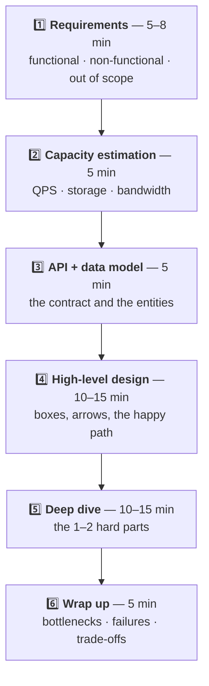
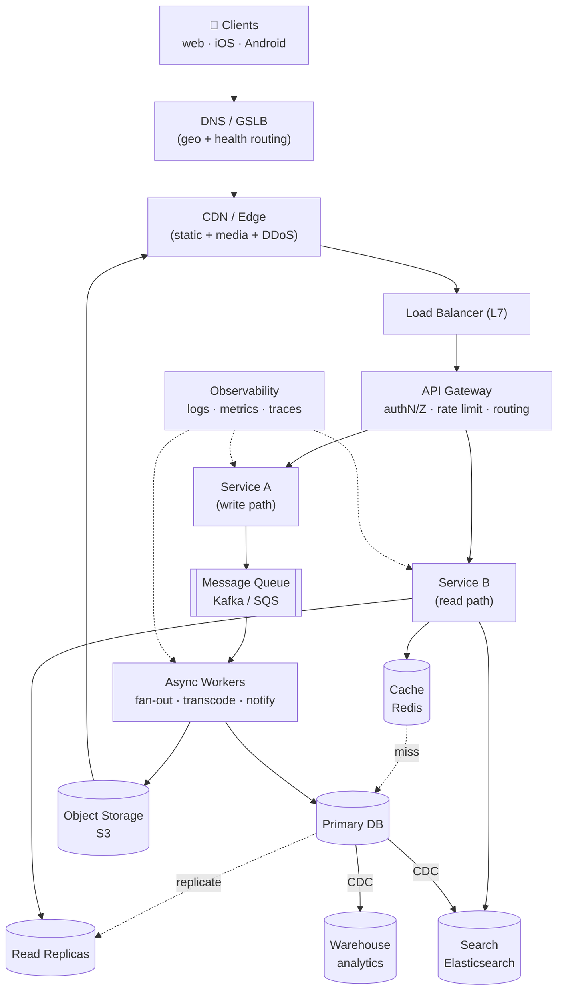

# The System Design Interview Playbook

> **Purpose:** the framework, the numbers, the trade-offs, and a problem bank — everything you use *during* the 45 minutes.
> **Sources:** [awesome-system-design-resources](https://github.com/ashishps1/awesome-system-design-resources) · AlgoMaster answering framework · Hello Interview · ByteByteGo · Alex Xu Vol. 1 & 2
> **Companions:** [README.md](README.md) · [system-design-course-fcc.md](system-design-course-fcc.md) · [low-level-design.md](low-level-design.md)

---

## Syllabus Coverage Index

| # | Topic | Section |
|---|---|---|
| 1 | **The 6-step framework** with a time budget | [§1](#1-the-framework) |
| 2 | Requirement gathering — the questions to ask | [§2](#2-step-1--requirements-5-8-min) |
| 3 | **Back-of-the-envelope estimation** with worked math | [§3](#3-step-2--capacity-estimation-5-min) |
| 4 | API design & data model | [§4](#4-step-3--api--data-model-5-min) |
| 5 | High-level design — the reference architecture | [§5](#5-step-4--high-level-design-10-15-min) |
| 6 | Deep dive — where to go deep, and how | [§6](#6-step-5--deep-dive-10-15-min) |
| 7 | Wrap-up — bottlenecks, failure modes, trade-offs | [§7](#7-step-6--wrap-up-5-min) |
| 8 | **Numbers to memorise** | [§8](#8-numbers-to-memorise) |
| 9 | **The top 20 trade-offs** | [§9](#9-the-top-20-trade-offs) |
| 10 | **Problem bank** with the "twist" in each one | [§10](#10-problem-bank--and-the-twist-in-each) |
| 11 | Reusable building blocks (memorise these mini-designs) | [§11](#11-reusable-building-blocks) |
| 12 | Weak vs strong answers, side by side | [§12](#12-weak-vs-strong-answer) |
| 13 | Red flags & recovery lines | [§13](#13-red-flags--recovery-lines) |
| ★ | Level calibration: what each level is graded on | [§14](#14-level-calibration) |

---

## 1. The Framework



> ⭐ **The three meta-rules that matter more than the content:**
> 1. **Drive the conversation.** Say what you're doing next: *"I'll spend two minutes on requirements, then estimate scale, then draw the high level."* Silence and aimlessness are the top two failure modes.
> 2. **Think out loud, and justify every box.** A component with no stated reason is worth zero.
> 3. **Name the trade-off every time you choose.** *"I'm picking X over Y; the cost is Z, and I accept it because…"*

---

## 2. Step 1 — Requirements (5–8 min)

### Functional: what must it do?

Get to a **short, prioritised list**, then confirm: *"So the core is post, follow, and read the feed. Search and DMs are out of scope — agreed?"*

⭐ **Scoping down is a positive signal.** A candidate who tries to design all of Twitter in 45 minutes designs nothing.

### Non-functional: what must it *be*?

| Dimension | Ask | Why it changes the design |
|---|---|---|
| **Scale** | DAU? QPS? read:write ratio? | Read-heavy → caching + replicas. Write-heavy → sharding + queues |
| **Latency** | p99 target? | <100 ms rules out synchronous cross-region calls |
| **Availability** | How many nines? Can we serve stale? | 99.99% → multi-AZ, no single points of failure |
| **Consistency** | Strong or eventual? For *which* operation? | ⭐ Payments strong, like-counts eventual |
| **Durability** | Can we lose data? | Drives replication factor and backup strategy |
| **Geography** | Global or one region? | Global → CDN + GSLB + regional replicas |
| **Security/compliance** | PII? GDPR? data residency? | Affects storage location and encryption |

### The questions that make you look senior ⭐

1. *"What's the read:write ratio?"* — the single most design-shaping number.
2. *"Which operations need strong consistency and which can be eventual?"*
3. *"What's the tolerable staleness for the feed — one second, or one minute?"*
4. *"Is traffic uniform or spiky? Any predictable peak (a sale, a match, market open)?"*
5. *"Is the access pattern skewed — do we have celebrities/hot keys?"*
6. *"What matters more here: cost or latency?"*

Then **write the assumptions down** and move on. Don't spend 20 minutes here.

---

## 3. Step 2 — Capacity Estimation (5 min)

> **The point isn't precision — it's showing that your design is sized for reality.** Round aggressively and say so.

### 3.1 The chain

```
DAU → requests/user/day → QPS → peak QPS → servers
                            ↓
                    bytes/request → storage/day → storage/5yr
                            ↓
                       bandwidth
```

### 3.2 The shortcuts

| Shortcut | Value |
|---|---|
| **Seconds per day** | ~**86,400** ≈ **10⁵** |
| **QPS from daily count** | `daily ÷ 10⁵` (e.g. 100M/day → **1,000 QPS**) |
| **Peak factor** | **2–3×** average (spikier for social/live events) |
| 1 million seconds | ~12 days |
| 1 billion seconds | ~32 years |
| Bytes | 1 char ≈ 1 B · UUID ≈ 16 B · timestamp ≈ 8 B · tweet ≈ 300 B · thumbnail ≈ 50 KB · photo ≈ 2 MB · 1 min 1080p ≈ 50 MB |

### 3.3 Worked example — Twitter-scale feed

```
Users
  DAU                       = 200,000,000
  Reads:  each user opens the feed 20×/day
  Writes: each user posts 0.1 tweets/day

READS
  200M × 20        = 4,000,000,000 reads/day
  ÷ 10⁵            = 40,000 QPS average
  × 3 (peak)       = 120,000 QPS peak        ← the number that drives the design

WRITES
  200M × 0.1       = 20,000,000 tweets/day
  ÷ 10⁵            = 200 QPS average
  × 3              = 600 QPS peak

READ:WRITE RATIO   = 200 : 1                 ⭐ heavily read-dominated
  ⇒ aggressive caching, read replicas, precomputed feeds (fan-out on WRITE)

STORAGE
  tweet ≈ 300 B text + 200 B metadata ≈ 500 B
  20M/day × 500 B  = 10 GB/day of text        (trivial)
  media: 10% of tweets have a 2 MB image
  2M × 2 MB        = 4 TB/day                 ⭐ media dominates by ~400×
  5 years          ≈ 7.3 PB                   ⇒ object storage + CDN, never a DB

BANDWIDTH
  read egress: 120,000 QPS × 20 KB/response ≈ 2.4 GB/s ≈ 19 Gbps
  ⇒ CDN is mandatory; origin must not serve this

CACHE SIZING (80/20 rule)
  20% of tweets serve 80% of reads
  hot set: 20% of ~30 days of tweets ≈ 600M tweets × 500 B ≈ 300 GB
  ⇒ ~6 Redis nodes at 64 GB usable, replicated ⇒ 12 nodes

SERVERS
  assume 1,000 QPS per app server (measure in real life!)
  120,000 ÷ 1,000  = 120 servers
  + 30% headroom   ≈ 160 servers across ≥3 AZs
```

> ⭐ **The one-line conclusion is what earns the credit:** *"200:1 read:write with media dominating storage. That tells me: precompute feeds on write, cache aggressively, put all media on object storage behind a CDN, and keep the write path simple because 600 QPS of writes is nothing."*

### 3.4 Sanity anchors

| Thing | Rough capacity |
|---|---|
| One modern app server | 1,000–10,000 QPS (simple), 100s (heavy) |
| One Postgres node | ~5,000–20,000 simple reads/s; ~1,000–5,000 writes/s |
| One Redis node | ~100,000 ops/s |
| One Kafka broker | ~100 MB/s+ |
| One 64 GB cache node | ~50 GB usable |
| Cross-AZ RTT | ~1 ms · Cross-region (US↔EU) ~80 ms · US↔India ~200 ms |

---

## 4. Step 3 — API + Data Model (5 min)

**API first** — it pins down the contract and reveals the entities.

```http
POST   /v1/tweets                     { text, mediaIds[] }        → 201 { tweetId }
GET    /v1/users/{id}/feed?cursor=&limit=20                       → 200 { items[], nextCursor }
POST   /v1/users/{id}/follow                                       → 204
DELETE /v1/tweets/{id}                                             → 204
```

⭐ **Three things to say:**
1. **Cursor pagination, not offset** — offset drifts and `OFFSET 100000` is a full scan. → [rest-api.md](rest-api.md)
2. **Idempotency key on writes** — clients retry; you must not create duplicate tweets/payments.
3. **Auth is a bearer token; the user ID comes from the token, not the path** — otherwise it's an IDOR vulnerability.

**Data model:** name the entities, the primary key, **and the shard key**.

```
users(user_id PK, handle, name, created_at)
tweets(tweet_id PK [Snowflake: time-sortable], user_id, text, media_url, created_at)
        └─ shard by user_id (all of a user's tweets together)
follows(follower_id, followee_id)   ← two tables/indexes: by follower AND by followee
feed_cache(user_id → [tweet_id...]) ← Redis list, precomputed
```

> ⭐ **Snowflake IDs:** `timestamp | datacenter | machine | sequence`. Globally unique **and roughly time-sortable**, generated without coordination. Say why you're not using an auto-increment (single point of coordination) or a random UUID (destroys index locality and can't be sorted by time).

---

## 5. Step 4 — High-Level Design (10–15 min)

### The reference architecture — learn to draw this in 90 seconds



**Order to build it in:**
1. Client → LB → service → DB. **The simplest thing that works.**
2. Add a **cache** where reads are hot.
3. Add a **queue** where work is slow or spiky.
4. Add **replicas / sharding** where the DB is the bottleneck.
5. Add a **CDN** for static and media.
6. Add **specialised stores** (search, analytics) fed by CDC.

> ⭐ **Start simple on purpose and say so:** *"I'll start with the simplest architecture that satisfies the requirements, then evolve it as I identify bottlenecks — that way each component I add has a reason."* This is a much stronger opening than drawing 15 boxes immediately.

---

## 6. Step 5 — Deep Dive (10–15 min)

**Pick the genuinely hard part.** Ask: *"Would you like me to go deeper on the feed generation, or on how we handle celebrity accounts?"* Letting the interviewer steer is smart, not weak.

### The classic deep dives, with the answer

<details open>
<summary><b>Feed generation: fan-out on write vs read</b></summary>

| | **Fan-out on WRITE** (push) | **Fan-out on READ** (pull) |
|---|---|---|
| On post | Push the tweet ID into every follower's precomputed feed | Do nothing |
| On read | Read one precomputed list — **O(1), very fast** | Query all followees and merge — slow |
| Cost | Write amplification = follower count | Read cost per request |
| Breaks when | ⚠️ A celebrity with 100M followers = 100M writes per tweet | Feed reads dominate (200:1 here) |

> ⭐ **The hybrid is the answer:** *"Fan-out on write for normal users (fast reads, cheap writes), and for accounts above a threshold — say 100k followers — skip the fan-out and merge their tweets in at read time. So a user's feed is 'my precomputed list' **merged with** 'the few celebrities I follow, read live'. That bounds both the write amplification and the read latency."*

</details>

<details>
<summary><b>Hot key / celebrity problem</b></summary>

Dedicated cache node or in-process L1 for known hot keys · **key splitting** (`celeb:123#1..N`) · read replicas for that shard · consistent hashing **with bounded loads** · request coalescing so 10,000 concurrent misses become 1 DB read. → [caching.md](caching.md) §13.4

</details>

<details>
<summary><b>Preventing double booking / double charging</b></summary>

**Idempotency key** stored with the response · a **unique constraint** as the database backstop · **optimistic locking** (version column) or `SELECT … FOR UPDATE` on the hot row · a **temporary hold with a TTL** so the seat isn't locked for the whole checkout · a sweeper to expire abandoned holds. → [concurrency.md](concurrency.md) §8

</details>

<details>
<summary><b>Real-time delivery at scale</b></summary>

WebSocket or SSE · L4/sticky routing because connections are stateful · a **Redis pub/sub backplane** so any server can reach any connected user · a presence/connection registry (`user → server`) · offline users fall back to push notifications · reconnect with **jittered backoff** so a deploy doesn't cause a synchronised reconnect storm. → [networking.md](networking.md) §7

</details>

<details>
<summary><b>Rate limiting</b></summary>

**Token bucket** (allows bursts, the usual choice) vs sliding-window log (exact, memory-heavy) vs sliding-window counter (good compromise) · distributed via Redis + a Lua script for atomicity · respond `429` with `Retry-After` and `X-RateLimit-*` headers · fail **open** if Redis is down (availability over strictness). → [rest-api.md](rest-api.md)

</details>

<details>
<summary><b>Search</b></summary>

Elasticsearch fed by **CDC** (never dual-write) · inverted index · typeahead via a trie or ES completion suggester with a cached top-k per prefix · relevance = text score + recency + popularity · eventual consistency between the primary DB and the index is acceptable and should be stated. → [databases.md](databases.md) §10

</details>

<details>
<summary><b>Unique ID generation</b></summary>

**Snowflake** (time-sortable, coordination-free) · DB ticket server with ranges (simple, SPOF) · UUIDv7 (time-ordered UUID, index-friendly, no infrastructure) · plain UUIDv4 only when ordering doesn't matter — it fragments B-tree indexes.

</details>

---

## 7. Step 6 — Wrap Up (5 min)

Cover these four, briefly and explicitly:

| Topic | Say |
|---|---|
| **Bottleneck** | *"The first thing to break at 10× is the fan-out worker fleet, because write amplification scales with follower count. I'd shard workers by user and monitor queue lag."* |
| **Failure modes** | *"If Redis dies we fall back to the DB with load shedding, not a naive stampede. If a region fails, GSLB drains it. If the queue backs up we shed low-priority work."* |
| **Trade-offs made** | *"I chose eventual consistency for the feed to get O(1) reads. The cost is that a new tweet may take a second to appear, which the product tolerates."* |
| **What I'd do next** | *"With more time: multi-region, cost optimisation on media storage tiers, and an A/B framework for ranking."* |

> ⭐ **End with a numbered summary.** *"So to recap: three tiers behind a CDN, hybrid fan-out for feeds, Redis for hot reads, Kafka for async work, media on S3, search via CDC into Elasticsearch. The main trade-off is eventual consistency in the feed."*

---

## 8. Numbers to Memorise

### Latency (Jeff Dean's numbers, scaled)

| Operation | Time | Human scale (1 ns = 1 s) |
|---|---|---|
| L1 cache reference | 0.5 ns | 0.5 s |
| Branch mispredict | 5 ns | 5 s |
| L2 cache reference | 7 ns | 7 s |
| Mutex lock/unlock | 25 ns | 25 s |
| **Main memory reference** | **100 ns** | 1.7 min |
| Compress 1 KB (Snappy) | 3 µs | 50 min |
| Send 1 KB over 1 Gbps | 10 µs | 2.8 h |
| **SSD random read** | **150 µs** | 1.7 days |
| Read 1 MB sequentially from memory | 250 µs | 2.9 days |
| Round trip within a datacenter | **500 µs** | 5.8 days |
| Read 1 MB sequentially from SSD | 1 ms | 11.6 days |
| **Disk seek (HDD)** | **10 ms** | 4 months |
| Read 1 MB sequentially from HDD | 20 ms | 7.8 months |
| **Round trip CA → Netherlands** | **150 ms** | 4.8 years |

**The three orders of magnitude that matter:** memory **100 ns** → SSD **150 µs** (1,500×) → cross-continent **150 ms** (1,500,000×).
→ [latency.md](latency.md)

### Availability

| Nines | Downtime/year | Downtime/month | Implies |
|---|---|---|---|
| 99% | 3.65 days | 7.2 h | Single server |
| 99.9% | 8.76 h | 43 min | Redundancy + monitoring |
| 99.99% | 52.6 min | 4.3 min | Multi-AZ, automated failover |
| 99.999% | 5.26 min | 26 s | Multi-region, no human in the loop |

⚠️ **Dependencies multiply:** a service depending on 5 components each at 99.9% has $0.999^5 = 99.5\%$ availability. **Redundancy adds nines; dependencies remove them.**

### Storage & throughput

| | Value |
|---|---|
| 1 KB / 1 MB / 1 GB / 1 TB / 1 PB | 10³ / 10⁶ / 10⁹ / 10¹² / 10¹⁵ bytes |
| 1 Gbps | ~125 MB/s |
| Chars in a tweet / SMS | 280 / 160 |
| A 1-hour 1080p video | ~2–4 GB |

---

## 9. The Top 20 Trade-offs

| # | Trade-off | When to pick which |
|---|---|---|
| 1 | **Vertical vs horizontal scaling** | Vertical until the ceiling or the SPOF hurts; horizontal for HA and unbounded growth |
| 2 | **SQL vs NoSQL** | SQL for relationships and invariants; NoSQL for known access patterns at write scale |
| 3 | **Strong vs eventual consistency** | Strong for money/inventory/auth; eventual for feeds, counts, recommendations |
| 4 | **Normalisation vs denormalisation** | Normalise for write correctness; denormalise for read speed. Denormalised data needs a sync strategy |
| 5 | **Latency vs throughput** | Batching raises throughput and *raises* latency. Pick per endpoint |
| 6 | **Latency vs consistency (PACELC)** | Even with no partition, a quorum read costs latency |
| 7 | **Sync vs async communication** | Sync when the caller needs the answer; async for anything slow, spiky or fan-out |
| 8 | **Push vs pull** | Push (fan-out on write) for read-heavy; pull for write-heavy or huge fan-out |
| 9 | **Stateful vs stateless services** | Stateless always, unless you're holding connections. State belongs in a data store |
| 10 | **Read-through vs write-through cache** | Read-through/cache-aside for read-heavy; write-through when reads must never miss after a write |
| 11 | **Batch vs stream processing** | Batch for cheap, complete, reprocessable analytics; stream for seconds-fresh reactions |
| 12 | **Monolith vs microservices** | Modular monolith for small teams; microservices when independent deployment is the bottleneck |
| 13 | **REST vs GraphQL vs gRPC** | REST/GraphQL at the edge, gRPC internally → [restvsgraphqlVsRPC.md](restvsgraphqlVsRPC.md) |
| 14 | **L4 vs L7 load balancing** | L4 for throughput/non-HTTP/long-lived; L7 for routing intelligence → [load-balancer.md](load-balancer.md) |
| 15 | **Long polling vs WebSocket vs SSE** | SSE for one-way push; WebSocket for bidirectional; polling as a fallback |
| 16 | **Optimistic vs pessimistic locking** | Optimistic for low contention; pessimistic for hot rows |
| 17 | **CP vs AP** | CP for correctness-critical writes; AP for availability-critical reads. Choose **per operation** |
| 18 | **Cost vs performance** | Always ask. Multi-region active-active is often 3× the cost for a requirement nobody has |
| 19 | **Build vs buy** | Buy the undifferentiated (queues, search, auth); build the differentiating |
| 20 | **Security vs usability** | Rate limits, MFA and short token TTLs all add friction — state where the line is |

---

## 10. Problem Bank — and the twist in each

> Every problem has **one core difficulty**. Learn the twist and you can reason about the rest.

### 🟢 Easy

| Problem | The twist |
|---|---|
| **URL shortener (TinyURL)** | Key generation: base62 of a counter vs hash + collision handling. Read:write ~100:1 → cache everything, and the "custom alias" uniqueness check |
| **Pastebin** | Same as above + expiry + object storage for large bodies |
| **Rate limiter** | Distributed counters must be **atomic** (Redis Lua) and the algorithm choice (token bucket vs sliding window) |
| **Key-value store** | Consistent hashing + replication + quorum (it's Dynamo) |
| **Distributed cache** | Eviction, sharding, and what happens on a cold start |
| **Load balancer** | Health checks and how the LB itself is made highly available |
| **CDN** | Cache key design, invalidation, and origin shielding |
| **Unique ID generator** | Snowflake: coordination-free **and** time-sortable |
| **Autocomplete / typeahead** | Trie + cached top-k per prefix; update the trie offline, not per keystroke |
| **Vending machine / parking garage** | Usually an **LLD** question in disguise → [low-level-design.md](low-level-design.md) |

### 🟡 Medium

| Problem | The twist |
|---|---|
| **Twitter / Facebook feed** | ⭐ **Hybrid fan-out** — celebrities break fan-out-on-write |
| **Instagram** | Media pipeline: presigned upload → S3 → async transcode → CDN. Never proxy bytes through your API |
| **WhatsApp / chat** | Connection registry (`user → server`) + pub/sub backplane + offline message queue + delivery receipts + ordering per conversation |
| **Notification service** | Fan-out, per-channel providers, **idempotency**, user preferences, quiet hours, retry with DLQ |
| **Spotify / streaming** | Adaptive bitrate (HLS/DASH), chunked media on CDN, prefetching, licence/DRM |
| **YouTube** | Transcode into a ladder of resolutions asynchronously; the whole design is a pipeline |
| **Web crawler** | **Politeness** (per-domain rate limits), URL frontier prioritisation, dedupe with bloom filters, trap detection |
| **Job scheduler** | Exactly-once-ish execution, leader election, missed-run catch-up, **at-least-once + idempotent jobs** |
| **Message queue (Kafka)** | Partitioning, replication, offset management, consumer rebalancing |
| **Payment system** | ⭐ **Idempotency + ledger (double-entry) + reconciliation**. Never mutate a balance without an immutable ledger entry |
| **Digital wallet** | Same, plus atomic transfers and holds |
| **Ticket booking (BookMyShow)** | ⭐ Seat **holds with TTL** under high concurrency; the flash-sale spike |
| **E-commerce (Amazon)** | Inventory reservation, cart, order saga, search, recommendations |
| **Airbnb / booking** | Availability search across date ranges + double-booking prevention + geo search |
| **Analytics / metrics platform** | Ingest at scale → stream aggregate → time-series store → pre-rolled-up queries |
| **Online code editor** | Sandboxed execution, resource limits, queueing, result streaming |

### 🔴 Hard

| Problem | The twist |
|---|---|
| **Uber / ride-sharing** | ⭐ **Geospatial indexing** (geohash / S2 / QuadTree) + driver location updates at huge write rates + matching + surge |
| **Google Maps** | Graph partitioning + precomputed contraction hierarchies + tiles + live traffic |
| **Google Docs** | ⭐ **OT or CRDT** for concurrent editing + presence + cursor sync + version history |
| **Dropbox / file sync** | Chunking + content-addressed dedupe + delta sync + conflict resolution + metadata service |
| **Netflix** | Open Connect appliances inside ISPs, pre-positioning content, ABR, encoding ladder |
| **S3 / object storage** | Erasure coding, durability math (11 nines), metadata at scale, multipart upload |
| **Distributed locking service** | Consensus (Raft) + sessions + ephemeral nodes + fencing tokens |
| **Zoom / video conferencing** | SFU vs MCU vs mesh, WebRTC, jitter buffers, simulcast |
| **Yelp / proximity service** | Geo index + ranking + read-heavy caching |
| **Code deployment system** | Artifact distribution (P2P/BitTorrent-style), canary orchestration, rollback |
| **Distributed web crawler at scale** | Everything from the medium version × 1000, plus frontier sharding |
| **Ad click aggregation** | Exactly-once-ish counting, late/duplicate events, watermarks, reprocessing |

---

## 11. Reusable Building Blocks

> ⭐ **These sub-designs appear in 80% of problems. Memorise them and you can assemble most answers.**

| Block | The 30-second design |
|---|---|
| **Media upload** | Client asks the API for a **presigned S3 URL** → uploads directly to S3 (bytes never touch your servers) → S3 event → queue → transcode workers → CDN. Metadata row in the DB |
| **Counter at scale** | Don't `UPDATE … SET count = count + 1`. **Sharded counters** or a stream aggregation (Kafka → Flink) with periodic flushes; approximate with HyperLogLog for uniques |
| **Feed** | Precompute per-user lists in Redis (fan-out on write) + read-time merge for celebrities |
| **Search** | Primary DB → CDC → Elasticsearch. Eventual consistency, stated up front |
| **Notification** | API → queue per channel → provider adapters → status callbacks → DLQ + retry |
| **Geo proximity** | Geohash/S2 cell as the shard & index key; query the cell + its 8 neighbours; refine by exact distance |
| **Leaderboard** | Redis **sorted set** (`ZADD`/`ZREVRANGE`); shard by time window; snapshot for all-time |
| **Presence / online status** | Redis key with a TTL refreshed by heartbeat; absence = offline. Fan-out changes via pub/sub |
| **Idempotent write** | `idempotency_key` unique index; store the response; replay returns the stored response |
| **Distributed transaction** | Saga with compensations + transactional outbox |
| **Ledger** | Append-only double-entry entries; balances are a **projection**, never the source of truth |
| **Async job** | `202 Accepted` + a job ID → poll `GET /jobs/{id}` or webhook on completion |
| **Multi-tenant isolation** | Tenant ID in every key + row-level security; shuffle-sharding to bound blast radius |

---

## 12. Weak vs Strong Answer

| Question | ❌ Weak | ✅ Strong |
|---|---|---|
| "How do you handle the load?" | *"I'll add a load balancer and scale horizontally."* | *"Reads are 40k QPS peaking at 120k, and writes are only 600 QPS — a 200:1 ratio. So the read path gets a CDN, a Redis layer sized to a ~300 GB hot set, and read replicas; the write path stays simple. The load balancer is L7 so I can route `/media` to the CDN and canary the API."* |
| "Which database?" | *"MongoDB, it scales."* | *"Postgres for orders because I need multi-row transactions and constraints. It comfortably handles 600 write QPS on one leader, so sharding is premature. Media goes to S3 with the URL in Postgres, and search goes to Elasticsearch fed by CDC."* |
| "What if it goes down?" | *"We'll have backups."* | *"Multi-AZ with automated failover gives me the 99.99% target — that's a 43-minute monthly error budget. If Redis dies, I fall through to the DB **with load shedding**, because a naive fallback converts a cache outage into a database outage. RPO is 5 minutes via WAL shipping; I'd rehearse the restore quarterly."* |
| "How do you keep the cache fresh?" | *"Set a TTL."* | *"TTL with jitter as the backstop, plus explicit invalidation on write — DB first, then **delete** the key, because delete is idempotent and won't seed a value a concurrent transaction already replaced. For cross-service correctness I'd invalidate from CDC rather than shortening TTLs."* |
| "Consistency model?" | *"Eventual consistency."* | *"Per operation. The payment write is strongly consistent inside one Postgres transaction. The feed is eventually consistent with a ~1-second target, and I'd give the author **read-your-writes** by routing their own reads to the primary briefly, so they always see their own post."* |

---

## 13. Red Flags & Recovery Lines

### ❌ Red flags

| Red flag | Why it costs you |
|---|---|
| Drawing 15 boxes in the first 2 minutes | Cargo-cult architecture with no reasoning |
| Never asking a question | You'll build the wrong thing at work too |
| No numbers anywhere | The design isn't grounded in reality |
| Naming technologies without reasons | *"I'll use Kafka"* — for what? |
| Only the happy path | Production is failure modes |
| Silence while thinking | The interviewer can't grade what they can't hear |
| Refusing to commit | *"It depends"* with no decision is not an answer |
| Over-engineering a 100-user product | Judgement matters more than knowledge |
| Ignoring the interviewer's hints | They're trying to help you pass |

### ✅ Recovery lines (memorise these)

| Situation | Say |
|---|---|
| You don't know something | *"I haven't worked with that directly. My mental model is X — is that roughly right? Here's how I'd reason about it either way…"* ⭐ Honesty + reasoning beats bluffing every time |
| You're stuck | *"Let me step back to the requirements. The constraint that matters most here is X, so the options are A or B, and I'd pick B because…"* |
| You made a mistake | *"Actually, let me correct that — X won't work because Y. Let me revise."* ⭐ Self-correction is a **positive** signal |
| You're running out of time | *"I have two minutes left, so let me summarise the design and name the top bottleneck rather than start a new component."* |
| The interviewer pushes back | *"That's a good point — you're right that X breaks at that scale. The fix would be Y."* Don't defend a broken design |
| Too many options | *"There are three ways to do this. I'll take B because of our read:write ratio, but let me name the trade-off against A."* |

---

## 14. Level Calibration

| Level | What's expected |
|---|---|
| **Mid (SDE2 / L4)** | Knows the components and what they do. Can draw a working 3-tier architecture. Names caching and load balancing. Handles the happy path. |
| **Senior (L5)** | **Chooses** components with reasons tied to the requirements. Does capacity math. Names trade-offs. Handles failures. Knows the read:write ratio drives the design. |
| **Staff (L6)** | Deep dives unprompted into the genuinely hard part. Discusses failure modes, retry storms, hot keys, migration paths, and operational cost. Simplifies rather than adds. |
| **Principal (L7+)** | Reasons about **blast radius**, organisational cost, migration and rollout of the design, build-vs-buy, and what to *not* build. Ties every technical choice to a business consequence. Can explain it all to a non-specialist. |

> ⭐ **The single highest-leverage habit at every level:** after each decision, say one sentence of the form
> **"I'm choosing ___ over ___ because ___, and the cost I'm accepting is ___."**
